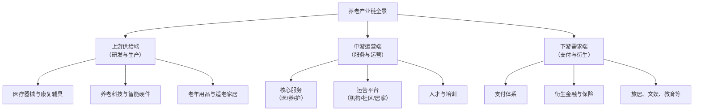

# 分析养老产业

**任务**: 银发经济市场机会
**时间**: 2026-06-05T00:54:43.434553

# **银发经济市场机会：养老产业深度分析报告**

## **报告概要**
本报告系统分析养老产业作为银发经济核心支柱的现状、机遇与挑战。内容涵盖市场规模与增长动力、产业链结构、细分领域深度剖析、竞争格局、政策环境、技术创新及未来趋势，并为不同参与者提供战略建议。报告旨在提供兼具宏观视野与微观洞察的高质量分析，为决策提供参考。

---

## **一、 市场现状与核心驱动力**

### **1.1 市场规模与增长潜力**
- **人口基础**：截至2023年末，中国60岁及以上人口已达2.97亿，占总人口的21.1%，且规模持续扩大。庞大的人口基数构成了全球最大的养老服务市场。
- **市场容量**：中国养老产业市场规模已突破**10万亿元人民币**，并预计在“十四五”期间（2021-2025年）保持年均复合增长率超过**15%**，至2030年市场规模有望达到**20万亿元**。
- **消费升级**：新一代老年人（60后、70后）拥有更高的教育水平、资产积累和消费意愿，需求正从生存型向发展型、享受型转变，推动产业价值提升。

### **1.2 核心驱动因素分析**
1.  **政策强力驱动**：“健康中国2030”、“十四五”国家老龄事业发展和养老服务体系规划等国家战略明确支持，各地在土地、税收、补贴方面出台具体措施。
2.  **技术赋能**：物联网、人工智能、大数据等技术与养老场景深度融合，催生智慧养老新模式，提升效率与体验。
3.  **家庭结构变迁**：“4-2-1”家庭结构普遍化，空巢、独居老人增多，传统家庭养老功能弱化，社会养老服务需求刚性化。
4.  **支付能力提升**：养老金连年上调、个人养老金制度落地、商业养老保险发展，老年人可支配收入增加，支付意愿与能力同步提高。

---

## **二、 养老产业链全景图与价值分布**

养老产业已形成覆盖全生命周期的复杂生态链，可分为三大板块：

**价值分布特征**：
- **上游**：技术密集型，利润较高，但需强大研发能力。**养老科技**（如健康监测设备、服务机器人）是增长最快的蓝海。
- **中游**：资本和运营密集型，是产业核心，也是最大的市场。**运营服务**能力是关键壁垒。
- **下游**：连接老年人真实需求，**支付体系**（长期护理保险）的完善是产业爆发的关键杠杆。

---

## **三、 细分市场深度剖析**

### **3.1 医养结合服务**
- **模式**：将医疗护理、康复训练与生活照料融合，主要形式包括养老机构内设医疗机构、医疗机构开设养老床位、医养机构签约合作。
- **机会点**：慢性病管理、术后康复、失能失智照护（尤其是认知症专业照护）需求巨大且支付意愿高。
- **挑战**：医疗与养老资质融合难、医保与长护险支付衔接不畅、专业医护人才极度匮乏。

### **3.2 社区与居家养老服务**
- **核心**：以社区为依托，为居家老人提供上门服务，符合90%中国老人的“原居安老”意愿。
- **服务内容**：助餐、助浴、助洁、助医、日间照料、紧急呼叫等。
- **商业模式创新**：**“平台+服务”**模式成为主流，通过数字化平台整合零散服务资源，实现规模化、标准化运营。政府购买服务是重要收入来源。

### **3.3 养老机构（机构养老）**
- **分层市场**：
    - **高端CCRC（持续照料退休社区）**：面向高净值人群，提供从独立生活到临终关怀的全周期服务，销售会员卡或产权/使用权，利润率高。
    - **中端养老院**：面向工薪阶层，以月费模式为主，是市场的主体。
    - **普惠/兜底型养老机构**：政府主导，保障特殊困难老人。
- **趋势**：轻资产运营（品牌与管理输出）、连锁化、精细化运营成为关键成功因素。

### **3.4 老年用品与辅具市场**
- **品类**：康复辅具（轮椅、助行器）、老年服饰、适老化家居改造、成人失禁用品等。
- **现状**：市场渗透率低，产品设计常忽视老年人真实需求，同质化严重。
- **机会**：通过用户研究进行产品创新，结合智能技术提升产品附加值（如智能药盒、防跌倒监测设备）。

### **3.5 养老金融与保险**
- **个人养老金账户**：制度落地，催生了养老储蓄、养老理财、养老基金等产品市场。
- **长期护理保险**：已在全国49个城市试点，是破解支付难题的核心，一旦全面推开将极大激活护理服务市场。
- **商业养老保险**：如“以房养老”反向抵押养老保险等探索。

---

## **四、 竞争格局与关键参与者**

1.  **传统地产/保险巨头**：如**泰康、中国人寿、万科、保利**等。优势在于雄厚资本、客户资源和品牌信任，多布局高端CCRC和大型养老社区。
2.  **专业养老服务运营商**：如**光大汇晨、九如城、国投健康**等。深耕社区、居家及机构服务，具备成熟的运营管理体系和人才梯队，是产业的中坚力量。
3.  **科技公司**：如**华为、科大讯飞、众多初创企业**。提供智慧养老整体解决方案、健康监测设备、服务机器人等，是技术创新的主力军。
4.  **国有企业**：凭借资源整合能力，承担普惠型、保障型养老服务供给，是稳定市场的压舱石。
5.  **外资企业**：如**欧葆庭（法）、凯健国际（美）**等，引进先进的护理理念和管理标准，主攻高端市场。

---

## **五、 政策环境与挑战**

### **5.1 政策红利与支持方向**
- **土地供给**：明确养老用地支持政策。
- **财政补贴**：针对建设、运营、床位提供多维度补贴。
- **税费减免**：对养老机构免征增值税、减征企业所得税等。
- **人才培养**：鼓励院校增设养老相关专业，提供岗位补贴。
- **鼓励创新**：支持“智慧养老”产品与服务纳入推广目录。

### **5.2 主要挑战**
1.  **盈利模式尚不清晰**：重资产投入、回报周期长、支付体系不健全导致多数企业盈利困难。
2.  **专业人才严重短缺**：护理员数量不足、年龄偏大、专业度低、流动性高，是行业最大瓶颈。
3.  **标准与监管待完善**：服务标准、质量评估、安全监管体系仍在建设中，市场秩序需规范。
4.  **观念转变需时间**：部分老年人及家庭对机构养老、付费服务仍有排斥心理。

---

## **六、 科技创新与未来趋势**

### **6.1 重塑产业的科技力量**
- **物联网与可穿戴设备**：实时监测生命体征、活动状态，实现风险预警（如跌倒监测、慢性病管理）。
- **人工智能与大数据**：进行健康风险预测、个性化服务推荐、运营效率优化。
- **机器人技术**：承担部分重复性照护工作（如清洁、送药），缓解人力不足。
- **虚拟现实（VR）与远程医疗**：用于康复训练、精神慰藉和远程问诊。

### **6.2 未来十年趋势展望**
1.  **居家养老数字化、智能化**：智慧居家解决方案成为主流，老年人在熟悉环境中享受科技带来的安全与便利。
2.  **社区成为关键枢纽**：社区嵌入式养老综合体（集托老、日间照料、医疗康复、文娱活动于一体）快速发展。
3.  **服务专业化与精细化**：细分领域（如认知症照护、术后康复、安宁疗护）出现专业品牌。
4.  **银发消费多元化**：从“为老”养老向“乐老”享老转变，老年旅游、教育、社交、时尚等精神文化消费快速增长。
5.  **产业融合深化**：“养老+医疗”、“养老+旅游”、“养老+教育”、“养老+金融”的跨界融合模式不断创新。

---

## **七、 战略建议**

### **对政府与监管机构**：
1.  **加快完善支付体系**：推动长期护理保险全国覆盖，探索多渠道筹资模式。
2.  **强化人才培养体系**：建立职业资格认证、在职培训、薪酬保障一体化的支撑体系。
3.  **细化标准与加强监管**：出台细分领域服务标准，建立动态信用监管平台。

### **对企业与投资者**：
1.  **精准定位，差异化竞争**：避免同质化，根据自身资源禀赋选择细分赛道（如高端CCRC、社区服务、技术解决方案）。
2.  **构建核心运营能力**：聚焦服务流程标准化、质量控制、人才培养等内功，打造可复制的商业模式。
3.  **拥抱科技，推动数字化转型**：将科技作为降本增效、创新服务的核心工具，而非噱头。
4.  **探索可持续的盈利模式**：结合“基础服务收费+增值服务收费+政府购买服务+产品销售”等多渠道收入。

### **对产品与服务设计者**：
1.  **深入用户研究**：真正理解不同年龄段、健康状态、经济条件老人的真实需求与痛点。
2.  **推动适老化设计**：从硬件环境到软件界面，全面贯彻适老化、无障碍理念。
3.  **关注“人”的体验**：在高效服务之外，给予老年人足够的尊重、关怀和情感连接。

---

## **结论**
养老产业是一片确定性极高的蓝海市场，但并非遍地黄金。其发展已从“政策驱动”转向“需求与科技双轮驱动”的新阶段。成功者必将是那些**深刻理解老年需求、具备强大运营效率、善用科技赋能、并能找到可持续商业模式**的长期主义者。未来十年，将是养老产业格局奠定、价值深度释放的关键时期，蕴含着创造巨大经济与社会价值的双重机遇。

---
**报告保存路径建议**：`/市场分析/银发经济/养老产业深度分析报告_日期.pdf`