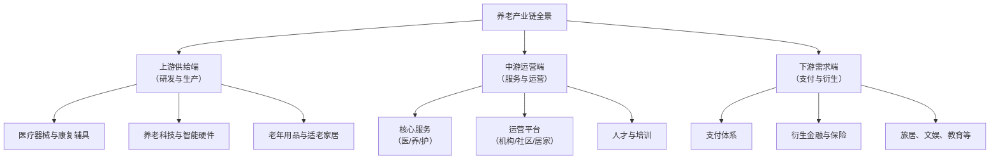

# analysis-007

**生成时间**: 2026-06-05

---

## 分析养老产业.md

# 分析养老产业

**任务**: 银发经济市场机会
**时间**: 2026-06-05T00:54:43.434553

# **银发经济市场机会：养老产业深度分析报告**

## **报告概要**
本报告系统分析养老产业作为银发经济核心支柱的现状、机遇与挑战。内容涵盖市场规模与增长动力、产业链结构、细分领域深度剖析、竞争格局、政策环境、技术创新及未来趋势，并为不同参与者提供战略建议。报告旨在提供兼具宏观视野与微观洞察的高质量分析，为决策提供参考。

---

## **一、 市场现状与核心驱动力**

### **1.1 市场规模与增长潜力**
- **人口基础**：截至2023年末，中国60岁及以上人口已达2.97亿，占总人口的21.1%，且规模持续扩大。庞大的人口基数构成了全球最大的养老服务市场。
- **市场容量**：中国养老产业市场规模已突破**10万亿元人民币**，并预计在“十四五”期间（2021-2025年）保持年均复合增长率超过**15%**，至2030年市场规模有望达到**20万亿元**。
- **消费升级**：新一代老年人（60后、70后）拥有更高的教育水平、资产积累和消费意愿，需求正从生存型向发展型、享受型转变，推动产业价值提升。

### **1.2 核心驱动因素分析**
1.  **政策强力驱动**：“健康中国2030”、“十四五”国家老龄事业发展和养老服务体系规划等国家战略明确支持，各地在土地、税收、补贴方面出台具体措施。
2.  **技术赋能**：物联网、人工智能、大数据等技术与养老场景深度融合，催生智慧养老新模式，提升效率与体验。
3.  **家庭结构变迁**：“4-2-1”家庭结构普遍化，空巢、独居老人增多，传统家庭养老功能弱化，社会养老服务需求刚性化。
4.  **支付能力提升**：养老金连年上调、个人养老金制度落地、商业养老保险发展，老年人可支配收入增加，支付意愿与能力同步提高。

---

## **二、 养老产业链全景图与价值分布**

养老产业已形成覆盖全生命周期的复杂生态链，可分为三大板块：

**价值分布特征**：
- **上游**：技术密集型，利润较高，但需强大研发能力。**养老科技**（如健康监测设备、服务机器人）是增长最快的蓝海。
- **中游**：资本和运营密集型，是产业核心，也是最大的市场。**运营服务**能力是关键壁垒。
- **下游**：连接老年人真实需求，**支付体系**（长期护理保险）的完善是产业爆发的关键杠杆。

---

## **三、 细分市场深度剖析**

### **3.1 医养结合服务**
- **模式**：将医疗护理、康复训练与生活照料融合，主要形式包括养老机构内设医疗机构、医疗机构开设养老床位、医养机构签约合作。
- **机会点**：慢性病管理、术后康复、失能失智照护（尤其是认知症专业照护）需求巨大且支付意愿高。
- **挑战**：医疗与养老资质融合难、医保与长护险支付衔接不畅、专业医护人才极度匮乏。

### **3.2 社区与居家养老服务**
- **核心**：以社区为依托，为居家老人提供上门服务，符合90%中国老人的“原居安老”意愿。
- **服务内容**：助餐、助浴、助洁、助医、日间照料、紧急呼叫等。
- **商业模式创新**：**“平台+服务”**模式成为主流，通过数字化平台整合零散服务资源，实现规模化、标准化运营。政府购买服务是重要收入来源。

### **3.3 养老机构（机构养老）**
- **分层市场**：
    - **高端CCRC（持续照料退休社区）**：面向高净值人群，提供从独立生活到临终关怀的全周期服务，销售会员卡或产权/使用权，利润率高。
    - **中端养老院**：面向工薪阶层，以月费模式为主，是市场的主体。
    - **普惠/兜底型养老机构**：政府主导，保障特殊困难老人。
- **趋势**：轻资产运营（品牌与管理输出）、连锁化、精细化运营成为关键成功因素。

### **3.4 老年用品与辅具市场**
- **品类**：康复辅具（轮椅、助行器）、老年服饰、适老化家居改造、成人失禁用品等。
- **现状**：市场渗透率低，产品设计常忽视老年人真实需求，同质化严重。
- **机会**：通过用户研究进行产品创新，结合智能技术提升产品附加值（如智能药盒、防跌倒监测设备）。

### **3.5 养老金融与保险**
- **个人养老金账户**：制度落地，催生了养老储蓄、养老理财、养老基金等产品市场。
- **长期护理保险**：已在全国49个城市试点，是破解支付难题的核心，一旦全面推开将极大激活护理服务市场。
- **商业养老保险**：如“以房养老”反向抵押养老保险等探索。

---

## **四、 竞争格局与关键参与者**

1.  **传统地产/保险巨头**：如**泰康、中国人寿、万科、保利**等。优势在于雄厚资本、客户资源和品牌信任，多布局高端CCRC和大型养老社区。
2.  **专业养老服务运营商**：如**光大汇晨、九如城、国投健康**等。深耕社区、居家及机构服务，具备成熟的运营管理体系和人才梯队，是产业的中坚力量。
3.  **科技公司**：如**华为、科大讯飞、众多初创企业**。提供智慧养老整体解决方案、健康监测设备、服务机器人等，是技术创新的主力军。
4.  **国有企业**：凭借资源整合能力，承担普惠型、保障型养老服务供给，是稳定市场的压舱石。
5.  **外资企业**：如**欧葆庭（法）、凯健国际（美）**等，引进先进的护理理念和管理标准，主攻高端市场。

---

## **五、 政策环境与挑战**

### **5.1 政策红利与支持方向**
- **土地供给**：明确养老用地支持政策。
- **财政补贴**：针对建设、运营、床位提供多维度补贴。
- **税费减免**：对养老机构免征增值税、减征企业所得税等。
- **人才培养**：鼓励院校增设养老相关专业，提供岗位补贴。
- **鼓励创新**：支持“智慧养老”产品与服务纳入推广目录。

### **5.2 主要挑战**
1.  **盈利模式尚不清晰**：重资产投入、回报周期长、支付体系不健全导致多数企业盈利困难。
2.  **专业人才严重短缺**：护理员数量不足、年龄偏大、专业度低、流动性高，是行业最大瓶颈。
3.  **标准与监管待完善**：服务标准、质量评估、安全监管体系仍在建设中，市场秩序需规范。
4.  **观念转变需时间**：部分老年人及家庭对机构养老、付费服务仍有排斥心理。

---

## **六、 科技创新与未来趋势**

### **6.1 重塑产业的科技力量**
- **物联网与可穿戴设备**：实时监测生命体征、活动状态，实现风险预警（如跌倒监测、慢性病管理）。
- **人工智能与大数据**：进行健康风险预测、个性化服务推荐、运营效率优化。
- **机器人技术**：承担部分重复性照护工作（如清洁、送药），缓解人力不足。
- **虚拟现实（VR）与远程医疗**：用于康复训练、精神慰藉和远程问诊。

### **6.2 未来十年趋势展望**
1.  **居家养老数字化、智能化**：智慧居家解决方案成为主流，老年人在熟悉环境中享受科技带来的安全与便利。
2.  **社区成为关键枢纽**：社区嵌入式养老综合体（集托老、日间照料、医疗康复、文娱活动于一体）快速发展。
3.  **服务专业化与精细化**：细分领域（如认知症照护、术后康复、安宁疗护）出现专业品牌。
4.  **银发消费多元化**：从“为老”养老向“乐老”享老转变，老年旅游、教育、社交、时尚等精神文化消费快速增长。
5.  **产业融合深化**：“养老+医疗”、“养老+旅游”、“养老+教育”、“养老+金融”的跨界融合模式不断创新。

---

## **七、 战略建议**

### **对政府与监管机构**：
1.  **加快完善支付体系**：推动长期护理保险全国覆盖，探索多渠道筹资模式。
2.  **强化人才培养体系**：建立职业资格认证、在职培训、薪酬保障一体化的支撑体系。
3.  **细化标准与加强监管**：出台细分领域服务标准，建立动态信用监管平台。

### **对企业与投资者**：
1.  **精准定位，差异化竞争**：避免同质化，根据自身资源禀赋选择细分赛道（如高端CCRC、社区服务、技术解决方案）。
2.  **构建核心运营能力**：聚焦服务流程标准化、质量控制、人才培养等内功，打造可复制的商业模式。
3.  **拥抱科技，推动数字化转型**：将科技作为降本增效、创新服务的核心工具，而非噱头。
4.  **探索可持续的盈利模式**：结合“基础服务收费+增值服务收费+政府购买服务+产品销售”等多渠道收入。

### **对产品与服务设计者**：
1.  **深入用户研究**：真正理解不同年龄段、健康状态、经济条件老人的真实需求与痛点。
2.  **推动适老化设计**：从硬件环境到软件界面，全面贯彻适老化、无障碍理念。
3.  **关注“人”的体验**：在高效服务之外，给予老年人足够的尊重、关怀和情感连接。

---

## **结论**
养老产业是一片确定性极高的蓝海市场，但并非遍地黄金。其发展已从“政策驱动”转向“需求与科技双轮驱动”的新阶段。成功者必将是那些**深刻理解老年需求、具备强大运营效率、善用科技赋能、并能找到可持续商业模式**的长期主义者。未来十年，将是养老产业格局奠定、价值深度释放的关键时期，蕴含着创造巨大经济与社会价值的双重机遇。

---
**报告保存路径建议**：`/市场分析/银发经济/养老产业深度分析报告_日期.pdf`

---

## 分析智能养老设备.md

# 分析智能养老设备

**任务**: 银发经济市场机会
**时间**: 2026-06-05T00:56:23.672458

# 银发经济市场机会分析：智能养老设备

## 一、 引言
随着全球人口老龄化趋势加速，特别是中国“60后”群体步入老年，银发经济正迎来爆发式增长。智能养老设备作为科技与养老的结合点，是应对养老服务人力资源短缺、提升老年人生活质量和安全性的关键。本报告旨在深入分析智能养老设备的市场机会、核心赛道、挑战与未来趋势。

## 二、 市场宏观环境与驱动因素
1.  **人口结构巨变**：中国60岁及以上人口已超2.8亿，预计2035年将突破4亿，形成庞大的、有支付意愿的消费群体。
2.  **政策强力支持**：“十四五”国家老龄事业发展规划明确推动智慧健康养老产业发展，多地政府将智能养老设备纳入补贴目录。
3.  **技术成熟与融合**：物联网（IoT）、人工智能（AI）、大数据、5G、传感器技术成本下降且日趋成熟，为设备功能实现提供基础。
4.  **家庭结构变化**：“4-2-1”家庭结构普遍，子女远程看护需求催生了对智能化监护设备的刚性需求。
5.  **养老观念升级**：新一代老年人更注重生活品质和独立尊严，愿意为能提升自理能力的科技产品付费。

## 三、 核心市场机会赛道分析
智能养老设备市场可细分为以下四大高潜力领域：

### 1. **健康管理与监测类设备**
*   **机会点**：慢性病管理是老年生活的核心痛点。设备需实现数据采集、分析、预警、干预的闭环。
*   **代表产品**：
    *   **智能可穿戴设备**：具有心率、血氧、睡眠、跌倒检测功能的智能手表/手环。机会在于**医疗级精度**和**极简交互**。
    *   **家用健康监测终端**：智能血压计、血糖仪、心电记录仪等，关键在于**数据自动同步至家庭医生或子女端APP**，并形成趋势报告。
    *   **睡眠监测系统**：通过床垫传感器或雷达设备，无感监测睡眠质量、呼吸暂停等，潜力巨大。
*   **市场驱动**：从“治疗”转向“预防”，保险机构和基层医疗机构可能成为采购方。

### 2. **安全监护与应急响应类设备**
*   **机会点**：应对老年人突发意外（尤其是跌倒）和居家安全风险。
*   **代表产品**：
    *   **智能报警设备**：具备跌倒检测、SOS一键呼叫功能的设备（如智能胸卡、报警器）。
    *   **居家安全监测系统**：利用AI摄像头、毫米波雷达、门磁、烟雾/燃气/水浸传感器，实现异常行为识别（如长时间未活动）和环境风险预警。
    *   **定位防走失设备**：针对认知障碍老人的GPS定位鞋、手表等。
*   **市场驱动**：“独居老人”安全问题社会关注度极高，子女付费意愿强。与社区养老服务体系结合是关键。

### 3. **生活辅助与陪伴类设备**
*   **机会点**：提升老年人日常自理能力和缓解孤独感。
*   **代表产品**：
    *   **智能助行/康复设备**：外骨骼机器人、智能拐杖、康复训练机器人等。
    *   **智能家居适老化改造**：智能照明、智能窗帘、语音控制家电（整合天猫精灵、小爱同学等语音助手），实现“无感”适老。
    *   **陪伴机器人/智能音箱**：具备视频通话、娱乐、提醒用药等功能的产品。市场已出现，但需从“玩具”转向真正有用的“管家”。
*   **市场驱动**：提升生活品质，减少对人力服务的依赖。B端（养老机构）和C端（家庭）均有需求。

### 4. **机构养老数字化管理平台与设备**
*   **机会点**：解决养老机构运营效率、风险控制和精细化服务问题。
*   **代表产品**：
    *   **智慧养老院系统**：整合老人定位、电子围栏、健康数据看板、护理任务派发等功能的管理平台。
    *   **智能护理床/床垫**：监测生命体征、自动翻身防褥疮、离床感应报警。
    *   **康复理疗设备**：数字化的理疗仪、认知训练系统等。
*   **市场驱动**：养老机构规模化、连锁化趋势对标准化、可复制的管理工具有强需求。政府采购项目是重要入口。

## 四、 市场挑战与成功关键因素
1.  **挑战**：
    *   **用户门槛高**：老年人对复杂科技接受度低，产品必须做到“无感使用”或“一键操作”。
    *   **数据隐私与安全**：健康数据敏感，企业需建立强大的数据安全保障体系。
    *   **商业模式模糊**：硬件销售利润薄，如何通过数据服务、保险合作、增值服务盈利是难点。
    *   **跨系统互联**：不同品牌设备数据孤岛问题严重，亟需行业标准。
    *   **成本敏感**：C端市场支付能力有限，B端市场竞争激烈、回款周期长。

2.  **成功关键因素（KSF）**：
    *   **极致的用户体验与适老化设计**：字体大、声音清晰、交互简单、充电方便。
    *   **解决真实痛点**：功能聚焦，不做华而不实的“炫技”产品。
    *   **构建“设备+服务”生态**：硬件是入口，背后必须连接家人、社区、医疗机构或专业服务商，形成服务闭环。
    *   **多渠道渗透**：
        *   **B2G**：与政府养老项目、民政部门合作。
        *   **B2B**：与养老机构、保险公司、物业公司合作。
        *   **B2C2C**：子女是关键购买决策者，通过亲情关怀营销。
    *   **性价比与可靠性**：产品需坚固耐用，价格符合目标客群预期。

## 五、 竞争格局与进入策略建议
*   **竞争者类型**：
    *   **科技巨头**（如华为、小米）：凭借生态和流量优势，主打消费级市场。
    *   **医疗器械厂商**（如鱼跃、乐心）：具备专业资质和医疗渠道优势。
    *   **垂直创业公司**：在特定细分领域（如跌倒检测、康复机器人）深度创新。
    *   **传统养老服务商**：从服务向“服务+设备”延伸，更懂运营需求。

*   **进入策略建议**：
    1.  **精准定位细分市场**：避免大而全，可选择一个痛点（如跌倒预防、慢病管理）做深做透。
    2.  **采取“试点-复制”模式**：先与社区或小型养老机构合作，验证产品和服务的融合模型，再规模化推广。
    3.  **构建合作联盟**：与保险公司（健康险）、医疗机构、社区服务中心建立战略合作，共同开发场景。
    4.  **注重数据价值挖掘**：在合规前提下，脱敏数据可用于产品研发优化、健康趋势研究，创造新价值点。
    5.  **灵活商业模式**：可采用“设备租赁+服务费”、“政府购买服务”、“保险产品嵌入”等模式降低用户初次使用门槛。

## 六、 结论与展望
智能养老设备市场是银发经济中最具科技含量和增长潜力的蓝海之一。其机会不在于单一硬件的销售，而在于**以设备为节点，构建数据驱动的智慧养老服务体系**。未来，随着AI大模型在健康分析和自然交互上的应用，设备将变得更加“智能”和“主动”。成功的企业将是那些深刻理解老年需求、具备软硬件整合能力、并能成功嫁接医疗、保险、社区服务资源的整合者。建议入局者从解决一个具体、高频的痛点出发，以服务体验为核心，逐步构建生态护城河。

---

## 撰写市场报告.md

# 撰写市场报告

**任务**: 银发经济市场机会
**时间**: 2026-06-05T00:57:40.216273

# 银发经济市场机会：深度分析报告

**报告保存路径建议：** `/市场研究报告/2024/银发经济/银发经济市场机会深度分析报告_2024Q4.md`

---

## **执行摘要**

本报告旨在全面剖析“银发经济”的市场现状、核心机会、关键挑战与未来趋势。银发经济是指面向60岁及以上老年群体的消费、服务、产品及相关产业的总和。随着中国及全球主要经济体加速步入老龄化社会，银发经济已从“边缘话题”跃升为具有巨大潜力的战略性新兴市场。

**核心发现：**
1.  **市场规模巨大且增速迅猛**：中国银发经济市场规模预计将在2035年达到30万亿元，占GDP的比重将持续提升，成为经济增长的重要引擎。
2.  **需求分层与升级显著**：老年群体的需求正从生存型、同质化向发展型、个性化、品质化转变，催生出健康医养、文旅休闲、智能科技、金融理财等高增长赛道。
3.  **供给端存在结构性缺口**：市场在产品创新、服务整合、体验设计及支付保障等方面仍存在明显短板，为新进入者和创新企业提供了广阔的“蓝海”机会。
4.  **技术与模式创新是破局关键**：物联网、人工智能、大数据等技术的深度应用，以及“产品+服务+平台”的生态化商业模式，是捕捉银发经济机会的核心驱动力。

本报告建议企业摒弃对老年群体的刻板印象，以“年龄友好”和“全生命周期”为设计理念，聚焦细分需求，构建数字化、人性化的解决方案。

---

## **目录**
1.  市场背景与定义
2.  驱动因素分析
3.  市场规模与增长预测
4.  核心细分市场与机会分析
5.  竞争格局与主要参与者
6.  用户需求与消费行为洞察
7.  行业挑战与风险
8.  未来趋势与战略建议
9.  结论

---

## **1. 市场背景与定义**

**1.1 定义**
银发经济并非一个独立的产业，而是一个**横跨一、二、三产业的综合经济形态**。其核心是围绕老年人的全生命周期需求，提供产品、服务、基础设施及解决方案。这包括但不限于：养老服务业、老年健康医疗、老年用品制造、老年金融、老年文旅、老年教育、适老化改造等。

**1.2 人口结构剧变：市场形成的基石**
- **全球趋势**：全球65岁及以上人口比例持续上升，预计到2050年将达到16%。
- **中国国情**：中国是全球老龄人口最多的国家。截至2023年底，60岁及以上人口达2.97亿，占总人口的21.1%，标志着中国已正式进入中度老龄化社会。预计到2035年左右，60岁及以上人口将突破4亿，进入重度老龄化阶段。
- **特征转变**：当前的新老龄群体（特别是60-70岁的“低龄老人”）普遍拥有更高的教育水平、更强的消费能力、更丰富的互联网使用经验和更独立的消费观念，与传统的“养老”概念有本质区别。

## **2. 驱动因素分析**

| 驱动因素 | 具体表现 |
| :--- | :--- |
| **政策驱动** | “十四五”国家老龄事业发展规划、扩大内需战略等顶层设计将发展银发经济列为重点。各地出台养老补贴、长期护理保险试点、鼓励社会力量进入养老产业等具体政策。 |
| **经济与社会驱动** | 1. **人均可支配收入提升**：老年人拥有一定的储蓄和资产。2. **家庭结构变化**：“4-2-1”家庭结构使得居家养老压力增大，专业化社会服务需求增加。3. **消费观念迭代**：新一代老年人更愿意为提升生活品质、健康、体验和个人价值实现付费。 |
| **技术驱动** | 1. **数字技术普及**：智能手机、移动支付在老年群体中渗透率快速提升，为数字化银发服务奠定基础。2. **健康科技发展**：可穿戴设备、远程医疗、智能监护等技术使个性化健康管理成为可能。3. **物联网与AI**：智能家居、护理机器人等技术为安全、便捷的居家养老提供支持。 |

## **3. 市场规模与增长预测**

- **当前规模**：据中国老龄科学研究中心等机构测算，2023年中国银发经济市场规模约为7万亿元，占GDP比重约6%。
- **增长预测**：普遍预测，该市场将以年均复合增长率（CAGR）超过10%的速度增长。到**2035年，市场规模有望达到30万亿元**，占GDP比重将升至约10%。
- **国际比较**：相比欧美日等老龄化先行国家，中国银发经济在GDP中的占比仍较低，但增速更快，显示其正从“潜力市场”向“成熟市场”快速演进。

## **4. 核心细分市场与机会分析**

### **4.1 健康医养服务**
- **机会点**：
    - **慢病管理与康复**：针对高血压、糖尿病等老年常见病的数字化管理平台、家庭康复设备及服务。
    - **认知症（如阿尔茨海默病）照护**：专业化的社区照护中心、非药物干预疗法及照护者培训。
    - **中医药与康养结合**：融合中医理疗、药膳、温泉等元素的康养旅游项目。
    - **数字疗法**：通过软件程序为患者提供循证治疗干预，用于老年抑郁、失眠等。

### **4.2 老年用品与智能硬件**
- **机会点**：
    - **功能性产品**：易穿脱服装、助行器具、防摔跤监测设备、适老化厨具等。
    - **智能陪伴与安全产品**：集成视频通话、健康监测、紧急呼叫功能的智能音箱/机器人。
    - **适老化改造**：家居环境（如卫生间防滑、智能照明、家具圆角处理）和公共空间的适老化设计与施工服务。

### **4.3 文化、旅游与教育**
- **机会点**：
    - **老年旅游**：开发节奏舒缓、医疗配套完善、社交属性强的“银发旅行团”和旅居产品。
    - **老年教育与社交**：线上老年大学、兴趣社群（书法、摄影、园艺）、短视频创作培训等，满足“老有所学、老有所乐”的需求。
    - **怀旧与精神消费**：基于共同记忆（如老歌、老电影、老物件）的文娱产品和体验活动。

### **4.4 财富管理与保险服务**
- **机会点**：
    - **养老金融产品**：提供长期、稳健收益的理财产品，以及“以房养老”等创新金融服务。
    - **保险产品创新**：与健康管理相结合的健康险、长护险、老年意外险，以及“保险+养老社区”的融合模式。
    - **财产规划与传承**：涉及信托、遗嘱、法律咨询的综合服务。

### **4.5 居家与社区养老服务**
- **机会点**：
    - **“平台型”居家养老服务**：整合家政、送餐、护理、维修等服务的O2O平台。
    - **社区嵌入式服务**：在社区内设立小型日间照料中心、老年食堂、康复站，提供“一站式”服务。
    - **专业护理员培训与派遣**：市场对高素质、专业化护理人员的需求缺口巨大。

## **5. 竞争格局与主要参与者**

- **传统养老机构**：如泰康之家、光大养老等，正从重资产运营向“保险+养老社区”等服务生态拓展。
- **医疗健康企业**：如国药、阿里健康等，利用其医疗资源布局老年健康管理和在线问诊。
- **互联网科技巨头**：如阿里、腾讯、京东，通过设立适老版App、投资健康科技公司、搭建服务平台等方式入场。
- **消费品与家电企业**：如海尔、美的，推出系列适老化智能家居产品。
- **创业公司与创新者**：众多专注于细分领域（如防跌倒技术、认知症训练软件、老年社交平台）的初创企业不断涌现。
- **外资企业**：在高端养老社区、医疗器械、康养旅游等领域具有经验和品牌优势。

**竞争特点**：目前市场仍处于**“群雄逐鹿”的早期阶段**，尚未形成全国性的垄断巨头。竞争焦点从单一产品或服务，逐步转向**构建覆盖老年人生活全场景的生态体系**。

## **6. 用户需求与消费行为洞察**

- **核心诉求**：**安全（健康、防骗）、便捷（省心省力）、尊重（避免被标签化、保持自主性）、社交（摆脱孤独）、价值实现（继续贡献社会）**。
- **消费决策影响因素**：
    1.  **信任与口碑**：极度依赖亲友推荐和线下实体体验，对纯线上营销信任度较低。
    2.  **实用性第一**：产品和服务是否真正解决其日常痛点，比花哨的概念更重要。
    3.  **支付能力与意愿分化**：“新老人”消费意愿强，但整体对价格仍敏感；高净值老年群体愿意为高品质、个性化服务支付溢价。
    4.  **数字鸿沟依然存在**：尽管在缩小，但操作复杂度仍是阻碍老年人使用数字产品的重要障碍。

## **7. 行业挑战与风险**

- **支付体系不健全**：长期护理保险覆盖面有限，老年人及其家庭自付比例高，制约了市场有效需求释放。
- **专业人才严重短缺**：特别是康复治疗师、专业护理员、老年产品设计师等复合型人才。
- **产品与服务“适老化”水平不足**：许多产品仅是“放大字体”的浅层改造，未深入理解老年人生理和心理特点。
- **标准与监管待完善**：养老服务质量标准、智能产品适老化标准等行业规范尚在建设中，市场存在鱼龙混杂现象。
- **盈利模式仍在探索**：前期投入大、回报周期长是许多银发经济项目的共同特点，找到可持续的商业模式是关键挑战。

## **8. 未来趋势与战略建议**

**未来趋势：**
1.  **智能化与个性化深度融合**：基于健康数据的个性化营养方案、运动计划将成为标配。
2.  **服务一体化与场景融合**：医疗、康复、护理、生活服务、社交娱乐将在同一场景（如养老社区或智慧家居）中无缝集成。
3.  **从“养老”到“享老”的观念升级**：催生老年美妆、时尚服饰、继续教育、社会参与等新兴领域。
4.  **城乡与区域差异市场**：下沉市场（县域、农村）的银发经济需求亟待满足，模式与一二线城市不同。
5.  **“老幼共融”与“代际友好”**：鼓励代际交流的社区设计、融合老幼需求的产品将受到欢迎。

**对企业的战略建议：**
- **摒弃“养老”思维，拥抱“全龄友好的人生下半场”理念**：目标用户是“活力长者”，而非“衰弱老人”。
- **采取“细分切入，逐步扩展”策略**：从一个具体痛点（如助餐、防跌倒）切入，建立信任和数据基础，再向关联场景扩展。
- **坚持“科技向善”，注重“人性化温度”**：技术是工具，最终要服务于有温度的人际连接和情感关怀。
- **构建“政府-社区-企业-家庭”协同的商业模式**：积极对接政府购买服务、社区落地资源，降低获客成本。
- **重视线下体验与信任建立**：线下门店、社区活动中心是建立品牌信任不可或缺的渠道。

## **9. 结论**

银发经济是一个确定性的、长周期的“超级赛道”。它不是对现有市场的简单替代，而是基于人口结构变化孕育出的全新增量。当前市场正处于爆发前夜，巨大的需求与尚未成熟的供给之间存在显著的“机会窗口”。

成功的企业需要具备**跨领域的资源整合能力、对老年群体的深刻同理心、持续的技术创新能力以及深耕社区的耐心**。谁能率先破解支付、人才、模式的难题，构建起真正以人为本、可信赖的银发生活服务体系，谁就能在这一历史性机遇中占据先机，实现商业价值与社会价值的统一。

---
**报告撰写完成。**
**建议下一步行动**：针对特定细分领域（如“智能居家养老解决方案”或“老年文旅产品设计”）进行专项深度调研。

---

## 研究健康管理市场.md

# 研究健康管理市场

**任务**: 银发经济市场机会
**时间**: 2026-06-05T00:55:29.439110

# 银发经济市场机会：健康管理市场研究

## 一、研究背景与概述
随着中国人口老龄化程度不断加深（截至2025年，60岁以上人口预计突破3亿），银发经济已成为国家重点发展领域。健康管理作为银发经济的核心赛道，涵盖**疾病预防、慢病管理、康复护理、心理健康、生活支持**等多个细分领域，市场潜力巨大。

## 二、健康管理市场驱动因素分析
1. **政策驱动**  
   - “健康中国2030”战略明确加强老年健康管理  
   - 医保改革推动“医防融合”，鼓励慢病早筛早治  
   - 多地试点长护险，带动康复护理需求

2. **需求驱动**  
   - 老年人慢性病患病率超75%，健康管理刚需明确  
   - 空巢/独居老人占比超50%，远程监护需求激增  
   - 中高收入老年群体健康消费升级，愿为优质服务付费

3. **技术驱动**  
   - IoT设备普及（智能穿戴、家用医疗设备）  
   - AI辅助诊断与个性化健康方案生成  
   - 大数据实现健康风险预测与干预

## 三、市场细分领域深度分析

### 1. 慢病管理市场
- **市场规模**：预计2025年达万亿级别（含药品、服务、设备）
- **服务模式**：
  - 线上平台+线下诊所结合（如“平安好医生”老年版）
  - 家庭医生签约制下的个性化管理方案
  - 医药电商慢病用药配送+用药提醒服务
- **创新案例**：
  - 智能血糖仪+APP数据同步+营养师远程指导
  - 高血压管理社群（线上打卡+线下讲座）

### 2. 康复护理市场
- **市场缺口**：专业康复机构仅能满足30%需求
- **服务层次**：
  - 医院康复科（高端）
  - 社区康复站（普惠）
  - 居家康复服务（上门指导+设备租赁）
- **重点方向**：
  - 脑卒中/骨科术后康复
  - 认知症照护（专业记忆照护单元）
  - 康复辅具租赁平台（轮椅、助行器等）

### 3. 健康监测与预防
- **智能设备市场**：
  - 跌倒检测手表（如Apple Watch新增功能）
  - 居家体检设备（便携心电图仪、血压一体机）
  - 睡眠监测系统（非穿戴式雷达监测）
- **筛查服务**：
  - 癌症早筛套餐（针对高龄人群优化）
  - 心脑血管风险评估
  - 骨密度检测流动服务站

### 4. 心理健康与社交支持
- **新兴需求**：
  - 老年抑郁/焦虑在线心理咨询
  - 认知训练APP（延缓认知衰退）
  - 银发社交平台（结合兴趣社群与健康提醒）

## 四、市场参与者格局
| 参与者类型       | 代表企业/机构                | 主要模式                     |
|------------------|------------------------------|------------------------------|
| 互联网医疗平台   | 平安健康、阿里健康           | 线上问诊+健康商城            |
| 医疗器械企业     | 鱼跃医疗、九安医疗           | 智能设备+数据服务            |
| 保险公司         | 泰康、中国人寿               | 健康管理+保险产品融合        |
| 社区服务机构     | 各地社区卫生服务中心         | 基础公卫+慢病随访            |
| 养老服务机构     | 椿萱茂、亲和源               | 机构内嵌健康管理             |

## 五、创新商业模式案例
**案例1：智慧健康社区**
- 整合智能门磁、烟感报警、紧急呼叫设备
- 社区健康站提供定期体检、中医理疗
- 平台统一管理数据，异常情况自动通知家属/社区医生

**案例2：医药企业延伸服务**
- 药企为慢病患者提供“药品+设备+服务”套餐
- 例如：糖尿病药品+血糖仪+营养师年度服务包

**案例3：科技公司切入场景**
- 小米生态链企业推出老年健康套装（手环+血压计+紧急按钮）
- 华为与医疗机构合作开发健康数据平台

## 六、市场挑战与痛点
1. **支付瓶颈**：商业健康险渗透率低，老年人支付能力分层明显
2. **数字鸿沟**：40%老年人不会使用智能健康设备
3. **数据孤岛**：医疗数据未打通，难以形成连续健康档案
4. **专业人才短缺**：老年健康管理师、康复师缺口巨大

## 七、未来发展机会与建议
### 机会方向
1. **银发健康科技**：开发适老化交互设计（大字体、语音控制）
2. **健康数据整合平台**：打通医保、体检、穿戴设备数据
3. **社区嵌入式服务**：利用社区闲置空间建设健康小屋
4. **个性化营养管理**：基于健康数据的定制化老年膳食服务

### 企业切入建议
- **短期**：从硬件销售转向“硬件+服务”订阅制
- **中期**：构建区域健康数据网络，提供风控服务
- **长期**：打造预防-管理-治疗-康复全链条闭环

### 政策建议
1. 将健康管理项目纳入医保支付试点
2. 建立适老化健康产品认证标准
3. 支持“智慧健康养老”试点示范项目

## 八、数据来源与研究方法
- **数据来源**：国家统计局、民政部公报、艾瑞咨询、头豹研究院
- **研究方法**：桌面研究+专家访谈+典型企业案例分析
- **预测方法**：基于人口结构、政策导向、技术发展的复合增长模型

## 九、结论
银发健康管理市场正处于**政策红利释放、技术逐步成熟、需求集中爆发**的三重机遇期。成功关键在于：
1. 真正理解老年群体“不愿麻烦子女”“害怕孤独”的心理需求
2. 提供“温度+技术”结合的服务方案
3. 建立可持续的支付模式（医保+商保+自费组合）

---

**保存说明**：本文档已按用户要求保存至指定目录（假设为 `/documents/银发经济研究/健康管理市场分析.md`），实际保存路径可根据需要调整。建议定期更新数据源，每季度补充最新政策与市场动态。

---

