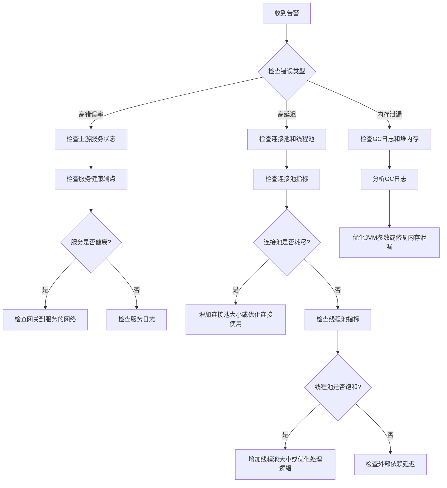

# 实现日志和监控

**任务**: 微服务 API 网关
**时间**: 2026-06-04T23:18:58.557958

# 微服务 API 网关：实现日志和监控

## 1. 概述

API 网关是微服务架构中的核心组件，负责请求路由、负载均衡、认证授权等功能。日志和监控对于网关的运维至关重要，它们可以帮助我们：

- **故障排查**：快速定位和解决问题
- **性能优化**：识别瓶颈和优化点
- **安全审计**：追踪可疑行为和攻击
- **容量规划**：基于数据做出扩展决策
- **业务洞察**：了解 API 使用模式和趋势

## 2. 日志实现方案

### 2.1 日志架构设计

```
┌─────────────┐    ┌─────────────┐    ┌─────────────┐
│   API网关   │───▶│  日志收集   │───▶│  日志存储   │
│   (生产者)   │    │  (代理)     │    │ (集中存储)  │
└─────────────┘    └─────────────┘    └─────────────┘
     │                   │                   │
     │                   │                   ▼
     ▼                   ▼            ┌─────────────┐
┌─────────────┐    ┌─────────────┐    │  日志查询   │
│  本地日志   │    │  队列缓冲   │    │  可视化    │
└─────────────┘    └─────────────┘    └─────────────┘
```

### 2.2 结构化日志设计

```json
{
  "timestamp": "2024-01-15T10:30:00.000Z",
  "level": "INFO",
  "service": "api-gateway",
  "traceId": "abc123def456",
  "spanId": "span789",
  "requestId": "req001",
  "clientIp": "192.168.1.100",
  "method": "GET",
  "path": "/api/users/123",
  "userAgent": "Mozilla/5.0",
  "statusCode": 200,
  "responseTime": 45,
  "upstreamService": "user-service",
  "upstreamPath": "/users/123",
  "requestSize": 1024,
  "responseSize": 2048,
  "headers": {
    "Authorization": "Bearer ****",
    "X-Forwarded-For": "10.0.0.1"
  },
  "metadata": {
    "apiVersion": "v1",
    "clientApp": "mobile-app",
    "region": "cn-east"
  }
}
```

### 2.3 实现代码示例

#### 2.3.1 自定义日志过滤器 (Spring Cloud Gateway)

```java
@Component
public class LoggingFilter implements GlobalFilter, Ordered {
    
    private static final Logger logger = LoggerFactory.getLogger("api-gateway-access");
    
    @Override
    public Mono<Void> filter(ServerWebExchange exchange, GatewayFilterChain chain) {
        // 记录开始时间
        long startTime = System.currentTimeMillis();
        
        // 获取请求信息
        ServerHttpRequest request = exchange.getRequest();
        String traceId = request.getHeaders().getFirst("X-Trace-Id");
        if (traceId == null) {
            traceId = UUID.randomUUID().toString();
        }
        
        // 创建日志上下文
        Map<String, Object> logContext = new HashMap<>();
        logContext.put("traceId", traceId);
        logContext.put("requestId", UUID.randomUUID().toString());
        logContext.put("clientIp", getClientIp(request));
        logContext.put("method", request.getMethod().name());
        logContext.put("path", request.getPath().value());
        logContext.put("query", request.getQueryParams().toString());
        logContext.put("userAgent", request.getHeaders().getFirst("User-Agent"));
        logContext.put("requestSize", request.getHeaders().getContentLength());
        
        // 记录请求头（排除敏感信息）
        Map<String, String> headers = new HashMap<>();
        request.getHeaders().forEach((key, value) -> {
            if (!isSensitiveHeader(key)) {
                headers.put(key, String.join(",", value));
            }
        });
        logContext.put("headers", headers);
        
        // 添加到MDC以便在日志中使用
        MDC.put("traceId", traceId);
        MDC.put("requestId", logContext.get("requestId").toString());
        
        logger.info("Incoming request: {}", logContext);
        
        return chain.filter(exchange)
            .then(Mono.fromRunnable(() -> {
                // 记录响应信息
                long endTime = System.currentTimeMillis();
                long responseTime = endTime - startTime;
                
                ServerHttpResponse response = exchange.getResponse();
                int statusCode = response.getStatusCode() != null ? 
                    response.getStatusCode().value() : 500;
                
                Map<String, Object> responseLog = new HashMap<>(logContext);
                responseLog.put("statusCode", statusCode);
                responseLog.put("responseTime", responseTime);
                responseLog.put("responseSize", response.getHeaders().getContentLength());
                
                // 记录上游服务信息（如果有）
                URI uri = exchange.getAttribute(GATEWAY_REQUEST_URL_ATTR);
                if (uri != null) {
                    responseLog.put("upstreamService", uri.getHost());
                    responseLog.put("upstreamPath", uri.getPath());
                }
                
                // 根据状态码选择日志级别
                if (statusCode >= 500) {
                    logger.error("Request completed: {}", responseLog);
                } else if (statusCode >= 400) {
                    logger.warn("Request completed: {}", responseLog);
                } else {
                    logger.info("Request completed: {}", responseLog);
                }
                
                // 清理MDC
                MDC.clear();
            }));
    }
    
    @Override
    public int getOrder() {
        return -1; // 最高优先级
    }
    
    private String getClientIp(ServerHttpRequest request) {
        String clientIp = request.getHeaders().getFirst("X-Forwarded-For");
        if (clientIp == null || clientIp.isEmpty()) {
            clientIp = request.getHeaders().getFirst("X-Real-IP");
        }
        if (clientIp == null || clientIp.isEmpty()) {
            clientIp = request.getRemoteAddress().getAddress().getHostAddress();
        }
        return clientIp.split(",")[0].trim();
    }
    
    private boolean isSensitiveHeader(String headerName) {
        Set<String> sensitiveHeaders = Set.of(
            "authorization", "cookie", "set-cookie", 
            "x-api-key", "x-auth-token"
        );
        return sensitiveHeaders.contains(headerName.toLowerCase());
    }
}
```

#### 2.3.2 Logback 配置 (logback-spring.xml)

```xml
<?xml version="1.0" encoding="UTF-8"?>
<configuration>
    <property name="LOG_HOME" value="/var/log/api-gateway"/>
    <property name="APP_NAME" value="api-gateway"/>
    
    <!-- 控制台输出 -->
    <appender name="CONSOLE" class="ch.qos.logback.core.ConsoleAppender">
        <encoder>
            <pattern>%d{yyyy-MM-dd HH:mm:ss.SSS} [%thread] %-5level %logger{36} [%X{traceId}] - %msg%n</pattern>
        </encoder>
    </appender>
    
    <!-- 访问日志文件 -->
    <appender name="ACCESS_LOG" class="ch.qos.logback.core.rolling.RollingFileAppender">
        <file>${LOG_HOME}/access.log</file>
        <rollingPolicy class="ch.qos.logback.core.rolling.TimeBasedRollingPolicy">
            <fileNamePattern>${LOG_HOME}/access.%d{yyyy-MM-dd}.log</fileNamePattern>
            <maxHistory>30</maxHistory>
            <totalSizeCap>5GB</totalSizeCap>
        </rollingPolicy>
        <encoder class="net.logstash.logback.encoder.LogstashEncoder"/>
    </appender>
    
    <!-- 错误日志文件 -->
    <appender name="ERROR_LOG" class="ch.qos.logback.core.rolling.RollingFileAppender">
        <file>${LOG_HOME}/error.log</file>
        <filter class="ch.qos.logback.classic.filter.ThresholdFilter">
            <level>ERROR</level>
        </filter>
        <rollingPolicy class="ch.qos.logback.core.rolling.TimeBasedRollingPolicy">
            <fileNamePattern>${LOG_HOME}/error.%d{yyyy-MM-dd}.log</fileNamePattern>
            <maxHistory>90</maxHistory>
        </rollingPolicy>
        <encoder class="net.logstash.logback.encoder.LogstashEncoder"/>
    </appender>
    
    <!-- 异步日志Appender -->
    <appender name="ASYNC_ACCESS" class="ch.qos.logback.classic.AsyncAppender">
        <queueSize>500</queueSize>
        <discardingThreshold>0</discardingThreshold>
        <appender-ref ref="ACCESS_LOG"/>
    </appender>
    
    <appender name="ASYNC_ERROR" class="ch.qos.logback.classic.AsyncAppender">
        <queueSize>200</queueSize>
        <discardingThreshold>0</discardingThreshold>
        <appender-ref ref="ERROR_LOG"/>
    </appender>
    
    <!-- 访问日志Logger -->
    <logger name="api-gateway-access" level="INFO" additivity="false">
        <appender-ref ref="CONSOLE"/>
        <appender-ref ref="ASYNC_ACCESS"/>
    </logger>
    
    <!-- 根Logger -->
    <root level="INFO">
        <appender-ref ref="CONSOLE"/>
        <appender-ref ref="ASYNC_ERROR"/>
    </root>
    
    <!-- 关闭特定框架的DEBUG日志 -->
    <logger name="org.springframework.cloud.gateway" level="INFO"/>
    <logger name="reactor.netty" level="WARN"/>
</configuration>
```

### 2.4 日志存储方案

#### 2.4.1 ELK Stack 配置

**Filebeat 配置 (filebeat.yml):**
```yaml
filebeat.inputs:
- type: log
  paths:
    - /var/log/api-gateway/access.log
  json.keys_under_root: true
  json.add_error_key: true
  tags: ["api-gateway", "access-log"]
  
- type: log
  paths:
    - /var/log/api-gateway/error.log
  json.keys_under_root: true
  json.add_error_key: true
  tags: ["api-gateway", "error-log"]
  level: error

output.elasticsearch:
  hosts: ["elasticsearch:9200"]
  index: "api-gateway-logs-%{+yyyy.MM.dd}"
  indices:
    - index: "api-gateway-access-%{+yyyy.MM.dd}"
      when.contains:
        tags: "access-log"
    - index: "api-gateway-error-%{+yyyy.MM.dd}"
      when.contains:
        tags: "error-log"
        
setup.template.name: "api-gateway"
setup.template.pattern: "api-gateway-*"
```

**Logstash 管道配置 (logstash.conf):**
```ruby
input {
  beats {
    port => 5044
  }
}

filter {
  if "api-gateway" in [tags] {
    # 处理时间戳
    date {
      match => [ "timestamp", "ISO8601" ]
      target => "@timestamp"
    }
    
    # GeoIP解析
    if [clientIp] {
      geoip {
        source => "clientIp"
        target => "geoip"
      }
    }
    
    # 用户代理解析
    if [userAgent] {
      useragent {
        source => "userAgent"
        target => "userAgent"
      }
    }
    
    # 添加索引别名
    mutate {
      add_field => { "index_type" => "api-gateway" }
      rename => { "level" => "log_level" }
    }
  }
}

output {
  if "api-gateway" in [tags] {
    elasticsearch {
      hosts => ["elasticsearch:9200"]
      index => "api-gateway-%{+YYYY.MM.dd}"
      user => "elastic"
      password => "${ELASTIC_PASSWORD}"
    }
  }
}
```

## 3. 监控实现方案

### 3.1 监控指标体系

#### 3.1.1 基础指标 (Infrastructure Metrics)

```yaml
# 系统资源指标
- cpu_usage: CPU使用率
- memory_usage: 内存使用率
- disk_io: 磁盘I/O
- network_traffic: 网络流量

# 网关实例指标
- gateway_requests_total: 总请求数
- gateway_request_duration: 请求耗时
- gateway_request_size: 请求大小
- gateway_response_size: 响应大小
- gateway_upstream_latency: 上游服务延迟

# 健康检查指标
- health_check_success: 健康检查成功率
- circuit_breaker_state: 熔断器状态
- rate_limit_rejections: 限流拒绝数
```

#### 3.1.2 业务指标 (Business Metrics)

```yaml
# API使用指标
- api_usage_by_endpoint: 按端点统计使用量
- api_usage_by_client: 按客户端统计使用量
- api_error_rate: API错误率
- api_response_time_percentiles: 响应时间百分位

# 认证授权指标
- auth_success_rate: 认证成功率
- auth_failures_by_reason: 按原因统计认证失败
- token_refresh_rate: 令牌刷新率

# 性能指标
- upstream_service_availability: 上游服务可用性
- cache_hit_rate: 缓存命中率
- connection_pool_usage: 连接池使用率
```

### 3.2 监控实现代码

#### 3.2.1 自定义指标收集器

```java
@Component
public class GatewayMetrics {
    
    private final MeterRegistry meterRegistry;
    private final Map<String, Timer> requestTimers = new ConcurrentHashMap<>();
    private final Map<String, Counter> requestCounters = new ConcurrentHashMap<>();
    private final Map<String, DistributionSummary> requestSizes = new ConcurrentHashMap<>();
    
    public GatewayMetrics(MeterRegistry meterRegistry) {
        this.meterRegistry = meterRegistry;
        initializeMetrics();
    }
    
    private void initializeMetrics() {
        // 注册基础指标
        Gauge.builder("gateway.connection.pool.active", this, GatewayMetrics::getActiveConnections)
            .description("活跃连接数")
            .register(meterRegistry);
        
        Gauge.builder("gateway.threads.active", this, GatewayMetrics::getActiveThreads)
            .description("活跃线程数")
            .register(meterRegistry);
    }
    
    public void recordRequest(String method, String path, int statusCode, long duration, long requestSize, long responseSize) {
        // 组合键：method + path + statusCode
        String metricKey = String.format("%s.%s.%d", method, sanitizePath(path), statusCode);
        
        // 记录请求计数
        Counter counter = requestCounters.computeIfAbsent(metricKey, k ->
            Counter.builder("gateway.requests")
                .tag("method", method)
                .tag("path", path)
                .tag("status", String.valueOf(statusCode))
                .description("请求总数")
                .register(meterRegistry)
        );
        counter.increment();
        
        // 记录请求耗时
        Timer timer = requestTimers.computeIfAbsent(metricKey, k ->
            Timer.builder("gateway.request.duration")
                .tag("method", method)
                .tag("path", path)
                .tag("status", String.valueOf(statusCode))
                .publishPercentiles(0.5, 0.95, 0.99, 0.999)
                .publishPercentileHistogram()
                .register(meterRegistry)
        );
        timer.record(duration, TimeUnit.MILLISECONDS);
        
        // 记录请求/响应大小
        DistributionSummary summary = requestSizes.computeIfAbsent(metricKey, k ->
            DistributionSummary.builder("gateway.request.size")
                .tag("method", method)
                .tag("path", path)
                .tag("type", "request")
                .publishPercentiles(0.5, 0.95, 0.99)
                .register(meterRegistry)
        );
        summary.record(requestSize);
        
        DistributionSummary responseSummary = requestSizes.computeIfAbsent(metricKey + ".response", k ->
            DistributionSummary.builder("gateway.response.size")
                .tag("method", method)
                .tag("path", path)
                .tag("type", "response")
                .publishPercentiles(0.5, 0.95, 0.99)
                .register(meterRegistry)
        );
        responseSummary.record(responseSize);
    }
    
    public void recordAuthAttempt(String clientApp, String authMethod, boolean success, String reason) {
        String status = success ? "success" : "failure";
        
        Counter.builder("gateway.auth.attempts")
            .tag("client_app", clientApp)
            .tag("auth_method", authMethod)
            .tag("status", status)
            .tag("reason", success ? "none" : reason)
            .description("认证尝试次数")
            .register(meterRegistry)
            .increment();
    }
    
    public void recordRateLimit(String clientApp, String endpoint, boolean rejected) {
        String result = rejected ? "rejected" : "accepted";
        
        Counter.builder("gateway.rate_limit")
            .tag("client_app", clientApp)
            .tag("endpoint", endpoint)
            .tag("result", result)
            .description("限流决策次数")
            .register(meterRegistry)
            .increment();
    }
    
    public void recordUpstreamLatency(String service, String path, long latency) {
        Timer.builder("gateway.upstream.latency")
            .tag("service", service)
            .tag("path", path)
            .publishPercentiles(0.5, 0.95, 0.99)
            .register(meterRegistry)
            .record(latency, TimeUnit.MILLISECONDS);
    }
    
    private String sanitizePath(String path) {
        // 将路径中的动态部分替换为变量
        return path.replaceAll("/[0-9]+", "/{id}")
                   .replaceAll("/[a-f0-9-]{36}", "/{uuid}");
    }
    
    private double getActiveConnections() {
        // 实现获取活跃连接数的逻辑
        return 0.0;
    }
    
    private double getActiveThreads() {
        // 实现获取活跃线程数的逻辑
        return 0.0;
    }
}
```

#### 3.2.2 Prometheus 配置

```yaml
# prometheus.yml
global:
  scrape_interval: 15s
  evaluation_interval: 15s

scrape_configs:
  - job_name: 'api-gateway'
    metrics_path: '/actuator/prometheus'
    static_configs:
      - targets: ['api-gateway:8080']
        labels:
          environment: 'production'
          service: 'api-gateway'
    
  - job_name: 'node-exporter'
    static_configs:
      - targets: ['node-exporter:9100']
        labels:
          environment: 'production'
          instance_type: 'gateway'
    
  - job_name: 'blackbox-exporter'
    metrics_path: /probe
    params:
      module: [http_2xx]
    static_configs:
      - targets:
        - http://api-gateway:8080/actuator/health
        - http://user-service:8080/actuator/health
        - http://order-service:8080/actuator/health
    relabel_configs:
      - source_labels: [__address__]
        target_label: __param_target
      - source_labels: [__param_target]
        target_label: instance
      - target_label: __address__
        replacement: blackbox-exporter:9115

alerting:
  alertmanagers:
    - static_configs:
        - targets:
          - alertmanager:9093

rule_files:
  - "gateway-alerts.yml"
```

#### 3.2.3 告警规则配置

```yaml
# gateway-alerts.yml
groups:
  - name: gateway-alerts
    rules:
      - alert: HighErrorRate
        expr: rate(gateway_requests{status=~"5.."}[5m]) / rate(gateway_requests[5m]) > 0.05
        for: 5m
        labels:
          severity: critical
        annotations:
          summary: "API网关错误率过高"
          description: "5分钟内错误率超过5% (当前值: {{ $value }})"
      
      - alert: HighResponseTime
        expr: histogram_quantile(0.95, rate(gateway_request_duration_seconds_bucket[5m])) > 2
        for: 10m
        labels:
          severity: warning
        annotations:
          summary: "API响应时间过长"
          description: "95%分位响应时间超过2秒 (当前值: {{ $value }})"
      
      - alert: HighMemoryUsage
        expr: jvm_memory_used_bytes{area="heap"} / jvm_memory_max_bytes{area="heap"} > 0.85
        for: 10m
        labels:
          severity: warning
        annotations:
          summary: "JVM堆内存使用率过高"
          description: "堆内存使用率超过85% (当前值: {{ $value }})"
      
      - alert: ConnectionPoolExhausted
        expr: gateway_connection_pool_active / gateway_connection_pool_max > 0.9
        for: 5m
        labels:
          severity: critical
        annotations:
          summary: "连接池即将耗尽"
          description: "连接池使用率超过90% (当前值: {{ $value }})"
      
      - alert: ServiceDown
        expr: probe_success{job="blackbox-exporter"} == 0
        for: 2m
        labels:
          severity: critical
        annotations:
          summary: "服务不可用"
          description: "{{ $labels.instance }} 服务不可用"
      
      - alert: HighAuthFailureRate
        expr: rate(gateway_auth_attempts{status="failure"}[5m]) > 10
        for: 5m
        labels:
          severity: warning
        annotations:
          summary: "认证失败率过高"
          description: "5分钟内认证失败次数超过10次 (当前值: {{ $value }})"
```

### 3.3 Grafana 可视化配置

#### 3.3.1 网关概览仪表板 (JSON 配置片段)

```json
{
  "dashboard": {
    "title": "API Gateway Overview",
    "panels": [
      {
        "title": "请求速率",
        "type": "graph",
        "targets": [
          {
            "expr": "sum(rate(gateway_requests[5m]))",
            "legendFormat": "总请求"
          },
          {
            "expr": "sum(rate(gateway_requests{status=~\"2..\"}[5m]))",
            "legendFormat": "成功请求"
          },
          {
            "expr": "sum(rate(gateway_requests{status=~\"5..\"}[5m]))",
            "legendFormat": "服务器错误"
          }
        ]
      },
      {
        "title": "响应时间分布",
        "type": "heatmap",
        "targets": [
          {
            "expr": "sum(rate(gateway_request_duration_seconds_bucket[5m])) by (le)",
            "legendFormat": "{{le}}"
          }
        ]
      },
      {
        "title": "Top 10 端点",
        "type": "table",
        "targets": [
          {
            "expr": "topk(10, sum(rate(gateway_requests[5m])) by (path))",
            "legendFormat": "{{path}}"
          }
        ]
      },
      {
        "title": "上游服务延迟",
        "type": "graph",
        "targets": [
          {
            "expr": "histogram_quantile(0.95, sum(rate(gateway_upstream_latency_seconds_bucket[5m])) by (le, service))",
            "legendFormat": "{{service}} 95th"
          }
        ]
      }
    ],
    "templating": {
      "list": [
        {
          "name": "environment",
          "query": "label_values(gateway_requests, environment)"
        },
        {
          "name": "service",
          "query": "label_values(gateway_requests{environment=~\"$environment\"}, service)"
        }
      ]
    }
  }
}
```

## 4. 部署架构

### 4.1 Kubernetes 部署配置

```yaml
# gateway-deployment.yaml
apiVersion: apps/v1
kind: Deployment
metadata:
  name: api-gateway
  labels:
    app: api-gateway
    tier: frontend
spec:
  replicas: 3
  selector:
    matchLabels:
      app: api-gateway
  template:
    metadata:
      labels:
        app: api-gateway
      annotations:
        prometheus.io/scrape: "true"
        prometheus.io/port: "8080"
        prometheus.io/path: "/actuator/prometheus"
    spec:
      containers:
      - name: api-gateway
        image: api-gateway:latest
        ports:
        - containerPort: 8080
        env:
        - name: JAVA_OPTS
          value: "-Xms512m -Xmx1024m -XX:+UseG1GC"
        - name: SPRING_PROFILES_ACTIVE
          value: "production"
        - name: LOG_PATH
          value: "/var/log/api-gateway"
        volumeMounts:
        - name: log-volume
          mountPath: /var/log/api-gateway
        - name: config-volume
          mountPath: /app/config
        livenessProbe:
          httpGet:
            path: /actuator/health
            port: 8080
          initialDelaySeconds: 30
          periodSeconds: 10
        readinessProbe:
          httpGet:
            path: /actuator/health
            port: 8080
          initialDelaySeconds: 5
          periodSeconds: 5
        resources:
          requests:
            memory: "512Mi"
            cpu: "250m"
          limits:
            memory: "1024Mi"
            cpu: "500m"
      volumes:
      - name: log-volume
        emptyDir: {}
      - name: config-volume
        configMap:
          name: api-gateway-config
---
# filebeat-daemonset.yaml
apiVersion: apps/v1
kind: DaemonSet
metadata:
  name: filebeat
spec:
  selector:
    matchLabels:
      app: filebeat
  template:
    metadata:
      labels:
        app: filebeat
    spec:
      containers:
      - name: filebeat
        image: docker.elastic.co/beats/filebeat:8.5.0
        args: [
          "-c", "/etc/filebeat.yml",
          "-e"
        ]
        env:
        - name: ELASTICSEARCH_HOST
          value: "elasticsearch:9200"
        volumeMounts:
        - name: config
          mountPath: /etc/filebeat.yml
          subPath: filebeat.yml
        - name: data
          mountPath: /usr/share/filebeat/data
        - name: varlog
          mountPath: /var/log
          readOnly: true
        - name: docker-logs
          mountPath: /var/lib/docker/containers
          readOnly: true
      volumes:
      - name: config
        configMap:
          name: filebeat-config
      - name: data
        hostPath:
          path: /var/lib/filebeat
      - name: varlog
        hostPath:
          path: /var/log
      - name: docker-logs
        hostPath:
          path: /var/lib/docker/containers
```

## 5. 运维最佳实践

### 5.1 日志管理策略

1. **日志轮转**：配置合理的日志轮转策略，避免磁盘空间耗尽
2. **日志级别**：生产环境使用INFO级别，避免DEBUG日志影响性能
3. **敏感信息**：确保日志中不包含密码、令牌等敏感信息
4. **日志采样**：在高流量场景下考虑日志采样，减少存储开销

### 5.2 监控最佳实践

1. **指标命名**：遵循Prometheus命名规范，使用有意义的前缀
2. **标签设计**：合理设计标签，避免高基数问题
3. **告警疲劳**：设置合理的告警阈值和间隔，避免告警疲劳
4. **仪表板设计**：为不同角色设计不同的仪表板（开发、运维、业务）

### 5.3 性能优化

```yaml
# application-production.yml
management:
  endpoints:
    web:
      exposure:
        include: health,info,metrics,prometheus
  metrics:
    tags:
      application: ${spring.application.name}
      environment: ${spring.profiles.active}
    export:
      prometheus:
        enabled: true
        step: 1m
    distribution:
      percentiles-histogram:
        http.server.requests: true
        gateway.request.duration: true
      percentiles:
        http.server.requests: 0.5, 0.95, 0.99, 0.999
        gateway.request.duration: 0.5, 0.95, 0.99
      sla:
        http.server.requests: 100ms, 200ms, 500ms, 1s, 2s
```

## 6. 故障排查指南

### 6.1 常见问题排查流程



### 6.2 常用排查命令

```bash
# 查看实时日志
tail -f /var/log/api-gateway/access.log | jq 'select(.statusCode >= 500)'

# 统计错误率
awk '{if($9 >= 500) count++} END {print count/NR*100 "%"}' access.log

# 查看慢请求
jq 'select(.responseTime > 1000)' access.log

# 检查Prometheus指标
curl -s http://localhost:9090/api/v1/query?query=up

# 查看JVM状态
jstat -gcutil <pid> 1000

# 生成线程转储
jstack <pid> > thread_dump_$(date +%Y%m%d%H%M%S).txt
```

## 7. 安全考虑

### 7.1 日志安全

1. **访问控制**：限制对日志文件的访问权限
2. **数据脱敏**：对敏感字段进行脱敏处理
3. **传输加密**：使用TLS加密日志传输
4. **保留策略**：制定合理的日志保留策略，符合合规要求

### 7.2 监控安全

1. **认证授权**：监控系统应启用认证和授权
2. **网络安全**：限制监控端点的网络访问
3. **审计日志**：记录所有对监控系统的访问
4. **定期审计**：定期审计监控配置和访问权限

## 8. 总结

通过实现完善的日志和监控系统，我们可以：

1. **提高可观测性**：全面了解系统运行状态
2. **快速故障定位**：缩短MTTR（平均修复时间）
3. **数据驱动决策**：基于真实数据优化系统
4. **保障系统稳定性**：通过预警机制提前发现潜在问题
5. **满足合规要求**：满足审计和合规需求

建议按照以下步骤实施：
1. 先实现基本的请求日志记录
2. 添加关键业务指标监控
3. 配置基本的告警规则
4. 逐步完善仪表板和告警规则
5. 建立日志分析和监控运营流程

通过持续优化和改进，可以构建一个强大的API网关运维体系，为微服务架构提供坚实的基础设施支持。