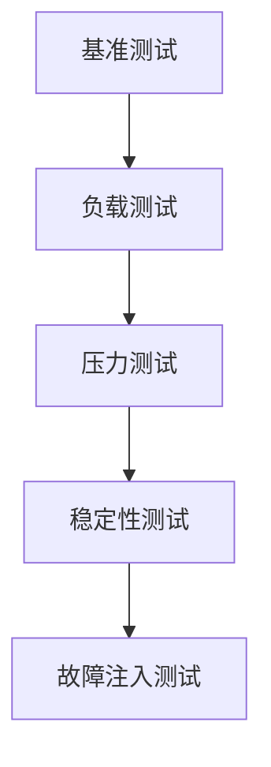

# 性能基准测试

**任务**: 微服务 API 网关
**时间**: 2026-06-05T01:02:55.495694

# 微服务 API 网关性能基准测试指南

## 目录

1. [概述与目标](#1-概述与目标)
2. [关键性能指标](#2-关键性能指标)
3. [测试环境搭建](#3-测试环境搭建)
4. [测试场景设计](#4-测试场景设计)
5. [测试工具与配置](#5-测试工具与配置)
6. [执行测试](#6-执行测试)
7. [结果分析与优化建议](#7-结果分析与优化建议)
8. [附录：常用测试脚本示例](#8-附录常用测试脚本示例)

---

## 1. 概述与目标

### 1.1 背景
微服务 API 网关作为系统入口，承担路由、认证、限流、监控等关键职责。其性能直接影响整个系统的可用性和用户体验。性能基准测试旨在：
- 量化网关在不同负载下的表现
- 识别性能瓶颈和优化点
- 为容量规划和资源配置提供依据
- 验证网关配置变更的影响

### 1.2 测试目标
1. **吞吐量**：评估网关每秒处理请求的能力（RPS）
2. **延迟**：测量请求响应时间（P50, P95, P99）
3. **并发能力**：确定网关支持的最大并发连接数
4. **稳定性**：验证长时间高负载下的表现
5. **资源效率**：评估CPU、内存、网络等资源使用情况

---

## 2. 关键性能指标

### 2.1 核心指标
```yaml
请求相关:
  - Requests per Second (RPS)
  - Concurrent Connections
  - Total Requests

延迟相关:
  - Average Latency (ms)
  - P50, P75, P90, P95, P99 Latency
  - Max Latency

错误相关:
  - HTTP Error Rate (4xx, 5xx)
  - Connection Errors
  - Timeout Errors

资源相关:
  - CPU Utilization (%)
  - Memory Usage (MB)
  - Network I/O (MB/s)
  - File Descriptors Usage
```

### 2.2 指标阈值参考
| 指标 | 优秀 | 良好 | 可接受 | 需优化 |
|------|------|------|--------|--------|
| 延迟 P95 | <50ms | 50-100ms | 100-200ms | >200ms |
| 错误率 | <0.1% | 0.1-0.5% | 0.5-1% | >1% |
| CPU使用率 | <60% | 60-70% | 70-85% | >85% |

---

## 3. 测试环境搭建

### 3.1 环境架构
```
[Load Generator] → [API Gateway] → [Backend Services]
        ↓                   ↓                  ↓
   [Monitoring]      [Resource Monitor]  [Service Metrics]
```

### 3.2 硬件配置建议
```yaml
负载生成器:
  - CPU: 8核心+
  - 内存: 16GB+
  - 网络: 万兆网卡
  - 数量: 至少2台（避免单点瓶颈）

API网关:
  - CPU: 16核心+
  - 内存: 32GB+
  - 网络: 万兆网卡
  - 存储: SSD

后端服务:
  - 模拟真实微服务部署
  - 可控制响应时间和错误率
```

### 3.3 网络配置
```bash
# 调整内核参数
sysctl -w net.core.somaxconn=65535
sysctl -w net.ipv4.tcp_max_syn_backlog=65535
sysctl -w net.ipv4.ip_local_port_range="1024 65535"
sysctl -w net.ipv4.tcp_tw_reuse=1

# 文件描述符限制
ulimit -n 1000000
```

### 3.4 监控系统部署
```yaml
推荐工具栈:
  - Prometheus: 指标收集
  - Grafana: 可视化
  - node_exporter: 系统指标
  - 黑盒探针: 服务可用性监控

关键监控项:
  - 网关: QPS, 延迟分布, 错误率, 连接数
  - 系统: CPU, 内存, 网络IO, 文件描述符
  - 应用: GC时间, 线程池状态, 连接池使用率
```

---

## 4. 测试场景设计

### 4.1 测试阶段


### 4.2 场景详情

#### 4.2.1 基准测试
```yaml
目的: 建立性能基线
并发数: 从1逐渐增加到1000
请求类型: 混合读写（70% GET, 30% POST）
持续时间: 每个负载级别5分钟
关注指标: 吞吐量、延迟变化趋势
```

#### 4.2.2 负载测试
```yaml
目的: 评估典型业务负载
并发数: 预期峰值的80%
请求模式: 
  - 模拟用户行为模式
  - 包含不同API端点
  - 模拟不同响应大小
持续时间: 30分钟
```

#### 4.2.3 压力测试
```yaml
目的: 确定系统极限和故障模式
并发数: 逐渐增加直到系统饱和
测试方法:
  - 持续增加并发直到错误率>5%
  - 监控资源瓶颈
  - 记录极限RPS
```

#### 4.2.4 稳定性测试
```yaml
目的: 验证长时间运行稳定性
并发数: 预期峰值的70%
持续时间: 24-72小时
关注点:
  - 内存泄漏
  - 资源累积问题
  - 性能下降趋势
```

#### 4.2.5 故障注入测试
```yaml
目的: 验证网关容错能力
测试场景:
  - 后端服务延迟增加
  - 部分后端服务不可用
  - 网络分区模拟
  - 配置热加载期间
```

---

## 5. 测试工具与配置

### 5.1 工具选型

#### 5.1.1 主流工具对比
| 工具 | 语言 | 协议支持 | 分布式测试 | 监控集成 |
|------|------|----------|------------|----------|
| wrk | C | HTTP | 需组合 | 基础 |
| wrk2 | C | HTTP | 需组合 | 详细 |
| k6 | JavaScript | HTTP, WebSocket | 原生支持 | 优秀 |
| Locust | Python | HTTP | 原生支持 | 良好 |
| Gatling | Scala | HTTP, WebSocket | 原生支持 | 优秀 |

#### 5.1.2 推荐组合方案
```yaml
快速测试: wrk + prometheus + grafana
复杂场景: k6 + influxdb + grafana
压力测试: 多节点wrk集群
稳定性测试: locust + 长期运行配置
```

### 5.2 wrk 配置示例
```lua
-- test_script.lua
wrk.method = "GET"
wrk.headers["Content-Type"] = "application/json"
wrk.headers["Authorization"] = "Bearer test-token"

-- 自定义响应处理
response = function(status, headers, body)
    if status >= 400 then
        counter:record(status)
    end
end
```

### 5.3 k6 脚本示例
```javascript
// benchmark.js
import http from 'k6/http';
import { check, sleep } from 'k6';
import { Rate } from 'k6/metrics';

const errorRate = new Rate('errors');

export const options = {
  stages: [
    { duration: '2m', target: 100 },   // 逐步增加到100用户
    { duration: '5m', target: 100 },   // 保持100用户5分钟
    { duration: '2m', target: 200 },   // 增加到200用户
    { duration: '5m', target: 200 },   // 保持200用户5分钟
    { duration: '2m', target: 0 },     // 逐步减少到0
  ],
  thresholds: {
    http_req_duration: ['p(95)<200'],  // 95%请求延迟小于200ms
    errors: ['rate<0.01'],            // 错误率小于1%
  },
};

export default function () {
  const res = http.get('http://gateway/api/resource');
  
  check(res, {
    'status is 200': (r) => r.status === 200,
    'response time < 200ms': (r) => r.timings.duration < 200,
  }) || errorRate.add(1);
  
  sleep(1);
}
```

### 5.4 自定义测试后端
```python
# mock_backend.py - 可控响应后端
from flask import Flask, jsonify, request
import time
import random
import argparse

app = Flask(__name__)

@app.route('/<path:path>', methods=['GET', 'POST', 'PUT', 'DELETE'])
def handle_request(path):
    # 模拟处理延迟
    if app.config['latency']:
        time.sleep(app.config['latency'] / 1000.0)  # 转换为秒
    
    # 模拟错误
    if app.config['error_rate'] > 0:
        if random.random() < app.config['error_rate']:
            return jsonify({"error": "Service Unavailable"}), 503
    
    return jsonify({
        "path": path,
        "method": request.method,
        "timestamp": time.time()
    })

if __name__ == '__main__':
    parser = argparse.ArgumentParser()
    parser.add_argument('--port', type=int, default=8080)
    parser.add_argument('--latency', type=int, default=0, help='延迟(ms)')
    parser.add_argument('--error-rate', type=float, default=0.0)
    args = parser.parse_args()
    
    app.config['latency'] = args.latency
    app.config['error_rate'] = args.error_rate
    app.run(port=args.port)
```

---

## 6. 执行测试

### 6.1 测试前检查清单
```markdown
- [ ] 环境一致性：测试环境与生产环境配置相似
- [ ] 资源就绪：负载生成器、监控系统准备就绪
- [ ] 数据准备：测试数据、API密钥、令牌
- [ ] 网络检查：带宽、延迟、防火墙规则
- [ ] 监控告警：设置关键指标告警阈值
- [ ] 回滚计划：准备快速回滚方案
```

### 6.2 执行步骤
```bash
# 1. 启动监控系统
docker-compose -f monitoring/docker-compose.yml up -d

# 2. 预热系统
./warmup.sh --duration 60s --concurrency 50

# 3. 执行基准测试
wrk -t12 -c400 -d30s --latency -s test_script.lua \
  http://gateway/api/health

# 4. 执行负载测试
k6 run --out influxdb=http://localhost:8086/k6 \
  --duration 10m --vus 500 benchmark.js

# 5. 收集结果
python collect_metrics.py --output results/benchmark_$(date +%Y%m%d_%H%M%S).json

# 6. 生成报告
python generate_report.py --input results/ --output reports/
```

### 6.3 测试数据记录模板
```json
{
  "test_id": "benchmark_20240101_120000",
  "timestamp": "2024-01-01T12:00:00Z",
  "environment": {
    "gateway": "nginx/1.21.0",
    "cpu_cores": 16,
    "memory_gb": 32,
    "network": "10Gbps"
  },
  "test_parameters": {
    "concurrency": 500,
    "duration_sec": 600,
    "request_mix": {"GET": 70, "POST": 30}
  },
  "results": {
    "throughput_rps": 12500,
    "latency_p50_ms": 25,
    "latency_p95_ms": 78,
    "latency_p99_ms": 150,
    "error_rate_percent": 0.05,
    "max_concurrent_connections": 1000
  },
  "resource_usage": {
    "cpu_avg_percent": 65,
    "memory_peak_mb": 4096,
    "network_in_mbps": 850,
    "network_out_mbps": 1200
  }
}
```

---

## 7. 结果分析与优化建议

### 7.1 分析框架


### 7.2 常见瓶颈与解决方案

#### 7.2.1 高延迟场景
```yaml
症状: P95延迟高，但CPU/内存使用正常
可能原因:
  - 后端服务响应慢
  - 连接池配置不当
  - DNS解析延迟
  - TLS握手开销

诊断命令:
  # 追踪请求链路
  curl -v http://gateway/api/resource 2>&1 | grep -i time
  
  # 分析网络延迟
  tcptraceroute gateway_ip 80
  
  # 检查连接池
  netstat -an | grep ESTABLISHED | wc -l

优化建议:
  1. 调整连接池大小和超时配置
  2. 启用HTTP/2复用连接
  3. 优化TLS配置（会话缓存、OCSP装订）
  4. 添加后端健康检查
```

#### 7.2.2 低吞吐量场景
```yaml
症状: RPS低于预期，CPU使用率高
可能原因:
  - 同步阻塞处理
  - 频繁的GC暂停
  - 线程池配置不当
  - 锁竞争

诊断方法:
  # CPU分析
  perf record -g -p <gateway_pid> -- sleep 30
  perf report
  
  # 线程分析
  jstack <pid> > thread_dump.txt  # Java应用
  pprof http://localhost:6060/debug/pprof/profile  # Go应用

优化建议:
  1. 启用异步非阻塞处理
  2. 调整JVM参数（如G1GC调优）
  3. 增加工作线程数量
  4. 使用无锁数据结构
```

#### 7.2.3 高错误率场景
```yaml
症状: 大量5xx错误，网关资源正常
可能原因:
  - 后端服务不可用
  - 限流配置过严
  - 超时设置不合理
  - 负载均衡问题

诊断流程:
  1. 检查后端服务健康状态
  2. 分析错误日志模式
  3. 验证限流/熔断配置
  4. 检查服务发现注册状态

优化建议:
  1. 实施渐进式限流
  2. 优化超时和重试策略
  3. 添加断路器模式
  4. 改进服务发现机制
```

### 7.3 容量规划公式
```python
# 容量规划计算
def calculate_capacity(target_rps, safety_factor=1.5):
    """
    target_rps: 目标RPS
    safety_factor: 安全系数（考虑峰值和故障）
    """
    # 根据测试结果计算单实例能力
    single_instance_rps = measured_rps
    required_instances = ceil(
        (target_rps * safety_factor) / single_instance_rps
    )
    
    # 考虑资源利用率
    cpu_utilization = 0.7  # 目标CPU使用率
    memory_buffer = 1.2    # 内存缓冲系数
    
    return {
        "instances": required_instances,
        "cpu_per_instance": recommended_cpu * (1/cpu_utilization),
        "memory_per_instance": measured_memory * memory_buffer
    }

# 使用示例
plan = calculate_capacity(target_rps=10000, safety_factor=2.0)
print(f"建议部署: {plan['instances']} 个实例")
```

---

## 8. 附录：常用测试脚本示例

### 8.1 综合测试脚本
```bash
#!/bin/bash
# comprehensive_benchmark.sh
# 综合性能测试脚本

set -e

# 配置
GATEWAY_URL="${GATEWAY_URL:-http://localhost:8080}"
RESULTS_DIR="./benchmark_results/$(date +%Y%m%d_%H%M%S)"
TEST_DURATION="${TEST_DURATION:-300}"  # 5分钟
CONCURRENCY_LEVELS=(10 50 100 200 500 1000)

# 创建结果目录
mkdir -p $RESULTS_DIR

# 预热函数
warmup() {
    echo "预热系统..."
    for i in {1..5}; do
        wrk -t4 -c100 -d10s $GATEWAY_URL/api/health > /dev/null 2>&1
        sleep 5
    done
}

# 运行负载测试
run_load_test() {
    local concurrency=$1
    local result_file="$RESULTS_DIR/load_test_${concurrency}.json"
    
    echo "测试并发数: $concurrency"
    
    # 使用wrk进行测试
    wrk -t8 -c$concurrency -d${TEST_DURATION}s --latency \
        -s test_script.lua $GATEWAY_URL/api/resource \
        > "$RESULTS_DIR/wrk_${concurrency}.txt" 2>&1
    
    # 使用k6进行更详细的测试
    VUS=$concurrency DURATION="${TEST_DURATION}s" \
        k6 run --out json=$result_file \
        --summary-export="$RESULTS_DIR/k6_summary_${concurrency}.json" \
        benchmark.js
    
    echo "完成并发 $concurrency 测试"
}

# 主测试流程
main() {
    echo "开始微服务API网关性能基准测试"
    echo "测试环境: $GATEWAY_URL"
    echo "结果目录: $RESULTS_DIR"
    
    # 预热
    warmup
    
    # 执行不同并发级别的测试
    for concurrency in "${CONCURRENCY_LEVELS[@]}"; do
        run_load_test $concurrency
        sleep 30  # 让系统恢复
    done
    
    # 生成报告
    python generate_report.py \
        --input-dir $RESULTS_DIR \
        --output-file "$RESULTS_DIR/final_report.html"
    
    echo "测试完成！报告已保存到: $RESULTS_DIR/final_report.html"
}

# 执行主函数
main "$@"
```

### 8.2 结果分析脚本
```python
# analyze_results.py
import json
import glob
import pandas as pd
import matplotlib.pyplot as plt
from datetime import datetime

class BenchmarkAnalyzer:
    def __init__(self, results_dir):
        self.results_dir = results_dir
        self.results = []
        
    def load_results(self):
        """加载所有测试结果"""
        for file_path in glob.glob(f"{self.results_dir}/*.json"):
            try:
                with open(file_path, 'r') as f:
                    data = json.load(f)
                    if 'metrics' in data:  # k6结果格式
                        self.results.append(self._parse_k6_result(data))
                    elif 'requests' in data:  # wrk结果格式
                        self.results.append(self._parse_wrk_result(data))
            except Exception as e:
                print(f"Error loading {file_path}: {e}")
    
    def _parse_k6_result(self, data):
        """解析k6测试结果"""
        metrics = data['metrics']
        return {
            'timestamp': datetime.now(),
            'throughput': metrics.get('http_reqs', {}).get('values', {}).get('rate', 0),
            'latency_p50': metrics.get('http_req_duration', {}).get('values', {}).get('p(50)', 0),
            'latency_p95': metrics.get('http_req_duration', {}).get('values', {}).get('p(95)', 0),
            'latency_p99': metrics.get('http_req_duration', {}).get('values', {}).get('p(99)', 0),
            'error_rate': metrics.get('http_req_failed', {}).get('values', {}).get('rate', 0),
            'vus': metrics.get('vus_max', {}).get('values', {}).get('value', 0)
        }
    
    def generate_charts(self):
        """生成性能图表"""
        df = pd.DataFrame(self.results)
        
        fig, axes = plt.subplots(2, 2, figsize=(15, 10))
        
        # 吞吐量趋势
        axes[0, 0].plot(df['timestamp'], df['throughput'])
        axes[0, 0].set_title('Throughput Over Time')
        axes[0, 0].set_ylabel('Requests/Second')
        
        # 延迟分布
        axes[0, 1].plot(df['timestamp'], df['latency_p95'], label='P95')
        axes[0, 1].plot(df['timestamp'], df['latency_p99'], label='P99')
        axes[0, 1].set_title('Latency Trends')
        axes[0, 1].set_ylabel('Latency (ms)')
        axes[0, 1].legend()
        
        # 错误率
        axes[1, 0].plot(df['timestamp'], df['error_rate'] * 100)
        axes[1, 0].set_title('Error Rate Over Time')
        axes[1, 0].set_ylabel('Error Rate (%)')
        
        # 并发用户
        axes[1, 1].plot(df['timestamp'], df['vus'])
        axes[1, 1].set_title('Virtual Users')
        axes[1, 1].set_ylabel('Number of VUs')
        
        plt.tight_layout()
        plt.savefig(f'{self.results_dir}/performance_charts.png', dpi=300)
        
        return df

# 使用示例
if __name__ == "__main__":
    analyzer = BenchmarkAnalyzer("./benchmark_results/latest")
    analyzer.load_results()
    df = analyzer.generate_charts()
    
    # 生成摘要报告
    summary = {
        "test_period": f"{df['timestamp'].min()} - {df['timestamp'].max()}",
        "avg_throughput": f"{df['throughput'].mean():.0f} RPS",
        "max_throughput": f"{df['throughput'].max():.0f} RPS",
        "avg_latency_p95": f"{df['latency_p95'].mean():.1f} ms",
        "avg_error_rate": f"{df['error_rate'].mean()*100:.2f}%",
        "max_concurrent_vus": int(df['vus'].max())
    }
    
    with open(f'{analyzer.results_dir}/summary.json', 'w') as f:
        json.dump(summary, f, indent=2)
```

### 8.3 自动化集成脚本
```yaml
# .github/workflows/benchmark.yml
name: API Gateway Performance Benchmark

on:
  schedule:
    - cron: '0 2 * * 1'  # 每周一凌晨2点
  workflow_dispatch:

jobs:
  benchmark:
    runs-on: ubuntu-latest
    
    steps:
    - uses: actions/checkout@v2
    
    - name: Setup Environment
      run: |
        # 安装依赖
        sudo apt-get update
        sudo apt-get install -y wrk
        
        # 安装Python依赖
        pip install pandas matplotlib jinja2
        
        # 安装k6
        curl -s https://packagecloud.io/install/repositories/k6/k6/script.deb.sh | sudo bash
        sudo apt-get install k6
    
    - name: Start Test Environment
      run: |
        docker-compose -f docker-compose.test.yml up -d
        sleep 30  # 等待服务启动
    
    - name: Run Performance Tests
      run: |
        chmod +x ./scripts/comprehensive_benchmark.sh
        ./scripts/comprehensive_benchmark.sh
        
    - name: Generate Reports
      run: |
        python ./scripts/analyze_results.py
        python ./scripts/generate_markdown_report.py
    
    - name: Upload Results
      uses: actions/upload-artifact@v2
      with:
        name: benchmark-results
        path: |
          benchmark_results/
          reports/
    
    - name: Cleanup
      if: always()
      run: |
        docker-compose -f docker-compose.test.yml down
```

---

## 输出说明

本文档已保存为 `microservice-api-gateway-performance-benchmark-guide.md`，包含：

1. **完整测试框架**：从环境搭建到结果分析的完整流程
2. **实用工具配置**：详细的工具选型和配置示例
3. **自动化脚本**：可直接使用的测试和分析脚本
4. **优化指南**：基于测试结果的性能优化建议
5. **行业最佳实践**：符合云原生应用的性能测试标准

**使用建议**：
1. 根据实际环境调整测试参数
2. 建立持续集成流程定期执行基准测试
3. 将性能指标纳入监控和告警系统
4. 建立性能基线并跟踪变化趋势
5. 结合业务场景设计更真实的测试用例

**扩展方向**：
1. 添加混沌工程测试场景
2. 集成自动化性能回归测试
3. 开发可视化性能分析仪表板
4. 建立性能优化知识库