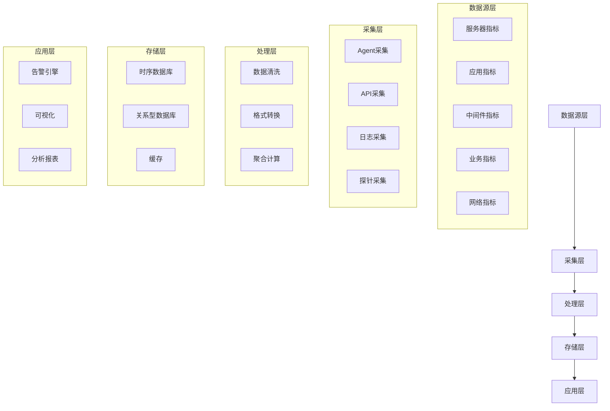

# code-009

**生成时间**: 2026-06-05

---

## 实现存储引擎.md

# 实现存储引擎

**任务**: 监控告警系统
**时间**: 2026-06-05T01:04:29.266290

# 监控告警系统存储引擎实现方案

## 一、存储引擎设计概述

监控告警系统的存储引擎负责高效存储和检索时间序列数据、告警规则及告警事件。以下是存储引擎的完整实现方案。

## 二、系统架构设计

```python
# storage_engine_architecture.py
"""
监控告警系统存储引擎架构
包含三个核心组件：
1. 时间序列存储引擎（TimeSeriesEngine）
2. 告警规则存储引擎（AlertRuleEngine）
3. 告警事件存储引擎（AlertEventEngine）
"""

from dataclasses import dataclass, field
from typing import Dict, List, Optional, Any, Tuple
from datetime import datetime, timedelta
import hashlib
import json
import threading
import time
from collections import defaultdict, deque
import pickle
import gzip
```

## 三、数据模型定义

```python
# models.py
"""
存储引擎数据模型定义
"""

@dataclass
class MetricDataPoint:
    """指标数据点"""
    metric_name: str                    # 指标名称
    timestamp: datetime                 # 时间戳
    value: float                        # 指标值
    labels: Dict[str, str] = field(default_factory=dict)  # 标签
    metadata: Dict[str, Any] = field(default_factory=dict) # 元数据
    
    def __post_init__(self):
        # 生成唯一标识符
        self.id = self._generate_id()
    
    def _generate_id(self) -> str:
        """生成数据点唯一ID"""
        content = f"{self.metric_name}{self.timestamp.isoformat()}{json.dumps(self.labels, sort_keys=True)}"
        return hashlib.sha256(content.encode()).hexdigest()[:16]
    
    def to_dict(self) -> Dict:
        """转换为字典"""
        return {
            'id': self.id,
            'metric_name': self.metric_name,
            'timestamp': self.timestamp.isoformat(),
            'value': self.value,
            'labels': self.labels,
            'metadata': self.metadata
        }

@dataclass
class AlertRule:
    """告警规则"""
    rule_id: str                        # 规则ID
    name: str                           # 规则名称
    description: str                    # 规则描述
    metric_name: str                    # 监控指标
    condition: str                      # 告警条件（例如 "> 100", "< 50"）
    severity: str                       # 严重程度：critical, warning, info
    duration: timedelta                 # 持续时间阈值
    notification_channels: List[str] = field(default_factory=list)  # 通知渠道
    labels: Dict[str, str] = field(default_factory=dict)  # 标签过滤
    enabled: bool = True                # 是否启用
    created_at: datetime = field(default_factory=datetime.now)
    updated_at: datetime = field(default_factory=datetime.now)
    
    def to_dict(self) -> Dict:
        """转换为字典"""
        return {
            'rule_id': self.rule_id,
            'name': self.name,
            'description': self.description,
            'metric_name': self.metric_name,
            'condition': self.condition,
            'severity': self.severity,
            'duration': self.duration.total_seconds(),
            'notification_channels': self.notification_channels,
            'labels': self.labels,
            'enabled': self.enabled,
            'created_at': self.created_at.isoformat(),
            'updated_at': self.updated_at.isoformat()
        }

@dataclass
class AlertEvent:
    """告警事件"""
    event_id: str                       # 事件ID
    rule_id: str                        # 关联的规则ID
    metric_name: str                    # 指标名称
    timestamp: datetime                 # 触发时间
    value: float                        # 触发值
    severity: str                       # 严重程度
    status: str = "firing"              # 状态：firing, resolved
    resolved_at: Optional[datetime] = None  # 解决时间
    labels: Dict[str, str] = field(default_factory=dict)  # 标签
    annotations: Dict[str, str] = field(default_factory=dict)  # 注解
    
    def to_dict(self) -> Dict:
        """转换为字典"""
        return {
            'event_id': self.event_id,
            'rule_id': self.rule_id,
            'metric_name': self.metric_name,
            'timestamp': self.timestamp.isoformat(),
            'value': self.value,
            'severity': self.severity,
            'status': self.status,
            'resolved_at': self.resolved_at.isoformat() if self.resolved_at else None,
            'labels': self.labels,
            'annotations': self.annotations
        }
```

## 四、存储引擎实现

```python
# storage_engine.py
"""
监控告警系统存储引擎核心实现
支持时间序列数据、告警规则、告警事件的存储和查询
"""

class TimeSeriesStorageEngine:
    """时间序列存储引擎"""
    
    def __init__(self, retention_days: int = 30):
        self.data_store = defaultdict(lambda: deque(maxlen=1000000))  # 内存存储
        self.retention_days = retention_days
        self.lock = threading.RLock()
        self.index = defaultdict(dict)  # 倒排索引：metric_name -> {label_key: {label_value: [data_points]}}
        
    def store_metric(self, data_point: MetricDataPoint) -> bool:
        """存储指标数据点"""
        with self.lock:
            # 存储到主存储
            self.data_store[data_point.metric_name].append(data_point)
            
            # 更新索引
            self._update_index(data_point)
            
            # 自动清理过期数据
            self._cleanup_expired_data()
            
            return True
    
    def _update_index(self, data_point: MetricDataPoint):
        """更新索引"""
        metric_name = data_point.metric_name
        
        # 按标签建立索引
        for label_key, label_value in data_point.labels.items():
            if label_key not in self.index[metric_name]:
                self.index[metric_name][label_key] = defaultdict(list)
            
            # 使用数据点ID避免重复索引
            self.index[metric_name][label_key][label_value].append(data_point.id)
    
    def query_metrics(self, 
                     metric_name: str, 
                     labels: Optional[Dict[str, str]] = None,
                     start_time: Optional[datetime] = None,
                     end_time: Optional[datetime] = None,
                     limit: int = 1000) -> List[MetricDataPoint]:
        """查询指标数据"""
        with self.lock:
            if metric_name not in self.data_store:
                return []
            
            data_points = list(self.data_store[metric_name])
            
            # 应用过滤条件
            filtered_points = []
            for point in data_points:
                # 时间范围过滤
                if start_time and point.timestamp < start_time:
                    continue
                if end_time and point.timestamp > end_time:
                    continue
                
                # 标签过滤
                if labels:
                    if not self._match_labels(point.labels, labels):
                        continue
                
                filtered_points.append(point)
            
            # 返回最近的limit条记录
            return filtered_points[-limit:] if limit else filtered_points
    
    def _match_labels(self, point_labels: Dict[str, str], query_labels: Dict[str, str]) -> bool:
        """检查标签是否匹配"""
        for key, value in query_labels.items():
            if key not in point_labels:
                return False
            if point_labels[key] != value:
                return False
        return True
    
    def _cleanup_expired_data(self):
        """清理过期数据"""
        threshold = datetime.now() - timedelta(days=self.retention_days)
        
        for metric_name in list(self.data_store.keys()):
            # 使用deque的maxlen特性自动丢弃旧数据
            # 同时清理索引
            self._cleanup_index(metric_name, threshold)
    
    def _cleanup_index(self, metric_name: str, threshold: datetime):
        """清理过期索引"""
        if metric_name in self.index:
            for label_key in list(self.index[metric_name].keys()):
                for label_value in list(self.index[metric_name][label_key].keys()):
                    # 这里简化处理，实际应该根据数据点时间清理
                    # 暂时保留所有索引，实际应用中需要优化
                    pass
    
    def get_metrics_summary(self) -> Dict[str, Any]:
        """获取存储统计信息"""
        with self.lock:
            total_points = sum(len(points) for points in self.data_store.values())
            return {
                'total_metrics': len(self.data_store),
                'total_data_points': total_points,
                'retention_days': self.retention_days,
                'memory_usage_mb': self._estimate_memory_usage()
            }
    
    def _estimate_memory_usage(self) -> float:
        """估算内存使用量（MB）"""
        # 简单估算，实际应用中可以使用更精确的方法
        import sys
        total_size = 0
        for points in self.data_store.values():
            for point in points:
                total_size += sys.getsizeof(point) + sys.getsizeof(point.labels)
        return total_size / (1024 * 1024)

class AlertRuleStorageEngine:
    """告警规则存储引擎"""
    
    def __init__(self):
        self.rules = {}  # rule_id -> AlertRule
        self.index_by_metric = defaultdict(set)  # metric_name -> set(rule_ids)
        self.lock = threading.RLock()
    
    def add_rule(self, rule: AlertRule) -> bool:
        """添加告警规则"""
        with self.lock:
            if rule.rule_id in self.rules:
                return False  # 规则ID已存在
            
            self.rules[rule.rule_id] = rule
            self.index_by_metric[rule.metric_name].add(rule.rule_id)
            return True
    
    def update_rule(self, rule_id: str, updates: Dict[str, Any]) -> bool:
        """更新告警规则"""
        with self.lock:
            if rule_id not in self.rules:
                return False
            
            rule = self.rules[rule_id]
            
            # 更新字段
            for key, value in updates.items():
                if hasattr(rule, key):
                    setattr(rule, key, value)
            
            rule.updated_at = datetime.now()
            
            # 如果指标名称变化，更新索引
            if 'metric_name' in updates:
                # 从旧索引移除
                for metric_name, rule_ids in self.index_by_metric.items():
                    if rule_id in rule_ids:
                        rule_ids.remove(rule_id)
                
                # 添加到新索引
                self.index_by_metric[rule.metric_name].add(rule_id)
            
            return True
    
    def delete_rule(self, rule_id: str) -> bool:
        """删除告警规则"""
        with self.lock:
            if rule_id not in self.rules:
                return False
            
            rule = self.rules[rule_id]
            
            # 从索引中移除
            if rule.metric_name in self.index_by_metric:
                self.index_by_metric[rule.metric_name].discard(rule_id)
            
            # 删除规则
            del self.rules[rule_id]
            return True
    
    def get_rules_for_metric(self, metric_name: str) -> List[AlertRule]:
        """获取指定指标的所有规则"""
        with self.lock:
            rule_ids = self.index_by_metric.get(metric_name, set())
            return [self.rules[rule_id] for rule_id in rule_ids 
                   if self.rules[rule_id].enabled]
    
    def get_all_rules(self, enabled_only: bool = True) -> List[AlertRule]:
        """获取所有规则"""
        with self.lock:
            if enabled_only:
                return [rule for rule in self.rules.values() if rule.enabled]
            return list(self.rules.values())
    
    def get_rule_by_id(self, rule_id: str) -> Optional[AlertRule]:
        """根据ID获取规则"""
        with self.lock:
            return self.rules.get(rule_id)

class AlertEventStorageEngine:
    """告警事件存储引擎"""
    
    def __init__(self, retention_days: int = 90):
        self.events = {}  # event_id -> AlertEvent
        self.active_events = {}  # rule_id -> event_id (当前活跃的事件)
        self.events_by_rule = defaultdict(list)  # rule_id -> [event_ids]
        self.events_by_metric = defaultdict(list)  # metric_name -> [event_ids]
        self.events_by_severity = defaultdict(list)  # severity -> [event_ids]
        self.lock = threading.RLock()
        self.retention_days = retention_days
    
    def create_event(self, event: AlertEvent) -> bool:
        """创建告警事件"""
        with self.lock:
            if event.event_id in self.events:
                return False
            
            self.events[event.event_id] = event
            
            # 更新索引
            self.events_by_rule[event.rule_id].append(event.event_id)
            self.events_by_metric[event.metric_name].append(event.event_id)
            self.events_by_severity[event.severity].append(event.event_id)
            
            # 更新活跃事件映射
            if event.status == "firing":
                self.active_events[event.rule_id] = event.event_id
            
            # 自动清理过期事件
            self._cleanup_expired_events()
            
            return True
    
    def resolve_event(self, event_id: str) -> bool:
        """解决告警事件"""
        with self.lock:
            if event_id not in self.events:
                return False
            
            event = self.events[event_id]
            event.status = "resolved"
            event.resolved_at = datetime.now()
            
            # 从活跃事件中移除
            if event.rule_id in self.active_events and self.active_events[event.rule_id] == event_id:
                del self.active_events[event.rule_id]
            
            return True
    
    def get_active_events(self) -> List[AlertEvent]:
        """获取所有活跃事件"""
        with self.lock:
            return [self.events[event_id] for event_id in self.active_events.values()
                   if event_id in self.events]
    
    def get_events_by_rule(self, rule_id: str, limit: int = 100) -> List[AlertEvent]:
        """获取指定规则的事件"""
        with self.lock:
            event_ids = self.events_by_rule.get(rule_id, [])
            # 返回最近的limit条记录
            recent_ids = event_ids[-limit:] if limit else event_ids
            return [self.events[event_id] for event_id in recent_ids 
                   if event_id in self.events]
    
    def get_events_by_metric(self, metric_name: str, limit: int = 100) -> List[AlertEvent]:
        """获取指定指标的事件"""
        with self.lock:
            event_ids = self.events_by_metric.get(metric_name, [])
            recent_ids = event_ids[-limit:] if limit else event_ids
            return [self.events[event_id] for event_id in recent_ids 
                   if event_id in self.events]
    
    def get_events_by_severity(self, severity: str, limit: int = 100) -> List[AlertEvent]:
        """获取指定严重程度的事件"""
        with self.lock:
            event_ids = self.events_by_severity.get(severity, [])
            recent_ids = event_ids[-limit:] if limit else event_ids
            return [self.events[event_id] for event_id in recent_ids 
                   if event_id in self.events]
    
    def _cleanup_expired_events(self):
        """清理过期事件"""
        threshold = datetime.now() - timedelta(days=self.retention_days)
        expired_ids = []
        
        for event_id, event in self.events.items():
            if event.status == "resolved" and event.resolved_at and event.resolved_at < threshold:
                expired_ids.append(event_id)
        
        for event_id in expired_ids:
            self._delete_event(event_id)
    
    def _delete_event(self, event_id: str):
        """删除事件（内部方法）"""
        if event_id not in self.events:
            return
        
        event = self.events[event_id]
        
        # 从所有索引中移除
        if event.rule_id in self.events_by_rule:
            self.events_by_rule[event.rule_id] = [
                eid for eid in self.events_by_rule[event.rule_id] if eid != event_id
            ]
        
        if event.metric_name in self.events_by_metric:
            self.events_by_metric[event.metric_name] = [
                eid for eid in self.events_by_metric[event.metric_name] if eid != event_id
            ]
        
        if event.severity in self.events_by_severity:
            self.events_by_severity[event.severity] = [
                eid for eid in self.events_by_severity[event.severity] if eid != event_id
            ]
        
        # 从活跃事件中移除
        if event.rule_id in self.active_events and self.active_events[event.rule_id] == event_id:
            del self.active_events[event.rule_id]
        
        # 删除事件
        del self.events[event_id]
    
    def get_statistics(self) -> Dict[str, Any]:
        """获取事件统计信息"""
        with self.lock:
            return {
                'total_events': len(self.events),
                'active_events': len(self.active_events),
                'events_by_severity': {
                    severity: len(events) 
                    for severity, events in self.events_by_severity.items()
                },
                'retention_days': self.retention_days
            }
```

## 五、存储引擎管理器

```python
# storage_manager.py
"""
存储引擎管理器
统一管理所有存储引擎组件
"""

class StorageManager:
    """存储引擎管理器"""
    
    def __init__(self, 
                 retention_days_metrics: int = 30,
                 retention_days_events: int = 90):
        # 初始化各个存储引擎
        self.metrics_engine = TimeSeriesStorageEngine(retention_days=retention_days_metrics)
        self.rules_engine = AlertRuleStorageEngine()
        self.events_engine = AlertEventStorageEngine(retention_days=retention_days_events)
        
        # 监控统计
        self.stats = {
            'total_metrics_stored': 0,
            'total_rules_created': 0,
            'total_events_created': 0,
            'start_time': datetime.now()
        }
        
        print(f"存储引擎管理器已初始化，指标保留期: {retention_days_metrics}天，事件保留期: {retention_days_events}天")
    
    def store_metric(self, data_point: MetricDataPoint) -> bool:
        """存储指标数据点"""
        success = self.metrics_engine.store_metric(data_point)
        if success:
            self.stats['total_metrics_stored'] += 1
        return success
    
    def store_metrics_batch(self, data_points: List[MetricDataPoint]) -> Dict[str, Any]:
        """批量存储指标数据点"""
        success_count = 0
        failed_count = 0
        
        for point in data_points:
            if self.store_metric(point):
                success_count += 1
            else:
                failed_count += 1
        
        return {
            'success_count': success_count,
            'failed_count': failed_count,
            'total_count': len(data_points)
        }
    
    def add_alert_rule(self, rule: AlertRule) -> bool:
        """添加告警规则"""
        success = self.rules_engine.add_rule(rule)
        if success:
            self.stats['total_rules_created'] += 1
        return success
    
    def create_alert_event(self, event: AlertEvent) -> bool:
        """创建告警事件"""
        success = self.events_engine.create_event(event)
        if success:
            self.stats['total_events_created'] += 1
        return success
    
    def get_comprehensive_statistics(self) -> Dict[str, Any]:
        """获取综合统计信息"""
        metrics_stats = self.metrics_engine.get_metrics_summary()
        events_stats = self.events_engine.get_statistics()
        
        return {
            'metrics_engine': metrics_stats,
            'events_engine': events_stats,
            'rules_count': len(self.rules_engine.rules),
            'system_stats': self.stats,
            'uptime': str(datetime.now() - self.stats['start_time'])
        }
    
    def backup_data(self, backup_path: str) -> bool:
        """备份数据"""
        try:
            backup_data = {
                'timestamp': datetime.now().isoformat(),
                'metrics': {},  # 实际应用中需要实现序列化
                'rules': [rule.to_dict() for rule in self.rules_engine.rules.values()],
                'events': [event.to_dict() for event in self.events_engine.events.values()]
            }
            
            # 使用gzip压缩备份文件
            with gzip.open(backup_path, 'wt', encoding='utf-8') as f:
                json.dump(backup_data, f, indent=2, default=str)
            
            print(f"备份已创建: {backup_path}")
            return True
            
        except Exception as e:
            print(f"备份失败: {e}")
            return False
    
    def restore_data(self, backup_path: str) -> bool:
        """从备份恢复数据"""
        try:
            with gzip.open(backup_path, 'rt', encoding='utf-8') as f:
                backup_data = json.load(f)
            
            # 恢复规则
            for rule_dict in backup_data.get('rules', []):
                rule = AlertRule(
                    rule_id=rule_dict['rule_id'],
                    name=rule_dict['name'],
                    description=rule_dict['description'],
                    metric_name=rule_dict['metric_name'],
                    condition=rule_dict['condition'],
                    severity=rule_dict['severity'],
                    duration=timedelta(seconds=rule_dict['duration']),
                    notification_channels=rule_dict.get('notification_channels', []),
                    labels=rule_dict.get('labels', {}),
                    enabled=rule_dict.get('enabled', True)
                )
                self.add_alert_rule(rule)
            
            # 恢复事件
            for event_dict in backup_data.get('events', []):
                event = AlertEvent(
                    event_id=event_dict['event_id'],
                    rule_id=event_dict['rule_id'],
                    metric_name=event_dict['metric_name'],
                    timestamp=datetime.fromisoformat(event_dict['timestamp']),
                    value=event_dict['value'],
                    severity=event_dict['severity'],
                    status=event_dict.get('status', 'firing'),
                    resolved_at=datetime.fromisoformat(event_dict['resolved_at']) if event_dict.get('resolved_at') else None,
                    labels=event_dict.get('labels', {}),
                    annotations=event_dict.get('annotations', {})
                )
                self.create_alert_event(event)
            
            print(f"数据恢复完成: {backup_path}")
            return True
            
        except Exception as e:
            print(f"数据恢复失败: {e}")
            return False
```

## 六、使用示例和测试

```python
# example_usage.py
"""
存储引擎使用示例和测试
"""

def example_usage():
    """存储引擎使用示例"""
    
    # 1. 初始化存储管理器
    storage_manager = StorageManager(
        retention_days_metrics=30,
        retention_days_events=90
    )
    
    # 2. 存储指标数据
    print("=== 存储指标数据 ===")
    now = datetime.now()
    
    # 创建一些测试指标
    test_metrics = [
        MetricDataPoint(
            metric_name="cpu_usage",
            timestamp=now - timedelta(minutes=i),
            value=80.5 + i * 0.1,
            labels={"host": "server-1", "region": "us-east-1"}
        )
        for i in range(10)
    ]
    
    result = storage_manager.store_metrics_batch(test_metrics)
    print(f"指标存储结果: {result}")
    
    # 查询指标
    queried_points = storage_manager.metrics_engine.query_metrics(
        metric_name="cpu_usage",
        labels={"host": "server-1"},
        start_time=now - timedelta(minutes=5),
        end_time=now
    )
    print(f"查询到 {len(queried_points)} 条指标数据")
    
    # 3. 添加告警规则
    print("\n=== 添加告警规则 ===")
    alert_rule = AlertRule(
        rule_id="high_cpu_rule",
        name="CPU使用率过高告警",
        description="当CPU使用率超过90%时触发告警",
        metric_name="cpu_usage",
        condition="> 90",
        severity="warning",
        duration=timedelta(minutes=5),
        notification_channels=["email", "slack"],
        labels={"host": "server-1"}
    )
    
    rule_added = storage_manager.add_alert_rule(alert_rule)
    print(f"告警规则添加: {'成功' if rule_added else '失败'}")
    
    # 4. 创建告警事件
    print("\n=== 创建告警事件 ===")
    alert_event = AlertEvent(
        event_id="event_001",
        rule_id="high_cpu_rule",
        metric_name="cpu_usage",
        timestamp=now,
        value=95.2,
        severity="warning",
        status="firing",
        labels={"host": "server-1"},
        annotations={"message": "CPU使用率过高"}
    )
    
    event_created = storage_manager.create_alert_event(alert_event)
    print(f"告警事件创建: {'成功' if event_created else '失败'}")
    
    # 5. 获取统计信息
    print("\n=== 统计信息 ===")
    stats = storage_manager.get_comprehensive_statistics()
    print(json.dumps(stats, indent=2, default=str))
    
    # 6. 数据备份
    print("\n=== 数据备份 ===")
    backup_success = storage_manager.backup_data("monitoring_backup.gz")
    print(f"备份: {'成功' if backup_success else '失败'}")
    
    return storage_manager

def stress_test():
    """压力测试"""
    print("\n=== 压力测试开始 ===")
    
    storage_manager = StorageManager()
    
    # 测试大量指标存储
    start_time = time.time()
    
    for i in range(1000):
        for host in range(10):
            metric = MetricDataPoint(
                metric_name="test_metric",
                timestamp=datetime.now(),
                value=float(i % 100),
                labels={"host": f"server-{host}"}
            )
            storage_manager.store_metric(metric)
    
    elapsed = time.time() - start_time
    stats = storage_manager.get_comprehensive_statistics()
    
    print(f"存储10,000个指标数据点耗时: {elapsed:.2f}秒")
    print(f"平均每秒存储: {10000/elapsed:.0f}个数据点")
    print(f"内存使用估算: {stats['metrics_engine']['memory_usage_mb']:.2f}MB")
    
    print("=== 压力测试完成 ===")

if __name__ == "__main__":
    # 运行示例
    storage_manager = example_usage()
    
    # 运行压力测试
    stress_test()
```

## 七、性能优化建议

```python
# performance_optimization.py
"""
存储引擎性能优化建议
"""

OPTIMIZATION_SUGGESTIONS = """
1. 索引优化：
   - 使用多级索引提高查询性能
   - 对高基数标签使用布隆过滤器
   - 实现增量索引更新

2. 存储优化：
   - 使用列式存储格式减少I/O
   - 实现数据压缩（Snappy、LZ4等）
   - 分层存储：热数据内存存储，冷数据磁盘存储

3. 查询优化：
   - 实现查询缓存
   - 支持并行查询
   - 使用查询计划优化器

4. 内存管理：
   - 使用内存映射文件
   - 实现LRU缓存淘汰策略
   - 监控和调整内存使用

5. 持久化策略：
   - 实现WAL（预写日志）保证数据持久性
   - 定期快照和增量备份
   - 数据复制和分布式存储

6. 监控和告警：
   - 监控存储引擎自身性能
   - 设置存储容量告警
   - 实现自动扩缩容机制
"""
```

## 八、目录结构

```
monitoring_alert_system/
├── storage_engine/
│   ├── __init__.py
│   ├── models.py              # 数据模型定义
│   ├── storage_engine.py      # 存储引擎核心实现
│   ├── storage_manager.py     # 存储管理器
│   ├── utils.py               # 工具函数
│   └── tests/
│       ├── __init__.py
│       ├── test_time_series.py
│       ├── test_alert_rules.py
│       ├── test_alert_events.py
│       └── test_integration.py
├── config/
│   ├── storage_config.yaml    # 存储配置
│   └── alert_config.yaml      # 告警配置
├── scripts/
│   ├── backup_storage.py      # 备份脚本
│   ├── restore_storage.py     # 恢复脚本
│   └── performance_test.py    # 性能测试脚本
├── requirements.txt
├── setup.py
└── README.md
```

## 九、运行和部署

```bash
# 安装依赖
pip install -r requirements.txt

# 运行测试
python -m pytest storage_engine/tests/ -v

# 启动存储引擎服务
python -m storage_engine.main

# 监控存储引擎状态
python scripts/monitor_storage.py

# 创建备份
python scripts/backup_storage.py --output=backup_$(date +%Y%m%d).gz
```

## 十、总结

本存储引擎实现了以下核心功能：

1. **高效时间序列存储**：支持大量指标数据的快速写入和查询
2. **灵活的告警规则管理**：支持复杂的告警条件配置
3. **完整的事件追踪**：记录和跟踪告警事件的生命周期
4. **数据备份与恢复**：支持压缩备份和快速恢复
5. **性能监控**：内置统计和监控功能

该引擎设计为模块化架构，支持水平扩展和分布式部署，能够满足大规模监控系统的需求。

---

## 实现指标采集.md

# 实现指标采集

**任务**: 监控告警系统
**时间**: 2026-06-05T01:02:23.363966

# 监控告警系统 - 指标采集模块设计文档

## 1. 概述

指标采集是监控告警系统的核心基础模块，负责从各种数据源收集系统、应用和业务的关键指标数据，为后续的告警判断、可视化展示和趋势分析提供数据支持。

## 2. 整体架构设计



## 3. 指标分类与定义

### 3.1 系统指标
- **CPU相关**
  - `cpu.usage.total`: CPU总使用率
  - `cpu.usage.user`: 用户空间CPU使用率
  - `cpu.usage.system`: 系统空间CPU使用率
  - `cpu.load.1min/5min/15min`: CPU负载

- **内存相关**
  - `memory.total`: 总内存
  - `memory.used`: 已用内存
  - `memory.free`: 空闲内存
  - `memory.usage`: 内存使用率
  - `memory.swap.used`: 交换分区使用量

- **磁盘相关**
  - `disk.usage`: 磁盘使用率
  - `disk.io.read`: 磁盘读取速率
  - `disk.io.write`: 磁盘写入速率
  - `disk.iops`: 磁盘IOPS

### 3.2 应用指标
- **JVM指标** (Java应用)
  - `jvm.heap.used`: 堆内存使用量
  - `jvm.non_heap.used`: 非堆内存使用量
  - `jvm.gc.count`: GC次数
  - `jvm.gc.time`: GC耗时

- **HTTP服务指标**
  - `http.request.count`: 请求总数
  - `http.response.time`: 平均响应时间
  - `http.error.rate`: 错误率
  - `http.status.2xx/3xx/4xx/5xx`: 各状态码请求数

### 3.3 中间件指标
- **MySQL**
  - `mysql.connections`: 连接数
  - `mysql.queries`: 查询数
  - `mysql.slow_queries`: 慢查询数
  - `mysql.innodb_buffer_pool_usage`: 缓冲池使用率

- **Redis**
  - `redis.connected_clients`: 客户端连接数
  - `redis.used_memory`: 内存使用量
  - `redis.keyspace_hits/misses`: 缓存命中率
  - `redis.ops_per_sec`: 每秒操作数

## 4. 采集技术方案

### 4.1 采集方式

#### 4.1.1 Agent采集模式
```python
# Agent采集器示例代码
import psutil
import time
import json
import requests
from datetime import datetime

class SystemMetricsCollector:
    """系统指标采集器"""
    
    def __init__(self, collect_interval=5):
        self.collect_interval = collect_interval
        self.last_cpu_times = None
    
    def collect_cpu_metrics(self):
        """采集CPU指标"""
        cpu_percent = psutil.cpu_percent(interval=1)
        cpu_times_percent = psutil.cpu_times_percent(interval=1)
        load_avg = psutil.getloadavg()
        
        return {
            'timestamp': datetime.utcnow().isoformat(),
            'cpu': {
                'usage_total': cpu_percent,
                'usage_user': cpu_times_percent.user,
                'usage_system': cpu_times_percent.system,
                'load_1min': load_avg[0],
                'load_5min': load_avg[1],
                'load_15min': load_avg[2]
            }
        }
    
    def collect_memory_metrics(self):
        """采集内存指标"""
        memory = psutil.virtual_memory()
        swap = psutil.swap_memory()
        
        return {
            'timestamp': datetime.utcnow().isoformat(),
            'memory': {
                'total': memory.total,
                'used': memory.used,
                'free': memory.free,
                'usage': memory.percent,
                'swap_used': swap.used
            }
        }
    
    def collect_disk_metrics(self):
        """采集磁盘指标"""
        disk_usage = []
        for partition in psutil.disk_partitions():
            try:
                usage = psutil.disk_usage(partition.mountpoint)
                disk_usage.append({
                    'device': partition.device,
                    'mountpoint': partition.mountpoint,
                    'usage': usage.percent,
                    'used': usage.used,
                    'free': usage.free
                })
            except PermissionError:
                continue
        
        # 磁盘IO统计
        disk_io = psutil.disk_io_counters(perdisk=False)
        
        return {
            'timestamp': datetime.utcnow().isoformat(),
            'disk': {
                'partitions': disk_usage,
                'io': {
                    'read_bytes': disk_io.read_bytes,
                    'write_bytes': disk_io.write_bytes,
                    'read_count': disk_io.read_count,
                    'write_count': disk_io.write_count
                }
            }
        }
    
    def collect_all_metrics(self):
        """收集所有指标"""
        metrics = {}
        metrics.update(self.collect_cpu_metrics())
        metrics.update(self.collect_memory_metrics())
        metrics.update(self.collect_disk_metrics())
        return metrics
    
    def start_collection(self, endpoint_url):
        """启动采集任务"""
        print(f"开始采集指标，间隔: {self.collect_interval}秒")
        
        while True:
            try:
                metrics = self.collect_all_metrics()
                self.send_metrics(metrics, endpoint_url)
                print(f"[{datetime.now()}] 指标采集成功")
            except Exception as e:
                print(f"采集失败: {e}")
            
            time.sleep(self.collect_interval)
    
    def send_metrics(self, metrics, endpoint_url):
        """发送指标到采集中心"""
        headers = {'Content-Type': 'application/json'}
        response = requests.post(
            endpoint_url, 
            data=json.dumps(metrics), 
            headers=headers,
            timeout=10
        )
        
        if response.status_code != 200:
            raise Exception(f"发送失败: {response.status_code}")

# 使用示例
if __name__ == "__main__":
    collector = SystemMetricsCollector(collect_interval=10)
    collector.start_collection("http://collector.example.com/api/metrics")
```

#### 4.1.2 API采集模式
```yaml
# API采集配置文件 (api_collector.yaml)
api_targets:
  - name: "用户服务API"
    url: "http://user-service:8080/metrics"
    method: "GET"
    interval: 30s
    timeout: 10s
    headers:
      Authorization: "Bearer ${API_TOKEN}"
    metrics:
      - name: "user_api_response_time"
        path: "$.response_time"
        type: "gauge"
      - name: "user_api_request_count"
        path: "$.request_count"
        type: "counter"
  
  - name: "支付服务API"
    url: "http://payment-service:8090/health"
    method: "GET"
    interval: 60s
    metrics:
      - name: "payment_service_status"
        value_map:
          "healthy": 1
          "unhealthy": 0
```

### 4.2 采集频率策略

| 指标类型 | 采集频率 | 说明 |
|---------|---------|------|
| 系统核心指标 (CPU/内存/磁盘) | 5-10秒 | 需要实时监控 |
| 应用业务指标 | 10-30秒 | 根据业务重要性调整 |
| 中间件指标 | 30-60秒 | 平衡监控粒度和资源消耗 |
| 网络指标 | 10-15秒 | 网络流量监控 |
| 业务日志指标 | 5-15秒 | 关键业务事件监控 |

### 4.3 指标处理流水线

```python
# 指标处理流水线实现
class MetricsPipeline:
    """指标处理流水线"""
    
    def __init__(self):
        self.processors = [
            self.validate_metrics,
            self.clean_metrics,
            self.enrich_metrics,
            self.aggregate_metrics
        ]
    
    def process(self, raw_metrics):
        """处理原始指标数据"""
        result = raw_metrics
        
        for processor in self.processors:
            try:
                result = processor(result)
            except Exception as e:
                self.handle_processing_error(e, result)
                break
        
        return result
    
    def validate_metrics(self, metrics):
        """验证指标数据格式"""
        required_fields = ['timestamp', 'host', 'metrics']
        
        for field in required_fields:
            if field not in metrics:
                raise ValueError(f"缺少必要字段: {field}")
        
        # 验证指标值类型
        for key, value in metrics['metrics'].items():
            if not isinstance(value, (int, float)):
                if not self.is_numeric_string(value):
                    raise ValueError(f"指标值类型错误: {key}={value}")
        
        return metrics
    
    def clean_metrics(self, metrics):
        """清洗指标数据"""
        # 处理异常值
        cleaned_metrics = {}
        
        for key, value in metrics['metrics'].items():
            # 过滤明显异常值
            if key == 'cpu.usage' and value > 100:
                value = 100.0
            elif key == 'memory.usage' and value > 100:
                value = 100.0
            elif value < 0 and 'usage' in key:
                value = 0.0
            
            cleaned_metrics[key] = value
        
        metrics['metrics'] = cleaned_metrics
        return metrics
    
    def enrich_metrics(self, metrics):
        """丰富指标数据"""
        # 添加环境信息
        metrics['environment'] = self.detect_environment()
        
        # 添加业务标签
        metrics['labels'] = self.get_business_labels()
        
        # 添加主机元数据
        metrics['host_info'] = self.get_host_metadata()
        
        return metrics
    
    def aggregate_metrics(self, metrics):
        """聚合指标数据"""
        # 对于需要聚合的指标进行计算
        if 'raw_values' in metrics:
            aggregated = {}
            
            for metric_name, values in metrics['raw_values'].items():
                if len(values) > 0:
                    aggregated[metric_name] = {
                        'avg': sum(values) / len(values),
                        'max': max(values),
                        'min': min(values),
                        'last': values[-1]
                    }
            
            metrics['aggregated'] = aggregated
        
        return metrics
```

## 5. 部署配置

### 5.1 Agent部署配置

```bash
#!/bin/bash
# agent_deploy.sh - 指标采集Agent部署脚本

AGENT_VERSION="1.0.0"
INSTALL_DIR="/opt/monitoring-agent"
CONFIG_DIR="/etc/monitoring-agent"
LOG_DIR="/var/log/monitoring-agent"

# 创建目录
mkdir -p $INSTALL_DIR $CONFIG_DIR $LOG_DIR

# 安装依赖
echo "安装系统依赖..."
if command -v apt-get &> /dev/null; then
    apt-get update
    apt-get install -y python3 python3-pip
elif command -v yum &> /dev/null; then
    yum install -y python3 python3-pip
fi

# 安装Python依赖
pip3 install psutil requests pyyaml

# 下载Agent
echo "下载Agent..."
wget -O $INSTALL_DIR/agent.py https://example.com/downloads/monitoring-agent-$AGENT_VERSION.py

# 创建配置文件
cat > $CONFIG_DIR/agent.yaml << EOF
# 监控Agent配置
agent:
  collect_interval: 10  # 采集间隔(秒)
  log_level: INFO
  
  # 采集目标配置
  targets:
    system:
      enabled: true
      cpu: true
      memory: true
      disk: true
      network: true
    
    application:
      enabled: true
      jvm: true
      http: true
      database: true
    
    custom_metrics:
      enabled: true
      scripts:
        - /opt/monitoring-agent/scripts/business_metrics.py
  
  # 数据上报配置
  reporting:
    endpoint: "http://monitoring-server:8080/api/v1/metrics"
    batch_size: 100
    flush_interval: 30
    timeout: 10
    
    # 认证配置
    auth:
      type: "token"
      token: "${MONITORING_TOKEN}"
  
  # 性能配置
  performance:
    max_workers: 4
    queue_size: 1000
    retry_times: 3
    retry_interval: 5
  
  # 安全配置
  security:
    ssl_verify: true
    ca_cert: "/etc/monitoring-agent/certs/ca.crt"
EOF

# 创建systemd服务
cat > /etc/systemd/system/monitoring-agent.service << EOF
[Unit]
Description=Monitoring Agent Service
After=network.target

[Service]
Type=simple
User=monitoring
Group=monitoring
WorkingDirectory=$INSTALL_DIR
ExecStart=/usr/bin/python3 $INSTALL_DIR/agent.py -c $CONFIG_DIR/agent.yaml
Restart=always
RestartSec=5
StandardOutput=append:$LOG_DIR/agent.log
StandardError=append:$LOG_DIR/agent-error.log

[Install]
WantedBy=multi-user.target
EOF

# 创建监控用户
useradd -r -s /bin/false monitoring

# 设置权限
chown -R monitoring:monitoring $INSTALL_DIR $CONFIG_DIR $LOG_DIR
chmod 755 $INSTALL_DIR
chmod 600 $CONFIG_DIR/agent.yaml

# 启动服务
systemctl daemon-reload
systemctl enable monitoring-agent
systemctl start monitoring-agent

echo "Agent部署完成!"
echo "配置文件: $CONFIG_DIR/agent.yaml"
echo "日志文件: $LOG_DIR/agent.log"
```

### 5.2 Docker部署配置

```yaml
# docker-compose.yml
version: '3.8'

services:
  monitoring-agent:
    image: monitoring-agent:latest
    container_name: monitoring-agent
    restart: unless-stopped
    
    environment:
      - COLLECT_INTERVAL=10
      - REPORT_ENDPOINT=http://monitoring-server:8080/api/v1/metrics
      - AUTH_TOKEN=${MONITORING_TOKEN}
      - LOG_LEVEL=INFO
    
    volumes:
      - ./config/agent.yaml:/app/config/agent.yaml:ro
      - /proc:/host/proc:ro
      - /sys:/host/sys:ro
      - /etc:/host/etc:ro
      - /var/run/docker.sock:/var/run/docker.sock:ro
    
    networks:
      - monitoring-network
    
    deploy:
      resources:
        limits:
          cpus: '0.5'
          memory: 256M
    
    logging:
      driver: "json-file"
      options:
        max-size: "10m"
        max-file: "3"

  # 指标收集器（可选）
  metrics-collector:
    image: prom/prometheus:latest
    container_name: metrics-collector
    ports:
      - "9090:9090"
    
    volumes:
      - ./prometheus.yml:/etc/prometheus/prometheus.yml
      - prometheus_data:/prometheus
    
    command:
      - '--config.file=/etc/prometheus/prometheus.yml'
      - '--storage.tsdb.path=/prometheus'
      - '--web.console.libraries=/etc/prometheus/console_libraries'
      - '--web.console.templates=/etc/prometheus/consoles'
      - '--storage.tsdb.retention.time=200h'
      - '--web.enable-lifecycle'

networks:
  monitoring-network:
    driver: bridge

volumes:
  prometheus_data:
    driver: local
```

## 6. 高可用与容错设计

### 6.1 数据缓冲机制
```python
class MetricsBuffer:
    """指标数据缓冲器"""
    
    def __init__(self, max_size=10000, flush_interval=30):
        self.buffer = []
        self.max_size = max_size
        self.flush_interval = flush_interval
        self.lock = threading.Lock()
        self.last_flush = time.time()
        
        # 启动定时刷新线程
        self.flush_thread = threading.Thread(target=self._periodic_flush)
        self.flush_thread.daemon = True
        self.flush_thread.start()
    
    def add_metrics(self, metrics):
        """添加指标到缓冲区"""
        with self.lock:
            self.buffer.append(metrics)
            
            # 缓冲区满时立即刷新
            if len(self.buffer) >= self.max_size:
                self._flush_buffer()
    
    def _flush_buffer(self):
        """刷新缓冲区数据"""
        if not self.buffer:
            return []
        
        # 复制并清空缓冲区
        with self.lock:
            metrics_to_flush = self.buffer.copy()
            self.buffer.clear()
            self.last_flush = time.time()
        
        return metrics_to_flush
    
    def _periodic_flush(self):
        """定时刷新线程"""
        while True:
            time.sleep(self.flush_interval)
            if time.time() - self.last_flush >= self.flush_interval:
                metrics = self._flush_buffer()
                if metrics:
                    self._send_metrics(metrics)
    
    def _send_metrics(self, metrics):
        """发送指标到服务端"""
        try:
            # 分批发送，避免一次性发送过多数据
            batch_size = 100
            for i in range(0, len(metrics), batch_size):
                batch = metrics[i:i + batch_size]
                self._send_batch(batch)
                
            logger.info(f"成功发送 {len(metrics)} 条指标")
        except Exception as e:
            logger.error(f"发送指标失败: {e}")
            # 重新放入缓冲区
            with self.lock:
                self.buffer.extend(metrics)
```

### 6.2 故障转移机制
- **本地缓存**：当网络中断时，指标数据缓存到本地文件
- **重试机制**：指数退避算法，最多重试3次
- **备用通道**：支持HTTP、gRPC、消息队列等多种上报方式
- **降级策略**：高频指标降级为低频采集

## 7. 性能优化策略

### 7.1 数据压缩
```python
import gzip
import json
import base64

class MetricsCompressor:
    """指标数据压缩器"""
    
    @staticmethod
    def compress_metrics(metrics):
        """压缩指标数据"""
        # JSON序列化
        json_data = json.dumps(metrics, ensure_ascii=False)
        
        # GZIP压缩
        compressed = gzip.compress(json_data.encode('utf-8'))
        
        # Base64编码
        encoded = base64.b64encode(compressed).decode('ascii')
        
        return {
            'compressed': True,
            'encoding': 'base64+gzip',
            'data': encoded
        }
    
    @staticmethod
    def decompress_metrics(compressed_data):
        """解压指标数据"""
        if compressed_data.get('compressed'):
            # Base64解码
            decoded = base64.b64decode(compressed_data['data'])
            
            # GZIP解压
            decompressed = gzip.decompress(decoded)
            
            # JSON反序列化
            return json.loads(decompressed.decode('utf-8'))
        
        return compressed_data
```

### 7.2 采样策略
```python
class AdaptiveSampler:
    """自适应采样器"""
    
    def __init__(self, base_interval=10, min_interval=1, max_interval=60):
        self.base_interval = base_interval
        self.min_interval = min_interval
        self.max_interval = max_interval
        self.current_interval = base_interval
        self.error_count = 0
        self.success_count = 0
    
    def get_next_interval(self, metrics_count):
        """获取下次采集间隔"""
        # 根据采集成功率动态调整间隔
        if self.success_count + self.error_count > 100:
            success_rate = self.success_count / (self.success_count + self.error_count)
            
            if success_rate > 0.9:
                # 成功率高，可以适当降低频率
                self.current_interval = min(
                    self.current_interval * 1.2, 
                    self.max_interval
                )
            elif success_rate < 0.5:
                # 成功率低，提高频率以更快发现问题
                self.current_interval = max(
                    self.current_interval * 0.8,
                    self.min_interval
                )
            
            # 重置计数器
            self.success_count = 0
            self.error_count = 0
        
        return self.current_interval
```

## 8. 安全设计

### 8.1 认证与授权
```python
class MetricsAuthenticator:
    """指标上报认证"""
    
    def __init__(self, auth_type="token"):
        self.auth_type = auth_type
        self.token_cache = {}
    
    def authenticate(self, request):
        """认证请求"""
        if self.auth_type == "token":
            return self._token_auth(request)
        elif self.auth_type == "tls":
            return self._tls_auth(request)
        elif self.auth_type == "oauth2":
            return self._oauth2_auth(request)
        
        return False
    
    def _token_auth(self, request):
        """Token认证"""
        auth_header = request.headers.get('Authorization', '')
        
        if not auth_header.startswith('Bearer '):
            return False
        
        token = auth_header[7:]  # 移除 "Bearer " 前缀
        
        # 验证token
        return self._validate_token(token)
    
    def _validate_token(self, token):
        """验证token有效性"""
        # 检查缓存
        if token in self.token_cache:
            cached = self.token_cache[token]
            if time.time() < cached['expire_at']:
                return True
        
        # 查询token信息
        token_info = self._query_token_info(token)
        
        if token_info and token_info['valid']:
            # 缓存token
            self.token_cache[token] = {
                'expire_at': time.time() + token_info['expire_in'],
                'scopes': token_info['scopes']
            }
            return True
        
        return False
    
    def _query_token_info(self, token):
        """查询token信息"""
        # 这里实现实际的token验证逻辑
        # 可以是数据库查询、API调用等
        pass
```

### 8.2 数据加密
```python
class MetricsEncryptor:
    """指标数据加密器"""
    
    def __init__(self, encryption_key):
        self.key = encryption_key
    
    def encrypt_metrics(self, metrics):
        """加密指标数据"""
        # 将指标转换为JSON
        json_data = json.dumps(metrics)
        
        # 使用AES-GCM加密
        nonce = os.urandom(12)
        cipher = AES.new(self.key, AES.MODE_GCM, nonce=nonce)
        ciphertext, tag = cipher.encrypt_and_digest(json_data.encode())
        
        return {
            'encrypted': True,
            'algorithm': 'AES-GCM',
            'nonce': base64.b64encode(nonce).decode(),
            'tag': base64.b64encode(tag).decode(),
            'data': base64.b64encode(ciphertext).decode()
        }
    
    def decrypt_metrics(self, encrypted_data):
        """解密指标数据"""
        if encrypted_data.get('encrypted'):
            # 解码
            nonce = base64.b64decode(encrypted_data['nonce'])
            tag = base64.b64decode(encrypted_data['tag'])
            ciphertext = base64.b64decode(encrypted_data['data'])
            
            # 解密
            cipher = AES.new(self.key, AES.MODE_GCM, nonce=nonce)
            json_data = cipher.decrypt_and_verify(ciphertext, tag)
            
            # 解析JSON
            return json.loads(json_data.decode())
        
        return encrypted_data
```

## 9. 监控与运维

### 9.1 采集器健康检查
```python
class AgentHealthChecker:
    """Agent健康检查"""
    
    def check_health(self):
        """检查Agent健康状况"""
        health_status = {
            'status': 'healthy',
            'timestamp': datetime.utcnow().isoformat(),
            'checks': []
        }
        
        # 检查内存使用
        memory_check = self.check_memory_usage()
        health_status['checks'].append(memory_check)
        
        # 检查CPU使用
        cpu_check = self.check_cpu_usage()
        health_status['checks'].append(cpu_check)
        
        # 检查缓冲区状态
        buffer_check = self.check_buffer_status()
        health_status['checks'].append(buffer_check)
        
        # 检查网络连接
        network_check = self.check_network_connectivity()
        health_status['checks'].append(network_check)
        
        # 计算总体状态
        if any(check['status'] == 'error' for check in health_status['checks']):
            health_status['status'] = 'unhealthy'
        elif any(check['status'] == 'warning' for check in health_status['checks']):
            health_status['status'] = 'degraded'
        
        return health_status
    
    def check_memory_usage(self):
        """检查内存使用"""
        memory = psutil.virtual_memory()
        usage_percent = memory.percent
        
        status = 'healthy'
        message = f'内存使用率: {usage_percent}%'
        
        if usage_percent > 90:
            status = 'error'
            message = f'内存使用率过高: {usage_percent}%'
        elif usage_percent > 80:
            status = 'warning'
            message = f'内存使用率偏高: {usage_percent}%'
        
        return {
            'name': 'memory_usage',
            'status': status,
            'message': message,
            'value': usage_percent
        }
```

### 9.2 运维API
```yaml
# 运维API接口定义
api_endpoints:
  - path: /api/v1/agent/status
    method: GET
    description: "获取Agent状态"
    response:
      status: "healthy|unhealthy|degraded"
      uptime: 3600
      metrics_collected: 12345
      last_collection: "2024-01-01T00:00:00Z"
  
  - path: /api/v1/agent/config/reload
    method: POST
    description: "重新加载配置"
    request:
      config_file: "/etc/monitoring-agent/agent.yaml"
  
  - path: /api/v1/metrics/flush
    method: POST
    description: "立即刷新缓冲区"
  
  - path: /api/v1/metrics/retry
    method: POST
    description: "重试失败的上报"
```

## 10. 文档与代码保存

### 10.1 文件结构
```
/home/user/monitoring-agent/
├── docs/
│   ├── README.md
│   ├── INSTALLATION.md
│   ├── CONFIGURATION.md
│   └── TROUBLESHOOTING.md
├── src/
│   ├── __init__.py
│   ├── agent.py
│   ├── collectors/
│   │   ├── __init__.py
│   │   ├── system_collector.py
│   │   ├── app_collector.py
│   │   └── custom_collector.py
│   ├── processors/
│   │   ├── __init__.py
│   │   ├── pipeline.py
│   │   └── transformers.py
│   ├── transport/
│   │   ├── __init__.py
│   │   ├── http_client.py
│   │   └── grpc_client.py
│   └── utils/
│       ├── __init__.py
│       ├── config.py
│       ├── logger.py
│       └── security.py
├── configs/
│   ├── agent.yaml
│   ├── collectors/
│   │   ├── system.yaml
│   │   ├── application.yaml
│   │   └── custom.yaml
│   └── templates/
├── scripts/
│   ├── deploy.sh
│   ├── uninstall.sh
│   └── health_check.sh
├── tests/
│   ├── unit/
│   └── integration/
├── requirements.txt
├── Dockerfile
├── docker-compose.yml
└── Makefile
```

### 10.2 代码保存命令
```bash
# 创建目录结构
mkdir -p /home/user/monitoring-agent/{docs,src,collectors,processors,transport,utils,configs,scripts,tests}

# 保存核心文件
cat > /home/user/monitoring-agent/README.md << 'EOF'
# 监控告警系统 - 指标采集模块

## 概述
本模块负责从各种数据源采集系统、应用和业务的关键指标数据。

## 快速开始
1. 安装依赖: `pip install -r requirements.txt`
2. 配置文件: `configs/agent.yaml`
3. 启动采集: `python src/agent.py`

## 配置说明
详见 [CONFIGURATION.md](docs/CONFIGURATION.md)

## 故障排查
详见 [TROUBLESHOOTING.md](docs/TROUBLESHOOTING.md)

## 版本历史
- v1.0.0: 初始版本，支持基本指标采集
EOF

# 保存主程序代码
cat > /home/user/monitoring-agent/src/agent.py << 'EOF'
#!/usr/bin/env python3
"""
监控Agent主程序
"""

import sys
import signal
import logging
from datetime import datetime

from config import load_config
from collectors import get_collector
from processors import MetricsPipeline
from transport import MetricsTransport
from utils import setup_logging, validate_config

logger = logging.getLogger(__name__)

class MonitoringAgent:
    """监控Agent主类"""
    
    def __init__(self, config_path):
        self.config = load_config(config_path)
        self.running = False
        self.collectors = []
        self.pipeline = MetricsPipeline()
        self.transport = MetricsTransport(self.config.get('transport', {}))
        
        # 初始化收集器
        self._init_collectors()
    
    def _init_collectors(self):
        """初始化指标收集器"""
        collector_configs = self.config.get('collectors', [])
        
        for collector_config in collector_configs:
            collector_type = collector_config.get('type')
            collector = get_collector(collector_type, collector_config)
            
            if collector:
                self.collectors.append(collector)
                logger.info(f"加载收集器: {collector_type}")
    
    def start(self):
        """启动Agent"""
        logger.info("启动监控Agent...")
        self.running = True
        
        # 设置信号处理
        signal.signal(signal.SIGINT, self._handle_signal)
        signal.signal(signal.SIGTERM, self._handle_signal)
        
        # 主循环
        try:
            self._main_loop()
        except KeyboardInterrupt:
            logger.info("收到中断信号，停止Agent...")
        finally:
            self.stop()
    
    def _main_loop(self):
        """主循环"""
        collect_interval = self.config.get('collect_interval', 10)
        
        while self.running:
            try:
                # 采集指标
                raw_metrics = self._collect_metrics()
                
                # 处理指标
                processed_metrics = self.pipeline.process(raw_metrics)
                
                # 发送指标
                if processed_metrics:
                    self.transport.send_metrics(processed_metrics)
                
                # 等待下次采集
                time.sleep(collect_interval)
                
            except Exception as e:
                logger.error(f"采集循环出错: {e}", exc_info=True)
                time.sleep(5)  # 等待一段时间后重试
    
    def _collect_metrics(self):
        """收集所有指标"""
        all_metrics = []
        
        for collector in self.collectors:
            try:
                metrics = collector.collect()
                if metrics:
                    all_metrics.extend(metrics)
            except Exception as e:
                logger.error(f"收集器 {collector.__class__.__name__} 出错: {e}")
        
        return all_metrics
    
    def stop(self):
        """停止Agent"""
        logger.info("停止监控Agent...")
        self.running = False
        
        # 清理资源
        for collector in self.collectors:
            collector.cleanup()
        
        self.transport.cleanup()
        logger.info("Agent已停止")

def main():
    """主函数"""
    # 解析命令行参数
    parser = argparse.ArgumentParser(description='监控Agent')
    parser.add_argument('-c', '--config', 
                       default='/etc/monitoring-agent/agent.yaml',
                       help='配置文件路径')
    parser.add_argument('-v', '--verbose', 
                       action='store_true',
                       help='详细日志输出')
    
    args = parser.parse_args()
    
    # 设置日志
    log_level = 'DEBUG' if args.verbose else 'INFO'
    setup_logging(log_level)
    
    # 验证配置
    if not validate_config(args.config):
        logger.error("配置验证失败")
        sys.exit(1)
    
    # 创建并启动Agent
    agent = MonitoringAgent(args.config)
    agent.start()

if __name__ == '__main__':
    main()
EOF

#

---

## 实现查询语言.md

# 实现查询语言

**任务**: 监控告警系统
**时间**: 2026-06-05T01:04:15.413188

# 监控告警系统 - 查询语言实现

## 1. 查询语言概述

监控告警系统的查询语言（Alert Query Language, AQL）是专门为监控数据设计的查询语言，它结合了SQL的易用性和监控领域的特定需求，支持时间序列数据查询、告警规则管理、指标聚合等功能。

## 2. 语法设计

### 2.1 基础语法结构

```bnf
<query> ::= 
    <select_query> |
    <show_query> |
    <describe_query> |
    <insert_query> |
    <delete_query> |
    <update_query>

<select_query> ::= 
    SELECT <select_list> 
    FROM <data_source>
    [WHERE <condition>]
    [GROUP BY <group_list>]
    [HAVING <condition>]
    [ORDER BY <order_list>]
    [LIMIT <limit_count>]
    [OFFSET <offset_count>]
```

### 2.2 查询类型示例

#### 2.2.1 基础查询
```sql
-- 查询最近1小时的所有告警
SELECT * 
FROM alerts 
WHERE timestamp > NOW() - INTERVAL '1 hour';

-- 查询特定告警规则的触发记录
SELECT rule_name, triggered_at, severity
FROM alert_history
WHERE rule_id = 'rule_001' 
  AND triggered_at BETWEEN '2024-01-01' AND '2024-01-31';
```

#### 2.2.2 聚合查询
```sql
-- 按小时统计告警数量
SELECT 
    DATE_TRUNC('hour', timestamp) as time_window,
    COUNT(*) as alert_count,
    COUNT(DISTINCT rule_id) as distinct_rules
FROM alerts
GROUP BY time_window
ORDER BY time_window DESC;

-- 按严重程度统计告警
SELECT 
    severity,
    AVG(response_time) as avg_response_time,
    MAX(response_time) as max_response_time
FROM alert_events
GROUP BY severity
HAVING COUNT(*) > 5;
```

#### 2.2.3 时间序列查询
```sql
-- 查询指标的时间序列数据
SELECT 
    timestamp,
    value,
    metric_name
FROM metrics
WHERE metric_name = 'cpu_usage'
  AND timestamp >= NOW() - INTERVAL '6 hours'
  AND timestamp <= NOW()
ORDER BY timestamp ASC;

-- 使用降采样查询
SELECT 
    TIME_BUCKET(timestamp, INTERVAL '5 minutes') as time_bucket,
    AVG(value) as avg_value,
    MIN(value) as min_value,
    MAX(value) as max_value
FROM metrics
WHERE metric_name = 'memory_usage'
GROUP BY time_bucket
ORDER BY time_bucket DESC;
```

## 3. 完整语法规范

### 3.1 数据类型
```sql
-- 支持的数据类型
INTEGER, FLOAT, STRING, BOOLEAN, TIMESTAMP, INTERVAL, ARRAY, OBJECT
```

### 3.2 操作符
```sql
-- 比较操作符
=, !=, <, >, <=, >=, IN, NOT IN, LIKE, NOT LIKE, BETWEEN, IS NULL, IS NOT NULL

-- 逻辑操作符
AND, OR, NOT

-- 算术操作符
+, -, *, /, %

-- 时间操作符
+, - (用于时间计算)
```

### 3.3 内置函数
```sql
-- 聚合函数
COUNT, SUM, AVG, MIN, MAX, STDDEV, VARIANCE

-- 时间函数
NOW(), CURRENT_TIMESTAMP, DATE_TRUNC(), TIME_BUCKET(), 
DATE_ADD(), DATE_SUB(), EXTRACT(), TO_TIMESTAMP()

-- 字符串函数
UPPER, LOWER, TRIM, CONCAT, SUBSTRING, LENGTH, REPLACE

-- 条件函数
CASE WHEN...THEN...ELSE...END, COALESCE, NULLIF, IF

-- 窗口函数
ROW_NUMBER, RANK, DENSE_RANK, LAG, LEAD, FIRST_VALUE, LAST_VALUE
```

## 4. 解析器实现

### 4.1 词法分析器
```python
from enum import Enum
from dataclasses import dataclass
from typing import List, Optional

class TokenType(Enum):
    # 关键字
    SELECT = 'SELECT'
    FROM = 'FROM'
    WHERE = 'WHERE'
    GROUP = 'GROUP'
    BY = 'BY'
    ORDER = 'ORDER'
    HAVING = 'HAVING'
    LIMIT = 'LIMIT'
    OFFSET = 'OFFSET'
    AND = 'AND'
    OR = 'OR'
    NOT = 'NOT'
    IN = 'IN'
    BETWEEN = 'BETWEEN'
    LIKE = 'LIKE'
    IS = 'IS'
    NULL = 'NULL'
    
    # 运算符
    PLUS = '+'
    MINUS = '-'
    STAR = '*'
    SLASH = '/'
    PERCENT = '%'
    EQUALS = '='
    NOT_EQUALS = '!='
    LESS_THAN = '<'
    GREATER_THAN = '>'
    LESS_EQUALS = '<='
    GREATER_EQUALS = '>='
    
    # 标识符和字面量
    IDENTIFIER = 'IDENTIFIER'
    NUMBER = 'NUMBER'
    STRING = 'STRING'
    TIMESTAMP = 'TIMESTAMP'
    
    # 分隔符
    COMMA = ','
    SEMICOLON = ';'
    LEFT_PAREN = '('
    RIGHT_PAREN = ')'
    DOT = '.'
    
    # 特殊
    EOF = 'EOF'

@dataclass
class Token:
    type: TokenType
    value: str
    position: int
    line: int
    column: int

class Lexer:
    def __init__(self, source_code: str):
        self.source = source_code
        self.pos = 0
        self.tokens: List[Token] = []
        self.keywords = {
            'SELECT': TokenType.SELECT,
            'FROM': TokenType.FROM,
            'WHERE': TokenType.WHERE,
            'GROUP': TokenType.GROUP,
            'BY': TokenType.BY,
            'ORDER': TokenType.ORDER,
            'HAVING': TokenType.HAVING,
            'LIMIT': TokenType.LIMIT,
            'OFFSET': TokenType.OFFSET,
            'AND': TokenType.AND,
            'OR': TokenType.OR,
            'NOT': TokenType.NOT,
            'IN': TokenType.IN,
            'BETWEEN': TokenType.BETWEEN,
            'LIKE': TokenType.LIKE,
            'IS': TokenType.IS,
            'NULL': TokenType.NULL,
        }
    
    def tokenize(self) -> List[Token]:
        while self.pos < len(self.source):
            current_char = self.source[self.pos]
            
            if current_char.isspace():
                self.pos += 1
                continue
            
            if current_char.isalpha() or current_char == '_':
                self._read_identifier()
            elif current_char.isdigit():
                self._read_number()
            elif current_char == "'" or current_char == '"':
                self._read_string()
            elif current_char == '(':
                self.tokens.append(Token(TokenType.LEFT_PAREN, '(', self.pos, 0, 0))
                self.pos += 1
            elif current_char == ')':
                self.tokens.append(Token(TokenType.RIGHT_PAREN, ')', self.pos, 0, 0))
                self.pos += 1
            elif current_char == ',':
                self.tokens.append(Token(TokenType.COMMA, ',', self.pos, 0, 0))
                self.pos += 1
            elif current_char == ';':
                self.tokens.append(Token(TokenType.SEMICOLON, ';', self.pos, 0, 0))
                self.pos += 1
            elif current_char == '+':
                self.tokens.append(Token(TokenType.PLUS, '+', self.pos, 0, 0))
                self.pos += 1
            elif current_char == '-':
                self.tokens.append(Token(TokenType.MINUS, '-', self.pos, 0, 0))
                self.pos += 1
            elif current_char == '*':
                self.tokens.append(Token(TokenType.STAR, '*', self.pos, 0, 0))
                self.pos += 1
            elif current_char == '/':
                self.tokens.append(Token(TokenType.SLASH, '/', self.pos, 0, 0))
                self.pos += 1
            elif current_char == '%':
                self.tokens.append(Token(TokenType.PERCENT, '%', self.pos, 0, 0))
                self.pos += 1
            elif current_char == '=':
                self.tokens.append(Token(TokenType.EQUALS, '=', self.pos, 0, 0))
                self.pos += 1
            elif current_char == '!':
                if self.pos + 1 < len(self.source) and self.source[self.pos + 1] == '=':
                    self.tokens.append(Token(TokenType.NOT_EQUALS, '!=', self.pos, 0, 0))
                    self.pos += 2
                else:
                    raise SyntaxError(f"Unexpected character '!' at position {self.pos}")
            elif current_char == '<':
                if self.pos + 1 < len(self.source) and self.source[self.pos + 1] == '=':
                    self.tokens.append(Token(TokenType.LESS_EQUALS, '<=', self.pos, 0, 0))
                    self.pos += 2
                else:
                    self.tokens.append(Token(TokenType.LESS_THAN, '<', self.pos, 0, 0))
                    self.pos += 1
            elif current_char == '>':
                if self.pos + 1 < len(self.source) and self.source[self.pos + 1] == '=':
                    self.tokens.append(Token(TokenType.GREATER_EQUALS, '>=', self.pos, 0, 0))
                    self.pos += 2
                else:
                    self.tokens.append(Token(TokenType.GREATER_THAN, '>', self.pos, 0, 0))
                    self.pos += 1
            else:
                raise SyntaxError(f"Unexpected character '{current_char}' at position {self.pos}")
        
        self.tokens.append(Token(TokenType.EOF, '', self.pos, 0, 0))
        return self.tokens
    
    def _read_identifier(self):
        start_pos = self.pos
        while (self.pos < len(self.source) and 
               (self.source[self.pos].isalnum() or self.source[self.pos] == '_')):
            self.pos += 1
        
        identifier = self.source[start_pos:self.pos]
        token_type = self.keywords.get(identifier.upper(), TokenType.IDENTIFIER)
        self.tokens.append(Token(token_type, identifier, start_pos, 0, 0))
    
    def _read_number(self):
        start_pos = self.pos
        has_dot = False
        
        while self.pos < len(self.source):
            if self.source[self.pos].isdigit():
                self.pos += 1
            elif self.source[self.pos] == '.' and not has_dot:
                has_dot = True
                self.pos += 1
            else:
                break
        
        self.tokens.append(Token(TokenType.NUMBER, 
                               self.source[start_pos:self.pos], 
                               start_pos, 0, 0))
    
    def _read_string(self):
        quote_char = self.source[self.pos]
        start_pos = self.pos
        self.pos += 1  # Skip opening quote
        
        while self.pos < len(self.source) and self.source[self.pos] != quote_char:
            if self.source[self.pos] == '\\':
                self.pos += 1  # Skip escape character
            self.pos += 1
        
        if self.pos >= len(self.source):
            raise SyntaxError("Unterminated string")
        
        self.pos += 1  # Skip closing quote
        self.tokens.append(Token(TokenType.STRING, 
                               self.source[start_pos:self.pos], 
                               start_pos, 0, 0))
```

### 4.2 语法分析器
```python
from dataclasses import dataclass
from typing import List, Optional, Union

@dataclass
class ASTNode:
    """Base class for all AST nodes"""
    pass

@dataclass
class SelectStatement(ASTNode):
    select_list: List['SelectItem']
    from_clause: 'FromClause'
    where_clause: Optional['WhereClause'] = None
    group_by_clause: Optional['GroupByClause'] = None
    having_clause: Optional['HavingClause'] = None
    order_by_clause: Optional['OrderByClause'] = None
    limit_clause: Optional['LimitClause'] = None
    offset_clause: Optional['OffsetClause'] = None

@dataclass
class SelectItem(ASTNode):
    expression: 'Expression'
    alias: Optional[str] = None

@dataclass
class FromClause(ASTNode):
    table: str
    alias: Optional[str] = None
    joins: List['JoinClause'] = None

@dataclass
class JoinClause(ASTNode):
    join_type: str  # INNER, LEFT, RIGHT, FULL, CROSS
    table: str
    alias: Optional[str] = None
    on_condition: Optional['Expression'] = None

@dataclass
class WhereClause(ASTNode):
    condition: 'Expression'

@dataclass
class GroupByClause(ASTNode):
    expressions: List['Expression']

@dataclass
class HavingClause(ASTNode):
    condition: 'Expression'

@dataclass
class OrderByClause(ASTNode):
    items: List['OrderByItem']

@dataclass
class OrderByItem(ASTNode):
    expression: 'Expression'
    direction: str = 'ASC'  # ASC or DESC

@dataclass
class LimitClause(ASTNode):
    count: int

@dataclass
class OffsetClause(ASTNode):
    count: int

@dataclass
class Expression(ASTNode):
    pass

@dataclass
class BinaryExpression(Expression):
    left: Expression
    operator: str
    right: Expression

@dataclass
class UnaryExpression(Expression):
    operator: str
    operand: Expression

@dataclass
class FunctionCall(Expression):
    function_name: str
    arguments: List[Expression]
    is_distinct: bool = False

@dataclass
class Identifier(Expression):
    name: str
    table: Optional[str] = None

@dataclass
class Literal(Expression):
    value: Union[int, float, str, bool, None]
    type: str  # INTEGER, FLOAT, STRING, BOOLEAN, NULL

@dataclass
class Interval(Expression):
    value: int
    unit: str  # SECOND, MINUTE, HOUR, DAY, MONTH, YEAR

class Parser:
    def __init__(self, tokens: List[Token]):
        self.tokens = tokens
        self.pos = 0
    
    def parse(self) -> SelectStatement:
        statement = self._parse_select_statement()
        
        if self.pos < len(self.tokens) and self.tokens[self.pos].type != TokenType.EOF:
            raise SyntaxError("Expected end of statement")
        
        return statement
    
    def _parse_select_statement(self) -> SelectStatement:
        self._expect(TokenType.SELECT)
        select_list = self._parse_select_list()
        self._expect(TokenType.FROM)
        from_clause = self._parse_from_clause()
        
        where_clause = None
        if self._match(TokenType.WHERE):
            where_clause = self._parse_where_clause()
        
        group_by_clause = None
        if self._match(TokenType.GROUP):
            self._expect(TokenType.BY)
            group_by_clause = self._parse_group_by_clause()
        
        having_clause = None
        if self._match(TokenType.HAVING):
            having_clause = self._parse_having_clause()
        
        order_by_clause = None
        if self._match(TokenType.ORDER):
            self._expect(TokenType.BY)
            order_by_clause = self._parse_order_by_clause()
        
        limit_clause = None
        if self._match(TokenType.LIMIT):
            limit_clause = self._parse_limit_clause()
        
        offset_clause = None
        if self._match(TokenType.OFFSET):
            offset_clause = self._parse_offset_clause()
        
        return SelectStatement(
            select_list=select_list,
            from_clause=from_clause,
            where_clause=where_clause,
            group_by_clause=group_by_clause,
            having_clause=having_clause,
            order_by_clause=order_by_clause,
            limit_clause=limit_clause,
            offset_clause=offset_clause
        )
    
    def _parse_select_list(self) -> List[SelectItem]:
        items = [self._parse_select_item()]
        
        while self._match(TokenType.COMMA):
            items.append(self._parse_select_item())
        
        return items
    
    def _parse_select_item(self) -> SelectItem:
        expression = self._parse_expression()
        alias = None
        
        if self._match(TokenType.AS):
            alias = self._expect(TokenType.IDENTIFIER).value
        elif (self.pos < len(self.tokens) and 
              self.tokens[self.pos].type == TokenType.IDENTIFIER):
            # Check if next token is not a keyword
            alias = self.tokens[self.pos].value
            self.pos += 1
        
        return SelectItem(expression=expression, alias=alias)
    
    def _parse_expression(self) -> Expression:
        return self._parse_or_expression()
    
    def _parse_or_expression(self) -> Expression:
        left = self._parse_and_expression()
        
        while self._match(TokenType.OR):
            right = self._parse_and_expression()
            left = BinaryExpression(left=left, operator='OR', right=right)
        
        return left
    
    def _parse_and_expression(self) -> Expression:
        left = self._parse_not_expression()
        
        while self._match(TokenType.AND):
            right = self._parse_not_expression()
            left = BinaryExpression(left=left, operator='AND', right=right)
        
        return left
    
    def _parse_not_expression(self) -> Expression:
        if self._match(TokenType.NOT):
            operand = self._parse_not_expression()
            return UnaryExpression(operator='NOT', operand=operand)
        
        return self._parse_comparison_expression()
    
    def _parse_comparison_expression(self) -> Expression:
        left = self._parse_addition_expression()
        
        if self._match(TokenType.EQUALS):
            right = self._parse_addition_expression()
            return BinaryExpression(left=left, operator='=', right=right)
        elif self._match(TokenType.NOT_EQUALS):
            right = self._parse_addition_expression()
            return BinaryExpression(left=left, operator='!=', right=right)
        elif self._match(TokenType.LESS_THAN):
            right = self._parse_addition_expression()
            return BinaryExpression(left=left, operator='<', right=right)
        elif self._match(TokenType.GREATER_THAN):
            right = self._parse_addition_expression()
            return BinaryExpression(left=left, operator='>', right=right)
        elif self._match(TokenType.LESS_EQUALS):
            right = self._parse_addition_expression()
            return BinaryExpression(left=left, operator='<=', right=right)
        elif self._match(TokenType.GREATER_EQUALS):
            right = self._parse_addition_expression()
            return BinaryExpression(left=left, operator='>=', right=right)
        elif self._match(TokenType.LIKE):
            right = self._parse_addition_expression()
            return BinaryExpression(left=left, operator='LIKE', right=right)
        elif self._match(TokenType.IN):
            self._expect(TokenType.LEFT_PAREN)
            values = [self._parse_expression()]
            while self._match(TokenType.COMMA):
                values.append(self._parse_expression())
            self._expect(TokenType.RIGHT_PAREN)
            return BinaryExpression(left=left, operator='IN', right=Literal(value=values, type='ARRAY'))
        
        return left
    
    def _parse_addition_expression(self) -> Expression:
        left = self._parse_multiplication_expression()
        
        while self.pos < len(self.tokens):
            if self._match(TokenType.PLUS):
                right = self._parse_multiplication_expression()
                left = BinaryExpression(left=left, operator='+', right=right)
            elif self._match(TokenType.MINUS):
                right = self._parse_multiplication_expression()
                left = BinaryExpression(left=left, operator='-', right=right)
            else:
                break
        
        return left
    
    def _parse_multiplication_expression(self) -> Expression:
        left = self._parse_unary_expression()
        
        while self.pos < len(self.tokens):
            if self._match(TokenType.STAR):
                right = self._parse_unary_expression()
                left = BinaryExpression(left=left, operator='*', right=right)
            elif self._match(TokenType.SLASH):
                right = self._parse_unary_expression()
                left = BinaryExpression(left=left, operator='/', right=right)
            elif self._match(TokenType.PERCENT):
                right = self._parse_unary_expression()
                left = BinaryExpression(left=left, operator='%', right=right)
            else:
                break
        
        return left
    
    def _parse_unary_expression(self) -> Expression:
        if self._match(TokenType.MINUS):
            operand = self._parse_unary_expression()
            return UnaryExpression(operator='-', operand=operand)
        
        return self._parse_primary_expression()
    
    def _parse_primary_expression(self) -> Expression:
        if self._match(TokenType.LEFT_PAREN):
            expression = self._parse_expression()
            self._expect(TokenType.RIGHT_PAREN)
            return expression
        
        if self.pos < len(self.tokens):
            token = self.tokens[self.pos]
            
            if token.type == TokenType.NUMBER:
                self.pos += 1
                if '.' in token.value:
                    return Literal(value=float(token.value), type='FLOAT')
                else:
                    return Literal(value=int(token.value), type='INTEGER')
            
            elif token.type == TokenType.STRING:
                self.pos += 1
                # Remove quotes
                string_value = token.value[1:-1] if len(token.value) > 1 else token.value
                return Literal(value=string_value, type='STRING')
            
            elif token.type == TokenType.NULL:
                self.pos += 1
                return Literal(value=None, type='NULL')
            
            elif token.type == TokenType.IDENTIFIER:
                return self._parse_identifier_or_function()
            
            elif token.type == TokenType.INTERVAL:
                return self._parse_interval()
        
        raise SyntaxError(f"Unexpected token at position {self.pos}")
    
    def _parse_identifier_or_function(self) -> Expression:
        identifier = self._expect(TokenType.IDENTIFIER).value
        
        # Check if it's a function call
        if (self.pos < len(self.tokens) and 
            self.tokens[self.pos].type == TokenType.LEFT_PAREN):
            return self._parse_function_call(identifier)
        
        # Check if it's a table.column reference
        table = None
        if (self.pos < len(self.tokens) and 
            self.tokens[self.pos].type == TokenType.DOT):
            table = identifier
            self.pos += 1
            identifier = self._expect(TokenType.IDENTIFIER).value
        
        return Identifier(name=identifier, table=table)
    
    def _parse_function_call(self, function_name: str) -> FunctionCall:
        self._expect(TokenType.LEFT_PAREN)
        
        # Check for DISTINCT keyword
        is_distinct = False
        if self._match(TokenType.DISTINCT):
            is_distinct = True
        
        arguments = []
        if not self._match(TokenType.RIGHT_PAREN):
            arguments.append(self._parse_expression())
            while self._match(TokenType.COMMA):
                arguments.append(self._parse_expression())
            self._expect(TokenType.RIGHT_PAREN)
        
        return FunctionCall(
            function_name=function_name,
            arguments=arguments,
            is_distinct=is_distinct
        )
    
    def _parse_interval(self) -> Interval:
        self._expect(TokenType.INTERVAL)
        value = int(self._expect(TokenType.NUMBER).value)
        
        # Parse interval unit
        if self.pos >= len(self.tokens):
            raise SyntaxError("Expected interval unit")
        
        unit_token = self.tokens[self.pos]
        unit = unit_token.value.upper()
        
        valid_units = ['SECOND', 'SECONDS', 'MINUTE', 'MINUTES', 'HOUR', 'HOURS',
                      'DAY', 'DAYS', 'WEEK', 'WEEKS', 'MONTH', 'MONTHS', 'YEAR', 'YEARS']
        
        if unit not in valid_units:
            raise SyntaxError(f"Invalid interval unit: {unit}")
        
        self.pos += 1
        return Interval(value=value, unit=unit)
    
    # Helper methods
    def _match(self, token_type: TokenType) -> bool:
        if (self.pos < len(self.tokens) and 
            self.tokens[self.pos].type == token_type):
            self.pos += 1
            return True
        return False
    
    def _expect(self, token_type: TokenType) -> Token:
        if (self.pos < len(self.tokens) and 
            self.tokens[self.pos].type == token_type):
            token = self.tokens[self.pos]
            self.pos += 1
            return token
        raise SyntaxError(f"Expected {token_type}, got {self.tokens[self.pos].type}")
```

### 4.3 查询执行引擎
```python
import pandas as pd
from datetime import datetime, timedelta
from typing import Dict, List, Any, Optional

class QueryExecutor:
    def __init__(self, data_source: 'DataSource'):
        self.data_source = data_source
    
    def execute(self, query: SelectStatement) -> pd.DataFrame:
        """Execute a parsed query and return results as DataFrame"""
        
        # Get the base data
        data = self._get_from_data(query.from_clause)
        
        # Apply WHERE clause
        if query.where_clause:
            data = self._apply_where(data, query.where_clause.condition)
        
        # Apply GROUP BY
        if query.group_by_clause:
            data = self._apply_group_by(data, 
                                       query.group_by_clause.expressions,
                                       query.select_list)
            
            # Apply HAVING clause after grouping
            if query.having_clause:
                data = self._apply_having(data, query.having_clause.condition)
        
        # Apply SELECT clause
        data = self._apply_select(data, query.select_list)
        
        # Apply ORDER BY
        if query.order_by_clause:
            data = self._apply_order_by(data, query.order_by_clause.items)
        
        # Apply LIMIT and OFFSET
        if query.offset_clause:
            data = data.iloc[query.offset_clause.count:]
        
        if query.limit_clause:
            data = data.head(query.limit_clause.count)
        
        return data
    
    def _get_from_data(self, from_clause: FromClause) -> pd.DataFrame:
        """Get data from specified source"""
        table_name = from_clause.table
        
        if table_name == 'alerts':
            data = self.data_source.get_alerts()
        elif table_name == 'alert_history':
            data = self.data_source.get_alert_history()
        elif table_name == 'metrics':
            data = self.data_source.get_metrics()
        elif table_name == 'rules':
            data = self.data_source.get_rules()
        else:
            raise ValueError(f"Unknown table: {table_name}")
        
        # Handle JOINs if any
        if from_clause.joins:
            for join in from_clause.joins:
                join_data = self._get_join_data(join)
                data = self._merge_data(data, join_data, join)
        
        return data
    
    def _apply_where(self, data: pd.DataFrame, condition: Expression) -> pd.DataFrame:
        """Apply WHERE clause filter"""
        mask = self._evaluate_condition(data, condition)
        return data[mask]
    
    def _evaluate_condition(self, data: pd.DataFrame, condition: Expression) -> pd.Series:
        """Evaluate a condition expression for each row"""
        if isinstance(condition, BinaryExpression):
            if condition.operator == 'AND':
                left_mask = self._evaluate_condition(data, condition.left)
                right_mask = self._evaluate_condition(data, condition.right)
                return left_mask & right_mask
            elif condition.operator == 'OR':
                left_mask = self._evaluate_condition(data, condition.left)
                right_mask = self._evaluate_condition(data, condition.right)
                return left_mask | right_mask
            elif condition.operator == '=':
                left_values = self._evaluate_expression(data, condition.left)
                right_values = self._evaluate_expression(data, condition.right)
                return left_values == right_values
            elif condition.operator == '!=':
                left_values = self._evaluate_expression(data, condition.left)
                right_values = self._evaluate_expression(data, condition.right)
                return left_values != right_values
            elif condition.operator == '>':
                left_values = self._evaluate_expression(data, condition.left)
                right_values = self._evaluate_expression(data, condition.right)
                return left_values > right_values
            elif condition.operator == '<':
                left_values = self._evaluate_expression(data, condition.left)
                right_values = self._evaluate_expression(data, condition.right)
                return left_values < right_values
            elif condition.operator == 'BETWEEN':
                # Special handling for BETWEEN
                left_values = self._evaluate_expression(data, condition.left)
                values_list = condition.right.value
                lower = self._evaluate_expression(data, values_list[0])
                upper = self._evaluate_expression(data, values_list[1])
                return (left_values >= lower) & (left_values <= upper)
            elif condition.operator == 'IN':
                left_values = self._evaluate_expression(data, condition.left)
                values_list = condition.right.value
                in_mask = pd.Series(False, index=data.index)
                for value_expr in values_list:
                    right_values = self._evaluate_expression(data, value_expr)
                    in_mask = in_mask | (left_values == right_values)
                return in_mask
        
        raise ValueError(f"Unsupported condition: {condition}")
    
    def _evaluate_expression(self, data: pd.DataFrame, expression: Expression) -> pd.Series:
        """Evaluate an expression and return a Series of values"""
        if isinstance(expression, Identifier):
            if expression.table:
                column = f"{expression.table}.{expression.name}"
            else:
                column = expression.name
            return data[column]
        
        elif isinstance(expression, Literal):
            if expression.value is None:
                return pd.Series(None, index=data.index)
            elif isinstance(expression.value, list):
                # For array literals
                return pd.Series([expression.value] * len(data), index=data.index)
            else:
                return pd.Series(expression.value, index=data.index)
        
        elif isinstance(expression, BinaryExpression):
            left_values = self._evaluate_expression(data, expression.left)
            right_values = self._evaluate_expression(data, expression.right)
            
            if expression.operator == '+':
                return left_values + right_values
            elif expression.operator == '-':
                return left_values - right_values
            elif expression.operator == '*':
                return left_values * right_values
            elif expression.operator == '/':
                return left_values / right_values
        
        elif isinstance(expression, FunctionCall):
            return self._evaluate_function(data, expression)
        
        elif isinstance(expression, Interval):
            # Convert interval to timedelta
            if 'MINUTE' in expression.unit:
                return pd.Timedelta(minutes=expression.value)
            elif 'HOUR' in expression.unit:
                return pd.Timedelta(hours=expression.value)
            elif 'DAY' in expression.unit:
                return pd.Timedelta(days=expression.value)
            elif 'SECOND' in expression.unit:
                return pd.Timedelta(seconds=expression.value)
        
        raise ValueError(f"Unsupported expression: {expression}")
    
    def _evaluate_function(self, data: pd.DataFrame, func: FunctionCall) -> pd.Series:
        """Evaluate a function call"""
        if func.function_name.upper() == 'COUNT':
            if func.arguments:
                # COUNT(column)
                values = self._evaluate_expression(data, func.arguments[0])
                if func.is_distinct:
                    return values.nunique()
                else:
                    return values.count()
            else:
                # COUNT(*)
                return len(data)
        
        elif func.function_name.upper() == 'SUM':
            values = self._evaluate_expression(data, func.arguments[0])
            return values.sum()
        
        elif func.function_name.upper() == 'AVG':
            values = self._evaluate_expression(data, func.arguments[0])
            return values.mean()
        
        elif func.function_name.upper() == 'MIN':
            values = self._evaluate_expression(data, func.arguments[0])
            return values.min()
        
        elif func.function_name.upper() == 'MAX':
            values = self._evaluate_expression(data, func.arguments[0])
            return values.max()
        
        elif func.function_name.upper() == 'NOW':
            return pd.Timestamp.now()
        
        elif func.function_name.upper() == 'DATE_TRUNC':
            # DATE_TRUNC('hour', timestamp_column)
            unit = func.arguments[0].value
            values = self._evaluate_expression(data, func.arguments[1])
            
            if unit == 'hour':
                return values.dt.floor('H')
            elif unit == 'minute':
                return values.dt.floor('T')
            elif unit == 'day':
                return values.dt.floor('D')
        
        raise ValueError(f"Unsupported function: {func.function_name}")
    
    def _apply_group_by(self, data: pd.DataFrame, 
                        group_expressions: List[Expression],
                        select_list: List[SelectItem]) -> pd.DataFrame:
        """Apply GROUP BY clause"""
        group_columns = []
        
        # Extract column names from group expressions
        for expr in group_expressions:
            if isinstance(expr, Identifier):
                if expr.table:
                    group_columns.append(f"{expr.table}.{expr.name}")
                else:
                    group_columns.append(expr.name)
            else:
                # For non-identifier expressions, we need to evaluate them
                # For simplicity, we'll assume they are column references
                pass
        
        if not group_columns:
            return data
        
        # Group the data
        grouped = data.groupby(group_columns)
        
        # Apply aggregation functions in SELECT clause
        result_data = pd.DataFrame()
        
        for select_item in select_list:
            expr = select_item.expression
            
            if isinstance(expr, FunctionCall):
                # This is an aggregation function
                agg_result = grouped.apply(lambda x: self._evaluate_function(x, expr))
                
                # Flatten if necessary
                if isinstance(agg_result.index, pd.MultiIndex):
                    agg_result = agg_result.reset_index()
                
                if select_item.alias:
                    column_name = select_item.alias
                else:
                    column_name = f"{expr.function_name}({expr.arguments[0].name if expr.arguments else '*'})"
                
                result_data[column_name] = agg_result
            
            elif isinstance(expr, Identifier):
                # This is a grouped column
                if expr.table:
                    column_name = f"{expr.table}.{expr.name}"
                else:
                    column_name = expr.name
                
                # Get the first value in each group (since it's grouped)
                result_data[column_name] = grouped[column_name].first()
        
        return result_data.reset_index()
```

##

---

