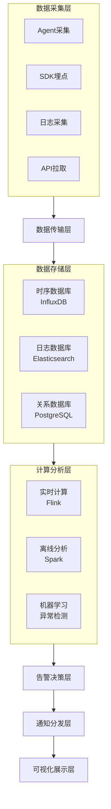
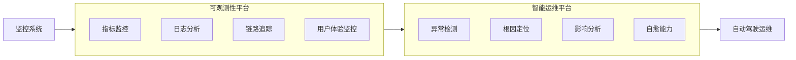

# 完整文档

**任务**: 监控告警系统
**时间**: 2026-06-04T23:10:10.940386

# 监控告警系统完整文档

## 文档信息
- **文档版本**：v1.0
- **创建日期**：2024年1月15日
- **最后更新**：2024年1月15日
- **作者**：系统架构团队
- **适用范围**：生产环境核心业务系统

---

## 目录
1. [系统概述](#1-系统概述)
2. [系统架构设计](#2-系统架构设计)
3. [监控指标体系](#3-监控指标体系)
4. [告警策略配置](#4-告警策略配置)
5. [通知渠道管理](#5-通知渠道管理)
6. [高可用与容灾设计](#6-高可用与容灾设计)
7. [运维操作手册](#7-运维操作手册)
8. [故障排查指南](#8-故障排查指南)
9. [版本迭代计划](#9-版本迭代计划)

---

## 1. 系统概述

### 1.1 系统定位
监控告警系统是生产环境的"眼睛和耳朵"，负责：
- 实时监控基础设施、中间件、应用服务和业务指标
- 快速发现系统异常和性能瓶颈
- 自动生成告警并推送至相关人员
- 提供历史数据分析和趋势预测

### 1.2 设计目标
| 目标维度 | 具体要求 |
|---------|---------|
| **实时性** | 指标采集延迟≤30秒，告警触发延迟≤60秒 |
| **准确性** | 告警准确率≥99.5%，误报率≤0.5% |
| **可靠性** | 系统可用性≥99.99%，支持多活部署 |
| **扩展性** | 支持水平扩展，单集群可监控10万+指标 |
| **易用性** | 提供可视化配置界面，降低运维门槛 |

### 1.3 覆盖范围
```
监控层级：
├── 基础设施层：服务器、网络设备、存储
├── 中间件层：数据库、缓存、消息队列
├── 应用服务层：微服务、API接口、定时任务
└── 业务逻辑层：用户行为、交易数据、业务指标
```

---

## 2. 系统架构设计

### 2.1 整体架构图


### 2.2 核心组件说明

#### 2.2.1 数据采集组件
| 组件 | 用途 | 部署方式 | 采集频率 |
|------|------|----------|----------|
| **Prometheus** | 基础设施监控 | Agent模式 | 15s/次 |
| **Filebeat** | 日志采集 | Sidecar模式 | 实时流式 |
| **SkyWalking** | 应用链路追踪 | SDK集成 | 实时采集 |
| **自定义Exporter** | 业务指标采集 | 独立服务 | 可配置 |

#### 2.2.2 数据传输通道
```
数据传输路径：
1. 直接推送：Agent → Kafka → 计算引擎
2. 远程写入：Prometheus → Remote Write → 存储层
3. 日志流：Filebeat → Logstash → Elasticsearch
```

#### 2.2.3 存储架构设计
```sql
-- 时序数据库表结构示例
CREATE TABLE metrics (
    time TIMESTAMPTZ NOT NULL,
    metric_name VARCHAR(200),
    labels JSONB,
    value DOUBLE PRECISION,
    PRIMARY KEY (time, metric_name, labels)
) PARTITION BY RANGE (time);

-- 创建自动分区（按天）
CREATE INDEX idx_metrics_time ON metrics (time);
```

---

## 3. 监控指标体系

### 3.1 指标分类标准
```
监控指标分级：
├── L0-核心指标（必须监控，5分钟内响应）
│   ├── 服务可用性：错误率、成功率
│   ├── 系统负载：CPU、内存、磁盘
│   └── 业务核心：交易量、用户活跃度
├── L1-重要指标（建议监控，30分钟内响应）
│   ├── 性能指标：响应时间、吞吐量
│   └── 资源指标：连接数、队列深度
└── L2-辅助指标（可选监控，按需响应）
    ├── 调试信息：GC次数、线程数
    └── 统计指标：分布统计、趋势分析
```

### 3.2 具体指标定义

#### 3.2.1 基础设施指标
```yaml
# 服务器监控指标
- cpu_usage_percent: # CPU使用率
    query: 100 - (avg by(instance) (irate(node_cpu_seconds_total{mode="idle"}[5m])) * 100)
    threshold: 
      warning: 70
      critical: 90
    unit: %

- memory_usage_percent: # 内存使用率
    query: (1 - (node_memory_MemAvailable_bytes / node_memory_MemTotal_bytes)) * 100
    threshold:
      warning: 80
      critical: 95
    unit: %

- disk_usage_percent: # 磁盘使用率
    query: (1 - (node_filesystem_avail_bytes{fstype!~"tmpfs"} / node_filesystem_size_bytes{fstype!~"tmpfs"})) * 100
    threshold:
      warning: 85
      critical: 95
    unit: %
```

#### 3.2.2 应用性能指标
```yaml
# API性能监控
- http_request_duration_seconds: # 请求响应时间
    query: histogram_quantile(0.95, sum(rate(http_request_duration_seconds_bucket[5m])) by (le, service))
    threshold:
      warning: 1.0  # 1秒
      critical: 3.0  # 3秒
    unit: seconds

- http_request_error_rate: # 请求错误率
    query: sum(rate(http_requests_total{status=~"5.."}[5m])) / sum(rate(http_requests_total[5m]))
    threshold:
      warning: 0.01   # 1%
      critical: 0.05   # 5%
    unit: ratio
```

#### 3.2.3 业务监控指标
```python
# 业务指标采集示例
class BusinessMetricsCollector:
    def __init__(self):
        self.metrics = {
            'order_count': {
                'description': '每分钟订单数量',
                'query': 'sum(rate(order_created_total[1m]))',
                'thresholds': {'warning': 100, 'critical': 50},
                'unit': '个/分钟'
            },
            'payment_success_rate': {
                'description': '支付成功率',
                'query': 'sum(rate(payment_success_total[5m])) / sum(rate(payment_total[5m]))',
                'thresholds': {'warning': 0.99, 'critical': 0.95},
                'unit': '%'
            }
        }
```

---

## 4. 告警策略配置

### 4.1 告警规则语法
```yaml
# Prometheus告警规则示例
groups:
  - name: application_alerts
    rules:
      - alert: HighErrorRate
        expr: |
          sum(rate(http_requests_total{status=~"5.."}[5m]))
          /
          sum(rate(http_requests_total[5m]))
          > 0.05
        for: 5m
        labels:
          severity: critical
          service: "{{ $labels.service }}"
        annotations:
          summary: "服务 {{ $labels.service }} 错误率过高"
          description: "{{ $labels.service }} 的错误率在过去5分钟内达到 {{ $value | humanizePercentage }}"
          runbook_url: "https://wiki.internal/runbooks/high-error-rate"
```

### 4.2 告警分级策略
| 级别 | 响应时间 | 影响范围 | 处理要求 | 通知方式 |
|------|----------|----------|----------|----------|
| **P0-致命** | 5分钟内 | 全系统不可用 | 立即响应，启动应急预案 | 电话+短信+IM群 |
| **P1-严重** | 15分钟内 | 核心功能受损 | 尽快处理，持续跟进 | 短信+IM群+邮件 |
| **P2-一般** | 1小时内 | 非核心功能异常 | 工作时间内处理 | IM群+邮件 |
| **P3-提示** | 下一工作日 | 潜在风险预警 | 计划性处理 | 邮件 |

### 4.3 智能告警降噪
```python
# 告警收敛算法示例
class AlertConvergence:
    def __init__(self):
        self.window_size = 300  # 5分钟窗口
        self.max_alerts = 10    # 窗口内最大告警数
        
    def should_alert(self, alert_key, current_time):
        """判断是否应该发送告警"""
        recent_alerts = self.get_recent_alerts(alert_key, current_time)
        
        # 策略1：相同告警在窗口内只发一次
        if len(recent_alerts) > 0:
            last_alert_time = max(alert['time'] for alert in recent_alerts)
            if current_time - last_alert_time < self.window_size:
                return False
        
        # 策略2：相关告警合并
        related_alerts = self.find_related_alerts(alert_key)
        if len(related_alerts) > 0:
            return self.merge_related_alerts(alert_key, related_alerts)
        
        return True
    
    def merge_related_alerts(self, alert_key, related_alerts):
        """合并相关告警"""
        # 如果是同一服务的不同指标告警，合并为一个综合告警
        if self.is_same_service_alerts(alert_key, related_alerts):
            self.create_merged_alert(alert_key, related_alerts)
            return False
        return True
```

---

## 5. 通知渠道管理

### 5.1 通知渠道配置
```yaml
# 通知渠道配置文件
notification_channels:
  # 邮件渠道
  - name: "ops_team_email"
    type: "email"
    config:
      smtp_server: "smtp.company.com"
      smtp_port: 587
      username: "alerts@company.com"
      password: "${EMAIL_PASSWORD}"
      from_address: "alerts@company.com"
      to_addresses:
        - "ops-team@company.com"
        - "manager@company.com"
    
  # 企业微信机器人
  - name: "wecom_robot"
    type: "webhook"
    config:
      url: "https://qyapi.weixin.qq.com/cgi-bin/webhook/send?key=xxx"
      method: "POST"
      headers:
        Content-Type: "application/json"
      message_template: |
        {
          "msgtype": "markdown",
          "markdown": {
            "content": "### 告警通知\n**级别**: {{ .Labels.severity }}\n**服务**: {{ .Labels.service }}\n**详情**: {{ .Annotations.description }}"
          }
        }
    
  # 短信渠道（备用）
  - name: "sms_gateway"
    type: "sms"
    config:
      api_url: "https://sms-gateway.internal/send"
      api_key: "${SMS_API_KEY}"
      phones:
        - "+8613800138000"
```

### 5.2 通知路由规则
```yaml
# 告警路由配置
routing_rules:
  # 路由规则1：按告警级别路由
  - match:
      severity: "critical"
    receiver: "oncall_phone"
    continue: false
    
  # 路由规则2：按服务类型路由
  - match:
      service: "payment-service"
    receiver: "payment_team"
    continue: true
    
  # 路由规则3：按时间段路由
  - match:
      severity: "warning"
    time_periods:
      - start: "09:00"
        end: "18:00"
        receiver: "daytime_team"
      - start: "18:00"
        end: "09:00"
        receiver: "oncall_team"
```

### 5.3 值班人员管理
```sql
-- 值班人员表结构
CREATE TABLE oncall_schedule (
    id SERIAL PRIMARY KEY,
    team VARCHAR(50) NOT NULL,
    user_id VARCHAR(50) NOT NULL,
    start_time TIMESTAMPTZ NOT NULL,
    end_time TIMESTAMPTZ NOT NULL,
    priority INTEGER DEFAULT 1,
    contact_info JSONB,
    is_active BOOLEAN DEFAULT TRUE
);

-- 自动值班调度函数
CREATE OR REPLACE FUNCTION get_oncall_person(p_team VARCHAR, p_time TIMESTAMPTZ)
RETURNS TABLE(user_id VARCHAR, contact_info JSONB) AS $$
BEGIN
    RETURN QUERY
    SELECT os.user_id, os.contact_info
    FROM oncall_schedule os
    WHERE os.team = p_team
      AND os.is_active = TRUE
      AND os.start_time <= p_time
      AND os.end_time > p_time
    ORDER BY os.priority
    LIMIT 1;
END;
$$ LANGUAGE plpgsql;
```

---

## 6. 高可用与容灾设计

### 6.1 部署架构
```
多活部署方案：
主集群（北京）：
├── Prometheus Cluster (3节点)
├── Alertmanager Cluster (3节点)
├── Grafana HA (2节点)
└── 存储集群 (3副本)

备用集群（上海）：
├── 同步副本（延迟<1分钟）
├── 独立告警规则
└── 自动切换机制

容灾策略：
1. 数据同步：跨机房实时同步
2. 服务发现：DNS智能解析
3. 故障检测：心跳检测+质量评分
4. 自动切换：基于健康检查自动切流
```

### 6.2 数据备份策略
```bash
#!/bin/bash
# 数据备份脚本
BACKUP_DIR="/data/backup/monitoring"
DATE=$(date +%Y%m%d)
RETENTION_DAYS=30

# 备份Prometheus数据
echo "备份Prometheus数据..."
mkdir -p $BACKUP_DIR/prometheus/$DATE
curl -XPOST http://prometheus:9090/api/v1/admin/tsdb/snapshot
tar -czf $BACKUP_DIR/prometheus/$DATE/snapshot.tar.gz /data/prometheus/snapshots

# 备份告警配置
echo "备份告警配置..."
cp /etc/alertmanager/*.yml $BACKUP_DIR/alertmanager/$DATE/

# 备份Grafana仪表板
echo "备份Grafana仪表板..."
pg_dump -U grafana -Fc grafana > $BACKUP_DIR/grafana/$DATE/grafana.dump

# 清理旧备份
echo "清理${RETENTION_DAYS}天前的备份..."
find $BACKUP_DIR -name "*.tar.gz" -mtime +$RETENTION_DAYS -delete
find $BACKUP_DIR -name "*.dump" -mtime +$RETENTION_DAYS -delete

echo "备份完成: $DATE"
```

### 6.3 容量规划模型
```python
# 容量计算模型
class CapacityPlanner:
    def __init__(self):
        # 基础参数
        self.metrics_per_host = 200  # 每主机指标数
        self.samples_per_minute = 4  # 每分钟采样数（15秒间隔）
        self.retention_days = 90     # 数据保留天数
        
    def calculate_storage(self, host_count):
        """计算存储需求"""
        total_metrics = host_count * self.metrics_per_host
        samples_per_day = total_metrics * self.samples_per_minute * 1440
        
        # 每个样本约16字节（时间戳8字节+值8字节）
        daily_storage_gb = (samples_per_day * 16) / (1024**3)
        total_storage_gb = daily_storage_gb * self.retention_days
        
        # 考虑压缩和索引，乘以1.5系数
        return {
            'daily_storage_gb': round(daily_storage_gb, 2),
            'total_storage_gb': round(total_storage_gb * 1.5, 2),
            'recommended_storage_gb': round(total_storage_gb * 1.5 * 1.2, 2)  # 20%余量
        }
    
    def calculate_compute(self, host_count):
        """计算计算资源需求"""
        # CPU: 每1000个指标需要0.5核
        cpu_cores = max(4, host_count * self.metrics_per_host / 1000 * 0.5)
        
        # 内存: 每1000个指标需要1GB
        memory_gb = max(8, host_count * self.metrics_per_host / 1000 * 1.0)
        
        return {
            'cpu_cores': round(cpu_cores, 1),
            'memory_gb': round(memory_gb, 1),
            'node_count': max(3, int(cpu_cores / 4))  # 每节点4核
        }
```

---

## 7. 运维操作手册

### 7.1 日常运维流程
```
每日巡检流程：
08:30 - 09:00  系统健康检查
├── 检查监控系统自身状态
├── 确认所有数据采集正常
└── 查看昨日告警统计

09:00 - 09:30  告警分析
├── 分析告警趋势变化
├── 评估告警规则有效性
└── 更新告警阈值（如需）

14:00 - 15:00  性能优化
├── 清理过期数据
├── 优化慢查询
└── 调整资源配置

17:00 - 17:30  报告生成
├── 生成每日监控报告
├── 更新值班记录
└── 规划次日工作
```

### 7.2 配置管理流程
```yaml
# 配置变更管理
change_management:
  request_template:
    - change_id: "CHG-2024-001"
    - change_type: "告警规则修改"
    - requester: "张三"
    - approver: "李四"
    - change_description: "调整支付服务错误率阈值"
    - risk_assessment: "低风险"
    - rollback_plan: "恢复原配置文件"
    - implementation_time: "2024-01-16 02:00"
    - validation_steps:
        - "验证新规则生效"
        - "测试告警触发"
        - "确认通知正常"
```

### 7.3 应急处理流程
```python
# 应急响应脚本
class EmergencyResponse:
    def handle_critical_alert(self, alert):
        """处理P0级别告警"""
        print(f"🚨 紧急告警: {alert['summary']}")
        
        # 1. 立即通知值班人员
        self.notify_oncall(alert)
        
        # 2. 启动自动诊断
        diagnosis = self.auto_diagnose(alert)
        
        # 3. 执行预定义修复动作
        if diagnosis['auto_fixable']:
            self.execute_auto_fix(alert, diagnosis)
        
        # 4. 记录应急日志
        self.log_emergency(alert, diagnosis)
        
        # 5. 生成事后报告模板
        self.generate_incident_template(alert)
    
    def auto_diagnose(self, alert):
        """自动诊断告警原因"""
        service = alert['labels'].get('service')
        
        # 检查服务依赖
        dependencies = self.check_dependencies(service)
        
        # 检查资源状态
        resources = self.check_resources(service)
        
        # 检查最近变更
        changes = self.check_recent_changes(service)
        
        return {
            'dependencies': dependencies,
            'resources': resources,
            'changes': changes,
            'auto_fixable': self.is_auto_fixable(alert)
        }
```

---

## 8. 故障排查指南

### 8.1 常见问题处理

#### 问题1：监控数据丢失
```
现象：Grafana仪表板显示数据断点
排查步骤：
1. 检查数据源连接状态
   curl http://prometheus:9090/api/v1/status/config

2. 检查采集目标状态
   curl http://prometheus:9090/api/v1/targets

3. 检查存储层健康
   curl http://influxdb:8086/health

4. 查看相关日志
   kubectl logs -f deployment/prometheus -n monitoring

解决方案：
- 如果是网络问题：检查防火墙规则
- 如果是存储问题：检查磁盘空间和IOPS
- 如果是配置问题：验证Prometheus配置文件
```

#### 问题2：告警风暴
```
现象：短时间内收到大量告警
处理流程：
1. 立即启用告警抑制
   curl -X POST http://alertmanager:9093/api/v2/silences -d @silence.json

2. 分析告警根因
   # 查看告警统计
   curl http://alertmanager:9093/api/v2/alerts/groups

3. 临时调整告警阈值
   kubectl edit configmap alert-rules -n monitoring

4. 启用告警聚合
   alertmanager:
     route:
       group_by: ['service', 'alertname']
       group_wait: 30s
       group_interval: 5m
```

### 8.2 性能调优指南
```sql
-- InfluxDB性能优化
-- 1. 创建保留策略
CREATE RETENTION POLICY "one_year" ON "monitoring" 
DURATION 52w REPLICATION 1 DEFAULT;

-- 2. 创建连续查询（降采样）
CREATE CONTINUOUS QUERY "cq_1h" ON "monitoring"
BEGIN
  SELECT mean(*) INTO "one_year".:MEASUREMENT 
  FROM /.*/ 
  GROUP BY time(1h), *
END;

-- 3. 优化查询性能
-- 避免全表扫描
SELECT mean("usage_idle") 
FROM "cpu" 
WHERE time > now() - 1h 
  AND "host" = 'web-01'
GROUP BY time(5m)

-- 使用正则表达式匹配多个指标
SELECT mean(*) 
FROM /^cpu|memory$/ 
WHERE time > now() - 5m 
GROUP BY time(1m)
```

### 8.3 故障转移测试
```bash
#!/bin/bash
# 故障转移测试脚本
echo "开始监控系统故障转移测试..."

# 步骤1：模拟主集群故障
echo "1. 模拟主Prometheus集群故障..."
kubectl scale deployment prometheus-master -n monitoring --replicas=0

# 步骤2：检查备用集群接管
echo "2. 检查备用集群状态..."
sleep 60  # 等待故障转移
curl -f http://prometheus-standby:9090/-/healthy || exit 1

# 步骤3：验证告警功能
echo "3. 发送测试告警..."
curl -X POST http://alertmanager-standby:9093/api/v2/alerts \
  -H "Content-Type: application/json" \
  -d '[{"labels":{"alertname":"TestFailover","severity":"critical"}}]'

# 步骤4：检查通知发送
echo "4. 检查通知发送记录..."
sleep 30
curl http://alertmanager-standby:9093/api/v2/alerts/groups | jq '.[] | select(.labels.alertname=="TestFailover")'

# 步骤5：恢复主集群
echo "5. 恢复主集群..."
kubectl scale deployment prometheus-master -n monitoring --replicas=3

# 步骤6：验证数据同步
echo "6. 验证数据同步..."
curl http://prometheus-master:9090/api/v1/query?query=up

echo "故障转移测试完成！"
```

---

## 9. 版本迭代计划

### 9.1 近期规划（1-3个月）
| 版本 | 功能特性 | 预期收益 | 负责人 |
|------|----------|----------|--------|
| v1.1 | 增强异常检测算法 | 降低误报率30% | 数据团队 |
| v1.2 | 移动端告警推送 | 响应时间缩短50% | 移动团队 |
| v1.3 | 自动化修复集成 | MTTR降低40% | 运维团队 |

### 9.2 中期规划（3-6个月）
- **AI预测告警**：基于历史数据预测潜在故障
- **根因分析**：自动分析告警根本原因
- **成本优化**：监控资源使用效率并提出优化建议

### 9.3 长期愿景（6-12个月）


---

## 附录

### A. 常用命令速查
```bash
# Prometheus操作
curl http://localhost:9090/api/v1/status/config  # 查看配置
curl http://localhost:9090/api/v1/targets         # 查看监控目标
curl http://localhost:9090/api/v1/query?query=up  # 查询指标

# Alertmanager操作
amtool silence add alertname="TestAlert" --comment="测试静默"  # 添加静默
amtool config routes test --tree  # 测试路由规则

# Grafana操作
grafana-cli admin reset-admin-password admin  # 重置密码
grafana-cli plugins install grafana-clock-panel  # 安装插件
```

### B. 参考文档
1. [Prometheus官方文档](https://prometheus.io/docs/)
2. [Grafana最佳实践](https://grafana.com/docs/grafana/latest/best-practices/)
3. [Google SRE手册 - 监控](https://sre.google/sre-book/practical-alerting/)
4. [内部运维规范文档链接]

### C. 联系方式
- **系统管理员**：ops-team@company.com
- **值班电话**：+86-10-12345678
- **紧急联系**：紧急事件响应群（企业微信群ID: XXXXX）

---

**文档维护说明**：
1. 本文档每月至少审核更新一次
2. 重大变更需经过技术委员会评审
3. 历史版本归档至Git仓库：`docs/monitoring/`

**最后更新**：2024年1月15日  
**审核人**：[技术总监签名]  
**批准人**：[CTO签名]

---

*本文档为公司机密，未经授权不得外传*