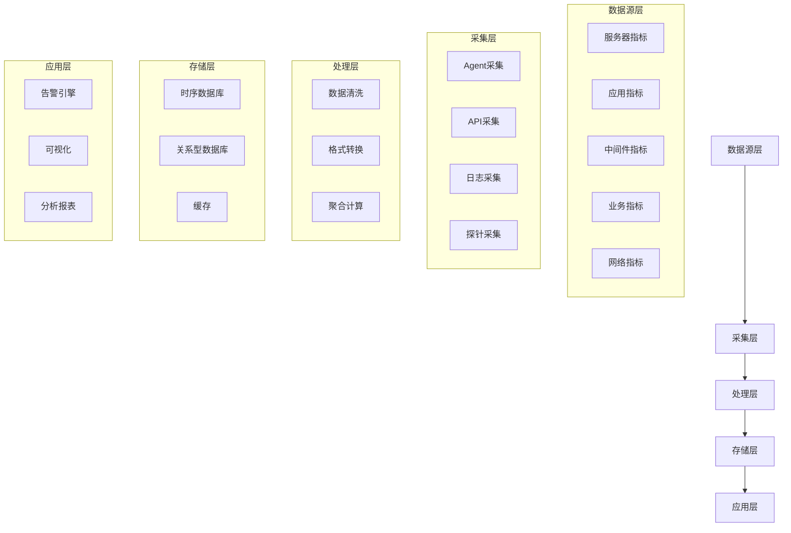

# 实现指标采集

**任务**: 监控告警系统
**时间**: 2026-06-05T01:02:23.363966

# 监控告警系统 - 指标采集模块设计文档

## 1. 概述

指标采集是监控告警系统的核心基础模块，负责从各种数据源收集系统、应用和业务的关键指标数据，为后续的告警判断、可视化展示和趋势分析提供数据支持。

## 2. 整体架构设计



## 3. 指标分类与定义

### 3.1 系统指标
- **CPU相关**
  - `cpu.usage.total`: CPU总使用率
  - `cpu.usage.user`: 用户空间CPU使用率
  - `cpu.usage.system`: 系统空间CPU使用率
  - `cpu.load.1min/5min/15min`: CPU负载

- **内存相关**
  - `memory.total`: 总内存
  - `memory.used`: 已用内存
  - `memory.free`: 空闲内存
  - `memory.usage`: 内存使用率
  - `memory.swap.used`: 交换分区使用量

- **磁盘相关**
  - `disk.usage`: 磁盘使用率
  - `disk.io.read`: 磁盘读取速率
  - `disk.io.write`: 磁盘写入速率
  - `disk.iops`: 磁盘IOPS

### 3.2 应用指标
- **JVM指标** (Java应用)
  - `jvm.heap.used`: 堆内存使用量
  - `jvm.non_heap.used`: 非堆内存使用量
  - `jvm.gc.count`: GC次数
  - `jvm.gc.time`: GC耗时

- **HTTP服务指标**
  - `http.request.count`: 请求总数
  - `http.response.time`: 平均响应时间
  - `http.error.rate`: 错误率
  - `http.status.2xx/3xx/4xx/5xx`: 各状态码请求数

### 3.3 中间件指标
- **MySQL**
  - `mysql.connections`: 连接数
  - `mysql.queries`: 查询数
  - `mysql.slow_queries`: 慢查询数
  - `mysql.innodb_buffer_pool_usage`: 缓冲池使用率

- **Redis**
  - `redis.connected_clients`: 客户端连接数
  - `redis.used_memory`: 内存使用量
  - `redis.keyspace_hits/misses`: 缓存命中率
  - `redis.ops_per_sec`: 每秒操作数

## 4. 采集技术方案

### 4.1 采集方式

#### 4.1.1 Agent采集模式
```python
# Agent采集器示例代码
import psutil
import time
import json
import requests
from datetime import datetime

class SystemMetricsCollector:
    """系统指标采集器"""
    
    def __init__(self, collect_interval=5):
        self.collect_interval = collect_interval
        self.last_cpu_times = None
    
    def collect_cpu_metrics(self):
        """采集CPU指标"""
        cpu_percent = psutil.cpu_percent(interval=1)
        cpu_times_percent = psutil.cpu_times_percent(interval=1)
        load_avg = psutil.getloadavg()
        
        return {
            'timestamp': datetime.utcnow().isoformat(),
            'cpu': {
                'usage_total': cpu_percent,
                'usage_user': cpu_times_percent.user,
                'usage_system': cpu_times_percent.system,
                'load_1min': load_avg[0],
                'load_5min': load_avg[1],
                'load_15min': load_avg[2]
            }
        }
    
    def collect_memory_metrics(self):
        """采集内存指标"""
        memory = psutil.virtual_memory()
        swap = psutil.swap_memory()
        
        return {
            'timestamp': datetime.utcnow().isoformat(),
            'memory': {
                'total': memory.total,
                'used': memory.used,
                'free': memory.free,
                'usage': memory.percent,
                'swap_used': swap.used
            }
        }
    
    def collect_disk_metrics(self):
        """采集磁盘指标"""
        disk_usage = []
        for partition in psutil.disk_partitions():
            try:
                usage = psutil.disk_usage(partition.mountpoint)
                disk_usage.append({
                    'device': partition.device,
                    'mountpoint': partition.mountpoint,
                    'usage': usage.percent,
                    'used': usage.used,
                    'free': usage.free
                })
            except PermissionError:
                continue
        
        # 磁盘IO统计
        disk_io = psutil.disk_io_counters(perdisk=False)
        
        return {
            'timestamp': datetime.utcnow().isoformat(),
            'disk': {
                'partitions': disk_usage,
                'io': {
                    'read_bytes': disk_io.read_bytes,
                    'write_bytes': disk_io.write_bytes,
                    'read_count': disk_io.read_count,
                    'write_count': disk_io.write_count
                }
            }
        }
    
    def collect_all_metrics(self):
        """收集所有指标"""
        metrics = {}
        metrics.update(self.collect_cpu_metrics())
        metrics.update(self.collect_memory_metrics())
        metrics.update(self.collect_disk_metrics())
        return metrics
    
    def start_collection(self, endpoint_url):
        """启动采集任务"""
        print(f"开始采集指标，间隔: {self.collect_interval}秒")
        
        while True:
            try:
                metrics = self.collect_all_metrics()
                self.send_metrics(metrics, endpoint_url)
                print(f"[{datetime.now()}] 指标采集成功")
            except Exception as e:
                print(f"采集失败: {e}")
            
            time.sleep(self.collect_interval)
    
    def send_metrics(self, metrics, endpoint_url):
        """发送指标到采集中心"""
        headers = {'Content-Type': 'application/json'}
        response = requests.post(
            endpoint_url, 
            data=json.dumps(metrics), 
            headers=headers,
            timeout=10
        )
        
        if response.status_code != 200:
            raise Exception(f"发送失败: {response.status_code}")

# 使用示例
if __name__ == "__main__":
    collector = SystemMetricsCollector(collect_interval=10)
    collector.start_collection("http://collector.example.com/api/metrics")
```

#### 4.1.2 API采集模式
```yaml
# API采集配置文件 (api_collector.yaml)
api_targets:
  - name: "用户服务API"
    url: "http://user-service:8080/metrics"
    method: "GET"
    interval: 30s
    timeout: 10s
    headers:
      Authorization: "Bearer ${API_TOKEN}"
    metrics:
      - name: "user_api_response_time"
        path: "$.response_time"
        type: "gauge"
      - name: "user_api_request_count"
        path: "$.request_count"
        type: "counter"
  
  - name: "支付服务API"
    url: "http://payment-service:8090/health"
    method: "GET"
    interval: 60s
    metrics:
      - name: "payment_service_status"
        value_map:
          "healthy": 1
          "unhealthy": 0
```

### 4.2 采集频率策略

| 指标类型 | 采集频率 | 说明 |
|---------|---------|------|
| 系统核心指标 (CPU/内存/磁盘) | 5-10秒 | 需要实时监控 |
| 应用业务指标 | 10-30秒 | 根据业务重要性调整 |
| 中间件指标 | 30-60秒 | 平衡监控粒度和资源消耗 |
| 网络指标 | 10-15秒 | 网络流量监控 |
| 业务日志指标 | 5-15秒 | 关键业务事件监控 |

### 4.3 指标处理流水线

```python
# 指标处理流水线实现
class MetricsPipeline:
    """指标处理流水线"""
    
    def __init__(self):
        self.processors = [
            self.validate_metrics,
            self.clean_metrics,
            self.enrich_metrics,
            self.aggregate_metrics
        ]
    
    def process(self, raw_metrics):
        """处理原始指标数据"""
        result = raw_metrics
        
        for processor in self.processors:
            try:
                result = processor(result)
            except Exception as e:
                self.handle_processing_error(e, result)
                break
        
        return result
    
    def validate_metrics(self, metrics):
        """验证指标数据格式"""
        required_fields = ['timestamp', 'host', 'metrics']
        
        for field in required_fields:
            if field not in metrics:
                raise ValueError(f"缺少必要字段: {field}")
        
        # 验证指标值类型
        for key, value in metrics['metrics'].items():
            if not isinstance(value, (int, float)):
                if not self.is_numeric_string(value):
                    raise ValueError(f"指标值类型错误: {key}={value}")
        
        return metrics
    
    def clean_metrics(self, metrics):
        """清洗指标数据"""
        # 处理异常值
        cleaned_metrics = {}
        
        for key, value in metrics['metrics'].items():
            # 过滤明显异常值
            if key == 'cpu.usage' and value > 100:
                value = 100.0
            elif key == 'memory.usage' and value > 100:
                value = 100.0
            elif value < 0 and 'usage' in key:
                value = 0.0
            
            cleaned_metrics[key] = value
        
        metrics['metrics'] = cleaned_metrics
        return metrics
    
    def enrich_metrics(self, metrics):
        """丰富指标数据"""
        # 添加环境信息
        metrics['environment'] = self.detect_environment()
        
        # 添加业务标签
        metrics['labels'] = self.get_business_labels()
        
        # 添加主机元数据
        metrics['host_info'] = self.get_host_metadata()
        
        return metrics
    
    def aggregate_metrics(self, metrics):
        """聚合指标数据"""
        # 对于需要聚合的指标进行计算
        if 'raw_values' in metrics:
            aggregated = {}
            
            for metric_name, values in metrics['raw_values'].items():
                if len(values) > 0:
                    aggregated[metric_name] = {
                        'avg': sum(values) / len(values),
                        'max': max(values),
                        'min': min(values),
                        'last': values[-1]
                    }
            
            metrics['aggregated'] = aggregated
        
        return metrics
```

## 5. 部署配置

### 5.1 Agent部署配置

```bash
#!/bin/bash
# agent_deploy.sh - 指标采集Agent部署脚本

AGENT_VERSION="1.0.0"
INSTALL_DIR="/opt/monitoring-agent"
CONFIG_DIR="/etc/monitoring-agent"
LOG_DIR="/var/log/monitoring-agent"

# 创建目录
mkdir -p $INSTALL_DIR $CONFIG_DIR $LOG_DIR

# 安装依赖
echo "安装系统依赖..."
if command -v apt-get &> /dev/null; then
    apt-get update
    apt-get install -y python3 python3-pip
elif command -v yum &> /dev/null; then
    yum install -y python3 python3-pip
fi

# 安装Python依赖
pip3 install psutil requests pyyaml

# 下载Agent
echo "下载Agent..."
wget -O $INSTALL_DIR/agent.py https://example.com/downloads/monitoring-agent-$AGENT_VERSION.py

# 创建配置文件
cat > $CONFIG_DIR/agent.yaml << EOF
# 监控Agent配置
agent:
  collect_interval: 10  # 采集间隔(秒)
  log_level: INFO
  
  # 采集目标配置
  targets:
    system:
      enabled: true
      cpu: true
      memory: true
      disk: true
      network: true
    
    application:
      enabled: true
      jvm: true
      http: true
      database: true
    
    custom_metrics:
      enabled: true
      scripts:
        - /opt/monitoring-agent/scripts/business_metrics.py
  
  # 数据上报配置
  reporting:
    endpoint: "http://monitoring-server:8080/api/v1/metrics"
    batch_size: 100
    flush_interval: 30
    timeout: 10
    
    # 认证配置
    auth:
      type: "token"
      token: "${MONITORING_TOKEN}"
  
  # 性能配置
  performance:
    max_workers: 4
    queue_size: 1000
    retry_times: 3
    retry_interval: 5
  
  # 安全配置
  security:
    ssl_verify: true
    ca_cert: "/etc/monitoring-agent/certs/ca.crt"
EOF

# 创建systemd服务
cat > /etc/systemd/system/monitoring-agent.service << EOF
[Unit]
Description=Monitoring Agent Service
After=network.target

[Service]
Type=simple
User=monitoring
Group=monitoring
WorkingDirectory=$INSTALL_DIR
ExecStart=/usr/bin/python3 $INSTALL_DIR/agent.py -c $CONFIG_DIR/agent.yaml
Restart=always
RestartSec=5
StandardOutput=append:$LOG_DIR/agent.log
StandardError=append:$LOG_DIR/agent-error.log

[Install]
WantedBy=multi-user.target
EOF

# 创建监控用户
useradd -r -s /bin/false monitoring

# 设置权限
chown -R monitoring:monitoring $INSTALL_DIR $CONFIG_DIR $LOG_DIR
chmod 755 $INSTALL_DIR
chmod 600 $CONFIG_DIR/agent.yaml

# 启动服务
systemctl daemon-reload
systemctl enable monitoring-agent
systemctl start monitoring-agent

echo "Agent部署完成!"
echo "配置文件: $CONFIG_DIR/agent.yaml"
echo "日志文件: $LOG_DIR/agent.log"
```

### 5.2 Docker部署配置

```yaml
# docker-compose.yml
version: '3.8'

services:
  monitoring-agent:
    image: monitoring-agent:latest
    container_name: monitoring-agent
    restart: unless-stopped
    
    environment:
      - COLLECT_INTERVAL=10
      - REPORT_ENDPOINT=http://monitoring-server:8080/api/v1/metrics
      - AUTH_TOKEN=${MONITORING_TOKEN}
      - LOG_LEVEL=INFO
    
    volumes:
      - ./config/agent.yaml:/app/config/agent.yaml:ro
      - /proc:/host/proc:ro
      - /sys:/host/sys:ro
      - /etc:/host/etc:ro
      - /var/run/docker.sock:/var/run/docker.sock:ro
    
    networks:
      - monitoring-network
    
    deploy:
      resources:
        limits:
          cpus: '0.5'
          memory: 256M
    
    logging:
      driver: "json-file"
      options:
        max-size: "10m"
        max-file: "3"

  # 指标收集器（可选）
  metrics-collector:
    image: prom/prometheus:latest
    container_name: metrics-collector
    ports:
      - "9090:9090"
    
    volumes:
      - ./prometheus.yml:/etc/prometheus/prometheus.yml
      - prometheus_data:/prometheus
    
    command:
      - '--config.file=/etc/prometheus/prometheus.yml'
      - '--storage.tsdb.path=/prometheus'
      - '--web.console.libraries=/etc/prometheus/console_libraries'
      - '--web.console.templates=/etc/prometheus/consoles'
      - '--storage.tsdb.retention.time=200h'
      - '--web.enable-lifecycle'

networks:
  monitoring-network:
    driver: bridge

volumes:
  prometheus_data:
    driver: local
```

## 6. 高可用与容错设计

### 6.1 数据缓冲机制
```python
class MetricsBuffer:
    """指标数据缓冲器"""
    
    def __init__(self, max_size=10000, flush_interval=30):
        self.buffer = []
        self.max_size = max_size
        self.flush_interval = flush_interval
        self.lock = threading.Lock()
        self.last_flush = time.time()
        
        # 启动定时刷新线程
        self.flush_thread = threading.Thread(target=self._periodic_flush)
        self.flush_thread.daemon = True
        self.flush_thread.start()
    
    def add_metrics(self, metrics):
        """添加指标到缓冲区"""
        with self.lock:
            self.buffer.append(metrics)
            
            # 缓冲区满时立即刷新
            if len(self.buffer) >= self.max_size:
                self._flush_buffer()
    
    def _flush_buffer(self):
        """刷新缓冲区数据"""
        if not self.buffer:
            return []
        
        # 复制并清空缓冲区
        with self.lock:
            metrics_to_flush = self.buffer.copy()
            self.buffer.clear()
            self.last_flush = time.time()
        
        return metrics_to_flush
    
    def _periodic_flush(self):
        """定时刷新线程"""
        while True:
            time.sleep(self.flush_interval)
            if time.time() - self.last_flush >= self.flush_interval:
                metrics = self._flush_buffer()
                if metrics:
                    self._send_metrics(metrics)
    
    def _send_metrics(self, metrics):
        """发送指标到服务端"""
        try:
            # 分批发送，避免一次性发送过多数据
            batch_size = 100
            for i in range(0, len(metrics), batch_size):
                batch = metrics[i:i + batch_size]
                self._send_batch(batch)
                
            logger.info(f"成功发送 {len(metrics)} 条指标")
        except Exception as e:
            logger.error(f"发送指标失败: {e}")
            # 重新放入缓冲区
            with self.lock:
                self.buffer.extend(metrics)
```

### 6.2 故障转移机制
- **本地缓存**：当网络中断时，指标数据缓存到本地文件
- **重试机制**：指数退避算法，最多重试3次
- **备用通道**：支持HTTP、gRPC、消息队列等多种上报方式
- **降级策略**：高频指标降级为低频采集

## 7. 性能优化策略

### 7.1 数据压缩
```python
import gzip
import json
import base64

class MetricsCompressor:
    """指标数据压缩器"""
    
    @staticmethod
    def compress_metrics(metrics):
        """压缩指标数据"""
        # JSON序列化
        json_data = json.dumps(metrics, ensure_ascii=False)
        
        # GZIP压缩
        compressed = gzip.compress(json_data.encode('utf-8'))
        
        # Base64编码
        encoded = base64.b64encode(compressed).decode('ascii')
        
        return {
            'compressed': True,
            'encoding': 'base64+gzip',
            'data': encoded
        }
    
    @staticmethod
    def decompress_metrics(compressed_data):
        """解压指标数据"""
        if compressed_data.get('compressed'):
            # Base64解码
            decoded = base64.b64decode(compressed_data['data'])
            
            # GZIP解压
            decompressed = gzip.decompress(decoded)
            
            # JSON反序列化
            return json.loads(decompressed.decode('utf-8'))
        
        return compressed_data
```

### 7.2 采样策略
```python
class AdaptiveSampler:
    """自适应采样器"""
    
    def __init__(self, base_interval=10, min_interval=1, max_interval=60):
        self.base_interval = base_interval
        self.min_interval = min_interval
        self.max_interval = max_interval
        self.current_interval = base_interval
        self.error_count = 0
        self.success_count = 0
    
    def get_next_interval(self, metrics_count):
        """获取下次采集间隔"""
        # 根据采集成功率动态调整间隔
        if self.success_count + self.error_count > 100:
            success_rate = self.success_count / (self.success_count + self.error_count)
            
            if success_rate > 0.9:
                # 成功率高，可以适当降低频率
                self.current_interval = min(
                    self.current_interval * 1.2, 
                    self.max_interval
                )
            elif success_rate < 0.5:
                # 成功率低，提高频率以更快发现问题
                self.current_interval = max(
                    self.current_interval * 0.8,
                    self.min_interval
                )
            
            # 重置计数器
            self.success_count = 0
            self.error_count = 0
        
        return self.current_interval
```

## 8. 安全设计

### 8.1 认证与授权
```python
class MetricsAuthenticator:
    """指标上报认证"""
    
    def __init__(self, auth_type="token"):
        self.auth_type = auth_type
        self.token_cache = {}
    
    def authenticate(self, request):
        """认证请求"""
        if self.auth_type == "token":
            return self._token_auth(request)
        elif self.auth_type == "tls":
            return self._tls_auth(request)
        elif self.auth_type == "oauth2":
            return self._oauth2_auth(request)
        
        return False
    
    def _token_auth(self, request):
        """Token认证"""
        auth_header = request.headers.get('Authorization', '')
        
        if not auth_header.startswith('Bearer '):
            return False
        
        token = auth_header[7:]  # 移除 "Bearer " 前缀
        
        # 验证token
        return self._validate_token(token)
    
    def _validate_token(self, token):
        """验证token有效性"""
        # 检查缓存
        if token in self.token_cache:
            cached = self.token_cache[token]
            if time.time() < cached['expire_at']:
                return True
        
        # 查询token信息
        token_info = self._query_token_info(token)
        
        if token_info and token_info['valid']:
            # 缓存token
            self.token_cache[token] = {
                'expire_at': time.time() + token_info['expire_in'],
                'scopes': token_info['scopes']
            }
            return True
        
        return False
    
    def _query_token_info(self, token):
        """查询token信息"""
        # 这里实现实际的token验证逻辑
        # 可以是数据库查询、API调用等
        pass
```

### 8.2 数据加密
```python
class MetricsEncryptor:
    """指标数据加密器"""
    
    def __init__(self, encryption_key):
        self.key = encryption_key
    
    def encrypt_metrics(self, metrics):
        """加密指标数据"""
        # 将指标转换为JSON
        json_data = json.dumps(metrics)
        
        # 使用AES-GCM加密
        nonce = os.urandom(12)
        cipher = AES.new(self.key, AES.MODE_GCM, nonce=nonce)
        ciphertext, tag = cipher.encrypt_and_digest(json_data.encode())
        
        return {
            'encrypted': True,
            'algorithm': 'AES-GCM',
            'nonce': base64.b64encode(nonce).decode(),
            'tag': base64.b64encode(tag).decode(),
            'data': base64.b64encode(ciphertext).decode()
        }
    
    def decrypt_metrics(self, encrypted_data):
        """解密指标数据"""
        if encrypted_data.get('encrypted'):
            # 解码
            nonce = base64.b64decode(encrypted_data['nonce'])
            tag = base64.b64decode(encrypted_data['tag'])
            ciphertext = base64.b64decode(encrypted_data['data'])
            
            # 解密
            cipher = AES.new(self.key, AES.MODE_GCM, nonce=nonce)
            json_data = cipher.decrypt_and_verify(ciphertext, tag)
            
            # 解析JSON
            return json.loads(json_data.decode())
        
        return encrypted_data
```

## 9. 监控与运维

### 9.1 采集器健康检查
```python
class AgentHealthChecker:
    """Agent健康检查"""
    
    def check_health(self):
        """检查Agent健康状况"""
        health_status = {
            'status': 'healthy',
            'timestamp': datetime.utcnow().isoformat(),
            'checks': []
        }
        
        # 检查内存使用
        memory_check = self.check_memory_usage()
        health_status['checks'].append(memory_check)
        
        # 检查CPU使用
        cpu_check = self.check_cpu_usage()
        health_status['checks'].append(cpu_check)
        
        # 检查缓冲区状态
        buffer_check = self.check_buffer_status()
        health_status['checks'].append(buffer_check)
        
        # 检查网络连接
        network_check = self.check_network_connectivity()
        health_status['checks'].append(network_check)
        
        # 计算总体状态
        if any(check['status'] == 'error' for check in health_status['checks']):
            health_status['status'] = 'unhealthy'
        elif any(check['status'] == 'warning' for check in health_status['checks']):
            health_status['status'] = 'degraded'
        
        return health_status
    
    def check_memory_usage(self):
        """检查内存使用"""
        memory = psutil.virtual_memory()
        usage_percent = memory.percent
        
        status = 'healthy'
        message = f'内存使用率: {usage_percent}%'
        
        if usage_percent > 90:
            status = 'error'
            message = f'内存使用率过高: {usage_percent}%'
        elif usage_percent > 80:
            status = 'warning'
            message = f'内存使用率偏高: {usage_percent}%'
        
        return {
            'name': 'memory_usage',
            'status': status,
            'message': message,
            'value': usage_percent
        }
```

### 9.2 运维API
```yaml
# 运维API接口定义
api_endpoints:
  - path: /api/v1/agent/status
    method: GET
    description: "获取Agent状态"
    response:
      status: "healthy|unhealthy|degraded"
      uptime: 3600
      metrics_collected: 12345
      last_collection: "2024-01-01T00:00:00Z"
  
  - path: /api/v1/agent/config/reload
    method: POST
    description: "重新加载配置"
    request:
      config_file: "/etc/monitoring-agent/agent.yaml"
  
  - path: /api/v1/metrics/flush
    method: POST
    description: "立即刷新缓冲区"
  
  - path: /api/v1/metrics/retry
    method: POST
    description: "重试失败的上报"
```

## 10. 文档与代码保存

### 10.1 文件结构
```
/home/user/monitoring-agent/
├── docs/
│   ├── README.md
│   ├── INSTALLATION.md
│   ├── CONFIGURATION.md
│   └── TROUBLESHOOTING.md
├── src/
│   ├── __init__.py
│   ├── agent.py
│   ├── collectors/
│   │   ├── __init__.py
│   │   ├── system_collector.py
│   │   ├── app_collector.py
│   │   └── custom_collector.py
│   ├── processors/
│   │   ├── __init__.py
│   │   ├── pipeline.py
│   │   └── transformers.py
│   ├── transport/
│   │   ├── __init__.py
│   │   ├── http_client.py
│   │   └── grpc_client.py
│   └── utils/
│       ├── __init__.py
│       ├── config.py
│       ├── logger.py
│       └── security.py
├── configs/
│   ├── agent.yaml
│   ├── collectors/
│   │   ├── system.yaml
│   │   ├── application.yaml
│   │   └── custom.yaml
│   └── templates/
├── scripts/
│   ├── deploy.sh
│   ├── uninstall.sh
│   └── health_check.sh
├── tests/
│   ├── unit/
│   └── integration/
├── requirements.txt
├── Dockerfile
├── docker-compose.yml
└── Makefile
```

### 10.2 代码保存命令
```bash
# 创建目录结构
mkdir -p /home/user/monitoring-agent/{docs,src,collectors,processors,transport,utils,configs,scripts,tests}

# 保存核心文件
cat > /home/user/monitoring-agent/README.md << 'EOF'
# 监控告警系统 - 指标采集模块

## 概述
本模块负责从各种数据源采集系统、应用和业务的关键指标数据。

## 快速开始
1. 安装依赖: `pip install -r requirements.txt`
2. 配置文件: `configs/agent.yaml`
3. 启动采集: `python src/agent.py`

## 配置说明
详见 [CONFIGURATION.md](docs/CONFIGURATION.md)

## 故障排查
详见 [TROUBLESHOOTING.md](docs/TROUBLESHOOTING.md)

## 版本历史
- v1.0.0: 初始版本，支持基本指标采集
EOF

# 保存主程序代码
cat > /home/user/monitoring-agent/src/agent.py << 'EOF'
#!/usr/bin/env python3
"""
监控Agent主程序
"""

import sys
import signal
import logging
from datetime import datetime

from config import load_config
from collectors import get_collector
from processors import MetricsPipeline
from transport import MetricsTransport
from utils import setup_logging, validate_config

logger = logging.getLogger(__name__)

class MonitoringAgent:
    """监控Agent主类"""
    
    def __init__(self, config_path):
        self.config = load_config(config_path)
        self.running = False
        self.collectors = []
        self.pipeline = MetricsPipeline()
        self.transport = MetricsTransport(self.config.get('transport', {}))
        
        # 初始化收集器
        self._init_collectors()
    
    def _init_collectors(self):
        """初始化指标收集器"""
        collector_configs = self.config.get('collectors', [])
        
        for collector_config in collector_configs:
            collector_type = collector_config.get('type')
            collector = get_collector(collector_type, collector_config)
            
            if collector:
                self.collectors.append(collector)
                logger.info(f"加载收集器: {collector_type}")
    
    def start(self):
        """启动Agent"""
        logger.info("启动监控Agent...")
        self.running = True
        
        # 设置信号处理
        signal.signal(signal.SIGINT, self._handle_signal)
        signal.signal(signal.SIGTERM, self._handle_signal)
        
        # 主循环
        try:
            self._main_loop()
        except KeyboardInterrupt:
            logger.info("收到中断信号，停止Agent...")
        finally:
            self.stop()
    
    def _main_loop(self):
        """主循环"""
        collect_interval = self.config.get('collect_interval', 10)
        
        while self.running:
            try:
                # 采集指标
                raw_metrics = self._collect_metrics()
                
                # 处理指标
                processed_metrics = self.pipeline.process(raw_metrics)
                
                # 发送指标
                if processed_metrics:
                    self.transport.send_metrics(processed_metrics)
                
                # 等待下次采集
                time.sleep(collect_interval)
                
            except Exception as e:
                logger.error(f"采集循环出错: {e}", exc_info=True)
                time.sleep(5)  # 等待一段时间后重试
    
    def _collect_metrics(self):
        """收集所有指标"""
        all_metrics = []
        
        for collector in self.collectors:
            try:
                metrics = collector.collect()
                if metrics:
                    all_metrics.extend(metrics)
            except Exception as e:
                logger.error(f"收集器 {collector.__class__.__name__} 出错: {e}")
        
        return all_metrics
    
    def stop(self):
        """停止Agent"""
        logger.info("停止监控Agent...")
        self.running = False
        
        # 清理资源
        for collector in self.collectors:
            collector.cleanup()
        
        self.transport.cleanup()
        logger.info("Agent已停止")

def main():
    """主函数"""
    # 解析命令行参数
    parser = argparse.ArgumentParser(description='监控Agent')
    parser.add_argument('-c', '--config', 
                       default='/etc/monitoring-agent/agent.yaml',
                       help='配置文件路径')
    parser.add_argument('-v', '--verbose', 
                       action='store_true',
                       help='详细日志输出')
    
    args = parser.parse_args()
    
    # 设置日志
    log_level = 'DEBUG' if args.verbose else 'INFO'
    setup_logging(log_level)
    
    # 验证配置
    if not validate_config(args.config):
        logger.error("配置验证失败")
        sys.exit(1)
    
    # 创建并启动Agent
    agent = MonitoringAgent(args.config)
    agent.start()

if __name__ == '__main__':
    main()
EOF

#