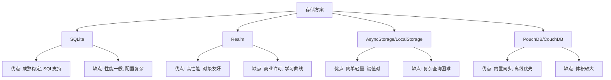
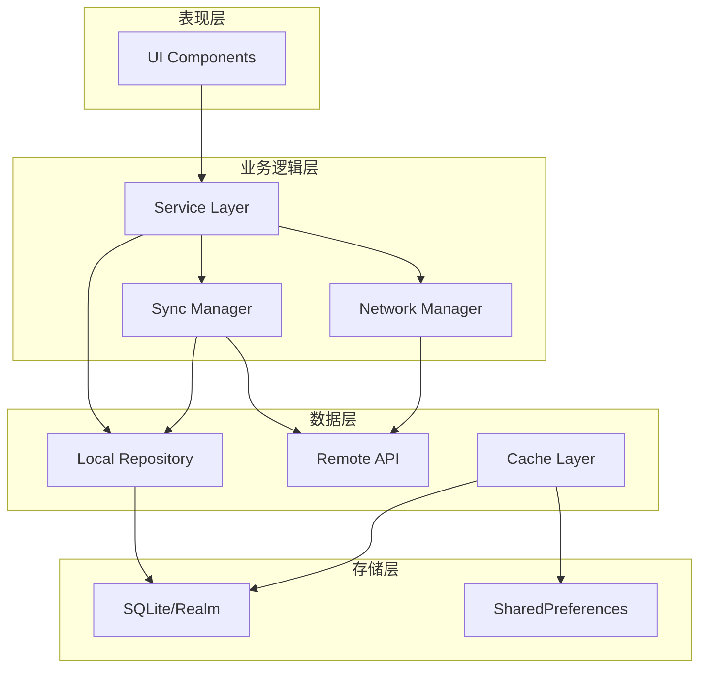
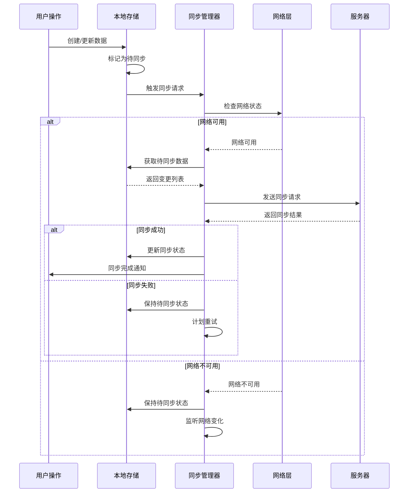

# 实现离线支持

**任务**: 跨平台移动应用
**时间**: 2026-06-04T23:26:32.606300

# 跨平台移动应用离线支持实现指南

## 目录
1. [概述与需求分析](#概述与需求分析)
2. [技术方案选型](#技术方案选型)
3. [核心架构设计](#核心架构设计)
4. [详细实现方案](#详细实现方案)
5. [数据同步策略](#数据同步策略)
6. [冲突解决机制](#冲突解决机制)
7. [性能优化方案](#性能优化方案)
8. [测试与验证](#测试与验证)
9. [示例代码实现](#示例代码实现)
10. [最佳实践与注意事项](#最佳实践与注意事项)

## 概述与需求分析

### 离线支持的重要性
移动应用离线支持是提升用户体验的关键特性，能够确保：
- **网络不稳定时**：应用可正常使用
- **飞行模式下**：核心功能保持可用
- **数据安全性**：本地数据存储保障信息安全
- **性能提升**：减少网络请求，加快响应速度

### 核心需求指标
| 需求维度 | 具体要求 | 优先级 |
|---------|---------|--------|
| 数据持久化 | 本地存储结构化数据 | 高 |
| 网络检测 | 实时监控网络状态变化 | 高 |
| 数据同步 | 支持增量同步与全量同步 | 高 |
| 冲突处理 | 解决多端数据不一致 | 中 |
| 存储管理 | 定期清理过期数据 | 中 |
| 版本管理 | 数据模型迁移支持 | 中 |

## 技术方案选型

### 存储方案对比


### 推荐方案组合
1. **React Native**: WatermelonDB + Redux Persist
2. **Flutter**: Hive/SQLite + Provider
3. **通用方案**: PouchDB (适用于Web和移动端)

## 核心架构设计

### 分层架构图


### 核心组件设计
1. **NetworkMonitor**: 网络状态监控
2. **OfflineRepository**: 离线数据仓库
3. **SyncEngine**: 同步引擎
4. **ConflictResolver**: 冲突解决器
5. **CacheManager**: 缓存管理器

## 详细实现方案

### 1. 网络状态检测实现
```javascript
// 网络状态监控服务
class NetworkMonitor {
  constructor() {
    this.listeners = new Set();
    this.currentStatus = {
      isConnected: false,
      type: 'none',
      isInternetReachable: false
    };
    
    this.initialize();
  }
  
  initialize() {
    // 监听网络状态变化
    NetInfo.addEventListener(state => {
      const previousStatus = this.currentStatus;
      this.currentStatus = {
        isConnected: state.isConnected,
        type: state.type,
        isInternetReachable: state.isInternetReachable
      };
      
      this.notifyListeners(this.currentStatus, previousStatus);
    });
  }
  
  async checkConnection() {
    try {
      // 使用多个端点检测真实网络连接
      const endpoints = [
        'https://www.google.com',
        'https://api.github.com',
        'https://httpbin.org/get'
      ];
      
      const results = await Promise.allSettled(
        endpoints.map(url => 
          fetch(url, { 
            method: 'HEAD',
            timeout: 5000
          })
        )
      );
      
      return results.some(r => r.status === 'fulfilled');
    } catch (error) {
      return false;
    }
  }
  
  addListener(callback) {
    this.listeners.add(callback);
    return () => this.listeners.delete(callback);
  }
  
  notifyListeners(current, previous) {
    this.listeners.forEach(listener => {
      listener(current, previous);
    });
  }
}

// 使用示例
const networkMonitor = new NetworkMonitor();
const unsubscribe = networkMonitor.addListener((current, previous) => {
  if (current.isConnected && !previous.isConnected) {
    console.log('网络已恢复，开始同步数据');
    syncManager.startSync();
  }
});
```

### 2. 离线数据存储实现
```javascript
// 使用WatermelonDB的离线存储实现
import { Database, Model, Q } from '@nozbe/watermelondb';
import SQLiteAdapter from '@nozbe/watermelondb/adapters/sqlite';

// 数据模型定义
class Post extends Model {
  static table = 'posts';
  
  static associations = {
    comments: { type: 'has_many', foreignKey: 'post_id' },
  };
  
  @field('title') title;
  @field('body') body;
  @field('is_synced') isSynced;
  @field('last_modified') lastModified;
  @field('sync_status') syncStatus; // 'pending', 'synced', 'error'
  
  // 标记为待同步
  async markForSync() {
    await this.update(post => {
      post.syncStatus = 'pending';
      post.lastModified = Date.now();
    });
  }
}

// 离线仓库实现
class OfflineRepository {
  constructor(database) {
    this.database = database;
    this.collection = database.get('posts');
  }
  
  // 创建离线数据
  async createOffline(data) {
    return await this.collection.create(post => {
      post.title = data.title;
      post.body = data.body;
      post.isSynced = false;
      post.syncStatus = 'pending';
      post.lastModified = Date.now();
    });
  }
  
  // 获取所有待同步数据
  async getPendingSyncs() {
    return await this.collection.query(
      Q.where('sync_status', 'pending')
    ).fetch();
  }
  
  // 标记同步完成
  async markSynced(id, serverData) {
    const record = await this.collection.find(id);
    await record.update(post => {
      Object.assign(post, serverData);
      post.isSynced = true;
      post.syncStatus = 'synced';
    });
  }
  
  // 获取本地数据
  async getLocalData(onlySynced = false) {
    let query = [];
    if (onlySynced) {
      query.push(Q.where('is_synced', true));
    }
    
    return await this.collection.query(...query).fetch();
  }
}
```

## 数据同步策略

### 同步流程设计


### 增量同步算法
```javascript
class IncrementalSync {
  constructor(localDb, remoteApi) {
    this.localDb = localDb;
    this.remoteApi = remoteApi;
    this.lastSyncTimestamp = null;
  }
  
  async performIncrementalSync() {
    // 1. 获取本地最后同步时间戳
    const lastSync = await this.localDb.getLastSyncTimestamp();
    
    // 2. 从服务器获取变更
    const serverChanges = await this.remoteApi.getChangesSince(lastSync);
    
    // 3. 获取本地变更
    const localChanges = await this.localDb.getChangesSince(lastSync);
    
    // 4. 合并变更（处理冲突）
    const mergedChanges = await this.mergeChanges(
      localChanges, 
      serverChanges
    );
    
    // 5. 应用本地变更
    await this.applyLocalChanges(mergedChanges.localToApply);
    
    // 6. 推送服务器变更
    await this.pushToServer(mergedChanges.remoteToPush);
    
    // 7. 更新同步时间戳
    await this.localDb.updateLastSyncTimestamp(Date.now());
    
    return {
      appliedLocal: mergedChanges.localToApply.length,
      pushedToServer: mergedChanges.remoteToPush.length,
      timestamp: Date.now()
    };
  }
  
  async mergeChanges(localChanges, serverChanges) {
    const merged = {
      localToApply: [],
      remoteToPush: [],
      conflicts: []
    };
    
    // 创建ID映射表
    const localMap = new Map(localChanges.map(c => [c.id, c]));
    const serverMap = new Map(serverChanges.map(c => [c.id, c]));
    
    // 处理本地独有的变更
    localChanges.forEach(localChange => {
      if (!serverMap.has(localChange.id)) {
        merged.remoteToPush.push(localChange);
      }
    });
    
    // 处理服务器独有的变更
    serverChanges.forEach(serverChange => {
      if (!localMap.has(serverChange.id)) {
        merged.localToApply.push(serverChange);
      }
    });
    
    // 处理冲突（双方都修改了）
    const commonIds = [...localMap.keys()].filter(id => 
      serverMap.has(id)
    );
    
    commonIds.forEach(id => {
      const localChange = localMap.get(id);
      const serverChange = serverMap.get(id);
      
      if (this.isConflict(localChange, serverChange)) {
        merged.conflicts.push({
          id,
          local: localChange,
          server: serverChange
        });
      } else {
        // 选择更新的版本
        const latest = localChange.timestamp > serverChange.timestamp 
          ? localChange 
          : serverChange;
        merged.localToApply.push(latest);
      }
    });
    
    return merged;
  }
}
```

## 冲突解决机制

### 冲突类型与策略
```javascript
class ConflictResolver {
  constructor() {
    this.strategies = {
      // 时间戳策略：最新的变更胜出
      timestamp: (local, server) => {
        return local.timestamp > server.timestamp ? local : server;
      },
      
      // 服务器优先策略
      serverFirst: (local, server) => {
        return server;
      },
      
      // 客户端优先策略
      clientFirst: (local, server) => {
        return local;
      },
      
      // 字段级合并策略
      fieldMerge: (local, server) => {
        const merged = { ...server };
        
        // 只合并特定字段
        Object.keys(local).forEach(key => {
          if (this.isMergeableField(key) && 
              local[key] !== server[key]) {
            merged[key] = this.mergeField(key, local[key], server[key]);
          }
        });
        
        return merged;
      }
    };
  }
  
  resolve(conflict, strategy = 'timestamp') {
    const resolver = this.strategies[strategy];
    if (!resolver) {
      throw new Error(`Unknown conflict resolution strategy: ${strategy}`);
    }
    
    const resolved = resolver(conflict.local, conflict.server);
    
    return {
      ...resolved,
      conflictResolved: true,
      resolvedAt: Date.now(),
      strategy: strategy
    };
  }
  
  isMergeableField(fieldName) {
    const mergeableFields = ['title', 'content', 'tags'];
    return mergeableFields.includes(fieldName);
  }
  
  mergeField(fieldName, localValue, serverValue) {
    switch (fieldName) {
      case 'tags':
        // 合并标签数组
        return [...new Set([...localValue, ...serverValue])];
      case 'content':
        // 简单合并，实际应用可能需要更复杂的差异合并
        return `${localValue}\n---\n${serverValue}`;
      default:
        return localValue; // 默认使用本地值
    }
  }
}
```

## 性能优化方案

### 1. 数据压缩与序列化优化
```javascript
class DataCompression {
  // 使用Protocol Buffers替代JSON
  static async compressData(data) {
    // 使用msgpack-lite进行二进制序列化
    const msgpack = require('msgpack-lite');
    const encoded = msgpack.encode(data);
    
    // 使用LZ4压缩
    const lz4 = require('lz4');
    const compressed = lz4.encode(encoded);
    
    return {
      data: compressed,
      originalSize: encoded.length,
      compressedSize: compressed.length,
      ratio: (compressed.length / encoded.length * 100).toFixed(2)
    };
  }
  
  // 增量序列化
  static serializeIncremental(changes) {
    // 只序列化变更的部分
    const delta = {
      timestamp: Date.now(),
      changes: changes.map(change => ({
        id: change.id,
        op: change.operation, // 'add', 'update', 'delete'
        data: change.operation !== 'delete' ? change.data : null,
        fields: change.operation === 'update' 
          ? Object.keys(change.data) 
          : null
      }))
    };
    
    return delta;
  }
}
```

### 2. 批量操作优化
```javascript
class BatchProcessor {
  constructor(options = {}) {
    this.batchSize = options.batchSize || 100;
    this.flushInterval = options.flushInterval || 5000;
    this.pendingOperations = [];
    this.timer = null;
  }
  
  async addOperation(operation) {
    this.pendingOperations.push(operation);
    
    if (this.pendingOperations.length >= this.batchSize) {
      await this.flush();
    } else if (!this.timer) {
      this.timer = setTimeout(() => this.flush(), this.flushInterval);
    }
  }
  
  async flush() {
    if (this.timer) {
      clearTimeout(this.timer);
      this.timer = null;
    }
    
    if (this.pendingOperations.length === 0) return;
    
    const batch = [...this.pendingOperations];
    this.pendingOperations = [];
    
    try {
      // 批量执行操作
      await this.executeBatch(batch);
    } catch (error) {
      // 失败时重新加入队列
      this.pendingOperations.unshift(...batch);
      throw error;
    }
  }
  
  async executeBatch(operations) {
    // 使用数据库批量操作
    const batches = this.chunkArray(operations, this.batchSize);
    
    for (const chunk of batches) {
      await database.write(async () => {
        const models = chunk.map(op => {
          switch (op.type) {
            case 'create':
              return database.get('posts').prepareCreate(post => {
                Object.assign(post, op.data);
              });
            case 'update':
              return database.get('posts').find(op.id).then(record => {
                record.prepareUpdate(() => {
                  Object.assign(record, op.data);
                });
              });
            // ... 其他操作
          }
        });
        
        await database.batch(...models);
      });
    }
  }
  
  chunkArray(array, size) {
    const chunks = [];
    for (let i = 0; i < array.length; i += size) {
      chunks.push(array.slice(i, i + size));
    }
    return chunks;
  }
}
```

## 测试与验证

### 测试用例设计
```javascript
describe('离线支持测试', () => {
  let offlineRepository;
  let networkMonitor;
  let syncManager;
  
  beforeEach(() => {
    offlineRepository = new OfflineRepository();
    networkMonitor = new NetworkMonitor();
    syncManager = new SyncManager();
  });
  
  describe('离线存储测试', () => {
    test('应能创建离线数据', async () => {
      const data = { title: '测试', body: '内容' };
      const result = await offlineRepository.createOffline(data);
      
      expect(result.id).toBeDefined();
      expect(result.syncStatus).toBe('pending');
      expect(result.isSynced).toBe(false);
    });
    
    test('应能获取待同步数据', async () => {
      await offlineRepository.createOffline({ title: '测试1' });
      await offlineRepository.createOffline({ title: '测试2' });
      
      const pending = await offlineRepository.getPendingSyncs();
      expect(pending.length).toBe(2);
    });
  });
  
  describe('网络检测测试', () => {
    test('应能检测网络状态变化', (done) => {
      const listener = jest.fn();
      const unsubscribe = networkMonitor.addListener(listener);
      
      // 模拟网络变化
      setTimeout(() => {
        expect(listener).toHaveBeenCalled();
        unsubscribe();
        done();
      }, 1000);
    });
    
    test('应能检测真实网络连接', async () => {
      const isConnected = await networkMonitor.checkConnection();
      expect(typeof isConnected).toBe('boolean');
    });
  });
  
  describe('同步测试', () => {
    test('应能完成完整的同步流程', async () => {
      // 创建测试数据
      const post = await offlineRepository.createOffline({
        title: '测试文章',
        body: '内容'
      });
      
      // 模拟网络连接
      networkMonitor.currentStatus.isConnected = true;
      
      // 执行同步
      await syncManager.startSync();
      
      // 验证同步结果
      const updatedPost = await offlineRepository.find(post.id);
      expect(updatedPost.syncStatus).toBe('synced');
    });
    
    test('网络断开时应暂停同步', async () => {
      networkMonitor.currentStatus.isConnected = false;
      
      const syncPromise = syncManager.startSync();
      const timeout = new Promise(resolve => 
        setTimeout(resolve, 1000)
      );
      
      await Promise.race([syncPromise, timeout]);
      expect(syncManager.isSyncing).toBe(false);
    });
  });
  
  describe('冲突解决测试', () => {
    test('应能解决时间戳冲突', () => {
      const conflict = {
        id: '1',
        local: { title: '本地', timestamp: 100 },
        server: { title: '服务器', timestamp: 200 }
      };
      
      const resolver = new ConflictResolver();
      const resolved = resolver.resolve(conflict, 'timestamp');
      
      expect(resolved.title).toBe('服务器');
    });
    
    test('应能合并字段', () => {
      const conflict = {
        id: '1',
        local: { 
          title: '本地', 
          tags: ['javascript', 'react'],
          timestamp: 100 
        },
        server: { 
          title: '服务器', 
          tags: ['node', 'react'],
          timestamp: 200 
        }
      };
      
      const resolver = new ConflictResolver();
      const resolved = resolver.resolve(conflict, 'fieldMerge');
      
      expect(resolved.title).toBe('本地');
      expect(resolved.tags).toEqual(
        expect.arrayContaining(['javascript', 'react', 'node'])
      );
    });
  });
});
```

### 性能测试工具
```javascript
class OfflinePerformanceTester {
  constructor() {
    this.metrics = {
      storage: {},
      sync: {},
      compression: {}
    };
  }
  
  async benchmarkStorageOperations() {
    console.log('开始存储性能测试...');
    
    const testCases = [
      { name: '单条插入', count: 100 },
      { name: '批量插入', count: 1000 },
      { name: '复杂查询', count: 50 },
      { name: '更新操作', count: 200 }
    ];
    
    for (const testCase of testCases) {
      const results = await this.runStorageTest(testCase);
      this.metrics.storage[testCase.name] = results;
      
      console.log(`${testCase.name}: 平均 ${results.avgTime}ms, ` +
                 `吞吐量 ${results.throughput}/s`);
    }
  }
  
  async runStorageTest(testCase) {
    const times = [];
    
    for (let i = 0; i < testCase.count; i++) {
      const start = performance.now();
      
      // 执行存储操作
      await this.executeStorageOperation(testCase.name, i);
      
      const end = performance.now();
      times.push(end - start);
    }
    
    const avgTime = times.reduce((a, b) => a + b, 0) / times.length;
    const throughput = 1000 / avgTime; // 每秒操作数
    
    return {
      avgTime: avgTime.toFixed(2),
      minTime: Math.min(...times).toFixed(2),
      maxTime: Math.max(...times).toFixed(2),
      throughput: throughput.toFixed(2)
    };
  }
  
  generateReport() {
    return {
      timestamp: Date.now(),
      metrics: this.metrics,
      recommendations: this.generateRecommendations()
    };
  }
}
```

## 示例代码实现

### 完整的离线管理器实现
```javascript
// OfflineManager.js
import NetInfo from '@react-native-community/netinfo';
import AsyncStorage from '@react-native-async-storage/async-storage';
import { v4 as uuidv4 } from 'uuid';

class OfflineManager {
  constructor(options = {}) {
    this.dbName = options.dbName || 'offline_db';
    this.version = options.version || 1;
    this.maxRetries = options.maxRetries || 3;
    this.retryDelay = options.retryDelay || 1000;
    
    this.db = null;
    this.isOnline = false;
    this.pendingQueue = [];
    this.syncInProgress = false;
    
    this.init();
  }
  
  async init() {
    // 初始化数据库
    await this.initializeDatabase();
    
    // 初始化网络监听
    this.initializeNetworkListener();
    
    // 恢复待处理队列
    await this.restorePendingQueue();
    
    // 尝试同步待处理操作
    if (this.isOnline) {
      await this.processPendingQueue();
    }
  }
  
  async initializeDatabase() {
    // 使用IndexedDB或SQLite
    const request = indexedDB.open(this.dbName, this.version);
    
    return new Promise((resolve, reject) => {
      request.onupgradeneeded = (event) => {
        const db = event.target.result;
        
        // 创建对象存储
        if (!db.objectStoreNames.contains('offline_data')) {
          const store = db.createObjectStore('offline_data', {
            keyPath: 'id'
          });
          
          // 创建索引
          store.createIndex('sync_status', 'syncStatus', { unique: false });
          store.createIndex('last_modified', 'lastModified', { unique: false });
          store.createIndex('type', 'type', { unique: false });
        }
        
        if (!db.objectStoreNames.contains('sync_queue')) {
          db.createObjectStore('sync_queue', {
            keyPath: 'id'
          });
        }
      };
      
      request.onsuccess = (event) => {
        this.db = event.target.result;
        resolve();
      };
      
      request.onerror = (event) => {
        reject(event.target.error);
      };
    });
  }
  
  initializeNetworkListener() {
    NetInfo.addEventListener(state => {
      const wasOnline = this.isOnline;
      this.isOnline = state.isConnected && state.isInternetReachable;
      
      console.log(`网络状态: ${this.isOnline ? '在线' : '离线'}`);
      
      // 从离线恢复在线时，同步待处理队列
      if (!wasOnline && this.isOnline) {
        this.processPendingQueue();
      }
    });
  }
  
  async saveOffline(entityType, data, operation = 'create') {
    const id = data.id || uuidv4();
    const timestamp = Date.now();
    
    const offlineRecord = {
      id,
      type: entityType,
      operation,
      data: { ...data, id },
      createdAt: timestamp,
      lastModified: timestamp,
      syncStatus: 'pending',
      retryCount: 0,
      version: 1
    };
    
    // 保存到离线存储
    await this.putToStore('offline_data', offlineRecord);
    
    // 添加到同步队列
    await this.addToSyncQueue({
      id: uuidv4(),
      recordId: id,
      entityType,
      operation,
      timestamp,
      status: 'pending'
    });
    
    // 如果在线，尝试立即同步
    if (this.isOnline) {
      await this.syncSingleRecord(id);
    }
    
    return offlineRecord;
  }
  
  async putToStore(storeName, data) {
    return new Promise((resolve, reject) => {
      const transaction = this.db.transaction([storeName], 'readwrite');
      const store = transaction.objectStore(storeName);
      const request = store.put(data);
      
      request.onsuccess = () => resolve();
      request.onerror = (event) => reject(event.target.error);
    });
  }
  
  async addToSyncQueue(queueItem) {
    await this.putToStore('sync_queue', queueItem);
    this.pendingQueue.push(queueItem);
  }
  
  async processPendingQueue() {
    if (this.syncInProgress || !this.isOnline || this.pendingQueue.length === 0) {
      return;
    }
    
    this.syncInProgress = true;
    
    try {
      // 获取所有待同步记录
      const pendingRecords = await this.getFromStoreByIndex(
        'offline_data', 
        'sync_status', 
        'pending'
      );
      
      console.log(`开始同步 ${pendingRecords.length} 条记录`);
      
      // 按时间排序，先处理最早的
      pendingRecords.sort((a, b) => a.createdAt - b.createdAt);
      
      for (const record of pendingRecords) {
        try {
          await this.syncSingleRecord(record.id);
        } catch (error) {
          console.error(`同步记录 ${record.id} 失败:`, error);
          await this.handleSyncError(record.id, error);
        }
      }
    } finally {
      this.syncInProgress = false;
    }
  }
  
  async syncSingleRecord(recordId) {
    const record = await this.getFromStore('offline_data', recordId);
    
    if (!record || record.syncStatus === 'synced') {
      return;
    }
    
    try {
      // 根据操作类型调用API
      let response;
      switch (record.operation) {
        case 'create':
          response = await this.api.create(record.type, record.data);
          break;
        case 'update':
          response = await this.api.update(record.type, record.id, record.data);
          break;
        case 'delete':
          response = await this.api.delete(record.type, record.id);
          break;
      }
      
      // 标记为已同步
      await this.markAsSynced(recordId, response);
      
      // 从同步队列移除
      await this.removeFromSyncQueue(recordId);
      
      console.log(`记录 ${recordId} 同步成功`);
      
    } catch (error) {
      // 记录重试次数
      await this.incrementRetryCount(recordId);
      throw error;
    }
  }
  
  async markAsSynced(recordId, serverData) {
    const record = await this.getFromStore('offline_data', recordId);
    
    if (record) {
      record.syncStatus = 'synced';
      record.lastSynced = Date.now();
      record.serverData = serverData;
      record.retryCount = 0;
      
      await this.putToStore('offline_data', record);
    }
  }
  
  async handleSyncError(recordId, error) {
    const record = await this.getFromStore('offline_data', recordId);
    
    if (record) {
      record.retryCount += 1;
      record.lastError = error.message;
      record.lastRetry = Date.now();
      
      if (record.retryCount >= this.maxRetries) {
        record.syncStatus = 'failed';
        console.error(`记录 ${recordId} 同步失败，已达最大重试次数`);
      } else {
        record.syncStatus = 'pending';
        console.warn(`记录 ${recordId} 同步失败，将重试 ` +
                    `(${record.retryCount}/${this.maxRetries})`);
      }
      
      await this.putToStore('offline_data', record);
    }
  }
  
  async getFromStore(storeName, key) {
    return new Promise((resolve, reject) => {
      const transaction = this.db.transaction([storeName], 'readonly');
      const store = transaction.objectStore(storeName);
      const request = store.get(key);
      
      request.onsuccess = (event) => {
        resolve(event.target.result);
      };
      
      request.onerror = (event) => {
        reject(event.target.error);
      };
    });
  }
  
  async getFromStoreByIndex(storeName, indexName, value) {
    return new Promise((resolve, reject) => {
      const transaction = this.db.transaction([storeName], 'readonly');
      const store = transaction.objectStore(storeName);
      const index = store.index(indexName);
      const request = index.getAll(value);
      
      request.onsuccess = (event) => {
        resolve(event.target.result);
      };
      
      request.onerror = (event) => {
        reject(event.target.error);
      };
    });
  }
  
  async restorePendingQueue() {
    try {
      const queueItems = await this.getFromStoreByIndex(
        'offline_data',
        'sync_status',
        'pending'
      );
      
      this.pendingQueue = queueItems.map(item => ({
        id: uuidv4(),
        recordId: item.id,
        entityType: item.type,
        operation: item.operation,
        timestamp: item.lastModified,
        status: 'pending'
      }));
      
      console.log(`恢复了 ${this.pendingQueue.length} 个待同步记录`);
    } catch (error) {
      console.error('恢复待同步队列失败:', error);
    }
  }
  
  // 公共API方法
  async getData(entityType, options = {}) {
    const { onlySynced = false, filters = {}, limit = 100 } = options;
    
    let records = await this.getFromStoreByIndex('offline_data', 'type', entityType);
    
    // 应用过滤器
    if (onlySynced) {
      records = records.filter(r => r.syncStatus === 'synced');
    }
    
    // 应用自定义过滤器
    Object.keys(filters).forEach(key => {
      records = records.filter(r => r.data[key] === filters[key]);
    });
    
    // 应用限制
    if (limit) {
      records = records.slice(0, limit);
    }
    
    return records.map(r => r.data);
  }
  
  async getDataById(entityType, id) {
    const record = await this.getFromStore('offline_data', id);
    
    if (record && record.type === entityType) {
      return record.data;
    }
    
    return null;
  }
  
  getStatistics() {
    return {
      isOnline: this.isOnline,
      pendingRecords: this.pendingQueue.length,
      syncInProgress: this.syncInProgress,
      storageUsed: this.getStorageUsage()
    };
  }
}

// 使用示例
const offlineManager = new OfflineManager({
  dbName: 'my_app_db',
  maxRetries: 5,
  retryDelay: 2000
});

// 保存离线数据
async function createPost(postData) {
  try {
    const offlinePost = await offlineManager.saveOffline('post', postData, 'create');
    
    // 立即返回本地数据，即使离线
    return {
      success: true,
      data: offlinePost.data,
      offline: !offlineManager.isOnline,
      syncStatus: offlinePost.syncStatus
    };
  } catch (error) {
    console.error('创建帖子失败:', error);
    throw error;
  }
}

// 获取数据
async function getPosts() {
  // 获取所有帖子，优先显示已同步的
  const allPosts = await offlineManager.getData('post', {
    onlySynced: false,
    limit: 50
  });
  
  return allPosts;
}

// 监听同步状态变化
offlineManager.on('sync:complete', (records) => {
  console.log(`同步完成: ${records.length} 条记录`);
  // 更新UI
});

offlineManager.on('sync:error', (recordId, error) => {
  console.error(`同步错误 ${recordId}:`, error);
  // 显示错误信息
});
```

## 最佳实践与注意事项

### 1. 数据一致性保障
```javascript
class DataConsistencyManager {
  constructor() {
    this.versionVectors = new Map();
  }
  
  // 为每个记录维护版本向量
  updateVersionVector(recordId, userId, timestamp) {
    if (!this.versionVectors.has(recordId)) {
      this.versionVectors.set(recordId, new Map());
    }
    
    const vector = this.versionVectors.get(recordId);
    const currentTime = vector.get(userId) || 0;
    
    if (timestamp > currentTime) {
      vector.set(userId, timestamp);
    }
  }
  
  // 检测冲突
  detectConflict(localVector, serverVector) {
    for (const [userId, localTime] of localVector) {
      const serverTime = serverVector.get(userId);
      
      if (serverTime && serverTime > localTime) {
        return true;
      }
    }
    
    return false;
  }
}
```

### 2. 存储配额管理
```javascript
class StorageQuotaManager {
  constructor() {
    this.quota = {
      maxStorage: 50 * 1024 * 1024, // 50MB
      warningThreshold: 0.8, // 80%
      criticalThreshold: 0.95 // 95%
    };
  }
  
  async checkStorageQuota() {
    if ('storage' in navigator && 'estimate' in navigator.storage) {
      const estimate