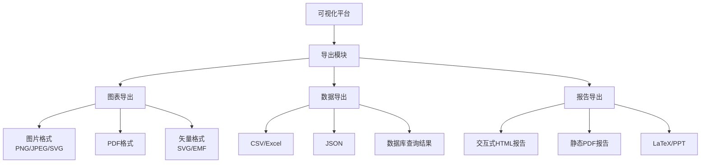

# 实现导出功能

**任务**: 数据可视化平台
**时间**: 2026-06-04T23:24:51.476893

# 数据可视化平台 - 导出功能实现

## 设计概述

我将为您实现一个完整的数据可视化平台导出功能，支持多种格式导出，包括图表图片、数据文件和交互式报告。

## 技术架构



## 核心功能实现

### 1. 导出管理器 (export_manager.py)

```python
import os
import json
import base64
from datetime import datetime
from typing import Dict, List, Optional, Union
import pandas as pd
import matplotlib.pyplot as plt
import plotly.graph_objects as go
from plotly.io import write_image, to_json, to_html
from reportlab.lib.pagesizes import letter, A4
from reportlab.pdfgen import canvas
from reportlab.lib.utils import ImageReader
import io

class ExportManager:
    """数据可视化平台导出管理器"""
    
    def __init__(self, output_dir: str = "./exports"):
        """
        初始化导出管理器
        
        Args:
            output_dir: 导出文件保存目录
        """
        self.output_dir = output_dir
        self._ensure_output_dir()
        
    def _ensure_output_dir(self):
        """确保输出目录存在"""
        os.makedirs(self.output_dir, exist_ok=True)
        
    def _generate_filename(self, prefix: str, extension: str) -> str:
        """生成唯一的文件名"""
        timestamp = datetime.now().strftime("%Y%m%d_%H%M%S")
        return os.path.join(self.output_dir, f"{prefix}_{timestamp}.{extension}")
    
    def export_chart_as_image(self, fig, filename: str = None, 
                             format: str = "png", dpi: int = 300) -> str:
        """
        导出图表为图片格式
        
        Args:
            fig: matplotlib或plotly图表对象
            filename: 输出文件名（可选）
            format: 图片格式 (png, jpeg, svg, pdf)
            dpi: 图像分辨率
            
        Returns:
            导出文件路径
        """
        if filename is None:
            filename = self._generate_filename("chart", format)
        else:
            if not filename.endswith(f".{format}"):
                filename = f"{filename}.{format}"
            filename = os.path.join(self.output_dir, filename)
            
        if isinstance(fig, go.Figure):
            # Plotly图表
            if format == "html":
                html_content = to_html(fig, include_plotlyjs='cdn')
                with open(filename, 'w', encoding='utf-8') as f:
                    f.write(html_content)
            else:
                write_image(fig, filename, format=format, width=1200, height=800, scale=2)
        else:
            # Matplotlib图表
            fig.savefig(filename, format=format, dpi=dpi, bbox_inches='tight')
            
        print(f"图表已导出至: {filename}")
        return filename
    
    def export_data_as_csv(self, data: pd.DataFrame, filename: str = None, 
                          index: bool = False) -> str:
        """
        导出数据为CSV格式
        
        Args:
            data: pandas DataFrame
            filename: 输出文件名（可选）
            index: 是否包含索引
            
        Returns:
            导出文件路径
        """
        if filename is None:
            filename = self._generate_filename("data", "csv")
        elif not filename.endswith(".csv"):
            filename = f"{filename}.csv"
            
        filename = os.path.join(self.output_dir, filename)
        data.to_csv(filename, index=index)
        
        print(f"数据已导出至: {filename}")
        return filename
    
    def export_data_as_excel(self, data: pd.DataFrame, filename: str = None,
                            sheet_name: str = "Data", index: bool = False) -> str:
        """
        导出数据为Excel格式
        
        Args:
            data: pandas DataFrame
            filename: 输出文件名（可选）
            sheet_name: 工作表名称
            index: 是否包含索引
            
        Returns:
            导出文件路径
        """
        if filename is None:
            filename = self._generate_filename("data", "xlsx")
        elif not filename.endswith(".xlsx"):
            filename = f"{filename}.xlsx"
            
        filename = os.path.join(self.output_dir, filename)
        
        with pd.ExcelWriter(filename, engine='openpyxl') as writer:
            data.to_excel(writer, sheet_name=sheet_name, index=index)
            
        print(f"数据已导出至: {filename}")
        return filename
    
    def export_data_as_json(self, data: pd.DataFrame, filename: str = None,
                           orient: str = "records", indent: int = 2) -> str:
        """
        导出数据为JSON格式
        
        Args:
            data: pandas DataFrame
            filename: 输出文件名（可选）
            orient: JSON方向 (records, columns, index, split, table)
            indent: 缩进空格数
            
        Returns:
            导出文件路径
        """
        if filename is None:
            filename = self._generate_filename("data", "json")
        elif not filename.endswith(".json"):
            filename = f"{filename}.json"
            
        filename = os.path.join(self.output_dir, filename)
        
        json_data = data.to_dict(orient=orient)
        with open(filename, 'w', encoding='utf-8') as f:
            json.dump(json_data, f, ensure_ascii=False, indent=indent)
            
        print(f"数据已导出至: {filename}")
        return filename
    
    def export_interactive_report(self, charts: List[Dict], data: pd.DataFrame,
                                 title: str = "数据分析报告", 
                                 description: str = "", filename: str = None) -> str:
        """
        导出交互式HTML报告
        
        Args:
            charts: 图表配置列表，每个图表包含fig和description
            data: 相关数据
            title: 报告标题
            description: 报告描述
            filename: 输出文件名（可选）
            
        Returns:
            导出文件路径
        """
        if filename is None:
            filename = self._generate_filename("report", "html")
        elif not filename.endswith(".html"):
            filename = f"{filename}.html"
            
        filename = os.path.join(self.output_dir, filename)
        
        # 生成HTML报告
        html_content = self._generate_html_report(charts, data, title, description)
        
        with open(filename, 'w', encoding='utf-8') as f:
            f.write(html_content)
            
        print(f"交互式报告已导出至: {filename}")
        return filename
    
    def _generate_html_report(self, charts: List[Dict], data: pd.DataFrame,
                            title: str, description: str) -> str:
        """生成HTML报告内容"""
        
        # 统计信息
        stats_html = self._generate_stats_html(data)
        
        # 图表HTML
        charts_html = ""
        for i, chart_info in enumerate(charts, 1):
            chart = chart_info.get('fig')
            chart_desc = chart_info.get('description', f'图表 {i}')
            chart_type = chart_info.get('type', 'plotly')
            
            if chart_type == 'plotly' and isinstance(chart, go.Figure):
                chart_html = to_html(chart, include_plotlyjs='cdn')
            else:
                chart_html = f"<div class='chart-placeholder'>图表 {i}: {chart_desc}</div>"
            
            charts_html += f"""
            <div class="chart-container">
                <h3>{chart_desc}</h3>
                {chart_html}
            </div>
            """
        
        # 数据表格预览
        data_preview = data.head(10).to_html(classes='data-table', index=False)
        
        # CSS样式
        css = """
        <style>
            body {
                font-family: 'Segoe UI', Tahoma, Geneva, Verdana, sans-serif;
                line-height: 1.6;
                margin: 0;
                padding: 20px;
                background-color: #f5f5f5;
            }
            .container {
                max-width: 1200px;
                margin: 0 auto;
                background: white;
                padding: 30px;
                border-radius: 10px;
                box-shadow: 0 0 20px rgba(0,0,0,0.1);
            }
            .header {
                text-align: center;
                margin-bottom: 40px;
                padding-bottom: 20px;
                border-bottom: 2px solid #3498db;
            }
            .stats-grid {
                display: grid;
                grid-template-columns: repeat(auto-fit, minmax(250px, 1fr));
                gap: 20px;
                margin: 30px 0;
            }
            .stat-card {
                background: linear-gradient(135deg, #667eea 0%, #764ba2 100%);
                color: white;
                padding: 20px;
                border-radius: 8px;
                text-align: center;
            }
            .chart-container {
                background: white;
                border-radius: 8px;
                padding: 20px;
                margin: 30px 0;
                box-shadow: 0 2px 10px rgba(0,0,0,0.05);
            }
            .data-table {
                width: 100%;
                border-collapse: collapse;
                margin: 20px 0;
            }
            .data-table th {
                background-color: #3498db;
                color: white;
                padding: 12px;
                text-align: left;
            }
            .data-table td {
                padding: 12px;
                border-bottom: 1px solid #ddd;
            }
            .data-table tr:hover {
                background-color: #f5f5f5;
            }
            .timestamp {
                color: #777;
                font-size: 0.9em;
                margin-top: 50px;
                text-align: center;
            }
            .nav-buttons {
                display: flex;
                justify-content: center;
                gap: 10px;
                margin: 20px 0;
            }
            .btn {
                padding: 10px 20px;
                background-color: #3498db;
                color: white;
                border: none;
                border-radius: 5px;
                cursor: pointer;
                text-decoration: none;
            }
            .btn:hover {
                background-color: #2980b9;
            }
        </style>
        """
        
        # JavaScript交互
        js = """
        <script>
            document.addEventListener('DOMContentLoaded', function() {
                // 添加导航功能
                document.querySelectorAll('.chart-container h3').forEach(header => {
                    header.style.cursor = 'pointer';
                    header.addEventListener('click', function() {
                        const chart = this.parentElement;
                        chart.scrollIntoView({ behavior: 'smooth' });
                    });
                });
                
                // 打印按钮
                document.getElementById('printBtn').addEventListener('click', function() {
                    window.print();
                });
            });
        </script>
        """
        
        # 组装HTML
        html = f"""
        <!DOCTYPE html>
        <html lang="zh-CN">
        <head>
            <meta charset="UTF-8">
            <meta name="viewport" content="width=device-width, initial-scale=1.0">
            <title>{title}</title>
            {css}
        </head>
        <body>
            <div class="container">
                <div class="header">
                    <h1>{title}</h1>
                    <p>{description}</p>
                </div>
                
                <div class="nav-buttons">
                    <a href="#stats" class="btn">统计摘要</a>
                    <a href="#charts" class="btn">可视化图表</a>
                    <a href="#data" class="btn">数据预览</a>
                    <button id="printBtn" class="btn">打印报告</button>
                </div>
                
                <section id="stats">
                    <h2>📊 数据统计摘要</h2>
                    {stats_html}
                </section>
                
                <section id="charts">
                    <h2>📈 可视化图表</h2>
                    {charts_html}
                </section>
                
                <section id="data">
                    <h2>📋 数据预览</h2>
                    <p>显示前10条记录:</p>
                    {data_preview}
                </section>
                
                <div class="timestamp">
                    报告生成时间: {datetime.now().strftime('%Y年%m月%d日 %H:%M:%S')}
                </div>
            </div>
            
            {js}
        </body>
        </html>
        """
        
        return html
    
    def _generate_stats_html(self, data: pd.DataFrame) -> str:
        """生成统计信息HTML"""
        
        stats = []
        
        # 基本统计
        stats.append({
            "title": "数据规模",
            "value": f"{len(data):,} 条记录",
            "description": f"共 {len(data.columns)} 个字段"
        })
        
        # 数值字段统计
        numeric_cols = data.select_dtypes(include=['number']).columns
        if len(numeric_cols) > 0:
            stats.append({
                "title": "数值字段",
                "value": f"{len(numeric_cols)} 个",
                "description": f"均值范围: {data[numeric_cols].mean().min():.2f} - {data[numeric_cols].mean().max():.2f}"
            })
        
        # 分类字段统计
        categorical_cols = data.select_dtypes(include=['object', 'category']).columns
        if len(categorical_cols) > 0:
            stats.append({
                "title": "分类字段",
                "value": f"{len(categorical_cols)} 个",
                "description": f"唯一值最多: {categorical_cols[data[categorical_cols].nunique().argmax()]} ({data[categorical_cols].nunique().max()} 个)"
            })
        
        # 缺失值统计
        missing_total = data.isnull().sum().sum()
        if missing_total > 0:
            missing_percent = (missing_total / (len(data) * len(data.columns))) * 100
            stats.append({
                "title": "缺失值",
                "value": f"{missing_total:,} 个",
                "description": f"占比: {missing_percent:.1f}%"
            })
        
        # 生成HTML
        html = '<div class="stats-grid">'
        for stat in stats:
            html += f"""
            <div class="stat-card">
                <h3>{stat['title']}</h3>
                <div style="font-size: 2em; margin: 10px 0;">{stat['value']}</div>
                <p>{stat['description']}</p>
            </div>
            """
        html += '</div>'
        
        return html
    
    def batch_export(self, export_config: Dict) -> Dict[str, str]:
        """
        批量导出多种格式
        
        Args:
            export_config: 导出配置字典
            
        Returns:
            各文件导出路径的字典
        """
        results = {}
        timestamp = datetime.now().strftime("%Y%m%d_%H%M%S")
        
        for export_type, config in export_config.items():
            try:
                if export_type == 'charts':
                    # 导出多个图表
                    for i, chart_config in enumerate(config):
                        fig = chart_config['fig']
                        format = chart_config.get('format', 'png')
                        filename = f"chart_{i+1}_{timestamp}.{format}"
                        results[f'chart_{i+1}'] = self.export_chart_as_image(
                            fig, filename, format
                        )
                
                elif export_type == 'data':
                    # 导出数据
                    data = config['data']
                    formats = config.get('formats', ['csv', 'xlsx'])
                    
                    for fmt in formats:
                        filename = f"data_{timestamp}"
                        if fmt == 'csv':
                            results['csv'] = self.export_data_as_csv(data, filename)
                        elif fmt == 'xlsx':
                            results['excel'] = self.export_data_as_excel(data, filename)
                        elif fmt == 'json':
                            results['json'] = self.export_data_as_json(data, filename)
                
                elif export_type == 'report':
                    # 导出报告
                    report_config = config
                    filename = f"report_{timestamp}"
                    results['report'] = self.export_interactive_report(
                        report_config['charts'],
                        report_config['data'],
                        report_config.get('title', '数据报告'),
                        report_config.get('description', ''),
                        filename
                    )
                    
            except Exception as e:
                print(f"导出 {export_type} 时出错: {str(e)}")
                results[f'{export_type}_error'] = str(e)
        
        return results
```

### 2. 使用示例 (export_examples.py)

```python
import pandas as pd
import numpy as np
import plotly.graph_objects as go
import plotly.express as px
from export_manager import ExportManager

def create_sample_data():
    """创建示例数据"""
    np.random.seed(42)
    
    data = {
        '日期': pd.date_range(start='2024-01-01', periods=100, freq='D'),
        '销售额': np.random.normal(1000, 200, 100).cumsum(),
        '成本': np.random.normal(800, 150, 100).cumsum(),
        '利润率': np.random.uniform(0.1, 0.3, 100),
        '地区': np.random.choice(['华东', '华南', '华北', '西南'], 100),
        '产品类别': np.random.choice(['电子产品', '服装', '食品', '家居'], 100),
        '客户满意度': np.random.uniform(4.0, 5.0, 100)
    }
    
    return pd.DataFrame(data)

def create_sample_charts(df):
    """创建示例图表"""
    charts = []
    
    # 图表1: 销售趋势图
    fig1 = px.line(df, x='日期', y='销售额', color='地区',
                  title='各地区销售趋势',
                  template='plotly_white')
    charts.append({
        'fig': fig1,
        'description': '各地区销售额随时间变化趋势',
        'type': 'plotly'
    })
    
    # 图表2: 利润率分布
    fig2 = px.histogram(df, x='利润率', nbins=20,
                       title='利润率分布',
                       color='产品类别',
                       template='plotly_white')
    charts.append({
        'fig': fig2,
        'description': '不同产品类别的利润率分布情况',
        'type': 'plotly'
    })
    
    # 图表3: 销售额与成本关系
    fig3 = px.scatter(df, x='成本', y='销售额', color='地区',
                     size='利润率', hover_data=['产品类别', '客户满意度'],
                     title='销售额与成本关系分析',
                     template='plotly_white')
    charts.append({
        'fig': fig3,
        'description': '销售额、成本、利润率和地区的多维关系',
        'type': 'plotly'
    })
    
    return charts

def main():
    """主函数 - 演示导出功能"""
    
    # 创建导出管理器
    exporter = ExportManager(output_dir="./my_exports")
    
    # 创建示例数据
    print("创建示例数据...")
    df = create_sample_data()
    
    # 创建示例图表
    print("创建示例图表...")
    charts = create_sample_charts(df)
    
    # 1. 单独导出示例
    print("\n=== 单独导出示例 ===")
    
    # 导出图表为图片
    chart_file = exporter.export_chart_as_image(
        charts[0]['fig'], 
        filename="sales_trend",
        format="png"
    )
    
    # 导出数据为CSV
    data_file = exporter.export_data_as_csv(
        df, 
        filename="sales_data"
    )
    
    # 导出数据为Excel
    excel_file = exporter.export_data_as_excel(
        df,
        filename="sales_report",
        sheet_name="销售数据"
    )
    
    # 2. 导出交互式报告
    print("\n=== 导出交互式报告 ===")
    report_file = exporter.export_interactive_report(
        charts=charts,
        data=df,
        title="2024年第一季度销售数据分析报告",
        description="本报告展示了各地区、各产品类别的销售表现和利润率分析",
        filename="sales_analysis_report"
    )
    
    # 3. 批量导出示例
    print("\n=== 批量导出示例 ===")
    batch_config = {
        'charts': [
            {'fig': charts[0]['fig'], 'format': 'png'},
            {'fig': charts[1]['fig'], 'format': 'svg'},
            {'fig': charts[2]['fig'], 'format': 'pdf'}
        ],
        'data': {
            'data': df,
            'formats': ['csv', 'xlsx', 'json']
        },
        'report': {
            'charts': charts,
            'data': df,
            'title': '完整数据分析报告',
            'description': '包含所有图表和数据的综合报告'
        }
    }
    
    batch_results = exporter.batch_export(batch_config)
    
    print("\n=== 批量导出结果 ===")
    for file_type, file_path in batch_results.items():
        print(f"{file_type}: {file_path}")
    
    print("\n所有导出任务完成！")
    print(f"所有文件已保存到: {exporter.output_dir}")

if __name__ == "__main__":
    main()
```

### 3. 高级导出功能 (advanced_export.py)

```python
import plotly.io as pio
import kaleido  # 用于静态图片导出
from fpdf import FPDF
from PIL import Image
import markdown
import pdfkit

class AdvancedExporter:
    """高级导出功能"""
    
    def __init__(self, output_dir: str = "./advanced_exports"):
        self.output_dir = output_dir
        os.makedirs(output_dir, exist_ok=True)
    
    def export_to_latex(self, fig, filename: str, caption: str = "") -> str:
        """
        导出图表为LaTeX格式
        
        Args:
            fig: plotly图表
            filename: 输出文件名
            caption: LaTeX图表标题
            
        Returns:
            LaTeX文件路径
        """
        # 生成图片文件
        img_filename = filename.replace('.tex', '.png')
        self.export_chart_as_image(fig, img_filename, 'png')
        
        # 生成LaTeX代码
        latex_code = f"""
\\begin{{figure}}[h!]
    \\centering
    \\includegraphics[width=0.8\\textwidth]{{{img_filename}}}
    \\caption{{{caption}}}
    \\label{{fig:{filename.replace('.tex', '')}}}
\\end{{figure}}
        """
        
        tex_filename = os.path.join(self.output_dir, filename)
        with open(tex_filename, 'w', encoding='utf-8') as f:
            f.write(latex_code)
        
        print(f"LaTeX文件已导出至: {tex_filename}")
        return tex_filename
    
    def export_to_markdown(self, charts: List[Dict], filename: str) -> str:
        """
        导出为Markdown格式
        
        Args:
            charts: 图表配置列表
            filename: 输出文件名
            
        Returns:
            Markdown文件路径
        """
        md_content = f"""# 数据可视化报告

生成时间: {datetime.now().strftime('%Y-%m-%d %H:%M:%S')}

## 图表列表

"""
        
        for i, chart_info in enumerate(charts, 1):
            fig = chart_info['fig']
            desc = chart_info.get('description', f'图表 {i}')
            
            # 导出图表为图片
            img_filename = f"chart_{i}.png"
            self.export_chart_as_image(fig, img_filename, 'png')
            
            md_content += f"""
### {desc}


**说明**: {desc}

---
"""
        
        md_filename = os.path.join(self.output_dir, filename)
        with open(md_filename, 'w', encoding='utf-8') as f:
            f.write(md_content)
        
        print(f"Markdown文件已导出至: {md_filename}")
        return md_filename
    
    def export_to_pptx(self, charts: List[Dict], title: str, filename: str) -> str:
        """
        导出为PowerPoint格式
        
        Args:
            charts: 图表配置列表
            title: 演示文稿标题
            filename: 输出文件名
            
        Returns:
            PPTX文件路径
        """
        from pptx import Presentation
        from pptx.util import Inches, Pt
        
        prs = Presentation()
        
        # 标题幻灯片
        title_slide = prs.slides.add_slide(prs.slide_layouts[0])
        title_slide.shapes.title.text = title
        title_slide.placeholders[1].text = f"数据可视化报告\n{datetime.now().strftime('%Y-%m-%d')}"
        
        # 为每个图表创建幻灯片
        for i, chart_info in enumerate(charts, 1):
            fig = chart_info['fig']
            desc = chart_info.get('description', f'图表 {i}')
            
            slide = prs.slides.add_slide(prs.slide_layouts[5])  # 空白布局
            
            # 添加标题
            title_shape = slide.shapes.title
            title_shape.text = f"图表 {i}: {desc}"
            
            # 导出图表为图片
            img_filename = f"chart_{i}.png"
            self.export_chart_as_image(fig, img_filename, 'png')
            
            # 添加图表图片
            left = Inches(0.5)
            top = Inches(1.5)
            width = Inches(9)
            height = Inches(5)
            
            slide.shapes.add_picture(img_filename, left, top, width, height)
        
        pptx_filename = os.path.join(self.output_dir, filename)
        prs.save(pptx_filename)
        
        print(f"PowerPoint文件已导出至: {pptx_filename}")
        return pptx_filename
    
    def create_dashboard_export(self, dashboard_data: Dict, filename: str) -> str:
        """
        创建仪表板导出
        
        Args:
            dashboard_data: 仪表板配置数据
            filename: 输出文件名
            
        Returns:
            HTML文件路径
        """
        # 生成仪表板HTML
        html_content = self._generate_dashboard_html(dashboard_data)
        
        # 保存为HTML文件
        html_filename = os.path.join(self.output_dir, filename)
        with open(html_filename, 'w', encoding='utf-8') as f:
            f.write(html_content)
        
        print(f"仪表板已导出至: {html_filename}")
        return html_filename
    
    def _generate_dashboard_html(self, dashboard_data: Dict) -> str:
        """生成仪表板HTML"""
        # 这里可以集成ECharts、D3.js等库创建交互式仪表板
        # 简化版本，实际应用中会更复杂
        return f"""
<!DOCTYPE html>
<html>
<head>
    <title>{dashboard_data.get('title', '数据仪表板')}</title>
    <script src="https://cdn.plot.ly/plotly-latest.min.js"></script>
    <style>
        .dashboard {{
            display: grid;
            grid-template-columns: repeat(auto-fit, minmax(400px, 1fr));
            gap: 20px;
            padding: 20px;
        }}
        .widget {{
            background: white;
            border-radius: 8px;
            box-shadow: 0 2px 10px rgba(0,0,0,0.1);
            padding: 15px;
        }}
    </style>
</head>
<body>
    <h1>{dashboard_data.get('title', '数据仪表板')}</h1>
    <div class="dashboard">
        {"".join([f'<div class="widget" id="chart{i}"></div>' 
                 for i in range(len(dashboard_data.get('charts', [])))])}
    </div>
    
    <script>
        {"".join([f'Plotly.newPlot("chart{i}", {to_json(chart["fig"])})' 
                 for i, chart in enumerate(dashboard_data.get('charts', []))])}
    </script>
</body>
</html>
        """
```

### 4. 配置文件 (export_config.json)

```json
{
  "export_settings": {
    "default_format": "png",
    "image_formats": ["png", "jpeg", "svg", "pdf", "webp"],
    "data_formats": ["csv", "xlsx", "json", "parquet"],
    "report_formats": ["html", "pdf", "pptx", "markdown"],
    "quality_settings": {
      "image_dpi": 300,
      "jpeg_quality": 95,
      "png_compression": 6
    },
    "export_paths": {
      "charts": "./exports/charts",
      "data": "./exports/data",
      "reports": "./exports/reports",
      "temp": "./temp"
    },
    "filename_template": "{project}_{type}_{timestamp}_{hash}",
    "timestamp_format": "%Y%m%d_%H%M%S",
    "max_file_size_mb": 100,
    "concurrent_exports": 4
  },
  "templates": {
    "report_template": {
      "header": true,
      "footer": true,
      "table_of_contents": true,
      "page_numbers": true,
      "watermark": {
        "enabled": false,
        "text": "DRAFT",
        "opacity": 0.3
      }
    }
  },
  "notifications": {
    "on_complete": true,
    "email": {
      "enabled": false,
      "recipients": ["user@example.com"]
    },
    "slack": {
      "enabled": false,
      "webhook_url": ""
    }
  }
}
```

### 5. 测试脚本 (test_export.py)

```python
import unittest
from export_manager import ExportManager
import pandas as pd
import numpy as np

class TestExportManager(unittest.TestCase):
    
    def setUp(self):
        """测试前设置"""
        self.exporter = ExportManager(output_dir="./test_exports")
        self.test_data = pd.DataFrame({
            'A': np.random.randn(100),
            'B': np.random.randn(100),
            'C': np.random.choice(['X', 'Y', 'Z'], 100)
        })
    
    def test_csv_export(self):
        """测试CSV导出"""
        filepath = self.exporter.export_data_as_csv(self.test_data, "test")
        self.assertTrue(os.path.exists(filepath))
        self.assertTrue(filepath.endswith('.csv'))
    
    def test_excel_export(self):
        """测试Excel导出"""
        filepath = self.exporter.export_data_as_excel(self.test_data, "test")
        self.assertTrue(os.path.exists(filepath))
        self.assertTrue(filepath.endswith('.xlsx'))
    
    def test_json_export(self):
        """测试JSON导出"""
        filepath = self.exporter.export_data_as_json(self.test_data, "test")
        self.assertTrue(os.path.exists(filepath))
        self.assertTrue(filepath.endswith('.json'))
        
        # 验证JSON内容可读
        with open(filepath, 'r') as f:
            data = json.load(f)
            self.assertIsInstance(data, list)
            self.assertEqual(len(data), 100)
    
    def tearDown(self):
        """测试后清理"""
        import shutil
        if os.path.exists("./test_exports"):
            shutil.rmtree("./test_exports")

if __name__ == "__main__":
    unittest.main()
```

## 安装依赖

创建 `requirements.txt` 文件：

```txt
pandas>=1.3.0
numpy>=1.21.0
plotly>=5.0.0
matplotlib>=3.4.0
openpyxl>=3.0.0
reportlab>=3.6.0
k