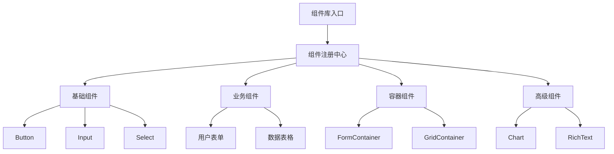

# 实现组件库

**任务**: 低代码平台
**时间**: 2026-06-04T22:27:35.094550

# 低代码平台组件库实现方案

## 1. 组件库架构设计

### 1.1 整体架构


### 1.2 目录结构
```
src/
├── components/                    # 组件库源码
│   ├── index.ts                   # 组件库入口
│   ├── config/                    # 组件配置
│   │   ├── types.ts              # 类型定义
│   │   └── constants.ts          # 常量配置
│   ├── base/                     # 基础组件
│   │   ├── Button/
│   │   ├── Input/
│   │   └── ...
│   ├── business/                 # 业务组件
│   ├── container/                # 容器组件
│   └── advanced/                 # 高级组件
├── hooks/                        # 组件公共hooks
├── utils/                        # 工具函数
└── examples/                     # 使用示例
```

## 2. 核心组件实现

### 2.1 基础组件 - Button
```typescript
// src/components/base/Button/index.tsx
import React, { forwardRef, useMemo } from 'react';
import { ButtonProps } from './types';
import { useButton } from './hooks/useButton';
import './styles.less';

const Button = forwardRef<HTMLButtonElement, ButtonProps>(
  (
    {
      type = 'default',
      size = 'medium',
      loading = false,
      disabled = false,
      block = false,
      icon,
      children,
      onClick,
      ...rest
    },
    ref
  ) => {
    const { classes, handleClick } = useButton({
      type,
      size,
      loading,
      disabled,
      block,
    });

    return (
      <button
        ref={ref}
        className={classes}
        disabled={disabled || loading}
        onClick={handleClick(onClick)}
        {...rest}
      >
        {loading && <span className="btn-loading-icon" />}
        {icon && !loading && <span className="btn-icon">{icon}</span>}
        {children && <span className="btn-content">{children}</span>}
      </button>
    );
  }
);

// 组件配置导出
export const ButtonConfig = {
  name: 'Button',
  icon: 'button-icon',
  group: '基础组件',
  description: '通用按钮组件',
  defaultProps: {
    type: 'default',
    size: 'medium',
    disabled: false,
    loading: false,
  },
  propConfigs: [
    {
      name: 'type',
      type: 'select',
      options: ['default', 'primary', 'success', 'warning', 'danger'],
      label: '按钮类型',
    },
    {
      name: 'size',
      type: 'select',
      options: ['small', 'medium', 'large'],
      label: '按钮大小',
    },
    {
      name: 'disabled',
      type: 'boolean',
      label: '禁用状态',
    },
    {
      name: 'loading',
      type: 'boolean',
      label: '加载状态',
    },
    {
      name: 'block',
      type: 'boolean',
      label: '块级按钮',
    },
  ],
  eventConfigs: [
    {
      name: 'onClick',
      label: '点击事件',
    },
  ],
};

export default Button;
```

### 2.2 输入组件 - Input
```typescript
// src/components/base/Input/index.tsx
import React, { forwardRef, useState } from 'react';
import { InputProps } from './types';
import { useInput } from './hooks/useInput';
import './styles.less';

const Input = forwardRef<HTMLInputElement, InputProps>(
  (
    {
      type = 'text',
      placeholder = '请输入',
      value,
      defaultValue,
      disabled = false,
      readonly = false,
      allowClear = false,
      prefix,
      suffix,
      maxLength,
      onChange,
      onFocus,
      onBlur,
      ...rest
    },
    ref
  ) => {
    const [internalValue, setInternalValue] = useState(defaultValue || '');
    const { classes, handleChange, handleClear, showClearIcon } = useInput({
      value: value ?? internalValue,
      onChange: (val) => {
        if (value === undefined) {
          setInternalValue(val);
        }
        onChange?.(val);
      },
      disabled,
      readonly,
      allowClear,
    });

    return (
      <div className={classes}>
        {prefix && <span className="input-prefix">{prefix}</span>}
        <input
          ref={ref}
          type={type}
          className="input-inner"
          value={value ?? internalValue}
          placeholder={placeholder}
          disabled={disabled}
          readOnly={readonly}
          maxLength={maxLength}
          onChange={handleChange}
          onFocus={onFocus}
          onBlur={onBlur}
          {...rest}
        />
        {suffix && <span className="input-suffix">{suffix}</span>}
        {showClearIcon && (
          <span className="input-clear" onClick={handleClear}>
            ✕
          </span>
        )}
      </div>
    );
  }
);

// 组件配置导出
export const InputConfig = {
  name: 'Input',
  icon: 'input-icon',
  group: '基础组件',
  description: '输入框组件',
  defaultProps: {
    type: 'text',
    placeholder: '请输入',
    disabled: false,
    readonly: false,
    allowClear: false,
  },
  propConfigs: [
    {
      name: 'type',
      type: 'select',
      options: ['text', 'password', 'number', 'email', 'tel', 'url'],
      label: '输入类型',
    },
    {
      name: 'placeholder',
      type: 'string',
      label: '占位文本',
    },
    {
      name: 'disabled',
      type: 'boolean',
      label: '禁用状态',
    },
    {
      name: 'readonly',
      type: 'boolean',
      label: '只读状态',
    },
    {
      name: 'allowClear',
      type: 'boolean',
      label: '允许清除',
    },
    {
      name: 'maxLength',
      type: 'number',
      label: '最大长度',
    },
  ],
  eventConfigs: [
    {
      name: 'onChange',
      label: '值变化事件',
    },
    {
      name: 'onFocus',
      label: '获取焦点事件',
    },
    {
      name: 'onBlur',
      label: '失去焦点事件',
    },
  ],
};

export default Input;
```

### 2.3 选择器组件 - Select
```typescript
// src/components/base/Select/index.tsx
import React, { useState, useRef, useEffect, useCallback } from 'react';
import { SelectProps, SelectOption } from './types';
import { useSelect } from './hooks/useSelect';
import './styles.less';

const Select: React.FC<SelectProps> = ({
  options = [],
  value,
  defaultValue,
  placeholder = '请选择',
  multiple = false,
  disabled = false,
  clearable = false,
  searchable = false,
  onChange,
  onSearch,
  ...rest
}) => {
  const {
    isOpen,
    selected,
    filteredOptions,
    containerRef,
    handleToggle,
    handleSelect,
    handleClear,
    handleSearch,
    handleClickOutside,
  } = useSelect({
    options,
    value,
    defaultValue,
    multiple,
    onChange,
    onSearch,
  });

  const [searchValue, setSearchValue] = useState('');

  const handleSearchChange = useCallback(
    (e: React.ChangeEvent<HTMLInputElement>) => {
      const value = e.target.value;
      setSearchValue(value);
      handleSearch(value);
    },
    [handleSearch]
  );

  return (
    <div
      ref={containerRef}
      className={`select ${isOpen ? 'select-open' : ''} ${
        disabled ? 'select-disabled' : ''
      }`}
      onClick={handleToggle}
    >
      <div className="select-selection">
        {multiple ? (
          <div className="select-multiple-tags">
            {selected.map((item) => (
              <span key={item.value} className="select-tag">
                {item.label}
                <span
                  className="select-tag-close"
                  onClick={(e) => {
                    e.stopPropagation();
                    handleSelect(item);
                  }}
                >
                  ✕
                </span>
              </span>
            ))}
          </div>
        ) : (
          <span className="select-selected-value">
            {selected[0]?.label || placeholder}
          </span>
        )}
        {clearable && selected.length > 0 && (
          <span
            className="select-clear"
            onClick={(e) => {
              e.stopPropagation();
              handleClear();
            }}
          >
            ✕
          </span>
        )}
        <span className="select-arrow">▼</span>
      </div>
      
      {isOpen && (
        <div className="select-dropdown">
          {searchable && (
            <div className="select-search">
              <input
                type="text"
                value={searchValue}
                onChange={handleSearchChange}
                placeholder="搜索..."
                className="select-search-input"
              />
            </div>
          )}
          <ul className="select-options">
            {filteredOptions.map((option) => (
              <li
                key={option.value}
                className={`select-option ${
                  selected.some((s) => s.value === option.value)
                    ? 'select-option-selected'
                    : ''
                } ${option.disabled ? 'select-option-disabled' : ''}`}
                onClick={(e) => {
                  e.stopPropagation();
                  if (!option.disabled) {
                    handleSelect(option);
                  }
                }}
              >
                {option.label}
                {multiple && (
                  <span className="select-option-check">
                    {selected.some((s) => s.value === option.value) ? '✓' : ''}
                  </span>
                )}
              </li>
            ))}
          </ul>
        </div>
      )}
    </div>
  );
};

// 组件配置导出
export const SelectConfig = {
  name: 'Select',
  icon: 'select-icon',
  group: '基础组件',
  description: '选择器组件',
  defaultProps: {
    placeholder: '请选择',
    multiple: false,
    disabled: false,
    clearable: false,
    searchable: false,
  },
  propConfigs: [
    {
      name: 'options',
      type: 'array',
      label: '选项列表',
      subType: 'object',
      fields: [
        { name: 'label', type: 'string', label: '选项文本' },
        { name: 'value', type: 'string', label: '选项值' },
        { name: 'disabled', type: 'boolean', label: '禁用状态' },
      ],
    },
    {
      name: 'multiple',
      type: 'boolean',
      label: '多选模式',
    },
    {
      name: 'disabled',
      type: 'boolean',
      label: '禁用状态',
    },
    {
      name: 'clearable',
      type: 'boolean',
      label: '允许清除',
    },
    {
      name: 'searchable',
      type: 'boolean',
      label: '允许搜索',
    },
  ],
  eventConfigs: [
    {
      name: 'onChange',
      label: '值变化事件',
    },
    {
      name: 'onSearch',
      label: '搜索事件',
    },
  ],
};

export default Select;
```

### 2.4 容器组件 - FormContainer
```typescript
// src/components/container/FormContainer/index.tsx
import React, { forwardRef, useImperativeHandle, useState } from 'react';
import { FormContainerProps, FormContainerRef } from './types';
import { useFormContainer } from './hooks/useFormContainer';
import './styles.less';

const FormContainer = forwardRef<FormContainerRef, FormContainerProps>(
  (
    {
      layout = 'horizontal',
      labelWidth = 100,
      labelAlign = 'right',
      colon = true,
      disabled = false,
      initialValues = {},
      onFinish,
      onFinishFailed,
      children,
      ...rest
    },
    ref
  ) => {
    const {
      formData,
      errors,
      registerField,
      unregisterField,
      setFieldValue,
      getFieldValue,
      validateField,
      validateAllFields,
      resetFields,
    } = useFormContainer({
      initialValues,
      onFinish,
      onFinishFailed,
    });

    useImperativeHandle(ref, () => ({
      getFieldValue,
      setFieldValue,
      validateField,
      validateAllFields,
      resetFields,
    }));

    const handleSubmit = async (e: React.FormEvent) => {
      e.preventDefault();
      const isValid = await validateAllFields();
      if (isValid) {
        onFinish?.(formData);
      }
    };

    return (
      <form
        className={`form-container form-${layout}`}
        onSubmit={handleSubmit}
        {...rest}
      >
        <div
          className="form-items"
          style={{
            '--label-width': `${labelWidth}px`,
            '--label-align': labelAlign,
          } as React.CSSProperties}
        >
          {React.Children.map(children, (child) => {
            if (!React.isValidElement(child)) return child;
            
            const { name, label, rules, required } = child.props;
            if (!name) return child;
            
            return (
              <div className="form-item" key={name}>
                {label && (
                  <label className="form-item-label">
                    {required && <span className="form-item-required">*</span>}
                    {label}
                    {colon && '：'}
                  </label>
                )}
                <div className="form-item-control">
                  {React.cloneElement(child, {
                    value: formData[name],
                    onChange: (value: any) => {
                      setFieldValue(name, value);
                    },
                    disabled: child.props.disabled || disabled,
                  })}
                  {errors[name] && (
                    <div className="form-item-error">{errors[name]}</div>
                  )}
                </div>
              </div>
            );
          })}
        </div>
        <div className="form-actions">
          {React.Children.toArray(children).filter(
            (child) =>
              React.isValidElement(child) && child.type === 'button'
          )}
        </div>
      </form>
    );
  }
);

// 组件配置导出
export const FormContainerConfig = {
  name: 'FormContainer',
  icon: 'form-icon',
  group: '容器组件',
  description: '表单容器组件',
  defaultProps: {
    layout: 'horizontal',
    labelWidth: 100,
    labelAlign: 'right',
    colon: true,
    disabled: false,
  },
  propConfigs: [
    {
      name: 'layout',
      type: 'select',
      options: ['horizontal', 'vertical', 'inline'],
      label: '表单布局',
    },
    {
      name: 'labelWidth',
      type: 'number',
      label: '标签宽度',
      min: 50,
      max: 300,
    },
    {
      name: 'labelAlign',
      type: 'select',
      options: ['left', 'right'],
      label: '标签对齐',
    },
    {
      name: 'colon',
      type: 'boolean',
      label: '显示冒号',
    },
    {
      name: 'disabled',
      type: 'boolean',
      label: '禁用状态',
    },
    {
      name: 'initialValues',
      type: 'object',
      label: '初始值',
    },
  ],
  eventConfigs: [
    {
      name: 'onFinish',
      label: '表单提交成功',
    },
    {
      name: 'onFinishFailed',
      label: '表单提交失败',
    },
  ],
  slots: ['default'],
  acceptChildTypes: ['Input', 'Select', 'Checkbox', 'Radio', 'Button'],
};

export default FormContainer;
```

### 2.5 高级组件 - DataTable
```typescript
// src/components/advanced/DataTable/index.tsx
import React, { useState, useMemo, useCallback } from 'react';
import { DataTableProps, Column, SorterResult } from './types';
import { useDataTable } from './hooks/useDataTable';
import './styles.less';

const DataTable: React.FC<DataTableProps> = ({
  columns = [],
  dataSource = [],
  rowKey = 'id',
  loading = false,
  pagination = false,
  bordered = false,
  striped = false,
  sortable = false,
  selectable = false,
  expandable,
  onRow,
  onCell,
  onHeaderCell,
  onChange,
  ...rest
}) => {
  const [selectedRowKeys, setSelectedRowKeys] = useState<React.Key[]>([]);
  const [expandedRowKeys, setExpandedRowKeys] = useState<React.Key[]>([]);
  const [sorter, setSorter] = useState<SorterResult>();

  const {
    processedData,
    currentPage,
    pageSize,
    total,
    handlePageChange,
    handleSort,
    handleSelectRow,
    handleSelectAll,
    handleExpandRow,
  } = useDataTable({
    dataSource,
    columns,
    pagination,
    sortable,
    selectable,
    sorter,
    onChange,
  });

  const mergedColumns = useMemo(() => {
    return columns.map((col) => ({
      ...col,
      onHeaderCell: (column: Column) => ({
        onClick: () => sortable && handleSort(column),
      }),
    }));
  }, [columns, sortable, handleSort]);

  const renderHeader = () => (
    <thead>
      <tr>
        {selectable && (
          <th className="table-th">
            <input
              type="checkbox"
              checked={
                processedData.length > 0 &&
                selectedRowKeys.length === processedData.length
              }
              onChange={(e) => handleSelectAll(e.target.checked)}
            />
          </th>
        )}
        {expandable && <th className="table-th" />}
        {mergedColumns.map((col) => (
          <th
            key={col.dataIndex}
            className={`table-th ${sortable ? 'sortable' : ''}`}
            style={{ width: col.width, textAlign: col.align }}
            {...(onHeaderCell?.(col) || {})}
          >
            {col.title}
            {sortable && sorter?.field === col.dataIndex && (
              <span className="sort-icon">
                {sorter.order === 'ascend' ? '↑' : '↓'}
              </span>
            )}
          </th>
        ))}
      </tr>
    </thead>
  );

  const renderBody = () => (
    <tbody>
      {processedData.map((record, index) => {
        const key = record[rowKey] || index;
        const isSelected = selectedRowKeys.includes(key);
        const isExpanded = expandedRowKeys.includes(key);

        return (
          <React.Fragment key={key}>
            <tr
              className={`table-row ${
                isSelected ? 'table-row-selected' : ''
              } ${striped && index % 2 === 0 ? 'table-row-striped' : ''}`}
              onClick={() => selectable && handleSelectRow(key)}
              {...(onRow?.(record, index) || {})}
            >
              {selectable && (
                <td className="table-td">
                  <input
                    type="checkbox"
                    checked={isSelected}
                    onChange={() => handleSelectRow(key)}
                  />
                </td>
              )}
              {expandable && (
                <td className="table-td">
                  <button
                    className="expand-btn"
                    onClick={(e) => {
                      e.stopPropagation();
                      handleExpandRow(key);
                    }}
                  >
                    {isExpanded ? '▼' : '▶'}
                  </button>
                </td>
              )}
              {mergedColumns.map((col) => (
                <td
                  key={col.dataIndex}
                  className="table-td"
                  style={{ width: col.width, textAlign: col.align }}
                  {...(onCell?.(record, col) || {})}
                >
                  {col.render
                    ? col.render(record[col.dataIndex], record, index)
                    : record[col.dataIndex]}
                </td>
              ))}
            </tr>
            {isExpanded && expandable?.expandedRowRender && (
              <tr className="table-expanded-row">
                <td colSpan={mergedColumns.length + (selectable ? 1 : 0)}>
                  {expandable.expandedRowRender(record)}
                </td>
              </tr>
            )}
          </React.Fragment>
        );
      })}
    </tbody>
  );

  const renderPagination = () => {
    if (!pagination) return null;

    const pages = Math.ceil(total / pageSize);
    return (
      <div className="table-pagination">
        <span className="pagination-total">共 {total} 条</span>
        <div className="pagination-pages">
          <button
            disabled={currentPage <= 1}
            onClick={() => handlePageChange(currentPage - 1)}
          >
            {'<'}
          </button>
          {Array.from({ length: Math.min(pages, 5) }, (_, i) => {
            const page = i + Math.max(1, currentPage - 2);
            return (
              <button
                key={page}
                className={currentPage === page ? 'active' : ''}
                onClick={() => handlePageChange(page)}
              >
                {page}
              </button>
            );
          })}
          <button
            disabled={currentPage >= pages}
            onClick={() => handlePageChange(currentPage + 1)}
          >
            {'>'}
          </button>
        </div>
        <select
          value={pageSize}
          onChange={(e) => onChange?.({ pageSize: Number(e.target.value) })}
        >
          <option value={10}>10条/页</option>
          <option value={20}>20条/页</option>
          <option value={50}>50条/页</option>
        </select>
      </div>
    );
  };

  return (
    <div className={`data-table ${bordered ? 'bordered' : ''}`} {...rest}>
      {loading && <div className="table-loading">加载中...</div>}
      <div className="table-container">
        <table className="table">
          {renderHeader()}
          {renderBody()}
        </table>
      </div>
      {renderPagination()}
    </div>
  );
};

// 组件配置导出
export const DataTableConfig = {
  name: 'DataTable',
  icon: 'table-icon',
  group: '高级组件',
  description: '数据表格组件',
  defaultProps: {
    rowKey: 'id',
    loading: false,
    pagination: false,
    bordered: false,
    striped: false,
    sortable: false,
    selectable: false,
  },
  propConfigs: [
    {
      name: 'columns',
      type: 'array',
      label: '列配置',
      subType: 'object',
      fields: [
        { name: 'title', type: 'string', label: '列标题' },
        { name: 'dataIndex', type: 'string', label: '数据字段' },
        { name: 'width', type: 'number', label: '列宽度' },
        { name: 'align', type: 'select', options: ['left', 'center', 'right'], label: '对齐方式' },
        { name: 'sortable', type: 'boolean', label: '可排序' },
      ],
    },
    {
      name: 'dataSource',
      type: 'array',
      label: '数据源',
    },
    {
      name: 'rowKey',
      type: 'string',
      label: '行标识字段',
    },
    {
      name: 'loading',
      type: 'boolean',
      label: '加载状态',
    },
    {
      name: 'pagination',
      type: 'boolean',
      label: '显示分页',
    },
    {
      name: 'bordered',
      type: 'boolean',
      label: '显示边框',
    },
    {
      name: 'striped',
      type: 'boolean',
      label: '斑马纹',
    },
    {
      name: 'sortable',
      type: 'boolean',
      label: '可排序',
    },
    {
      name: 'selectable',
      type: 'boolean',
      label: '可选择',
    },
  ],
  eventConfigs: [
    {
      name: 'onChange',
      label: '表格变化事件',
      description: '分页、排序、筛选变化时触发',
    },
    {
      name: 'onRow',
      label: '行事件配置',
    },
    {
      name: 'onCell',
      label: '单元格事件配置',
    },
  ],
};

export default DataTable;
```

## 3. 组件注册与管理系统

### 3.1 组件注册中心
```typescript
// src/components/registry/ComponentRegistry.ts
import { ComponentConfig, ComponentType } from './types';

class ComponentRegistry {
  private static instance: ComponentRegistry;
  private components: Map<string, ComponentType> = new Map();
  private configs: Map<string, ComponentConfig> = new Map();

  private constructor() {}

  static getInstance(): ComponentRegistry {
    if (!ComponentRegistry.instance) {
      ComponentRegistry.instance = new ComponentRegistry();
    }
    return ComponentRegistry.instance;
  }

  // 注册单个组件
  register(config: ComponentConfig, component: ComponentType): void {
    const { name } = config;
    
    if (this.components.has(name)) {
      console.warn(`Component ${name} is already registered. Overwriting...`);
    }

    this.components.set(name, component);
    this.configs.set(name, {
      ...config,
      registeredAt: new Date().toISOString(),
    });

    console.log(`Component ${name} registered successfully.`);
  }

  // 批量注册组件
  registerAll(componentModules: Array<{ config: ComponentConfig; component: ComponentType }>): void {
    componentModules.forEach(({ config, component }) => {
      this.register(config, component);
    });
  }

  // 获取组件
  getComponent(name: string): ComponentType | undefined {
    return this.components.get(name);
  }

  // 获取组件配置
  getConfig(name: string): ComponentConfig | undefined {
    return this.configs.get(name);
  }

  // 获取所有组件
  getAllComponents(): Array<{ config: ComponentConfig; component: ComponentType }> {
    return Array.from(this.components.entries()).map(([name, component]) => ({
      config: this.configs.get(name)!,
      component,
    }));
  }

  // 按组获取组件
  getComponentsByGroup(group: string): Array<{ config: ComponentConfig; component: ComponentType }> {
    return this.getAllComponents().filter(({ config }) => config.group === group);
  }

  // 搜索组件
  searchComponents(keyword: string): Array<{ config: ComponentConfig; component: ComponentType }> {
    const lowerKeyword = keyword.toLowerCase();
    return this.getAllComponents().filter(({ config }) => 
      config.name.toLowerCase().includes(lowerKeyword) ||
      config.description?.toLowerCase().includes(lowerKeyword)
    );
  }

  // 检查组件是否存在
  hasComponent(name: string): boolean {
    return this.components.has(name);
  }

  // 注销组件
  unregister(name: string): boolean {
    if (this.components.has(name)) {
      this.components.delete(name);
      this.configs.delete(name);
      return true;
    }
    return false;
  }
}

export default ComponentRegistry;
```

### 3.2 组件库入口
```typescript
// src/components/index.ts
import ComponentRegistry from './registry/ComponentRegistry';

// 基础组件
import Button, { ButtonConfig } from './base/Button';
import Input, { InputConfig } from './base/Input';
import Select, { SelectConfig } from './base/Select';
import Checkbox, { CheckboxConfig } from './base/Checkbox';
import Radio, { RadioConfig } from './base/Radio';
import Textarea, { TextareaConfig } from './base/Textarea';

// 容器组件
import FormContainer, { FormContainerConfig } from './container/FormContainer';
import GridContainer, { GridContainerConfig } from './container/GridContainer';
import CardContainer, { CardContainerConfig } from './container/CardContainer';

// 业务组件
import UserForm, { UserFormConfig } from './business/UserForm';
import DataTable, { DataTableConfig } from './advanced/DataTable';

// 注册所有组件
const registry = ComponentRegistry.getInstance();

registry.registerAll([
  { config: ButtonConfig, component: Button },
  { config: InputConfig, component: Input },
  { config: SelectConfig, component: Select },
  { config: CheckboxConfig, component: Checkbox },
  { config: RadioConfig, component: Radio },
  { config: TextareaConfig, component: Textarea },
  { config: FormContainerConfig, component: FormContainer },
  { config: GridContainerConfig, component: GridContainer },
  { config: CardContainerConfig, component: CardContainer },
  { config: UserFormConfig, component: UserForm },
  { config: DataTableConfig, component: DataTable },
]);

// 导出组件库
export {
  // 基础组件
  Button,
  Input,
  Select,
  Checkbox,
  Radio,
  Textarea,
  
  // 容器组件
  FormContainer,
  GridContainer,
  CardContainer,
  
  // 业务组件
  UserForm,
  DataTable,
  
  // 组件注册中心
  ComponentRegistry,
  registry,
  
  // 类型定义
  types from './config/types',
  constants from './config/constants',
};

// 导出组件配置信息
export const componentConfigs = {
  Button: ButtonConfig,
  Input: InputConfig,
  Select: SelectConfig,
  Checkbox: CheckboxConfig,
  Radio: RadioConfig,
  Textarea: TextareaConfig,
  FormContainer: FormContainerConfig,
  GridContainer: GridContainerConfig,
  CardContainer: CardContainerConfig,
  UserForm: UserFormConfig,
  DataTable: DataTableConfig,
};

// 导出默认组件库
const LowCodeComponentLib = {
  registry,
  getComponent: (name: string) => registry.getComponent(name),
  getConfig: (name: string) => registry.getConfig(name),
  getAllComponents: () => registry.getAllComponents(),
  getComponentsByGroup: (group: string) => registry.getComponentsByGroup(group),
  searchComponents: (keyword: string) => registry.searchComponents(keyword),
};

export default LowCodeComponentLib;
```

## 4. 使用示例

### 4.1 基础使用示例
```typescript
// examples/basic-usage.tsx
import React from 'react';
import { Button, Input, FormContainer, DataTable } from '../src/components';

const BasicUsageExample: React.FC = () => {
  const [formData, setFormData] = React.useState({
    username: '',
    email: '',
    role: '',
  });

  const columns = [
    { title: 'ID', dataIndex: 'id', width: 80 },
    { title: '姓名', dataIndex: 'name', width: 120 },
    { title: '邮箱', dataIndex: 'email', width: 200 },
    { title: '角色', dataIndex: 'role', width: 100 },
    {
      title: '操作',
      dataIndex: 'action',
      render: (text: any, record: any) => (
        <Button type="primary" size="small" onClick={() => alert(`编辑用户 ${record.name}`)}>
          编辑
        </Button>
      ),
    },
  ];

  const dataSource = [
    { id: 1, name: '张三', email: 'zhangsan@example.com', role: '管理员' },
    { id: 2, name: '李四', email: 'lisi@example.com', role: '普通用户' },
    { id: 3, name: '王五', email: 'wangwu@example.com', role: '编辑' },
  ];

  return (
    <div style={{ padding: '20px' }}>
      <h2>低代码平台组件库使用示例</h2>
      
      <h3>1. 按钮组件</h3>
      <div style={{ display: 'flex', gap: '10px', marginBottom: '20px' }}>
        <Button type="primary">主要按钮</Button>
        <Button type="default">默认按钮</Button>
        <Button type="success">成功按钮</Button>
        <Button type="warning">警告按钮</Button>
        <Button type="danger">危险按钮</Button>
        <Button disabled>禁用按钮</Button>
      </div>

      <h3>2. 表单组件</h3>
      <FormContainer
        layout="vertical"
        labelWidth={120}
        initialValues={formData}
        onFinish={(values) => {
          setFormData(values);
          alert('表单提交成功！');
        }}
      >
        <Input
          name="username"
          label="用户名"
          placeholder="请输入用户名"
          required
        />
        <Input
          name="email"
          label="