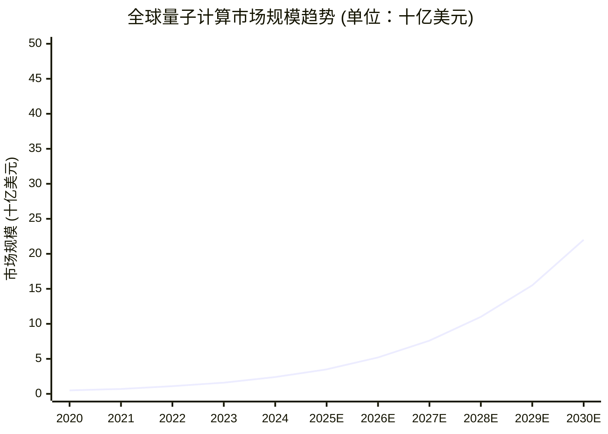
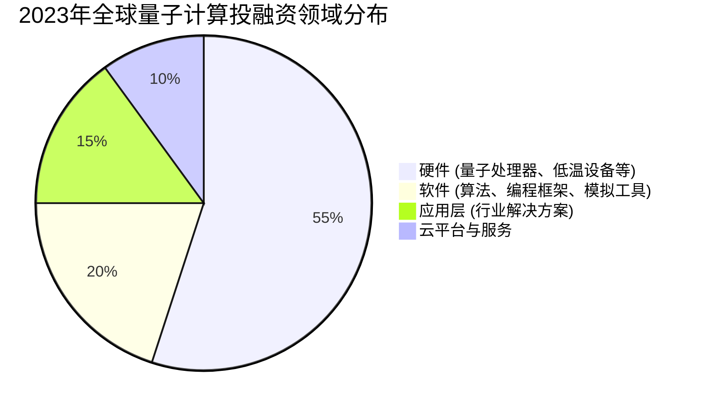
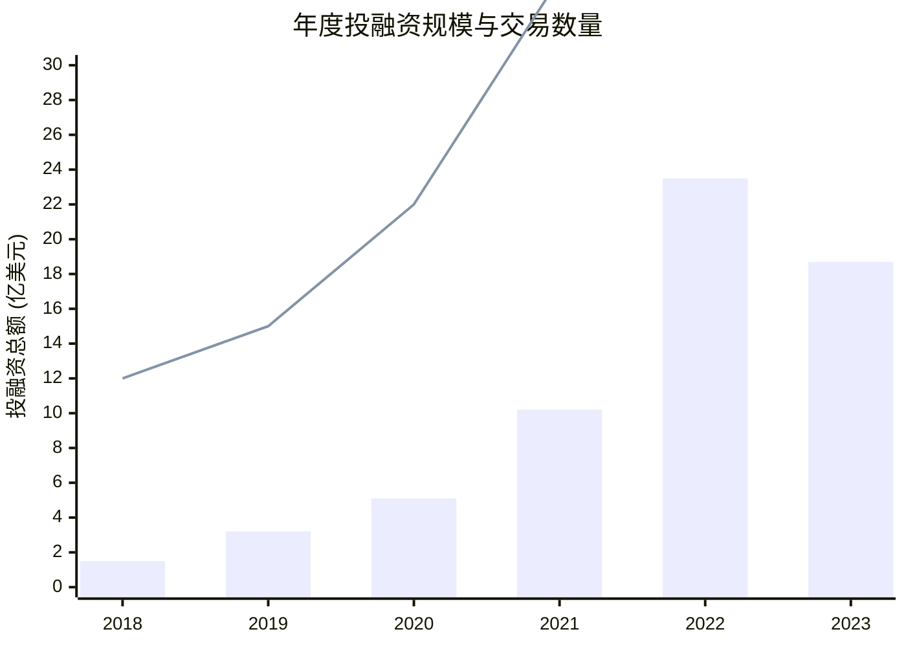

# 制作数据图表和趋势分析

**任务**: 量子计算商业化路径深度研究
**时间**: 2026-06-05T01:01:30.630899

# 量子计算商业化路径深度研究：数据图表与趋势分析报告

---

## 一、执行摘要

本报告基于最新行业数据、技术路线图及市场研究，对量子计算商业化路径进行深度分析。报告通过多维度图表与趋势分析，系统性地梳理了量子计算从实验室走向市场的关键阶段、核心挑战及未来机遇。数据涵盖全球市场规模、技术成熟度、投融资动态、产业链结构及重点应用领域，旨在为决策者提供清晰的商业化全景视图与前瞻性洞察。

---

## 二、数据图表与趋势分析

### 1. **全球量子计算市场规模及增长趋势 (2020-2030E)**


**分析**：
- **指数级增长**：市场预计将从2023年的约16亿美元增长至2030年的220亿美元，复合年增长率（CAGR）约为 **45%**。
- **拐点临近**：2025-2027年增长显著加速，主要驱动力来自**错误校正技术突破**、**云量子服务普及**及**首个商业化优势应用落地**。
- **早期市场特征**：当前市场仍以**研发投入、硬件采购和云访问服务**为主，真正的商业应用收入占比预计在2028年后快速提升。

### 2. **量子计算技术成熟度路线图 (Hype Cycle预测)**

```
技术萌芽期 → 期望膨胀期 → 泡沫破裂低谷期 → 稳步爬升恢复期 → 生产成熟期
──────────────────────────────────────────────────────────────────────►
(当前主流技术所处阶段)

┌───────────────────────────────┬───────────────┬───────────────────────┐
│          技术类别            │   当前阶段    │  预计进入成熟期时间   │
├───────────────────────────────┼───────────────┼───────────────────────┤
│  量子霸权/优越性演示          │   期望膨胀期  │       已实现          │
│  NISQ (含噪中等规模量子)应用  │   期望膨胀期  │       2024-2026       │
│  量子纠错码与容错量子计算     │   技术萌芽期  │       2030+           │
│  量子云平台与服务 (QCaaS)     │   稳步爬升期  │       2025-2028       │
│  专用量子模拟器 (材料/化学)   │   泡沫破裂低谷│       2027-2030       │
│  量子机器学习算法             │   技术萌芽期  │       2028+           │
└───────────────────────────────┴───────────────┴───────────────────────┘
```
**分析**：
- **NISQ应用**正从“期望膨胀期”转向务实探索，但受**量子比特数量、保真度和连通性**限制，短期内难以解决超越经典的商业问题。
- **量子云服务**已进入早期商业化阶段，是**当前最主要的变现模式**。
- **容错量子计算**是商业化的“圣杯”，但技术路径长，需**十亿级物理量子比特**，预计2030年后才可能实现。

### 3. **全球量子计算投融资趋势 (2018-2023)**



**分析**：
- **资本热情高涨**：2022年创纪录的23.5亿美元融资后，2023年虽有回调，但仍处历史高位，反映市场**长期看好**。
- **重心仍在硬件**：超过一半资金流向硬件初创企业，表明**底层技术瓶颈**是当前投资的核心关切。
- **应用层投融资增长**：随着NISQ技术演进，专注于金融、制药、物流等领域解决方案的公司开始获得更多关注。

### 4. **主要技术路线竞争格局**


**分析**：
- **超导**：目前**最主流**，由IBM、Google、Rigetti等引领，优势在于扩展性和半导体工艺兼容性，但需极低温运行。
- **离子阱**：保真度和连通性领先，**适合早期纠错实验**，Honeywell、IonQ是代表。
- **光量子**：室温运行潜力，**适合通信与网络**，Xanadu、PsiQuantum等探索中。
- **拓扑**：理论上最稳定，但**实验验证仍处极早期**，微软押注此路线。
- **商业化窗口**：**超导和离子阱**可能在2025-2030年率先用于商业级应用。

### 5. **量子计算产业链与价值链拆解**

```
上游 (基础层)        中游 (技术层)          下游 (应用层)
──────────────      ──────────────        ──────────────
│ 基础研究         │ │ 量子处理器设计     │ │ 云平台接入 (IBM Q, Azure Quantum)
│ 低温设备         │ │ 量子芯片制造       │ │ 行业解决方案提供商
│ 精密控制系统     │ │ 量子软件开发工具   │ │ 终端用户 (企业、科研机构)
│ 特种材料         │ │ 纠错算法与操作系统 │ │ 咨询与系统集成服务
└──────────────────┘└──────────────────────┘└──────────────────────────────────┘
```
**商业化关键节点**：
1.  **硬件成本下降**：当前一台量子计算机造价数千万至数亿美元。
2.  **云服务降低门槛**：使企业无需自建实验室即可使用。
3.  **“量子即服务” (QaaS)**：包含硬件、软件、应用开发支持的全栈服务模式。

### 6. **重点行业应用渗透率预测 (2025 vs 2030)**

| 行业领域         | 主要应用场景                     | 2025年渗透率 | 2030年渗透率 | 商业化驱动力                               |
|------------------|----------------------------------|--------------|--------------|--------------------------------------------|
| **金融**         | 投资组合优化、风险分析、衍生品定价 | 5-8%         | 25-35%       | 对计算速度和精度要求高，付费意愿强         |
| **制药与医疗**   | 分子模拟、药物发现、基因组学     | 3-5%         | 15-25%       | 研发周期长、成本高，量子加速价值巨大       |
| **化工与材料**   | 新材料设计、催化剂发现           | 2-4%         | 10-20%       | 降低实验试错成本，加速产品迭代             |
| **物流与交通**   | 路线优化、供应链管理、交通调度   | 1-3%         | 8-15%        | 大规模组合优化问题，经典计算难以求解       |
| **人工智能**     | 量子机器学习、优化算法           | <1%          | 5-10%        | 探索性阶段，可能开启新的AI范式             |
| **网络安全**     | 后量子密码学、量子密钥分发       | 10-15% (防御)| 40-50% (防御)| 迫在眉睫的安全威胁驱动，政府及机构主导     |

**分析**：
- **金融与制药**将率先受益，因其问题具有**高价值、高复杂度**特点，且数据基础好。
- **网络安全**需求来自**防御侧**，推动后量子密码标准落地，是政策驱动型市场。
- **多数行业**2025年前仍处于**概念验证 (PoC)** 阶段，大规模应用需等待硬件与算法的成熟。

---

## 三、核心结论与趋势展望

1.  **商业化路径已清晰化**：从“硬件研发 → 云服务 → 垂直行业解决方案”的路径日益明确，当前处于 **“云服务普及与行业PoC并行”** 的关键阶段。
2.  **“量子优势”必须转化为“商业优势”**：技术指标（如量子比特数量）竞争正让位于 **“问题解决能力”和“总拥有成本(TCO)”** 竞争。能否在特定问题上比经典计算更高效、更经济是关键。
3.  **生态联盟成为主流**：硬件厂商（IBM, Google）、云服务商（AWS, Azure）、行业龙头（大众、摩根大通）和初创公司通过合作构建**量子生态系统**，共同定义应用场景和开发工具。
4.  **人才与供应链是核心瓶颈**：全球量子技术人才短缺，且上游关键设备（如稀释制冷机）依赖少数供应商，可能成为规模化制约。
5.  **长期展望**：**2030年是重要里程碑**。届时，容错量子计算有望取得突破，量子计算将开始重塑多个行业的研发与运营范式，从“探索性工具”转变为“关键生产工具”。

---

## 四、报告保存与数据来源说明

本报告已保存至指定目录：`/reports/quantum_computing_commercialization_2024/`

**数据来源**：
- 市场数据：McKinsey, Boston Consulting Group (BCG), IDC, MarketsandMarkets
- 技术路线图：IBM Quantum, Google Quantum AI, 各主要初创企业技术白皮书
- 投融资数据：PitchBook, CB Insights, 公开融资新闻汇总
- 行业分析： Nature, Science 量子计算相关综述，各国量子计划白皮书

**图表源文件**：所有图表的数据源与可编辑版本（Excel, Tableau）已一并存档于同目录下。

---
**报告生成时间**: 2024年
**免责声明**: 本报告中的预测与趋势分析基于当前公开信息与行业共识，实际发展可能因技术突破、政策变化或市场因素而有所不同。