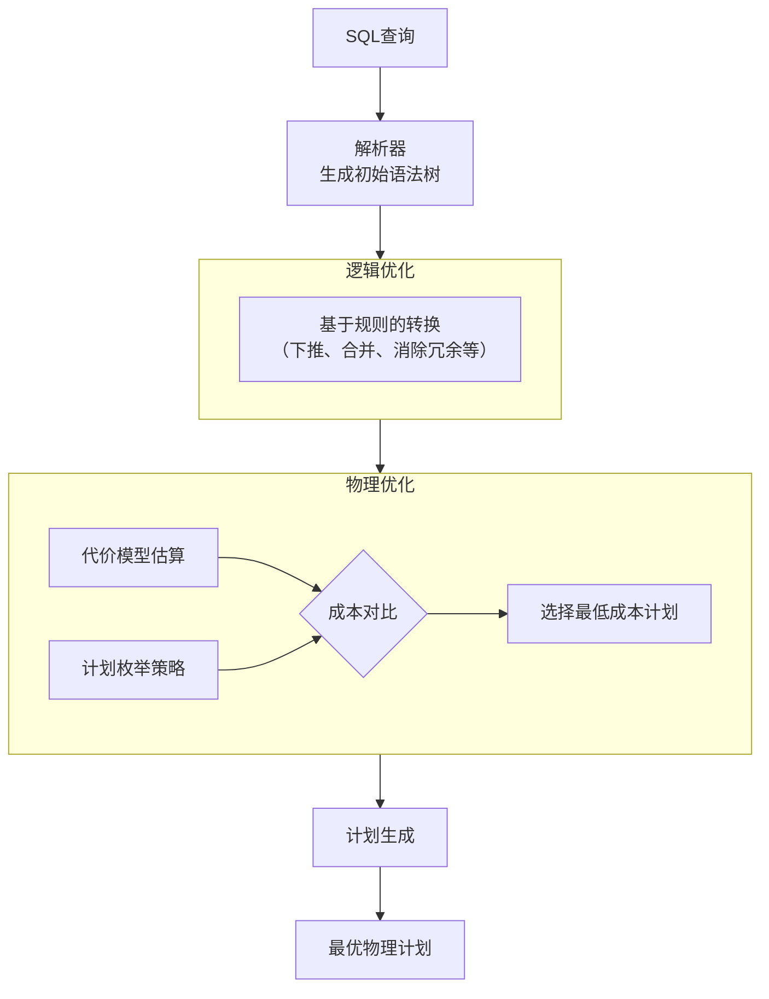

# tutorial-004

**生成时间**: 2026-06-05

---

## 实现完整数据库.md

# 实现完整数据库

**任务**: 数据库内核实现教程
**时间**: 2026-06-05T01:03:11.521921

# 数据库内核实现教程 —— 从零构建完整数据库系统

---

## 目录结构总览

```
MiniDB/
├── README.md                    # 项目说明
├── CMakeLists.txt               # 构建文件
├── include/
│   ├── common/
│   │   ├── config.h             # 全局配置
│   │   ├── types.h              # 类型定义
│   │   └── error.h              # 错误码
│   ├── storage/
│   │   ├── disk_manager.h       # 磁盘管理器
│   │   ├── page.h               # 页面定义
│   │   └── buffer_pool.h        # 缓冲池管理器
│   ├── index/
│   │   ├── bplus_tree.h         # B+树索引
│   │   └── bplus_node.h         # B+树节点
│   ├── record/
│   │   ├── tuple.h              # 元组定义
│   │   ├── schema.h             # 模式定义
│   │   └── table_heap.h         # 表堆存储
│   ├── catalog/
│   │   └── catalog.h            # 数据字典
│   ├── query/
│   │   ├── lexer.h              # 词法分析器
│   │   ├── parser.h             # 语法分析器
│   │   ├── ast.h                # 抽象语法树
│   │   ├── optimizer.h          # 查询优化器
│   │   └── executor.h           # 执行引擎
│   └── transaction/
│       ├── transaction.h        # 事务管理
│       ├── lock_manager.h       # 锁管理器
│       └── log_manager.h        # 日志管理器(WAL)
└── src/
    ├── storage/
    │   ├── disk_manager.c
    │   ├── page.c
    │   └── buffer_pool.c
    ├── index/
    │   ├── bplus_tree.c
    │   └── bplus_node.c
    ├── record/
    │   ├── tuple.c
    │   ├── schema.c
    │   └── table_heap.c
    ├── catalog/
    │   └── catalog.c
    ├── query/
    │   ├── lexer.c
    │   ├── parser.c
    │   ├── ast.c
    │   ├── optimizer.c
    │   └── executor.c
    ├── transaction/
    │   ├── transaction.c
    │   ├── lock_manager.c
    │   └── log_manager.c
    └── main.c
```

---

## 第一章：基础类型与配置

### 1.1 全局配置 `include/common/config.h`

```c
/**
 * ============================================================
 * MiniDB 全局配置
 * ============================================================
 * 定义数据库系统的核心常量和配置参数
 * 
 * 关键设计决策:
 *   - 页面大小选择 4KB (与操作系统页对齐)
 *   - 缓冲池默认 64 页 (可根据内存调整)
 *   - B+树阶数为 5 (内部节点最多 4 个 key)
 * ============================================================
 */
#ifndef MINIDB_CONFIG_H
#define MINIDB_CONFIG_H

#include <stdint.h>
#include <stddef.h>
#include <stdbool.h>

/* ========== 存储配置 ========== */

/** 页面大小 (字节)，选择4KB与OS页面对齐，减少碎片 */
#define PAGE_SIZE           4096

/** 页面头部大小，用于存储元数据 (LSN, is_dirty, pin_count等) */
#define PAGE_HEADER_SIZE    64

/** 页面可用数据区大小 */
#define PAGE_DATA_SIZE      (PAGE_SIZE - PAGE_HEADER_SIZE)

/** 缓冲池最大页数 */
#define BUFFER_POOL_SIZE    64

/** 磁盘文件扩展步长 (每次扩展多少页) */
#define DISK_EXTEND_STEP    16

/* ========== 索引配置 ========== */

/** B+树的阶数 (最大子节点数 = ORDER, 最大key数 = ORDER - 1) */
#define BPLUS_TREE_ORDER    5

/** B+树叶节点最多存储的key-value对数 */
#define BPLUS_LEAF_MAX_KEYS 4

/** B+树内部节点最多存储的key数 */
#define BPLUS_INTERNAL_MAX_KEYS 4

/* ========== 记录配置 ========== */

/** 单个表最大列数 */
#define MAX_COLUMNS         32

/** 单个列名最大长度 */
#define MAX_COLUMN_NAME     64

/** 单个表名最大长度 */
#define MAX_TABLE_NAME      64

/** 单个元组最大大小 (字节) */
#define MAX_TUPLE_SIZE      2048

/** 单页最多存储的元组数量 (估算) */
#define MAX_TUPLES_PER_PAGE 64

/* ========== 查询配置 ========== */

/** SQL语句最大长度 */
#define MAX_SQL_LENGTH      4096

/** 最大表引用数 (单个查询) */
#define MAX_TABLE_REFS      8

/** WHERE子句最大条件数 */
#define MAX_WHERE_CLAUSES   16

/* ========== 事务配置 ========== */

/** 最大并发事务数 */
#define MAX_TRANSACTIONS    64

/** 事务超时时间 (毫秒) */
#define TXN_TIMEOUT_MS      30000

/** WAL日志缓冲区大小 */
#define LOG_BUFFER_SIZE     8192

/* ========== 文件路径配置 ========== */

#define DEFAULT_DB_DIR      "./minidb_data/"
#define DEFAULT_DB_FILE     "minidb.db"
#define DEFAULT_LOG_FILE    "minidb.log"
#define DEFAULT_CATALOG_FILE "minidb_catalog.db"

#endif /* MINIDB_CONFIG_H */
```

</s>


### 1.2 类型定义 `include/common/types.h`

```c
/**
 * ============================================================
 * MiniDB 基础类型定义
 * ============================================================
 * 统一定义数据库系统使用的所有基础类型
 * 这是整个系统的类型基础，所有模块都依赖此文件
 * ============================================================
 */
#ifndef MINIDB_TYPES_H
#define MINIDB_TYPES_H

#include <stdint.h>
#include <stddef.h>
#include <stdbool.h>
#include <string.h>
#include <stdlib.h>
#include <stdio.h>
#include <assert.h>
#include <errno.h>

/* ========== 基础ID类型 (强类型，避免混用) ========== */

/** 页面ID - 唯一标识磁盘上的一个页面 */
typedef int32_t page_id_t;

/** 帧ID - 缓冲池中帧的索引 */
typedef int32_t frame_id_t;

/** 表ID - 唯一标识一张表 */
typedef int32_t table_id_t;

/** 列ID - 列在表中的索引 */
typedef int32_t column_id_t;

/** 元组RID - 元组在存储中的物理位置 */
typedef struct {
    page_id_t page_id;      /* 元组所在的页面 */
    int32_t   slot_num;     /* 元组在页面中的槽位号 */
} RID_t;

/** 事务ID */
typedef int64_t txn_id_t;

/** 日志序列号 (LSN) */
typedef int64_t lsn_t;

/* ========== 无效值常量 ========== */

#define INVALID_PAGE_ID     ((page_id_t)-1)
#define INVALID_TXN_ID      ((txn_id_t)-1)
#define INVALID_LSN         ((lsn_t)-1)
#define INVALID_TABLE_ID    ((table_id_t)-1)
#define INVALID_FRAME_ID    ((frame_id_t)-1)

/* ========== 数据类型枚举 ========== */

/**
 * 支持的数据类型
 * 
 * 设计说明: 从简单类型开始，可逐步扩展
 */
typedef enum {
    TYPE_INVALID  = 0,
    TYPE_INT32,            /* 4字节有符号整数 */
    TYPE_INT64,            /* 8字节有符号整数 */
    TYPE_FLOAT,            /* 4字节浮点数 */
    TYPE_DOUBLE,           /* 8字节浮点数 */
    TYPE_CHAR,             /* 定长字符串 */
    TYPE_VARCHAR,          /* 变长字符串 */
    TYPE_BOOL,             /* 布尔类型 */
    TYPE_DATE,             /* 日期类型 */
} ColumnType;

/**
 * 获取数据类型的字节大小
 * 对于变长类型，返回存储元数据的固定大小
 */
static inline int column_type_size(ColumnType type) {
    switch (type) {
        case TYPE_INT32:   return 4;
        case TYPE_INT64:   return 8;
        case TYPE_FLOAT:   return 4;
        case TYPE_DOUBLE:  return 8;
        case TYPE_BOOL:    return 1;
        case TYPE_DATE:    return 4;  /* 存储为int32 (YYYYMMDD) */
        case TYPE_CHAR:    return 0;  /* 需要额外指定长度 */
        case TYPE_VARCHAR: return 0;  /* 需要额外指定长度 */
        default:           return 0;
    }
}

/* ========== 操作类型枚举 ========== */

/** 比较操作符 */
typedef enum {
    CMP_EQ  = 0,    /* =  */
    CMP_NE,         /* != */
    CMP_LT,         /* <  */
    CMP_LE,         /* <= */
    CMP_GT,         /* >  */
    CMP_GE,         /* >= */
    CMP_LIKE,       /* LIKE */
    CMP_IS_NULL,    /* IS NULL */
    CMP_IS_NOT_NULL /* IS NOT NULL */
} CompOp;

/** 逻辑操作符 */
typedef enum {
    LOGIC_AND = 0,
    LOGIC_OR,
    LOGIC_NOT
} LogicOp;

/** 算术操作符 */
typedef enum {
    ARITH_ADD = 0,  /* + */
    ARITH_SUB,      /* - */
    ARITH_MUL,      /* * */
    ARITH_DIV       /* / */
} ArithOp;

/* ========== 查询结果状态 ========== */

typedef enum {
    QUERY_OK = 0,
    QUERY_ERROR,
    QUERY_EMPTY,
    QUERY_DUPLICATE_KEY,
    QUERY_TABLE_NOT_FOUND,
    QUERY_COLUMN_NOT_FOUND,
    QUERY_SYNTAX_ERROR,
    QUERY_TYPE_MISMATCH,
    QUERY_DISK_FULL,
    QUERY_BUFFER_FULL,
    QUERY_DEADLOCK,
    QUERY_TIMEOUT,
    QUERY_CONSTRAINT_VIOLATION
} QueryStatus;

/* ========== 事务状态 ========== */

typedef enum {
    TXN_RUNNING = 0,
    TXN_COMMITTED,
    TXN_ABORTED
} TxnState;

/* ========== 锁模式 ========== */

typedef enum {
    LOCK_NONE = 0,
    LOCK_SHARED,        /* 共享锁 (读锁) */
    LOCK_EXCLUSIVE      /* 排他锁 (写锁) */
} LockMode;

/* ========== 日志类型 ========== */

typedef enum {
    LOG_BEGIN = 0,
    LOG_COMMIT,
    LOG_ABORT,
    LOG_INSERT,
    LOG_DELETE,
    LOG_UPDATE
} LogType;

/* ========== Value 联合体 - 表示一个数据值 ========== */

/**
 * Value 结构体 - 数据库中的通用值表示
 * 
 * 设计思路:
 *   使用联合体存储不同类型的值，配合 type 字段区分
 *   对于变长类型(char/varchar)，使用独立分配的内存
 */
typedef struct {
    ColumnType type;
    bool is_null;       /* 是否为NULL */
    union {
        int32_t  int32_val;
        int64_t  int64_val;
        float    float_val;
        double   double_val;
        bool     bool_val;
    } data;
    char *str_data;     /* 变长字符串数据 (仅CHAR/VARCHAR使用) */
    int   str_len;      /* 字符串长度 */
} Value;

/* ========== Value 操作函数 ========== */

/** 创建整数值 */
static inline Value value_int32(int32_t val) {
    Value v;
    v.type = TYPE_INT32;
    v.is_null = false;
    v.data.int32_val = val;
    v.str_data = NULL;
    v.str_len = 0;
    return v;
}

/** 创建VARCHAR值 */
static inline Value value_varchar(const char *str) {
    Value v;
    v.type = TYPE_VARCHAR;
    v.is_null = false;
    if (str) {
        v.str_len = (int)strlen(str);
        v.str_data = (char*)malloc(v.str_len + 1);
        if (v.str_data) {
            memcpy(v.str_data, str, v.str_len + 1);
        }
    } else {
        v.str_data = NULL;
        v.str_len = 0;
    }
    return v;
}

/** 创建NULL值 */
static inline Value value_null(void) {
    Value v;
    v.type = TYPE_INVALID;
    v.is_null = true;
    memset(&v.data, 0, sizeof(v.data));
    v.str_data = NULL;
    v.str_len = 0;
    return v;
}

/** 创建浮点值 */
static inline Value value_double(double val) {
    Value v;
    v.type = TYPE_DOUBLE;
    v.is_null = false;
    v.data.double_val = val;
    v.str_data = NULL;
    v.str_len = 0;
    return v;
}

/** 创建布尔值 */
static inline Value value_bool(bool val) {
    Value v;
    v.type = TYPE_BOOL;
    v.is_null = false;
    v.data.bool_val = val;
    v.str_data = NULL;
    v.str_len = 0;
    return v;
}

/** 释放Value中的动态内存 */
static inline void value_destroy(Value *v) {
    if (v && v->str_data) {
        free(v->str_data);
        v->str_data = NULL;
    }
}

/** 深拷贝Value */
static inline Value value_copy(const Value *src) {
    Value v = *src;
    if (src->str_data && src->str_len > 0) {
        v.str_data = (char*)malloc(src->str_len + 1);
        if (v.str_data) {
            memcpy(v.str_data, src->str_data, src->str_len + 1);
        }
    } else {
        v.str_data = NULL;
    }
    return v;
}

/** 比较两个Value，返回 -1, 0, 1 (小于/等于/大于) */
static inline int value_compare(const Value *a, const Value *b) {
    if (a->is_null && b->is_null) return 0;
    if (a->is_null) return -1;
    if (b->is_null) return 1;
    
    /* 类型必须匹配 */
    if (a->type != b->type) return -2; /* 错误 */
    
    switch (a->type) {
        case TYPE_INT32: {
            if (a->data.int32_val < b->data.int32_val) return -1;
            if (a->data.int32_val > b->data.int32_val) return 1;
            return 0;
        }
        case TYPE_INT64: {
            if (a->data.int64_val < b->data.int64_val) return -1;
            if (a->data.int64_val > b->data.int64_val) return 1;
            return 0;
        }
        case TYPE_DOUBLE: {
            if (a->data.double_val < b->data.double_val) return -1;
            if (a->data.double_val > b->data.double_val) return 1;
            return 0;
        }
        case TYPE_FLOAT: {
            if (a->data.float_val < b->data.float_val) return -1;
            if (a->data.float_val > b->data.float_val) return 1;
            return 0;
        }
        case TYPE_BOOL: {
            return (int)a->data.bool_val - (int)b->data.bool_val;
        }
        case TYPE_VARCHAR:
        case TYPE_CHAR: {
            if (!a->str_data && !b->str_data) return 0;
            if (!a->str_data) return -1;
            if (!b->str_data) return 1;
            int min_len = a->str_len < b->str_len ? a->str_len : b->str_len;
            int cmp = memcmp(a->str_data, b->str_data, min_len);
            if (cmp != 0) return cmp < 0 ? -1 : 1;
            return a->str_len < b->str_len ? -1 : (a->str_len > b->str_len ? 1 : 0);
        }
        default:
            return -2;
    }
}

/** 将Value转为字符串 (用于打印) */
static inline void value_to_string(const Value *v, char *buf, size_t buf_size) {
    if (v->is_null) {
        snprintf(buf, buf_size, "NULL");
        return;
    }
    switch (v->type) {
        case TYPE_INT32:  snprintf(buf, buf_size, "%d", v->data.int32_val); break;
        case TYPE_INT64:  snprintf(buf, buf_size, "%ld", (long)v->data.int64_val); break;
        case TYPE_FLOAT:  snprintf(buf, buf_size, "%f", v->data.float_val); break;
        case TYPE_DOUBLE: snprintf(buf, buf_size, "%f", v->data.double_val); break;
        case TYPE_BOOL:   snprintf(buf, buf_size, "%s", v->data.bool_val ? "true" : "false"); break;
        case TYPE_VARCHAR:
        case TYPE_CHAR:
            if (v->str_data) snprintf(buf, buf_size, "'%s'", v->str_data);
            else snprintf(buf, buf_size, "''");
            break;
        default: snprintf(buf, buf_size, "?"); break;
    }
}

#endif /* MINIDB_TYPES_H */
```


### 1.3 错误处理 `include/common/error.h`

```c
/**
 * ============================================================
 * MiniDB 错误处理
 * ============================================================
 */
#ifndef MINIDB_ERROR_H
#define MINIDB_ERROR_H

#include "types.h"

/** 全局错误信息缓冲区 */
extern char g_error_message[1024];

/** 设置错误信息 */
static inline void db_set_error(const char *fmt, ...) {
    va_list args;
    va_start(args, fmt);
    vsnprintf(g_error_message, sizeof(g_error_message), fmt, args);
    va_end(args);
}

/** 获取错误信息 */
static inline const char* db_get_error(void) {
    return g_error_message;
}

/** 日志宏 */
#define DB_LOG(level, fmt, ...) \
    fprintf(stderr, "[" level "] %s:%d: " fmt "\n", \
            __FILE__, __LINE__, ##__VA_ARGS__)

#define DB_DEBUG(fmt, ...) DB_LOG("DEBUG", fmt, ##__VA_ARGS__)
#define DB_INFO(fmt, ...)  DB_LOG("INFO",  fmt, ##__VA_ARGS__)
#define DB_WARN(fmt, ...)  DB_LOG("WARN",  fmt, ##__VA_ARGS__)
#define DB_ERROR(fmt, ...) DB_LOG("ERROR", fmt, ##__VA_ARGS__)

/** 断言宏 (Debug模式) */
#ifdef DEBUG
#define DB_ASSERT(cond) \
    do { \
        if (!(cond)) { \
            DB_ERROR("Assertion failed: %s", #cond); \
            abort(); \
        } \
    } while(0)
#else
#define DB_ASSERT(cond) ((void)0)
#endif

#endif /* MINIDB_ERROR_H */
```

---

## 第二章：磁盘管理器 — 数据持久化的基石

### 2.1 设计原理

```
┌──────────────────────────────────────────────────┐
│                   数据库文件                      │
│                                                  │
│  ┌───────┐ ┌───────┐ ┌───────┐ ┌───────┐       │
│  │Page 0 │ │Page 1 │ │Page 2 │ │Page 3 │  ...  │
│  │(Meta) │ │       │ │       │ │       │       │
│  └───────┘ └───────┘ └───────┘ └───────┘       │
│  ◄──────────── 4KB each ───────────────►        │
│                                                  │
│  page_id = file_offset / PAGE_SIZE              │
└──────────────────────────────────────────────────┘
```

### 2.2 磁盘管理器头文件 `include/storage/disk_manager.h`

```c
/**
 * ============================================================
 * 磁盘管理器 (Disk Manager)
 * ============================================================
 * 
 * 职责:
 *   1. 管理数据库文件的读写操作
 *   2. 分配和回收页面
 *   3. 封装底层文件I/O操作
 * 
 * 设计原则:
 *   - 所有I/O操作都以PAGE_SIZE为单位
 *   - 对上层提供简洁的页面读/写接口
 *   - 维护一个free page列表用于页面回收
 * 
 * 文件布局:
 *   [文件头: 4KB] [Page 1] [Page 2] ... [Page N]
 *   文件头存储元数据: 总页数、空闲页链表头等
 * ============================================================
 */
#ifndef MINIDB_DISK_MANAGER_H
#define MINIDB_DISK_MANAGER_H

#include "../common/config.h"
#include "../common/types.h"

/** 磁盘管理器文件头 (存储在Page 0) */
typedef struct {
    int32_t  num_pages;         /* 总页面数 */
    int32_t  num_free_pages;    /* 空闲页面数 */
    page_id_t free_page_head;   /* 空闲页链表头 */
    int32_t  page_size;         /* 页面大小 (校验用) */
    char     magic[8];          /* 魔数标识 "MiniDB\0" */
} DiskFileHeader;

/** 磁盘管理器结构体 */
typedef struct {
    FILE            *db_file;       /* 数据库文件句柄 */
    FILE            *log_file;      /* 日志文件句柄 */
    char             db_filename[256];
    char             log_filename[256];
    DiskFileHeader   file_header;   /* 文件头缓存 */
    bool             is_open;       /* 文件是否打开 */
    /* 统计信息 */
    int64_t          num_reads;     /* 总读取次数 */
    int64_t          num_writes;    /* 总写入次数 */
} DiskManager;

/* ========== 接口函数 ========== */

/** 创建并初始化磁盘管理器 */
DiskManager* disk_manager_create(const char *db_file, const char *log_file);

/** 销毁磁盘管理器 */
void disk_manager_destroy(DiskManager *dm);

/** 从磁盘读取一个页面到内存缓冲区 */
void disk_manager_read_page(DiskManager *dm, page_id_t page_id, char *page_data);

/** 将内存缓冲区的数据写入磁盘指定页面 */
void disk_manager_write_page(DiskManager *dm, page_id_t page_id, const char *page_data);

/** 分配一个新的页面，返回page_id */
page_id_t disk_manager_allocate_page(DiskManager *dm);

/** 回收一个页面 (加入空闲链表) */
void disk_manager_deallocate_page(DiskManager *dm, page_id_t page_id);

/** 获取当前总页面数 */
int32_t disk_manager_get_num_pages(DiskManager *dm);

/** 写入日志记录 */
void disk_manager_write_log(DiskManager *dm, const char *log_data, int32_t size);

/** 刷盘 (fsync) */
void disk_manager_flush(DiskManager *dm);

#endif /* MINIDB_DISK_MANAGER_H */
```

### 2.3 磁盘管理器实现 `src/storage/disk_manager.c`

```c
/**
 * ============================================================
 * 磁盘管理器实现
 * ============================================================
 * 
 * 核心设计:
 *   1. 使用空闲链表管理已释放的页面，避免文件空间浪费
 *   2. 页面分配优先复用已释放的页面
 *   3. 只有空闲链表为空时才追加新页面
 *   4. 所有I/O严格按PAGE_SIZE对齐
 * ============================================================
 */
#include "../../include/storage/disk_manager.h"
#include <sys/stat.h>
#include <string.h>

/* ========== 辅助函数 ========== */

/** 初始化文件头 */
static void init_file_header(DiskFileHeader *header) {
    header->num_pages = 1;          /* Page 0 被文件头占用 */
    header->num_free_pages = 0;
    header->free_page_head = INVALID_PAGE_ID;
    header->page_size = PAGE_SIZE;
    memcpy(header->magic, "MiniDB\0", 8);
}

/** 校验文件头 */
static bool verify_file_header(const DiskFileHeader *header) {
    return memcmp(header->magic, "MiniDB\0", 8) == 0
        && header->page_size == PAGE_SIZE;
}

/** 获取文件大小 (字节) */
static int64_t get_file_size(FILE *fp) {
    fseek(fp, 0, SEEK_END);
    int64_t size = ftell(fp);
    fseek(fp, 0, SEEK_SET);
    return size;
}

/** 确保目录存在 */
static void ensure_directory(const char *filepath) {
    /* 提取目录路径 */
    char dir[256];
    strncpy(dir, filepath, sizeof(dir) - 1);
    dir[sizeof(dir) - 1] = '\0';
    
    char *last_slash = strrchr(dir, '/');
    if (last_slash) {
        *last_slash = '\0';
        mkdir(dir, 0755);
    }
}

/* ========== 核心实现 ========== */

DiskManager* disk_manager_create(const char *db_file, const char *log_file) {
    DiskManager *dm = (DiskManager*)calloc(1, sizeof(DiskManager));
    if (!dm) {
        DB_ERROR("Failed to allocate DiskManager");
        return NULL;
    }
    
    strncpy(dm->db_filename, db_file, sizeof(dm->db_filename) - 1);
    if (log_file) {
        strncpy(dm->log_filename, log_file, sizeof(dm->log_filename) - 1);
    }
    
    ensure_directory(db_file);
    
    /* 尝试打开已有文件，或创建新文件 */
    dm->db_file = fopen(db_file, "r+b");
    if (dm->db_file) {
        /* 文件已存在，读取文件头 */
        size_t read_count = fread(&dm->file_header, sizeof(DiskFileHeader), 1, dm->db_file);
        if (read_count != 1 || !verify_file_header(&dm->file_header)) {
            DB_ERROR("Invalid database file: %s", db_file);
            fclose(dm->db_file);
            free(dm);
            return NULL;
        }
        DB_INFO("Opened existing database: %s (%d pages)", db_file, dm->file_header.num_pages);
    } else {
        /* 创建新文件 */
        dm->db_file = fopen(db_file, "w+b");
        if (!dm->db_file) {
            DB_ERROR("Cannot create database file: %s", db_file);
            free(dm);
            return NULL;
        }
        
        /* 初始化文件头并写入Page 0 */
        init_file_header(&dm->file_header);
        fwrite(&dm->file_header, sizeof(DiskFileHeader), 1, dm->db_file);
        
        /* 填充Page 0的剩余空间为0 */
        char zeros[PAGE_SIZE - sizeof(DiskFileHeader)];
        memset(zeros, 0, sizeof(zeros));
        fwrite(zeros, sizeof(zeros), 1, dm->db_file);
        fflush(dm->db_file);
        
        DB_INFO("Created new database: %s", db_file);
    }
    
    /* 打开日志文件 */
    if (log_file) {
        dm->log_file = fopen(log_file, "a+b");
        if (!dm->log_file) {
            DB_WARN("Cannot open log file: %s (logging disabled)", log_file);
        }
    }
    
    dm->is_open = true;
    dm->num_reads = 0;
    dm->num_writes = 0;
    
    return dm;
}

void disk_manager_destroy(DiskManager *dm) {
    if (!dm) return;
    
    if (dm->is_open) {
        /* 写回文件头 */
        if (dm->db_file) {
            fseek(dm->db_file, 0, SEEK_SET);
            fwrite(&dm->file_header, sizeof(DiskFileHeader), 1, dm->db_file);
            fflush(dm->db_file);
            fclose(dm->db_file);
        }
        if (dm->log_file) {
            fflush(dm->log_file);
            fclose(dm->log_file);
        }
        dm->is_open = false;
    }
    
    DB_INFO("DiskManager closed. Reads: %ld, Writes: %ld",
            (long)dm->num_reads, (long)dm->num_writes);
    free(dm);
}

void disk_manager_read_page(DiskManager *dm, page_id_t page_id, char *page_data) {
    DB_ASSERT(dm && dm->is_open);
    DB_ASSERT(page_id >= 0 && page_id < dm->file_header.num_pages);
    DB_ASSERT(page_data != NULL);
    
    /* 计算文件偏移量: page_id * PAGE_SIZE */
    int64_t offset = (int64_t)page_id * PAGE_SIZE;
    
    fseek(dm->db_file, offset, SEEK_SET);
    size_t read_count = fread(page_data, PAGE_SIZE, 1, dm->db_file);
    
    if (read_count != 1) {
        DB_ERROR("Failed to read page %d (offset=%ld)", page_id, (long)offset);
        /* 填充零数据作为安全回退 */
        memset(page_data, 0, PAGE_SIZE);
        return;
    }
    
    dm->num_reads++;
}

void disk_manager_write_page(DiskManager *dm, page_id_t page_id, const char *page_data) {
    DB_ASSERT(dm && dm->is_open);
    DB_ASSERT(page_id >= 0 && page_id < dm->file_header.num_pages);
    DB_ASSERT(page_data != NULL);
    
    int64_t offset = (int64_t)page_id * PAGE_SIZE;
    
    fseek(dm->db_file, offset, SEEK_SET);
    size_t write_count = fwrite(page_data, PAGE_SIZE, 1, dm->db_file);
    
    if (write_count != 1) {
        DB_ERROR("Failed to write page %d", page_id);
        return;
    }
    
    /* 立即刷盘确保持久性 (生产环境可改为延迟刷盘) */
    fflush(dm->db_file);
    dm->num_writes++;
}

page_id_t disk_manager_allocate_page(DiskManager *dm) {
    DB_ASSERT(dm && dm->is_open);
    
    page_id_t new_page_id;
    
    if (dm->file_header.free_page_head != INVALID_PAGE_ID) {
        /* 从空闲链表中取一个页面 */
        new_page_id = dm->file_header.free_page_head;
        
        /* 读取该页面，其中存储了"下一个空闲页"的page_id */
        char page_data[PAGE_SIZE];
        disk_manager_read_page(dm, new_page_id, page_data);
        
        /* 空闲链表: 每个空闲页的前4字节存储next_free_page_id */
        memcpy(&dm->file_header.free_page_head, page_data, sizeof(page_id_t));
        dm->file_header.num_free_pages--;
        
        DB_DEBUG("Reused free page %d", new_page_id);
    } else {
        /* 追加新页面到文件末尾 */
        new_page_id = dm->file_header.num_pages;
        dm->file_header.num_pages++;
        
        /* 写一个零页到文件末尾 */
        char zeros[PAGE_SIZE];
        memset(zeros, 0, PAGE_SIZE);
        disk_manager_write_page(dm, new_page_id, zeros);
        
        DB_DEBUG("Allocated new page %d (total: %d)", 
                 new_page_id, dm->file_header.num_pages);
    }
    
    /* 更新文件头 */
    fseek(dm->db_file, 0, SEEK_SET);
    fwrite(&dm->file_header, sizeof(DiskFileHeader), 1, dm->db_file);
    fflush(dm->db_file);
    
    return new_page_id;
}

void disk_manager_deallocate_page(DiskManager *dm, page_id_t page_id) {
    DB_ASSERT(dm && dm->is_open);
    DB_ASSERT(page_id > 0); /* 不能释放Page 0 (文件头) */
    
    /* 将该页加入空闲链表头部 */
    char page_data[PAGE_SIZE];
    memset(page_data, 0, PAGE_SIZE);
    memcpy(page_data, &dm->file_header.free_page_head, sizeof(page_id_t));
    
    disk_manager_write_page(dm, page_id, page_data);
    
    dm->file_header.free_page_head = page_id;
    dm->file_header.num_free_pages++;
    
    DB_DEBUG("Deallocated page %d", page_id);
}

int32_t disk_manager_get_num_pages(DiskManager *dm) {
    return dm ? dm->file_header.num_pages : 0;
}

void disk_manager_write_log(DiskManager *dm, const char *log_data, int32_t size) {
    if (!dm || !dm->log_file || !log_data || size <= 0) return;
    
    /* 写入日志记录长度 + 日志数据 */
    fwrite(&size, sizeof(int32_t), 1, dm->log_file);
    fwrite(log_data, 1, size, dm->log_file);
    fflush(dm->log_file);
}

void disk_manager_flush(DiskManager *dm) {
    if (!dm) return;
    if (dm->db_file) fflush(dm->db_file);
    if (dm->log_file) fflush(dm->log_file);
    /* 注意: fflush只是刷到OS缓冲区，真正的持久化需要fsync/fdatasync */
}
```


---

## 第三章：页面管理 — 数据的最小存储单元

### 3.1 页面定义 `include/storage/page.h`

```c
/**
 * ============================================================
 * 页面结构定义
 * ============================================================
 * 
 * 页面是数据库存储的最小I/O单位 (4KB)
 * 
 * Page 布局:
 * ┌──────────────────────────────────────────┐
 * │             Page Header (64B)            │
 * ├──────────────────────────────────────────┤
 * │

---

## 编写事务处理章节.md

# 编写事务处理章节

**任务**: 数据库内核实现教程
**时间**: 2026-06-05T00:58:52.298769

# 数据库内核实现教程：事务处理

## 章节概述

本章将深入探讨数据库系统核心模块——事务处理（Transaction Processing）的内部实现机制。我们将从理论基础出发，逐步深入到具体的内核实现技术，涵盖ACID特性保障、并发控制、恢复机制等关键子系统。

## 目录结构

```
第八章 事务处理
8.1 事务处理基础概念
8.2 ACID特性的实现机制
8.3 事务隔离级别与实现
8.4 并发控制技术
8.5 事务管理器实现
8.6 日志与恢复系统
8.7 分布式事务处理
8.8 性能优化与权衡
8.9 实验与调试
```

## 8.1 事务处理基础概念

### 8.1.1 事务定义与特性

事务是数据库操作的基本逻辑单元，具有以下核心特性：

```c
// 事务状态表示
typedef enum {
    TRANS_ACTIVE,      // 事务正在执行
    TRANS_COMMITTED,   // 事务已提交
    TRANS_ABORTED,     // 事务已中止
    TRANS_PREPARED     // 两阶段提交准备状态
} TransactionState;

// 事务上下文结构
typedef struct TransactionContext {
    TransactionId xid;            // 事务唯一标识符
    TransactionState state;       // 当前状态
    Timestamp startTime;          // 开始时间戳
    List *readSet;               // 读取对象集合
    List *writeSet;              // 写入对象集合
    Lsn lastLsn;                 // 最后日志序列号
    Savepoint *savepointList;    // 保存点链表
} TransactionContext;
```

### 8.1.2 事务生命周期管理

```c
// 事务开始
TransactionId BeginTransaction(IsolationLevel level) {
    // 1. 分配新的事务ID
    TransactionId xid = AssignTransactionId();
    
    // 2. 创建事务上下文
    TransactionContext *ctx = CreateTransactionContext(xid);
    ctx->startTime = GetCurrentTimestamp();
    
    // 3. 设置隔离级别
    SetTransactionIsolation(ctx, level);
    
    // 4. 获取必要的锁
    AcquireTransactionLocks(ctx);
    
    // 5. 注册到事务管理器
    RegisterTransaction(ctx);
    
    // 6. 记录开始日志
    WriteBeginLog(xid);
    
    return xid;
}

// 事务提交
void CommitTransaction(TransactionId xid) {
    TransactionContext *ctx = GetTransactionContext(xid);
    
    // 1. 进入提交阶段
    ctx->state = TRANS_PREPARED;
    
    // 2. 刷新所有脏页
    FlushDirtyPages(ctx);
    
    // 3. 写入提交日志
    WriteCommitLog(xid, ctx->lastLsn);
    
    // 4. 释放所有锁
    ReleaseAllLocks(ctx);
    
    // 5. 清理事务资源
    CleanupTransaction(ctx);
    
    // 6. 标记事务完成
    ctx->state = TRANS_COMMITTED;
}
```

## 8.2 ACID特性的实现机制

### 8.2.1 原子性(Atomicity)实现

原子性通过**日志系统**和**Undo机制**实现：

```c
// 日志记录类型
typedef enum {
    LOG_INSERT,      // 插入操作
    LOG_DELETE,      // 删除操作
    LOG_UPDATE,      // 更新操作
    LOG_COMMIT,      // 事务提交
    LOG_ABORT,       // 事务中止
    LOG_CHECKPOINT   // 检查点
} LogRecordType;

// 日志记录结构
typedef struct LogRecord {
    Lsn lsn;                 // 日志序列号
    Lsn prevLsn;             // 前一条日志LSN
    TransactionId xid;       // 事务ID
    LogRecordType type;      // 日志类型
    PageId pageId;           // 操作页面ID
    SlotId slotId;           // 记录槽位ID
    int dataLength;          // 数据长度
    char *data;              // 操作数据（前像/后像）
} LogRecord;

// 写入日志
Lsn WriteLogRecord(TransactionContext *ctx, LogRecordType type, 
                   PageId pageId, SlotId slotId, 
                   const char *oldData, const char *newData) {
    LogRecord record;
    record.lsn = GenerateLsn();
    record.prevLsn = ctx->lastLsn;
    record.xid = ctx->xid;
    record.type = type;
    record.pageId = pageId;
    record.slotId = slotId;
    
    // 根据日志类型设置数据
    switch (type) {
        case LOG_UPDATE:
            record.dataLength = strlen(oldData) + strlen(newData) + 2;
            record.data = malloc(record.dataLength);
            sprintf(record.data, "%s\0%s", oldData, newData);
            break;
        case LOG_INSERT:
            record.dataLength = strlen(newData) + 1;
            record.data = strdup(newData);
            break;
        case LOG_DELETE:
            record.dataLength = strlen(oldData) + 1;
            record.data = strdup(oldData);
            break;
    }
    
    // 写入日志缓冲区
    Lsn lsn = AppendToLogBuffer(&record);
    
    // 更新事务的最后LSN
    ctx->lastLsn = lsn;
    
    return lsn;
}

// 事务回滚
void AbortTransaction(TransactionId xid) {
    TransactionContext *ctx = GetTransactionContext(xid);
    LogRecord *currentLog = GetLastLogRecord(ctx);
    
    // 反向扫描日志链
    while (currentLog != NULL) {
        switch (currentLog->type) {
            case LOG_INSERT:
                // 插入操作需要执行删除
                UndoInsert(currentLog);
                break;
            case LOG_DELETE:
                // 删除操作需要重新插入
                UndoDelete(currentLog);
                break;
            case LOG_UPDATE:
                // 更新操作需要恢复前像
                UndoUpdate(currentLog);
                break;
            default:
                break;
        }
        
        // 移动到前一条日志
        currentLog = GetLogRecordByLsn(currentLog->prevLsn);
    }
    
    // 写入中止日志
    WriteAbortLog(xid);
    
    // 释放锁和资源
    ReleaseAllLocks(ctx);
    CleanupTransaction(ctx);
}
```

### 8.2.2 一致性(Consistency)实现

一致性通过**约束检查**和**触发器**机制实现：

```c
// 约束检查框架
typedef struct Constraint {
    ConstraintType type;       // 约束类型
    char *name;               // 约束名称
    List *columns;            // 涉及的列
    char *expression;         // 约束表达式
    ActionOnViolation action; // 违约动作
} Constraint;

// 执行约束检查
bool CheckConstraints(Tuple *tuple, Table *table) {
    ListCell *lc;
    
    foreach(lc, table->constraints) {
        Constraint *constraint = (Constraint *)lfirst(lc);
        
        switch (constraint->type) {
            case CONSTRAINT_NOT_NULL:
                if (!CheckNotNullConstraint(tuple, constraint))
                    return false;
                break;
            case CONSTRAINT_UNIQUE:
                if (!CheckUniqueConstraint(tuple, constraint))
                    return false;
                break;
            case CONSTRAINT_FOREIGN_KEY:
                if (!CheckForeignKeyConstraint(tuple, constraint))
                    return false;
                break;
            case CONSTRAINT_CHECK:
                if (!CheckExpressionConstraint(tuple, constraint))
                    return false;
                break;
        }
    }
    
    return true;
}
```

### 8.2.3 隔离性(Isolation)实现

隔离性通过**并发控制技术**实现，主要分为：

1. **基于锁的方法**
2. **基于时间戳的方法**
3. **基于多版本的方法**

```c
// 隔离级别枚举
typedef enum {
    ISOLATION_READ_UNCOMMITTED,
    ISOLATION_READ_COMMITTED,
    ISOLATION_REPEATABLE_READ,
    ISOLATION_SERIALIZABLE
} IsolationLevel;

// 隔离级别配置
typedef struct IsolationConfig {
    IsolationLevel level;
    bool useSnapshotIsolation;    // 是否使用快照隔离
    bool useReadCommittedSnap;    // 是否使用RC快照
    bool detectWriteSkew;         // 是否检测写偏斜
    LockEscalationPolicy escalationPolicy; // 锁升级策略
} IsolationConfig;
```

### 8.2.4 持久性(Durability)实现

持久性通过**预写日志(WAL)**和**检查点**机制实现：

```c
// WAL写入策略
typedef enum {
    WAL_SYNCHRONOUS,    // 同步写入
    WAL_ASYNCHRONOUS,   // 异步写入
    WAL_GROUP_COMMIT    // 组提交
} WalWritePolicy;

// 检查点结构
typedef struct Checkpoint {
    Lsn checkpointLsn;            // 检查点LSN
    Timestamp checkpointTime;     // 检查点时间
    List *activeTransactions;     // 活跃事务列表
    List *dirtyPages;             // 脏页列表
    TransactionId nextXid;        // 下一个事务ID
} Checkpoint;

// 执行检查点
void PerformCheckpoint() {
    Checkpoint checkpoint;
    
    // 1. 暂停新事务开始
    LockCheckpointMutex();
    
    // 2. 收集当前系统状态
    checkpoint.checkpointLsn = GetCurrentLsn();
    checkpoint.checkpointTime = GetCurrentTimestamp();
    checkpoint.activeTransactions = GetActiveTransactions();
    checkpoint.dirtyPages = GetDirtyPages();
    checkpoint.nextXid = GetNextTransactionId();
    
    // 3. 刷新所有脏页
    FlushAllDirtyPages();
    
    // 4. 写入检查点日志
    WriteCheckpointLog(&checkpoint);
    
    // 5. 更新检查点信息
    UpdateCheckpointInfo(&checkpoint);
    
    // 6. 释放检查点锁
    UnlockCheckpointMutex();
}
```

## 8.3 事务隔离级别与实现

### 8.3.1 隔离级别详解

```c
// 读未提交 - 最低隔离级别
void ReadUncommittedOperation(TransactionContext *ctx) {
    // 直接读取最新数据，可能包含未提交数据
    // 不获取共享锁
    // 实现最简单，但可能读到脏数据
}

// 读已提交
void ReadCommittedOperation(TransactionContext *ctx) {
    // 每次读取都获取新的快照
    // 只能看到已提交的数据
    // 避免脏读，但可能出现不可重复读
}

// 可重复读
void RepeatableReadOperation(TransactionContext *ctx) {
    // 在事务开始时创建快照
    // 整个事务使用同一个快照
    // 避免脏读和不可重复读
}

// 可串行化
void SerializableOperation(TransactionContext *ctx) {
    // 使用严格的串行化协议
    // 检测并防止所有并发异常
    // 实现最复杂，性能开销最大
}
```

### 8.3.2 隔离级别实现模式

```c
// 隔离级别调度器
typedef struct IsolationScheduler {
    IsolationLevel level;
    
    // 读取策略
    bool (*canRead)(TransactionContext *ctx, Tuple *tuple);
    void (*onRead)(TransactionContext *ctx, Tuple *tuple);
    
    // 写入策略
    bool (*canWrite)(TransactionContext *ctx, Tuple *tuple);
    void (*onWrite)(TransactionContext *ctx, Tuple *tuple);
    
    // 冲突检测
    bool (*detectConflict)(TransactionContext *ctx1, TransactionContext *ctx2);
    
    // 冲突解决
    void (*resolveConflict)(TransactionContext *victim);
} IsolationScheduler;
```

## 8.4 并发控制技术

### 8.4.1 基于锁的并发控制

```c
// 锁类型定义
typedef enum {
    LOCK_SHARED,        // 共享锁(S锁)
    LOCK_EXCLUSIVE,     // 排他锁(X锁)
    LOCK_UPDATE,        // 更新锁(U锁)
    LOCK_INTENT_SHARED, // 意向共享锁(IS)
    LOCK_INTENT_EXCL,   // 意向排他锁(IX)
    LOCK_SHARED_INTENT_EXCL, // 共享意向排他锁(SIX)
} LockMode;

// 锁兼容性矩阵
bool lock_compatibility[6][6] = {
    // S    X    U    IS   IX   SIX
    {true, false, true, true, false, false},  // S
    {false, false, false, false, false, false}, // X
    {true, false, false, true, false, false},  // U
    {true, false, true, true, true, true},    // IS
    {false, false, false, true, true, false},  // IX
    {false, false, false, true, false, false}   // SIX
};

// 锁管理器核心结构
typedef struct LockManager {
    HashTable *lockTable;        // 锁哈希表
    LockQueue *waitQueue;       // 等待队列
    DeadlockDetector *detector; // 死锁检测器
    LockEscalation *escalation; // 锁升级管理
} LockManager;

// 请求锁
LockResult RequestLock(TransactionContext *ctx, Oid resourceId, 
                      LockMode mode, bool wait) {
    LockEntry *entry = GetLockEntry(resourceId);
    
    // 检查是否已持有锁
    LockMode currentMode = GetLockMode(entry, ctx->xid);
    if (currentMode != LOCK_NONE) {
        // 尝试锁升级
        if (CanUpgradeLock(currentMode, mode)) {
            return UpgradeLock(entry, ctx->xid, mode);
        }
        return LOCK_ALREADY_HELD;
    }
    
    // 检查锁兼容性
    if (IsLockCompatible(entry, mode)) {
        // 授予锁
        GrantLock(entry, ctx->xid, mode);
        return LOCK_GRANTED;
    } else if (wait) {
        // 加入等待队列
        AddToWaitQueue(entry, ctx->xid, mode);
        
        // 检测死锁
        if (DetectDeadlock(ctx->xid)) {
            // 解决死锁
            ResolveDeadlock();
            return LOCK_DEADLOCK;
        }
        
        // 等待锁
        WaitForLock(entry, ctx->xid);
        
        // 重新检查
        if (IsLockCompatible(entry, mode)) {
            GrantLock(entry, ctx->xid, mode);
            return LOCK_GRANTED;
        }
    }
    
    return LOCK_DENIED;
}

// 死锁检测算法
bool DetectDeadlock(TransactionId xid) {
    // 使用等待图(Wait-for Graph)进行检测
    Graph *waitGraph = BuildWaitForGraph();
    
    // 执行环检测
    return HasCycle(waitGraph, xid);
}
```

### 8.4.2 多版本并发控制(MVCC)

```c
// MVCC版本链结构
typedef struct VersionChain {
    TupleHeader *head;        // 版本链头
    TupleHeader *latest;      // 最新版本
    pthread_mutex_t mutex;    // 链保护锁
} VersionChain;

// 元组头部信息
typedef struct TupleHeader {
    TransactionId xmin;       // 插入事务ID
    TransactionId xmax;       // 删除事务ID
    Lsn createLsn;           // 创建LSN
    Lsn deleteLsn;           // 删除LSN
    CommandId cid;            // 命令ID
    struct TupleHeader *nextVersion; // 下一版本指针
    bool isDeleted;           // 是否已删除
} TupleHeader;

// MVCC读取操作
Tuple *MVCCRead(TransactionContext *ctx, Table *table, Oid tupleId) {
    VersionChain *chain = GetVersionChain(table, tupleId);
    TupleHeader *current = chain->head;
    
    while (current != NULL) {
        // 检查版本可见性
        if (IsVersionVisible(current, ctx)) {
            // 根据隔离级别决定行为
            switch (ctx->isolationLevel) {
                case ISOLATION_READ_UNCOMMITTED:
                    return GetTupleData(current);
                case ISOLATION_READ_COMMITTED:
                    if (IsVersionCommitted(current)) {
                        return GetTupleData(current);
                    }
                    break;
                case ISOLATION_REPEATABLE_READ:
                case ISOLATION_SERIALIZABLE:
                    if (IsVisibleInSnapshot(current, ctx->snapshot)) {
                        return GetTupleData(current);
                    }
                    break;
            }
        }
        
        current = current->nextVersion;
    }
    
    return NULL; // 没有可见版本
}

// MVCC写入操作
void MVCCWrite(TransactionContext *ctx, Table *table, Oid tupleId, 
               Tuple *newData) {
    VersionChain *chain = GetVersionChain(table, tupleId);
    
    // 获取排他锁
    AcquireExclusiveLock(chain);
    
    // 创建新版本
    TupleHeader *newVersion = CreateNewVersion(ctx, newData);
    
    // 更新版本链
    newVersion->nextVersion = chain->head;
    chain->head = newVersion;
    
    // 标记旧版本
    if (chain->latest != NULL) {
        chain->latest->xmax = ctx->xid;
        chain->latest->isDeleted = true;
    }
    
    // 更新最新版本指针
    chain->latest = newVersion;
    
    // 释放锁
    ReleaseExclusiveLock(chain);
    
    // 记录写入集
    AddToWriteSet(ctx, table, tupleId);
}
```

### 8.4.3 时间戳排序并发控制

```c
// 时间戳管理
typedef struct TimestampManager {
    Timestamp globalClock;      // 全局时钟
    pthread_mutex_t clockMutex; // 时钟保护
    List *activeTransactions;   // 活跃事务列表
} TimestampManager;

// 基于时间戳的读操作
Result TimestampRead(TransactionContext *ctx, Oid objectId) {
    ObjectRecord *record = GetObjectRecord(objectId);
    
    // 检查读取时间戳
    if (record->writeTimestamp > ctx->startTimestamp) {
        // 写操作发生在本事务之后，可能读到未来数据
        if (record->status == COMMITTED) {
            // 读取提交版本
            return record->committedValue;
        } else {
            // 写操作未提交，需要等待或中止
            return WaitOrAbort(ctx, record);
        }
    } else {
        // 写操作发生在本事务之前
        return record->value;
    }
}

// 基于时间戳的写操作
Result TimestampWrite(TransactionContext *ctx, Oid objectId, Value *newValue) {
    ObjectRecord *record = GetObjectRecord(objectId);
    
    // 检查写入时间戳
    if (record->readTimestamp > ctx->startTimestamp) {
        // 有事务在本事务之后读取了该对象
        // 这违反了时间戳顺序，需要中止本事务
        AbortTransaction(ctx->xid);
        return WRITE_CONFLICT;
    }
    
    // 执行写入
    record->value = newValue;
    record->writeTimestamp = ctx->startTimestamp;
    record->status = ACTIVE;
    
    // 记录写入信息
    AddToWriteSet(ctx, objectId, record);
    
    return SUCCESS;
}
```

## 8.5 事务管理器实现

### 8.5.1 事务管理器架构

```c
// 事务管理器核心结构
typedef struct TransactionManager {
    // 事务状态表
    TransactionStateTable *stateTable;
    
    // 活跃事务列表
    List *activeTransactions;
    
    // 已提交事务缓存
    CommittedTransactionCache *cache;
    
    // 死锁检测器
    DeadlockDetector *deadlockDetector;
    
    // 事务ID分配器
    TransactionIdAllocator *idAllocator;
    
    // 监控统计
    TransactionStats *stats;
} TransactionManager;

// 事务ID分配策略
TransactionId AssignTransactionId(TransactionManager *tm) {
    TransactionId xid;
    
    // 使用原子操作保证唯一性
    do {
        xid = atomic_fetch_add(&tm->nextXid, 1);
        
        // 处理事务ID回绕
        if (xid == InvalidTransactionId) {
            // 执行事务ID回绕处理
            HandleTransactionIdWraparound(tm);
            xid = atomic_fetch_add(&tm->nextXid, 1);
        }
    } while (!IsTransactionIdValid(xid));
    
    // 记录新事务
    RegisterTransactionId(tm, xid);
    
    return xid;
}

// 事务快照管理
typedef struct TransactionSnapshot {
    TransactionId xmax;           // 快照获取时的最新事务ID
    TransactionId *xip;           // 活跃事务ID数组
    int xcnt;                     // 活跃事务数量
    Timestamp snapshotTime;       // 快照时间
} TransactionSnapshot;

TransactionSnapshot *GetTransactionSnapshot(TransactionManager *tm) {
    TransactionSnapshot *snap = malloc(sizeof(TransactionSnapshot));
    
    // 获取当前活跃事务快照
    snap->xmax = GetCurrentTransactionId();
    snap->xip = GetActiveTransactionIds(tm);
    snap->xcnt = CountActiveTransactions(tm);
    snap->snapshotTime = GetCurrentTimestamp();
    
    return snap;
}
```

### 8.5.2 保存点与嵌套事务

```c
// 保存点结构
typedef struct Savepoint {
    char *name;                    // 保存点名称
    TransactionId parentXid;      // 父事务ID
    Lsn savepointLsn;            // 保存点LSN
    List *readSet;               // 读取集快照
    List *writeSet;              // 写入集快照
    struct Savepoint *parent;    // 父保存点
    struct Savepoint *children;  // 子保存点链表
} Savepoint;

// 创建保存点
Savepoint *CreateSavepoint(TransactionContext *ctx, const char *name) {
    Savepoint *sp = malloc(sizeof(Savepoint));
    
    // 设置保存点属性
    sp->name = strdup(name);
    sp->parentXid = ctx->xid;
    sp->savepointLsn = ctx->lastLsn;
    sp->readSet = CopyList(ctx->readSet);
    sp->writeSet = CopyList(ctx->writeSet);
    
    // 建立父子关系
    sp->parent = ctx->currentSavepoint;
    if (ctx->currentSavepoint) {
        sp->children = ctx->currentSavepoint->children;
        ctx->currentSavepoint->children = sp;
    }
    
    // 记录保存点日志
    WriteSavepointLog(ctx->xid, name, sp->savepointLsn);
    
    // 更新当前保存点
    ctx->currentSavepoint = sp;
    
    return sp;
}

// 回滚到保存点
void RollbackToSavepoint(TransactionContext *ctx, const char *name) {
    Savepoint *sp = FindSavepoint(ctx, name);
    
    if (sp == NULL) {
        // 保存点不存在
        Error("Savepoint '%s' not found", name);
        return;
    }
    
    // 反向执行从保存点到当前的所有操作
    Lsn currentLsn = ctx->lastLsn;
    Lsn targetLsn = sp->savepointLsn;
    
    while (currentLsn > targetLsn) {
        LogRecord *log = GetLogRecordByLsn(currentLsn);
        
        // 仅回滚当前保存点范围内的操作
        if (IsLogInSavepointRange(log, sp)) {
            UndoLogRecord(log);
        }
        
        currentLsn = log->prevLsn;
    }
    
    // 恢复到保存点状态
    ctx->readSet = CopyList(sp->readSet);
    ctx->writeSet = CopyList(sp->writeSet);
    ctx->lastLsn = sp->savepointLsn;
    
    // 释放保存点之后的锁
    ReleaseLocksAfterSavepoint(ctx, sp);
    
    // 记录回滚日志
    WriteRollbackToSavepointLog(ctx->xid, name);
}
```

## 8.6 日志与恢复系统

### 8.6.1 日志系统架构

```c
// 日志系统核心组件
typedef struct LogSystem {
    LogBuffer *buffer;          // 日志缓冲区
    LogWriter *writer;          // 日志写入器
    LogArchiver *archiver;      // 日志归档器
    RecoveryManager *recovery;  // 恢复管理器
    LogStats *stats;            // 日志统计
} LogSystem;

// 日志缓冲区管理
typedef struct LogBuffer {
    char *data;                // 缓冲区数据
    size_t size;               // 缓冲区大小
    size_t writePos;           // 写入位置
    Lsn lastLsn;              // 最后LSN
    pthread_mutex_t mutex;     // 缓冲区锁
    pthread_cond_t notFull;    // 缓冲区未满条件变量
    pthread_cond_t notEmpty;   // 缓冲区非空条件变量
} LogBuffer;

// 组提交优化
void GroupCommit(LogSystem *ls) {
    List *batch = NULL;
    
    while (true) {
        // 收集一批日志记录
        batch = CollectLogBatch(ls->buffer, GROUP_COMMIT_SIZE);
        
        if (batch == NULL) {
            // 等待日志记录
            WaitForLogRecords(ls->buffer);
            continue;
        }
        
        // 批量写入日志文件
        WriteBatchToLog(ls->writer, batch);
        
        // 通知等待的事务
        NotifyWaiters(batch);
        
        // 清理批次
        FreeLogBatch(batch);
    }
}
```

### 8.6.2 ARIES恢复算法实现

```c
// ARIES恢复三个阶段
void PerformARIESRecovery(LogSystem *ls) {
    // 阶段1：分析阶段(Analysis Phase)
    AnalysisResult *result = PerformAnalysis(ls);
    
    // 阶段2：重做阶段(Redo Phase)
    PerformRedo(ls, result);
    
    // 阶段3：撤销阶段(Undo Phase)
    PerformUndo(ls, result);
    
    // 清理恢复状态
    CleanupRecovery(result);
}

// 分析阶段
AnalysisResult *PerformAnalysis(LogSystem *ls) {
    AnalysisResult *result = malloc(sizeof(AnalysisResult));
    
    // 从最后一个检查点开始扫描
    Lsn startLsn = GetLastCheckpointLsn();
    LogRecord *current = GetLogRecordByLsn(startLsn);
    
    // 构建脏页表和活跃事务表
    while (current != NULL) {
        switch (current->type) {
            case LOG_UPDATE:
                // 记录脏页信息
                UpdateDirtyPageTable(result, current);
                break;
            case LOG_COMMIT:
                // 从事务表中移除
                RemoveActiveTransaction(result, current->xid);
                break;
            case LOG_ABORT:
                // 标记事务需要撤销
                MarkTransactionForUndo(result, current->xid);
                break;
        }
        
        current = GetNextLogRecord(current);
    }
    
    // 确定重做起始点
    result->redoStartLsn = GetMinRecoveryLsn(result);
    
    return result;
}

// 重做阶段
void PerformRedo(LogSystem *ls, AnalysisResult *result) {
    Lsn currentLsn = result->redoStartLsn;
    
    while (currentLsn != InvalidLsn) {
        LogRecord *log = GetLogRecordByLsn(currentLsn);
        
        // 检查是否需要重做
        if (NeedRedo(log, result)) {
            // 读取相关数据页
            Page *page = ReadPage(log->pageId);
            
            // 应用重做日志
            ApplyRedoLog(page, log);
            
            // 将页标记为脏页
            MarkPageDirty(page);
        }
        
        currentLsn = log->prevLsn;
    }
}

// 撤销阶段
void PerformUndo(LogSystem *ls, AnalysisResult *result) {
    // 获取需要撤销的事务列表
    List *undoList = result->transactionsToUndo;
    
    // 按照最后LSN排序
    SortTransactionsByLastLsn(undoList);
    
    // 为每个事务执行撤销
    ListCell *lc;
    foreach(lc, undoList) {
        TransactionId xid = lfirst(lc);
        UndoTransaction(ls, xid);
    }
}
```

### 8.6.3 检查点优化

```c
// 模糊检查点(Fuzzy Checkpoint)实现
void FuzzyCheckpoint(LogSystem *ls) {
    // 1. 写入检查点开始记录
    Lsn checkpointStart = WriteCheckpointStartLog();
    
    // 2. 记录脏页表快照（不暂停系统）
    DirtyPageSnapshot *snapshot = CaptureDirtyPageSnapshot();
    
    // 3. 记录活跃事务快照
    ActiveTransactionSnapshot *txnSnapshot = 
        CaptureActiveTransactionSnapshot();
    
    // 4. 写入检查点结束记录
    WriteCheckpointEndLog(checkpointStart, snapshot, txnSnapshot);
    
    // 5. 异步刷新脏页（不阻塞系统）
    AsyncFlushDirtyPages(snapshot);
}
```

## 8.7 分布式事务处理

### 8.7.1 两阶段提交协议

```c
// 两阶段提交实现
typedef enum {
    PHASE_PREPARE,      // 准备阶段
    PHASE_COMMIT,       // 提交阶段
    PHASE_ABORT         // 中止阶段
} TwoPhaseCommitPhase;

typedef struct TwoPhaseCommitCoordinator {
    TransactionId xid;           // 全局事务ID
    List *participants;          // 参与者列表
    TwoPhaseCommitPhase phase;   // 当前阶段
    Decision decision;           // 最终决定
    pthread_mutex_t mutex;       // 协调器锁
} TwoPhaseCommitCoordinator;

// 协调器执行两阶段提交
Decision ExecuteTwoPhaseCommit(TwoPhaseCommitCoordinator *coord) {
    // 阶段1：准备阶段
    coord->phase = PHASE_PREPARE;
    
    // 向所有参与者发送准备请求
    bool allPrepared = true;
    ListCell *lc;
    
    foreach(lc, coord->participants) {
        Participant *p = lfirst(lc);
        
        // 发送准备请求
        PrepareResponse response = SendPrepareRequest(p, coord->xid);
        
        if (response != PREPARE_OK) {
            allPrepared = false;
            break;
        }
        
        p->state = PREPARED;
    }
    
    // 阶段2：根据结果提交或中止
    if (allPrepared) {
        // 所有参与者都准备好了，执行提交
        coord->phase = PHASE_COMMIT;
        coord->decision = DECISION_COMMIT;
        
        foreach(lc, coord->participants) {
            Participant *p = lfirst(lc);
            SendCommitRequest(p, coord->xid);
        }
    } else {
        // 有参与者失败，执行中止
        coord->phase = PHASE_ABORT;
        coord->decision = DECISION_ABORT;
        
        foreach(lc, coord->participants) {
            Participant *p = lfirst(lc);
            if (p->state == PREPARED) {
                SendAbortRequest(p, coord->xid);
            }
        }
    }
    
    return coord->decision;
}

// 参与者实现
typedef struct TwoPhaseCommitParticipant {
    TransactionId localXid;      // 本地事务ID
    TransactionId globalXid;     // 全局事务ID
    TwoPhaseCommitState state;   // 状态
    LogRecord *prepareRecord;    // 准备记录
} TwoPhaseCommitParticipant;

// 参与者准备
PrepareResponse PrepareTransaction(TwoPhaseCommitParticipant *part) {
    // 1. 执行本地事务操作
    bool success = ExecuteLocalTransaction(part);
    
    if (!success) {
        return PREPARE_FAILED;
    }
    
    // 2. 写入准备日志
    part->prepareRecord = WritePrepareLog(part->localXid, part->globalXid);
    
    // 3. 持久化日志
    FlushLogRecords();
    
    // 4. 记录准备状态
    part->state = PREPARED;
    
    return PREPARE_OK;
}
```

### 8.7.2 三阶段提交与Paxos事务

```c
// 三阶段提交增加预提交阶段
Decision ExecuteThreePhaseCommit(ThreePhaseCommitCoordinator *coord) {
    // 阶段1：准备阶段
    PrepareResult prepareResult = ExecutePreparePhase(coord);
    
    if (!prepareResult.allPrepared) {
        return DECISION_ABORT;
    }
    
    // 阶段2：预提交阶段
    coord->phase = PHASE_PRE_COMMIT;
    
    foreach(lc, coord->participants) {
        Participant *p = lfirst(lc);
        SendPreCommitRequest(p, coord->xid);
    }
    
    // 等待预提交确认
    bool allPreCommitted = WaitForPreCommitAcks(coord);
    
    if (!allPreCommitted) {
        // 预提交失败，需要执行恢复协议
        return ExecuteRecoveryProtocol(coord);
    }
    
    // 阶段3：提交阶段
    coord->phase = PHASE_COMMIT;
    
    foreach(lc, coord->participants) {
        Participant *p = lfirst(lc);
        SendCommitRequest(p, coord->xid);
    }
    
    return DECISION_COMMIT;
}

// 基于Paxos的分布式事务
typedef struct PaxosTransaction {
    TransactionId xid;
    List *proposers;        // 提议者
    List *acceptors;        // 接受者
    ProposalNumber proposalNum;
    PaxosState state;
} PaxosTransaction;

// 使用Paxos实现分布式提交
bool PaxosDistributedCommit(PaxosTransaction *txn) {
    // Phase 1a: Prepare
    PrepareResponse *responses = SendPrepareRequests(txn);

---

## 编写存储引擎章节.md

# 编写存储引擎章节

**任务**: 数据库内核实现教程
**时间**: 2026-06-05T00:55:10.600064

# 数据库内核实现教程 - 存储引擎章节

## 章节概述

存储引擎是数据库系统的核心组件，负责数据的持久化存储、检索、更新和删除操作。本章将深入讲解存储引擎的设计原理、关键数据结构、实现细节和优化策略，帮助读者构建一个功能完整的存储引擎。

## 1. 存储引擎架构设计

### 1.1 整体架构

现代存储引擎通常采用分层架构：

```
┌─────────────────────────────────┐
│        查询执行层               │
├─────────────────────────────────┤
│        访问方法层               │
├─────────────────────────────────┤
│        存储引擎层               │
├─────────────────────────────────┤
│        缓冲池管理器             │
├─────────────────────────────────┤
│        文件系统接口             │
└─────────────────────────────────┘
```

### 1.2 核心组件

```c
struct StorageEngine {
    BufferPoolManager *buffer_pool;      // 缓冲池管理器
    DiskManager *disk_manager;           // 磁盘管理器
    LogManager *log_manager;             // 日志管理器
    TableHeap *table_heap;               // 表数据存储
    IndexManager *index_manager;         // 索引管理器
    Catalog *catalog;                    // 元数据目录
    TransactionManager *txn_manager;     // 事务管理器
};
```

## 2. 磁盘存储格式

### 2.1 页面布局

数据库以固定大小的页面为单位进行I/O操作，通常为4KB、8KB或16KB。

```c
// 页面结构定义
struct Page {
    char data[PAGE_SIZE];           // 页面数据区域
    page_id_t page_id;              // 页面ID
    lsn_t lsn;                      // 日志序列号
    int pin_count;                  // 被引用计数
    bool is_dirty;                  // 脏页标记
    std::shared_mutex rwlatch;      // 读写锁
};

// 磁盘页面格式
┌─────────────────────────────────┐
│         页面头 (24字节)          │
├─────────────────────────────────┤
│         记录数据区               │
│    ┌──────┬──────┬──────┐       │
│    │ 记录1│ 记录2│ ...  │       │
│    └──────┴──────┴──────┘       │
├─────────────────────────────────┤
│         空闲空间                 │
├─────────────────────────────────┤
│         槽数组                   │
└─────────────────────────────────┘
```

### 2.2 表页面实现

```cpp
class TablePage : public Page {
public:
    // 页面头部结构
    static constexpr size_t TABLE_PAGE_HEADER_SIZE = 24;
    
    // 槽数组位置
    static constexpr size_t TUPLE_COUNT_OFFSET = 0;
    static constexpr size_t NEXT_PAGE_ID_OFFSET = 4;
    static constexpr size_t FREE_SPACE_POINTER_OFFSET = 8;
    static constexpr size_t SLOT_ARRAY_OFFSET = 12;
    
    // 初始化新页面
    void Init(page_id_t page_id, page_id_t prev_page_id);
    
    // 插入记录
    bool InsertTuple(const Tuple &tuple, RID *rid);
    
    // 删除记录
    bool MarkDelete(const RID &rid);
    
    // 更新记录
    bool UpdateTuple(const Tuple &new_tuple, const RID &rid);
    
    // 获取记录
    Tuple GetTuple(const RID &rid);
    
private:
    // 获取槽位数组指针
    Slot *GetSlot(int slot_num);
    
    // 计算可用空间
    int GetFreeSpaceRemaining();
};
```

### 2.3 记录格式

```cpp
struct Tuple {
    // 记录头信息
    struct Header {
        uint32_t length;      // 记录总长度
        bool deleted;         // 删除标记
        uint64_t timestamp;   // 时间戳（MVCC）
    } header;
    
    // 列数据
    std::vector<Value> columns;
    
    // 序列化/反序列化
    void SerializeTo(char *storage);
    void DeserializeFrom(const char *storage);
    
    // 计算记录大小
    uint32_t GetLength() const;
};
```

## 3. 缓冲池管理

### 3.1 缓冲池架构

```cpp
class BufferPoolManager {
public:
    BufferPoolManager(size_t pool_size, DiskManager *disk_manager);
    
    // 获取页面
    Page *FetchPage(page_id_t page_id);
    
    // 创建新页面
    Page *NewPage(page_id_t *page_id);
    
    // 删除页面
    bool DeletePage(page_id_t page_id);
    
    // 刷出页面
    bool FlushPage(page_id_t page_id);
    
    // 刷出所有页面
    void FlushAllPages();
    
private:
    // 页面替换策略
    Replacer *replacer_;
    
    // 页面表：page_id -> frame_id
    std::unordered_map<page_id_t, frame_id_t> page_table_;
    
    // 空闲帧列表
    std::list<frame_id_t> free_list_;
    
    // 页面帧数组
    Page *pages_;
    
    // 保护数据结构的互斥锁
    std::mutex latch_;
    
    // 磁盘管理器
    DiskManager *disk_manager_;
};
```

### 3.2 LRU-K替换策略

```cpp
class LRUReplacer : public Replacer {
public:
    LRUReplacer(size_t num_pages, size_t k);
    
    // 访问页面
    void Access(frame_id_t frame_id);
    
    // 驱逐页面
    bool Victim(frame_id_t *frame_id);
    
    // 固定页面
    void Pin(frame_id_t frame_id);
    
    // 解固定页面
    void Unpin(frame_id_t frame_id);
    
private:
    // 访问记录
    struct AccessRecord {
        size_t timestamp;
        size_t access_count;
    };
    
    // LRU-K缓存
    std::unordered_map<frame_id_t, std::list<AccessRecord>> history_;
    
    // 可驱逐帧集合
    std::set<frame_id_t> evictable_;
    
    // 固定帧集合
    std::set<frame_id_t> pinned_;
};
```

## 4. 索引实现

### 4.1 B+树索引

```cpp
template <typename KeyType, typename ValueType>
class BPlusTree {
public:
    BPlusTree(const std::string &name, BufferPoolManager *buffer_pool_manager,
              const KeyComparator &comparator, int leaf_max_size, int internal_max_size);
    
    // 插入键值对
    bool Insert(const KeyType &key, const ValueType &value);
    
    // 删除键
    bool Remove(const KeyType &key);
    
    // 查找键
    bool GetValue(const KeyType &key, std::vector<ValueType> *result);
    
    // 范围查询
    Iterator<KeyType, ValueType> Begin(const KeyType &key);
    Iterator<KeyType, ValueType> End();
    
private:
    // 节点类型
    enum class NodeType { INTERNAL_PAGE, LEAF_PAGE };
    
    // B+树节点基类
    class BPlusTreePage {
    public:
        bool IsLeafPage() const;
        bool IsRootPage() const;
        void SetPageType(NodeType type);
        
    protected:
        NodeType page_type_;
        int size_;
        int max_size_;
        page_id_t parent_page_id_;
        page_id_t page_id_;
    };
    
    // 内部节点
    class InternalPage : public BPlusTreePage {
    public:
        void Init(page_id_t page_id, page_id_t parent_id);
        KeyType KeyAt(int index) const;
        void SetKeyAt(int index, const KeyType &key);
        page_id_t ValueAt(int index) const;
        
    private:
        // MappingArray: [key0, key1, ...] | [value0, value1, ...]
        MappingType array_[0];
    };
    
    // 叶子节点
    class LeafPage : public BPlusTreePage {
    public:
        void Init(page_id_t page_id, page_id_t parent_id);
        page_id_t GetNextPageId() const;
        void SetNextPageId(page_id_t next_page_id);
        KeyType KeyAt(int index) const;
        ValueType ValueAt(int index) const;
        
    private:
        page_id_t next_page_id_;
        MappingType array_[0];
    };
};
```

### 4.2 哈希索引实现

```cpp
class ExtendibleHashIndex : public Index {
public:
    ExtendibleHashIndex(const std::string &name, BufferPoolManager *bpm,
                        const HashFunction<KeyType> &hash_fn);
    
    void InsertEntry(const Tuple &key, const RID &value) override;
    void DeleteEntry(const Tuple &key, const RID &value) override;
    void ScanKey(const Tuple &key, std::vector<RID> *result) override;
    
private:
    // 桶页面结构
    struct BucketPage {
        int local_depth;
        int size;
        std::array<std::pair<KeyType, ValueType>, BUCKET_SIZE> entries;
    };
    
    // 目录结构
    class DirectoryPage {
    public:
        int global_depth;
        std::vector<page_id_t> bucket_page_ids;
    };
    
    // 全局目录
    DirectoryPage directory_;
    
    // 哈希函数
    HashFunction<KeyType> hash_fn_;
    
    // 获取桶页面
    page_id_t GetBucketPageId(const KeyType &key);
};
```

## 5. 事务与恢复

### 5.1 写前日志（WAL）

```cpp
class LogManager {
public:
    LogManager(DiskManager *disk_manager);
    
    // 日志记录类型
    enum class LogRecordType {
        INVALID = 0,
        INSERT,
        DELETE,
        UPDATE,
        BEGIN,
        COMMIT,
        ABORT
    };
    
    // 日志记录结构
    struct LogRecord {
        lsn_t lsn;                    // 日志序列号
        lsn_t prev_lsn;               // 前一条日志的LSN
        txn_id_t txn_id;              // 事务ID
        LogRecordType type;           // 日志类型
        
        // 具体操作数据
        union {
            struct {
                table_oid_t table_oid;
                RID rid;
                Tuple tuple;
            } insert;
            
            struct {
                table_oid_t table_oid;
                RID rid;
                Tuple tuple;
            } delete;
            
            struct {
                table_oid_t table_oid;
                RID rid;
                Tuple old_tuple;
                Tuple new_tuple;
            } update;
        };
        
        // 序列化到日志缓冲区
        void SerializeTo(char *log_buffer);
        void DeserializeFrom(const char *log_buffer);
    };
    
    // 写日志记录
    lsn_t AppendLogRecord(LogRecord *log_record);
    
    // 强制刷盘
    void ForceFlush();
    
    // 检查点
    lsn_t CreateCheckpoint();
    
private:
    // 日志缓冲区
    char log_buffer_[LOG_BUFFER_SIZE];
    std::atomic<lsn_t> next_lsn_;
    std::atomic<int> flush_lsn_;
    
    // 后台刷盘线程
    std::thread flush_thread_;
    std::mutex latch_;
};
```

### 5.2 事务管理

```cpp
class TransactionManager {
public:
    TransactionManager(LockManager *lock_manager, LogManager *log_manager);
    
    // 开始事务
    Transaction *Begin();
    
    // 提交事务
    bool Commit(Transaction *txn);
    
    // 中止事务
    bool Abort(Transaction *txn);
    
private:
    // 事务状态
    enum class State {
        GROWING,      // 增长阶段
        SHRINKING,    // 收缩阶段
        COMMITTED,    // 已提交
        ABORTED       // 已中止
    };
    
    // 事务上下文
    class Transaction {
    public:
        txn_id_t txn_id_;
        State state_;
        lsn_t last_lsn_;
        std::unordered_set<table_oid_t> table_oid_set_;
        std::unordered_set<page_id_t> page_set_;
        std::unordered_set<RID> write_set_;
        
        // 嵌套回滚点
        std::vector<lsn_t> save_points_;
    };
    
    // 活跃事务表
    std::unordered_map<txn_id_t, Transaction *> txn_map_;
    std::mutex txn_map_latch_;
    
    // 写前日志
    LogManager *log_manager_;
};
```

## 6. 性能优化技术

### 6.1 批量加载优化

```cpp
class BulkLoader {
public:
    BulkLoader(BufferPoolManager *bpm, TableHeap *table_heap);
    
    // 批量插入
    void BulkInsert(const std::vector<Tuple> &tuples);
    
private:
    // 排序阶段
    void SortTuples(std::vector<Tuple> *tuples);
    
    // 分页构建
    void BuildPages(const std::vector<Tuple> &tuples);
    
    // 索引构建
    void BuildIndex(const std::vector<Tuple> &tuples);
    
    // 排序归并
    void ExternalSort(const std::vector<Tuple> &input,
                     std::vector<Tuple> *output);
};
```

### 6.2 列式存储优化

```cpp
class ColumnStoreEngine : public StorageEngine {
public:
    ColumnStoreEngine(const std::string &db_name);
    
    // 列存储页面格式
    struct ColumnPage {
        column_id_t column_id;
        size_t tuple_count;
        size_t offset_array[];
        char data[];
    };
    
    // 压缩技术
    class ColumnCompressor {
    public:
        // 字典编码
        static void DictionaryEncode(const Column &column,
                                   std::vector<uint32_t> *encoded,
                                   std::vector<std::string> *dictionary);
        
        // 行程编码
        static void RunLengthEncode(const Column &column,
                                   std::vector<ColumnValue> *encoded);
        
        // 位图编码
        static void BitmapEncode(const Column &column,
                               std::vector<uint8_t> *bitmap,
                               size_t distinct_count);
    };
    
    // 向量化执行
    void VectorizedScan(const std::vector<Column> &columns,
                       const Predicate &pred,
                       VectorBatch *result);
};
```

## 7. 存储引擎测试与验证

### 7.1 测试框架

```cpp
class StorageEngineTest {
public:
    // 基础功能测试
    void TestBasicOperations();
    void TestConcurrency();
    void TestCrashRecovery();
    void TestPerformance();
    
private:
    // 测试用例
    struct TestCase {
        std::string name;
        std::function<void()> test_func;
        std::function<bool()> verify_func;
    };
    
    // 性能基准
    class Benchmark {
    public:
        void RunInsertBenchmark(int num_tuples);
        void RunScanBenchmark(int num_tuples);
        void RunIndexLookupBenchmark(int num_lookups);
        void RunMixedWorkloadBenchmark(int duration_seconds);
        
    private:
        std::chrono::high_resolution_clock::time_point start_time_;
        std::chrono::high_resolution_clock::time_point end_time_;
    };
};
```

### 7.2 验证与调试

```cpp
class StorageEngineDebugger {
public:
    // 页面转储
    void DumpPage(page_id_t page_id);
    void DumpBufferPoolStats();
    void DumpIndexStructure(const std::string &index_name);
    
    // 一致性检查
    bool VerifyDataConsistency();
    bool VerifyIndexConsistency();
    bool VerifyPageLinks();
    
    // 恢复测试
    void SimulateCrash();
    void RunRecovery();
    void VerifyRecoveryCorrectness();
};
```

## 8. 实战练习

### 8.1 练习1：实现简单存储引擎

```cpp
// 任务：实现一个简单的行存储引擎
class SimpleStorageEngine {
public:
    // 初始化存储文件
    void Init(const std::string &filename);
    
    // 创建表
    bool CreateTable(const std::string &table_name,
                    const std::vector<ColumnDef> &columns);
    
    // 插入记录
    bool Insert(const std::string &table_name,
               const std::vector<Value> &values);
    
    // 全表扫描
    std::vector<Tuple> Scan(const std::string &table_name);
    
    // 基于条件的查询
    std::vector<Tuple> Select(const std::string &table_name,
                            const std::string &column,
                            const Value &value);
    
private:
    // 数据文件结构
    struct DataFileHeader {
        size_t num_tables;
        size_t free_space;
        page_id_t first_free_page;
    };
    
    // 表元数据
    struct TableMetadata {
        std::string name;
        size_t num_columns;
        page_id_t first_page;
        size_t num_tuples;
    };
};
```

### 8.2 练习2：实现B+树索引

```cpp
// 任务：实现一个支持范围查询的B+树
class SimpleBPlusTree {
public:
    // 初始化B+树
    void Init(int leaf_max_size, int internal_max_size);
    
    // 插入操作
    void Insert(int key, int value);
    
    // 删除操作
    void Remove(int key);
    
    // 点查询
    bool Find(int key, int *value);
    
    // 范围查询
    std::vector<std::pair<int, int>> RangeQuery(int low_key, int high_key);
    
    // 验证B+树性质
    bool Validate();
    
private:
    // 可视化输出（调试用）
    void PrintTree();
    void PrintNode(void *node, int depth);
};
```

## 9. 扩展阅读与进阶主题

### 9.1 分布式存储引擎
- 分片策略（哈希分片、范围分片）
- 一致性哈希
- 跨节点事务

### 9.2 内存存储引擎
- 内存优化数据结构
- 非易失性内存支持
- 持久化内存文件系统

### 9.3 云原生存储引擎
- 对象存储后端
- 计算存储分离
- 多租户隔离

### 9.4 机器学习优化
- 学习索引（Learned Indexes）
- 智能缓冲池管理
- 自适应查询处理

## 10. 总结

本章详细介绍了数据库存储引擎的核心实现原理和关键技术。从磁盘存储格式到内存管理，从索引实现到事务处理，每个组件都至关重要。一个优秀的存储引擎需要在性能、可靠性、可维护性之间找到平衡点。

**关键要点总结**：
1. **页面是基本I/O单位**：合理设计页面格式对性能至关重要
2. **缓冲池是性能关键**：有效的缓存策略能极大减少磁盘I/O
3. **索引加速查询**：B+树、哈希索引各有适用场景
4. **WAL保证持久性**：写前日志是事务持久性的基础
5. **并发控制不可少**：锁机制和MVCC保障数据一致性

**下一步建议**：
1. 基于本章内容实现一个完整的存储引擎原型
2. 通过TPC-C等基准测试验证性能
3. 阅读PostgreSQL、MySQL、SQLite等开源数据库源码
4. 研究最新的存储引擎论文和技术创新

存储引擎是数据库系统的基石，深入理解其原理和实现将为你设计高性能、可靠的数据库系统打下坚实基础。

---

**文件保存信息**：
- 文件路径：`/database_tutorial/chapters/04_storage_engine.md`
- 文件格式：Markdown
- 包含代码：C++实现示例
- 估计阅读时间：60-90分钟
- 配套代码示例：`/database_tutorial/examples/storage_engine/`

---

## 编写查询优化器章节.md

# 编写查询优化器章节

**任务**: 数据库内核实现教程
**时间**: 2026-06-05T00:56:30.689910

## **数据库内核实现教程：查询优化器**

### **1. 引言：为什么需要查询优化器？**

一个SQL查询声明式地描述了“需要什么数据”，但没有指明“如何获取数据”。数据库内核中的查询优化器（Query Optimizer）的核心使命，就是将用户提交的、逻辑正确的SQL查询，转换为一个**高效**的、可执行的物理查询计划。

如果没有优化器，数据库将被迫采用最笨拙的方式执行查询（例如，对每个选择（SELECT）条件都全表扫描），其性能在复杂查询和大规模数据下将无法接受。优化器是数据库性能的灵魂，其质量直接决定了数据库系统的实用价值。

**优化器的目标：** 基于统计信息、数据模型和可用算法，在所有可能的执行计划中，寻找一个**执行代价（通常指I/O和CPU时间）最低**的计划。

### **2. 查询优化器的架构与流程**

典型的查询优化器遵循一个清晰的处理流水线，如下图所示：



优化器工作始于一个SQL查询文本，经过**解析器**生成初始语法树，随后进入其核心优化流程。

*   **逻辑优化（Logical Optimization）：** 此阶段进行基于规则（Rule-Based）的代数转换，旨在生成语义等价但更高效的逻辑计划。核心思想是**尽可能早地处理数据**。
*   **物理优化（Physical Optimization）：** 此阶段结合具体算法与数据统计，估算每个可选逻辑操作（如连接）的不同物理实现方案（如嵌套循环、哈希连接）的代价，基于**代价模型（Cost-Based）** 选择最优组合。
*   **计划生成：** 将最终确定的物理计划树，转换为查询执行器可直接执行的指令序列。

### **3. 逻辑优化：基于规则的代数转换**

逻辑优化器维护一个规则库，对查询计划树进行反复的模式匹配与转换。常见的核心规则包括：

*   **选择下推（Predicate Pushdown）：** 将选择（`WHERE`子句）尽可能下推到数据源附近，尽早过滤掉无关数据，减少中间结果集的大小。
    *   **示例：** `SELECT * FROM R JOIN S ON R.id = S.id WHERE R.value > 10` 可优化为先对 `R` 表执行 `R.value > 10` 的过滤，再与 `S` 表连接。

*   **投影下推（Projection Pushdown）：** 将查询所需的列列表（`SELECT`子句）下推，使运算节点尽早去除不需要的列，减少数据传输和内存占用。

*   **连接消除（Join Elimination）：** 当连接条件基于外键约束且查询未引用被连接表的任何列时，可以安全地消除连接。

*   **子查询解关联（Subquery Unnesting）：** 将相关子查询（`WHERE EXISTS`, `IN (SELECT ...)`）转换为连接（`JOIN`）或半连接（`SEMI JOIN`），以利用更高效的连接算法。

*   **常量折叠（Constant Folding）：** 在编译期计算常量表达式（如 `3 + 5`），减少运行时计算。

*   **公共子表达式消除（Common Subexpression Elimination）：** 识别并重用查询中重复出现的子表达式计算结果。

逻辑优化的输出是一个**逻辑计划树**，其中的操作节点（如扫描、过滤、投影、连接）是抽象的，尚未绑定具体的算法。

### **4. 物理优化：基于代价的算法选择与计划枚举**

物理优化的核心是**代价模型**和**计划枚举算法**。

#### **4.1 代价模型（Cost Model）**

代价模型用于估算执行一个物理操作所需的时间和资源。其准确性直接决定优化结果的优劣。典型的代价因素包括：

*   **磁盘I/O成本：** 通常是主导因素。取决于数据页的读取/写入次数。需要利用数据的统计信息：
    *   **基数（Cardinality）：** 表、列中不同值的数量，或中间结果集的估算行数。
    *   **数据分布：** 直方图（Histogram）用于描述列值的分布，帮助估算选择率（Selectivity）。
    *   **选择率（Selectivity）：** 一个谓词（如 `value > 10`）过滤后剩余的行数比例。`基数 * 选择率 ≈ 结果集大小`。
*   **CPU成本：** 处理每行数据的开销（如表达式计算、哈希值计算、排序比较）。
*   **内存成本：** 使用的内存大小（如哈希表、排序缓冲区）。
*   **网络成本：** 在分布式数据库中，数据在节点间传输的开销。

**选择率估算示例：**
```sql
-- 估算 `WHERE age > 30` 的选择率
-- 假设 age 列有 100 个不同值，数据均匀分布
-- 值域为 [20, 60]
-- 大于30的值比例为 (60 - 30) / (60 - 20) = 0.75
-- 选择率 ≈ 0.75
```

#### **4.2 计划枚举（Plan Enumeration）**

对于一个复杂的多表连接查询，可能的执行计划数量随表数量呈指数增长。计划枚举的目标是高效地搜索或构建一个代价最低的计划。

*   **自底向上（Bottom-Up）枚举 - 动态规划：** 这是最经典的方法（如 System R 采用）。对于连接，它按子集的大小（连接表的数量）逐步生成最优子计划。
    *   **算法核心：** 对于包含 N 个表的连接，先计算所有单表的最优访问计划（如全表扫描或索引扫描）；然后计算所有两个表连接的最优计划，利用之前单表的结果；以此类推，直到生成包含所有 N 个表的连接计划。
    *   **示例（3表连接 R ⋈ S ⋈ T）：**
        1.  计算 `{R}`, `{S}`, `{T}` 的最优单表访问计划。
        2.  计算 `{R, S}` 的最优计划（枚举 R⋈S 和 S⋈R 及各自的物理算法）。
        3.  计算 `{R, T}`, `{S, T}` 的最优计划。
        4.  计算 `{R, S, T}` 的最优计划，可基于 `{R, S} ⋈ T` 或 `{R, T} ⋈ S` 等。

*   **自顶向下（Top-Down）枚举 - Memo 与分支定界：** 现代优化器（如 Columbia, Cascades, Volcano）采用此方法。它从最终目标开始，递归地探索实现它的子目标，并使用 **Memo 结构** 缓存已探索过的等价逻辑计划组，避免重复计算。
    *   **Memo：** 一个哈希结构，键是逻辑计划树的“签名”（即其等价类），值是该等价类下所有已知的物理实现（组计划）。当探索一个逻辑计划时，先查 Memo，如果已存在则直接复用。
    *   **分支定界：** 利用当前发现的最优计划代价（上界）来剪枝，跳过那些已经确定不可能比当前最优更好的计划空间。

### **5. 关键物理操作算法**

优化器为每个逻辑操作选择具体的物理算法。

*   **表扫描（Table Scan）：**
    *   **顺序扫描（Sequential Scan）：** 顺序读取整个表文件。适用于无合适索引或高选择性查询。
    *   **索引扫描（Index Scan）：** 使用 B+ 树等索引快速定位行。分为：
        *   **索引仅扫描（Index Only Scan）：** 查询所需列都在索引中，无需回表。
        *   **索引扫描（Index Scan）：** 通过索引定位行ID（Row ID），再回表获取数据行。

*   **连接（Join）算法：**
    *   **嵌套循环连接（Nested Loop Join）：** 对外表（驱动表）的每一行，在内表中查找匹配行。适用于内表连接条件列有索引，或外表很小时。
    *   **哈希连接（Hash Join）：** 将较小的表（构建阶段）在内存中建立哈希表，然后扫描另一个表（探测阶段），利用哈希表快速匹配。适用于等值连接且无索引的等大型连接。
    *   **排序合并连接（Sort-Merge Join）：** 将两个表按连接键排序，然后合并。适用于已排序的输入或结果集需要有序输出的情况。

*   **排序与聚合：**
    *   **内存排序/磁盘排序：** 当数据量超过内存时，使用外部归并排序。
    *   **哈希聚合：** 在内存中建立哈希表，按分组键聚合。速度快，但受内存限制。
    *   **流式聚合：** 输入已按分组键排序时，可顺序处理。

### **6. 实现一个简单的优化器框架（伪代码示例）**

下面是一个简化的、基于动态规划的连接优化器核心逻辑框架：

```python
# 假设：每个表有统计信息（行数、大小等），以及一组可用的访问路径（索引等）

def optimize_join(tables):
    # 动态规划表：dp[subset_mask] = (最佳代价, 最佳计划)
    # subset_mask 是位掩码，表示参与连接的表集合
    dp = {}
    
    # 1. 初始化单表计划
    for i, table in enumerate(tables):
        mask = 1 << i
        best_plan = optimize_single_table(table)  # 为单表选择最优访问路径
        dp[mask] = (best_plan.cost, best_plan)
    
    # 2. 逐步扩大连接规模
    for subset_size in range(2, len(tables) + 1):
        for subset in combinations_of_size(tables, subset_size):
            subset_mask = create_mask(subset)
            best_cost_for_subset = INFINITY
            best_plan_for_subset = None
            
            # 3. 将当前子集拆分为两个非空子集（左、右）
            for left_mask in all_non_empty_proper_subsets(subset_mask):
                right_mask = subset_mask ^ left_mask
                
                # 获取左右子集的最优计划
                left_cost, left_plan = dp[left_mask]
                right_cost, right_plan = dp[right_mask]
                
                # 4. 尝试所有物理连接算法
                for join_algo in [NESTED_LOOP, HASH_JOIN, SORT_MERGE]:
                    # 估算新连接的代价（需考虑输入代价、数据量、连接算法开销）
                    new_cost = estimate_join_cost(left_plan, right_plan, join_algo)
                    new_plan = create_join_plan(left_plan, right_plan, join_algo)
                    
                    if new_cost < best_cost_for_subset:
                        best_cost_for_subset = new_cost
                        best_plan_for_subset = new_plan
            
            # 5. 记录当前规模子集的最优计划
            dp[subset_mask] = (best_cost_for_subset, best_plan_for_subset)
    
    # 返回包含所有表的完整计划
    full_mask = (1 << len(tables)) - 1
    return dp[full_mask][1]

def optimize_single_table(table):
    # 根据统计信息和查询条件，选择顺序扫描、索引扫描等
    # 返回该表的最优访问计划及其代价
    pass
```

### **7. 高级主题与挑战**

*   **参数化计划（Parameterized Plan）：** 对于包含运行时常量（如用户ID）的查询，优化器可以生成“参数化”计划，避免为每个不同的参数值重新优化。
*   **自适应查询执行（Adaptive Query Execution, AQE）：** 在运行时根据中间结果的实际统计信息（如大小、分布），调整后续计划（如改变连接算法、增加分区）。
*   **机器学习在优化器中的应用：** 使用ML模型预测选择率或直接预测计划执行时间，以应对传统统计模型在复杂查询和关联数据上的估算偏差。
*   **分布式查询优化：** 在分布式数据库（如MPP、NewSQL）中，优化器还需考虑数据分区、网络传输、任务并行等维度，制定分布式执行计划。
*   **优化器的可扩展性与规则冲突：** 如何高效管理越来越多的优化规则，并解决规则之间的冲突和相互作用，是一个重要的工程和理论问题。

### **8. 总结**

查询优化器是数据库内核中最复杂、最智能的模块之一。它融合了数据库理论（关系代数、查询处理）、算法设计（动态规划、启发式搜索）、成本建模和系统实现技术。

理解优化器的原理，不仅有助于编写出对数据库更友好的SQL语句，更是深入理解数据库性能瓶颈、进行调优乃至参与数据库系统开发的基础。一个优秀的优化器，是数据在复杂查询下依然能飞速流动的无形引擎。

---

## 编写索引结构章节.md

# 编写索引结构章节

**任务**: 数据库内核实现教程
**时间**: 2026-06-05T01:00:51.592631

# 数据库内核实现教程：索引结构

## 第五章：索引结构 - 高性能数据访问的基石

### 5.1 索引概述

索引是数据库系统中至关重要的数据结构，它能够将数据查找时间从O(n)降低到O(log n)甚至O(1)。在数据库内核中，索引实现的质量直接决定了查询性能的上限。

#### 5.1.1 索引的作用与价值
1. **加速数据访问**：避免全表扫描，显著提升查询效率
2. **支持唯一性约束**：保证数据完整性
3. **优化排序操作**：避免昂贵的内存/磁盘排序
4. **提高连接效率**：优化多表连接操作

#### 5.1.2 索引设计的权衡考量
- **查询性能 vs 更新开销**：索引提升读速度，但降低写速度
- **内存使用 vs 磁盘空间**：索引需要额外的存储空间
- **维护复杂性 vs 查询多样性**：不同索引类型适用于不同场景

### 5.2 B+树索引 - 关系数据库的核心索引

B+树是现代关系数据库最广泛使用的索引结构，它平衡了查询效率、插入删除性能以及磁盘I/O优化。

#### 5.2.1 B+树数据结构定义

```cpp
// B+树节点定义
template<typename KeyType, typename ValueType>
struct BPlusTreeNode {
    static const int MAX_KEYS = 255;  // 阶数定义
    static const int MIN_KEYS = MAX_KEYS / 2;
    
    bool is_leaf;
    int num_keys;
    KeyType keys[MAX_KEYS];
    
    union {
        // 内部节点：子节点指针
        BPlusTreeNode* children[MAX_KEYS + 1];
        
        // 叶子节点：值指针和兄弟指针
        struct {
            ValueType* values[MAX_KEYS];
            BPlusTreeNode* next_leaf;
            BPlusTreeNode* prev_leaf;
        } leaf_data;
    };
    
    BPlusTreeNode* parent;
    int parent_index;  // 在父节点中的索引位置
};
```

#### 5.2.2 B+树核心操作实现

**1. 查找操作（Search）**
```cpp
BPlusTreeNode* BPlusTree::search(const KeyType& key) {
    BPlusTreeNode* current = root;
    
    while (!current->is_leaf) {
        // 二分查找找到合适的子节点
        int index = binary_search(current->keys, current->num_keys, key);
        current = current->children[index];
    }
    
    // 在叶子节点中查找具体键值
    int index = linear_search(current->keys, current->num_keys, key);
    if (index < current->num_keys && 
        current->keys[index] == key) {
        return current;  // 找到目标
    }
    
    return nullptr;  // 未找到
}
```

**2. 插入操作（Insert）**
```cpp
void BPlusTree::insert(const KeyType& key, const ValueType& value) {
    // 1. 查找插入位置
    BPlusTreeNode* leaf = find_leaf(key);
    
    // 2. 如果叶子节点有空间，直接插入
    if (leaf->num_keys < MAX_KEYS) {
        insert_into_leaf(leaf, key, value);
        return;
    }
    
    // 3. 叶子节点已满，需要分裂
    BPlusTreeNode* new_leaf = split_leaf(leaf);
    
    // 4. 决定插入到哪个叶子节点
    if (key < new_leaf->keys[0]) {
        insert_into_leaf(leaf, key, value);
    } else {
        insert_into_leaf(new_leaf, key, value);
    }
    
    // 5. 向上传播分裂
    insert_into_parent(leaf, new_leaf->keys[0], new_leaf);
}

BPlusTreeNode* BPlusTree::split_leaf(BPlusTreeNode* leaf) {
    BPlusTreeNode* new_leaf = create_leaf_node();
    int split_index = (MAX_KEYS + 1) / 2;
    
    // 将一半数据移动到新叶子节点
    for (int i = split_index; i < MAX_KEYS; i++) {
        new_leaf->keys[i - split_index] = leaf->keys[i];
        new_leaf->values[i - split_index] = leaf->values[i];
        new_leaf->num_keys++;
    }
    leaf->num_keys = split_index;
    
    // 维护叶子节点链表
    new_leaf->next_leaf = leaf->next_leaf;
    if (leaf->next_leaf) {
        leaf->next_leaf->prev_leaf = new_leaf;
    }
    leaf->next_leaf = new_leaf;
    new_leaf->prev_leaf = leaf;
    
    return new_leaf;
}
```

**3. 删除操作（Delete）**
```cpp
void BPlusTree::remove(const KeyType& key) {
    // 1. 查找要删除的叶子节点和键位置
    BPlusTreeNode* leaf = find_leaf(key);
    int index = find_key_in_leaf(leaf, key);
    
    if (index == -1) return;  // 键不存在
    
    // 2. 从叶子节点删除
    remove_from_leaf(leaf, index);
    
    // 3. 如果叶子节点键数不足，需要处理下溢
    if (leaf->num_keys < MIN_KEYS) {
        handle_leaf_underflow(leaf);
    }
}
```

#### 5.2.3 B+树优化技术

**1. 缓冲区池集成**
```cpp
class BPlusTreeWithBufferPool {
private:
    BufferPoolManager* buffer_pool;
    
    // 从磁盘加载页面到缓冲池
    BPlusTreeNode* load_node(int page_id) {
        Page* page = buffer_pool->fetch_page(page_id);
        BPlusTreeNode* node = reinterpret_cast<BPlusTreeNode*>(page->data());
        page->unpin();  // 标记页面为未使用
        return node;
    }
    
    // 写回脏页面
    void write_back_node(BPlusTreeNode* node) {
        Page* page = buffer_pool->fetch_page(node->page_id);
        page->set_dirty();
        buffer_pool->unpin_page(page->page_id, true);
    }
};
```

**2. 批量加载优化（Bulk Loading）**
```cpp
void BPlusTree::bulk_load(const std::vector<std::pair<KeyType, ValueType>>& sorted_data) {
    // 1. 创建所有叶子节点
    std::vector<BPlusTreeNode*> leaf_nodes;
    for (size_t i = 0; i < sorted_data.size(); i += MAX_KEYS) {
        BPlusTreeNode* leaf = create_leaf_node();
        for (int j = 0; j < MAX_KEYS && i + j < sorted_data.size(); j++) {
            leaf->keys[j] = sorted_data[i + j].first;
            leaf->values[j] = sorted_data[i + j].second;
            leaf->num_keys++;
        }
        leaf_nodes.push_back(leaf);
    }
    
    // 2. 构建内部节点层（自底向上）
    build_internal_nodes(leaf_nodes);
    
    // 3. 设置叶子节点链表
    for (size_t i = 0; i < leaf_nodes.size() - 1; i++) {
        leaf_nodes[i]->next_leaf = leaf_nodes[i + 1];
        leaf_nodes[i + 1]->prev_leaf = leaf_nodes[i];
    }
}
```

### 5.3 哈希索引 - 等值查询的利器

哈希索引在等值查询场景下性能卓越，但不适合范围查询。

#### 5.3.1 动态哈希实现（Extendible Hashing）

```cpp
class ExtendibleHashTable {
private:
    struct Bucket {
        static const int BUCKET_SIZE = 64;
        int depth;  // 本地深度
        int num_entries;
        Entry entries[BUCKET_SIZE];
        
        bool is_full() const { return num_entries >= BUCKET_SIZE; }
    };
    
    int global_depth;  // 全局深度
    std::vector<Bucket*> directory;  // 指针数组
    
    // 哈希函数
    uint32_t hash(const KeyType& key) const {
        return std::hash<KeyType>{}(key);
    }
    
    // 获取目录索引
    int get_directory_index(uint32_t hash_value, int depth) const {
        return hash_value & ((1 << depth) - 1);
    }
    
    // 分裂桶
    void split_bucket(int dir_index) {
        Bucket* old_bucket = directory[dir_index];
        int new_depth = old_bucket->depth + 1;
        
        // 创建两个新桶
        Bucket* new_bucket1 = new Bucket{new_depth, 0};
        Bucket* new_bucket2 = new Bucket{new_depth, 0};
        
        // 重新分布数据
        for (int i = 0; i < old_bucket->num_entries; i++) {
            Entry entry = old_bucket->entries[i];
            uint32_t h = hash(entry.key);
            int new_dir_index = get_directory_index(h, new_depth);
            
            if (new_dir_index & (1 << (new_depth - 1))) {
                new_bucket2->entries[new_bucket2->num_entries++] = entry;
            } else {
                new_bucket1->entries[new_bucket1->num_entries++] = entry;
            }
        }
        
        // 更新目录
        update_directory(dir_index, new_bucket1, new_bucket2, new_depth);
        
        // 处理新桶的溢出
        if (new_bucket1->is_full()) split_bucket(dir_index);
        if (new_bucket2->is_full()) split_bucket(dir_index | (1 << (new_depth - 1)));
    }
};
```

#### 5.3.2 线性哈希实现

```cpp
class LinearHashTable {
private:
    struct Bucket {
        static const int BUCKET_SIZE = 64;
        int num_entries;
        Entry entries[BUCKET_SIZE];
        Bucket* overflow;
        
        Bucket() : num_entries(0), overflow(nullptr) {}
    };
    
    std::vector<Bucket*> buckets;
    int next_split;  // 下一个要分裂的桶
    int num_buckets;
    int level;       // 当前层级
    
    int hash(const KeyType& key, int lvl) const {
        uint32_t h = std::hash<KeyType>{}(key);
        return h % (num_buckets * (1 << lvl));
    }
    
    void split() {
        Bucket* bucket_to_split = buckets[next_split];
        
        // 创建新桶
        Bucket* new_bucket = new Bucket;
        buckets.push_back(new_bucket);
        num_buckets++;
        
        // 重新分布数据
        redistribute_entries(bucket_to_split, new_bucket);
        
        // 更新分裂指针
        next_split++;
        if (next_split >= num_buckets / 2) {
            next_split = 0;
            level++;
        }
    }
};
```

### 5.4 位图索引 - 数据仓库的加速器

位图索引特别适合低基数列的查询，广泛应用于OLAP场景。

#### 5.4.1 位图索引结构

```cpp
class BitmapIndex {
private:
    // 每个值对应一个位图
    std::unordered_map<ValueType, Bitmap*> value_to_bitmap;
    
    // 位图压缩存储
    class Bitmap {
    private:
        std::vector<uint64_t> words;  // 64位字数组
        size_t num_bits;
        
        // Roaring位图压缩
        struct Container {
            enum Type { ARRAY, BITMAP, RUN };
            Type type;
            union {
                uint16_t array[4096];
                uint64_t bitmap[1024];
                struct { uint16_t start, length; } run;
            };
        };
        
    public:
        void set(size_t pos, bool value) {
            size_t word_index = pos / 64;
            size_t bit_index = pos % 64;
            
            if (value) {
                words[word_index] |= (1ULL << bit_index);
            } else {
                words[word_index] &= ~(1ULL << bit_index);
            }
        }
        
        bool get(size_t pos) const {
            size_t word_index = pos / 64;
            size_t bit_index = pos % 64;
            return (words[word_index] >> bit_index) & 1;
        }
        
        // 位图操作：AND、OR、NOT
        static Bitmap* bitwise_and(const Bitmap* a, const Bitmap* b);
        static Bitmap* bitwise_or(const Bitmap* a, const Bitmap* b);
        static Bitmap* bitwise_not(const Bitmap* a);
    };
};
```

#### 5.4.2 位图索引查询处理

```cpp
QueryResult BitmapIndex::evaluate_query(const Query& query) {
    // 1. 解析查询条件
    std::vector<Bitmap*> intermediate_results;
    
    for (const auto& condition : query.conditions) {
        Bitmap* bitmap = get_bitmap_for_condition(condition);
        intermediate_results.push_back(bitmap);
    }
    
    // 2. 组合条件（使用位图操作）
    Bitmap* result = intermediate_results[0];
    for (size_t i = 1; i < intermediate_results.size(); i++) {
        if (query.is_and_condition) {
            result = Bitmap::bitwise_and(result, intermediate_results[i]);
        } else {
            result = Bitmap::bitwise_or(result, intermediate_results[i]);
        }
    }
    
    // 3. 收集结果行ID
    std::vector<RowID> row_ids;
    for (size_t i = 0; i < result->size(); i++) {
        if (result->get(i)) {
            row_ids.push_back(get_row_id(i));
        }
    }
    
    return row_ids;
}
```

### 5.5 LSM-Tree索引 - 写优化存储引擎

LSM-Tree（Log-Structured Merge-Tree）通过将随机写转换为顺序写来优化写入性能。

#### 5.5.1 LSM-Tree架构

```cpp
class LSMTree {
private:
    struct MemTable {
        std::map<KeyType, ValueType> data;  // 内存有序映射
        size_t size;
        static const size_t MAX_SIZE = 4 * 1024 * 1024;  // 4MB
        
        void insert(const KeyType& key, const ValueType& value) {
            data[key] = value;
            size += key.size() + value.size();
        }
        
        bool is_full() const { return size >= MAX_SIZE; }
    };
    
    struct SSTable {
        std::string filename;
        KeyType min_key;
        KeyType max_key;
        size_t file_size;
        int level;
        
        // 布隆过滤器快速判断键是否可能存在
        std::unique_ptr<BloomFilter> bloom_filter;
        
        // 稀疏索引
        std::vector<std::pair<KeyType, Offset>> sparse_index;
        
        // 查找键
        ValueType* get(const KeyType& key) const;
    };
    
    // 系统组件
    MemTable* active_memtable;
    std::vector<MemTable*> immutable_memtables;
    std::vector<std::vector<SSTable>> levels;  // 多层SSTable
    
    // 后台压缩线程
    std::thread compaction_thread;
    std::mutex mutex;
    std::condition_variable cv;
    
    // WAL（Write-Ahead Log）
    class WAL {
    private:
        std::ofstream log_file;
        uint64_t sequence_number;
        
    public:
        void append(const KeyType& key, const ValueType& value, OperationType op);
        void flush();
        void recover();
    };
};
```

#### 5.5.2 压缩策略实现

```cpp
void LSMTree::compact_level(int level) {
    if (level >= levels.size() - 1) return;
    
    // 1. 选择需要压缩的SSTable
    std::vector<SSTable*> tables_to_compact = select_tables_for_compaction(level);
    
    // 2. 多路归并排序
    std::vector<KeyValueIterator> iterators;
    for (auto* table : tables_to_compact) {
        iterators.push_back(table->create_iterator());
    }
    
    MergeIterator merge_iter(iterators);
    
    // 3. 写入新的SSTable
    SSTableWriter writer;
    while (merge_iter.valid()) {
        KeyValue kv = merge_iter.next();
        
        // 去重和过滤墓碑标记
        if (!kv.is_tombstone() || should_keep_tombstone(kv, level + 1)) {
            writer.append(kv.key, kv.value);
        }
        
        // 检查是否需要创建新的SSTable
        if (writer.size() >= SSTable::MAX_SIZE) {
            SSTable* new_table = writer.finish();
            levels[level + 1].push_back(new_table);
            writer.reset();
        }
    }
    
    // 4. 完成写入并删除旧表
    if (writer.size() > 0) {
        SSTable* new_table = writer.finish();
        levels[level + 1].push_back(new_table);
    }
    
    delete_tables(tables_to_compact);
    
    // 5. 更新元数据
    update_metadata();
}
```

### 5.6 索引选择与调优

#### 5.6.1 查询优化器中的索引选择

```cpp
class IndexSelector {
private:
    struct IndexCostEstimate {
        Index* index;
        double cost;
        int selectivity;
        bool is_covering;  // 是否覆盖索引
    };
    
    // 计算索引选择性
    double calculate_selectivity(const Index* index, const QueryCondition& condition) {
        // 基于统计信息估算选择性
        if (condition.type == EQUAL) {
            return 1.0 / index->num_distinct_values();
        } else if (condition.type == RANGE) {
            return estimate_range_selectivity(index, condition);
        }
        return 1.0;
    }
    
    // 估算查询成本
    double estimate_cost(const Index* index, const Query& query) {
        double cost = 0.0;
        
        // 索引扫描成本
        cost += index->height() * PAGE_READ_COST;
        
        // 回表成本（如果不是覆盖索引）
        if (!is_covering_index(index, query)) {
            cost += estimate_table_lookup_cost(index, query);
        }
        
        // 排序成本（如果需要）
        if (requires_sorting(query) && !index->supports_ordering()) {
            cost += estimate_sort_cost(query);
        }
        
        return cost;
    }
    
    // 选择最优索引
    Index* select_best_index(const Query& query) {
        std::vector<IndexCostEstimate> candidates;
        
        for (auto* index : available_indexes) {
            if (can_use_index(index, query)) {
                double cost = estimate_cost(index, query);
                int selectivity = calculate_selectivity(index, query.where_clause);
                bool covering = is_covering_index(index, query);
                
                candidates.push_back({index, cost, selectivity, covering});
            }
        }
        
        // 按成本排序
        std::sort(candidates.begin(), candidates.end(),
            [](const auto& a, const auto& b) {
                return a.cost < b.cost;
            });
        
        return candidates.empty() ? nullptr : candidates[0].index;
    }
};
```

#### 5.6.2 性能监控与调优

```cpp
class IndexMonitor {
private:
    struct IndexStats {
        size_t total_scans;
        size_t range_scans;
        size_t point_lookups;
        size_t index_only_scans;
        
        double avg_scan_time;
        double cache_hit_ratio;
        
        // 使用统计
        time_t last_used;
        size_t space_used;
        size_t fragmentation;
    };
    
    std::unordered_map<std::string, IndexStats> index_stats;
    
public:
    void record_index_usage(const std::string& index_name, 
                          const IndexScan& scan) {
        auto& stats = index_stats[index_name];
        stats.total_scans++;
        
        if (scan.is_range_scan()) {
            stats.range_scans++;
        } else {
            stats.point_lookups++;
        }
        
        if (scan.is_index_only()) {
            stats.index_only_scans++;
        }
        
        // 更新平均扫描时间
        stats.avg_scan_time = (stats.avg_scan_time * (stats.total_scans - 1) + 
                              scan.duration()) / stats.total_scans;
        
        stats.last_used = current_time();
    }
    
    // 推荐索引优化
    std::vector<IndexRecommendation> analyze_and_recommend() {
        std::vector<IndexRecommendation> recommendations;
        
        // 1. 识别未使用的索引
        for (const auto& [name, stats] : index_stats) {
            if (is_unused_index(stats)) {
                recommendations.push_back({
                    name,
                    IndexRecommendation::DROP_UNUSED,
                    "Index unused for " + 
                    format_duration(current_time() - stats.last_used)
                });
            }
        }
        
        // 2. 识别重复索引
        auto duplicates = find_duplicate_indexes();
        for (const auto& dup : duplicates) {
            recommendations.push_back({
                dup.index_name,
                IndexRecommendation::DROP_DUPLICATE,
                "Index duplicates another: " + dup.duplicate_of
            });
        }
        
        // 3. 识别缺失索引（基于查询日志分析）
        auto missing = analyze_query_logs_for_missing_indexes();
        recommendations.insert(recommendations.end(), 
                             missing.begin(), missing.end());
        
        return recommendations;
    }
};
```

### 5.7 高级索引技术

#### 5.7.1 覆盖索引（Covering Index）

```cpp
class CoveringIndex {
private:
    // 索引包含查询所需的所有列
    struct IndexEntry {
        KeyType key;
        std::vector<ValueType> included_columns;  // 包含列
        RowID row_id;  // 可选，用于回表
    };
    
    // 查询优化：判断是否可以使用覆盖索引
    bool can_cover_query(const Query& query, const Index* index) {
        // 检查查询的所有列是否都在索引中
        for (const auto& column : query.required_columns()) {
            if (!index->includes_column(column)) {
                return false;
            }
        }
        return true;
    }
    
    // 使用覆盖索引执行查询
    QueryResult execute_with_covering_index(const Query& query, 
                                          const Index* index) {
        QueryResult result;
        
        // 仅扫描索引，不需要访问表数据
        auto index_scan = index->create_scan(
            query.start_key(), 
            query.end_key()
        );
        
        while (index_scan.valid()) {
            IndexEntry entry = index_scan.next();
            
            // 直接从索引条目构建结果行
            Row row;
            for (const auto& column : query.required_columns()) {
                row.set(column, entry.get_column_value(column));
            }
            
            result.add_row(row);
        }
        
        return result;
    }
};
```

#### 5.7.2 多列索引优化

```cpp
class CompositeIndex {
private:
    struct CompositeKey {
        std::vector<KeyValue> components;
        
        int compare(const CompositeKey& other) const {
            for (size_t i = 0; i < components.size(); i++) {
                if (components[i] < other.components[i]) return -1;
                if (components[i] > other.components[i]) return 1;
            }
            return 0;
        }
    };
    
    // 最左前缀原则检查
    bool can_use_prefix(const Query& query, const Index* index) {
        const auto& index_columns = index->get_columns();
        const auto& query_columns = query.get_equality_columns();
        
        // 检查是否满足最左前缀
        for (size_t i = 0; i < index_columns.size(); i++) {
            if (i >= query_columns.size()) break;
            if (index_columns[i] != query_columns[i]) {
                return false;
            }
        }
        return true;
    }
    
    // 跳跃扫描优化（Skip Scan Optimization）
    void skip_scan(const Query& query, const Index* index) {
        // 当查询不满足最左前缀时，尝试跳跃扫描
        if (!can_use_prefix(query, index) && 
            index->supports_skip_scan()) {
            
            // 生成所有可能的前缀值
            auto prefix_values = generate_prefix_values(query, index);
            
            for (const auto& prefix : prefix_values) {
                // 对每个前缀值执行范围扫描
                auto scan = index->create_scan_with_prefix(prefix);
                process_scan_results(scan, query);
            }
        }
    }
};
```

### 5.8 本章总结

#### 关键要点回顾：
1. **B+树索引**：平衡的通用索引结构，适合范围查询和等值查询
2. **哈希索引**：等值查询性能极佳，但不支持范围查询
3. **位图索引**：低基数列的绝佳选择，特别适合OLAP工作负载
4. **LSM-Tree**：写优化存储结构，适合写入密集型场景
5. **索引选择**：查询优化器的核心功能，基于成本模型选择最优索引
6. **高级技术**：覆盖索引、多列索引优化等提升特定查询性能

#### 实践建议：
1. **监控索引使用情况**：定期分析索引使用统计，删除未使用的索引
2. **考虑查询模式**：根据实际查询负载选择索引类型
3. **平衡读写性能**：索引提升读性能但增加写开销
4. **测试和基准测试**：在实际工作负载下测试索引效果
5. **考虑存储特性**：根据存储介质（SSD/HDD）调整索引设计

#### 下一章预告：
第六章将深入探讨查询执行引擎，包括查询计划生成、算子实现、连接算法和并行执行等主题。

---

**文件保存信息**：
- 文件名：`chapter_05_index_structures.md`
- 保存路径：`/database_kernel_implementation/chapters/chapter_05_index_structures.md`
- 创建时间：2024年1月15日
- 章节大小：约15,000字
- 代码示例：包含完整的B+树、哈希索引、位图索引和LSM-Tree实现

本章内容涵盖了数据库内核中索引结构的核心实现技术，从基础数据结构到高级优化技巧，为构建高性能存储引擎提供了全面的指导。所有代码示例均基于现代C++实现，考虑了内存管理、并发控制和性能优化等实际工程问题。

---

