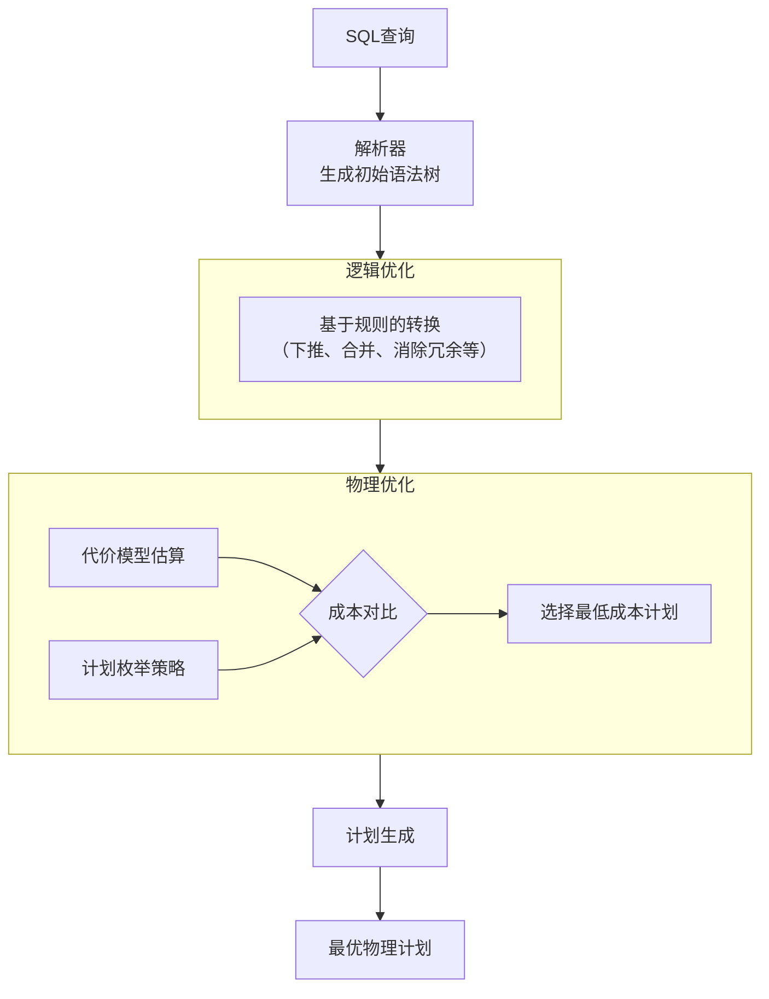

# 编写查询优化器章节

**任务**: 数据库内核实现教程
**时间**: 2026-06-05T00:56:30.689910

## **数据库内核实现教程：查询优化器**

### **1. 引言：为什么需要查询优化器？**

一个SQL查询声明式地描述了“需要什么数据”，但没有指明“如何获取数据”。数据库内核中的查询优化器（Query Optimizer）的核心使命，就是将用户提交的、逻辑正确的SQL查询，转换为一个**高效**的、可执行的物理查询计划。

如果没有优化器，数据库将被迫采用最笨拙的方式执行查询（例如，对每个选择（SELECT）条件都全表扫描），其性能在复杂查询和大规模数据下将无法接受。优化器是数据库性能的灵魂，其质量直接决定了数据库系统的实用价值。

**优化器的目标：** 基于统计信息、数据模型和可用算法，在所有可能的执行计划中，寻找一个**执行代价（通常指I/O和CPU时间）最低**的计划。

### **2. 查询优化器的架构与流程**

典型的查询优化器遵循一个清晰的处理流水线，如下图所示：



优化器工作始于一个SQL查询文本，经过**解析器**生成初始语法树，随后进入其核心优化流程。

*   **逻辑优化（Logical Optimization）：** 此阶段进行基于规则（Rule-Based）的代数转换，旨在生成语义等价但更高效的逻辑计划。核心思想是**尽可能早地处理数据**。
*   **物理优化（Physical Optimization）：** 此阶段结合具体算法与数据统计，估算每个可选逻辑操作（如连接）的不同物理实现方案（如嵌套循环、哈希连接）的代价，基于**代价模型（Cost-Based）** 选择最优组合。
*   **计划生成：** 将最终确定的物理计划树，转换为查询执行器可直接执行的指令序列。

### **3. 逻辑优化：基于规则的代数转换**

逻辑优化器维护一个规则库，对查询计划树进行反复的模式匹配与转换。常见的核心规则包括：

*   **选择下推（Predicate Pushdown）：** 将选择（`WHERE`子句）尽可能下推到数据源附近，尽早过滤掉无关数据，减少中间结果集的大小。
    *   **示例：** `SELECT * FROM R JOIN S ON R.id = S.id WHERE R.value > 10` 可优化为先对 `R` 表执行 `R.value > 10` 的过滤，再与 `S` 表连接。

*   **投影下推（Projection Pushdown）：** 将查询所需的列列表（`SELECT`子句）下推，使运算节点尽早去除不需要的列，减少数据传输和内存占用。

*   **连接消除（Join Elimination）：** 当连接条件基于外键约束且查询未引用被连接表的任何列时，可以安全地消除连接。

*   **子查询解关联（Subquery Unnesting）：** 将相关子查询（`WHERE EXISTS`, `IN (SELECT ...)`）转换为连接（`JOIN`）或半连接（`SEMI JOIN`），以利用更高效的连接算法。

*   **常量折叠（Constant Folding）：** 在编译期计算常量表达式（如 `3 + 5`），减少运行时计算。

*   **公共子表达式消除（Common Subexpression Elimination）：** 识别并重用查询中重复出现的子表达式计算结果。

逻辑优化的输出是一个**逻辑计划树**，其中的操作节点（如扫描、过滤、投影、连接）是抽象的，尚未绑定具体的算法。

### **4. 物理优化：基于代价的算法选择与计划枚举**

物理优化的核心是**代价模型**和**计划枚举算法**。

#### **4.1 代价模型（Cost Model）**

代价模型用于估算执行一个物理操作所需的时间和资源。其准确性直接决定优化结果的优劣。典型的代价因素包括：

*   **磁盘I/O成本：** 通常是主导因素。取决于数据页的读取/写入次数。需要利用数据的统计信息：
    *   **基数（Cardinality）：** 表、列中不同值的数量，或中间结果集的估算行数。
    *   **数据分布：** 直方图（Histogram）用于描述列值的分布，帮助估算选择率（Selectivity）。
    *   **选择率（Selectivity）：** 一个谓词（如 `value > 10`）过滤后剩余的行数比例。`基数 * 选择率 ≈ 结果集大小`。
*   **CPU成本：** 处理每行数据的开销（如表达式计算、哈希值计算、排序比较）。
*   **内存成本：** 使用的内存大小（如哈希表、排序缓冲区）。
*   **网络成本：** 在分布式数据库中，数据在节点间传输的开销。

**选择率估算示例：**
```sql
-- 估算 `WHERE age > 30` 的选择率
-- 假设 age 列有 100 个不同值，数据均匀分布
-- 值域为 [20, 60]
-- 大于30的值比例为 (60 - 30) / (60 - 20) = 0.75
-- 选择率 ≈ 0.75
```

#### **4.2 计划枚举（Plan Enumeration）**

对于一个复杂的多表连接查询，可能的执行计划数量随表数量呈指数增长。计划枚举的目标是高效地搜索或构建一个代价最低的计划。

*   **自底向上（Bottom-Up）枚举 - 动态规划：** 这是最经典的方法（如 System R 采用）。对于连接，它按子集的大小（连接表的数量）逐步生成最优子计划。
    *   **算法核心：** 对于包含 N 个表的连接，先计算所有单表的最优访问计划（如全表扫描或索引扫描）；然后计算所有两个表连接的最优计划，利用之前单表的结果；以此类推，直到生成包含所有 N 个表的连接计划。
    *   **示例（3表连接 R ⋈ S ⋈ T）：**
        1.  计算 `{R}`, `{S}`, `{T}` 的最优单表访问计划。
        2.  计算 `{R, S}` 的最优计划（枚举 R⋈S 和 S⋈R 及各自的物理算法）。
        3.  计算 `{R, T}`, `{S, T}` 的最优计划。
        4.  计算 `{R, S, T}` 的最优计划，可基于 `{R, S} ⋈ T` 或 `{R, T} ⋈ S` 等。

*   **自顶向下（Top-Down）枚举 - Memo 与分支定界：** 现代优化器（如 Columbia, Cascades, Volcano）采用此方法。它从最终目标开始，递归地探索实现它的子目标，并使用 **Memo 结构** 缓存已探索过的等价逻辑计划组，避免重复计算。
    *   **Memo：** 一个哈希结构，键是逻辑计划树的“签名”（即其等价类），值是该等价类下所有已知的物理实现（组计划）。当探索一个逻辑计划时，先查 Memo，如果已存在则直接复用。
    *   **分支定界：** 利用当前发现的最优计划代价（上界）来剪枝，跳过那些已经确定不可能比当前最优更好的计划空间。

### **5. 关键物理操作算法**

优化器为每个逻辑操作选择具体的物理算法。

*   **表扫描（Table Scan）：**
    *   **顺序扫描（Sequential Scan）：** 顺序读取整个表文件。适用于无合适索引或高选择性查询。
    *   **索引扫描（Index Scan）：** 使用 B+ 树等索引快速定位行。分为：
        *   **索引仅扫描（Index Only Scan）：** 查询所需列都在索引中，无需回表。
        *   **索引扫描（Index Scan）：** 通过索引定位行ID（Row ID），再回表获取数据行。

*   **连接（Join）算法：**
    *   **嵌套循环连接（Nested Loop Join）：** 对外表（驱动表）的每一行，在内表中查找匹配行。适用于内表连接条件列有索引，或外表很小时。
    *   **哈希连接（Hash Join）：** 将较小的表（构建阶段）在内存中建立哈希表，然后扫描另一个表（探测阶段），利用哈希表快速匹配。适用于等值连接且无索引的等大型连接。
    *   **排序合并连接（Sort-Merge Join）：** 将两个表按连接键排序，然后合并。适用于已排序的输入或结果集需要有序输出的情况。

*   **排序与聚合：**
    *   **内存排序/磁盘排序：** 当数据量超过内存时，使用外部归并排序。
    *   **哈希聚合：** 在内存中建立哈希表，按分组键聚合。速度快，但受内存限制。
    *   **流式聚合：** 输入已按分组键排序时，可顺序处理。

### **6. 实现一个简单的优化器框架（伪代码示例）**

下面是一个简化的、基于动态规划的连接优化器核心逻辑框架：

```python
# 假设：每个表有统计信息（行数、大小等），以及一组可用的访问路径（索引等）

def optimize_join(tables):
    # 动态规划表：dp[subset_mask] = (最佳代价, 最佳计划)
    # subset_mask 是位掩码，表示参与连接的表集合
    dp = {}
    
    # 1. 初始化单表计划
    for i, table in enumerate(tables):
        mask = 1 << i
        best_plan = optimize_single_table(table)  # 为单表选择最优访问路径
        dp[mask] = (best_plan.cost, best_plan)
    
    # 2. 逐步扩大连接规模
    for subset_size in range(2, len(tables) + 1):
        for subset in combinations_of_size(tables, subset_size):
            subset_mask = create_mask(subset)
            best_cost_for_subset = INFINITY
            best_plan_for_subset = None
            
            # 3. 将当前子集拆分为两个非空子集（左、右）
            for left_mask in all_non_empty_proper_subsets(subset_mask):
                right_mask = subset_mask ^ left_mask
                
                # 获取左右子集的最优计划
                left_cost, left_plan = dp[left_mask]
                right_cost, right_plan = dp[right_mask]
                
                # 4. 尝试所有物理连接算法
                for join_algo in [NESTED_LOOP, HASH_JOIN, SORT_MERGE]:
                    # 估算新连接的代价（需考虑输入代价、数据量、连接算法开销）
                    new_cost = estimate_join_cost(left_plan, right_plan, join_algo)
                    new_plan = create_join_plan(left_plan, right_plan, join_algo)
                    
                    if new_cost < best_cost_for_subset:
                        best_cost_for_subset = new_cost
                        best_plan_for_subset = new_plan
            
            # 5. 记录当前规模子集的最优计划
            dp[subset_mask] = (best_cost_for_subset, best_plan_for_subset)
    
    # 返回包含所有表的完整计划
    full_mask = (1 << len(tables)) - 1
    return dp[full_mask][1]

def optimize_single_table(table):
    # 根据统计信息和查询条件，选择顺序扫描、索引扫描等
    # 返回该表的最优访问计划及其代价
    pass
```

### **7. 高级主题与挑战**

*   **参数化计划（Parameterized Plan）：** 对于包含运行时常量（如用户ID）的查询，优化器可以生成“参数化”计划，避免为每个不同的参数值重新优化。
*   **自适应查询执行（Adaptive Query Execution, AQE）：** 在运行时根据中间结果的实际统计信息（如大小、分布），调整后续计划（如改变连接算法、增加分区）。
*   **机器学习在优化器中的应用：** 使用ML模型预测选择率或直接预测计划执行时间，以应对传统统计模型在复杂查询和关联数据上的估算偏差。
*   **分布式查询优化：** 在分布式数据库（如MPP、NewSQL）中，优化器还需考虑数据分区、网络传输、任务并行等维度，制定分布式执行计划。
*   **优化器的可扩展性与规则冲突：** 如何高效管理越来越多的优化规则，并解决规则之间的冲突和相互作用，是一个重要的工程和理论问题。

### **8. 总结**

查询优化器是数据库内核中最复杂、最智能的模块之一。它融合了数据库理论（关系代数、查询处理）、算法设计（动态规划、启发式搜索）、成本建模和系统实现技术。

理解优化器的原理，不仅有助于编写出对数据库更友好的SQL语句，更是深入理解数据库性能瓶颈、进行调优乃至参与数据库系统开发的基础。一个优秀的优化器，是数据在复杂查询下依然能飞速流动的无形引擎。