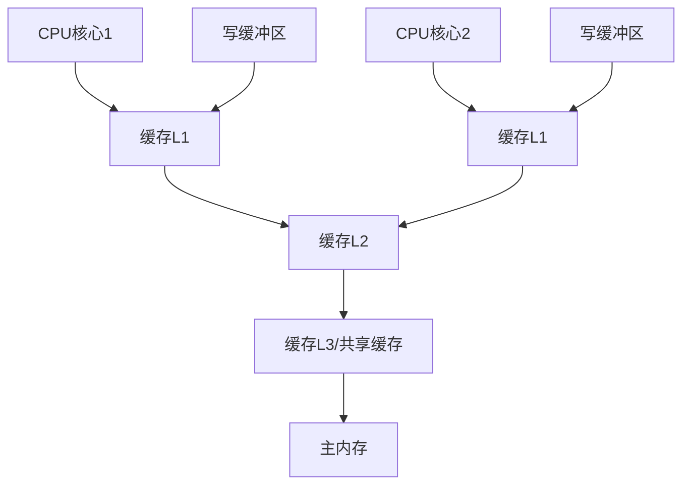
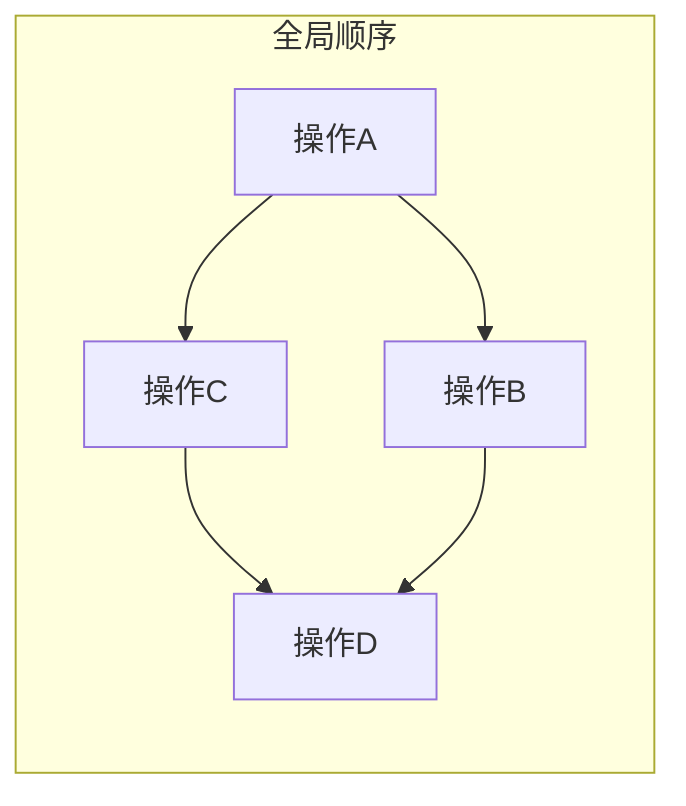
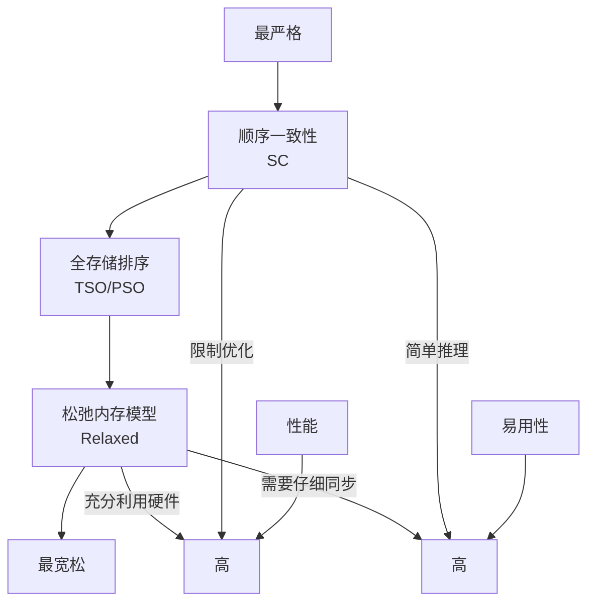
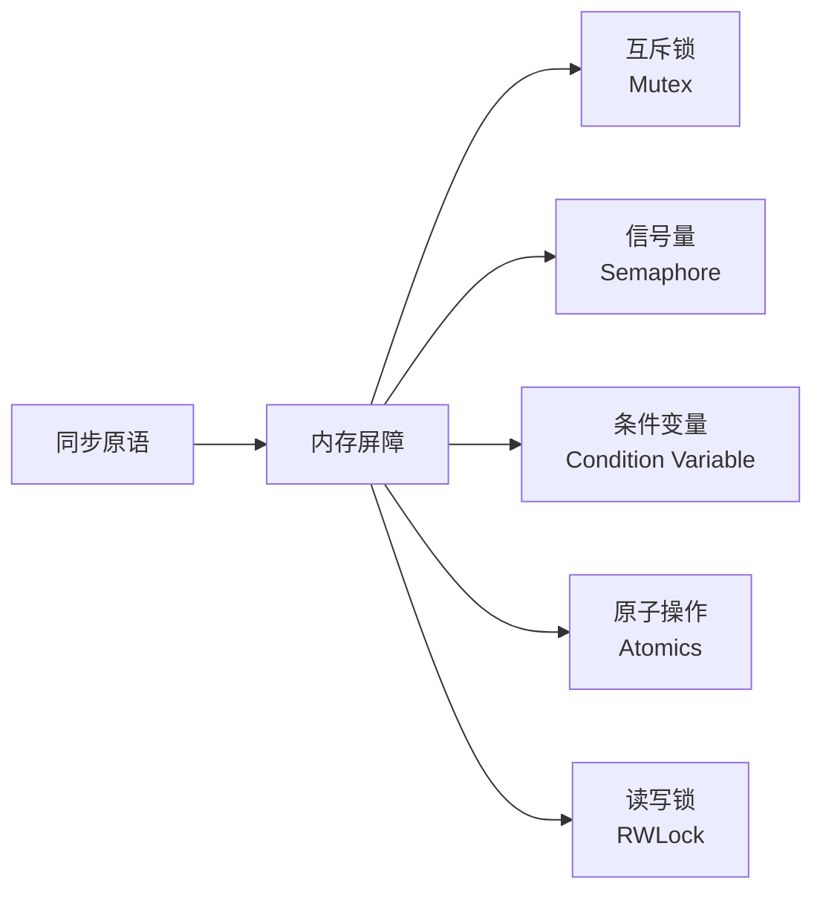
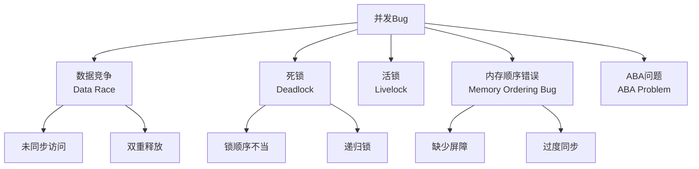

# 编写内存模型章节

**任务**: 并发编程完全指南
**时间**: 2026-06-04T23:25:23.429708

# 内存模型章节 - 并发编程完全指南

## 目录
- [1. 内存模型概述](#1-内存模型概述)
- [2. 为什么需要内存模型](#2-为什么需要内存模型)
- [3. 基本概念与术语](#3-基本概念与术语)
- [4. 内存模型类型](#4-内存模型类型)
- [5. 常见内存模型详解](#5-常见内存模型详解)
- [6. 内存屏障与同步原语](#6-内存屏障与同步原语)
- [7. 语言级内存模型实现](#7-语言级内存模型实现)
- [8. 最佳实践与陷阱](#8-最佳实践与陷阱)
- [9. 性能优化与权衡](#9-性能优化与权衡)
- [10. 现代CPU架构影响](#10-现代cpu架构影响)
- [11. 调试与验证](#11-调试与验证)
- [12. 未来发展趋势](#12-未来发展趋势)

## 1. 内存模型概述

### 1.1 定义与作用
内存模型(Memory Model)定义了程序中内存操作的可见性和顺序保证，是并发编程中最核心的概念之一。它规定了：
- 多个线程如何访问共享内存
- 内存操作何时对其他线程可见
- 操作之间的顺序关系

### 1.2 历史背景
内存模型的发展历程：
- **早期**: 硬件直接暴露给程序员
- **1990年代**: Java内存模型首次标准化
- **2000年代**: C++11引入标准化的内存模型
- **现代**: 异构计算带来新的挑战

### 1.3 内存模型的核心价值
```
并发正确性 = 内存模型理解 + 同步机制正确使用
```

## 2. 为什么需要内存模型

### 2.1 硬件层面的现实
现代计算机系统存在多个层次的内存优化：



### 2.2 指令重排的三种类型
1. **编译器重排**: 编译器优化导致的指令顺序改变
2. **CPU乱序执行**: 处理器为提高效率的乱序执行
3. **内存系统重排**: 缓存一致性协议和写缓冲区的影响

### 2.3 没有内存模型的灾难
**示例：双重检查锁定模式(DCLP)的陷阱**
```cpp
// 错误的双重检查锁定
class Singleton {
private:
    static Singleton* instance;
public:
    static Singleton* getInstance() {
        if (instance == nullptr) {  // 第一次检查
            std::lock_guard<std::mutex> lock(mutex);
            if (instance == nullptr) {  // 第二次检查
                // 分配内存
                // 构造对象
                // 赋值指针
                instance = new Singleton();  // 问题在这里!
            }
        }
        return instance;
    }
};
```

在没有内存模型的约束下，`instance = new Singleton()` 可能被重排为：
1. 分配内存
2. 赋值指针到 instance
3. 构造对象

这导致其他线程可能在对象构造完成前访问 instance。

## 3. 基本概念与术语

### 3.1 核心操作分类
| 操作类型 | 描述 | 示例 |
|---------|------|------|
| **Load/Read** | 从内存读取数据到寄存器 | `int x = *ptr;` |
| **Store/Write** | 将寄存器数据写入内存 | `*ptr = x;` |
| **Read-Modify-Write** | 原子读-修改-写操作 | `fetch_add()`, `compare_exchange()` |

### 3.2 内存排序关系
#### 3.2.1 顺序一致性(Sequential Consistency)


#### 3.2.2 happens-before 关系
```
操作A happens-before 操作B 当且仅当：
1. 程序顺序：A在B之前（同一线程内）
2. 锁规则：A在释放锁之前，B在获取锁之后
3. volatile规则：volatile写happens-before后续读
4. 线程启动规则
5. 线程终止规则
6. 中断规则
7. 终结器规则
8. 传递性
```

### 3.3 可见性与原子性
- **可见性**: 一个线程对共享变量的修改何时能被其他线程看到
- **原子性**: 操作要么全部完成，要么完全未开始

## 4. 内存模型类型

### 4.1 按严格程度分类



### 4.2 主流模型对比
| 模型 | 代表语言/硬件 | 特点 | 适用场景 |
|------|--------------|------|---------|
| **顺序一致性** | 早期Java | 最简单，但限制优化 | 教学、简单程序 |
| **全存储排序(TSO)** | x86/x64 | 写缓冲区导致Store-Load重排 | 通用计算 |
| **松弛模型** | ARM, PowerPC | 允许多种重排 | 高性能计算 |
| **C++11内存模型** | C++11+ | 可选的严格程度 | 系统编程 |
| **Java内存模型** | Java 5+ | 基于happens-before | 企业应用 |

## 5. 常见内存模型详解

### 5.1 Java内存模型(JMM)

#### 5.1.1 主内存与工作内存
```java
public class VisibilityExample {
    private boolean flag = false;  // 共享变量
    
    public void writer() {
        flag = true;  // 写操作
    }
    
    public void reader() {
        while (!flag) {  // 可能永远循环！
            // 没有内存屏障，可能读取缓存的旧值
        }
        System.out.println("Flag is true");
    }
}
```

#### 5.1.2 JMM的关键规则
1. **volatile规则**: volatile写happens-before后续读
2. **锁规则**: 解锁happens-before加锁
3. **final规则**: final字段的初始化安全

#### 5.1.3 正确的并发代码示例
```java
public class SafeSingleton {
    private static volatile SafeSingleton instance;
    
    public static SafeSingleton getInstance() {
        if (instance == null) {
            synchronized (SafeSingleton.class) {
                if (instance == null) {
                    instance = new SafeSingleton();
                }
            }
        }
        return instance;
    }
}
```

### 5.2 C++11内存模型

#### 5.2.1 六种内存顺序
```cpp
enum memory_order {
    memory_order_relaxed,  // 无顺序保证
    memory_order_consume,  // 数据依赖顺序
    memory_order_acquire,  // 获取语义
    memory_order_release,  // 释放语义
    memory_order_acq_rel,  // 获取-释放语义
    memory_order_seq_cst   // 顺序一致性
};
```

#### 5.2.2 典型使用场景
```cpp
#include <atomic>
#include <thread>

std::atomic<int> data{0};
std::atomic<bool> ready{false};

void producer() {
    data.store(42, std::memory_order_relaxed);
    ready.store(true, std::memory_order_release);  // 释放屏障
}

void consumer() {
    while (!ready.load(std::memory_order_acquire));  // 获取屏障
    int value = data.load(std::memory_order_relaxed);
    assert(value == 42);  // 保证成功
}
```

### 5.3 x86内存模型(TSO)

#### 5.3.1 x86的保证
- Store-Store 顺序保证
- Load-Load 顺序保证
- Load-Store 顺序保证
- **Store-Load 可能重排** (唯一可能重排)

#### 5.3.2 需要显式屏障的情况
```cpp
// x86上需要mfence保证Store-Load顺序
asm volatile("mfence" ::: "memory");
```

## 6. 内存屏障与同步原语

### 6.1 内存屏障类型

#### 6.1.1 全屏障(Full Barrier)
```
所有屏障之前的内存操作对屏障之后的操作可见
所有屏障之后的操作不会被重排到屏障之前

x86: mfence
ARM: dmb ish
```

#### 6.1.2 获取屏障(Acquire Barrier)
```
后续的读/写操作不会被重排到屏障之前

// 相当于: LoadLoad + LoadStore屏障
while (!flag.load(std::memory_order_acquire));
```

#### 6.1.3 释放屏障(Release Barrier)
```
之前的读/写操作不会被重排到屏障之后

// 相当于: StoreLoad + StoreStore屏障
data.store(42, std::memory_order_release);
```

### 6.2 常见同步原语的内存语义



### 6.3 原子操作的内存语义

```cpp
std::atomic<int> counter{0};

// 不同内存顺序的语义
counter.store(1, std::memory_order_relaxed);   // 无保证
counter.store(1, std::memory_order_release);   // 释放语义
counter.store(1, std::memory_order_seq_cst);   // 顺序一致性

int val = counter.load(std::memory_order_relaxed);
val = counter.load(std::memory_order_acquire);
val = counter.load(std::memory_order_seq_cst);

// 读-修改-写操作
counter.fetch_add(1, std::memory_order_acq_rel);
```

## 7. 语言级内存模型实现

### 7.1 Rust的所有权与借用系统

```rust
use std::sync::Arc;
use std::thread;

fn main() {
    let data = Arc::new(5);
    let data_clone = Arc::clone(&data);
    
    let handle = thread::spawn(move || {
        // 只能通过Arc访问数据，保证线程安全
        println!("Data: {}", *data_clone);
    });
    
    handle.join().unwrap();
}
```

### 7.2 Go的内存模型

```go
var (
    data  int
    ready bool
)

func producer() {
    data = 42
    ready = true  // 没有显式内存屏障
}

func consumer() {
    for !ready {  // 可能优化为单次检查
        runtime.Gosched()
    }
    fmt.Println(data)  // 可能输出0！
}

// 正确的同步方式
var wg sync.WaitGroup

func safeProducer() {
    data = 42
    wg.Done()  // 隐式内存屏障
}

func safeConsumer() {
    wg.Wait()  // 隐式内存屏障
    fmt.Println(data)  // 保证输出42
}
```

### 7.3 JavaScript/TypeScript的并发模型

```javascript
// Web Workers共享内存
const sharedBuffer = new SharedArrayBuffer(1024);
const sharedArray = new Int32Array(sharedBuffer);

// 主线程
Atomics.store(sharedArray, 0, 42);
Atomics.notify(sharedArray, 0, 1);  // 唤醒等待的Worker

// Worker线程
Atomics.wait(sharedArray, 0, 0);  // 等待直到值改变
const value = Atomics.load(sharedArray, 0);
```

## 8. 最佳实践与陷阱

### 8.1 常见反模式

#### 8.1.1 双重检查锁定错误
```cpp
// 错误示例（C++）
class BadSingleton {
private:
    static BadSingleton* instance;
    static std::mutex mtx;
public:
    static BadSingleton* getInstance() {
        if (instance == nullptr) {
            std::lock_guard<std::mutex> lock(mtx);
            if (instance == nullptr) {
                instance = new BadSingleton();  // 可能重排
            }
        }
        return instance;
    }
};

// 正确示例
class GoodSingleton {
private:
    static std::atomic<GoodSingleton*> instance;
    static std::mutex mtx;
public:
    static GoodSingleton* getInstance() {
        GoodSingleton* tmp = instance.load(std::memory_order_acquire);
        if (tmp == nullptr) {
            std::lock_guard<std::mutex> lock(mtx);
            tmp = instance.load(std::memory_order_relaxed);
            if (tmp == nullptr) {
                tmp = new GoodSingleton();
                instance.store(tmp, std::memory_order_release);
            }
        }
        return tmp;
    }
};
```

#### 8.1.2 无锁数据结构的陷阱
```cpp
// 简单的无锁栈（有问题的版本）
template<typename T>
class BrokenLockFreeStack {
    struct Node {
        T data;
        Node* next;
    };
    std::atomic<Node*> head;
public:
    void push(const T& data) {
        Node* newNode = new Node{data};
        Node* oldHead = head.load();
        do {
            newNode->next = oldHead;
        } while (!head.compare_exchange_weak(oldHead, newNode));
    }
    
    // 问题：存在ABA问题，且内存回收困难
};
```

### 8.2 正确的模式

#### 8.2.1 发布-订阅模式
```cpp
template<typename T>
class ThreadSafePublisher {
    struct Subscription {
        std::function<void(const T&)> callback;
        std::atomic<bool> active{true};
    };
    
    std::vector<std::shared_ptr<Subscription>> subscriptions;
    mutable std::shared_mutex mutex;
    
public:
    std::function<void()> subscribe(std::function<void(const T&)> callback) {
        auto sub = std::make_shared<Subscription>(std::move(callback));
        {
            std::unique_lock lock(mutex);
            subscriptions.push_back(sub);
        }
        
        // 返回取消订阅的函数
        return [sub] { sub->active.store(false); };
    }
    
    void publish(const T& data) {
        std::shared_lock lock(mutex);
        for (auto& sub : subscriptions) {
            if (sub->active.load(std::memory_order_acquire)) {
                sub->callback(data);
            }
        }
    }
};
```

#### 8.2.2 基于通道的并发
```rust
use std::sync::mpsc;
use std::thread;

fn main() {
    let (tx, rx) = mpsc::channel();
    
    thread::spawn(move || {
        tx.send(42).unwrap();
    });
    
    let received = rx.recv().unwrap();
    println!("Got: {}", received);
}
```

## 9. 性能优化与权衡

### 9.1 内存屏障的性能影响

| 内存屏障类型 | x86延迟 | ARM延迟 | PowerPC延迟 |
|-------------|---------|---------|------------|
| 无屏障 | 0 | 0 | 0 |
| Load屏障 | 0 | ~10 cycles | ~50 cycles |
| Store屏障 | 0 | ~10 cycles | ~30 cycles |
| 全屏障 | ~20 cycles | ~30 cycles | ~100 cycles |

### 9.2 选择合适的内存顺序

```cpp
// 场景分析与选择
class PerformanceOptimizer {
    // 1. 计数器（不需要顺序）
    std::atomic<int> counter;
    void increment() {
        counter.fetch_add(1, std::memory_order_relaxed);
    }
    
    // 2. 标志位（需要释放-获取语义）
    std::atomic<bool> ready;
    void signal() {
        ready.store(true, std::memory_order_release);
    }
    void wait() {
        while (!ready.load(std::memory_order_acquire));
    }
    
    // 3. 安全发布（需要顺序一致性）
    std::atomic<Object*> published;
    void publish(Object* obj) {
        // 初始化对象...
        published.store(obj, std::memory_order_seq_cst);
    }
};
```

### 9.3 缓存友好的并发数据结构

```cpp
// 缓存行填充避免伪共享
struct alignas(64) CacheFriendlyCounter {
    std::atomic<int64_t> value{0};
    // 填充到64字节，避免与其他计数器共享缓存行
    char padding[64 - sizeof(std::atomic<int64_t>)];
};

class StripedCounter {
    static constexpr int NUM_STRIPES = 16;
    CacheFriendlyCounter stripes[NUM_STRIPES];
    
public:
    void increment() {
        // 使用线程ID或随机数选择stripe
        int stripe = getStripeIndex();
        stripes[stripe].value.fetch_add(1, std::memory_order_relaxed);
    }
    
    int64_t getTotal() {
        int64_t total = 0;
        for (auto& stripe : stripes) {
            total += stripe.value.load(std::memory_order_relaxed);
        }
        return total;
    }
};
```

## 10. 现代CPU架构影响

### 10.1 x86/x64架构特点
```
1. TSO（全存储排序）模型
2. 仅Store-Load可能重排
3. 独立的缓存一致性协议（MESI）
4. 强一致性模型，编程相对简单
```

### 10.2 ARM架构特点
```
1. 松弛内存模型
2. 允许多种重排（Load-Load, Load-Store, Store-Store, Store-Load）
3. 需要显式内存屏障
4. 更灵活，但编程复杂
```

### 10.3 RISC-V架构
```risc-v
# RISC-V内存屏障指令
fence rw, rw    # 全屏障
fence r, rw     # 读屏障  
fence w, rw     # 写屏障

# 原子操作
amoadd.w rd, rs2, (rs1)  # 原子加
```

### 10.4 异构计算挑战
```cpp
// CPU-GPU内存一致性挑战
__global__ void gpuKernel(int* data) {
    // GPU内存模型与CPU不同
    data[threadIdx.x] = threadIdx.x;
}

int main() {
    int* d_data;
    cudaMalloc(&d_data, sizeof(int) * 256);
    
    gpuKernel<<<1, 256>>>(d_data);
    
    // 需要显式同步
    cudaDeviceSynchronize();
    
    // 从GPU复制数据回CPU
    int h_data[256];
    cudaMemcpy(h_data, d_data, sizeof(int) * 256, cudaMemcpyDeviceToHost);
    
    cudaFree(d_data);
    return 0;
}
```

## 11. 调试与验证

### 11.1 常见并发Bug类型



### 11.2 检测工具

#### 11.2.1 ThreadSanitizer (TSan)
```bash
# 编译时启用TSan
g++ -fsanitize=thread -g -O1 program.cpp -o program
# 或
clang++ -fsanitize=thread -g -O1 program.cpp -o program

# 运行程序
./program
```

#### 11.2.2 内存模型验证工具
```cpp
// 使用Relacy Race Detector示例
#include <relacy/relacy.hpp>

struct DataRaceTest : rl::test_suite<DataRaceTest, 2> {
    std::atomic<int> x;
    int y;
    
    void thread(unsigned thread_index) {
        if (thread_index == 0) {
            x.store(1, rl::memory_order_relaxed);
            y = 1;  // 可能被检测为数据竞争
        } else {
            if (x.load(rl::memory_order_relaxed)) {
                y;  // 数据竞争！
            }
        }
    }
};

int main() {
    rl::simulate<DataRaceTest>();
}
```

### 11.3 模型检查与形式验证
```tla+
---- MODULE MemoryModel ----
EXTENDS Integers, Sequences

VARIABLES memory, cache, pc

TypeOK == 
    /\ memory \in [Addresses -> Values]
    /\ cache \in [Threads -> [Addresses -> Values \cup {NULL}]]
    /\ pc \in [Threads -> {"load", "store", "execute"}]

Init == 
    /\ memory = [a \in Addresses |-> 0]
    /\ cache = [t \in Threads |-> [a \in Addresses |-> NULL]]
    /\ pc = [t \in Threads |-> "execute"]

LoadFromMemory(t, a) ==
    /\ pc[t] = "load"
    /\ cache' = [cache EXCEPT ![t][a] = memory[a]]
    /\ pc' = [pc EXCEPT ![t] = "execute"]
    /\ UNCHANGED memory

StoreToMemory(t, a, v) ==
    /\ pc[t] = "store"
    /\ memory' = [memory EXCEPT ![a] = v]
    /\ pc' = [pc EXCEPT ![t] = "execute"]
    /\ UNCHANGED cache

Next == \E t \in Threads, a \in Addresses, v \in Values:
    LoadFromMemory(t, a) \/ StoreToMemory(t, a, v)

Spec == Init /\ [][Next]_<<memory, cache, pc>>
====
```

## 12. 未来发展趋势

### 12.1 新硬件带来的挑战
1. **非易失性内存(NVM)**: 持久化内存的一致性模型
2. **CXL内存池**: 跨设备内存一致性
3. **异构统一内存**: CPU-GPU-FPGA统一内存模型

### 12.2 语言演进方向
```rust
// Rust未来可能引入更灵活的内存模型
#[memory_order(seq_cst)]
fn safe_function() {
    // 自动保证顺序一致性
}

// 或更细粒度的控制
let data = AtomicPtr::new_with_memory_order(ptr, Acquire);
```

### 12.3 形式化方法的应用
1. **自动推理工具**: 自动验证内存模型正确性
2. **机器学习辅助**: 学习最优同步策略
3. **量子内存模型**: 量子计算的并发内存模型

### 12.4 标准化进展
- C++23/26 对内存模型的改进
- Java虚拟机内存模型的持续演进
- WebAssembly线程提案的内存模型

## 总结与最佳实践清单

### 关键要点
1. **理解目标平台**: 不同CPU架构有不同的内存模型
2. **使用正确的抽象**: 优先使用语言提供的同步原语
3. **最小化同步**: 只在必要时使用强内存顺序
4. **测试与验证**: 使用工具检测内存模型问题
5. **持续学习**: 关注硬件和语言标准的演进

### 推荐阅读
1. **书籍**:《Java并发编程实战》《C++ Concurrency in Action》
2. **论文**: "The Java Memory Model" by Manson et al.
3. **标准文档**: C++标准、Java语言规范
4. **在线资源**: Herb Sutter的并发系列文章

### 下一步学习
- 无锁编程技术
- 事务内存
- 分布式内存模型
- 硬件事务内存(HTM)

---

**注意**: 本章内容保存至 `./concurrency_guide/chapters/memory_model.md`  
**最后更新**: 2024年1月  
**版本**: 1.0.0  
**作者**: 并发编程研究小组

---

*内存模型是并发编程的基石，正确理解和应用内存模型能够编写出既正确又高效的并发程序。随着硬件技术的发展，内存模型将继续演进，程序员需要不断更新知识，以应对新的挑战。*