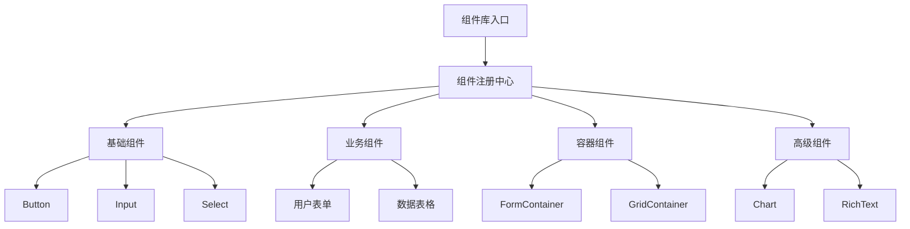

# 低代码平台

**生成时间**: 2026-06-05

---

## 完整文档.md

# 完整文档

**任务**: 低代码平台
**时间**: 2026-06-04T22:34:28.105182

# 低代码平台完整文档

## 一、简介

低代码平台（QuickBuild Low-Code Platform）是一种基于可视化和模型驱动理念的应用开发平台，旨在降低应用开发的复杂度和门槛。用户通过拖拽组件、配置逻辑和少量代码即可快速构建企业级应用。本平台适用于多种场景，包括内部管理系统、数据看板、业务流程自动化等。

### 1.1 产品定位
- **目标用户**：业务分析师、项目经理、开发人员及非技术背景的业务人员。
- **核心价值**：提升开发效率，降低维护成本，促进业务与技术融合。

### 1.2 主要特性
- 可视化界面设计器
- 丰富的预制组件库
- 模型驱动的数据管理
- 流程自动化引擎
- 多租户与权限管理
- 灵活的API与集成能力

## 二、系统架构

### 2.1 整体架构
平台采用前后端分离、微服务架构，分为以下层次：

```
客户端层 → 网关层 → 服务层 → 数据层
```

- **客户端层**：基于React的可视化设计器及运行时。
- **网关层**：负责路由、认证、限流。
- **服务层**：核心微服务，包括应用管理、组件引擎、流程服务、数据服务等。
- **数据层**：支持多种数据库（MySQL、PostgreSQL、MongoDB等）及缓存（Redis）。

### 2.2 技术栈
- **前端**：React, TypeScript, Ant Design
- **后端**：Spring Cloud, Java, Node.js（部分服务）
- **基础设施**：Docker, Kubernetes, Jenkins
- **数据库**：MySQL, PostgreSQL, Redis, MongoDB

### 2.3 部署架构
支持单机部署、集群部署及云原生部署（K8s），并提供高可用和可伸缩方案。

## 三、核心功能

### 3.1 可视化设计器
- 拖拽式界面设计
- 实时预览
- 组件属性配置
- 事件绑定

### 3.2 组件库
提供超过50种预制组件，涵盖：
- 基础组件：按钮、输入框、表格等
- 业务组件：审批流、报表、图表
- 高级组件：地图、富文本编辑器

### 3.3 数据模型
- 可视化建模
- 支持关联关系、索引、校验规则
- 自动生成CRUD接口

### 3.4 工作流引擎
- BPMN 2.0标准
- 支持顺序、并行、条件分支
- 与表单、数据模型集成

### 3.5 权限管理
- 基于角色的访问控制（RBAC）
- 数据权限、功能权限
- 多租户隔离

### 3.6 API与集成
- 自动生成RESTful API
- Webhook支持
- 第三方系统集成（如钉钉、企业微信）

## 四、用户指南

### 4.1 快速入门
1. **登录平台**：使用管理员账号登录。
2. **创建应用**：选择模板或空白应用。
3. **设计界面**：拖拽组件到画布，配置样式和属性。
4. **绑定数据**：连接数据源，设置字段映射。
5. **发布应用**：一键发布，并通过链接访问。

### 4.2 创建应用
- 步骤1：进入“应用管理”，点击“新建应用”。
- 步骤2：填写应用名称、描述，选择模板（可选）。
- 步骤3：进入设计器开始设计。

### 4.3 使用组件
- 从左侧组件面板拖拽组件到画布。
- 点击组件，在右侧属性面板配置。
- 支持组件嵌套和布局调整。

### 4.4 配置数据源
1. 进入“数据源管理”，添加新数据源。
2. 填写连接信息（主机、端口、数据库名、账号等）。
3. 测试连接并保存。
4. 在数据模型中选择数据源。

### 4.5 设置权限
1. 在“角色管理”中创建角色（如管理员、普通用户）。
2. 为角色分配菜单权限和数据权限。
3. 在“用户管理”中为用户分配角色。

### 4.6 发布应用
1. 点击设计器右上角的“发布”按钮。
2. 选择版本号、发布环境（开发、测试、生产）。
3. 确认发布后，生成访问链接和二维码。

## 五、开发指南

### 5.1 自定义组件开发
#### 5.1.1 组件规范
- 基于React组件。
- 导出标准属性配置。
- 支持事件触发。

#### 5.1.2 开发步骤
1. 创建组件目录结构：
```
MyComponent/
  index.tsx
  meta.json
  style.less
```
2. 实现组件逻辑（index.tsx）。
3. 定义组件元数据（meta.json），包括属性、事件、样式配置。
4. 上传组件到平台。

#### 5.1.3 示例代码
```tsx
// index.tsx
import React from 'react';

interface MyComponentProps {
  text: string;
  onClick?: () => void;
}

const MyComponent: React.FC<MyComponentProps> = ({ text, onClick }) => {
  return <button onClick={onClick}>{text}</button>;
};

export default MyComponent;
```

```json
// meta.json
{
  "name": "MyComponent",
  "label": "自定义按钮",
  "version": "1.0.0",
  "props": [
    {
      "name": "text",
      "label": "按钮文字",
      "type": "string",
      "default": "点击"
    }
  ],
  "events": [
    {
      "name": "onClick",
      "label": "点击事件"
    }
  ]
}
```

### 5.2 扩展功能
平台支持通过插件机制扩展功能，如：
- 数据源插件：连接新数据库。
- 组件插件：新增业务组件。
- 流程插件：自定义流程节点。

开发插件需实现平台提供的接口，并遵循插件开发规范。

### 5.3 API参考
#### 5.3.1 应用管理API
- `POST /api/apps`：创建应用
- `GET /api/apps/{id}`：获取应用详情
- `PUT /api/apps/{id}`：更新应用
- `DELETE /api/apps/{id}`：删除应用

#### 5.3.2 数据API
- `POST /api/data/{modelId}`：创建记录
- `GET /api/data/{modelId}`：查询记录（支持分页、过滤）
- `PUT /api/data/{modelId}/{recordId}`：更新记录
- `DELETE /api/data/{modelId}/{recordId}`：删除记录

详细API文档请参考平台内置的Swagger文档（访问路径：`/swagger-ui.html`）。

## 六、部署指南

### 6.1 环境要求
- **操作系统**：CentOS 7+ / Ubuntu 18.04+
- **Java**：JDK 1.8
- **Node.js**：v12+
- **数据库**：MySQL 5.7+ 或 PostgreSQL 10+
- **内存**：至少8GB RAM
- **磁盘**：至少50GB可用空间

### 6.2 安装步骤
#### 6.2.1 Docker部署（推荐）
1. 安装Docker和Docker Compose。
2. 下载平台提供的`docker-compose.yml`。
3. 修改配置文件（数据库连接、端口等）。
4. 执行命令：`docker-compose up -d`

#### 6.2.2 手动部署
1. 下载平台二进制包。
2. 配置环境变量（参考`.env.example`）。
3. 初始化数据库：执行SQL脚本。
4. 启动服务：`./start.sh`

### 6.3 配置选项
- **应用端口**：默认8080（可通过环境变量`SERVER_PORT`修改）
- **数据库配置**：`DB_HOST`, `DB_PORT`, `DB_NAME`, `DB_USER`, `DB_PASSWORD`
- **缓存配置**：`REDIS_HOST`, `REDIS_PORT`
- **文件存储**：支持本地存储、OSS、S3（通过`STORAGE_TYPE`配置）

## 七、维护与支持

### 7.1 监控
平台内置健康检查接口：`/actuator/health`，可集成Prometheus和Grafana进行监控。

### 7.2 备份与恢复
- **数据备份**：定期备份数据库和文件存储。
- **恢复步骤**：停止服务 → 恢复数据库 → 恢复文件 → 重启服务。

### 7.3 升级
- 低版本升级请按照升级指南操作，通常包括备份、停止服务、替换二进制包、执行迁移脚本、重启。

### 7.4 技术支持
- 官方文档：[https://docs.quickbuild.io](https://docs.quickbuild.io)
- 社区论坛：[https://community.quickbuild.io](https://community.quickbuild.io)
- 邮件支持：support@quickbuild.io

## 八、常见问题（FAQ）

### 8.1 如何重置管理员密码？
进入数据库，执行SQL：`UPDATE users SET password='新密码哈希' WHERE username='admin';`

### 8.2 应用无法发布怎么办？
1. 检查网络连接。
2. 查看发布日志（位于`/logs/publish.log`）。
3. 确保数据库连接正常。

### 8.3 如何自定义登录页面？
在“主题管理”中上传自定义HTML/CSS，或通过覆盖默认主题实现。

## 九、版本历史

### v1.0.0 (2023-01-01)
- 初始发布，支持基础应用构建。

### v1.1.0 (2023-03-15)
- 新增工作流引擎。
- 优化设计器性能。

### v1.2.0 (2023-06-20)
- 支持多租户。
- 新增数据权限控制。

（后续版本持续更新）

---

## 文档保存说明

本文档为低代码平台（QuickBuild Low-Code Platform）的完整文档，涵盖了平台的核心概念、功能、使用指南和开发部署等内容。为了便于管理和查阅，建议将文档保存到以下目录结构中：

```
low-code-platform-docs/
├── README.md                 # 文档主页
├── architecture.md           # 系统架构
├── user-guide/               # 用户指南
│   ├── quickstart.md
│   ├── creating-apps.md
│   ├── using-components.md
│   ├── data-sources.md
│   ├── permissions.md
│   └── publishing.md
├── developer-guide/          # 开发指南
│   ├── custom-components.md
│   ├── extending.md
│   └── api-reference.md
├── deployment-guide/         # 部署指南
│   ├── requirements.md
│   ├── installation.md
│   └── configuration.md
├── maintenance.md            # 维护与支持
├── faq.md                    # 常见问题
└── changelog.md              # 版本历史
```

您可以将上述每个部分的内容分别保存到对应的Markdown文件中。如果需要单文件版本，也可以将所有内容合并到一个`documentation.md`文件中。

由于平台特性，文档可能会随版本更新而更新，请定期查阅官方文档以获取最新信息。

---

## 实现代码生成.md

# 实现代码生成

**任务**: 低代码平台
**时间**: 2026-06-04T22:33:27.188983

# 低代码平台 - 代码生成模块实现

## 1. 项目概述

### 1.1 背景
低代码平台旨在通过可视化配置快速生成应用程序，代码生成是其核心功能。本模块负责将用户的可视化配置转换为可执行的应用程序代码。

### 1.2 设计目标
- 支持多种前端框架（Vue、React、Angular）
- 支持多种后端技术栈（Node.js、Java、Python）
- 可扩展的模板系统
- 完整的代码生成生命周期管理

## 2. 架构设计

### 2.1 系统架构

```
┌─────────────────┐    ┌─────────────────┐    ┌─────────────────┐
│   可视化配置层    │    │   配置解析层      │    │   代码生成层     │
│   (用户界面)     │────▶│   (JSON/YAML)   │────▶│   (AST处理)     │
└─────────────────┘    └─────────────────┘    └─────────────────┘
                                                         │
         ┌──────────────────────────────────────────────┘
         ▼
┌─────────────────┐    ┌─────────────────┐    ┌─────────────────┐
│   模板引擎层     │    │   代码优化层      │    │   输出管理层     │
│   (Handlebars)  │────▶│   (ESLint/Prettier)│────▶│   (文件系统)    │
└─────────────────┘    └─────────────────┘    └─────────────────┘
```

### 2.2 技术选型

```javascript
// 技术栈配置
const techStack = {
  // 前端框架
  frontend: ['Vue3', 'React18', 'Angular16'],
  
  // 后端框架
  backend: ['Express', 'SpringBoot', 'Django'],
  
  // 数据库
  database: ['MySQL', 'PostgreSQL', 'MongoDB'],
  
  // 代码生成工具
  generators: {
    template: 'Handlebars',      // 模板引擎
    ast: '@babel/parser',        // AST解析器
    formatter: 'prettier',       // 代码格式化
    validator: 'eslint'          // 代码校验
  },
  
  // 构建工具
  build: ['Webpack', 'Vite', 'SpringMaven', 'Gradle']
};
```

## 3. 核心模块实现

### 3.1 项目结构

```
low-code-generator/
├── src/
│   ├── core/                    # 核心模块
│   │   ├── generator/          # 代码生成器
│   │   │   ├── frontend/       # 前端代码生成
│   │   │   ├── backend/        # 后端代码生成
│   │   │   └── database/       # 数据库脚本生成
│   │   ├── template/           # 模板系统
│   │   │   ├── engine/         # 模板引擎
│   │   │   └── templates/      # 预设模板
│   │   └── transformer/        # 配置转换器
│   ├── config/                 # 配置管理
│   ├── utils/                  # 工具函数
│   └── index.js               # 主入口
├── templates/                  # 模板文件
│   ├── vue/
│   ├── react/
│   ├── angular/
│   ├── express/
│   ├── springboot/
│   └── django/
├── examples/                   # 示例配置
├── output/                     # 输出目录
└── package.json
```

### 3.2 配置解析模块

```javascript
// src/core/transformer/configParser.js
class ConfigParser {
  constructor() {
    this.validSchemas = {
      page: 'PageConfig',
      component: 'ComponentConfig',
      api: 'APIConfig',
      model: 'ModelConfig'
    };
  }

  /**
   * 解析页面配置
   * @param {Object} config - 用户配置对象
   * @returns {Object} - 解析后的配置结构
   */
  parsePageConfig(config) {
    const validatedConfig = this.validateConfig(config, 'page');
    
    return {
      id: validatedConfig.id,
      name: validatedConfig.name,
      route: validatedConfig.route,
      components: this.parseComponents(validatedConfig.components),
      styles: validatedConfig.styles || {},
      dataSources: this.parseDataSources(validatedConfig.dataSources)
    };
  }

  /**
   * 解析组件配置
   */
  parseComponents(components) {
    return components.map(comp => ({
      type: comp.type,
      props: comp.props,
      events: comp.events,
      slots: comp.slots || [],
      children: comp.children ? this.parseComponents(comp.children) : []
    }));
  }

  /**
   * 验证配置结构
   */
  validateConfig(config, schemaType) {
    const schema = this.getSchema(schemaType);
    const { error, value } = schema.validate(config, { abortEarly: false });
    
    if (error) {
      throw new Error(`配置验证失败: ${error.details.map(d => d.message).join(', ')}`);
    }
    
    return value;
  }

  /**
   * 转换配置为中间表示格式 (IR)
   */
  transformToIR(config) {
    const ir = {
      metadata: {
        version: '1.0',
        generatedAt: new Date().toISOString(),
        generatorVersion: '2.0.0'
      },
      frontend: this.transformFrontendConfig(config.frontend),
      backend: this.transformBackendConfig(config.backend),
      database: this.transformDatabaseConfig(config.database)
    };

    return ir;
  }
}

module.exports = ConfigParser;
```

### 3.3 代码生成器核心

```javascript
// src/core/generator/codeGenerator.js
const fs = require('fs-extra');
const path = require('path');
const prettier = require('prettier');
const ESLint = require('eslint').ESLint;

class CodeGenerator {
  constructor(options = {}) {
    this.outputDir = options.outputDir || './output';
    this.templateEngine = options.templateEngine || 'handlebars';
    this.frameworks = options.frameworks || ['vue', 'express'];
    this.version = '2.0.0';
  }

  /**
   * 主生成入口
   */
  async generate(config) {
    try {
      console.log('🚀 开始代码生成...');
      console.log(`📁 输出目录: ${this.outputDir}`);
      
      // 1. 解析配置
      const parsedConfig = this.parseConfig(config);
      
      // 2. 准备输出目录
      await this.prepareOutputDirectory();
      
      // 3. 生成各层代码
      const generatedCode = await this.generateAllLayers(parsedConfig);
      
      // 4. 代码格式化和校验
      const formattedCode = await this.formatAndLint(generatedCode);
      
      // 5. 写入文件
      await this.writeFiles(formattedCode);
      
      // 6. 生成构建脚本
      await this.generateBuildScripts(parsedConfig);
      
      // 7. 生成文档
      await this.generateDocumentation(parsedConfig);
      
      console.log('✅ 代码生成完成！');
      return {
        success: true,
        outputDir: this.outputDir,
        filesGenerated: Object.keys(formattedCode).length,
        timestamp: new Date().toISOString()
      };
      
    } catch (error) {
      console.error('❌ 代码生成失败:', error.message);
      throw error;
    }
  }

  /**
   * 生成前端代码
   */
  async generateFrontend(config, framework) {
    const frontendGenerator = this.getFrontendGenerator(framework);
    
    return frontendGenerator.generate({
      pages: config.pages,
      components: config.components,
      routing: config.routing,
      stateManagement: config.stateManagement,
      styles: config.styles
    });
  }

  /**
   * 生成Vue组件
   */
  generateVueComponent(componentConfig) {
    const template = `
<template>
  <div class="${componentConfig.className}">
    ${this.generateTemplateContent(componentConfig)}
  </div>
</template>

<script>
${this.generateScriptContent(componentConfig)}
</script>

<style scoped>
${this.generateStyleContent(componentConfig)}
</style>`;

    return template;
  }

  /**
   * 生成React组件
   */
  generateReactComponent(componentConfig) {
    const jsxTemplate = `
import React, { useState, useEffect } from 'react';
import './styles.css';

const ${componentConfig.name} = (${this.generatePropsString(componentConfig.props)}) => {
  ${this.generateStateHooks(componentConfig)}
  ${this.generateEffectHooks(componentConfig)}
  
  return (
    <div className="${componentConfig.className}">
      ${this.generateJSXContent(componentConfig)}
    </div>
  );
};

export default ${componentConfig.name};`;

    return jsxTemplate;
  }

  /**
   * 生成后端代码
   */
  async generateBackend(config, framework) {
    const backendGenerator = this.getBackendGenerator(framework);
    
    return backendGenerator.generate({
      models: config.models,
      controllers: config.controllers,
      services: config.services,
      middleware: config.middleware,
      routes: config.routes
    });
  }

  /**
   * 生成Express路由
   */
  generateExpressRoutes(routesConfig) {
    let code = `const express = require('express');\n`;
    code += `const router = express.Router();\n\n`;
    
    routesConfig.forEach(route => {
      code += `// ${route.description}\n`;
      code += `router.${route.method}('${route.path}', `;
      code += `${route.middleware ? route.middleware.join(', ') + ', ' : ''}`;
      code += `${route.handler});\n\n`;
    });
    
    code += `module.exports = router;`;
    return code;
  }

  /**
   * 生成数据库模型
   */
  generateModelSchema(modelConfig, dbType) {
    const generators = {
      sequelize: this.generateSequelizeModel.bind(this),
      mongoose: this.generateMongooseModel.bind(this),
      prisma: this.generatePrismaModel.bind(this)
    };
    
    return generators[dbType](modelConfig);
  }

  /**
   * 生成API文档
   */
  async generateAPIDocumentation(apiConfig) {
    const docTemplate = `
# ${apiConfig.title} API 文档
版本: ${apiConfig.version}

## 基础信息
- Base URL: ${apiConfig.baseUrl}
- 认证方式: ${apiConfig.authType}

## 接口列表
${apiConfig.endpoints.map(endpoint => `
### ${endpoint.name}
- 描述: ${endpoint.description}
- 方法: ${endpoint.method}
- 路径: ${endpoint.path}
- 请求参数: 
${JSON.stringify(endpoint.params, null, 2)}
- 响应格式:
${JSON.stringify(endpoint.response, null, 2)}
`).join('\n')}

## 错误码说明
${apiConfig.errorCodes.map(err => `
- ${err.code}: ${err.message}
`).join('\n')}
`;
    
    return docTemplate;
  }

  /**
   * 格式化和校验代码
   */
  async formatAndLint(generatedCode) {
    const formatted = {};
    
    for (const [filePath, content] of Object.entries(generatedCode)) {
      try {
        // 使用Prettier格式化
        const prettierConfig = await this.getPrettierConfig(filePath);
        let formattedContent = await prettier.format(content, {
          ...prettierConfig,
          parser: this.getParserForFile(filePath)
        });
        
        // 使用ESLint校验JavaScript/TypeScript文件
        if (filePath.endsWith('.js') || filePath.endsWith('.ts')) {
          formattedContent = await this.lintCode(formattedContent, filePath);
        }
        
        formatted[filePath] = formattedContent;
      } catch (error) {
        console.warn(`⚠️  格式化文件 ${filePath} 时出错:`, error.message);
        formatted[filePath] = content; // 使用原始内容
      }
    }
    
    return formatted;
  }

  /**
   * 写入文件到磁盘
   */
  async writeFiles(generatedCode) {
    for (const [filePath, content] of Object.entries(generatedCode)) {
      const fullPath = path.join(this.outputDir, filePath);
      await fs.ensureDir(path.dirname(fullPath));
      await fs.writeFile(fullPath, content, 'utf8');
      console.log(`📝 生成文件: ${filePath}`);
    }
  }
}

module.exports = CodeGenerator;
```

### 3.4 前端代码生成器

```javascript
// src/core/generator/frontend/vueGenerator.js
class VueGenerator {
  constructor(config) {
    this.config = config;
    this.version = '3.0';
  }

  /**
   * 生成Vue项目结构
   */
  async generate(projectConfig) {
    const files = {};
    
    // 生成package.json
    files['package.json'] = this.generatePackageJson(projectConfig);
    
    // 生成主入口文件
    files['src/main.js'] = this.generateMainEntry();
    
    // 生成路由配置
    files['src/router/index.js'] = this.generateRouter(projectConfig.routing);
    
    // 生成状态管理
    files['src/store/index.js'] = this.generateStore(projectConfig.stateManagement);
    
    // 生成组件
    for (const component of projectConfig.components) {
      const componentPath = `src/components/${component.name}.vue`;
      files[componentPath] = this.generateComponent(component);
    }
    
    // 生成页面
    for (const page of projectConfig.pages) {
      const pagePath = `src/views/${page.name}.vue`;
      files[pagePath] = this.generatePage(page);
    }
    
    // 生成API服务
    files['src/api/index.js'] = this.generateApiService(projectConfig.apiEndpoints);
    
    // 生成工具函数
    files['src/utils/index.js'] = this.generateUtils();
    
    // 生成样式文件
    files['src/assets/styles/main.css'] = this.generateMainStyles(projectConfig.theme);
    
    // 生成构建配置
    files['vue.config.js'] = this.generateVueConfig(projectConfig.buildConfig);
    files['vite.config.js'] = this.generateViteConfig(projectConfig.buildConfig);
    
    // 生成测试文件
    files['tests/unit/example.spec.js'] = this.generateTestExample();
    
    return files;
  }

  /**
   * 生成Vue单文件组件
   */
  generateComponent(componentConfig) {
    const template = `
<template>
  <div class="${this.toKebabCase(componentConfig.name)}" :class="classes">
    ${this.generateComponentTemplate(componentConfig)}
  </div>
</template>

<script>
export default {
  name: '${componentConfig.name}',
  
  props: {
    ${this.generateProps(componentConfig.props)}
  },
  
  data() {
    return {
      ${this.generateData(componentConfig.data)}
    };
  },
  
  computed: {
    ${this.generateComputed(componentConfig.computed)}
    classes() {
      return {
        '${this.toKebabCase(componentConfig.name)}--active': this.isActive,
        ...this.themeClasses
      };
    }
  },
  
  methods: {
    ${this.generateMethods(componentConfig.methods)}
  },
  
  watch: {
    ${this.generateWatchers(componentConfig.watchers)}
  },
  
  mounted() {
    ${this.generateMounted(componentConfig.lifecycle?.mounted)}
  },
  
  emits: [${componentConfig.emits?.map(e => `'${e}'`).join(', ') || ''}]
};
</script>

<style scoped lang="scss">
.${this.toKebabCase(componentConfig.name)} {
  ${this.generateComponentStyles(componentConfig.styles)}
  
  &__header {
    // BEM风格样式
  }
  
  &__content {
    // 内容区域样式
  }
}
</style>`;

    return template;
  }

  /**
   * 生成Vue 3 Composition API组件
   */
  generateCompositionAPIComponent(config) {
    return `
<template>
  <div class="${config.name}">
    <!-- 模板内容 -->
  </div>
</template>

<script setup>
import { ref, computed, onMounted } from 'vue';
import { useRoute, useRouter } from 'vue-router';
import { useStore } from 'vuex';

// Props定义
const props = defineProps({
  ${this.generateCompositionProps(config.props)}
});

// Emits定义
const emit = defineEmits(['update:modelValue', 'change']);

// 路由和状态
const route = useRoute();
const router = useRouter();
const store = useStore();

// 响应式数据
const ${this.generateCompositionRefs(config.data)}

// 计算属性
const ${this.generateCompositionComputed(config.computed)}

// 方法
const ${this.generateCompositionMethods(config.methods)}

// 生命周期
onMounted(() => {
  ${config.lifecycle?.mounted || ''}
});

// 暴露给父组件的方法
defineExpose({
  ${config.exposedMethods?.join(',\n  ') || ''}
});
</script>

<style scoped>
${config.styles || ''}
</style>`;
  }
}

module.exports = VueGenerator;
```

### 3.5 后端代码生成器

```javascript
// src/core/generator/backend/expressGenerator.js
const Handlebars = require('handlebars');

class ExpressGenerator {
  constructor() {
    this.templates = this.loadTemplates();
  }

  /**
   * 生成Express项目
   */
  async generate(projectConfig) {
    const files = {};
    
    // 项目基础结构
    files['package.json'] = this.generatePackageJson(projectConfig);
    files['app.js'] = this.generateMainApp(projectConfig);
    files['config/config.js'] = this.generateConfig(projectConfig.config);
    
    // 路由文件
    files['routes/index.js'] = this.generateRouteIndex();
    for (const route of projectConfig.routes) {
      files[`routes/${route.name}.js`] = this.generateRoute(route);
    }
    
    // 控制器
    for (const controller of projectConfig.controllers) {
      files[`controllers/${controller.name}Controller.js`] = 
        this.generateController(controller);
    }
    
    // 服务层
    for (const service of projectConfig.services) {
      files[`services/${service.name}Service.js`] = 
        this.generateService(service);
    }
    
    // 模型层
    for (const model of projectConfig.models) {
      files[`models/${model.name}.js`] = this.generateModel(model);
      files[`migrations/${this.generateMigrationName(model.name)}.js`] = 
        this.generateMigration(model);
    }
    
    // 中间件
    files['middleware/index.js'] = this.generateMiddlewareIndex(projectConfig.middleware);
    for (const middleware of projectConfig.middleware) {
      files[`middleware/${middleware.name}.js`] = this.generateMiddleware(middleware);
    }
    
    // 工具函数
    files['utils/index.js'] = this.generateUtils();
    files['utils/response.js'] = this.generateResponseUtil();
    files['utils/validator.js'] = this.generateValidatorUtil();
    
    // 错误处理
    files['errors/AppError.js'] = this.generateAppError();
    files['middleware/errorHandler.js'] = this.generateErrorHandler();
    
    // 测试文件
    files['tests/unit/controller.test.js'] = this.generateControllerTest(projectConfig.controllers[0]);
    
    // 文档
    files['docs/API.md'] = this.generateAPIDocumentation(projectConfig.apiDocs);
    
    // 环境配置
    files['.env.example'] = this.generateEnvExample(projectConfig.env);
    files['.env.development'] = this.generateEnvDevelopment(projectConfig.env);
    files['.env.production'] = this.generateEnvProduction(projectConfig.env);
    
    // Docker配置
    files['Dockerfile'] = this.generateDockerfile(projectConfig.docker);
    files['docker-compose.yml'] = this.generateDockerCompose(projectConfig.docker);
    
    // CI/CD配置
    files['.github/workflows/ci.yml'] = this.generateGitHubActions(projectConfig.cicd);
    
    return files;
  }

  /**
   * 生成控制器代码
   */
  generateController(controllerConfig) {
    const template = this.templates.controller;
    return Handlebars.compile(template)({
      name: controllerConfig.name,
      serviceName: `${controllerConfig.name}Service`,
      methods: controllerConfig.methods.map(method => ({
        name: method.name,
        description: method.description,
        params: method.params,
        returnType: method.returnType
      }))
    });
  }

  /**
   * 生成服务层代码
   */
  generateService(serviceConfig) {
    const template = this.templates.service;
    return Handlebars.compile(template)({
      name: serviceConfig.name,
      repositoryName: `${serviceConfig.name}Repository`,
      methods: serviceConfig.methods,
      dependencies: serviceConfig.dependencies || []
    });
  }

  /**
   * 生成数据模型
   */
  generateModel(modelConfig) {
    const template = this.templates.model;
    return Handlebars.compile(template)({
      name: modelConfig.name,
      tableName: modelConfig.tableName,
      fields: modelConfig.fields.map(field => ({
        name: field.name,
        type: this.mapFieldType(field.type),
        allowNull: field.allowNull,
        primaryKey: field.primaryKey,
        unique: field.unique
      })),
      associations: modelConfig.associations || [],
      hooks: modelConfig.hooks || {}
    });
  }

  /**
   * 生成API路由
   */
  generateRoute(routeConfig) {
    const template = this.templates.route;
    return Handlebars.compile(template)({
      name: routeConfig.name,
      basePath: routeConfig.path,
      middlewares: routeConfig.middlewares,
      endpoints: routeConfig.endpoints.map(endpoint => ({
        method: endpoint.method.toLowerCase(),
        path: endpoint.path,
        controllerMethod: `${routeConfig.name}Controller.${endpoint.handler}`,
        validation: endpoint.validation,
        auth: endpoint.auth
      }))
    });
  }
}

module.exports = ExpressGenerator;
```

### 3.6 模板管理系统

```javascript
// src/core/template/templateManager.js
const fs = require('fs-extra');
const path = require('path');
const Handlebars = require('handlebars');

class TemplateManager {
  constructor(templatesDir = './templates') {
    this.templatesDir = templatesDir;
    this.cache = new Map();
    this.helpers = new Map();
    this.partials = new Map();
    
    this.init();
  }

  init() {
    // 注册自定义Helpers
    this.registerHelpers();
    
    // 加载所有模板
    this.loadAllTemplates();
  }

  /**
   * 注册Handlebars辅助函数
   */
  registerHelpers() {
    // 字符串转换
    Handlebars.registerHelper('camelCase', (str) => {
      return str.replace(/-([a-z])/g, (g) => g[1].toUpperCase());
    });
    
    Handlebars.registerHelper('pascalCase', (str) => {
      return str.charAt(0).toUpperCase() + str.slice(1);
    });
    
    Handlebars.registerHelper('kebabCase', (str) => {
      return str.replace(/([a-z0-9])([A-Z])/g, '$1-$2').toLowerCase();
    });
    
    // 条件判断
    Handlebars.registerHelper('ifEqual', (a, b, options) => {
      return a === b ? options.fn(this) : options.inverse(this);
    });
    
    // 循环辅助
    Handlebars.registerHelper('eachSorted', (context, options) => {
      const sorted = Object.keys(context).sort();
      let result = '';
      sorted.forEach(key => {
        result += options.fn({ key, value: context[key] });
      });
      return result;
    });
    
    // 代码缩进
    Handlebars.registerHelper('indent', (text, spaces) => {
      const indent = ' '.repeat(spaces);
      return text.split('\n').map(line => indent + line).join('\n');
    });
    
    // 生成唯一ID
    Handlebars.registerHelper('generateId', () => {
      return 'id_' + Math.random().toString(36).substr(2, 9);
    });
  }

  /**
   * 加载所有模板文件
   */
  async loadAllTemplates() {
    try {
      const templateFiles = await this.findTemplateFiles(this.templatesDir);
      
      for (const templateFile of templateFiles) {
        const relativePath = path.relative(this.templatesDir, templateFile);
        const templateContent = await fs.readFile(templateFile, 'utf8');
        
        // 根据文件类型处理模板
        if (relativePath.includes('/partials/')) {
          // 加载为 partial
          const partialName = path.basename(relativePath, '.hbs');
          this.partials.set(partialName, templateContent);
          Handlebars.registerPartial(partialName, templateContent);
        } else {
          // 加载为普通模板
          this.cache.set(relativePath, Handlebars.compile(templateContent));
        }
      }
      
      console.log(`✅ 已加载 ${this.cache.size} 个模板和 ${this.partials.size} 个部分`);
    } catch (error) {
      console.error('加载模板失败:', error);
    }
  }

  /**
   * 渲染模板
   */
  render(templateName, data, options = {}) {
    const template = this.cache.get(templateName);
    
    if (!template) {
      throw new Error(`模板 ${templateName} 不存在`);
    }
    
    // 合并默认数据和传入数据
    const mergedData = {
      ...this.getDefaultData(),
      ...data,
      _options: options
    };
    
    try {
      return template(mergedData, {
        helpers: Object.fromEntries(this.helpers),
        partials: Object.fromEntries(this.partials)
      });
    } catch (error) {
      console.error(`渲染模板 ${templateName} 失败:`, error);
      throw error;
    }
  }

  /**
   * 渲染多模板并合并结果
   */
  async renderMultiple(templates, data) {
    const results = {};
    
    for (const [name, templatePath] of Object.entries(templates)) {
      try {
        results[name] = await this.render(templatePath, data);
      } catch (error) {
        console.error(`渲染模板 ${name} 失败:`, error);
        results[name] = `// 渲染模板 ${name} 失败\n/* ${error.message} */`;
      }
    }
    
    return results;
  }

  /**
   * 获取默认数据（用于模板渲染）
   */
  getDefaultData() {
    return {
      _version: '2.0.0',
      _timestamp: new Date().toISOString(),
      _year: new Date().getFullYear(),
      _author: 'Low-Code Platform Generator',
      _license: 'MIT'
    };
  }
}

module.exports = TemplateManager;
```

## 4. 配置示例

### 4.1 完整项目配置示例

```json
// examples/project-config.json
{
  "project": {
    "name": "CRM系统",
    "description": "客户关系管理系统",
    "version": "1.0.0",
    "author": "开发团队"
  },
  
  "frontend": {
    "framework": "vue",
    "version": "3.0",
    "uiLibrary": "element-plus",
    "buildTool": "vite",
    "modules": ["router", "vuex", "axios", "i18n"],
    
    "pages": [
      {
        "name": "Dashboard",
        "path": "/dashboard",
        "component": "DashboardPage",
        "layout": "MainLayout",
        "auth": true
      },
      {
        "name": "CustomerList",
        "path": "/customers",
        "component": "CustomerListPage",
        "layout": "MainLayout",
        "auth": true
      }
    ],
    
    "components": [
      {
        "name": "CustomerCard",
        "type": "functional",
        "props": ["customer", "showActions"],
        "events": ["click", "edit", "delete"],
        "styles": {
          "width": "100%",
          "padding": "20px"
        }
      }
    ],
    
    "apiEndpoints": [
      {
        "name": "getCustomers",
        "method": "GET",
        "url": "/api/customers",
        "params": ["page", "limit", "search"],
        "responseType": "CustomerListResponse"
      }
    ]
  },
  
  "backend": {
    "framework": "express",
    "version": "4.18",
    "database": "postgresql",
    "orm": "sequelize",
    "authentication": "jwt",
    
    "models": [
      {
        "name": "Customer",
        "tableName": "customers",
        "fields": [
          { "name": "id", "type": "UUID", "primaryKey": true },
          { "name": "name", "type": "STRING", "allowNull": false },
          { "name": "email", "type": "STRING", "unique": true },
          { "name": "phone", "type": "STRING" },
          { "name": "address", "type": "TEXT" },
          { "name": "createdAt", "type": "DATE" },
          { "name": "updatedAt", "type": "DATE" }
        ],
        "associations": [
          { "model": "Order", "type": "hasMany" }
        ]
      }
    ],
    
    "controllers": [
      {
        "name": "Customer",
        "methods": [
          {
            "name": "getAll",
            "description": "获取所有客户",
            "params": ["req.query"],
            "returnType": "Customer[]"
          },
          {
            "name": "getById",
            "description": "根据ID获取客户",
            "params": ["req.params.id"],
            "returnType": "Customer"
          }
        ]
      }
    ],
    
    "routes": [
      {
        "name": "customer",
        "path": "/api/customers",
        "endpoints": [
          {
            "method": "GET",
            "path": "/",
            "handler": "getAll",
            "auth": true,
            "validation": {
              "query": {
                "page": "number",
                "limit": "number"
              }
            }
          },
          {
            "method": "GET",
            "path": "/:id",
            "handler": "getById",
            "auth": true
          }
        ]
      }
    ]
  },
  
  "database": {
    "type": "postgresql",
    "version": "14",
    "host": "localhost",
    "port": 5432,
    "name": "crm_db",
    "charset": "utf8",
    "migrations": true,
    "seeds": true
  },
  
  "deployment": {
    "docker": true,
    "kubernetes": false,
    "cloudProvider": "aws",
    "region": "us-east-1",
    "environment": ["development", "staging", "production"]
  }
}
```

### 4.2 代码生成配置

```javascript
// config/generator.config.js
module.exports = {
  // 代码生成选项
  generation: {
    // 输出选项
    output: {
      dir: './output',
      clean: true,
      createGitignore: true,
      createReadme: true
    },
    
    // 代码风格
    codeStyle: {
      indent: 2,
      lineEnding: 'lf',
      semicolons: true,
      quotes: '

---

## 实现可视化编辑器.md

# 实现可视化编辑器

**任务**: 低代码平台
**时间**: 2026-06-04T22:25:30.155659

# 低代码平台 - 可视化编辑器实现

## 1. 项目概述

### 1.1 目标
构建一个基于Web的低代码可视化编辑器，支持拖拽式组件设计、实时预览和代码生成功能。

### 1.2 技术栈
- **前端框架**：Vue 3 + TypeScript
- **UI组件库**：Element Plus
- **构建工具**：Vite
- **状态管理**：Pinia
- **代码生成**：基于模板的代码生成器

## 2. 系统架构

### 2.1 整体架构
```
low-code-editor/
├── src/
│   ├── components/          # 编辑器组件
│   │   ├── canvas/         # 画布组件
│   │   ├── sidebar/        # 侧边栏组件
│   │   ├── properties/     # 属性面板
│   │   └── toolbar/        # 工具栏
│   ├── core/               # 核心逻辑
│   │   ├── component-registry.ts
│   │   ├── drag-manager.ts
│   │   ├── layout-engine.ts
│   │   └── code-generator.ts
│   ├── stores/             # Pinia状态管理
│   │   ├── editor.ts
│   │   ├── component.ts
│   │   └── history.ts
│   ├── types/              # TypeScript类型定义
│   ├── utils/              # 工具函数
│   └── views/              # 页面视图
├── packages/               # 预置组件库
│   ├── basic/              # 基础组件
│   ├── form/               # 表单组件
│   ├── layout/             # 布局组件
│   └── chart/              # 图表组件
├── public/
├── package.json
└── vite.config.ts
```

## 3. 核心功能实现

### 3.1 组件注册系统

```typescript
// src/core/component-registry.ts
import { Component } from 'vue'

export interface ComponentConfig {
  name: string
  label: string
  icon: string
  category: string
  component: Component
  defaultProps: Record<string, any>
  propSchema: PropSchema[]
  events: string[]
}

export interface PropSchema {
  name: string
  label: string
  type: 'string' | 'number' | 'boolean' | 'select' | 'color'
  default: any
  options?: string[]
}

class ComponentRegistry {
  private components = new Map<string, ComponentConfig>()
  private categories = new Map<string, ComponentConfig[]>()

  register(config: ComponentConfig) {
    this.components.set(config.name, config)
    
    const categoryComponents = this.categories.get(config.category) || []
    categoryComponents.push(config)
    this.categories.set(config.category, categoryComponents)
  }

  getComponent(name: string): ComponentConfig | undefined {
    return this.components.get(name)
  }

  getCategories(): Map<string, ComponentConfig[]> {
    return this.categories
  }

  createComponentInstance(name: string, id: string, props: Record<string, any> = {}) {
    const config = this.getComponent(name)
    if (!config) {
      throw new Error(`Component ${name} not found`)
    }

    return {
      id,
      type: name,
      props: { ...config.defaultProps, ...props },
      style: {},
      children: [],
      events: {}
    }
  }
}

export const componentRegistry = new ComponentRegistry()
```

### 3.2 拖拽管理系统

```typescript
// src/core/drag-manager.ts
import { ref, reactive } from 'vue'
import { useEditorStore } from '@/stores/editor'

export interface DragData {
  type: 'component' | 'move'
  componentName?: string
  componentId?: string
  sourcePosition?: { x: number; y: number }
}

class DragManager {
  private isDragging = ref(false)
  private dragData = reactive<DragData>({ type: 'component' })
  private dragPreview: HTMLElement | null = null
  private editorStore = useEditorStore()

  startDrag(event: DragEvent, data: DragData) {
    this.isDragging.value = true
    this.dragData = data
    
    if (event.dataTransfer) {
      event.dataTransfer.setData('application/json', JSON.stringify(data))
      event.dataTransfer.effectAllowed = 'copyMove'
    }

    // 创建拖拽预览
    this.createDragPreview(event, data)
  }

  handleDragOver(event: DragEvent) {
    event.preventDefault()
    event.dataTransfer!.dropEffect = this.dragData.type === 'component' ? 'copy' : 'move'
    
    // 更新拖拽预览位置
    this.updateDragPreview(event)
  }

  handleDrop(event: DragEvent, targetContainerId?: string) {
    event.preventDefault()
    
    try {
      const data = JSON.parse(event.dataTransfer!.getData('application/json'))
      
      if (data.type === 'component') {
        // 添加新组件
        this.editorStore.addComponent(data.componentName, {
          position: {
            x: event.offsetX,
            y: event.offsetY
          },
          containerId: targetContainerId
        })
      } else if (data.type === 'move' && data.componentId) {
        // 移动组件
        this.editorStore.moveComponent(data.componentId, {
          x: event.offsetX - (data.sourcePosition?.x || 0),
          y: event.offsetY - (data.sourcePosition?.y || 0)
        })
      }
    } catch (error) {
      console.error('Drop handling error:', error)
    }
    
    this.stopDrag()
  }

  private createDragPreview(event: DragEvent, data: DragData) {
    // 创建拖拽时的预览元素
    const preview = document.createElement('div')
    preview.className = 'drag-preview'
    preview.textContent = data.componentName || '组件'
    document.body.appendChild(preview)
    this.dragPreview = preview
  }

  private updateDragPreview(event: DragEvent) {
    if (this.dragPreview) {
      this.dragPreview.style.left = `${event.clientX + 10}px`
      this.dragPreview.style.top = `${event.clientY + 10}px`
    }
  }

  private stopDrag() {
    this.isDragging.value = false
    this.dragData = { type: 'component' }
    
    if (this.dragPreview) {
      document.body.removeChild(this.dragPreview)
      this.dragPreview = null
    }
  }
}

export const dragManager = new DragManager()
```

### 3.3 编辑器画布组件

```vue
<!-- src/components/canvas/EditorCanvas.vue -->
<template>
  <div 
    class="editor-canvas"
    @dragover="handleDragOver"
    @drop="handleDrop"
    @click="handleCanvasClick"
  >
    <!-- 画布网格背景 -->
    <div class="canvas-grid" :style="gridStyle"></div>
    
    <!-- 组件渲染 -->
    <template v-for="component in canvasComponents" :key="component.id">
      <div
        class="canvas-component"
        :class="{
          'selected': selectedId === component.id,
          'dragging': draggingId === component.id
        }"
        :style="getComponentStyle(component)"
        @mousedown="startComponentDrag($event, component)"
        @click.stop="selectComponent(component.id)"
      >
        <component
          :is="getComponent(component.type)"
          v-bind="component.props"
          :style="component.style"
        />
        
        <!-- 选中状态下的调整手柄 -->
        <template v-if="selectedId === component.id">
          <div class="resize-handle top-left"></div>
          <div class="resize-handle top-right"></div>
          <div class="resize-handle bottom-left"></div>
          <div class="resize-handle bottom-right"></div>
        </template>
      </div>
    </template>
    
    <!-- 拖拽区域指示器 -->
    <div 
      v-if="showDropZone" 
      class="drop-zone-indicator"
      :style="dropZoneStyle"
    ></div>
  </div>
</template>

<script setup lang="ts">
import { ref, computed, onMounted, onUnmounted } from 'vue'
import { storeToRefs } from 'pinia'
import { useEditorStore } from '@/stores/editor'
import { componentRegistry } from '@/core/component-registry'
import { dragManager } from '@/core/drag-manager'

const store = useEditorStore()
const { components, selectedId, canvasSize } = storeToRefs(store)

const draggingId = ref<string | null>(null)
const showDropZone = ref(false)
const dropZoneStyle = ref({})

const canvasComponents = computed(() => {
  return Object.values(components.value)
})

const gridStyle = computed(() => ({
  backgroundSize: `${20}px ${20}px`,
  backgroundImage: `
    linear-gradient(to right, #f0f0f0 1px, transparent 1px),
    linear-gradient(to bottom, #f0f0f0 1px, transparent 1px)
  `
}))

const getComponent = (type: string) => {
  const config = componentRegistry.getComponent(type)
  return config?.component
}

const getComponentStyle = (component: any) => ({
  position: 'absolute',
  left: `${component.props.position?.x || 0}px`,
  top: `${component.props.position?.y || 0}px`,
  width: component.props.width ? `${component.props.width}px` : 'auto',
  height: component.props.height ? `${component.props.height}px` : 'auto',
  ...component.style
})

const handleDragOver = (event: DragEvent) => {
  dragManager.handleDragOver(event)
  showDropZone.value = true
}

const handleDrop = (event: DragEvent) => {
  dragManager.handleDrop(event)
  showDropZone.value = false
}

const startComponentDrag = (event: MouseEvent, component: any) => {
  event.preventDefault()
  draggingId.value = component.id
  
  const dragData = {
    type: 'move' as const,
    componentId: component.id,
    sourcePosition: {
      x: event.offsetX,
      y: event.offsetY
    }
  }
  
  // 通过 dataTransfer 实现拖拽
  const syntheticEvent = new DragEvent('dragstart', {
    dataTransfer: new DataTransfer()
  })
  dragManager.startDrag(syntheticEvent, dragData)
}

const selectComponent = (id: string) => {
  store.selectComponent(id)
}

const handleCanvasClick = () => {
  store.selectComponent(null)
}

// 全局鼠标事件处理
const handleGlobalMouseMove = (event: MouseEvent) => {
  if (draggingId.value) {
    // 更新组件位置
    store.updateComponentPosition(draggingId.value, {
      x: event.clientX,
      y: event.clientY
    })
  }
}

const handleGlobalMouseUp = () => {
  draggingId.value = null
}

onMounted(() => {
  document.addEventListener('mousemove', handleGlobalMouseMove)
  document.addEventListener('mouseup', handleGlobalMouseUp)
})

onUnmounted(() => {
  document.removeEventListener('mousemove', handleGlobalMouseMove)
  document.removeEventListener('mouseup', handleGlobalMouseUp)
})
</script>

<style scoped>
.editor-canvas {
  position: relative;
  width: 100%;
  height: 100%;
  overflow: auto;
  background-color: #fff;
  border: 1px solid #e0e0e0;
}

.canvas-grid {
  position: absolute;
  top: 0;
  left: 0;
  width: 100%;
  height: 100%;
  pointer-events: none;
}

.canvas-component {
  position: absolute;
  cursor: move;
  user-select: none;
  transition: box-shadow 0.2s;
}

.canvas-component:hover {
  box-shadow: 0 0 0 2px #409eff;
}

.canvas-component.selected {
  box-shadow: 0 0 0 2px #409eff;
  z-index: 100;
}

.resize-handle {
  position: absolute;
  width: 10px;
  height: 10px;
  background: #409eff;
  border-radius: 50%;
}

.resize-handle.top-left { top: -5px; left: -5px; cursor: nw-resize; }
.resize-handle.top-right { top: -5px; right: -5px; cursor: ne-resize; }
.resize-handle.bottom-left { bottom: -5px; left: -5px; cursor: sw-resize; }
.resize-handle.bottom-right { bottom: -5px; right: -5px; cursor: se-resize; }

.drop-zone-indicator {
  position: absolute;
  border: 2px dashed #409eff;
  background: rgba(64, 158, 255, 0.1);
  pointer-events: none;
}
</style>
```

### 3.4 属性编辑面板

```vue
<!-- src/components/properties/PropertyPanel.vue -->
<template>
  <div class="property-panel">
    <div class="panel-header">
      <h3>{{ componentConfig?.label || '属性编辑' }}</h3>
      <span v-if="selectedComponent" class="component-type">
        {{ selectedComponent.type }}
      </span>
    </div>
    
    <template v-if="selectedComponent">
      <div class="property-section">
        <h4>基础属性</h4>
        <div class="property-list">
          <div 
            v-for="prop in componentConfig?.propSchema" 
            :key="prop.name"
            class="property-item"
          >
            <label>{{ prop.label }}</label>
            <component
              :is="getPropertyEditor(prop.type)"
              v-model="propertyValues[prop.name]"
              v-bind="getPropertyEditorProps(prop)"
              @change="handlePropertyChange(prop.name, $event)"
            />
          </div>
        </div>
      </div>
      
      <div class="property-section">
        <h4>样式属性</h4>
        <style-editor 
          :styles="selectedComponent.style"
          @update:styles="updateStyles"
        />
      </div>
      
      <div class="property-section">
        <h4>事件绑定</h4>
        <event-editor 
          :events="selectedComponent.events"
          :available-events="componentConfig?.events || []"
          @update:events="updateEvents"
        />
      </div>
    </template>
    
    <div v-else class="no-selection">
      <p>请从画布中选择一个组件</p>
    </div>
  </div>
</template>

<script setup lang="ts">
import { computed, watch, ref } from 'vue'
import { storeToRefs } from 'pinia'
import { useEditorStore } from '@/stores/editor'
import { componentRegistry } from '@/core/component-registry'
import StyleEditor from './StyleEditor.vue'
import EventEditor from './EventEditor.vue'

const store = useEditorStore()
const { selectedId, components } = storeToRefs(store)

const propertyValues = ref<Record<string, any>>({})

const selectedComponent = computed(() => {
  return selectedId.value ? components.value[selectedId.value] : null
})

const componentConfig = computed(() => {
  return selectedComponent.value 
    ? componentRegistry.getComponent(selectedComponent.value.type)
    : null
})

// 初始化属性值
watch(selectedComponent, (newVal) => {
  if (newVal) {
    propertyValues.value = { ...newVal.props }
  }
}, { immediate: true })

const getPropertyEditor = (type: string) => {
  const editors: Record<string, string> = {
    'string': 'el-input',
    'number': 'el-input-number',
    'boolean': 'el-switch',
    'select': 'el-select',
    'color': 'el-color-picker'
  }
  return editors[type] || 'el-input'
}

const getPropertyEditorProps = (prop: any) => {
  const props: Record<string, any> = {}
  
  if (prop.type === 'select' && prop.options) {
    props.options = prop.options.map((opt: string) => ({
      label: opt,
      value: opt
    }))
  }
  
  return props
}

const handlePropertyChange = (propName: string, value: any) => {
  if (selectedId.value) {
    store.updateComponentProps(selectedId.value, propName, value)
  }
}

const updateStyles = (styles: Record<string, any>) => {
  if (selectedId.value) {
    store.updateComponentStyle(selectedId.value, styles)
  }
}

const updateEvents = (events: Record<string, string>) => {
  if (selectedId.value) {
    store.updateComponentEvents(selectedId.value, events)
  }
}
</script>

<style scoped>
.property-panel {
  width: 300px;
  height: 100%;
  border-left: 1px solid #e0e0e0;
  background: #fff;
  overflow-y: auto;
}

.panel-header {
  padding: 15px;
  border-bottom: 1px solid #e0e0e0;
  background: #f5f7fa;
}

.panel-header h3 {
  margin: 0;
  font-size: 14px;
  color: #303133;
}

.component-type {
  display: inline-block;
  padding: 2px 6px;
  margin-left: 8px;
  background: #ecf5ff;
  color: #409eff;
  border-radius: 3px;
  font-size: 12px;
}

.property-section {
  padding: 15px;
  border-bottom: 1px solid #ebeef5;
}

.property-section h4 {
  margin: 0 0 12px 0;
  font-size: 13px;
  color: #606266;
}

.property-list {
  display: flex;
  flex-direction: column;
  gap: 12px;
}

.property-item {
  display: flex;
  flex-direction: column;
  gap: 6px;
}

.property-item label {
  font-size: 12px;
  color: #909399;
}

.no-selection {
  display: flex;
  align-items: center;
  justify-content: center;
  height: 200px;
  color: #909399;
}
</style>
```

### 3.5 代码生成器

```typescript
// src/core/code-generator.ts
import { ComponentTree } from '@/types'

export interface CodeGeneratorOptions {
  framework: 'vue' | 'react' | 'angular'
  styling: 'css' | 'scss' | 'tailwind'
  typescript: boolean
}

export class CodeGenerator {
  private options: CodeGeneratorOptions

  constructor(options: CodeGeneratorOptions) {
    this.options = options
  }

  generateCode(componentTree: ComponentTree): string {
    switch (this.options.framework) {
      case 'vue':
        return this.generateVueCode(componentTree)
      case 'react':
        return this.generateReactCode(componentTree)
      case 'angular':
        return this.generateAngularCode(componentTree)
      default:
        throw new Error(`Unsupported framework: ${this.options.framework}`)
    }
  }

  private generateVueCode(tree: ComponentTree): string {
    const template = this.generateVueTemplate(tree)
    const script = this.generateVueScript(tree)
    const style = this.generateVueStyle(tree)

    return `<template>
${template}
</template>

<script${this.options.typescript ? ' lang="ts"' : ''}>
${script}
</script>

<style${this.options.styling === 'scss' ? ' lang="scss"' : ''}>
${style}
</style>`
  }

  private generateVueTemplate(tree: ComponentTree): string {
    const indent = '  '
    let code = ''

    const traverse = (node: any, level: number) => {
      const currentIndent = indent.repeat(level)
      
      if (node.type === 'text') {
        code += `${currentIndent}${node.text}\n`
        return
      }

      const component = this.getComponentTag(node.type)
      const props = this.generatePropsString(node.props)
      const events = this.generateEventsString(node.events)

      code += `${currentIndent}<${component}${props}${events}`

      if (node.children && node.children.length > 0) {
        code += '>\n'
        node.children.forEach((child: any) => traverse(child, level + 1))
        code += `${currentIndent}</${component}>\n`
      } else {
        code += ' />\n'
      }
    }

    tree.children.forEach((child: any) => traverse(child, 1))
    return code
  }

  private generateVueScript(tree: ComponentTree): string {
    const imports = this.collectImports(tree)
    const data = this.collectData(tree)
    const methods = this.collectMethods(tree)

    let script = ''

    if (this.options.typescript) {
      script += `import { defineComponent${imports.length ? ', ' + imports.join(', ') : ''} } from 'vue'\n\n`
      script += `export default defineComponent({\n`
      script += `  name: 'GeneratedComponent',\n`
    } else {
      script += `export default {\n`
      script += `  name: 'GeneratedComponent',\n`
    }

    if (data.length > 0) {
      script += `  data() {\n`
      script += `    return {\n`
      data.forEach((item, index) => {
        script += `      ${item.name}: ${JSON.stringify(item.value)}${index < data.length - 1 ? ',' : ''}\n`
      })
      script += `    }\n`
      script += `  },\n`
    }

    if (methods.length > 0) {
      script += `  methods: {\n`
      methods.forEach((method, index) => {
        script += `    ${method.name}() {\n`
        script += `      // ${method.description}\n`
        script += `    }${index < methods.length - 1 ? ',' : ''}\n`
      })
      script += `  }\n`
    }

    script += `})\n`
    return script
  }

  private generateVueStyle(tree: ComponentTree): string {
    const styles = this.collectStyles(tree)
    
    let css = ''
    styles.forEach((style) => {
      css += `.${style.className} {\n`
      Object.entries(style.properties).forEach(([prop, value]) => {
        css += `  ${this.kebabCase(prop)}: ${value};\n`
      })
      css += `}\n\n`
    })
    
    return css
  }

  private generateReactCode(tree: ComponentTree): string {
    // React 代码生成实现
    return '// React code generation'
  }

  private generateAngularCode(tree: ComponentTree): string {
    // Angular 代码生成实现
    return '// Angular code generation'
  }

  private getComponentTag(type: string): string {
    const tagMap: Record<string, string> = {
      'button': 'el-button',
      'input': 'el-input',
      'text': 'span',
      'container': 'div',
      'row': 'el-row',
      'col': 'el-col'
    }
    return tagMap[type] || 'div'
  }

  private generatePropsString(props: Record<string, any>): string {
    const entries = Object.entries(props)
      .filter(([_, value]) => value !== undefined && value !== null && value !== '')
    
    if (entries.length === 0) return ''
    
    return ' ' + entries
      .map(([key, value]) => {
        if (typeof value === 'boolean') {
          return value ? key : `${key}="${value}"`
        }
        return `${key}="${value}"`
      })
      .join(' ')
  }

  private generateEventsString(events: Record<string, string>): string {
    return Object.entries(events)
      .map(([event, handler]) => ` @${event}="${handler}"`)
      .join('')
  }

  private collectImports(tree: ComponentTree): string[] {
    // 收集需要导入的组件
    return []
  }

  private collectData(tree: ComponentTree): Array<{name: string, value: any}> {
    // 收集数据定义
    return []
  }

  private collectMethods(tree: ComponentTree): Array<{name: string, description: string}> {
    // 收集方法定义
    return []
  }

  private collectStyles(tree: ComponentTree): Array<{className: string, properties: Record<string, any>}> {
    // 收集样式定义
    return []
  }

  private kebabCase(str: string): string {
    return str.replace(/([a-z])([A-Z])/g, '$1-$2').toLowerCase()
  }
}
```

## 4. 预置组件库

### 4.1 基础组件

```vue
<!-- packages/basic/Button.vue -->
<template>
  <button 
    :class="['custom-button', `button-${type}`, `button-${size}`]"
    :disabled="disabled"
    @click="handleClick"
  >
    <i v-if="icon" :class="icon"></i>
    <span>{{ text }}</span>
  </button>
</template>

<script setup lang="ts">
import { defineProps, defineEmits } from 'vue'

const props = defineProps({
  text: {
    type: String,
    default: '按钮'
  },
  type: {
    type: String,
    default: 'default',
    validator: (value: string) => 
      ['default', 'primary', 'success', 'warning', 'danger'].includes(value)
  },
  size: {
    type: String,
    default: 'medium',
    validator: (value: string) => 
      ['small', 'medium', 'large'].includes(value)
  },
  icon: {
    type: String,
    default: ''
  },
  disabled: {
    type: Boolean,
    default: false
  }
})

const emit = defineEmits(['click'])

const handleClick = (event: MouseEvent) => {
  if (!props.disabled) {
    emit('click', event)
  }
}
</script>

<style scoped>
.custom-button {
  display: inline-flex;
  align-items: center;
  justify-content: center;
  padding: 8px 16px;
  border: 1px solid #dcdfe6;
  border-radius: 4px;
  background: #fff;
  color: #606266;
  font-size: 14px;
  cursor: pointer;
  transition: all 0.3s;
}

.custom-button:hover {
  border-color: #409eff;
  color: #409eff;
}

.custom-button:disabled {
  opacity: 0.6;
  cursor: not-allowed;
}

.button-primary {
  background: #409eff;
  border-color: #409eff;
  color: #fff;
}

.button-success {
  background: #67c23a;
  border-color: #67c23a;
  color: #fff;
}

.button-warning {
  background: #e6a23c;
  border-color: #e6a23c;
  color: #fff;
}

.button-danger {
  background: #f56c6c;
  border-color: #f56c6c;
  color: #fff;
}

.button-small {
  padding: 6px 12px;
  font-size: 12px;
}

.button-large {
  padding: 12px 20px;
  font-size: 16px;
}

i {
  margin-right: 6px;
}
</style>
```

### 4.2 组件注册

```typescript
// packages/basic/index.ts
import Button from './Button.vue'
import Input from './Input.vue'
import Text from './Text.vue'
import { componentRegistry } from '@/core/component-registry'

// 注册基础组件
componentRegistry.register({
  name: 'button',
  label: '按钮',
  icon: 'icon-button',
  category: '基础组件',
  component: Button,
  defaultProps: {
    text: '按钮',
    type: 'default',
    size: 'medium',
    disabled: false
  },
  propSchema: [
    {
      name: 'text',
      label: '按钮文字',
      type: 'string',
      default: '按钮'
    },
    {
      name: 'type',
      label: '类型',
      type: 'select',
      default: 'default',
      options: ['default', 'primary', 'success', 'warning', 'danger']
    },
    {
      name: 'size',
      label: '尺寸',
      type: 'select',
      default: 'medium',
      options: ['small', 'medium', 'large']
    },
    {
      name: 'disabled',
      label: '是否禁用',
      type: 'boolean',
      default: false
    }
  ],
  events: ['click', 'focus', 'blur']
})

// 其他组件注册...
```

## 5. 状态管理

```typescript
// src/stores/editor.ts
import { defineStore } from 'pinia'
import { ref, computed } from 'vue'
import { v4 as uuidv4 } from 'uuid'

export interface ComponentInstance {
  id: string
  type: string
  props: Record<string, any>
  style: Record<string, any>
  events: Record<string, string>
  children: ComponentInstance[]
  parentId?: string
}

export interface CanvasState {
  width: number
  height: number
  scale: number
  background: string
}

export const useEditorStore = defineStore('editor', () => {
  // 状态
  const components = ref<Record<string, ComponentInstance>>({})
  const selectedId = ref<string | null>(null)
  const canvasState = ref<CanvasState>({
    width: 1200,
    height: 800,
    scale: 1,
    background: '#ffffff'
  })
  const history = ref<ComponentInstance[][]>([])
  const historyIndex = ref(-1)

  // 计算属性
  const selectedComponent = computed(() => {
    return selectedId.value ? components.value[selectedId.value] : null
  })

  const componentTree = computed(() => {
    const tree: ComponentInstance[] = []
    const componentMap = new Map<string, ComponentInstance>()

    // 构建组件映射
    Object.values(components.value).forEach(comp => {
      componentMap.set(comp.id, comp)
    })

    // 构建树结构
    Object.values(components.value).forEach(comp => {
      if (!comp.parentId) {
        tree.push(comp)
      }
    })

    return tree
  })

  // 操作方法
  const addComponent = (type: string, options: {
    position?: { x: number; y: number }
    containerId?: string
    props?: Record<string, any>
  } = {}) => {
    const id = uuidv4()
    const component: ComponentInstance = {
      id,
      type,
      props: options.props || {},
      style: {},
      events: {},
      children: [],
      parentId: options.containerId
    }

    // 设置默认位置
    if (options.position) {
      component.props.position = options.position
    }

    // 添加到容器
    if (options.containerId && components.value[options.containerId]) {
      components.value[options.containerId].children.push(component)
    }

    components.value[id] = component
    selectedId.value = id
    
    // 保存历史
    saveHistory()
    
    return id
  }

  const updateComponentProps = (id: string, propName: string, value: any) => {
    if (components.value[id]) {
      components.value[id].props[propName] = value
    }
  }

  const updateComponentStyle = (id: string, styles: Record<string, any>) => {
    if (components.value[id]) {
      components.value[id].style = { ...components.value[id].style, ...styles }
    }
  }

  const updateComponentEvents = (id: string, events: Record<string, string>) => {
    if (components.value[id]) {
      components.value[id].events = events
    }
  }

  const updateComponentPosition = (id: string, position: { x: number; y: number }) => {
    if (components.value[id]) {
      components.value[id].props.position = position
    }
  }

  const removeComponent = (id: string) => {
    if (components.value[id]) {
      // 递归删除子组件
      const removeChildren = (component: ComponentInstance) => {
        component.children.forEach(child => {
          removeChildren(child)
          delete components.value[child.id]
        })
      }

      removeChildren(components.value[id])
      delete components.value[id]

      if (selectedId.value === id) {
        selectedId.value = null
      }

      saveHistory()
    }
  }

  const selectComponent = (id: string | null) => {
    selectedId.value = id
  }

  const saveHistory = () => {
    // 保存当前状态到历史
    const currentState = JSON.parse(JSON.stringify(components.value))
    history.value = history.value.slice(0, historyIndex.value + 1)
    history.value.push(currentState)
    historyIndex.value = history.value.length - 1
  }

  const undo = () => {
    if (historyIndex.value > 0) {
      historyIndex.value--
      components.value = JSON.parse(JSON.stringify(history.value[historyIndex.value]))
    }
  }

  const redo = () => {
    if (historyIndex.value < history.value.length - 1) {
      historyIndex.value++
      components.value = JSON.parse(JSON.stringify(history.value[historyIndex.value]))
    }
  }

  const clearCanvas = () => {
    components.value = {}
    selectedId.value = null
    saveHistory()
  }

  const updateCanvasState = (state: Partial<CanvasState>) => {
    canvasState.value = { ...canvasState.value, ...state }
  }

  return {
    // 状态
    components,
    selectedId,
    canvasState,
    history,
    historyIndex,
    
    // 计算属性
    selectedComponent,
    componentTree,
    
    // 操作方法
    addComponent,
    updateComponentProps,
    updateComponentStyle,
    updateComponentEvents,
    updateComponentPosition,
    removeComponent,
    selectComponent,
    undo,
    redo,

---

## 实现数据模型.md

# 实现数据模型

**任务**: 低代码平台
**时间**: 2026-06-04T22:28:56.230718

# 低代码平台：数据模型实现方案

## 1. 数据模型设计

### 1.1 核心概念

数据模型是低代码平台的基础，用于定义和管理应用程序中的数据结构、关系和行为。它为业务对象提供了统一的抽象表示，支持可视化建模和自动化代码生成。

### 1.2 设计原则

- **可扩展性**：支持自定义字段类型和验证规则
- **一致性**：确保数据模型与数据库、API和前端表单的一致性
- **灵活性**：支持多种数据源和存储后端
- **性能**：优化查询和关联加载策略

## 2. 数据模型架构

### 2.1 整体架构

```
┌─────────────────────────────────────────────────┐
│                  可视化建模界面                   │
├─────────────────────────────────────────────────┤
│                 数据模型元数据层                 │
│  ┌─────────┐  ┌──────────┐  ┌──────────────┐   │
│  │ 实体定义 │  │ 字段定义 │  │ 关系定义     │   │
│  └─────────┘  └──────────┘  └──────────────┘   │
├─────────────────────────────────────────────────┤
│               数据模型服务层                    │
│  ┌────────────┐  ┌────────────┐  ┌───────────┐ │
│  │ 模型解析器 │  │ 数据校验器 │  │ 模型转换器│ │
│  └────────────┘  └────────────┘  └───────────┘ │
├─────────────────────────────────────────────────┤
│                数据访问层                       │
│  ┌────────────┐  ┌────────────┐  ┌───────────┐ │
│  │ 数据库适配 │  │ API生成器  │  │ 缓存管理  │ │
│  └────────────┘  └────────────┘  └───────────┘ │
└─────────────────────────────────────────────────┘
```

### 2.2 核心组件

#### 2.2.1 实体定义
- 实体名称、标识符
- 数据库表映射配置
- 审计字段（创建时间、更新时间、创建人、更新人）
- 逻辑删除配置
- 多租户支持

#### 2.2.2 字段定义
- 字段类型系统（基础类型、自定义类型）
- 约束配置（必填、唯一、长度限制）
- 默认值和计算公式
- 索引配置

#### 2.2.3 关系定义
- 一对一、一对多、多对多关系
- 关联字段配置
- 级联操作规则
- 懒加载/急加载策略

## 3. 数据模型实现

### 3.1 数据结构定义

```json
{
  "entity": {
    "id": "string",
    "name": "string",
    "displayName": "string",
    "tableName": "string",
    "description": "string",
    "audit": {
      "createdAt": true,
      "updatedAt": true,
      "createdBy": true,
      "updatedBy": true
    },
    "softDelete": {
      "enabled": true,
      "fieldName": "deleted_at",
      "deletedValue": true,
      "activeValue": false
    },
    "multiTenant": {
      "enabled": false,
      "tenantFieldName": "tenant_id"
    },
    "fields": [
      {
        "id": "string",
        "name": "string",
        "displayName": "string",
        "type": "string",
        "columnName": "string",
        "required": "boolean",
        "unique": "boolean",
        "defaultValue": "any",
        "description": "string",
        "constraints": [
          {
            "type": "string",
            "params": "object"
          }
        ]
      }
    ],
    "indexes": [
      {
        "name": "string",
        "fields": ["string"],
        "type": "string",
        "unique": "boolean"
      }
    ],
    "relations": [
      {
        "id": "string",
        "name": "string",
        "type": "one-to-one|one-to-many|many-to-one|many-to-many",
        "sourceField": "string",
        "targetEntity": "string",
        "targetField": "string",
        "cascade": {
          "create": "boolean",
          "update": "boolean",
          "delete": "boolean"
        },
        "eagerLoading": "boolean"
      }
    ]
  }
}
```

### 3.2 字段类型系统

```typescript
// 基础类型定义
enum FieldType {
  // 文本类型
  STRING = "string",
  TEXT = "text",
  RICH_TEXT = "rich_text",
  
  // 数字类型
  INTEGER = "integer",
  BIGINT = "bigint",
  FLOAT = "float",
  DECIMAL = "decimal",
  
  // 布尔类型
  BOOLEAN = "boolean",
  
  // 日期时间类型
  DATE = "date",
  TIME = "time",
  DATETIME = "datetime",
  TIMESTAMP = "timestamp",
  
  // 枚举类型
  ENUM = "enum",
  
  // 关系类型
  RELATION = "relation",
  
  // 文件类型
  FILE = "file",
  IMAGE = "image",
  
  // 数组类型
  ARRAY = "array",
  
  // JSON类型
  JSON = "json",
  
  // 自定义类型
  CUSTOM = "custom"
}

// 字段类型配置
interface FieldTypeConfig {
  type: FieldType;
  length?: number;
  precision?: number;
  scale?: number;
  values?: string[]; // 用于枚举类型
  relationEntity?: string;
  relationField?: string;
  multiple?: boolean;
  storagePath?: string; // 用于文件类型
  validationRules?: ValidationRule[];
}
```

### 3.3 数据验证系统

```typescript
interface ValidationRule {
  type: 'required' | 'minLength' | 'maxLength' | 'min' | 'max' | 'pattern' | 'custom';
  params?: Record<string, any>;
  message?: string;
}

interface ValidationResult {
  isValid: boolean;
  errors: ValidationError[];
}

interface ValidationError {
  field: string;
  rule: string;
  message: string;
  params?: Record<string, any>;
}

class DataValidator {
  validateField(value: any, fieldConfig: FieldConfig): ValidationResult {
    // 实现字段验证逻辑
  }
  
  validateEntity(entity: any, entityConfig: EntityConfig): ValidationResult {
    // 实现实体验证逻辑
  }
}
```

## 4. 数据模型服务实现

### 4.1 模型管理服务

```typescript
class ModelService {
  private models: Map<string, EntityConfig> = new Map();
  private validator: DataValidator;
  private generator: CodeGenerator;
  
  // 创建模型
  async createModel(entityConfig: EntityConfig): Promise<EntityConfig> {
    // 验证配置
    this.validateConfig(entityConfig);
    
    // 生成ID
    entityConfig.id = this.generateId();
    
    // 存储模型
    this.models.set(entityConfig.id, entityConfig);
    
    // 生成数据库表
    await this.createDatabaseTable(entityConfig);
    
    // 生成API
    await this.generateAPI(entityConfig);
    
    return entityConfig;
  }
  
  // 更新模型
  async updateModel(id: string, updates: Partial<EntityConfig>): Promise<EntityConfig> {
    const existing = this.models.get(id);
    if (!existing) {
      throw new Error(`Model ${id} not found`);
    }
    
    // 合并更新
    const updated = { ...existing, ...updates };
    
    // 验证更新
    this.validateConfig(updated);
    
    // 执行数据库迁移
    await this.migrateDatabaseTable(existing, updated);
    
    // 更新存储
    this.models.set(id, updated);
    
    // 更新API
    await this.updateAPI(updated);
    
    return updated;
  }
  
  // 删除模型
  async deleteModel(id: string): Promise<void> {
    const model = this.models.get(id);
    if (!model) {
      throw new Error(`Model ${id} not found`);
    }
    
    // 检查依赖关系
    await this.checkDependencies(model);
    
    // 删除数据库表
    await this.dropDatabaseTable(model);
    
    // 删除API
    await this.deleteAPI(model);
    
    // 从存储中移除
    this.models.delete(id);
  }
  
  // 获取模型
  getModel(id: string): EntityConfig | undefined {
    return this.models.get(id);
  }
  
  // 获取所有模型
  getModels(): EntityConfig[] {
    return Array.from(this.models.values());
  }
}
```

### 4.2 代码生成器

```typescript
class CodeGenerator {
  // 生成数据库实体类
  generateEntityClass(entityConfig: EntityConfig): string {
    let code = `@Entity('${entityConfig.tableName}')\n`;
    code += `export class ${this.toClassName(entityConfig.name)} {\n`;
    
    // 主键
    code += `  @PrimaryGeneratedColumn()\n`;
    code += `  id: number;\n\n`;
    
    // 审计字段
    if (entityConfig.audit.createdAt) {
      code += `  @CreateDateColumn()\n`;
      code += `  created_at: Date;\n\n`;
    }
    
    if (entityConfig.audit.updatedAt) {
      code += `  @UpdateDateColumn()\n`;
      code += `  updated_at: Date;\n\n`;
    }
    
    // 业务字段
    entityConfig.fields.forEach(field => {
      code += this.generateFieldCode(field);
    });
    
    // 关系
    entityConfig.relations.forEach(relation => {
      code += this.generateRelationCode(relation, entityConfig);
    });
    
    code += `}\n`;
    return code;
  }
  
  // 生成REST API
  generateAPI(entityConfig: EntityConfig): APICode {
    return {
      controller: this.generateController(entityConfig),
      service: this.generateService(entityConfig),
      dto: this.generateDTO(entityConfig),
      repository: this.generateRepository(entityConfig)
    };
  }
  
  // 生成前端表单
  generateForm(entityConfig: EntityConfig): FormConfig {
    return {
      fields: entityConfig.fields.map(field => ({
        name: field.name,
        label: field.displayName,
        type: this.mapFieldTypeToFormField(field.type),
        required: field.required,
        validation: field.constraints
      })),
      layout: this.generateFormLayout(entityConfig.fields)
    };
  }
}
```

## 5. 数据模型使用示例

### 5.1 创建用户模型

```typescript
const userModel: EntityConfig = {
  name: "User",
  displayName: "用户",
  tableName: "users",
  description: "系统用户表",
  audit: {
    createdAt: true,
    updatedAt: true,
    createdBy: true,
    updatedBy: true
  },
  softDelete: {
    enabled: true,
    fieldName: "is_deleted",
    deletedValue: true,
    activeValue: false
  },
  fields: [
    {
      name: "username",
      displayName: "用户名",
      type: "string",
      columnName: "username",
      required: true,
      unique: true,
      constraints: [
        { type: "minLength", params: { value: 3 } },
        { type: "maxLength", params: { value: 50 } }
      ]
    },
    {
      name: "email",
      displayName: "邮箱",
      type: "string",
      columnName: "email",
      required: true,
      unique: true,
      constraints: [
        { type: "pattern", params: { value: "^[\\w-\\.]+@([\\w-]+\\.)+[\\w-]{2,4}$" } }
      ]
    },
    {
      name: "password",
      displayName: "密码",
      type: "string",
      columnName: "password_hash",
      required: true
    },
    {
      name: "status",
      displayName: "状态",
      type: "enum",
      columnName: "status",
      required: true,
      defaultValue: "active",
      constraints: [
        { type: "enum", params: { values: ["active", "inactive", "suspended"] } }
      ]
    }
  ],
  relations: [
    {
      name: "profile",
      type: "one-to-one",
      sourceField: "id",
      targetEntity: "UserProfile",
      targetField: "user_id",
      cascade: {
        create: true,
        update: false,
        delete: true
      }
    },
    {
      name: "posts",
      type: "one-to-many",
      sourceField: "id",
      targetEntity: "Post",
      targetField: "author_id",
      cascade: {
        create: false,
        update: false,
        delete: false
      }
    }
  ],
  indexes: [
    {
      name: "idx_user_email",
      fields: ["email"],
      type: "btree",
      unique: true
    }
  ]
};
```

### 5.2 使用模型服务

```typescript
// 初始化服务
const modelService = new ModelService();

// 创建用户模型
const user = await modelService.createModel(userModel);

// 创建文章模型
const postModel: EntityConfig = {
  name: "Post",
  displayName: "文章",
  tableName: "posts",
  fields: [
    {
      name: "title",
      displayName: "标题",
      type: "string",
      columnName: "title",
      required: true,
      constraints: [
        { type: "maxLength", params: { value: 200 } }
      ]
    },
    {
      name: "content",
      displayName: "内容",
      type: "text",
      columnName: "content",
      required: true
    },
    {
      name: "author_id",
      displayName: "作者ID",
      type: "relation",
      columnName: "author_id",
      required: true,
      relationEntity: "User",
      relationField: "id"
    }
  ],
  relations: [
    {
      name: "author",
      type: "many-to-one",
      sourceField: "author_id",
      targetEntity: "User",
      targetField: "id"
    }
  ]
};

const post = await modelService.createModel(postModel);

// 生成代码
const codeGenerator = new CodeGenerator();
const userEntityCode = codeGenerator.generateEntityClass(user);
const userAPI = codeGenerator.generateAPI(user);
const userForm = codeGenerator.generateForm(user);

console.log("用户实体类代码:");
console.log(userEntityCode);
```

## 6. 部署配置

### 6.1 目录结构

```
low-code-platform/
├── src/
│   ├── models/
│   │   ├── core/
│   │   │   ├── entity-config.ts
│   │   │   ├── field-config.ts
│   │   │   └── relation-config.ts
│   │   ├── services/
│   │   │   ├── model-service.ts
│   │   │   ├── validation-service.ts
│   │   │   └── migration-service.ts
│   │   ├── generators/
│   │   │   ├── code-generator.ts
│   │   │   ├── api-generator.ts
│   │   │   └── form-generator.ts
│   │   └── adapters/
│   │       ├── database-adapter.ts
│   │       └── storage-adapter.ts
│   ├── api/
│   ├── web/
│   └── utils/
├── config/
│   ├── model-config.json
│   ├── database.json
│   └── storage.json
├── docs/
│   ├── model-design.md
│   ├── api-spec.md
│   └── user-guide.md
├── tests/
├── package.json
└── README.md
```

### 6.2 配置文件示例

```json
{
  "database": {
    "type": "postgresql",
    "host": "localhost",
    "port": 5432,
    "database": "lowcode_db",
    "username": "admin",
    "password": "password",
    "synchronize": false,
    "logging": true
  },
  "storage": {
    "type": "local",
    "path": "./storage",
    "maxFileSize": "10MB",
    "allowedTypes": ["image/jpeg", "image/png", "application/pdf"]
  },
  "model": {
    "defaultAuditFields": true,
    "softDelete": true,
    "multiTenant": false,
    "versionControl": true
  }
}
```

## 7. 总结

本数据模型实现方案提供了完整的低代码平台数据建模能力，包括：

1. **完整的实体定义系统**：支持多种字段类型、验证规则和约束
2. **灵活的关系管理**：支持各种实体关系类型
3. **自动化代码生成**：自动生成数据库实体、API接口和前端表单
4. **数据验证和迁移**：确保数据一致性和完整性
5. **可扩展架构**：支持自定义字段类型和存储适配器

该方案可以作为低代码平台的核心基础，支持快速构建业务应用，减少重复开发工作，提高开发效率和质量。

---

## 实现组件库.md

# 实现组件库

**任务**: 低代码平台
**时间**: 2026-06-04T22:27:35.094550

# 低代码平台组件库实现方案

## 1. 组件库架构设计

### 1.1 整体架构


### 1.2 目录结构
```
src/
├── components/                    # 组件库源码
│   ├── index.ts                   # 组件库入口
│   ├── config/                    # 组件配置
│   │   ├── types.ts              # 类型定义
│   │   └── constants.ts          # 常量配置
│   ├── base/                     # 基础组件
│   │   ├── Button/
│   │   ├── Input/
│   │   └── ...
│   ├── business/                 # 业务组件
│   ├── container/                # 容器组件
│   └── advanced/                 # 高级组件
├── hooks/                        # 组件公共hooks
├── utils/                        # 工具函数
└── examples/                     # 使用示例
```

## 2. 核心组件实现

### 2.1 基础组件 - Button
```typescript
// src/components/base/Button/index.tsx
import React, { forwardRef, useMemo } from 'react';
import { ButtonProps } from './types';
import { useButton } from './hooks/useButton';
import './styles.less';

const Button = forwardRef<HTMLButtonElement, ButtonProps>(
  (
    {
      type = 'default',
      size = 'medium',
      loading = false,
      disabled = false,
      block = false,
      icon,
      children,
      onClick,
      ...rest
    },
    ref
  ) => {
    const { classes, handleClick } = useButton({
      type,
      size,
      loading,
      disabled,
      block,
    });

    return (
      <button
        ref={ref}
        className={classes}
        disabled={disabled || loading}
        onClick={handleClick(onClick)}
        {...rest}
      >
        {loading && <span className="btn-loading-icon" />}
        {icon && !loading && <span className="btn-icon">{icon}</span>}
        {children && <span className="btn-content">{children}</span>}
      </button>
    );
  }
);

// 组件配置导出
export const ButtonConfig = {
  name: 'Button',
  icon: 'button-icon',
  group: '基础组件',
  description: '通用按钮组件',
  defaultProps: {
    type: 'default',
    size: 'medium',
    disabled: false,
    loading: false,
  },
  propConfigs: [
    {
      name: 'type',
      type: 'select',
      options: ['default', 'primary', 'success', 'warning', 'danger'],
      label: '按钮类型',
    },
    {
      name: 'size',
      type: 'select',
      options: ['small', 'medium', 'large'],
      label: '按钮大小',
    },
    {
      name: 'disabled',
      type: 'boolean',
      label: '禁用状态',
    },
    {
      name: 'loading',
      type: 'boolean',
      label: '加载状态',
    },
    {
      name: 'block',
      type: 'boolean',
      label: '块级按钮',
    },
  ],
  eventConfigs: [
    {
      name: 'onClick',
      label: '点击事件',
    },
  ],
};

export default Button;
```

### 2.2 输入组件 - Input
```typescript
// src/components/base/Input/index.tsx
import React, { forwardRef, useState } from 'react';
import { InputProps } from './types';
import { useInput } from './hooks/useInput';
import './styles.less';

const Input = forwardRef<HTMLInputElement, InputProps>(
  (
    {
      type = 'text',
      placeholder = '请输入',
      value,
      defaultValue,
      disabled = false,
      readonly = false,
      allowClear = false,
      prefix,
      suffix,
      maxLength,
      onChange,
      onFocus,
      onBlur,
      ...rest
    },
    ref
  ) => {
    const [internalValue, setInternalValue] = useState(defaultValue || '');
    const { classes, handleChange, handleClear, showClearIcon } = useInput({
      value: value ?? internalValue,
      onChange: (val) => {
        if (value === undefined) {
          setInternalValue(val);
        }
        onChange?.(val);
      },
      disabled,
      readonly,
      allowClear,
    });

    return (
      <div className={classes}>
        {prefix && <span className="input-prefix">{prefix}</span>}
        <input
          ref={ref}
          type={type}
          className="input-inner"
          value={value ?? internalValue}
          placeholder={placeholder}
          disabled={disabled}
          readOnly={readonly}
          maxLength={maxLength}
          onChange={handleChange}
          onFocus={onFocus}
          onBlur={onBlur}
          {...rest}
        />
        {suffix && <span className="input-suffix">{suffix}</span>}
        {showClearIcon && (
          <span className="input-clear" onClick={handleClear}>
            ✕
          </span>
        )}
      </div>
    );
  }
);

// 组件配置导出
export const InputConfig = {
  name: 'Input',
  icon: 'input-icon',
  group: '基础组件',
  description: '输入框组件',
  defaultProps: {
    type: 'text',
    placeholder: '请输入',
    disabled: false,
    readonly: false,
    allowClear: false,
  },
  propConfigs: [
    {
      name: 'type',
      type: 'select',
      options: ['text', 'password', 'number', 'email', 'tel', 'url'],
      label: '输入类型',
    },
    {
      name: 'placeholder',
      type: 'string',
      label: '占位文本',
    },
    {
      name: 'disabled',
      type: 'boolean',
      label: '禁用状态',
    },
    {
      name: 'readonly',
      type: 'boolean',
      label: '只读状态',
    },
    {
      name: 'allowClear',
      type: 'boolean',
      label: '允许清除',
    },
    {
      name: 'maxLength',
      type: 'number',
      label: '最大长度',
    },
  ],
  eventConfigs: [
    {
      name: 'onChange',
      label: '值变化事件',
    },
    {
      name: 'onFocus',
      label: '获取焦点事件',
    },
    {
      name: 'onBlur',
      label: '失去焦点事件',
    },
  ],
};

export default Input;
```

### 2.3 选择器组件 - Select
```typescript
// src/components/base/Select/index.tsx
import React, { useState, useRef, useEffect, useCallback } from 'react';
import { SelectProps, SelectOption } from './types';
import { useSelect } from './hooks/useSelect';
import './styles.less';

const Select: React.FC<SelectProps> = ({
  options = [],
  value,
  defaultValue,
  placeholder = '请选择',
  multiple = false,
  disabled = false,
  clearable = false,
  searchable = false,
  onChange,
  onSearch,
  ...rest
}) => {
  const {
    isOpen,
    selected,
    filteredOptions,
    containerRef,
    handleToggle,
    handleSelect,
    handleClear,
    handleSearch,
    handleClickOutside,
  } = useSelect({
    options,
    value,
    defaultValue,
    multiple,
    onChange,
    onSearch,
  });

  const [searchValue, setSearchValue] = useState('');

  const handleSearchChange = useCallback(
    (e: React.ChangeEvent<HTMLInputElement>) => {
      const value = e.target.value;
      setSearchValue(value);
      handleSearch(value);
    },
    [handleSearch]
  );

  return (
    <div
      ref={containerRef}
      className={`select ${isOpen ? 'select-open' : ''} ${
        disabled ? 'select-disabled' : ''
      }`}
      onClick={handleToggle}
    >
      <div className="select-selection">
        {multiple ? (
          <div className="select-multiple-tags">
            {selected.map((item) => (
              <span key={item.value} className="select-tag">
                {item.label}
                <span
                  className="select-tag-close"
                  onClick={(e) => {
                    e.stopPropagation();
                    handleSelect(item);
                  }}
                >
                  ✕
                </span>
              </span>
            ))}
          </div>
        ) : (
          <span className="select-selected-value">
            {selected[0]?.label || placeholder}
          </span>
        )}
        {clearable && selected.length > 0 && (
          <span
            className="select-clear"
            onClick={(e) => {
              e.stopPropagation();
              handleClear();
            }}
          >
            ✕
          </span>
        )}
        <span className="select-arrow">▼</span>
      </div>
      
      {isOpen && (
        <div className="select-dropdown">
          {searchable && (
            <div className="select-search">
              <input
                type="text"
                value={searchValue}
                onChange={handleSearchChange}
                placeholder="搜索..."
                className="select-search-input"
              />
            </div>
          )}
          <ul className="select-options">
            {filteredOptions.map((option) => (
              <li
                key={option.value}
                className={`select-option ${
                  selected.some((s) => s.value === option.value)
                    ? 'select-option-selected'
                    : ''
                } ${option.disabled ? 'select-option-disabled' : ''}`}
                onClick={(e) => {
                  e.stopPropagation();
                  if (!option.disabled) {
                    handleSelect(option);
                  }
                }}
              >
                {option.label}
                {multiple && (
                  <span className="select-option-check">
                    {selected.some((s) => s.value === option.value) ? '✓' : ''}
                  </span>
                )}
              </li>
            ))}
          </ul>
        </div>
      )}
    </div>
  );
};

// 组件配置导出
export const SelectConfig = {
  name: 'Select',
  icon: 'select-icon',
  group: '基础组件',
  description: '选择器组件',
  defaultProps: {
    placeholder: '请选择',
    multiple: false,
    disabled: false,
    clearable: false,
    searchable: false,
  },
  propConfigs: [
    {
      name: 'options',
      type: 'array',
      label: '选项列表',
      subType: 'object',
      fields: [
        { name: 'label', type: 'string', label: '选项文本' },
        { name: 'value', type: 'string', label: '选项值' },
        { name: 'disabled', type: 'boolean', label: '禁用状态' },
      ],
    },
    {
      name: 'multiple',
      type: 'boolean',
      label: '多选模式',
    },
    {
      name: 'disabled',
      type: 'boolean',
      label: '禁用状态',
    },
    {
      name: 'clearable',
      type: 'boolean',
      label: '允许清除',
    },
    {
      name: 'searchable',
      type: 'boolean',
      label: '允许搜索',
    },
  ],
  eventConfigs: [
    {
      name: 'onChange',
      label: '值变化事件',
    },
    {
      name: 'onSearch',
      label: '搜索事件',
    },
  ],
};

export default Select;
```

### 2.4 容器组件 - FormContainer
```typescript
// src/components/container/FormContainer/index.tsx
import React, { forwardRef, useImperativeHandle, useState } from 'react';
import { FormContainerProps, FormContainerRef } from './types';
import { useFormContainer } from './hooks/useFormContainer';
import './styles.less';

const FormContainer = forwardRef<FormContainerRef, FormContainerProps>(
  (
    {
      layout = 'horizontal',
      labelWidth = 100,
      labelAlign = 'right',
      colon = true,
      disabled = false,
      initialValues = {},
      onFinish,
      onFinishFailed,
      children,
      ...rest
    },
    ref
  ) => {
    const {
      formData,
      errors,
      registerField,
      unregisterField,
      setFieldValue,
      getFieldValue,
      validateField,
      validateAllFields,
      resetFields,
    } = useFormContainer({
      initialValues,
      onFinish,
      onFinishFailed,
    });

    useImperativeHandle(ref, () => ({
      getFieldValue,
      setFieldValue,
      validateField,
      validateAllFields,
      resetFields,
    }));

    const handleSubmit = async (e: React.FormEvent) => {
      e.preventDefault();
      const isValid = await validateAllFields();
      if (isValid) {
        onFinish?.(formData);
      }
    };

    return (
      <form
        className={`form-container form-${layout}`}
        onSubmit={handleSubmit}
        {...rest}
      >
        <div
          className="form-items"
          style={{
            '--label-width': `${labelWidth}px`,
            '--label-align': labelAlign,
          } as React.CSSProperties}
        >
          {React.Children.map(children, (child) => {
            if (!React.isValidElement(child)) return child;
            
            const { name, label, rules, required } = child.props;
            if (!name) return child;
            
            return (
              <div className="form-item" key={name}>
                {label && (
                  <label className="form-item-label">
                    {required && <span className="form-item-required">*</span>}
                    {label}
                    {colon && '：'}
                  </label>
                )}
                <div className="form-item-control">
                  {React.cloneElement(child, {
                    value: formData[name],
                    onChange: (value: any) => {
                      setFieldValue(name, value);
                    },
                    disabled: child.props.disabled || disabled,
                  })}
                  {errors[name] && (
                    <div className="form-item-error">{errors[name]}</div>
                  )}
                </div>
              </div>
            );
          })}
        </div>
        <div className="form-actions">
          {React.Children.toArray(children).filter(
            (child) =>
              React.isValidElement(child) && child.type === 'button'
          )}
        </div>
      </form>
    );
  }
);

// 组件配置导出
export const FormContainerConfig = {
  name: 'FormContainer',
  icon: 'form-icon',
  group: '容器组件',
  description: '表单容器组件',
  defaultProps: {
    layout: 'horizontal',
    labelWidth: 100,
    labelAlign: 'right',
    colon: true,
    disabled: false,
  },
  propConfigs: [
    {
      name: 'layout',
      type: 'select',
      options: ['horizontal', 'vertical', 'inline'],
      label: '表单布局',
    },
    {
      name: 'labelWidth',
      type: 'number',
      label: '标签宽度',
      min: 50,
      max: 300,
    },
    {
      name: 'labelAlign',
      type: 'select',
      options: ['left', 'right'],
      label: '标签对齐',
    },
    {
      name: 'colon',
      type: 'boolean',
      label: '显示冒号',
    },
    {
      name: 'disabled',
      type: 'boolean',
      label: '禁用状态',
    },
    {
      name: 'initialValues',
      type: 'object',
      label: '初始值',
    },
  ],
  eventConfigs: [
    {
      name: 'onFinish',
      label: '表单提交成功',
    },
    {
      name: 'onFinishFailed',
      label: '表单提交失败',
    },
  ],
  slots: ['default'],
  acceptChildTypes: ['Input', 'Select', 'Checkbox', 'Radio', 'Button'],
};

export default FormContainer;
```

### 2.5 高级组件 - DataTable
```typescript
// src/components/advanced/DataTable/index.tsx
import React, { useState, useMemo, useCallback } from 'react';
import { DataTableProps, Column, SorterResult } from './types';
import { useDataTable } from './hooks/useDataTable';
import './styles.less';

const DataTable: React.FC<DataTableProps> = ({
  columns = [],
  dataSource = [],
  rowKey = 'id',
  loading = false,
  pagination = false,
  bordered = false,
  striped = false,
  sortable = false,
  selectable = false,
  expandable,
  onRow,
  onCell,
  onHeaderCell,
  onChange,
  ...rest
}) => {
  const [selectedRowKeys, setSelectedRowKeys] = useState<React.Key[]>([]);
  const [expandedRowKeys, setExpandedRowKeys] = useState<React.Key[]>([]);
  const [sorter, setSorter] = useState<SorterResult>();

  const {
    processedData,
    currentPage,
    pageSize,
    total,
    handlePageChange,
    handleSort,
    handleSelectRow,
    handleSelectAll,
    handleExpandRow,
  } = useDataTable({
    dataSource,
    columns,
    pagination,
    sortable,
    selectable,
    sorter,
    onChange,
  });

  const mergedColumns = useMemo(() => {
    return columns.map((col) => ({
      ...col,
      onHeaderCell: (column: Column) => ({
        onClick: () => sortable && handleSort(column),
      }),
    }));
  }, [columns, sortable, handleSort]);

  const renderHeader = () => (
    <thead>
      <tr>
        {selectable && (
          <th className="table-th">
            <input
              type="checkbox"
              checked={
                processedData.length > 0 &&
                selectedRowKeys.length === processedData.length
              }
              onChange={(e) => handleSelectAll(e.target.checked)}
            />
          </th>
        )}
        {expandable && <th className="table-th" />}
        {mergedColumns.map((col) => (
          <th
            key={col.dataIndex}
            className={`table-th ${sortable ? 'sortable' : ''}`}
            style={{ width: col.width, textAlign: col.align }}
            {...(onHeaderCell?.(col) || {})}
          >
            {col.title}
            {sortable && sorter?.field === col.dataIndex && (
              <span className="sort-icon">
                {sorter.order === 'ascend' ? '↑' : '↓'}
              </span>
            )}
          </th>
        ))}
      </tr>
    </thead>
  );

  const renderBody = () => (
    <tbody>
      {processedData.map((record, index) => {
        const key = record[rowKey] || index;
        const isSelected = selectedRowKeys.includes(key);
        const isExpanded = expandedRowKeys.includes(key);

        return (
          <React.Fragment key={key}>
            <tr
              className={`table-row ${
                isSelected ? 'table-row-selected' : ''
              } ${striped && index % 2 === 0 ? 'table-row-striped' : ''}`}
              onClick={() => selectable && handleSelectRow(key)}
              {...(onRow?.(record, index) || {})}
            >
              {selectable && (
                <td className="table-td">
                  <input
                    type="checkbox"
                    checked={isSelected}
                    onChange={() => handleSelectRow(key)}
                  />
                </td>
              )}
              {expandable && (
                <td className="table-td">
                  <button
                    className="expand-btn"
                    onClick={(e) => {
                      e.stopPropagation();
                      handleExpandRow(key);
                    }}
                  >
                    {isExpanded ? '▼' : '▶'}
                  </button>
                </td>
              )}
              {mergedColumns.map((col) => (
                <td
                  key={col.dataIndex}
                  className="table-td"
                  style={{ width: col.width, textAlign: col.align }}
                  {...(onCell?.(record, col) || {})}
                >
                  {col.render
                    ? col.render(record[col.dataIndex], record, index)
                    : record[col.dataIndex]}
                </td>
              ))}
            </tr>
            {isExpanded && expandable?.expandedRowRender && (
              <tr className="table-expanded-row">
                <td colSpan={mergedColumns.length + (selectable ? 1 : 0)}>
                  {expandable.expandedRowRender(record)}
                </td>
              </tr>
            )}
          </React.Fragment>
        );
      })}
    </tbody>
  );

  const renderPagination = () => {
    if (!pagination) return null;

    const pages = Math.ceil(total / pageSize);
    return (
      <div className="table-pagination">
        <span className="pagination-total">共 {total} 条</span>
        <div className="pagination-pages">
          <button
            disabled={currentPage <= 1}
            onClick={() => handlePageChange(currentPage - 1)}
          >
            {'<'}
          </button>
          {Array.from({ length: Math.min(pages, 5) }, (_, i) => {
            const page = i + Math.max(1, currentPage - 2);
            return (
              <button
                key={page}
                className={currentPage === page ? 'active' : ''}
                onClick={() => handlePageChange(page)}
              >
                {page}
              </button>
            );
          })}
          <button
            disabled={currentPage >= pages}
            onClick={() => handlePageChange(currentPage + 1)}
          >
            {'>'}
          </button>
        </div>
        <select
          value={pageSize}
          onChange={(e) => onChange?.({ pageSize: Number(e.target.value) })}
        >
          <option value={10}>10条/页</option>
          <option value={20}>20条/页</option>
          <option value={50}>50条/页</option>
        </select>
      </div>
    );
  };

  return (
    <div className={`data-table ${bordered ? 'bordered' : ''}`} {...rest}>
      {loading && <div className="table-loading">加载中...</div>}
      <div className="table-container">
        <table className="table">
          {renderHeader()}
          {renderBody()}
        </table>
      </div>
      {renderPagination()}
    </div>
  );
};

// 组件配置导出
export const DataTableConfig = {
  name: 'DataTable',
  icon: 'table-icon',
  group: '高级组件',
  description: '数据表格组件',
  defaultProps: {
    rowKey: 'id',
    loading: false,
    pagination: false,
    bordered: false,
    striped: false,
    sortable: false,
    selectable: false,
  },
  propConfigs: [
    {
      name: 'columns',
      type: 'array',
      label: '列配置',
      subType: 'object',
      fields: [
        { name: 'title', type: 'string', label: '列标题' },
        { name: 'dataIndex', type: 'string', label: '数据字段' },
        { name: 'width', type: 'number', label: '列宽度' },
        { name: 'align', type: 'select', options: ['left', 'center', 'right'], label: '对齐方式' },
        { name: 'sortable', type: 'boolean', label: '可排序' },
      ],
    },
    {
      name: 'dataSource',
      type: 'array',
      label: '数据源',
    },
    {
      name: 'rowKey',
      type: 'string',
      label: '行标识字段',
    },
    {
      name: 'loading',
      type: 'boolean',
      label: '加载状态',
    },
    {
      name: 'pagination',
      type: 'boolean',
      label: '显示分页',
    },
    {
      name: 'bordered',
      type: 'boolean',
      label: '显示边框',
    },
    {
      name: 'striped',
      type: 'boolean',
      label: '斑马纹',
    },
    {
      name: 'sortable',
      type: 'boolean',
      label: '可排序',
    },
    {
      name: 'selectable',
      type: 'boolean',
      label: '可选择',
    },
  ],
  eventConfigs: [
    {
      name: 'onChange',
      label: '表格变化事件',
      description: '分页、排序、筛选变化时触发',
    },
    {
      name: 'onRow',
      label: '行事件配置',
    },
    {
      name: 'onCell',
      label: '单元格事件配置',
    },
  ],
};

export default DataTable;
```

## 3. 组件注册与管理系统

### 3.1 组件注册中心
```typescript
// src/components/registry/ComponentRegistry.ts
import { ComponentConfig, ComponentType } from './types';

class ComponentRegistry {
  private static instance: ComponentRegistry;
  private components: Map<string, ComponentType> = new Map();
  private configs: Map<string, ComponentConfig> = new Map();

  private constructor() {}

  static getInstance(): ComponentRegistry {
    if (!ComponentRegistry.instance) {
      ComponentRegistry.instance = new ComponentRegistry();
    }
    return ComponentRegistry.instance;
  }

  // 注册单个组件
  register(config: ComponentConfig, component: ComponentType): void {
    const { name } = config;
    
    if (this.components.has(name)) {
      console.warn(`Component ${name} is already registered. Overwriting...`);
    }

    this.components.set(name, component);
    this.configs.set(name, {
      ...config,
      registeredAt: new Date().toISOString(),
    });

    console.log(`Component ${name} registered successfully.`);
  }

  // 批量注册组件
  registerAll(componentModules: Array<{ config: ComponentConfig; component: ComponentType }>): void {
    componentModules.forEach(({ config, component }) => {
      this.register(config, component);
    });
  }

  // 获取组件
  getComponent(name: string): ComponentType | undefined {
    return this.components.get(name);
  }

  // 获取组件配置
  getConfig(name: string): ComponentConfig | undefined {
    return this.configs.get(name);
  }

  // 获取所有组件
  getAllComponents(): Array<{ config: ComponentConfig; component: ComponentType }> {
    return Array.from(this.components.entries()).map(([name, component]) => ({
      config: this.configs.get(name)!,
      component,
    }));
  }

  // 按组获取组件
  getComponentsByGroup(group: string): Array<{ config: ComponentConfig; component: ComponentType }> {
    return this.getAllComponents().filter(({ config }) => config.group === group);
  }

  // 搜索组件
  searchComponents(keyword: string): Array<{ config: ComponentConfig; component: ComponentType }> {
    const lowerKeyword = keyword.toLowerCase();
    return this.getAllComponents().filter(({ config }) => 
      config.name.toLowerCase().includes(lowerKeyword) ||
      config.description?.toLowerCase().includes(lowerKeyword)
    );
  }

  // 检查组件是否存在
  hasComponent(name: string): boolean {
    return this.components.has(name);
  }

  // 注销组件
  unregister(name: string): boolean {
    if (this.components.has(name)) {
      this.components.delete(name);
      this.configs.delete(name);
      return true;
    }
    return false;
  }
}

export default ComponentRegistry;
```

### 3.2 组件库入口
```typescript
// src/components/index.ts
import ComponentRegistry from './registry/ComponentRegistry';

// 基础组件
import Button, { ButtonConfig } from './base/Button';
import Input, { InputConfig } from './base/Input';
import Select, { SelectConfig } from './base/Select';
import Checkbox, { CheckboxConfig } from './base/Checkbox';
import Radio, { RadioConfig } from './base/Radio';
import Textarea, { TextareaConfig } from './base/Textarea';

// 容器组件
import FormContainer, { FormContainerConfig } from './container/FormContainer';
import GridContainer, { GridContainerConfig } from './container/GridContainer';
import CardContainer, { CardContainerConfig } from './container/CardContainer';

// 业务组件
import UserForm, { UserFormConfig } from './business/UserForm';
import DataTable, { DataTableConfig } from './advanced/DataTable';

// 注册所有组件
const registry = ComponentRegistry.getInstance();

registry.registerAll([
  { config: ButtonConfig, component: Button },
  { config: InputConfig, component: Input },
  { config: SelectConfig, component: Select },
  { config: CheckboxConfig, component: Checkbox },
  { config: RadioConfig, component: Radio },
  { config: TextareaConfig, component: Textarea },
  { config: FormContainerConfig, component: FormContainer },
  { config: GridContainerConfig, component: GridContainer },
  { config: CardContainerConfig, component: CardContainer },
  { config: UserFormConfig, component: UserForm },
  { config: DataTableConfig, component: DataTable },
]);

// 导出组件库
export {
  // 基础组件
  Button,
  Input,
  Select,
  Checkbox,
  Radio,
  Textarea,
  
  // 容器组件
  FormContainer,
  GridContainer,
  CardContainer,
  
  // 业务组件
  UserForm,
  DataTable,
  
  // 组件注册中心
  ComponentRegistry,
  registry,
  
  // 类型定义
  types from './config/types',
  constants from './config/constants',
};

// 导出组件配置信息
export const componentConfigs = {
  Button: ButtonConfig,
  Input: InputConfig,
  Select: SelectConfig,
  Checkbox: CheckboxConfig,
  Radio: RadioConfig,
  Textarea: TextareaConfig,
  FormContainer: FormContainerConfig,
  GridContainer: GridContainerConfig,
  CardContainer: CardContainerConfig,
  UserForm: UserFormConfig,
  DataTable: DataTableConfig,
};

// 导出默认组件库
const LowCodeComponentLib = {
  registry,
  getComponent: (name: string) => registry.getComponent(name),
  getConfig: (name: string) => registry.getConfig(name),
  getAllComponents: () => registry.getAllComponents(),
  getComponentsByGroup: (group: string) => registry.getComponentsByGroup(group),
  searchComponents: (keyword: string) => registry.searchComponents(keyword),
};

export default LowCodeComponentLib;
```

## 4. 使用示例

### 4.1 基础使用示例
```typescript
// examples/basic-usage.tsx
import React from 'react';
import { Button, Input, FormContainer, DataTable } from '../src/components';

const BasicUsageExample: React.FC = () => {
  const [formData, setFormData] = React.useState({
    username: '',
    email: '',
    role: '',
  });

  const columns = [
    { title: 'ID', dataIndex: 'id', width: 80 },
    { title: '姓名', dataIndex: 'name', width: 120 },
    { title: '邮箱', dataIndex: 'email', width: 200 },
    { title: '角色', dataIndex: 'role', width: 100 },
    {
      title: '操作',
      dataIndex: 'action',
      render: (text: any, record: any) => (
        <Button type="primary" size="small" onClick={() => alert(`编辑用户 ${record.name}`)}>
          编辑
        </Button>
      ),
    },
  ];

  const dataSource = [
    { id: 1, name: '张三', email: 'zhangsan@example.com', role: '管理员' },
    { id: 2, name: '李四', email: 'lisi@example.com', role: '普通用户' },
    { id: 3, name: '王五', email: 'wangwu@example.com', role: '编辑' },
  ];

  return (
    <div style={{ padding: '20px' }}>
      <h2>低代码平台组件库使用示例</h2>
      
      <h3>1. 按钮组件</h3>
      <div style={{ display: 'flex', gap: '10px', marginBottom: '20px' }}>
        <Button type="primary">主要按钮</Button>
        <Button type="default">默认按钮</Button>
        <Button type="success">成功按钮</Button>
        <Button type="warning">警告按钮</Button>
        <Button type="danger">危险按钮</Button>
        <Button disabled>禁用按钮</Button>
      </div>

      <h3>2. 表单组件</h3>
      <FormContainer
        layout="vertical"
        labelWidth={120}
        initialValues={formData}
        onFinish={(values) => {
          setFormData(values);
          alert('表单提交成功！');
        }}
      >
        <Input
          name="username"
          label="用户名"
          placeholder="请输入用户名"
          required
        />
        <Input
          name="email"
          label="

---

## 实现逻辑编排.md

# 实现逻辑编排

**任务**: 低代码平台
**时间**: 2026-06-04T22:31:14.604270

# 低代码平台：逻辑编排实现方案

## 一、概述

逻辑编排是低代码平台的核心功能之一，允许用户通过可视化方式构建业务逻辑流程，无需编写代码即可实现复杂的业务规则和流程控制。本文档将详细阐述一个完整的逻辑编排系统设计与实现方案。

## 二、系统架构设计

### 2.1 整体架构
```
┌─────────────────────────────────────────┐
│            前端交互层                    │
│  ┌─────────┐ ┌─────────┐ ┌─────────┐   │
│  │ 画布区域 │ │ 配置面板 │ │ 节点面板 │   │
│  └─────────┘ └─────────┘ └─────────┘   │
└─────────────────┬───────────────────────┘
                  │
┌─────────────────▼───────────────────────┐
│            核心引擎层                    │
│  ┌─────────┐ ┌─────────┐ ┌─────────┐   │
│  │ 流程引擎 │ │ 节点引擎 │ │ 数据引擎 │   │
│  └─────────┘ └─────────┘ └─────────┘   │
└─────────────────┬───────────────────────┘
                  │
┌─────────────────▼───────────────────────┐
│            服务层                        │
│  ┌─────────┐ ┌─────────┐ ┌─────────┐   │
│  │ API网关  │ │ 认证授权 │ │ 日志服务 │   │
│  └─────────┘ └─────────┘ └─────────┘   │
└─────────────────┬───────────────────────┘
                  │
┌─────────────────▼───────────────────────┐
│            数据层                        │
│  ┌─────────┐ ┌─────────┐ ┌─────────┐   │
│  │ 流程存储 │ │ 节点存储 │ │ 执行历史 │   │
│  └─────────┘ └─────────┘ └─────────┘   │
└─────────────────────────────────────────┘
```

### 2.2 技术栈选择
- **前端**：React + TypeScript + Ant Design + ReactFlow
- **后端**：Node.js + Express/Nest.js + MongoDB/PostgreSQL
- **流程引擎**：自研流程引擎或集成开源方案（如bpmn.js）
- **实时通信**：WebSocket/SSE用于实时状态同步

## 三、核心数据结构设计

### 3.1 流程定义
```typescript
interface FlowDefinition {
  id: string;
  name: string;
  description: string;
  version: number;
  nodes: NodeDefinition[];
  edges: EdgeDefinition[];
  variables: VariableDefinition[];
  metadata: {
    createdAt: Date;
    updatedAt: Date;
    createdBy: string;
    tags: string[];
  };
}

interface NodeDefinition {
  id: string;
  type: NodeType;
  name: string;
  description: string;
  position: { x: number; y: number };
  config: NodeConfig;
  ports: {
    inputs: PortDefinition[];
    outputs: PortDefinition[];
  };
}

interface EdgeDefinition {
  id: string;
  sourceNodeId: string;
  sourcePortId: string;
  targetNodeId: string;
  targetPortId: string;
  label?: string;
  condition?: ConditionDefinition;
}

type NodeType = 
  | 'start'
  | 'end'
  | 'logic'
  | 'data'
  | 'control'
  | 'action'
  | 'subprocess';
```

### 3.2 节点类型定义
```typescript
// 逻辑节点
interface LogicNodeConfig {
  operator: 'and' | 'or' | 'not' | 'xor';
  conditions: ConditionDefinition[];
}

// 控制节点
interface ControlNodeConfig {
  type: 'if' | 'switch' | 'loop' | 'parallel' | 'timer';
  branches?: BranchDefinition[];
  loopCondition?: ConditionDefinition;
  timerConfig?: TimerConfig;
}

// 数据节点
interface DataNodeConfig {
  operation: 'transform' | 'aggregate' | 'filter' | 'map' | 'merge';
  transformExpression?: string;
  aggregationFunction?: 'sum' | 'avg' | 'count' | 'min' | 'max';
}

// 动作节点
interface ActionNodeConfig {
  actionType: 'api' | 'database' | 'message' | 'script' | 'userTask';
  endpoint?: string;
  method?: 'GET' | 'POST' | 'PUT' | 'DELETE';
  payload?: any;
  headers?: Record<string, string>;
  scriptContent?: string;
}
```

## 四、前端实现详细设计

### 4.1 画布组件
```tsx
// CanvasComponent.tsx
import React, { useCallback, useRef, useState } from 'react';
import ReactFlow, {
  Node,
  Edge,
  addEdge,
  useNodesState,
  useEdgesState,
  ReactFlowProvider,
  MiniMap,
  Controls,
  Background
} from 'reactflow';

import CustomNode from './nodes/CustomNode';
import NodePanel from './panels/NodePanel';
import PropertyPanel from './panels/PropertyPanel';

const nodeTypes = {
  custom: CustomNode,
};

const FlowCanvas: React.FC = () => {
  const reactFlowWrapper = useRef<HTMLDivElement>(null);
  const [nodes, setNodes, onNodesChange] = useNodesState([]);
  const [edges, setEdges, onEdgesChange] = useEdgesState([]);
  const [selectedNode, setSelectedNode] = useState<Node | null>(null);
  const [reactFlowInstance, setReactFlowInstance] = useState<any>(null);

  const onConnect = useCallback(
    (params: any) => {
      setEdges((eds) => addEdge({ ...params, animated: true }, eds));
    },
    [setEdges]
  );

  const onDragOver = useCallback((event: React.DragEvent) => {
    event.preventDefault();
    event.dataTransfer.dropEffect = 'move';
  }, []);

  const onDrop = useCallback(
    (event: React.DragEvent) => {
      event.preventDefault();

      if (!reactFlowInstance) return;

      const type = event.dataTransfer.getData('application/reactflow');
      const position = reactFlowInstance.screenToFlowPosition({
        x: event.clientX,
        y: event.clientY,
      });

      const newNode: Node = {
        id: `${type}-${Date.now()}`,
        type: 'custom',
        position,
        data: { type, config: getNodeConfig(type) },
      };

      setNodes((nds) => nds.concat(newNode));
    },
    [reactFlowInstance, setNodes]
  );

  const onNodeClick = useCallback((event: React.MouseEvent, node: Node) => {
    setSelectedNode(node);
  }, []);

  return (
    <div className="flow-canvas-container">
      <NodePanel />
      <div className="canvas-wrapper" ref={reactFlowWrapper}>
        <ReactFlowProvider>
          <ReactFlow
            nodes={nodes}
            edges={edges}
            onNodesChange={onNodesChange}
            onEdgesChange={onEdgesChange}
            onConnect={onConnect}
            onInit={setReactFlowInstance}
            onDrop={onDrop}
            onDragOver={onDragOver}
            onNodeClick={onNodeClick}
            nodeTypes={nodeTypes}
            fitView
          >
            <Controls />
            <MiniMap />
            <Background variant="dots" gap={12} size={1} />
          </ReactFlow>
        </ReactFlowProvider>
      </div>
      <PropertyPanel selectedNode={selectedNode} />
    </div>
  );
};
```

### 4.2 自定义节点组件
```tsx
// CustomNode.tsx
import React, { memo } from 'react';
import { Handle, Position, NodeProps } from 'reactflow';
import { Badge, Card, Dropdown, Menu } from 'antd';
import {
  PlayCircleOutlined,
  PauseCircleOutlined,
  DeleteOutlined,
  CopyOutlined,
  SettingOutlined,
} from '@ant-design/icons';

import { NodeType } from '../types/nodeTypes';
import { useNodeStore } from '../store/nodeStore';

interface CustomNodeData {
  type: NodeType;
  config: any;
  status?: 'idle' | 'running' | 'completed' | 'error';
}

const CustomNode: React.FC<NodeProps<CustomNodeData>> = ({ id, data }) => {
  const { updateNode, deleteNode } = useNodeStore();

  const nodeStyle = getNodeStyle(data.type);
  const statusColor = getStatusColor(data.status);

  const handleMenuClick = ({ key }: { key: string }) => {
    switch (key) {
      case 'delete':
        deleteNode(id);
        break;
      case 'duplicate':
        duplicateNode(id);
        break;
      case 'settings':
        openNodeSettings(id);
        break;
    }
  };

  const menu = (
    <Menu onClick={handleMenuClick}>
      <Menu.Item key="settings" icon={<SettingOutlined />}>
        节点设置
      </Menu.Item>
      <Menu.Item key="duplicate" icon={<CopyOutlined />}>
        复制节点
      </Menu.Item>
      <Menu.Divider />
      <Menu.Item key="delete" icon={<DeleteOutlined />} danger>
        删除节点
      </Menu.Item>
    </Menu>
  );

  return (
    <div className="custom-node">
      <Handle type="target" position={Position.Top} />
      <Card
        title={data.type}
        extra={
          <Dropdown overlay={menu} trigger={['contextMenu']}>
            <Badge color={statusColor} />
          </Dropdown>
        }
        style={nodeStyle}
        bodyStyle={{ padding: '12px' }}
      >
        <div className="node-content">
          <div className="node-icon">
            {getNodeIcon(data.type)}
          </div>
          <div className="node-info">
            <h4>{data.config?.name || data.type}</h4>
            <p>{data.config?.description}</p>
          </div>
        </div>
      </Card>
      <Handle type="source" position={Position.Bottom} />
    </div>
  );
};

// 辅助函数
function getNodeStyle(type: NodeType): React.CSSProperties {
  const colors: Record<NodeType, string> = {
    start: '#52c41a',
    end: '#ff4d4f',
    logic: '#1890ff',
    control: '#722ed1',
    data: '#13c2c2',
    action: '#faad14',
    subprocess: '#2f54eb',
  };

  return {
    borderLeft: `4px solid ${colors[type] || '#d9d9d9'}`,
    borderRadius: '8px',
    minWidth: '200px',
  };
}

function getStatusColor(status?: string): string {
  const colors: Record<string, string> = {
    idle: '#d9d9d9',
    running: '#1890ff',
    completed: '#52c41a',
    error: '#ff4d4f',
  };
  return colors[status || 'idle'] || '#d9d9d9';
}
```

### 4.3 节点配置面板
```tsx
// PropertyPanel.tsx
import React, { useState, useEffect } from 'react';
import { Form, Input, Select, Button, Collapse, Tabs, Switch, InputNumber } from 'antd';
import { Node } from 'reactflow';

import { NodeType } from '../types/nodeTypes';
import { useFlowStore } from '../store/flowStore';

const { Panel } = Collapse;
const { TabPane } = Tabs;

interface PropertyPanelProps {
  selectedNode: Node | null;
}

const PropertyPanel: React.FC<PropertyPanelProps> = ({ selectedNode }) => {
  const [form] = Form.useForm();
  const { updateNode } = useFlowStore();
  const [activeTab, setActiveTab] = useState('basic');

  useEffect(() => {
    if (selectedNode) {
      form.setFieldsValue({
        id: selectedNode.id,
        name: selectedNode.data.config?.name,
        description: selectedNode.data.config?.description,
        ...selectedNode.data.config,
      });
    }
  }, [selectedNode, form]);

  const handleSubmit = async (values: any) => {
    if (!selectedNode) return;

    const updatedNode = {
      ...selectedNode,
      data: {
        ...selectedNode.data,
        config: {
          ...selectedNode.data.config,
          ...values,
        },
      },
    };

    updateNode(updatedNode);
  };

  if (!selectedNode) {
    return (
      <div className="property-panel empty">
        <h3>属性面板</h3>
        <p>请选中一个节点进行配置</p>
      </div>
    );
  }

  const renderNodeSpecificConfig = () => {
    switch (selectedNode.data.type) {
      case 'logic':
        return renderLogicConfig();
      case 'control':
        return renderControlConfig();
      case 'data':
        return renderDataConfig();
      case 'action':
        return renderActionConfig();
      default:
        return null;
    }
  };

  const renderLogicConfig = () => (
    <Panel header="逻辑配置" key="logic">
      <Form.Item label="逻辑操作" name="operator">
        <Select placeholder="选择逻辑操作">
          <Select.Option value="and">AND (与)</Select.Option>
          <Select.Option value="or">OR (或)</Select.Option>
          <Select.Option value="not">NOT (非)</Select.Option>
          <Select.Option value="xor">XOR (异或)</Select.Option>
        </Select>
      </Form.Item>
      <Form.List name="conditions">
        {(fields, { add, remove }) => (
          <>
            {fields.map(({ key, name, ...restField }) => (
              <div key={key} className="condition-row">
                <Form.Item
                  {...restField}
                  name={[name, 'field']}
                  label="字段"
                >
                  <Input placeholder="变量或表达式" />
                </Form.Item>
                <Form.Item
                  {...restField}
                  name={[name, 'operator']}
                  label="操作符"
                >
                  <Select placeholder="选择操作符">
                    <Select.Option value="==">等于</Select.Option>
                    <Select.Option value="!=">不等于</Select.Option>
                    <Select.Option value=">">大于</Select.Option>
                    <Select.Option value="<">小于</Select.Option>
                    <Select.Option value="contains">包含</Select.Option>
                  </Select>
                </Form.Item>
                <Form.Item
                  {...restField}
                  name={[name, 'value']}
                  label="值"
                >
                  <Input placeholder="值或表达式" />
                </Form.Item>
                <Button onClick={() => remove(name)} type="link" danger>
                  删除
                </Button>
              </div>
            ))}
            <Button type="dashed" onClick={() => add()} block>
              添加条件
            </Button>
          </>
        )}
      </Form.List>
    </Panel>
  );

  const renderControlConfig = () => (
    <Panel header="控制配置" key="control">
      <Form.Item label="控制类型" name="controlType">
        <Select placeholder="选择控制类型">
          <Select.Option value="if">条件分支</Select.Option>
          <Select.Option value="switch">多路分支</Select.Option>
          <Select.Option value="loop">循环</Select.Option>
          <Select.Option value="parallel">并行执行</Select.Option>
          <Select.Option value="timer">定时器</Select.Option>
        </Select>
      </Form.Item>
      
      {/* 条件分支配置 */}
      <Form.Item noStyle shouldUpdate={(prev, cur) => 
        prev.controlType !== cur.controlType
      }>
        {({ getFieldValue }) => {
          const controlType = getFieldValue('controlType');
          
          if (controlType === 'if') {
            return (
              <>
                <Form.Item label="条件表达式" name="condition">
                  <Input.TextArea placeholder="输入条件表达式" />
                </Form.Item>
                <Form.Item label="超时时间(秒)" name="timeout">
                  <InputNumber min={0} />
                </Form.Item>
              </>
            );
          }
          
          if (controlType === 'timer') {
            return (
              <>
                <Form.Item label="定时类型" name="timerType">
                  <Select>
                    <Select.Option value="interval">间隔执行</Select.Option>
                    <Select.Option value="cron">Cron表达式</Select.Option>
                    <Select.Option value="once">单次执行</Select.Option>
                  </Select>
                </Form.Item>
                <Form.Item label="间隔时间(秒)" name="interval">
                  <InputNumber min={1} />
                </Form.Item>
              </>
            );
          }
          
          return null;
        }}
      </Form.Item>
    </Panel>
  );

  const renderActionConfig = () => (
    <Panel header="动作配置" key="action">
      <Form.Item label="动作类型" name="actionType">
        <Select placeholder="选择动作类型">
          <Select.Option value="api">API调用</Select.Option>
          <Select.Option value="database">数据库操作</Select.Option>
          <Select.Option value="message">消息发送</Select.Option>
          <Select.Option value="script">脚本执行</Select.Option>
          <Select.Option value="userTask">人工任务</Select.Option>
        </Select>
      </Form.Item>
      
      <Form.Item noStyle shouldUpdate={(prev, cur) => 
        prev.actionType !== cur.actionType
      }>
        {({ getFieldValue }) => {
          const actionType = getFieldValue('actionType');
          
          if (actionType === 'api') {
            return (
              <>
                <Form.Item label="API地址" name="endpoint">
                  <Input placeholder="输入API地址" />
                </Form.Item>
                <Form.Item label="请求方法" name="method">
                  <Select>
                    <Select.Option value="GET">GET</Select.Option>
                    <Select.Option value="POST">POST</Select.Option>
                    <Select.Option value="PUT">PUT</Select.Option>
                    <Select.Option value="DELETE">DELETE</Select.Option>
                  </Select>
                </Form.Item>
                <Form.Item label="请求头" name="headers">
                  <Input.TextArea placeholder='{"Content-Type": "application/json"}' />
                </Form.Item>
                <Form.Item label="请求体" name="payload">
                  <Input.TextArea placeholder="JSON格式的请求体" />
                </Form.Item>
              </>
            );
          }
          
          if (actionType === 'script') {
            return (
              <Form.Item label="脚本内容" name="scriptContent">
                <Input.TextArea 
                  rows={10} 
                  placeholder="输入JavaScript脚本" 
                  style={{ fontFamily: 'monospace' }}
                />
              </Form.Item>
            );
          }
          
          return null;
        }}
      </Form.Item>
    </Panel>
  );

  return (
    <div className="property

---

