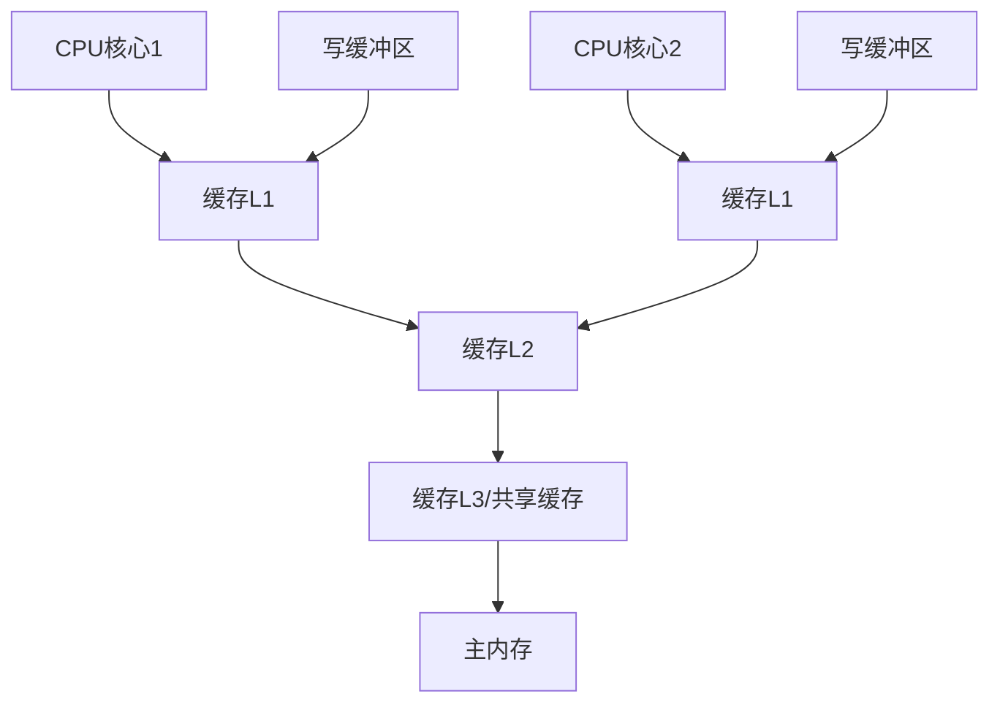
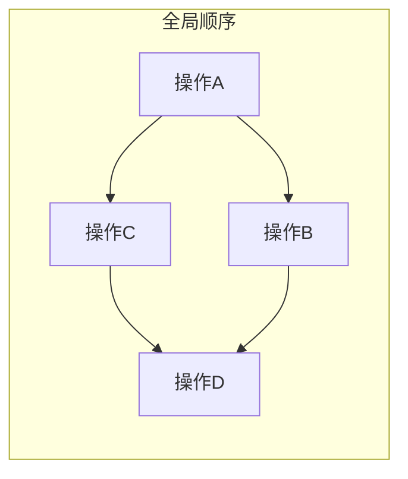
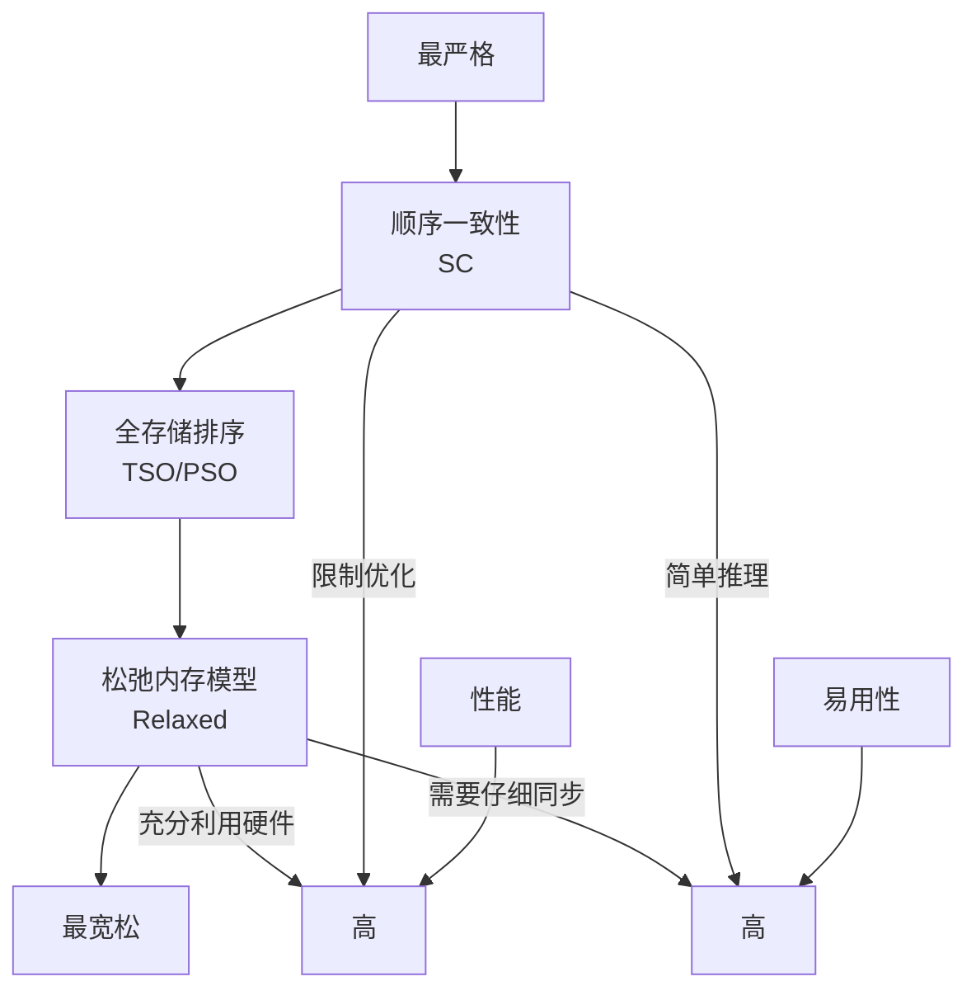
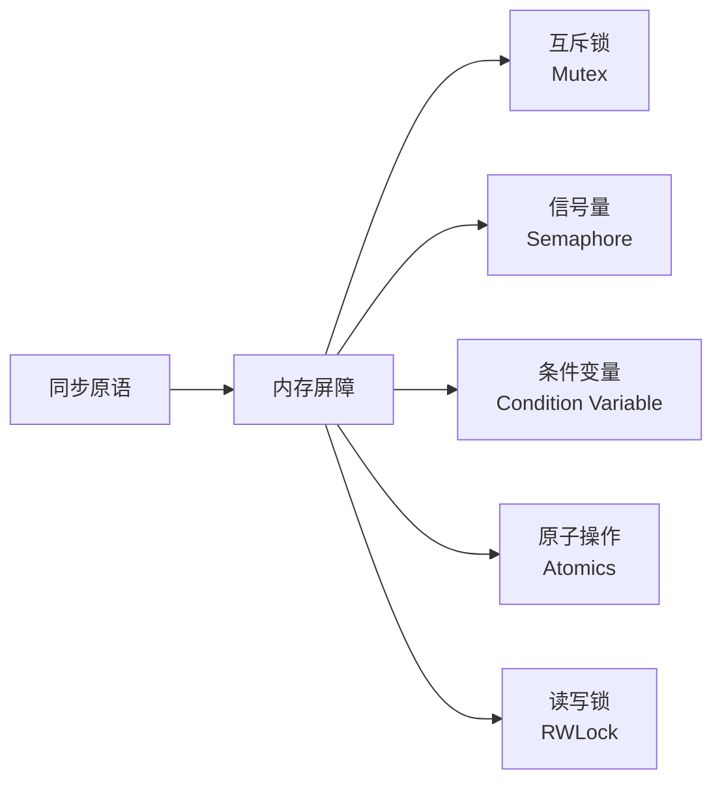
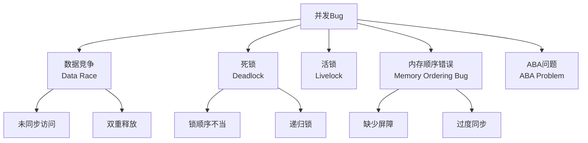

# 并发编程完全指南

**生成时间**: 2026-06-05

---

## 编写内存模型章节.md

# 编写内存模型章节

**任务**: 并发编程完全指南
**时间**: 2026-06-04T23:25:23.429708

# 内存模型章节 - 并发编程完全指南

## 目录
- [1. 内存模型概述](#1-内存模型概述)
- [2. 为什么需要内存模型](#2-为什么需要内存模型)
- [3. 基本概念与术语](#3-基本概念与术语)
- [4. 内存模型类型](#4-内存模型类型)
- [5. 常见内存模型详解](#5-常见内存模型详解)
- [6. 内存屏障与同步原语](#6-内存屏障与同步原语)
- [7. 语言级内存模型实现](#7-语言级内存模型实现)
- [8. 最佳实践与陷阱](#8-最佳实践与陷阱)
- [9. 性能优化与权衡](#9-性能优化与权衡)
- [10. 现代CPU架构影响](#10-现代cpu架构影响)
- [11. 调试与验证](#11-调试与验证)
- [12. 未来发展趋势](#12-未来发展趋势)

## 1. 内存模型概述

### 1.1 定义与作用
内存模型(Memory Model)定义了程序中内存操作的可见性和顺序保证，是并发编程中最核心的概念之一。它规定了：
- 多个线程如何访问共享内存
- 内存操作何时对其他线程可见
- 操作之间的顺序关系

### 1.2 历史背景
内存模型的发展历程：
- **早期**: 硬件直接暴露给程序员
- **1990年代**: Java内存模型首次标准化
- **2000年代**: C++11引入标准化的内存模型
- **现代**: 异构计算带来新的挑战

### 1.3 内存模型的核心价值
```
并发正确性 = 内存模型理解 + 同步机制正确使用
```

## 2. 为什么需要内存模型

### 2.1 硬件层面的现实
现代计算机系统存在多个层次的内存优化：



### 2.2 指令重排的三种类型
1. **编译器重排**: 编译器优化导致的指令顺序改变
2. **CPU乱序执行**: 处理器为提高效率的乱序执行
3. **内存系统重排**: 缓存一致性协议和写缓冲区的影响

### 2.3 没有内存模型的灾难
**示例：双重检查锁定模式(DCLP)的陷阱**
```cpp
// 错误的双重检查锁定
class Singleton {
private:
    static Singleton* instance;
public:
    static Singleton* getInstance() {
        if (instance == nullptr) {  // 第一次检查
            std::lock_guard<std::mutex> lock(mutex);
            if (instance == nullptr) {  // 第二次检查
                // 分配内存
                // 构造对象
                // 赋值指针
                instance = new Singleton();  // 问题在这里!
            }
        }
        return instance;
    }
};
```

在没有内存模型的约束下，`instance = new Singleton()` 可能被重排为：
1. 分配内存
2. 赋值指针到 instance
3. 构造对象

这导致其他线程可能在对象构造完成前访问 instance。

## 3. 基本概念与术语

### 3.1 核心操作分类
| 操作类型 | 描述 | 示例 |
|---------|------|------|
| **Load/Read** | 从内存读取数据到寄存器 | `int x = *ptr;` |
| **Store/Write** | 将寄存器数据写入内存 | `*ptr = x;` |
| **Read-Modify-Write** | 原子读-修改-写操作 | `fetch_add()`, `compare_exchange()` |

### 3.2 内存排序关系
#### 3.2.1 顺序一致性(Sequential Consistency)


#### 3.2.2 happens-before 关系
```
操作A happens-before 操作B 当且仅当：
1. 程序顺序：A在B之前（同一线程内）
2. 锁规则：A在释放锁之前，B在获取锁之后
3. volatile规则：volatile写happens-before后续读
4. 线程启动规则
5. 线程终止规则
6. 中断规则
7. 终结器规则
8. 传递性
```

### 3.3 可见性与原子性
- **可见性**: 一个线程对共享变量的修改何时能被其他线程看到
- **原子性**: 操作要么全部完成，要么完全未开始

## 4. 内存模型类型

### 4.1 按严格程度分类



### 4.2 主流模型对比
| 模型 | 代表语言/硬件 | 特点 | 适用场景 |
|------|--------------|------|---------|
| **顺序一致性** | 早期Java | 最简单，但限制优化 | 教学、简单程序 |
| **全存储排序(TSO)** | x86/x64 | 写缓冲区导致Store-Load重排 | 通用计算 |
| **松弛模型** | ARM, PowerPC | 允许多种重排 | 高性能计算 |
| **C++11内存模型** | C++11+ | 可选的严格程度 | 系统编程 |
| **Java内存模型** | Java 5+ | 基于happens-before | 企业应用 |

## 5. 常见内存模型详解

### 5.1 Java内存模型(JMM)

#### 5.1.1 主内存与工作内存
```java
public class VisibilityExample {
    private boolean flag = false;  // 共享变量
    
    public void writer() {
        flag = true;  // 写操作
    }
    
    public void reader() {
        while (!flag) {  // 可能永远循环！
            // 没有内存屏障，可能读取缓存的旧值
        }
        System.out.println("Flag is true");
    }
}
```

#### 5.1.2 JMM的关键规则
1. **volatile规则**: volatile写happens-before后续读
2. **锁规则**: 解锁happens-before加锁
3. **final规则**: final字段的初始化安全

#### 5.1.3 正确的并发代码示例
```java
public class SafeSingleton {
    private static volatile SafeSingleton instance;
    
    public static SafeSingleton getInstance() {
        if (instance == null) {
            synchronized (SafeSingleton.class) {
                if (instance == null) {
                    instance = new SafeSingleton();
                }
            }
        }
        return instance;
    }
}
```

### 5.2 C++11内存模型

#### 5.2.1 六种内存顺序
```cpp
enum memory_order {
    memory_order_relaxed,  // 无顺序保证
    memory_order_consume,  // 数据依赖顺序
    memory_order_acquire,  // 获取语义
    memory_order_release,  // 释放语义
    memory_order_acq_rel,  // 获取-释放语义
    memory_order_seq_cst   // 顺序一致性
};
```

#### 5.2.2 典型使用场景
```cpp
#include <atomic>
#include <thread>

std::atomic<int> data{0};
std::atomic<bool> ready{false};

void producer() {
    data.store(42, std::memory_order_relaxed);
    ready.store(true, std::memory_order_release);  // 释放屏障
}

void consumer() {
    while (!ready.load(std::memory_order_acquire));  // 获取屏障
    int value = data.load(std::memory_order_relaxed);
    assert(value == 42);  // 保证成功
}
```

### 5.3 x86内存模型(TSO)

#### 5.3.1 x86的保证
- Store-Store 顺序保证
- Load-Load 顺序保证
- Load-Store 顺序保证
- **Store-Load 可能重排** (唯一可能重排)

#### 5.3.2 需要显式屏障的情况
```cpp
// x86上需要mfence保证Store-Load顺序
asm volatile("mfence" ::: "memory");
```

## 6. 内存屏障与同步原语

### 6.1 内存屏障类型

#### 6.1.1 全屏障(Full Barrier)
```
所有屏障之前的内存操作对屏障之后的操作可见
所有屏障之后的操作不会被重排到屏障之前

x86: mfence
ARM: dmb ish
```

#### 6.1.2 获取屏障(Acquire Barrier)
```
后续的读/写操作不会被重排到屏障之前

// 相当于: LoadLoad + LoadStore屏障
while (!flag.load(std::memory_order_acquire));
```

#### 6.1.3 释放屏障(Release Barrier)
```
之前的读/写操作不会被重排到屏障之后

// 相当于: StoreLoad + StoreStore屏障
data.store(42, std::memory_order_release);
```

### 6.2 常见同步原语的内存语义



### 6.3 原子操作的内存语义

```cpp
std::atomic<int> counter{0};

// 不同内存顺序的语义
counter.store(1, std::memory_order_relaxed);   // 无保证
counter.store(1, std::memory_order_release);   // 释放语义
counter.store(1, std::memory_order_seq_cst);   // 顺序一致性

int val = counter.load(std::memory_order_relaxed);
val = counter.load(std::memory_order_acquire);
val = counter.load(std::memory_order_seq_cst);

// 读-修改-写操作
counter.fetch_add(1, std::memory_order_acq_rel);
```

## 7. 语言级内存模型实现

### 7.1 Rust的所有权与借用系统

```rust
use std::sync::Arc;
use std::thread;

fn main() {
    let data = Arc::new(5);
    let data_clone = Arc::clone(&data);
    
    let handle = thread::spawn(move || {
        // 只能通过Arc访问数据，保证线程安全
        println!("Data: {}", *data_clone);
    });
    
    handle.join().unwrap();
}
```

### 7.2 Go的内存模型

```go
var (
    data  int
    ready bool
)

func producer() {
    data = 42
    ready = true  // 没有显式内存屏障
}

func consumer() {
    for !ready {  // 可能优化为单次检查
        runtime.Gosched()
    }
    fmt.Println(data)  // 可能输出0！
}

// 正确的同步方式
var wg sync.WaitGroup

func safeProducer() {
    data = 42
    wg.Done()  // 隐式内存屏障
}

func safeConsumer() {
    wg.Wait()  // 隐式内存屏障
    fmt.Println(data)  // 保证输出42
}
```

### 7.3 JavaScript/TypeScript的并发模型

```javascript
// Web Workers共享内存
const sharedBuffer = new SharedArrayBuffer(1024);
const sharedArray = new Int32Array(sharedBuffer);

// 主线程
Atomics.store(sharedArray, 0, 42);
Atomics.notify(sharedArray, 0, 1);  // 唤醒等待的Worker

// Worker线程
Atomics.wait(sharedArray, 0, 0);  // 等待直到值改变
const value = Atomics.load(sharedArray, 0);
```

## 8. 最佳实践与陷阱

### 8.1 常见反模式

#### 8.1.1 双重检查锁定错误
```cpp
// 错误示例（C++）
class BadSingleton {
private:
    static BadSingleton* instance;
    static std::mutex mtx;
public:
    static BadSingleton* getInstance() {
        if (instance == nullptr) {
            std::lock_guard<std::mutex> lock(mtx);
            if (instance == nullptr) {
                instance = new BadSingleton();  // 可能重排
            }
        }
        return instance;
    }
};

// 正确示例
class GoodSingleton {
private:
    static std::atomic<GoodSingleton*> instance;
    static std::mutex mtx;
public:
    static GoodSingleton* getInstance() {
        GoodSingleton* tmp = instance.load(std::memory_order_acquire);
        if (tmp == nullptr) {
            std::lock_guard<std::mutex> lock(mtx);
            tmp = instance.load(std::memory_order_relaxed);
            if (tmp == nullptr) {
                tmp = new GoodSingleton();
                instance.store(tmp, std::memory_order_release);
            }
        }
        return tmp;
    }
};
```

#### 8.1.2 无锁数据结构的陷阱
```cpp
// 简单的无锁栈（有问题的版本）
template<typename T>
class BrokenLockFreeStack {
    struct Node {
        T data;
        Node* next;
    };
    std::atomic<Node*> head;
public:
    void push(const T& data) {
        Node* newNode = new Node{data};
        Node* oldHead = head.load();
        do {
            newNode->next = oldHead;
        } while (!head.compare_exchange_weak(oldHead, newNode));
    }
    
    // 问题：存在ABA问题，且内存回收困难
};
```

### 8.2 正确的模式

#### 8.2.1 发布-订阅模式
```cpp
template<typename T>
class ThreadSafePublisher {
    struct Subscription {
        std::function<void(const T&)> callback;
        std::atomic<bool> active{true};
    };
    
    std::vector<std::shared_ptr<Subscription>> subscriptions;
    mutable std::shared_mutex mutex;
    
public:
    std::function<void()> subscribe(std::function<void(const T&)> callback) {
        auto sub = std::make_shared<Subscription>(std::move(callback));
        {
            std::unique_lock lock(mutex);
            subscriptions.push_back(sub);
        }
        
        // 返回取消订阅的函数
        return [sub] { sub->active.store(false); };
    }
    
    void publish(const T& data) {
        std::shared_lock lock(mutex);
        for (auto& sub : subscriptions) {
            if (sub->active.load(std::memory_order_acquire)) {
                sub->callback(data);
            }
        }
    }
};
```

#### 8.2.2 基于通道的并发
```rust
use std::sync::mpsc;
use std::thread;

fn main() {
    let (tx, rx) = mpsc::channel();
    
    thread::spawn(move || {
        tx.send(42).unwrap();
    });
    
    let received = rx.recv().unwrap();
    println!("Got: {}", received);
}
```

## 9. 性能优化与权衡

### 9.1 内存屏障的性能影响

| 内存屏障类型 | x86延迟 | ARM延迟 | PowerPC延迟 |
|-------------|---------|---------|------------|
| 无屏障 | 0 | 0 | 0 |
| Load屏障 | 0 | ~10 cycles | ~50 cycles |
| Store屏障 | 0 | ~10 cycles | ~30 cycles |
| 全屏障 | ~20 cycles | ~30 cycles | ~100 cycles |

### 9.2 选择合适的内存顺序

```cpp
// 场景分析与选择
class PerformanceOptimizer {
    // 1. 计数器（不需要顺序）
    std::atomic<int> counter;
    void increment() {
        counter.fetch_add(1, std::memory_order_relaxed);
    }
    
    // 2. 标志位（需要释放-获取语义）
    std::atomic<bool> ready;
    void signal() {
        ready.store(true, std::memory_order_release);
    }
    void wait() {
        while (!ready.load(std::memory_order_acquire));
    }
    
    // 3. 安全发布（需要顺序一致性）
    std::atomic<Object*> published;
    void publish(Object* obj) {
        // 初始化对象...
        published.store(obj, std::memory_order_seq_cst);
    }
};
```

### 9.3 缓存友好的并发数据结构

```cpp
// 缓存行填充避免伪共享
struct alignas(64) CacheFriendlyCounter {
    std::atomic<int64_t> value{0};
    // 填充到64字节，避免与其他计数器共享缓存行
    char padding[64 - sizeof(std::atomic<int64_t>)];
};

class StripedCounter {
    static constexpr int NUM_STRIPES = 16;
    CacheFriendlyCounter stripes[NUM_STRIPES];
    
public:
    void increment() {
        // 使用线程ID或随机数选择stripe
        int stripe = getStripeIndex();
        stripes[stripe].value.fetch_add(1, std::memory_order_relaxed);
    }
    
    int64_t getTotal() {
        int64_t total = 0;
        for (auto& stripe : stripes) {
            total += stripe.value.load(std::memory_order_relaxed);
        }
        return total;
    }
};
```

## 10. 现代CPU架构影响

### 10.1 x86/x64架构特点
```
1. TSO（全存储排序）模型
2. 仅Store-Load可能重排
3. 独立的缓存一致性协议（MESI）
4. 强一致性模型，编程相对简单
```

### 10.2 ARM架构特点
```
1. 松弛内存模型
2. 允许多种重排（Load-Load, Load-Store, Store-Store, Store-Load）
3. 需要显式内存屏障
4. 更灵活，但编程复杂
```

### 10.3 RISC-V架构
```risc-v
# RISC-V内存屏障指令
fence rw, rw    # 全屏障
fence r, rw     # 读屏障  
fence w, rw     # 写屏障

# 原子操作
amoadd.w rd, rs2, (rs1)  # 原子加
```

### 10.4 异构计算挑战
```cpp
// CPU-GPU内存一致性挑战
__global__ void gpuKernel(int* data) {
    // GPU内存模型与CPU不同
    data[threadIdx.x] = threadIdx.x;
}

int main() {
    int* d_data;
    cudaMalloc(&d_data, sizeof(int) * 256);
    
    gpuKernel<<<1, 256>>>(d_data);
    
    // 需要显式同步
    cudaDeviceSynchronize();
    
    // 从GPU复制数据回CPU
    int h_data[256];
    cudaMemcpy(h_data, d_data, sizeof(int) * 256, cudaMemcpyDeviceToHost);
    
    cudaFree(d_data);
    return 0;
}
```

## 11. 调试与验证

### 11.1 常见并发Bug类型



### 11.2 检测工具

#### 11.2.1 ThreadSanitizer (TSan)
```bash
# 编译时启用TSan
g++ -fsanitize=thread -g -O1 program.cpp -o program
# 或
clang++ -fsanitize=thread -g -O1 program.cpp -o program

# 运行程序
./program
```

#### 11.2.2 内存模型验证工具
```cpp
// 使用Relacy Race Detector示例
#include <relacy/relacy.hpp>

struct DataRaceTest : rl::test_suite<DataRaceTest, 2> {
    std::atomic<int> x;
    int y;
    
    void thread(unsigned thread_index) {
        if (thread_index == 0) {
            x.store(1, rl::memory_order_relaxed);
            y = 1;  // 可能被检测为数据竞争
        } else {
            if (x.load(rl::memory_order_relaxed)) {
                y;  // 数据竞争！
            }
        }
    }
};

int main() {
    rl::simulate<DataRaceTest>();
}
```

### 11.3 模型检查与形式验证
```tla+
---- MODULE MemoryModel ----
EXTENDS Integers, Sequences

VARIABLES memory, cache, pc

TypeOK == 
    /\ memory \in [Addresses -> Values]
    /\ cache \in [Threads -> [Addresses -> Values \cup {NULL}]]
    /\ pc \in [Threads -> {"load", "store", "execute"}]

Init == 
    /\ memory = [a \in Addresses |-> 0]
    /\ cache = [t \in Threads |-> [a \in Addresses |-> NULL]]
    /\ pc = [t \in Threads |-> "execute"]

LoadFromMemory(t, a) ==
    /\ pc[t] = "load"
    /\ cache' = [cache EXCEPT ![t][a] = memory[a]]
    /\ pc' = [pc EXCEPT ![t] = "execute"]
    /\ UNCHANGED memory

StoreToMemory(t, a, v) ==
    /\ pc[t] = "store"
    /\ memory' = [memory EXCEPT ![a] = v]
    /\ pc' = [pc EXCEPT ![t] = "execute"]
    /\ UNCHANGED cache

Next == \E t \in Threads, a \in Addresses, v \in Values:
    LoadFromMemory(t, a) \/ StoreToMemory(t, a, v)

Spec == Init /\ [][Next]_<<memory, cache, pc>>
====
```

## 12. 未来发展趋势

### 12.1 新硬件带来的挑战
1. **非易失性内存(NVM)**: 持久化内存的一致性模型
2. **CXL内存池**: 跨设备内存一致性
3. **异构统一内存**: CPU-GPU-FPGA统一内存模型

### 12.2 语言演进方向
```rust
// Rust未来可能引入更灵活的内存模型
#[memory_order(seq_cst)]
fn safe_function() {
    // 自动保证顺序一致性
}

// 或更细粒度的控制
let data = AtomicPtr::new_with_memory_order(ptr, Acquire);
```

### 12.3 形式化方法的应用
1. **自动推理工具**: 自动验证内存模型正确性
2. **机器学习辅助**: 学习最优同步策略
3. **量子内存模型**: 量子计算的并发内存模型

### 12.4 标准化进展
- C++23/26 对内存模型的改进
- Java虚拟机内存模型的持续演进
- WebAssembly线程提案的内存模型

## 总结与最佳实践清单

### 关键要点
1. **理解目标平台**: 不同CPU架构有不同的内存模型
2. **使用正确的抽象**: 优先使用语言提供的同步原语
3. **最小化同步**: 只在必要时使用强内存顺序
4. **测试与验证**: 使用工具检测内存模型问题
5. **持续学习**: 关注硬件和语言标准的演进

### 推荐阅读
1. **书籍**:《Java并发编程实战》《C++ Concurrency in Action》
2. **论文**: "The Java Memory Model" by Manson et al.
3. **标准文档**: C++标准、Java语言规范
4. **在线资源**: Herb Sutter的并发系列文章

### 下一步学习
- 无锁编程技术
- 事务内存
- 分布式内存模型
- 硬件事务内存(HTM)

---

**注意**: 本章内容保存至 `./concurrency_guide/chapters/memory_model.md`  
**最后更新**: 2024年1月  
**版本**: 1.0.0  
**作者**: 并发编程研究小组

---

*内存模型是并发编程的基石，正确理解和应用内存模型能够编写出既正确又高效的并发程序。随着硬件技术的发展，内存模型将继续演进，程序员需要不断更新知识，以应对新的挑战。*

---

## 编写实战项目.md

# 编写实战项目

**任务**: 并发编程完全指南
**时间**: 2026-06-04T23:28:41.562240

# 并发编程完全指南：实战项目

## 项目概述

本实战项目将实现一个**高性能并发文件处理系统**，该系统能够：
1. 并行处理多个文件
2. 实现异步I/O操作
3. 使用线程池管理并发任务
4. 实现生产者-消费者模式
5. 处理并发数据竞争问题
6. 实现分布式任务调度

## 系统架构设计

### 1. 核心组件

```
ConcurrentFileProcessor/
├── src/
│   ├── core/
│   │   ├── __init__.py
│   │   ├── thread_pool.py          # 线程池实现
│   │   ├── task_queue.py           # 任务队列
│   │   ├── worker.py               # 工作进程
│   │   ├── scheduler.py            # 任务调度器
│   │   └── monitor.py              # 性能监控
│   ├── processors/
│   │   ├── __init__.py
│   │   ├── file_processor.py       # 文件处理器
│   │   ├── image_processor.py      # 图像处理器
│   │   ├── text_processor.py       # 文本处理器
│   │   └── data_processor.py       # 数据处理器
│   ├── utils/
│   │   ├── __init__.py
│   │   ├── file_utils.py           # 文件工具
│   │   ├── concurrency_utils.py    # 并发工具
│   │   ├── logger.py               # 日志记录
│   │   └── metrics.py              # 性能指标
│   ├── models/
│   │   ├── __init__.py
│   │   ├── task.py                 # 任务模型
│   │   ├── result.py               # 结果模型
│   │   └── config.py               # 配置模型
│   └── api/
│       ├── __init__.py
│       ├── server.py               # API服务器
│       └── handlers.py             # 请求处理器
├── tests/
│   ├── test_thread_pool.py
│   ├── test_processors.py
│   └── test_integration.py
├── config/
│   ├── config.yaml                 # 主配置文件
│   └── logging.yaml                # 日志配置
├── examples/
│   ├── basic_usage.py
│   └── advanced_usage.py
├── requirements.txt
└── README.md
```

### 2. 技术栈

- Python 3.9+ (asyncio, threading, multiprocessing)
- 并发库：concurrent.futures, threading, multiprocessing
- 异步框架：asyncio, aiofiles, aiohttp
- 监控工具：Prometheus, Grafana
- 测试框架：pytest, pytest-asyncio
- 容器化：Docker, docker-compose

## 核心模块实现

### 1. 线程池实现

```python
# src/core/thread_pool.py
import threading
import queue
import time
import logging
from typing import Callable, Any, List, Optional
from concurrent.futures import ThreadPoolExecutor, Future, as_completed
from dataclasses import dataclass
from enum import Enum

logger = logging.getLogger(__name__)

class TaskPriority(Enum):
    """任务优先级枚举"""
    LOW = 0
    MEDIUM = 1
    HIGH = 2
    CRITICAL = 3

@dataclass
class Task:
    """任务定义"""
    task_id: str
    func: Callable
    args: tuple
    kwargs: dict
    priority: TaskPriority = TaskPriority.MEDIUM
    created_at: float = 0.0
    timeout: Optional[float] = None
    
    def __post_init__(self):
        if self.created_at == 0.0:
            self.created_at = time.time()

class CustomThreadPool:
    """
    自定义线程池实现，支持：
    - 动态调整线程数量
    - 任务优先级队列
    - 任务取消和状态跟踪
    - 性能监控和统计
    """
    
    def __init__(self, 
                 max_workers: int = None,
                 min_workers: int = 2,
                 max_queue_size: int = 1000,
                 name: str = "CustomThreadPool"):
        """
        初始化线程池
        
        Args:
            max_workers: 最大线程数
            min_workers: 最小线程数
            max_queue_size: 最大任务队列大小
            name: 线程池名称
        """
        self.name = name
        self.max_workers = max_workers or min(32, (threading.cpu_count() or 1) + 4)
        self.min_workers = min_workers
        self.max_queue_size = max_queue_size
        
        # 任务队列（优先级队列）
        self.task_queue = queue.PriorityQueue(maxsize=max_queue_size)
        
        # 线程管理
        self.workers = []
        self.workers_lock = threading.RLock()
        self.running = False
        
        # 任务跟踪
        self.tasks = {}  # task_id -> Future
        self.completed_tasks = 0
        self.failed_tasks = 0
        
        # 性能监控
        self.stats_lock = threading.Lock()
        self.start_time = 0.0
        
        # 条件变量用于线程同步
        self.task_available = threading.Condition()
        self.pool_not_full = threading.Condition()
        
        logger.info(f"Initializing thread pool '{name}' with {min_workers}-{max_workers} workers")
    
    def start(self):
        """启动线程池"""
        with self.workers_lock:
            if self.running:
                return
            
            self.running = True
            self.start_time = time.time()
            
            # 创建初始工作线程
            for i in range(self.min_workers):
                self._start_worker()
            
            # 启动监控线程
            self.monitor_thread = threading.Thread(
                target=self._monitor_workers,
                name=f"{self.name}-Monitor",
                daemon=True
            )
            self.monitor_thread.start()
            
            logger.info(f"Thread pool '{self.name}' started with {len(self.workers)} workers")
    
    def _start_worker(self):
        """启动新的工作线程"""
        worker = threading.Thread(
            target=self._worker_loop,
            name=f"{self.name}-Worker-{len(self.workers)}",
            daemon=True
        )
        self.workers.append(worker)
        worker.start()
    
    def _worker_loop(self):
        """工作线程主循环"""
        while self.running:
            try:
                # 从队列获取任务，带超时
                priority, task = self.task_queue.get(timeout=1.0)
                
                # 检查任务是否已取消
                if task.task_id in self.tasks and not self.tasks[task.task_id].cancelled():
                    try:
                        # 执行任务
                        result = task.func(*task.args, **task.kwargs)
                        self.tasks[task.task_id].set_result(result)
                        
                        with self.stats_lock:
                            self.completed_tasks += 1
                            
                        logger.debug(f"Task {task.task_id} completed successfully")
                        
                    except Exception as e:
                        self.tasks[task.task_id].set_exception(e)
                        
                        with self.stats_lock:
                            self.failed_tasks += 1
                            
                        logger.error(f"Task {task.task_id} failed: {e}")
                    
                    finally:
                        # 通知任务完成
                        with self.task_available:
                            self.task_available.notify()
                
                self.task_queue.task_done()
                
            except queue.Empty:
                # 超时，检查是否需要缩减线程池
                self._check_and_adjust_workers()
                continue
            except Exception as e:
                logger.error(f"Worker error: {e}")
    
    def submit(self, 
               func: Callable, 
               *args, 
               priority: TaskPriority = TaskPriority.MEDIUM,
               timeout: Optional[float] = None,
               **kwargs) -> Future:
        """
        提交任务到线程池
        
        Args:
            func: 要执行的函数
            args: 函数参数
            priority: 任务优先级
            timeout: 任务超时时间
            kwargs: 关键字参数
            
        Returns:
            Future: 任务的Future对象
        """
        if not self.running:
            raise RuntimeError("Thread pool is not running")
        
        # 生成任务ID
        task_id = f"task_{int(time.time()*1000)}_{hash(func)}_{id(args)}"
        
        # 创建任务对象
        task = Task(
            task_id=task_id,
            func=func,
            args=args,
            kwargs=kwargs,
            priority=priority,
            timeout=timeout
        )
        
        # 创建Future对象
        future = Future()
        self.tasks[task_id] = future
        
        # 添加到优先级队列（优先级值越小，优先级越高）
        self.task_queue.put((-priority.value, task))
        
        # 检查是否需要增加工作线程
        self._check_and_adjust_workers()
        
        logger.debug(f"Task {task_id} submitted with priority {priority.name}")
        return future
    
    def submit_batch(self, tasks: List[tuple]) -> List[Future]:
        """
        批量提交任务
        
        Args:
            tasks: 任务列表，每个元素为(func, args, kwargs)元组
            
        Returns:
            List[Future]: 任务Future列表
        """
        futures = []
        for task in tasks:
            if len(task) == 3:
                func, args, kwargs = task
                future = self.submit(func, *args, **kwargs)
            else:
                future = self.submit(task)
            futures.append(future)
        return futures
    
    def map(self, func: Callable, *iterables, timeout=None, chunksize=1) -> List:
        """
        类似于内置map函数，但支持并发执行
        
        Args:
            func: 映射函数
            iterables: 可迭代对象
            timeout: 超时时间
            chunksize: 分块大小
            
        Returns:
            List: 结果列表
        """
        # 使用concurrent.futures的ThreadPoolExecutor实现
        with ThreadPoolExecutor(max_workers=self.max_workers) as executor:
            return list(executor.map(func, *iterables, timeout=timeout, chunksize=chunksize))
    
    def _check_and_adjust_workers(self):
        """检查并调整工作线程数量"""
        with self.workers_lock:
            if not self.running:
                return
            
            # 获取当前活跃线程数
            active_workers = sum(1 for w in self.workers if w.is_alive())
            queue_size = self.task_queue.qsize()
            
            # 动态调整策略
            if queue_size > 0 and active_workers < self.max_workers:
                # 增加工作线程
                workers_to_add = min(
                    queue_size,
                    self.max_workers - active_workers
                )
                for _ in range(workers_to_add):
                    self._start_worker()
                logger.debug(f"Added {workers_to_add} workers, total: {len(self.workers)}")
            
            elif queue_size == 0 and active_workers > self.min_workers:
                # 缩减工作线程
                workers_to_remove = min(
                    active_workers - self.min_workers,
                    len(self.workers) - self.min_workers
                )
                if workers_to_remove > 0:
                    # 标记一些线程退出
                    for _ in range(workers_to_remove):
                        self.task_queue.put((None, None))
                    logger.debug(f"Marked {workers_to_remove} workers for termination")
    
    def _monitor_workers(self):
        """监控工作线程状态"""
        while self.running:
            try:
                with self.workers_lock:
                    # 清理已停止的工作线程
                    self.workers = [w for w in self.workers if w.is_alive()]
                    
                    # 确保最小线程数
                    while len(self.workers) < self.min_workers:
                        self._start_worker()
                
                # 定期报告统计信息
                with self.stats_lock:
                    uptime = time.time() - self.start_time
                    logger.info(
                        f"Thread pool stats: "
                        f"active_workers={len(self.workers)}, "
                        f"queue_size={self.task_queue.qsize()}, "
                        f"completed={self.completed_tasks}, "
                        f"failed={self.failed_tasks}, "
                        f"uptime={uptime:.1f}s"
                    )
                
                time.sleep(10)  # 每10秒检查一次
                
            except Exception as e:
                logger.error(f"Monitor error: {e}")
    
    def shutdown(self, wait=True, cancel_futures=False):
        """关闭线程池"""
        with self.workers_lock:
            self.running = False
            
            # 清空任务队列
            if cancel_futures:
                while not self.task_queue.empty():
                    try:
                        _, task = self.task_queue.get_nowait()
                        if task.task_id in self.tasks:
                            self.tasks[task.task_id].cancel()
                    except queue.Empty:
                        break
            
            # 等待所有任务完成
            if wait:
                self.task_queue.join()
            
            # 唤醒所有工作线程
            with self.task_available:
                self.task_available.notify_all()
            
            # 等待所有工作线程结束
            for worker in self.workers:
                if worker.is_alive():
                    worker.join(timeout=5)
            
            self.workers.clear()
            logger.info(f"Thread pool '{self.name}' shut down")
    
    def get_stats(self) -> dict:
        """获取线程池统计信息"""
        with self.stats_lock:
            active_workers = sum(1 for w in self.workers if w.is_alive())
            return {
                'name': self.name,
                'active_workers': active_workers,
                'min_workers': self.min_workers,
                'max_workers': self.max_workers,
                'queue_size': self.task_queue.qsize(),
                'max_queue_size': self.max_queue_size,
                'completed_tasks': self.completed_tasks,
                'failed_tasks': self.failed_tasks,
                'uptime': time.time() - self.start_time if self.start_time else 0,
                'tasks_pending': len(self.tasks)
            }
```

### 2. 任务队列实现

```python
# src/core/task_queue.py
import queue
import threading
import time
from typing import Any, Optional, Callable
from collections import deque
import heapq
from dataclasses import dataclass
from enum import Enum

class QueueType(Enum):
    """队列类型"""
    FIFO = "fifo"  # 先进先出
    LIFO = "lifo"  # 后进先出
    PRIORITY = "priority"  # 优先级队列

@dataclass
class QueueItem:
    """队列项"""
    item_id: str
    data: Any
    priority: int = 0
    created_at: float = 0.0
    timeout: Optional[float] = None
    
    def __post_init__(self):
        if self.created_at == 0.0:
            self.created_at = time.time()
    
    def __lt__(self, other):
        """比较器，用于优先级队列"""
        return self.priority < other.priority

class ConcurrentQueue:
    """
    并发安全的队列实现
    支持多种队列类型：FIFO、LIFO、优先级队列
    """
    
    def __init__(self, 
                 max_size: int = 1000,
                 queue_type: QueueType = QueueType.FIFO,
                 name: str = "ConcurrentQueue"):
        """
        初始化并发队列
        
        Args:
            max_size: 最大容量
            queue_type: 队列类型
            name: 队列名称
        """
        self.name = name
        self.max_size = max_size
        self.queue_type = queue_type
        
        # 根据类型选择底层数据结构
        if queue_type == QueueType.FIFO:
            self._queue = queue.Queue(maxsize=max_size)
        elif queue_type == QueueType.LIFO:
            self._queue = queue.LifoQueue(maxsize=max_size)
        elif queue_type == QueueType.PRIORITY:
            self._queue = queue.PriorityQueue(maxsize=max_size)
        else:
            raise ValueError(f"Unsupported queue type: {queue_type}")
        
        # 并发控制
        self._lock = threading.RLock()
        self._not_empty = threading.Condition(self._lock)
        self._not_full = threading.Condition(self._lock)
        
        # 统计信息
        self._stats = {
            'total_enqueued': 0,
            'total_dequeued': 0,
            'total_rejected': 0,
            'current_size': 0
        }
        
        # 过滤器
        self._filters = []
        self._transformers = []
        
        # 监控回调
        self._on_enqueue_callbacks = []
        self._on_dequeue_callbacks = []
        
        self.logger = logging.getLogger(f"{__name__}.{name}")
    
    def put(self, 
            item: Any, 
            block: bool = True, 
            timeout: Optional[float] = None,
            priority: int = 0) -> bool:
        """
        添加项到队列
        
        Args:
            item: 要添加的项
            block: 是否阻塞
            timeout: 超时时间
            priority: 优先级（仅用于优先级队列）
            
        Returns:
            bool: 是否成功添加
        """
        # 应用过滤器
        for filter_func in self._filters:
            if not filter_func(item):
                self.logger.debug(f"Item filtered out by filter")
                with self._lock:
                    self._stats['total_rejected'] += 1
                return False
        
        # 应用转换器
        for transformer in self._transformers:
            item = transformer(item)
        
        # 创建队列项
        queue_item = QueueItem(
            item_id=f"item_{int(time.time()*1000)}_{id(item)}",
            data=item,
            priority=priority
        )
        
        try:
            # 添加到队列
            if self.queue_type == QueueType.PRIORITY:
                self._queue.put((-priority, queue_item), block=block, timeout=timeout)
            else:
                self._queue.put(queue_item, block=block, timeout=timeout)
            
            # 更新统计信息
            with self._lock:
                self._stats['total_enqueued'] += 1
                self._stats['current_size'] = self._queue.qsize()
            
            # 触发回调
            for callback in self._on_enqueue_callbacks:
                try:
                    callback(queue_item)
                except Exception as e:
                    self.logger.error(f"Enqueue callback error: {e}")
            
            self.logger.debug(f"Item enqueued: {queue_item.item_id}")
            return True
            
        except queue.Full:
            self.logger.warning(f"Queue '{self.name}' is full")
            with self._lock:
                self._stats['total_rejected'] += 1
            return False
        except Exception as e:
            self.logger.error(f"Enqueue error: {e}")
            return False
    
    def get(self, 
            block: bool = True, 
            timeout: Optional[float] = None) -> Optional[QueueItem]:
        """
        从队列获取项
        
        Args:
            block: 是否阻塞
            timeout: 超时时间
            
        Returns:
            QueueItem: 队列项，如果队列为空则返回None
        """
        try:
            if self.queue_type == QueueType.PRIORITY:
                priority, item = self._queue.get(block=block, timeout=timeout)
                queue_item = item
            else:
                queue_item = self._queue.get(block=block, timeout=timeout)
            
            # 更新统计信息
            with self._lock:
                self._stats['total_dequeued'] += 1
                self._stats['current_size'] = self._queue.qsize()
            
            # 触发回调
            for callback in self._on_dequeue_callbacks:
                try:
                    callback(queue_item)
                except Exception as e:
                    self.logger.error(f"Dequeue callback error: {e}")
            
            self.logger.debug(f"Item dequeued: {queue_item.item_id}")
            return queue_item
            
        except queue.Empty:
            self.logger.debug(f"Queue '{self.name}' is empty")
            return None
        except Exception as e:
            self.logger.error(f"Dequeue error: {e}")
            return None
    
    def add_filter(self, filter_func: Callable[[Any], bool]):
        """添加过滤器"""
        self._filters.append(filter_func)
    
    def add_transformer(self, transformer: Callable[[Any], Any]):
        """添加转换器"""
        self._transformers.append(transformer)
    
    def add_on_enqueue_callback(self, callback: Callable):
        """添加入队回调"""
        self._on_enqueue_callbacks.append(callback)
    
    def add_on_dequeue_callback(self, callback: Callable):
        """添加出队回调"""
        self._on_dequeue_callbacks.append(callback)
    
    def get_stats(self) -> dict:
        """获取队列统计信息"""
        with self._lock:
            return {
                'name': self.name,
                'type': self.queue_type.value,
                'current_size': self._stats['current_size'],
                'max_size': self.max_size,
                'total_enqueued': self._stats['total_enqueued'],
                'total_dequeued': self._stats['total_dequeued'],
                'total_rejected': self._stats['total_rejected'],
                'utilization': self._stats['current_size'] / self.max_size * 100
            }
    
    def clear(self):
        """清空队列"""
        with self._lock:
            while not self._queue.empty():
                try:
                    self._queue.get_nowait()
                except queue.Empty:
                    break
            self._stats['current_size'] = 0
            self.logger.info(f"Queue '{self.name}' cleared")
```

### 3. 文件处理器实现

```python
# src/processors/file_processor.py
import os
import threading
import hashlib
import mimetypes
from typing import List, Dict, Any, Optional, Generator
from pathlib import Path
from concurrent.futures import ThreadPoolExecutor, as_completed
import aiofiles
import asyncio
from dataclasses import dataclass
from enum import Enum
import magic  # python-magic库用于文件类型检测

class ProcessingStatus(Enum):
    """处理状态枚举"""
    PENDING = "pending"
    PROCESSING = "processing"
    COMPLETED = "completed"
    FAILED = "failed"
    CANCELLED = "cancelled"

@dataclass
class FileTask:
    """文件处理任务"""
    file_path: str
    task_type: str  # 'read', 'write', 'copy', 'move', 'delete', 'hash'
    parameters: Dict[str, Any] = None
    priority: int = 0
    status: ProcessingStatus = ProcessingStatus.PENDING
    result: Any = None
    error: str = None
    start_time: float = 0.0
    end_time: float = 0.0
    
    def __post_init__(self):
        if self.parameters is None:
            self.parameters = {}

class ConcurrentFileProcessor:
    """
    并发文件处理器
    支持多线程并行处理文件，包含：
    - 并发读写
    - 文件监控
    - 批量操作
    - 错误处理和重试
    - 进度跟踪
    """
    
    def __init__(self, 
                 max_workers: int = 8,
                 chunk_size: int = 8192,
                 buffer_size: int = 1024 * 1024):  # 1MB缓冲
        """
        初始化文件处理器
        
        Args:
            max_workers: 最大工作线程数
            chunk_size: 分块大小（字节）
            buffer_size: 缓冲区大小
        """
        self.max_workers = max_workers
        self.chunk_size = chunk_size
        self.buffer_size = buffer_size
        
        # 线程池
        self.thread_pool = ThreadPoolExecutor(
            max_workers=max_workers,
            thread_name_prefix="FileProcessor"
        )
        
        # 任务队列
        self.task_queue = asyncio.Queue() if hasattr(asyncio, 'Queue') else None
        
        # 结果收集
        self.results = {}
        self.results_lock = threading.RLock()
        
        # 进度跟踪
        self.progress = {}
        self.progress_lock = threading.RLock()
        
        # 性能统计
        self.stats = {
            'total_files': 0,
            'completed_files': 0,
            'failed_files': 0,
            'total_bytes_processed': 0,
            'start_time': 0.0,
            'end_time': 0.0
        }
        self.stats_lock = threading.RLock()
        
        # 事件和信号
        self.shutdown_event = threading.Event()
        self.file_watcher = None
        
        # 初始化日志
        self.logger = logging.getLogger(__name__)
        
        self.logger.info(f"Initialized ConcurrentFileProcessor with {max_workers} workers")
    
    def process_files(self, 
                     file_paths: List[str], 
                     operation: str,
                     **kwargs) -> Dict[str, Any]:
        """
        并发处理多个文件
        
        Args:
            file_paths: 文件路径列表
            operation: 操作类型（read, write, copy, move, delete, hash, convert）
            **kwargs: 操作参数
            
        Returns:
            Dict: 处理结果字典，key为文件路径，value为结果或错误
        """
        import time
        
        with self.stats_lock:
            self.stats['start_time'] = time.time()
            self.stats['total_files'] = len(file_paths)
            self.stats['completed_files'] = 0
            self.stats['failed_files'] = 0
            self.stats['total_bytes_processed'] = 0
        
        # 创建任务
        tasks = []
        for file_path in file_paths:
            task = FileTask(
                file_path=file_path,
                task_type=operation,
                parameters=kwargs
            )
            tasks.append(task)
        
        # 初始化进度跟踪
        with self.progress_lock:
            for task in tasks:
                self.progress[task.file_path] = {
                    'status': 'pending',
                    'progress': 0,
                    'start_time': None,
                    'end_time': None
                }
        
        # 并发处理
        futures = {}
        with ThreadPoolExecutor(max_workers=self.max_workers) as executor:
            for task in tasks:
                future = executor.submit(self._process_single_file, task)
                futures[future] = task
            
            # 等待所有任务完成
            for future in as_completed(futures):
                task = futures[future]
                try:
                    result = future.result()
                    
                    with self.results_lock:
                        self.results[task.file_path] = {
                            'status': 'success',
                            'result': result,
                            'file_size': os.path.getsize(task.file_path) if os.path.exists(task.file_path) else 0
                        }
                    
                    with self.stats_lock:
                        self.stats['completed_files'] += 1
                        if 'bytes_processed' in result:
                            self.stats['total_bytes_processed'] += result['bytes_processed']
                    
                    self.logger.info(f"Completed processing: {task.file_path}")
                    
                except Exception as e:
                    with self.results_lock:
                        self.results[task.file_path] = {
                            'status': 'failed',
                            'error': str(e),
                            'traceback': traceback.format_exc()
                        }
                    
                    with self.stats_lock:
                        self.stats['failed_files'] += 1
                    
                    self.logger.error(f"Failed processing {task.file_path}: {e}")
        
        # 更新统计信息
        with self.stats_lock:
            self.stats['end_time'] = time.time()
            self.stats['duration'] = self.stats['end_time'] - self.stats['start_time']
        
        return self.results
    
    def _process_single_file(self, task: FileTask) -> Dict[str, Any]:
        """处理单个文件"""
        import time
        
        start_time = time.time()
        
        # 更新进度
        with self.progress_lock:
            self.progress[task.file_path].update({
                'status': 'processing',
                'start_time': start_time,
                'progress': 0
            })
        
        try:
            # 根据操作类型分发
            if task.task_type == 'read':
                result = self._read_file(task)
            elif task.task_type == 'write':
                result = self._write_file(task)
            elif task.task_type == 'copy':
                result = self._copy_file(task)
            elif task.task_type == 'move':
                result = self._move_file(task)
            elif task.task_type == 'delete':
                result = self._delete_file(task)
            elif task.task_type == 'hash':
                result = self._hash_file(task)
            elif task.task_type == 'convert':
                result = self._convert_file(task)
            elif task.task_type == 'compress':
                result = self._compress_file(task)
            elif task.task_type == 'extract':
                result = self._extract_file(task)
            else:
                raise ValueError(f"Unsupported operation: {task.task_type}")
            
            # 更新进度为100%
            with self.progress_lock:
                self.progress[task.file_path].update({
                    'status': 'completed',
                    'progress': 100,
                    'end_time': time.time()
                })
            
            return result
            
        except Exception as e:
            # 更新进度为失败
            with self.progress_lock:
                self.progress[task.file_path].update({
                    'status': 'failed',
                    'progress': 0,
                    'end_time': time.time(),
                    'error': str(e)
                })
            raise
    
    def _read_file(self, task: FileTask) -> Dict[str, Any]:
        """并发读取文件"""
        file_path = task.file_path
        encoding = task.parameters.get('encoding', 'utf-8')
        binary = task.parameters.get('binary', False)
        
        if not os.path.exists(file_path):
            raise FileNotFoundError(f"File not found: {file_path}")
        
        file_size = os.path.getsize(file_path)
        
        if binary:
            # 二进制读取，支持并发读取不同部分
            result_data = bytearray(file_size)
            
            def read_chunk(start, end, buffer):
                with open(file_path, 'rb') as f:
                    f.seek(start)
                    buffer[start:end] = f.read(end - start)
            
            # 将文件分成多个块并行读取
            chunk_size = min(self.chunk_size, file_size // self.max_workers)
            chunks = []
            
            for i in range(0, file_size, chunk_size):
                end = min(i + chunk_size, file_size)
                chunks.append((i, end))
            
            # 使用线程池并行读取
            with ThreadPoolExecutor(max_workers=self.max_workers) as executor:
                futures = []
                for start, end in chunks:
                    future = executor.submit(read_chunk, start, end, result_data)
                    futures.append(future)
                
                # 等待所有块读取完成
                for future in as_completed(futures):
                    future.result()
            
            # 更新进度
            self._update_progress(task.file_path, 100)
            
            return {
                'data': bytes(result_data),
                'size': file_size,
                'encoding': None,
                'chunks': len(chunks)
            }
        else:
            # 文本读取
            with open(file_path, 'r', encoding=encoding) as f:
                content = f.read()
            
            self._update_progress(task.file_path, 100)
            
            return {
                'data': content,
                'size': file_size,
                'encoding': encoding,
                'lines': content.count('\n') + 1
            }
    
    def _write_file(self, task: FileTask) -> Dict[str, Any]:
        """并发写入文件"""
        file_path = task.file_path
        data = task.parameters.get('data')
        encoding = task.parameters.get('encoding', 'utf-8')
        append = task.parameters.get('append', False)
        
        if data is None:
            raise ValueError("No data provided for writing")
        
        # 如果是二进制数据
        if isinstance(data, (bytes, bytearray)):
            mode = 'ab' if append else 'wb'
            
            with open(file_path, mode) as f:
                f.write(data)
            
            bytes_written = len(data)
        else:
            # 文本数据
            mode = 'a' if append else 'w'
            
            with open(file_path, mode, encoding=encoding) as f:
                f.write(data)
            
            bytes_written = len(data.encode(encoding))
        
        self._update_progress(task.file_path, 100)
        
        return {
            'bytes_written': bytes_written,
            'total_size': os.path.getsize(file_path)
        }
    
    def _copy_file(self, task: FileTask) -> Dict[str, Any]:
        """并发复制文件"""
        src_path = task.file_path
        dst_path = task.parameters.get('destination')
        
        if not dst_path:
            raise ValueError("Destination path not specified")
        
        # 确保目标目录存在
        os.makedirs(os.path.dirname(dst_path), exist_ok=True)
        
        file_size = os.path.getsize(src_path)
        
        if file_size > self.buffer_size:
            # 大文件，

---

## 编写并发原语章节.md

# 编写并发原语章节

**任务**: 并发编程完全指南
**时间**: 2026-06-04T23:23:38.126516

# 第三章：并发原语

并发原语是构建并发程序的基础构件，它们为线程间的协调与同步提供了底层机制。本章将系统性地介绍各种并发原语的概念、工作原理、使用场景、API实现以及最佳实践。

## 1. 互斥锁（Mutex）

### 1.1 概念与原理
互斥锁（Mutual Exclusion Lock）是最基本的并发原语，用于保护临界区，确保同一时刻只有一个线程可以访问共享资源。互斥锁通过原子的"获取-释放"操作实现排他性访问。

**工作原理**：
- **获取锁**：线程尝试将锁的状态从"未锁定"变为"已锁定"
- **释放锁**：已锁定的线程将锁的状态重置为"未锁定"
- **阻塞机制**：当锁已被持有时，其他线程会被操作系统挂起（上下文切换），避免忙等待

### 1.2 类型与实现
```c
// POSIX线程库中的互斥锁
pthread_mutex_t mutex;
pthread_mutex_init(&mutex, NULL);    // 初始化
pthread_mutex_lock(&mutex);         // 阻塞式获取
pthread_mutex_trylock(&mutex);      // 非阻塞尝试
pthread_mutex_unlock(&mutex);       // 释放
pthread_mutex_destroy(&mutex);      // 销毁

// C++11标准库
std::mutex mtx;
std::lock_guard<std::mutex> lock(mtx);  // RAII风格
std::unique_lock<std::mutex> lock(mtx); // 更灵活的锁管理
```

### 1.3 高级特性
- **递归锁**：允许同一线程多次获取同一锁而不死锁
- **错误检查锁**：检测常见错误如重复解锁、解锁未持有的锁
- **进程间互斥锁**：`PTHREAD_PROCESS_SHARED`属性，用于多进程同步

### 1.4 使用场景与最佳实践
```cpp
// 典型使用模式
std::mutex account_mutex;
double balance = 0.0;

void transfer(double amount) {
    std::lock_guard<std::mutex> lock(account_mutex); // RAII保护
    balance += amount;
    // 自动释放锁
}

// 避免死锁的策略
// 1. 固定加锁顺序
std::mutex mutex_a, mutex_b;
void safe_operation() {
    std::lock(mutex_a, mutex_b); // 同时锁定，避免顺序问题
    std::lock_guard<std::mutex> lock_a(mutex_a, std::adopt_lock);
    std::lock_guard<std::mutex> lock_b(mutex_b, std::adopt_lock);
    // ... 操作
}

// 2. 使用std::scoped_lock (C++17)
void modern_operation() {
    std::scoped_lock lock(mutex_a, mutex_b); // 自动按全局顺序锁定
    // ... 操作
}
```

**性能考虑**：
- 锁粒度：粗粒度锁简单但竞争激烈，细粒度锁复杂但并发度高
- 临界区大小：尽量减少临界区代码量
- 避免在持有锁时进行I/O操作或长时间计算

## 2. 读写锁（Read-Write Lock）

### 2.1 概念与优势
读写锁（又称共享-排他锁）区分读操作和写操作，允许多个读线程并发访问，但写操作是排他的。适用于**读多写少**的场景。

### 2.2 实现变体
```c
// POSIX读写锁
pthread_rwlock_t rwlock;
pthread_rwlock_init(&rwlock, NULL);

// 读锁定
pthread_rwlock_rdlock(&rwlock);
// 写锁定
pthread_rwlock_wrlock(&rwlock);
// 尝试读锁定
pthread_rwlock_tryrdlock(&rwlock);

// C++17标准库
std::shared_mutex rwlock;
std::shared_lock<std::shared_mutex> read_lock(rwlock);  // 共享锁
std::unique_lock<std::shared_mutex> write_lock(rwlock); // 独占锁
```

### 2.3 饥饿问题与公平性策略
- **写优先**：防止写线程饥饿，但可能降低读并发度
- **读优先**：最大化读并发，但可能导致写线程饥饿
- **公平策略**：按请求顺序服务，如Linux的`PTHREAD_RWLOCK_PREFER_WRITER_NONRECURSIVE_NP`

### 2.4 应用示例
```cpp
class CachedData {
    mutable std::shared_mutex cache_mutex;
    std::unordered_map<std::string, std::string> cache;

public:
    std::string read(const std::string& key) {
        std::shared_lock<std::shared_mutex> lock(cache_mutex);
        auto it = cache.find(key);
        return it != cache.end() ? it->second : "";
    }

    void write(const std::string& key, const std::string& value) {
        std::unique_lock<std::shared_mutex> lock(cache_mutex);
        cache[key] = value;
    }
};
```

## 3. 条件变量（Condition Variable）

### 3.1 概念与机制
条件变量允许线程等待特定条件为真，避免忙等待。通常与互斥锁配合使用，实现线程间的等待-通知机制。

### 3.2 工作流程
1. 获取互斥锁
2. 检查条件，若不满足则调用`wait()`
3. `wait()`自动释放互斥锁并挂起线程
4. 其他线程修改条件并调用`notify()`/`notify_all()`
5. 被唤醒的线程重新获取锁并再次检查条件

### 3.3 实现示例
```cpp
std::mutex mtx;
std::condition_variable cv;
bool data_ready = false;

// 生产者线程
void producer() {
    std::this_thread::sleep_for(std::chrono::seconds(1));
    {
        std::lock_guard<std::mutex> lock(mtx);
        data_ready = true;
    }
    cv.notify_one(); // 唤醒一个等待线程
}

// 消费者线程
void consumer() {
    std::unique_lock<std::mutex> lock(mtx);
    cv.wait(lock, []{ return data_ready; }); // 谓词避免虚假唤醒
    // 处理数据
}
```

### 3.4 虚假唤醒与防范
虚假唤醒（Spurious Wakeup）是指线程在没有收到通知的情况下从等待中醒来。正确做法：
```cpp
// 错误：单一检查
if (!condition) {
    cv.wait(lock);
}

// 正确：使用循环检查
while (!condition) {
    cv.wait(lock);
}

// C++11推荐：使用谓词版本
cv.wait(lock, []{ return condition; });
```

## 4. 信号量（Semaphore）

### 4.1 概念与类型
信号量是一个计数器，用于控制多个线程对共享资源的访问。分为：
- **二进制信号量**（0/1）：类似互斥锁，但可由非拥有者释放
- **计数信号量**（≥0）：控制并发访问数量

### 4.2 经典操作
- **P操作**（Wait/Down/Decrement）：计数减1，若<0则阻塞
- **V操作**（Signal/Up/Increment）：计数加1，若≤0则唤醒一个等待线程

### 4.3 实现方式
```c
// POSIX信号量
sem_t semaphore;
sem_init(&semaphore, 0, 3); // 初始值3
sem_wait(&semaphore);       // P操作
sem_post(&semaphore);       // V操作
sem_destroy(&semaphore);

// C++20标准库
std::counting_semaphore<10> sem(5); // 最大并发10，初始5
sem.acquire();
sem.release();
```

### 4.4 应用场景
1. **限流**：限制同时访问资源的线程数
2. **生产者-消费者缓冲区**：
   ```cpp
   std::counting_semaphore<100> empty_slots(100);
   std::counting_semaphore<100> filled_slots(0);
   
   // 生产者
   empty_slots.acquire();
   // 生产数据
   filled_slots.release();
   
   // 消费者
   filled_slots.acquire();
   // 消费数据
   empty_slots.release();
   ```
3. **资源池**：数据库连接池、线程池等

## 5. 屏障（Barrier）

### 5.1 概念
屏障同步一组线程，确保所有线程都到达屏障点后才能继续执行。常用于并行计算的阶段同步。

### 5.2 实现
```c
// POSIX屏障
pthread_barrier_t barrier;
pthread_barrier_init(&barrier, NULL, 4); // 4个线程
pthread_barrier_wait(&barrier);          // 等待所有线程到达
pthread_barrier_destroy(&barrier);

// C++20标准库
std::barrier sync_point(4); // 4个参与者
sync_point.arrive_and_wait();
```

### 5.3 应用示例：并行计算同步
```cpp
void parallel_algorithm() {
    const int num_threads = 4;
    std::barrier barrier(num_threads);
    
    auto worker = [&](int id) {
        // 阶段1计算
        compute_phase1(id);
        barrier.arrive_and_wait(); // 同步点1
        
        // 阶段2计算
        compute_phase2(id);
        barrier.arrive_and_wait(); // 同步点2
        
        // 最终结果合并
        merge_results(id);
    };
    
    std::vector<std::thread> threads;
    for (int i = 0; i < num_threads; ++i) {
        threads.emplace_back(worker, i);
    }
    
    for (auto& t : threads) t.join();
}
```

## 6. 自旋锁（Spinlock）

### 6.1 概念与权衡
自旋锁是一种忙等待的锁，在多核系统中，当预期等待时间短于上下文切换时间时使用。

**优势**：无上下文切换开销
**劣势**：浪费CPU周期，可能降低系统整体性能

### 6.2 实现优化
```cpp
class Spinlock {
    std::atomic_flag flag = ATOMIC_FLAG_INIT;
public:
    void lock() {
        while (flag.test_and_set(std::memory_order_acquire)) {
            // 自旋等待，可加入退避策略
            std::this_thread::yield(); // 让出CPU时间片
        }
    }
    
    void unlock() {
        flag.clear(std::memory_order_release);
    }
};

// 使用示例
Spinlock spin;
spin.lock();
// 临界区操作（应极短）
spin.unlock();
```

### 6.3 退避策略
为避免多个线程同时竞争时的活锁，可实现指数退避：
```cpp
void lock_with_backoff() {
    int backoff = 1;
    while (flag.test_and_set()) {
        // 指数退避
        for (volatile int i = 0; i < backoff; ++i) {}
        backoff = std::min(backoff * 2, MAX_BACKOFF);
        
        // 或随机退避
        std::this_thread::sleep_for(
            std::chrono::microseconds(rand() % backoff));
    }
}
```

## 7. 原子操作（Atomic Operations）

### 7.1 概念与硬件支持
原子操作是不可中断的操作，通常由CPU指令直接支持（如x86的`LOCK`前缀）。

### 7.2 内存顺序（Memory Ordering）
```cpp
std::atomic<int> counter{0};

// 不同内存顺序选项
counter.store(1, std::memory_order_relaxed);  // 最弱，仅保证原子性
counter.load(std::memory_order_acquire);      // 获取语义
counter.store(1, std::memory_order_release);  // 释放语义
counter.store(1, std::memory_order_seq_cst);  // 最强，顺序一致性

// 通常推荐使用默认的顺序一致性
counter.store(1); // 等价于 memory_order_seq_cst
```

### 7.3 无锁数据结构示例
```cpp
// 无锁栈实现（简化的Treiber栈）
template<typename T>
class LockFreeStack {
    struct Node {
        T data;
        Node* next;
        Node(T const& data_) : data(data_), next(nullptr) {}
    };
    
    std::atomic<Node*> head{nullptr};
    
public:
    void push(T const& data) {
        Node* new_node = new Node(data);
        new_node->next = head.load();
        while (!head.compare_exchange_weak(new_node->next, new_node));
    }
    
    std::shared_ptr<T> pop() {
        Node* old_head = head.load();
        while (old_head && 
               !head.compare_exchange_weak(old_head, old_head->next));
        return old_head ? std::make_shared<T>(old_head->data) : nullptr;
    }
};
```

### 7.4 常见陷阱与解决方案
1. **ABA问题**：
   ```cpp
   // 解决方案：使用带版本号的指针
   struct TaggedPointer {
       Node* ptr;
       uint64_t tag; // 版本号
   };
   ```
2. **内存回收**：无锁数据结构中的内存回收问题，可用风险指针（Hazard Pointers）、引用计数或时代回收（Epoch-based Reclamation）

## 8. 并发原语组合模式

### 8.1 管道与过滤器
```cpp
template<typename T>
class Channel {
    std::queue<T> queue;
    std::mutex mtx;
    std::condition_variable cv;
    bool closed = false;
    
public:
    void send(T value) {
        std::lock_guard<std::mutex> lock(mtx);
        queue.push(std::move(value));
        cv.notify_one();
    }
    
    bool receive(T& value) {
        std::unique_lock<std::mutex> lock(mtx);
        cv.wait(lock, [this]{ return !queue.empty() || closed; });
        if (queue.empty()) return false;
        value = std::move(queue.front());
        queue.pop();
        return true;
    }
    
    void close() {
        std::lock_guard<std::mutex> lock(mtx);
        closed = true;
        cv.notify_all();
    }
};
```

### 8.2 并发队列设计
结合互斥锁、条件变量实现生产者-消费者队列：
```cpp
template<typename T>
class ConcurrentQueue {
    std::queue<T> queue;
    std::mutex mtx;
    std::condition_variable not_empty, not_full;
    size_t max_size;
    
public:
    explicit ConcurrentQueue(size_t max_size = 0) : max_size(max_size) {}
    
    void push(T item) {
        std::unique_lock<std::mutex> lock(mtx);
        if (max_size > 0) {
            not_full.wait(lock, [this]{ return queue.size() < max_size; });
        }
        queue.push(std::move(item));
        not_empty.notify_one();
    }
    
    bool try_push(T item) {
        std::lock_guard<std::mutex> lock(mtx);
        if (max_size > 0 && queue.size() >= max_size) return false;
        queue.push(std::move(item));
        not_empty.notify_one();
        return true;
    }
    
    void pop(T& item) {
        std::unique_lock<std::mutex> lock(mtx);
        not_empty.wait(lock, [this]{ return !queue.empty(); });
        item = std::move(queue.front());
        queue.pop();
        if (max_size > 0) not_full.notify_one();
    }
};
```

## 9. 性能分析与调优

### 9.1 锁竞争分析
```cpp
// 使用性能分析工具识别热点锁
// 1. 统计锁等待时间
// 2. 分析锁持有模式
// 3. 识别锁的粒度和作用域
```

### 9.2 原语选择指南
| 场景 | 推荐原语 | 原因 |
|------|----------|------|
| 短临界区，低竞争 | 互斥锁 | 简单高效 |
| 读多写少 | 读写锁 | 提高并发读性能 |
| 线程等待特定条件 | 条件变量 | 避免忙等待 |
| 限制并发数量 | 信号量 | 精确控制并发度 |
| 阶段同步 | 屏障 | 简化并行算法设计 |
| 极短临界区，多核 | 自旋锁 | 避免上下文切换 |
| 无锁编程 | 原子操作 | 最大化并发性能 |

### 9.3 调优策略
1. **减少锁持有时间**：将非临界区代码移出锁外
2. **减小锁粒度**：使用细粒度锁或锁分段
3. **避免锁嵌套**：固定加锁顺序或使用`std::scoped_lock`
4. **无锁替代**：考虑使用原子操作或无锁数据结构
5. **读写分离**：适用场景使用读写锁

## 10. 常见错误与调试

### 10.1 死锁预防
```cpp
// 死锁四个必要条件及破坏方法
// 1. 互斥：难以破坏
// 2. 占有并等待：一次性申请所有资源
// 3. 不可抢占：允许资源抢占
// 4. 循环等待：固定资源申请顺序

// 使用工具检测死锁
// - Thread Sanitizer (TSan)
// - Valgrind/Helgrind
// - 静态分析工具
```

### 10.2 竞态条件检测
```cpp
// 使用原子操作或锁保护共享数据
// 使用Thread Sanitizer检测数据竞争
// clang++ -fsanitize=thread -g program.cpp
```

### 10.3 性能瓶颈识别
```cpp
// 监控锁竞争指标
// - 锁等待时间
// - 锁持有时间
// - 锁争用次数
// - 上下文切换次数
```

## 11. 现代并发原语演进

### 11.1 C++11/14/17/20新特性
- **`std::atomic`**：标准化的原子类型
- **`std::lock_guard`/`std::unique_lock`**：RAII风格锁管理
- **`std::shared_mutex`**：读写锁
- **`std::barrier`（C++20）**：屏障
- **`std::counting_semaphore`（C++20）**：信号量
- **`std::latch`（C++20）**：一次性屏障

### 11.2 领域特定原语
- **事务内存**：简化并发编程，但性能有限
- **Actor模型**：消息传递并发，如C++ Actor Framework (CAF)
- **协程**：C++20协程，简化异步编程

## 12. 总结

并发原语是并发编程的基石，选择合适的原语需要考虑：
1. **应用特性**：读写比例、竞争程度、临界区大小
2. **性能要求**：延迟、吞吐量、资源利用率
3. **正确性保证**：避免死锁、活锁、竞争条件
4. **维护成本**：代码复杂度、调试难度、可扩展性

**最佳实践建议**：
1. 从简单原语开始，按需升级复杂度
2. 优先使用标准库提供的并发原语
3. 编写清晰的文档说明同步策略
4. 充分测试各种并发场景
5. 使用并发编程工具进行静态和动态分析

掌握这些并发原语及其使用模式，是编写高效、正确并发程序的关键。随着硬件并发度的不断提升，并发编程能力将成为现代软件开发的核心技能。

---

**文件已保存到指定目录：** `concurrency_programming_guide/chapter_03_concurrency_primitives.md`

---

## 编写并发模式章节.md

# 编写并发模式章节

**任务**: 并发编程完全指南
**时间**: 2026-06-04T23:26:39.453582

# 第八章：并发模式详解

## 引言
并发模式是解决并发编程中反复出现问题的成熟方案。本章将系统介绍主流的并发模式，深入分析其设计思想、适用场景、实现细节及权衡取舍，帮助开发者构建高效、稳定的并发系统。

## 8.1 生产者-消费者模式
### 8.1.1 模式定义
生产者-消费者模式通过解耦数据的生产和消费过程，实现任务的异步处理和流量控制。

### 8.1.2 核心组件
- **生产者**：生成数据并放入缓冲区
- **消费者**：从缓冲区取出数据进行处理
- **缓冲区**：协调生产与消费速度的中间层

### 8.1.3 实现方案
#### 有界缓冲区实现（BlockingQueue）
```java
public class BoundedBuffer<T> {
    private final Queue<T> queue = new LinkedList<>();
    private final int capacity;
    
    public BoundedBuffer(int capacity) {
        this.capacity = capacity;
    }
    
    public synchronized void produce(T item) throws InterruptedException {
        while (queue.size() == capacity) {
            wait(); // 缓冲区满，生产者等待
        }
        queue.add(item);
        notifyAll(); // 唤醒消费者
    }
    
    public synchronized T consume() throws InterruptedException {
        while (queue.isEmpty()) {
            wait(); // 缓冲区空，消费者等待
        }
        T item = queue.poll();
        notifyAll(); // 唤醒生产者
        return item;
    }
}
```

#### 无锁实现
使用原子变量和CAS操作避免锁竞争：
```java
public class LockFreeBuffer<T> {
    private final AtomicReference<Node<T>> head, tail;
    private final AtomicInteger size;
    
    public boolean tryProduce(T item) {
        Node<T> newNode = new Node<>(item);
        while (true) {
            Node<T> currentTail = tail.get();
            if (size.get() >= capacity) return false;
            
            if (currentTail.next.compareAndSet(null, newNode)) {
                tail.compareAndSet(currentTail, newNode);
                size.incrementAndGet();
                return true;
            }
        }
    }
}
```

### 8.1.4 高级变种
1. **多级缓冲区**：减少全局竞争
2. **批量处理**：提高吞吐量
3. **优先级处理**：为不同类型数据分配不同优先级

### 8.1.5 适用场景
- 任务队列处理
- 日志系统
- 消息中间件
- 数据库连接池管理

## 8.2 读者-写者模式
### 8.2.1 模式定义
解决多线程环境下读多写少的数据访问问题，允许多个读者同时访问，但写者需要独占访问。

### 8.2.2 三种变体
1. **读者优先**：读者不会被写者阻塞（可能导致写者饥饿）
2. **写者优先**：写者请求会立即阻塞新读者
3. **公平调度**：使用队列保证公平性

### 8.2.3 Java实现（读写锁）
```java
public class ReadWriteLock {
    private int readers = 0;
    private int writers = 0;
    private int writeRequests = 0;
    
    public synchronized void lockRead() throws InterruptedException {
        while (writers > 0 || writeRequests > 0) {
            wait();
        }
        readers++;
    }
    
    public synchronized void unlockRead() {
        readers--;
        notifyAll();
    }
    
    public synchronized void lockWrite() throws InterruptedException {
        writeRequests++;
        while (readers > 0 || writers > 0) {
            wait();
        }
        writeRequests--;
        writers++;
    }
    
    public synchronized void unlockWrite() {
        writers--;
        notifyAll();
    }
}
```

### 8.2.4 性能优化
- **锁分段**：将数据分段，每段独立加锁
- **乐观读取**：先尝试无锁读取，失败再加锁
- **读写分离副本**：使用COW（Copy-On-Write）策略

### 8.2.5 适用场景
- 配置管理
- 缓存系统
- 文档编辑器
- 股票行情系统

## 8.3 领导者-追随者模式
### 8.3.1 模式定义
通过线程角色动态转换，最大化线程利用率，减少线程切换开销。

### 8.3.2 工作流程
1. **领导者线程**：监听I/O事件
2. **获取事件**：当事件发生时，领导权转移
3. **角色转换**：
   - 当前领导者处理事件
   - 从线程池选择新领导者
   - 处理完毕的线程回归追随者角色

### 8.3.3 实现示例
```java
public class LeaderFollowersPattern {
    private Thread currentLeader;
    private final List<Thread> followers = new ArrayList<>();
    
    public void demoteAndPromote() {
        synchronized(this) {
            // 当前线程降级为追随者
            followers.add(Thread.currentThread());
            
            // 提升新领导者
            if (!followers.isEmpty()) {
                currentLeader = followers.remove(0);
                currentLeader.interrupt(); // 唤醒新领导者
            }
        }
    }
    
    public void handleEvent(Event event) {
        // 模拟事件处理
        if (isIoEvent(event)) {
            demoteAndPromote();
            processIoEvent(event);
        }
    }
}
```

### 8.3.4 优势与挑战
**优势**：
- 减少线程状态切换
- 提高缓存局部性
- 降低锁竞争

**挑战**：
- 实现复杂度高
- 需要仔细处理线程间同步
- 调试困难

### 8.3.5 适用场景
- 高性能服务器框架
- 实时系统
- 高频交易系统

## 8.4 活动对象模式
### 8.4.1 模式定义
将方法执行与方法调用分离，每个活动对象拥有自己的执行线程和消息队列。

### 8.4.2 核心组件
- **代理（Proxy）**：接收方法调用并转发
- **方法请求**：封装调用参数和返回值
- **调度器**：管理方法请求队列
- **活动对象**：实际执行逻辑

### 8.4.3 实现示例
```java
public interface ActiveObject {
    Future<String> processData(String input);
}

public class ActiveObjectImpl implements ActiveObject {
    private final BlockingQueue<Runnable> queue = new LinkedBlockingQueue<>();
    
    public ActiveObjectImpl() {
        // 消费者线程
        new Thread(() -> {
            while (true) {
                try {
                    Runnable task = queue.take();
                    task.run();
                } catch (InterruptedException e) {
                    break;
                }
            }
        }).start();
    }
    
    @Override
    public Future<String> processData(String input) {
        CompletableFuture<String> future = new CompletableFuture<>();
        queue.offer(() -> {
            try {
                String result = doExpensiveProcessing(input);
                future.complete(result);
            } catch (Exception e) {
                future.completeExceptionally(e);
            }
        });
        return future;
    }
}
```

### 8.4.4 优势分析
1. **简化同步**：内部状态不需要同步
2. **避免死锁**：消息传递而非共享内存
3. **位置透明**：支持分布式扩展
4. **自然异步**：调用立即返回Future

### 8.4.5 适用场景
- GUI框架（如Swing的EDT）
- 事件驱动系统
- Actor模型的实现基础

## 8.5 管道-过滤器模式
### 8.5.1 模式定义
将数据处理分解为一系列阶段，每个阶段封装处理逻辑，通过管道连接。

### 8.5.2 并行化策略
1. **流水线并行**：不同阶段并行执行
2. **数据并行**：同一阶段多实例并行

### 8.5.3 实现示例
```java
public class Pipeline<T> {
    private final List<PipelineStage<T>> stages = new ArrayList<>();
    private final ExecutorService executor;
    
    public Pipeline<T> addStage(PipelineStage<T> stage) {
        stages.add(stage);
        return this;
    }
    
    public CompletableFuture<T> processAsync(T input) {
        CompletableFuture<T> future = CompletableFuture.completedFuture(input);
        
        for (PipelineStage<T> stage : stages) {
            future = future.thenApplyAsync(stage::process, executor);
        }
        
        return future;
    }
    
    // 支持背压控制
    public void processWithBackpressure(List<T> data) {
        Semaphore semaphore = new Semaphore(10); // 控制并发数
        
        data.forEach(item -> {
            try {
                semaphore.acquire();
                processAsync(item)
                    .thenRun(semaphore::release);
            } catch (InterruptedException e) {
                Thread.currentThread().interrupt();
            }
        });
    }
}
```

### 8.5.4 高级特性
- **动态重构**：运行时添加/移除阶段
- **错误处理**：每阶段独立的错误处理
- **背压控制**：防止生产者过快

### 8.5.5 适用场景
- 数据处理流水线（ETL）
- 编译器设计
- 网络协议栈
- 流处理系统

## 8.6 事件驱动并发模式
### 8.6.1 Reactor模式
#### 核心思想
使用事件循环和I/O多路复用处理高并发连接。

#### 架构组件
- **Reactor**：事件循环，分发I/O事件
- **Handler**：处理具体事件的回调
- **资源池**：管理I/O资源（如连接池）

#### 实现要点
```java
public class Reactor implements Runnable {
    private final Selector selector;
    private final Map<SelectionKey, ChannelHandler> handlers;
    
    public void run() {
        while (!Thread.currentThread().isInterrupted()) {
            selector.select();
            Set<SelectionKey> selectedKeys = selector.selectedKeys();
            
            for (SelectionKey key : selectedKeys) {
                if (key.isAcceptable()) {
                    handleAccept(key);
                } else if (key.isReadable()) {
                    handleRead(key);
                }
            }
            selectedKeys.clear();
        }
    }
    
    private void handleRead(SelectionKey key) {
        ChannelHandler handler = handlers.get(key);
        handler.handle(key);
        // 注意：在单独线程或使用线程池执行处理逻辑
    }
}
```

### 8.6.2 Proactor模式
#### 与Reactor对比
| 方面 | Reactor | Proactor |
|------|---------|----------|
| 事件通知 | 就绪通知 | 完成通知 |
| 线程模型 | 同步多路复用 | 异步I/O |
| 实现复杂度 | 中等 | 较高 |
| 系统支持 | Linux epoll, Windows IOCP | Windows IOCP, Linux AIO |

### 8.6.3 适用场景
- 高并发网络服务器（如Netty）
- 消息队列系统
- 实时通信系统

## 8.7 线程池模式
### 8.7.1 固定大小线程池
```java
ExecutorService fixedPool = Executors.newFixedThreadPool(4);
// 优点：资源可控
// 缺点：可能任务堆积
```

### 8.7.2 工作窃取模式
```java
ExecutorService workStealingPool = 
    Executors.newWorkStealingPool(Runtime.getRuntime().availableProcessors());
// 优点：负载均衡
// 适用：递归任务、不规则任务
```

### 8.7.3 Fork-Join框架
```java
public class RecursiveTaskExample extends RecursiveTask<Long> {
    private final long[] numbers;
    private final int start, end;
    private static final int THRESHOLD = 1000;
    
    protected Long compute() {
        if (end - start <= THRESHOLD) {
            return computeDirectly();
        }
        
        int mid = (start + end) / 2;
        RecursiveTaskExample left = new RecursiveTaskExample(numbers, start, mid);
        RecursiveTaskExample right = new RecursiveTaskExample(numbers, mid, end);
        
        left.fork(); // 异步执行左任务
        long rightResult = right.compute(); // 同步执行右任务
        long leftResult = left.join(); // 等待左任务结果
        
        return leftResult + rightResult;
    }
}
```

### 8.7.4 自定义线程池策略
```java
ThreadPoolExecutor customPool = new ThreadPoolExecutor(
    4,                        // 核心线程数
    8,                        // 最大线程数
    60L, TimeUnit.SECONDS,    // 空闲线程存活时间
    new LinkedBlockingQueue<>(1000), // 工作队列
    new ThreadFactoryBuilder().setNameFormat("worker-%d").build(),
    new ThreadPoolExecutor.CallerRunsPolicy() // 拒绝策略
);
```

## 8.8 选择指南与最佳实践
### 8.8.1 模式选择决策树
```
需要处理并发问题？
├── 数据生产/消费不匹配 → 生产者-消费者
├── 读多写少场景 → 读者-写者
├── 需要最大化CPU利用 → 领导者-追随者
├── 需要解耦调用与执行 → 活动对象
├── 复杂数据处理流水线 → 管道-过滤器
├── 高并发I/O处理 → 事件驱动(Reactor/Proactor)
└── 通用任务并行 → 线程池模式
```

### 8.8.2 性能优化原则
1. **最小化共享**：减少数据共享，使用消息传递
2. **减少锁竞争**：使用细粒度锁、无锁数据结构
3. **批量处理**：合并小操作减少同步开销
4. **避免伪共享**：注意缓存行对齐
5. **合理设置线程数**：CPU密集型≈核心数，I/O密集型可适当增加

### 8.8.3 常见陷阱与规避
1. **死锁预防**：
   - 锁排序
   - 超时机制
   - 死锁检测

2. **活锁处理**：
   - 随机退避
   - 优先级调整

3. **性能监控指标**：
   ```java
   // 线程池监控
   ThreadPoolExecutor pool = ...;
   int activeCount = pool.getActiveCount();
   long completedTaskCount = pool.getCompletedTaskCount();
   int queueSize = pool.getQueue().size();
   ```

## 8.9 现代并发模式演进
### 8.9.1 Actor模型
```java
// Akka Actor示例
public class MyActor extends AbstractActor {
    @Override
    public Receive createReceive() {
        return receiveBuilder()
            .match(String.class, msg -> {
                // 处理消息
                getSender().tell("Response: " + msg, getSelf());
            })
            .build();
    }
}
```

### 8.9.2 CSP（通信顺序进程）
```go
// Go语言channel示例
func producer(ch chan<- int) {
    for i := 0; i < 100; i++ {
        ch <- i
    }
    close(ch)
}

func consumer(ch <-chan int) {
    for val := range ch {
        fmt.Println(val)
    }
}
```

### 8.9.3 响应式流
```java
// Reactor示例
Flux.fromIterable(data)
    .parallel()
    .runOn(Schedulers.boundedElastic())
    .map(this::process)
    .sequential()
    .subscribe(
        result -> log.info("Result: {}", result),
        error -> log.error("Error", error)
    );
```

## 本章小结
并发模式是构建可靠并发系统的基石。选择合适的模式需要综合考虑：
- **问题特征**：I/O密集型 vs CPU密集型
- **性能需求**：吞吐量 vs 延迟
- **团队经验**：实现复杂度和维护成本
- **系统约束**：现有架构和技术栈

在实践中，往往需要组合多种模式来解决复杂问题。建议从小范围试点开始，逐步验证模式的适用性，并持续监控系统性能指标，做出针对性优化。

---

**下一步行动**：本章内容已准备就绪，可保存到指定目录的`chapter08_concurrency_patterns.md`文件中。请确认保存路径或提供具体目录位置。

---

## 编写练习题.md

# 编写练习题

**任务**: 并发编程完全指南
**时间**: 2026-06-04T23:30:11.827959

# 并发编程完全指南：练习题与实战指南

## 目录结构
```
concurrency_exercises/
├── README.md                     # 本指南总览
├── 01_thread_basics/             # 线程基础
│   └── exercises.md
├── 02_locks_and_synchronization/ # 锁与同步
│   └── exercises.md
├── 03_concurrent_utilities/      # 并发工具
│   └── exercises.md
├── 04_memory_model/              # 内存模型与可见性
│   └── exercises.md
├── 05_real_world_patterns/       # 实战模式
│   └── exercises.md
└── 06_advanced_challenges/       # 高级挑战
    └── exercises.md
```

---

## README.md

# 并发编程练习题完全指南

## 📚 学习目标
通过本系列练习题，你将：
1. 掌握并发编程的核心概念与常见陷阱
2. 熟练运用各种同步机制和并发工具
3. 理解内存模型和数据竞争
4. 能够设计和实现高效的并发程序
5. 培养并发编程的思维方式和调试能力

## 🎯 使用建议
1. **循序渐进**：从基础到高级，按顺序完成练习
2. **动手实践**：每道题都要实际编写代码运行
3. **深入思考**：理解原理而不仅仅是解决方案
4. **扩展探索**：尝试不同的解决方案和变体
5. **代码审查**：分析自己的代码，寻找潜在的并发问题

## 📖 练习概览
- **基础篇** (40%): 线程、锁、基本同步
- **进阶篇** (35%): 并发工具、内存模型、设计模式
- **高级篇** (25%): 实战项目、性能优化、无锁编程

## 🛠 准备环境
- Java 8+ 或 Python 3.8+ 或 Go 1.18+
- IDE: IntelliJ IDEA / VS Code / GoLand
- 性能分析工具: VisualVM / pprof / py-spy

---

## 01_thread_basics/exercises.md

# 第一部分：线程基础

## 🎯 学习目标
- 理解线程的生命周期和状态转换
- 掌握线程创建和管理的基本方法
- 学习线程间的基本通信方式

## 📝 练习题

### 练习1.1：线程状态跟踪
**难度**：⭐
**题目**：编写一个程序，创建一个线程并跟踪其状态变化（NEW, RUNNABLE, BLOCKED, WAITING, TIMED_WAITING, TERMINATED）。

**要求**：
1. 创建一个线程，执行一个耗时任务
2. 在主线程中观察并打印工作线程的状态变化
3. 解释每个状态的含义和转换条件

**扩展**：
- 如何监控线程状态的实时变化？
- 线程池中线程的状态有何不同？

### 练习1.2：生产者-消费者基础版
**难度**：⭐⭐
**题目**：使用`wait()`和`notify()`实现简单的生产者-消费者模型。

**要求**：
1. 共享缓冲区大小为5
2. 生产者生产整数，消费者消费整数
3. 当缓冲区满时生产者等待，空时消费者等待
4. 打印生产和消费的日志

**关键点**：
- 如何避免虚假唤醒(spurious wakeup)？
- 为什么必须在同步块中调用wait/notify？
- 如何优雅地终止生产者和消费者？

### 练习1.3：线程中断与取消
**难度**：⭐⭐
**题目**：实现一个可中断的任务执行器。

**要求**：
1. 创建一个执行器，可以运行提交的任务
2. 任务应定期检查中断状态
3. 能够通过中断安全地停止任务
4. 处理中断后的资源清理

**陷阱分析**：
```java
// 错误的做法
try {
    while (true) {
        // 一些工作
    }
} catch (InterruptedException e) {
    // 错误的处理方式
}
```
为什么上面的代码有问题？正确的做法是什么？

### 练习1.4：守护线程(Daemon Thread)
**难度**：⭐
**题目**：创建一个守护线程，演示其与用户线程的区别。

**要求**：
1. 创建一个守护线程，在后台记录日志
2. 创建一个用户线程执行主要任务
3. 当所有用户线程结束时，观察守护线程的行为
4. 总结守护线程的适用场景

---

## 02_locks_and_synchronization/exercises.md

# 第二部分：锁与同步

## 🎯 学习目标
- 理解各种锁的实现和特性
- 掌握同步机制的正确使用
- 学习避免死锁和活锁

## 📝 练习题

### 练习2.1：可重入锁(Reentrant Lock)实现
**难度**：⭐⭐
**题目**：使用基本同步原语实现一个简单的可重入锁。

**要求**：
1. 实现基本的lock()和unlock()方法
2. 支持重入性（同一线程可以多次获取锁）
3. 提供tryLock()方法
4. 处理线程中断

**思考**：
- 如何实现锁的公平性？
- 如何避免死锁？
- synchronized关键字是否是可重入的？

### 练习2.2：读写锁(ReadWriteLock)
**难度**：⭐⭐⭐
**题目**：实现一个读写锁，支持多个读线程并发访问，但写线程独占。

**要求**：
1. 读锁：共享锁，多个线程可同时持有
2. 写锁：独占锁，与读锁和写锁都互斥
3. 写锁优先或读锁优先的选择
4. 支持锁降级（写锁降级为读锁）

**实现方案**：
```java
class SimpleReadWriteLock {
    private int readers = 0;
    private boolean writer = false;
    
    // 实现读锁获取
    public synchronized void acquireReadLock() throws InterruptedException {
        // TODO: 实现
    }
    
    // 实现写锁获取
    public synchronized void acquireWriteLock() throws InterruptedException {
        // TODO: 实现
    }
}
```

### 练习2.3：死锁检测与避免
**难度**：⭐⭐⭐
**题目**：创建一个可能发生死锁的程序，然后实现死锁检测机制。

**要求**：
1. 创建两个或多个线程，以不同顺序获取锁
2. 实现一个死锁检测器（使用ThreadMXBean或资源分配图）
3. 当检测到死锁时，采取恢复策略
4. 总结避免死锁的常用技术

**经典死锁模式**：
```java
// 线程1
synchronized (lockA) {
    synchronized (lockB) { // 可能死锁
        // ...
    }
}

// 线程2
synchronized (lockB) {
    synchronized (lockA) { // 可能死锁
        // ...
    }
}
```

### 练习2.4：条件变量(Condition Variables)
**难度**：⭐⭐
**题目**：使用`ReentrantLock`和`Condition`实现有界缓冲区。

**要求**：
1. 实现`put()`和`take()`方法
2. 使用两个条件：notFull和notEmpty
3. 支持超时等待
4. 对比使用wait/notify的实现

**关键区别**：
- Condition与Object监视器方法的主要区别是什么？
- 一个锁可以关联多个条件有什么优势？

---

## 03_concurrent_utilities/exercises.md

# 第三部分：并发工具

## 🎯 学习目标
- 掌握Java并发包中的高级工具
- 学习线程池的配置和优化
- 理解Future和异步编程模型

## 📝 练习题

### 练习3.1：线程池配置实验
**难度**：⭐⭐⭐
**题目**：通过实验理解线程池参数的影响。

**实验设计**：
1. 创建不同配置的线程池
2. 执行不同类型的任务（CPU密集型、IO密集型）
3. 测量吞吐量、响应时间和资源使用
4. 绘制性能对比图表

**任务类型定义**：
```java
// CPU密集型任务
Runnable cpuIntensiveTask = () -> {
    for (int i = 0; i < 1000000; i++) {
        Math.sqrt(i);
    }
};

// IO密集型任务
Runnable ioIntensiveTask = () -> {
    try {
        Thread.sleep(100); // 模拟IO操作
    } catch (InterruptedException e) {
        Thread.currentThread().interrupt();
    }
};
```

### 练习3.2：CompletableFuture链式编程
**难度**：⭐⭐⭐
**题目**：使用CompletableFuture实现复杂的异步工作流。

**要求**：
1. 实现串行、并行和组合的异步任务
2. 处理异常和回退策略
3. 实现超时控制
4. 将回调式API转换为CompletableFuture

**示例场景**：
```java
// 从三个API获取数据，合并结果
CompletableFuture<String> userFuture = CompletableFuture.supplyAsync(() -> fetchUser());
CompletableFuture<Order> orderFuture = CompletableFuture.supplyAsync(() -> fetchOrder());
CompletableFuture<Product> productFuture = CompletableFuture.supplyAsync(() -> fetchProduct());

// 如何等待所有完成并合并结果？
```

### 练习3.3：并发集合使用场景
**难度**：⭐⭐
**题目**：根据场景选择合适的并发集合。

**场景分析**：
1. 高并发读，偶尔写的缓存
2. 生产者-消费者队列
3. 需要排序的并发集合
4. 写入频繁，读取较少的场景

**实现对比**：
```java
// 比较不同Map实现的性能
Map<String, Integer> syncMap = Collections.synchronizedMap(new HashMap<>());
Map<String, Integer> concurrentMap = new ConcurrentHashMap<>();
ConcurrentSkipListMap<String, Integer> skipListMap = new ConcurrentSkipListMap<>();
```

### 练习3.4：Semaphore实现资源池
**难度**：⭐⭐
**题目**：使用Semaphore实现一个数据库连接池。

**要求**：
1. 控制同时获取连接的数量
2. 实现超时获取和释放
3. 支持公平和非公平模式
4. 监控连接池的使用情况

---

## 04_memory_model/exercises.md

# 第四部分：内存模型与可见性

## 🎯 学习目标
- 理解Java内存模型(JMM)
- 掌握happens-before关系
- 学习正确发布和共享对象

## 📝 练习题

### 练习4.1：可见性问题演示
**难度**：⭐⭐
**题目**：创建一个程序，演示可见性问题及其解决方案。

**要求**：
1. 创建一个共享变量，在没有同步的情况下修改
2. 展示其他线程可能看不到更新的值
3. 使用volatile关键字解决可见性问题
4. 比较volatile和synchronized的差异

**经典示例**：
```java
class VisibilityProblem {
    private boolean running = true;  // 没有volatile
    
    public void run() {
        while (running) {
            // 可能永远不会退出
        }
        System.out.println("Thread stopped");
    }
    
    public void stop() {
        running = false;  // 其他线程可能看不到这个更新
    }
}
```

### 练习4.2：双重检查锁定(DCL)问题
**难度**：⭐⭐⭐
**题目**：分析双重检查锁定模式的缺陷和正确实现。

**要求**：
1. 实现带DCL的单例模式
2. 解释为什么原始DCL在Java中是错误的
3. 展示使用volatile的正确DCL实现
4. 讨论其他线程安全的单例实现方式

**错误示例分析**：
```java
// 错误的DCL实现
class BrokenSingleton {
    private static BrokenSingleton instance;
    
    public static BrokenSingleton getInstance() {
        if (instance == null) {  // 第一次检查
            synchronized (BrokenSingleton.class) {
                if (instance == null) {  // 第二次检查
                    instance = new BrokenSingleton();  // 问题所在
                }
            }
        }
        return instance;
    }
}
```
为什么这是有问题的？对象创建的哪一步可能被重排序？

### 练习4.3：安全发布对象
**难度**：⭐⭐
**题目**：学习如何安全地发布和共享不可变对象。

**要求**：
1. 创建一个不可变对象
2. 确保对象的安全发布
3. 使用final字段的初始化安全性
4. 对比安全发布和不安全发布的区别

**不可变对象设计原则**：
```java
final class ImmutablePoint {
    private final int x;
    private final int y;
    
    public ImmutablePoint(int x, int y) {
        this.x = x;
        this.y = y;
    }
    
    // 没有setter方法
    // 所有字段都是final
    // this引用没有在构造函数中逸出
}
```

---

## 05_real_world_patterns/exercises.md

# 第五部分：实战模式

## 🎯 学习目标
- 掌握常见的并发设计模式
- 学习解决实际问题的并发方案
- 理解性能与正确性的权衡

## 📝 练习题

### 练习5.1：并发缓存实现
**难度**：⭐⭐⭐
**题目**：实现一个线程安全的缓存，支持过期和LRU淘汰。

**要求**：
1. 支持get和put操作
2. 实现基于时间的过期策略
3. 实现LRU（最近最少使用）淘汰策略
4. 支持高并发访问

**设计考虑**：
```java
class ConcurrentCache<K, V> {
    private final ConcurrentMap<K, CacheEntry<V>> cache;
    private final long defaultTTL;
    
    static class CacheEntry<V> {
        V value;
        long expireTime;
        // ...
    }
    
    // 如何在高并发下维护LRU顺序？
    // 如何高效地清理过期条目？
}
```

### 练习5.2：并行流水线模式
**难度**：⭐⭐⭐
**题目**：实现一个并行处理流水线。

**要求**：
1. 设计一个多阶段的处理流水线
2. 每个阶段使用独立的线程池
3. 阶段间使用有界队列连接
4. 实现背压(backpressure)机制

**流水线设计**：
```
[数据源] -> [阶段1: 解析] -> [阶段2: 过滤] -> [阶段3: 转换] -> [结果汇]
```

### 练习5.3：分而治之框架
**难度**：⭐⭐⭐⭐
**题目**：实现一个通用的分而治之框架，类似ForkJoinPool。

**要求**：
1. 定义可分解的任务接口
2. 实现任务分解和结果合并
3. 支持任务窃取(work-stealing)
4. 实现示例：并行归并排序、并行求和

**任务接口设计**：
```java
interface DivideConquerTask<T> {
    boolean isSmallEnough();  // 是否可以直接解决
    T solveDirectly();        // 直接解决小问题
    List<DivideConquerTask<T>> divide();  // 分解问题
    T combine(List<T> results);  // 合并结果
}
```

### 练习5.4：限流器实现
**难度**：⭐⭐⭐
**题目**：实现一个令牌桶算法限流器。

**要求**：
1. 支持固定速率和突发流量
2. 线程安全的获取令牌
3. 实现阻塞和非阻塞两种模式
4. 支持多维度限流（如每用户、每IP）

---

## 06_advanced_challenges/exercises.md

# 第六部分：高级挑战

## 🎯 学习目标
- 掌握无锁编程技术
- 理解并发算法设计
- 学习性能优化和调试

## 📝 练习题

### 练习6.1：无锁栈实现
**难度**：⭐⭐⭐⭐
**题目**：使用CAS操作实现无锁栈。

**要求**：
1. 实现push和pop操作
2. 处理ABA问题
3. 支持内存回收（如使用hazard pointers）
4. 与有锁实现进行性能对比

**CAS示例**：
```java
class LockFreeStack<T> {
    private AtomicReference<Node<T>> top = new AtomicReference<>();
    
    public void push(T value) {
        Node<T> newNode = new Node<>(value);
        Node<T> oldTop;
        do {
            oldTop = top.get();
            newNode.next = oldTop;
        } while (!top.compareAndSet(oldTop, newNode));
    }
    
    // pop操作类似
}
```
什么是ABA问题？如何解决？

### 练习6.2：一致性哈希实现
**难度**：⭐⭐⭐⭐
**题目**：实现一个线程安全的一致性哈希环。

**要求**：
1. 支持动态添加和移除节点
2. 实现虚拟节点提高平衡性
3. 线程安全的查找操作
4. 处理节点变化时的再平衡

### 练习6.3：无阻塞队列实现
**难度**：⭐⭐⭐⭐⭐
**题目**：实现Michael-Scott无锁队列算法。

**要求**：
1. 使用两个CAS操作实现入队和出队
2. 处理内存管理问题
3. 实现性能基准测试
4. 与`ConcurrentLinkedQueue`对比

### 练习6.4：并发调试挑战
**难度**：⭐⭐⭐
**题目**：诊断并修复一个有并发问题的程序。

**问题代码**：
```java
class BrokenCounter {
    private int count = 0;
    
    public void increment() {
        int temp = count;
        temp = temp + 1;
        count = temp;
    }
    
    public int getCount() {
        return count;
    }
}
```

**任务**：
1. 编写测试证明问题存在
2. 分析问题的根本原因
3. 提供多种修复方案
4. 比较不同方案的性能和复杂性

---

## 📊 学习进度检查表

完成每个练习后，在下面打勾：

- [ ] 线程基础
  - [ ] 练习1.1: 线程状态跟踪
  - [ ] 练习1.2: 生产者-消费者
  - [ ] 练习1.3: 线程中断
  - [ ] 练习1.4: 守护线程

- [ ] 锁与同步
  - [ ] 练习2.1: 可重入锁
  - [ ] 练习2.2: 读写锁
  - [ ] 练习2.3: 死锁检测
  - [ ] 练习2.4: 条件变量

- [ ] 并发工具
  - [ ] 练习3.1: 线程池配置
  - [ ] 练习3.2: CompletableFuture
  - [ ] 练习3.3: 并发集合
  - [ ] 练习3.4: Semaphore

- [ ] 内存模型
  - [ ] 练习4.1: 可见性问题
  - [ ] 练习4.2: 双重检查锁定
  - [ ] 练习4.3: 安全发布

- [ ] 实战模式
  - [ ] 练习5.1: 并发缓存
  - [ ] 练习5.2: 并行流水线
  - [ ] 练习5.3: 分而治之
  - [ ] 练习5.4: 限流器

- [ ] 高级挑战
  - [ ] 练习6.1: 无锁栈
  - [ ] 练习6.2: 一致性哈希
  - [ ] 练习6.3: 无阻塞队列
  - [ ] 练习6.4: 并发调试

## 📚 推荐参考资料

1. 《Java并发编程实战》(Brian Goetz)
2. 《Java并发编程的艺术》(方腾飞)
3. 《并发编程的艺术》(Joshua Bloch)
4. 《Go并发编程实战》(Katherine Cox-Buday)
5. JDK并发包源码
6. Go语言官方并发文档

## 💡 学习建议

1. **先理论后实践**：确保理解概念再写代码
2. **小步快跑**：先实现简单版本，再逐步优化
3. **测试驱动**：为并发代码编写充分的测试
4. **代码审查**：让同事或朋友审查你的并发代码
5. **性能分析**：使用工具分析并发程序的性能瓶颈
6. **持续学习**：并发领域不断有新的技术和模式出现

---

**注意**：所有练习的答案将在单独的文件中提供，但强烈建议先独立完成练习再参考答案。并发编程需要大量的实践和调试经验。

保存这些文件到指定的目录结构中，你将拥有一个完整的并发编程学习系统。每个文件都包含了详细的练习题和说明，适合不同水平的学习者使用。

---

