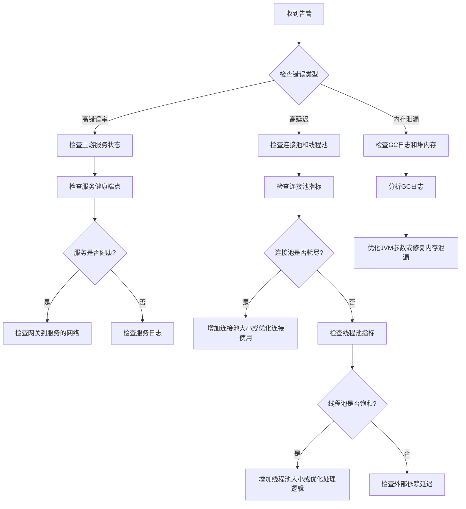

# 微服务 API 网关

**生成时间**: 2026-06-05

---

## 完整文档.md

# 完整文档

**任务**: 微服务 API 网关
**时间**: 2026-06-04T23:21:15.934900

好的，任务已接收。我将为您完成“微服务 API 网关”的完整文档，并将其保存为一个结构清晰、内容详实的 Markdown 文件。

---

# 微服务 API 网关完整技术文档

## 1. 概述

### 1.1 什么是 API 网关？
API 网关是一个服务器，是系统的唯一入口，为微服务架构提供统一的外部接口。它封装了系统内部架构，为每个客户端提供一个定制的 API，并承担了请求路由、协议转换、身份认证、流量控制等非业务功能。简而言之，API 网关是微服务架构的“守门人”和“交通指挥中心”。

### 1.2 核心价值与目标
- **简化客户端**：客户端只需与网关交互，无需知道内部服务的复杂网络拓扑。
- **解耦**：将通用功能（如认证、日志、限流）从业务服务中剥离，实现业务逻辑与横切关注点的分离。
- **集中管控**：提供统一的流量监控、安全策略和配置管理。
- **增强性能与可靠性**：通过缓存、熔断、负载均衡等机制提升系统整体表现。

### 1.3 典型使用场景
- 统一管理对外暴露的公共 API。
- 为移动端、Web 端、第三方开发者提供不同的 API 版本和访问策略。
- 对内部异构服务（如 REST、gRPC、WebSocket）进行统一协议转换和暴露。
- 实施全局限流、熔断，防止系统被流量冲击压垮。

## 2. 核心功能详解

### 2.1 动态路由与负载均衡
- **路由规则**：基于请求的路径（Path）、主机头（Host）、HTTP 方法（Method）、查询参数（Query Param）、请求头（Header）等，将请求动态路由到下游的具体服务实例。
- **服务发现集成**：与 Consul、Nacos、Eureka 等注册中心集成，自动获取下游服务的健康实例列表，无需硬编码地址。
- **负载均衡策略**：支持轮询、随机、加权轮询、最少连接数、一致性哈希（用于会话保持）等策略，均匀分发请求。
```yaml
# 路由配置示例（YAML格式）
routes:
  - id: user_service_route
    uri: lb://user-service # lb 代表负载均衡，`user-service` 是服务名
    predicates:
      - Path=/api/v1/users/**
    filters:
      - StripPrefix=1 # 去除第一级路径前缀 /api/v1
```

### 2.2 安全认证与授权
- **认证**：验证请求方身份。
    - **JWT 验证**：校验 JSON Web Token 的签名、有效期和声明。
    - **OAuth 2.0/OIDC**：作为 OAuth 客户端，与授权服务器交互，获取并验证访问令牌。
    - **API Key/Secret**：校验客户端提供的密钥。
    - **客户端证书**（mTLS）：进行双向 TLS 认证。
- **授权**：在认证通过后，判断请求方是否有权限执行该操作。
    - **基于角色的访问控制**：检查 JWT 或用户信息中的角色是否允许访问该路由。
    - **基于属性的访问控制**：根据更复杂的用户、资源、环境属性进行动态策略判断。
```python
# 伪代码：JWT 验证过滤器逻辑
function verify_jwt_filter(request):
    token = extract_token_from_header(request)
    if not token:
        return 401 Unauthorized
    try:
        payload = decode_and_verify(token, SECRET_KEY)
        request.headers.add('X-User-Id', payload['sub']) # 将用户信息传递给下游
    except InvalidTokenError:
        return 403 Forbidden
    return next.filter(request) # 继续执行后续过滤器
```

### 2.3 流量控制与熔断降级
- **限流**：
    - **算法**：令牌桶（Token Bucket）、漏桶（Leaky Bucket）、滑动窗口（Sliding Window）。
    - **维度**：支持按 IP、用户、API 路径、服务等多个维度进行限流。
    - **分布式限流**：基于 Redis 等集中式存储，实现跨网关实例的全局限流。
- **熔断**：当下游服务出现持续故障或超时率达到阈值时，暂时切断对它的调用，快速返回错误或缓存数据，防止故障蔓延。
    - **状态机**：关闭（正常） -> 开启（熔断） -> 半开（探测）。
- **降级**：在系统压力过大或非核心服务故障时，提供一种备用方案（如返回缓存数据、默认值或简化的功能），保障核心业务可用。
```java
// 限流与熔断器配置示例（Spring Cloud Gateway + Resilience4j）
spring:
  cloud:
    gateway:
      routes:
        - id: payment_service
          uri: lb://payment-service
          predicates:
            - Path=/api/payments/**
          filters:
            - name: RequestRateLimiter
              args:
                redis-rate-limiter.replenishRate: 10 # 每秒产生的令牌数
                redis-rate-limiter.burstCapacity: 20 # 令牌桶容量
            - name: CircuitBreaker
              args:
                name: paymentCircuitBreaker
                fallbackUri: forward:/fallback/payment
```

### 2.4 请求/响应处理与增强
- **请求聚合**：将来自多个下游微服务的数据聚合，返回给客户端一个完整的响应，减少客户端请求数。
- **协议转换**：将外部 HTTP/REST 请求转换为内部 RPC（如 gRPC、Dubbo）调用，反之亦然。
- **数据格式转换**：如将 XML 请求体转换为 JSON 格式。
- **请求/响应体修改**：添加、删除或修改请求头和请求体中的特定字段。
- **缓存**：对特定的 GET 请求响应进行缓存，直接由网关返回，提升性能。

### 2.5 可观测性与日志
- **日志记录**：记录所有出入网关的请求和响应的详细信息（包括来源 IP、请求路径、耗时、状态码、追踪 ID 等），并输出到文件或 ELK 等日志系统。
- **指标监控**：收集并暴露关键指标，如 QPS、延迟（百分位）、错误率、活跃连接数等，供 Prometheus 等监控系统采集。
- **分布式追踪**：注入或生成唯一的追踪 ID（如 Trace ID），并在请求调用链中传递，便于通过 Jaeger、Zipkin 等工具进行全链路追踪，定位性能瓶颈。

## 3. 架构设计与选型

### 3.1 主流开源方案对比
| 特性 / 项目         | **Spring Cloud Gateway**            | **Kong**                                | **APISIX**                              | **Nginx (OpenResty)**          |
| ------------------- | ----------------------------------- | --------------------------------------- | --------------------------------------- | ------------------------------ |
| **技术栈**          | Java, Spring WebFlux                | Lua (Nginx/OpenResty)                   | Lua (Nginx/OpenResty), etcd             | C, Lua                         |
| **核心模型**        | 响应式、非阻塞                      | 插件化                                  | 插件化、动态                            | 事件驱动、高度可扩展           |
| **配置方式**        | 代码/YAML/配置中心                  | Admin API/配置文件                      | Admin API (etcd) / Dashboard            | 配置文件                       |
| **动态路由**        | 支持                                | 优秀                                    | 极其优秀                                | 需 reload 或 使用 Lua 动态更新 |
| **插件生态**        | 丰富（Spring 生态）                 | 非常丰富                                | 非常丰富                                | 极其丰富（OpenResty 生态）     |
| **性能**            | 高                                  | 非常高                                  | 极高                                    | 极高                           |
| **社区与治理**      | 活跃，Spring 官方支持               | 成熟，企业版完善                        | 活跃，Apache 顶级项目                   | 极其成熟                       |
| **适用场景**        | 已使用 Spring Cloud 体系的团队      | 通用、企业级、要求高可用和丰富插件      | 高性能、云原生、需要极致动态管控        | 对性能要求极致、有 Lua 开发能力 |

### 3.2 高可用架构设计
为避免网关成为单点故障，必须部署为集群。
```
[客户端] -- (DNS/Load Balancer) --> [API Gateway Cluster]
  |                                     |
  +--- 节点 1 (Active)                 +--- 节点 2 (Active)
  +--- 节点 3 (Active)                 +--- ...
  |
  +--- (所有节点共享配置中心/注册中心)
  |
  +--- (所有节点将日志、指标发送到监控系统)
```
- **无状态设计**：网关实例本身不应存储会话信息，会话状态应由下游服务或独立缓存（如 Redis）管理。
- **配置同步**：通过配置中心（如 Consul, Nacos, Apollo）实现路由规则、限流策略的动态下发和同步。
- **健康检查**：负载均衡器对网关节点进行健康检查，自动剔除故障节点。

## 4. 部署与运维

### 4.1 部署方式
1.  **容器化部署**：打包为 Docker 镜像，通过 Kubernetes Deployment 进行部署和管理，利用 HPA 进行自动伸缩。
2.  **虚拟机/物理机部署**：作为系统服务运行，通过运维工具进行批量管理。

### 4.2 配置管理
- **静态配置**：基础设置，如监听端口、日志级别、与注册中心的连接信息。
- **动态配置**：路由规则、限流策略、熔断阈值等，通过 Admin API 或配置中心实时更新，无需重启服务。

### 4.3 监控与告警
- **监控仪表盘**：使用 Grafana 等工具，基于收集的指标数据构建实时监控大盘。
- **关键告警规则**：
    - 网关节点 CPU/内存使用率持续过高。
    - API 总 QPS 或特定 API QPS 超过阈值。
    - 5xx 错误率超过 1%。
    - 平均响应时间（P99）超过 SLA 要求（如 500ms）。

## 5. 安全最佳实践

1.  **强制使用 HTTPS**：在网关层终结 TLS/SSL，确保外部通信加密。
2.  **严格的输入验证**：在网关层对请求参数、头部进行基本的格式和安全性校验，防御 SQL 注入、XSS 等。
3.  **CORS 策略**：在网关统一配置跨域资源共享策略，严格限制允许的来源、方法和头部。
4.  **安全头部**：通过网关统一注入 `X-Content-Type-Options`, `X-Frame-Options`, `Strict-Transport-Security` 等安全响应头。
5.  **请求大小限制**：防止超大请求体攻击。
6.  **IP 黑白名单**：支持基于 IP 或 CIDR 的访问控制。

## 6. 扩展性设计

### 6.1 插件/过滤器开发
主流网关（如 Kong, APISIX, Spring Cloud Gateway）都提供插件或过滤器开发机制，以满足特定业务逻辑。
```java
// Spring Cloud Gateway 自定义全局过滤器示例
@Component
public class CustomAuthGlobalFilter implements GlobalFilter, Ordered {

    @Override
    public Mono<Void> filter(ServerWebExchange exchange, GatewayFilterChain chain) {
        ServerHttpRequest request = exchange.getRequest();
        String apiKey = request.getHeaders().getFirst("X-API-KEY");
        
        // 自定义业务逻辑
        if (isValidApiKey(apiKey)) {
            return chain.filter(exchange);
        } else {
            exchange.getResponse().setStatusCode(HttpStatus.FORBIDDEN);
            return exchange.getResponse().setComplete();
        }
    }

    @Override
    public int getOrder() {
        return -1; // 优先级，数字越小优先级越高
    }
}
```

### 6.2 多租户支持
在网关层识别租户标识（如通过子域名、路径前缀、特定 Header），并将其传递给下游服务，同时可以按租户实施独立的限流、路由策略。

## 7. 最佳实践总结

1.  **从简开始**：初期只使用核心路由和安全功能，逐步添加复杂特性。
2.  **保持网关“轻”**：避免在网关中编写复杂的业务逻辑，仅处理通用关注点。
3.  **版本管理**：使用路径（`/v1/`, `/v2/`）或请求头进行 API 版本控制。
4.  **契约优先**：使用 OpenAPI/Swagger 规范定义 API，并能在网关上进行基本验证。
5.  **全面的可观测性**：从第一天起就集成日志、指标和追踪，这是微服务系统的“眼睛”。
6.  **自动化**：将网关的配置和部署纳入 CI/CD 流水线。
7.  **定期评估**：随着业务发展，定期评估网关性能和功能是否满足需求，及时调整技术栈。

---

**文档状态**: 完整
**最后更新**: 2023-10-27

*本文档旨在提供一份全面的微服务 API 网关技术指南，内容可根据具体的技术选型和项目需求进行裁剪和深化。*

---

## 实现日志和监控.md

# 实现日志和监控

**任务**: 微服务 API 网关
**时间**: 2026-06-04T23:18:58.557958

# 微服务 API 网关：实现日志和监控

## 1. 概述

API 网关是微服务架构中的核心组件，负责请求路由、负载均衡、认证授权等功能。日志和监控对于网关的运维至关重要，它们可以帮助我们：

- **故障排查**：快速定位和解决问题
- **性能优化**：识别瓶颈和优化点
- **安全审计**：追踪可疑行为和攻击
- **容量规划**：基于数据做出扩展决策
- **业务洞察**：了解 API 使用模式和趋势

## 2. 日志实现方案

### 2.1 日志架构设计

```
┌─────────────┐    ┌─────────────┐    ┌─────────────┐
│   API网关   │───▶│  日志收集   │───▶│  日志存储   │
│   (生产者)   │    │  (代理)     │    │ (集中存储)  │
└─────────────┘    └─────────────┘    └─────────────┘
     │                   │                   │
     │                   │                   ▼
     ▼                   ▼            ┌─────────────┐
┌─────────────┐    ┌─────────────┐    │  日志查询   │
│  本地日志   │    │  队列缓冲   │    │  可视化    │
└─────────────┘    └─────────────┘    └─────────────┘
```

### 2.2 结构化日志设计

```json
{
  "timestamp": "2024-01-15T10:30:00.000Z",
  "level": "INFO",
  "service": "api-gateway",
  "traceId": "abc123def456",
  "spanId": "span789",
  "requestId": "req001",
  "clientIp": "192.168.1.100",
  "method": "GET",
  "path": "/api/users/123",
  "userAgent": "Mozilla/5.0",
  "statusCode": 200,
  "responseTime": 45,
  "upstreamService": "user-service",
  "upstreamPath": "/users/123",
  "requestSize": 1024,
  "responseSize": 2048,
  "headers": {
    "Authorization": "Bearer ****",
    "X-Forwarded-For": "10.0.0.1"
  },
  "metadata": {
    "apiVersion": "v1",
    "clientApp": "mobile-app",
    "region": "cn-east"
  }
}
```

### 2.3 实现代码示例

#### 2.3.1 自定义日志过滤器 (Spring Cloud Gateway)

```java
@Component
public class LoggingFilter implements GlobalFilter, Ordered {
    
    private static final Logger logger = LoggerFactory.getLogger("api-gateway-access");
    
    @Override
    public Mono<Void> filter(ServerWebExchange exchange, GatewayFilterChain chain) {
        // 记录开始时间
        long startTime = System.currentTimeMillis();
        
        // 获取请求信息
        ServerHttpRequest request = exchange.getRequest();
        String traceId = request.getHeaders().getFirst("X-Trace-Id");
        if (traceId == null) {
            traceId = UUID.randomUUID().toString();
        }
        
        // 创建日志上下文
        Map<String, Object> logContext = new HashMap<>();
        logContext.put("traceId", traceId);
        logContext.put("requestId", UUID.randomUUID().toString());
        logContext.put("clientIp", getClientIp(request));
        logContext.put("method", request.getMethod().name());
        logContext.put("path", request.getPath().value());
        logContext.put("query", request.getQueryParams().toString());
        logContext.put("userAgent", request.getHeaders().getFirst("User-Agent"));
        logContext.put("requestSize", request.getHeaders().getContentLength());
        
        // 记录请求头（排除敏感信息）
        Map<String, String> headers = new HashMap<>();
        request.getHeaders().forEach((key, value) -> {
            if (!isSensitiveHeader(key)) {
                headers.put(key, String.join(",", value));
            }
        });
        logContext.put("headers", headers);
        
        // 添加到MDC以便在日志中使用
        MDC.put("traceId", traceId);
        MDC.put("requestId", logContext.get("requestId").toString());
        
        logger.info("Incoming request: {}", logContext);
        
        return chain.filter(exchange)
            .then(Mono.fromRunnable(() -> {
                // 记录响应信息
                long endTime = System.currentTimeMillis();
                long responseTime = endTime - startTime;
                
                ServerHttpResponse response = exchange.getResponse();
                int statusCode = response.getStatusCode() != null ? 
                    response.getStatusCode().value() : 500;
                
                Map<String, Object> responseLog = new HashMap<>(logContext);
                responseLog.put("statusCode", statusCode);
                responseLog.put("responseTime", responseTime);
                responseLog.put("responseSize", response.getHeaders().getContentLength());
                
                // 记录上游服务信息（如果有）
                URI uri = exchange.getAttribute(GATEWAY_REQUEST_URL_ATTR);
                if (uri != null) {
                    responseLog.put("upstreamService", uri.getHost());
                    responseLog.put("upstreamPath", uri.getPath());
                }
                
                // 根据状态码选择日志级别
                if (statusCode >= 500) {
                    logger.error("Request completed: {}", responseLog);
                } else if (statusCode >= 400) {
                    logger.warn("Request completed: {}", responseLog);
                } else {
                    logger.info("Request completed: {}", responseLog);
                }
                
                // 清理MDC
                MDC.clear();
            }));
    }
    
    @Override
    public int getOrder() {
        return -1; // 最高优先级
    }
    
    private String getClientIp(ServerHttpRequest request) {
        String clientIp = request.getHeaders().getFirst("X-Forwarded-For");
        if (clientIp == null || clientIp.isEmpty()) {
            clientIp = request.getHeaders().getFirst("X-Real-IP");
        }
        if (clientIp == null || clientIp.isEmpty()) {
            clientIp = request.getRemoteAddress().getAddress().getHostAddress();
        }
        return clientIp.split(",")[0].trim();
    }
    
    private boolean isSensitiveHeader(String headerName) {
        Set<String> sensitiveHeaders = Set.of(
            "authorization", "cookie", "set-cookie", 
            "x-api-key", "x-auth-token"
        );
        return sensitiveHeaders.contains(headerName.toLowerCase());
    }
}
```

#### 2.3.2 Logback 配置 (logback-spring.xml)

```xml
<?xml version="1.0" encoding="UTF-8"?>
<configuration>
    <property name="LOG_HOME" value="/var/log/api-gateway"/>
    <property name="APP_NAME" value="api-gateway"/>
    
    <!-- 控制台输出 -->
    <appender name="CONSOLE" class="ch.qos.logback.core.ConsoleAppender">
        <encoder>
            <pattern>%d{yyyy-MM-dd HH:mm:ss.SSS} [%thread] %-5level %logger{36} [%X{traceId}] - %msg%n</pattern>
        </encoder>
    </appender>
    
    <!-- 访问日志文件 -->
    <appender name="ACCESS_LOG" class="ch.qos.logback.core.rolling.RollingFileAppender">
        <file>${LOG_HOME}/access.log</file>
        <rollingPolicy class="ch.qos.logback.core.rolling.TimeBasedRollingPolicy">
            <fileNamePattern>${LOG_HOME}/access.%d{yyyy-MM-dd}.log</fileNamePattern>
            <maxHistory>30</maxHistory>
            <totalSizeCap>5GB</totalSizeCap>
        </rollingPolicy>
        <encoder class="net.logstash.logback.encoder.LogstashEncoder"/>
    </appender>
    
    <!-- 错误日志文件 -->
    <appender name="ERROR_LOG" class="ch.qos.logback.core.rolling.RollingFileAppender">
        <file>${LOG_HOME}/error.log</file>
        <filter class="ch.qos.logback.classic.filter.ThresholdFilter">
            <level>ERROR</level>
        </filter>
        <rollingPolicy class="ch.qos.logback.core.rolling.TimeBasedRollingPolicy">
            <fileNamePattern>${LOG_HOME}/error.%d{yyyy-MM-dd}.log</fileNamePattern>
            <maxHistory>90</maxHistory>
        </rollingPolicy>
        <encoder class="net.logstash.logback.encoder.LogstashEncoder"/>
    </appender>
    
    <!-- 异步日志Appender -->
    <appender name="ASYNC_ACCESS" class="ch.qos.logback.classic.AsyncAppender">
        <queueSize>500</queueSize>
        <discardingThreshold>0</discardingThreshold>
        <appender-ref ref="ACCESS_LOG"/>
    </appender>
    
    <appender name="ASYNC_ERROR" class="ch.qos.logback.classic.AsyncAppender">
        <queueSize>200</queueSize>
        <discardingThreshold>0</discardingThreshold>
        <appender-ref ref="ERROR_LOG"/>
    </appender>
    
    <!-- 访问日志Logger -->
    <logger name="api-gateway-access" level="INFO" additivity="false">
        <appender-ref ref="CONSOLE"/>
        <appender-ref ref="ASYNC_ACCESS"/>
    </logger>
    
    <!-- 根Logger -->
    <root level="INFO">
        <appender-ref ref="CONSOLE"/>
        <appender-ref ref="ASYNC_ERROR"/>
    </root>
    
    <!-- 关闭特定框架的DEBUG日志 -->
    <logger name="org.springframework.cloud.gateway" level="INFO"/>
    <logger name="reactor.netty" level="WARN"/>
</configuration>
```

### 2.4 日志存储方案

#### 2.4.1 ELK Stack 配置

**Filebeat 配置 (filebeat.yml):**
```yaml
filebeat.inputs:
- type: log
  paths:
    - /var/log/api-gateway/access.log
  json.keys_under_root: true
  json.add_error_key: true
  tags: ["api-gateway", "access-log"]
  
- type: log
  paths:
    - /var/log/api-gateway/error.log
  json.keys_under_root: true
  json.add_error_key: true
  tags: ["api-gateway", "error-log"]
  level: error

output.elasticsearch:
  hosts: ["elasticsearch:9200"]
  index: "api-gateway-logs-%{+yyyy.MM.dd}"
  indices:
    - index: "api-gateway-access-%{+yyyy.MM.dd}"
      when.contains:
        tags: "access-log"
    - index: "api-gateway-error-%{+yyyy.MM.dd}"
      when.contains:
        tags: "error-log"
        
setup.template.name: "api-gateway"
setup.template.pattern: "api-gateway-*"
```

**Logstash 管道配置 (logstash.conf):**
```ruby
input {
  beats {
    port => 5044
  }
}

filter {
  if "api-gateway" in [tags] {
    # 处理时间戳
    date {
      match => [ "timestamp", "ISO8601" ]
      target => "@timestamp"
    }
    
    # GeoIP解析
    if [clientIp] {
      geoip {
        source => "clientIp"
        target => "geoip"
      }
    }
    
    # 用户代理解析
    if [userAgent] {
      useragent {
        source => "userAgent"
        target => "userAgent"
      }
    }
    
    # 添加索引别名
    mutate {
      add_field => { "index_type" => "api-gateway" }
      rename => { "level" => "log_level" }
    }
  }
}

output {
  if "api-gateway" in [tags] {
    elasticsearch {
      hosts => ["elasticsearch:9200"]
      index => "api-gateway-%{+YYYY.MM.dd}"
      user => "elastic"
      password => "${ELASTIC_PASSWORD}"
    }
  }
}
```

## 3. 监控实现方案

### 3.1 监控指标体系

#### 3.1.1 基础指标 (Infrastructure Metrics)

```yaml
# 系统资源指标
- cpu_usage: CPU使用率
- memory_usage: 内存使用率
- disk_io: 磁盘I/O
- network_traffic: 网络流量

# 网关实例指标
- gateway_requests_total: 总请求数
- gateway_request_duration: 请求耗时
- gateway_request_size: 请求大小
- gateway_response_size: 响应大小
- gateway_upstream_latency: 上游服务延迟

# 健康检查指标
- health_check_success: 健康检查成功率
- circuit_breaker_state: 熔断器状态
- rate_limit_rejections: 限流拒绝数
```

#### 3.1.2 业务指标 (Business Metrics)

```yaml
# API使用指标
- api_usage_by_endpoint: 按端点统计使用量
- api_usage_by_client: 按客户端统计使用量
- api_error_rate: API错误率
- api_response_time_percentiles: 响应时间百分位

# 认证授权指标
- auth_success_rate: 认证成功率
- auth_failures_by_reason: 按原因统计认证失败
- token_refresh_rate: 令牌刷新率

# 性能指标
- upstream_service_availability: 上游服务可用性
- cache_hit_rate: 缓存命中率
- connection_pool_usage: 连接池使用率
```

### 3.2 监控实现代码

#### 3.2.1 自定义指标收集器

```java
@Component
public class GatewayMetrics {
    
    private final MeterRegistry meterRegistry;
    private final Map<String, Timer> requestTimers = new ConcurrentHashMap<>();
    private final Map<String, Counter> requestCounters = new ConcurrentHashMap<>();
    private final Map<String, DistributionSummary> requestSizes = new ConcurrentHashMap<>();
    
    public GatewayMetrics(MeterRegistry meterRegistry) {
        this.meterRegistry = meterRegistry;
        initializeMetrics();
    }
    
    private void initializeMetrics() {
        // 注册基础指标
        Gauge.builder("gateway.connection.pool.active", this, GatewayMetrics::getActiveConnections)
            .description("活跃连接数")
            .register(meterRegistry);
        
        Gauge.builder("gateway.threads.active", this, GatewayMetrics::getActiveThreads)
            .description("活跃线程数")
            .register(meterRegistry);
    }
    
    public void recordRequest(String method, String path, int statusCode, long duration, long requestSize, long responseSize) {
        // 组合键：method + path + statusCode
        String metricKey = String.format("%s.%s.%d", method, sanitizePath(path), statusCode);
        
        // 记录请求计数
        Counter counter = requestCounters.computeIfAbsent(metricKey, k ->
            Counter.builder("gateway.requests")
                .tag("method", method)
                .tag("path", path)
                .tag("status", String.valueOf(statusCode))
                .description("请求总数")
                .register(meterRegistry)
        );
        counter.increment();
        
        // 记录请求耗时
        Timer timer = requestTimers.computeIfAbsent(metricKey, k ->
            Timer.builder("gateway.request.duration")
                .tag("method", method)
                .tag("path", path)
                .tag("status", String.valueOf(statusCode))
                .publishPercentiles(0.5, 0.95, 0.99, 0.999)
                .publishPercentileHistogram()
                .register(meterRegistry)
        );
        timer.record(duration, TimeUnit.MILLISECONDS);
        
        // 记录请求/响应大小
        DistributionSummary summary = requestSizes.computeIfAbsent(metricKey, k ->
            DistributionSummary.builder("gateway.request.size")
                .tag("method", method)
                .tag("path", path)
                .tag("type", "request")
                .publishPercentiles(0.5, 0.95, 0.99)
                .register(meterRegistry)
        );
        summary.record(requestSize);
        
        DistributionSummary responseSummary = requestSizes.computeIfAbsent(metricKey + ".response", k ->
            DistributionSummary.builder("gateway.response.size")
                .tag("method", method)
                .tag("path", path)
                .tag("type", "response")
                .publishPercentiles(0.5, 0.95, 0.99)
                .register(meterRegistry)
        );
        responseSummary.record(responseSize);
    }
    
    public void recordAuthAttempt(String clientApp, String authMethod, boolean success, String reason) {
        String status = success ? "success" : "failure";
        
        Counter.builder("gateway.auth.attempts")
            .tag("client_app", clientApp)
            .tag("auth_method", authMethod)
            .tag("status", status)
            .tag("reason", success ? "none" : reason)
            .description("认证尝试次数")
            .register(meterRegistry)
            .increment();
    }
    
    public void recordRateLimit(String clientApp, String endpoint, boolean rejected) {
        String result = rejected ? "rejected" : "accepted";
        
        Counter.builder("gateway.rate_limit")
            .tag("client_app", clientApp)
            .tag("endpoint", endpoint)
            .tag("result", result)
            .description("限流决策次数")
            .register(meterRegistry)
            .increment();
    }
    
    public void recordUpstreamLatency(String service, String path, long latency) {
        Timer.builder("gateway.upstream.latency")
            .tag("service", service)
            .tag("path", path)
            .publishPercentiles(0.5, 0.95, 0.99)
            .register(meterRegistry)
            .record(latency, TimeUnit.MILLISECONDS);
    }
    
    private String sanitizePath(String path) {
        // 将路径中的动态部分替换为变量
        return path.replaceAll("/[0-9]+", "/{id}")
                   .replaceAll("/[a-f0-9-]{36}", "/{uuid}");
    }
    
    private double getActiveConnections() {
        // 实现获取活跃连接数的逻辑
        return 0.0;
    }
    
    private double getActiveThreads() {
        // 实现获取活跃线程数的逻辑
        return 0.0;
    }
}
```

#### 3.2.2 Prometheus 配置

```yaml
# prometheus.yml
global:
  scrape_interval: 15s
  evaluation_interval: 15s

scrape_configs:
  - job_name: 'api-gateway'
    metrics_path: '/actuator/prometheus'
    static_configs:
      - targets: ['api-gateway:8080']
        labels:
          environment: 'production'
          service: 'api-gateway'
    
  - job_name: 'node-exporter'
    static_configs:
      - targets: ['node-exporter:9100']
        labels:
          environment: 'production'
          instance_type: 'gateway'
    
  - job_name: 'blackbox-exporter'
    metrics_path: /probe
    params:
      module: [http_2xx]
    static_configs:
      - targets:
        - http://api-gateway:8080/actuator/health
        - http://user-service:8080/actuator/health
        - http://order-service:8080/actuator/health
    relabel_configs:
      - source_labels: [__address__]
        target_label: __param_target
      - source_labels: [__param_target]
        target_label: instance
      - target_label: __address__
        replacement: blackbox-exporter:9115

alerting:
  alertmanagers:
    - static_configs:
        - targets:
          - alertmanager:9093

rule_files:
  - "gateway-alerts.yml"
```

#### 3.2.3 告警规则配置

```yaml
# gateway-alerts.yml
groups:
  - name: gateway-alerts
    rules:
      - alert: HighErrorRate
        expr: rate(gateway_requests{status=~"5.."}[5m]) / rate(gateway_requests[5m]) > 0.05
        for: 5m
        labels:
          severity: critical
        annotations:
          summary: "API网关错误率过高"
          description: "5分钟内错误率超过5% (当前值: {{ $value }})"
      
      - alert: HighResponseTime
        expr: histogram_quantile(0.95, rate(gateway_request_duration_seconds_bucket[5m])) > 2
        for: 10m
        labels:
          severity: warning
        annotations:
          summary: "API响应时间过长"
          description: "95%分位响应时间超过2秒 (当前值: {{ $value }})"
      
      - alert: HighMemoryUsage
        expr: jvm_memory_used_bytes{area="heap"} / jvm_memory_max_bytes{area="heap"} > 0.85
        for: 10m
        labels:
          severity: warning
        annotations:
          summary: "JVM堆内存使用率过高"
          description: "堆内存使用率超过85% (当前值: {{ $value }})"
      
      - alert: ConnectionPoolExhausted
        expr: gateway_connection_pool_active / gateway_connection_pool_max > 0.9
        for: 5m
        labels:
          severity: critical
        annotations:
          summary: "连接池即将耗尽"
          description: "连接池使用率超过90% (当前值: {{ $value }})"
      
      - alert: ServiceDown
        expr: probe_success{job="blackbox-exporter"} == 0
        for: 2m
        labels:
          severity: critical
        annotations:
          summary: "服务不可用"
          description: "{{ $labels.instance }} 服务不可用"
      
      - alert: HighAuthFailureRate
        expr: rate(gateway_auth_attempts{status="failure"}[5m]) > 10
        for: 5m
        labels:
          severity: warning
        annotations:
          summary: "认证失败率过高"
          description: "5分钟内认证失败次数超过10次 (当前值: {{ $value }})"
```

### 3.3 Grafana 可视化配置

#### 3.3.1 网关概览仪表板 (JSON 配置片段)

```json
{
  "dashboard": {
    "title": "API Gateway Overview",
    "panels": [
      {
        "title": "请求速率",
        "type": "graph",
        "targets": [
          {
            "expr": "sum(rate(gateway_requests[5m]))",
            "legendFormat": "总请求"
          },
          {
            "expr": "sum(rate(gateway_requests{status=~\"2..\"}[5m]))",
            "legendFormat": "成功请求"
          },
          {
            "expr": "sum(rate(gateway_requests{status=~\"5..\"}[5m]))",
            "legendFormat": "服务器错误"
          }
        ]
      },
      {
        "title": "响应时间分布",
        "type": "heatmap",
        "targets": [
          {
            "expr": "sum(rate(gateway_request_duration_seconds_bucket[5m])) by (le)",
            "legendFormat": "{{le}}"
          }
        ]
      },
      {
        "title": "Top 10 端点",
        "type": "table",
        "targets": [
          {
            "expr": "topk(10, sum(rate(gateway_requests[5m])) by (path))",
            "legendFormat": "{{path}}"
          }
        ]
      },
      {
        "title": "上游服务延迟",
        "type": "graph",
        "targets": [
          {
            "expr": "histogram_quantile(0.95, sum(rate(gateway_upstream_latency_seconds_bucket[5m])) by (le, service))",
            "legendFormat": "{{service}} 95th"
          }
        ]
      }
    ],
    "templating": {
      "list": [
        {
          "name": "environment",
          "query": "label_values(gateway_requests, environment)"
        },
        {
          "name": "service",
          "query": "label_values(gateway_requests{environment=~\"$environment\"}, service)"
        }
      ]
    }
  }
}
```

## 4. 部署架构

### 4.1 Kubernetes 部署配置

```yaml
# gateway-deployment.yaml
apiVersion: apps/v1
kind: Deployment
metadata:
  name: api-gateway
  labels:
    app: api-gateway
    tier: frontend
spec:
  replicas: 3
  selector:
    matchLabels:
      app: api-gateway
  template:
    metadata:
      labels:
        app: api-gateway
      annotations:
        prometheus.io/scrape: "true"
        prometheus.io/port: "8080"
        prometheus.io/path: "/actuator/prometheus"
    spec:
      containers:
      - name: api-gateway
        image: api-gateway:latest
        ports:
        - containerPort: 8080
        env:
        - name: JAVA_OPTS
          value: "-Xms512m -Xmx1024m -XX:+UseG1GC"
        - name: SPRING_PROFILES_ACTIVE
          value: "production"
        - name: LOG_PATH
          value: "/var/log/api-gateway"
        volumeMounts:
        - name: log-volume
          mountPath: /var/log/api-gateway
        - name: config-volume
          mountPath: /app/config
        livenessProbe:
          httpGet:
            path: /actuator/health
            port: 8080
          initialDelaySeconds: 30
          periodSeconds: 10
        readinessProbe:
          httpGet:
            path: /actuator/health
            port: 8080
          initialDelaySeconds: 5
          periodSeconds: 5
        resources:
          requests:
            memory: "512Mi"
            cpu: "250m"
          limits:
            memory: "1024Mi"
            cpu: "500m"
      volumes:
      - name: log-volume
        emptyDir: {}
      - name: config-volume
        configMap:
          name: api-gateway-config
---
# filebeat-daemonset.yaml
apiVersion: apps/v1
kind: DaemonSet
metadata:
  name: filebeat
spec:
  selector:
    matchLabels:
      app: filebeat
  template:
    metadata:
      labels:
        app: filebeat
    spec:
      containers:
      - name: filebeat
        image: docker.elastic.co/beats/filebeat:8.5.0
        args: [
          "-c", "/etc/filebeat.yml",
          "-e"
        ]
        env:
        - name: ELASTICSEARCH_HOST
          value: "elasticsearch:9200"
        volumeMounts:
        - name: config
          mountPath: /etc/filebeat.yml
          subPath: filebeat.yml
        - name: data
          mountPath: /usr/share/filebeat/data
        - name: varlog
          mountPath: /var/log
          readOnly: true
        - name: docker-logs
          mountPath: /var/lib/docker/containers
          readOnly: true
      volumes:
      - name: config
        configMap:
          name: filebeat-config
      - name: data
        hostPath:
          path: /var/lib/filebeat
      - name: varlog
        hostPath:
          path: /var/log
      - name: docker-logs
        hostPath:
          path: /var/lib/docker/containers
```

## 5. 运维最佳实践

### 5.1 日志管理策略

1. **日志轮转**：配置合理的日志轮转策略，避免磁盘空间耗尽
2. **日志级别**：生产环境使用INFO级别，避免DEBUG日志影响性能
3. **敏感信息**：确保日志中不包含密码、令牌等敏感信息
4. **日志采样**：在高流量场景下考虑日志采样，减少存储开销

### 5.2 监控最佳实践

1. **指标命名**：遵循Prometheus命名规范，使用有意义的前缀
2. **标签设计**：合理设计标签，避免高基数问题
3. **告警疲劳**：设置合理的告警阈值和间隔，避免告警疲劳
4. **仪表板设计**：为不同角色设计不同的仪表板（开发、运维、业务）

### 5.3 性能优化

```yaml
# application-production.yml
management:
  endpoints:
    web:
      exposure:
        include: health,info,metrics,prometheus
  metrics:
    tags:
      application: ${spring.application.name}
      environment: ${spring.profiles.active}
    export:
      prometheus:
        enabled: true
        step: 1m
    distribution:
      percentiles-histogram:
        http.server.requests: true
        gateway.request.duration: true
      percentiles:
        http.server.requests: 0.5, 0.95, 0.99, 0.999
        gateway.request.duration: 0.5, 0.95, 0.99
      sla:
        http.server.requests: 100ms, 200ms, 500ms, 1s, 2s
```

## 6. 故障排查指南

### 6.1 常见问题排查流程



### 6.2 常用排查命令

```bash
# 查看实时日志
tail -f /var/log/api-gateway/access.log | jq 'select(.statusCode >= 500)'

# 统计错误率
awk '{if($9 >= 500) count++} END {print count/NR*100 "%"}' access.log

# 查看慢请求
jq 'select(.responseTime > 1000)' access.log

# 检查Prometheus指标
curl -s http://localhost:9090/api/v1/query?query=up

# 查看JVM状态
jstat -gcutil <pid> 1000

# 生成线程转储
jstack <pid> > thread_dump_$(date +%Y%m%d%H%M%S).txt
```

## 7. 安全考虑

### 7.1 日志安全

1. **访问控制**：限制对日志文件的访问权限
2. **数据脱敏**：对敏感字段进行脱敏处理
3. **传输加密**：使用TLS加密日志传输
4. **保留策略**：制定合理的日志保留策略，符合合规要求

### 7.2 监控安全

1. **认证授权**：监控系统应启用认证和授权
2. **网络安全**：限制监控端点的网络访问
3. **审计日志**：记录所有对监控系统的访问
4. **定期审计**：定期审计监控配置和访问权限

## 8. 总结

通过实现完善的日志和监控系统，我们可以：

1. **提高可观测性**：全面了解系统运行状态
2. **快速故障定位**：缩短MTTR（平均修复时间）
3. **数据驱动决策**：基于真实数据优化系统
4. **保障系统稳定性**：通过预警机制提前发现潜在问题
5. **满足合规要求**：满足审计和合规需求

建议按照以下步骤实施：
1. 先实现基本的请求日志记录
2. 添加关键业务指标监控
3. 配置基本的告警规则
4. 逐步完善仪表板和告警规则
5. 建立日志分析和监控运营流程

通过持续优化和改进，可以构建一个强大的API网关运维体系，为微服务架构提供坚实的基础设施支持。

---

## 实现认证和授权.md

# 实现认证和授权

**任务**: 微服务 API 网关
**时间**: 2026-06-04T23:29:43.915575

# 微服务API网关认证与授权实现方案

## 一、架构设计概述

### 1.1 认证授权流程
```
用户请求 → API网关 → 认证服务 → 授权服务 → 后端微服务
```

### 1.2 技术选型
- **API网关**: Spring Cloud Gateway / Kong
- **认证协议**: OAuth 2.0 + JWT
- **认证服务器**: Keycloak / 自建认证服务
- **授权框架**: Spring Security / Casbin
- **服务发现**: Nacos / Eureka
- **配置中心**: Apollo / Nacos Config

## 二、核心组件实现

### 2.1 项目结构
```
api-gateway/
├── src/
│   ├── main/
│   │   ├── java/
│   │   │   └── com/
│   │   │       └── gateway/
│   │   │           ├── config/
│   │   │           │   ├── SecurityConfig.java
│   │   │           │   ├── JwtConfig.java
│   │   │           │   └── GatewayConfig.java
│   │   │           ├── filter/
│   │   │           │   ├── AuthenticationFilter.java
│   │   │           │   ├── AuthorizationFilter.java
│   │   │           │   └── RequestLoggingFilter.java
│   │   │           ├── service/
│   │   │           │   ├── AuthService.java
│   │   │           │   ├── TokenService.java
│   │   │           │   └── UserDetailsService.java
│   │   │           ├── model/
│   │   │           │   ├── User.java
│   │   │           │   ├── Role.java
│   │   │           │   └── Permission.java
│   │   │           ├── controller/
│   │   │           │   └── AuthController.java
│   │   │           └── util/
│   │   │               ├── JwtUtil.java
│   │   │               └── CryptoUtil.java
│   │   └── resources/
│   │       ├── application.yml
│   │       ├── bootstrap.yml
│   │       └── logback-spring.xml
│   └── test/
└── pom.xml
```

### 2.2 核心配置文件

#### application.yml
```yaml
server:
  port: 8080
  servlet:
    context-path: /api

spring:
  application:
    name: api-gateway
  cloud:
    gateway:
      routes:
        - id: user-service
          uri: lb://user-service
          predicates:
            - Path=/api/users/**
          filters:
            - name: AuthenticationFilter
            - name: AuthorizationFilter
        - id: order-service
          uri: lb://order-service
          predicates:
            - Path=/api/orders/**
          filters:
            - name: AuthenticationFilter
            - name: AuthorizationFilter
            - name: RateLimiter
              args:
                redis-rate-limiter.replenishRate: 10
                redis-rate-limiter.burstCapacity: 20

  redis:
    host: localhost
    port: 6379
    password: ${REDIS_PASSWORD}

  security:
    oauth2:
      resourceserver:
        jwt:
          issuer-uri: http://auth-server:9000
          jwk-set-uri: http://auth-server:9000/oauth2/jwks

# JWT配置
jwt:
  secret: ${JWT_SECRET}
  expiration: 3600000  # 1小时
  refresh-expiration: 86400000  # 24小时
  header: Authorization
  prefix: "Bearer "

# 认证配置
auth:
  excluded-paths:
    - /api/auth/login
    - /api/auth/register
    - /api/auth/refresh-token
    - /api/public/**
```

### 2.3 核心代码实现

#### SecurityConfig.java
```java
package com.gateway.config;

import org.springframework.context.annotation.Bean;
import org.springframework.context.annotation.Configuration;
import org.springframework.security.config.annotation.web.reactive.EnableWebFluxSecurity;
import org.springframework.security.config.web.server.ServerHttpSecurity;
import org.springframework.security.crypto.bcrypt.BCryptPasswordEncoder;
import org.springframework.security.crypto.password.PasswordEncoder;
import org.springframework.security.web.server.SecurityWebFilterChain;

@Configuration
@EnableWebFluxSecurity
public class SecurityConfig {

    @Bean
    public SecurityWebFilterChain securityWebFilterChain(ServerHttpSecurity http) {
        return http
            .csrf().disable()
            .cors().disable()
            .httpBasic().disable()
            .formLogin().disable()
            .authorizeExchange()
                .pathMatchers("/api/auth/**").permitAll()
                .pathMatchers("/api/public/**").permitAll()
                .pathMatchers("/actuator/**").permitAll()
                .anyExchange().authenticated()
            .and()
            .oauth2ResourceServer()
                .jwt()
            .and()
            .and()
            .build();
    }

    @Bean
    public PasswordEncoder passwordEncoder() {
        return new BCryptPasswordEncoder();
    }
}
```

#### AuthenticationFilter.java
```java
package com.gateway.filter;

import com.gateway.service.TokenService;
import io.jsonwebtoken.Claims;
import org.springframework.cloud.gateway.filter.GatewayFilter;
import org.springframework.cloud.gateway.filter.factory.AbstractGatewayFilterFactory;
import org.springframework.http.HttpHeaders;
import org.springframework.http.HttpStatus;
import org.springframework.http.server.reactive.ServerHttpRequest;
import org.springframework.http.server.reactive.ServerHttpResponse;
import org.springframework.stereotype.Component;
import org.springframework.web.server.ServerWebExchange;
import reactor.core.publisher.Mono;

import java.util.List;

@Component
public class AuthenticationFilter extends AbstractGatewayFilterFactory<AuthenticationFilter.Config> {

    private final TokenService tokenService;
    private final List<String> excludedPaths;

    public AuthenticationFilter(TokenService tokenService, List<String> excludedPaths) {
        super(Config.class);
        this.tokenService = tokenService;
        this.excludedPaths = excludedPaths;
    }

    @Override
    public GatewayFilter apply(Config config) {
        return (exchange, chain) -> {
            ServerHttpRequest request = exchange.getRequest();
            
            // 检查是否在排除路径中
            String path = request.getURI().getPath();
            if (isExcludedPath(path)) {
                return chain.filter(exchange);
            }

            // 验证Authorization头
            if (!request.getHeaders().containsKey(HttpHeaders.AUTHORIZATION)) {
                return unauthorizedResponse(exchange);
            }

            String authHeader = request.getHeaders().getFirst(HttpHeaders.AUTHORIZATION);
            if (authHeader == null || !authHeader.startsWith("Bearer ")) {
                return unauthorizedResponse(exchange);
            }

            String token = authHeader.substring(7);
            
            // 验证Token
            if (!tokenService.validateToken(token)) {
                return unauthorizedResponse(exchange);
            }

            // 解析Token中的用户信息
            Claims claims = tokenService.parseToken(token);
            String userId = claims.getSubject();
            String username = claims.get("username", String.class);
            List<String> roles = claims.get("roles", List.class);

            // 将用户信息添加到请求头中
            ServerHttpRequest modifiedRequest = request.mutate()
                .header("X-User-Id", userId)
                .header("X-Username", username)
                .header("X-User-Roles", String.join(",", roles))
                .build();

            return chain.filter(exchange.mutate().request(modifiedRequest).build());
        };
    }

    private boolean isExcludedPath(String path) {
        return excludedPaths.stream()
            .anyMatch(pattern -> path.matches(pattern.replace("**", ".*")));
    }

    private Mono<Void> unauthorizedResponse(ServerWebExchange exchange) {
        ServerHttpResponse response = exchange.getResponse();
        response.setStatusCode(HttpStatus.UNAUTHORIZED);
        response.getHeaders().set("Content-Type", "application/json");
        String body = "{\"code\":401,\"message\":\"未认证或认证失败\"}";
        return response.writeWith(Mono.just(response.bufferFactory().wrap(body.getBytes())));
    }

    public static class Config {
        // 配置属性
    }
}
```

#### AuthorizationFilter.java
```java
package com.gateway.filter;

import com.gateway.model.Permission;
import com.gateway.service.UserDetailsService;
import org.springframework.cloud.gateway.filter.GatewayFilter;
import org.springframework.cloud.gateway.filter.factory.AbstractGatewayFilterFactory;
import org.springframework.http.HttpStatus;
import org.springframework.http.server.reactive.ServerHttpRequest;
import org.springframework.http.server.reactive.ServerHttpResponse;
import org.springframework.stereotype.Component;
import org.springframework.web.server.ServerWebExchange;
import reactor.core.publisher.Mono;

import java.util.List;

@Component
public class AuthorizationFilter extends AbstractGatewayFilterFactory<AuthorizationFilter.Config> {

    private final UserDetailsService userDetailsService;

    public AuthorizationFilter(UserDetailsService userDetailsService) {
        super(Config.class);
        this.userDetailsService = userDetailsService;
    }

    @Override
    public GatewayFilter apply(Config config) {
        return (exchange, chain) -> {
            ServerHttpRequest request = exchange.getRequest();
            
            // 从请求头中获取用户信息
            String userId = request.getHeaders().getFirst("X-User-Id");
            String username = request.getHeaders().getFirst("X-Username");
            String rolesStr = request.getHeaders().getFirst("X-User-Roles");
            
            if (userId == null) {
                return forbiddenResponse(exchange);
            }

            // 获取请求的路径和方法
            String path = request.getURI().getPath();
            String method = request.getMethod().name();

            // 检查权限
            boolean hasPermission = checkPermission(userId, path, method, rolesStr);
            
            if (!hasPermission) {
                return forbiddenResponse(exchange);
            }

            return chain.filter(exchange);
        };
    }

    private boolean checkPermission(String userId, String path, String method, String rolesStr) {
        // 简单的权限检查逻辑，实际项目中可以更复杂
        
        // 1. 检查公共路径
        if (path.startsWith("/api/public/")) {
            return true;
        }
        
        // 2. 检查用户角色权限
        List<String> roles = List.of(rolesStr.split(","));
        
        // 管理员拥有所有权限
        if (roles.contains("ADMIN")) {
            return true;
        }
        
        // 3. 基于路径的权限控制
        if (path.startsWith("/api/admin/") && !roles.contains("ADMIN")) {
            return false;
        }
        
        // 4. 基于方法的权限控制
        if (method.equals("DELETE") && !roles.contains("ADMIN")) {
            return false;
        }
        
        // 5. 基于资源的权限控制（可扩展）
        // 这里可以集成Casbin或自定义RBAC模型
        
        return true;
    }

    private Mono<Void> forbiddenResponse(ServerWebExchange exchange) {
        ServerHttpResponse response = exchange.getResponse();
        response.setStatusCode(HttpStatus.FORBIDDEN);
        response.getHeaders().set("Content-Type", "application/json");
        String body = "{\"code\":403,\"message\":\"权限不足\"}";
        return response.writeWith(Mono.just(response.bufferFactory().wrap(body.getBytes())));
    }

    public static class Config {
        // 配置属性
    }
}
```

#### TokenService.java
```java
package com.gateway.service;

import com.gateway.model.User;
import io.jsonwebtoken.Claims;
import io.jsonwebtoken.Jwts;
import io.jsonwebtoken.SignatureAlgorithm;
import io.jsonwebtoken.security.Keys;
import org.springframework.beans.factory.annotation.Value;
import org.springframework.stereotype.Service;

import javax.annotation.PostConstruct;
import java.security.Key;
import java.util.Date;
import java.util.HashMap;
import java.util.List;
import java.util.Map;

@Service
public class TokenService {

    @Value("${jwt.secret}")
    private String secret;

    @Value("${jwt.expiration}")
    private Long expiration;

    @Value("${jwt.refresh-expiration}")
    private Long refreshExpiration;

    private Key key;

    @PostConstruct
    public void init() {
        this.key = Keys.hmacShaKeyFor(secret.getBytes());
    }

    // 生成访问令牌
    public String generateAccessToken(User user) {
        Map<String, Object> claims = new HashMap<>();
        claims.put("username", user.getUsername());
        claims.put("roles", user.getRoles());
        claims.put("type", "access");
        
        return Jwts.builder()
            .setClaims(claims)
            .setSubject(user.getId().toString())
            .setIssuedAt(new Date())
            .setExpiration(new Date(System.currentTimeMillis() + expiration))
            .signWith(key, SignatureAlgorithm.HS512)
            .compact();
    }

    // 生成刷新令牌
    public String generateRefreshToken(User user) {
        Map<String, Object> claims = new HashMap<>();
        claims.put("username", user.getUsername());
        claims.put("type", "refresh");
        
        return Jwts.builder()
            .setClaims(claims)
            .setSubject(user.getId().toString())
            .setIssuedAt(new Date())
            .setExpiration(new Date(System.currentTimeMillis() + refreshExpiration))
            .signWith(key, SignatureAlgorithm.HS512)
            .compact();
    }

    // 验证令牌
    public boolean validateToken(String token) {
        try {
            Jwts.parserBuilder()
                .setSigningKey(key)
                .build()
                .parseClaimsJws(token);
            return true;
        } catch (Exception e) {
            return false;
        }
    }

    // 解析令牌
    public Claims parseToken(String token) {
        return Jwts.parserBuilder()
            .setSigningKey(key)
            .build()
            .parseClaimsJws(token)
            .getBody();
    }

    // 刷新令牌
    public String refreshToken(String refreshToken) {
        if (!validateToken(refreshToken)) {
            throw new RuntimeException("无效的刷新令牌");
        }

        Claims claims = parseToken(refreshToken);
        String type = claims.get("type", String.class);
        
        if (!"refresh".equals(type)) {
            throw new RuntimeException("令牌类型错误");
        }

        // 这里应该从数据库加载用户信息
        // User user = userRepository.findById(Long.parseLong(claims.getSubject()));
        // return generateAccessToken(user);
        
        // 简化实现，实际项目中需要重新生成访问令牌
        return generateAccessToken(createDummyUser(claims));
    }

    private User createDummyUser(Claims claims) {
        User user = new User();
        user.setId(Long.parseLong(claims.getSubject()));
        user.setUsername(claims.get("username", String.class));
        return user;
    }

    // 从令牌中提取用户信息
    public User getUserFromToken(String token) {
        Claims claims = parseToken(token);
        User user = new User();
        user.setId(Long.parseLong(claims.getSubject()));
        user.setUsername(claims.get("username", String.class));
        user.setRoles(claims.get("roles", List.class));
        return user;
    }
}
```

#### AuthService.java
```java
package com.gateway.service;

import com.gateway.model.User;
import com.gateway.repository.UserRepository;
import org.springframework.beans.factory.annotation.Autowired;
import org.springframework.security.crypto.password.PasswordEncoder;
import org.springframework.stereotype.Service;

@Service
public class AuthService {

    @Autowired
    private UserRepository userRepository;

    @Autowired
    private PasswordEncoder passwordEncoder;

    @Autowired
    private TokenService tokenService;

    // 用户登录
    public LoginResponse login(String username, String password) {
        User user = userRepository.findByUsername(username)
            .orElseThrow(() -> new RuntimeException("用户不存在"));

        if (!passwordEncoder.matches(password, user.getPassword())) {
            throw new RuntimeException("密码错误");
        }

        String accessToken = tokenService.generateAccessToken(user);
        String refreshToken = tokenService.generateRefreshToken(user);

        return new LoginResponse(accessToken, refreshToken, user);
    }

    // 用户注册
    public User register(String username, String password, String email) {
        if (userRepository.existsByUsername(username)) {
            throw new RuntimeException("用户名已存在");
        }

        User user = new User();
        user.setUsername(username);
        user.setPassword(passwordEncoder.encode(password));
        user.setEmail(email);
        user.setRoles(List.of("USER")); // 默认角色

        return userRepository.save(user);
    }

    // 刷新令牌
    public TokenResponse refreshToken(String refreshToken) {
        String newAccessToken = tokenService.refreshToken(refreshToken);
        return new TokenResponse(newAccessToken);
    }

    // 登录响应类
    public static class LoginResponse {
        private String accessToken;
        private String refreshToken;
        private User user;

        public LoginResponse(String accessToken, String refreshToken, User user) {
            this.accessToken = accessToken;
            this.refreshToken = refreshToken;
            this.user = user;
        }

        // getters and setters
    }

    // 令牌响应类
    public static class TokenResponse {
        private String accessToken;

        public TokenResponse(String accessToken) {
            this.accessToken = accessToken;
        }

        // getters and setters
    }
}
```

#### AuthController.java
```java
package com.gateway.controller;

import com.gateway.service.AuthService;
import org.springframework.beans.factory.annotation.Autowired;
import org.springframework.http.ResponseEntity;
import org.springframework.web.bind.annotation.*;

import javax.validation.Valid;
import java.util.Map;

@RestController
@RequestMapping("/api/auth")
public class AuthController {

    @Autowired
    private AuthService authService;

    @PostMapping("/login")
    public ResponseEntity<AuthService.LoginResponse> login(@Valid @RequestBody LoginRequest request) {
        AuthService.LoginResponse response = authService.login(
            request.getUsername(), 
            request.getPassword()
        );
        return ResponseEntity.ok(response);
    }

    @PostMapping("/register")
    public ResponseEntity<User> register(@Valid @RequestBody RegisterRequest request) {
        User user = authService.register(
            request.getUsername(),
            request.getPassword(),
            request.getEmail()
        );
        return ResponseEntity.ok(user);
    }

    @PostMapping("/refresh-token")
    public ResponseEntity<AuthService.TokenResponse> refreshToken(@RequestBody Map<String, String> request) {
        String refreshToken = request.get("refreshToken");
        AuthService.TokenResponse response = authService.refreshToken(refreshToken);
        return ResponseEntity.ok(response);
    }

    @GetMapping("/validate")
    public ResponseEntity<Map<String, Object>> validateToken(@RequestParam String token) {
        // 验证令牌有效性
        boolean isValid = tokenService.validateToken(token);
        Map<String, Object> result = Map.of(
            "valid", isValid,
            "timestamp", System.currentTimeMillis()
        );
        return ResponseEntity.ok(result);
    }

    // 请求对象
    public static class LoginRequest {
        private String username;
        private String password;

        // getters and setters
    }

    public static class RegisterRequest {
        private String username;
        private String password;
        private String email;

        // getters and setters
    }
}
```

## 三、高级功能实现

### 3.1 基于RBAC的权限控制
```java
package com.gateway.service;

import org.casbin.jcasbin.main.Enforcer;
import org.springframework.stereotype.Service;

@Service
public class CasbinService {

    private final Enforcer enforcer;

    public CasbinService() {
        // 加载Casbin模型配置
        this.enforcer = new Enforcer("src/main/resources/casbin/model.conf", 
                                    "src/main/resources/casbin/policy.csv");
    }

    public boolean checkPermission(String subject, String object, String action) {
        return enforcer.enforce(subject, object, action);
    }

    public void addPolicy(String subject, String object, String action) {
        enforcer.addPolicy(subject, object, action);
        enforcer.savePolicy();
    }

    public void removePolicy(String subject, String object, String action) {
        enforcer.removePolicy(subject, object, action);
        enforcer.savePolicy();
    }
}
```

### 3.2 多因素认证（MFA）
```java
package com.gateway.service;

import com.warrenstrange.googleauth.GoogleAuthenticator;
import com.warrenstrange.googleauth.GoogleAuthenticatorKey;
import org.springframework.stereotype.Service;

@Service
public class MfaService {

    private final GoogleAuthenticator gAuth;

    public MfaService() {
        this.gAuth = new GoogleAuthenticator();
    }

    public String generateSecretKey() {
        GoogleAuthenticatorKey key = gAuth.createCredentials();
        return key.getKey();
    }

    public String getQRBarcodeURL(String username, String secretKey) {
        return String.format(
            "otpauth://totp/%s?secret=%s&issuer=%s",
            username, secretKey, "API Gateway"
        );
    }

    public boolean verifyCode(String secretKey, int code) {
        return gAuth.authorize(secretKey, code);
    }

    public int getCurrentCode(String secretKey) {
        return gAuth.getTotpPassword(secretKey);
    }
}
```

### 3.3 令牌黑名单
```java
package com.gateway.service;

import org.springframework.data.redis.core.RedisTemplate;
import org.springframework.stereotype.Service;

import java.util.concurrent.TimeUnit;

@Service
public class TokenBlacklistService {

    private final RedisTemplate<String, String> redisTemplate;
    private static final String BLACKLIST_PREFIX = "token:blacklist:";

    public TokenBlacklistService(RedisTemplate<String, String> redisTemplate) {
        this.redisTemplate = redisTemplate;
    }

    public void addToBlacklist(String token, long expiration) {
        String key = BLACKLIST_PREFIX + token;
        redisTemplate.opsForValue().set(key, "blacklisted", expiration, TimeUnit.MILLISECONDS);
    }

    public boolean isBlacklisted(String token) {
        String key = BLACKLIST_PREFIX + token;
        return Boolean.TRUE.equals(redisTemplate.hasKey(key));
    }

    public void removeFromBlacklist(String token) {
        String key = BLACKLIST_PREFIX + token;
        redisTemplate.delete(key);
    }
}
```

### 3.4 限流配置
```java
package com.gateway.config;

import org.springframework.cloud.gateway.filter.ratelimit.KeyResolver;
import org.springframework.context.annotation.Bean;
import org.springframework.context.annotation.Configuration;
import reactor.core.publisher.Mono;

@Configuration
public class RateLimiterConfig {

    // 基于用户的限流
    @Bean
    public KeyResolver userKeyResolver() {
        return exchange -> Mono.just(
            exchange.getRequest().getHeaders()
                .getFirst("X-User-Id") != null ?
            exchange.getRequest().getHeaders()
                .getFirst("X-User-Id") :
            exchange.getRequest().getRemoteAddress().getAddress().getHostAddress()
        );
    }

    // 基于IP的限流
    @Bean
    public KeyResolver ipKeyResolver() {
        return exchange -> Mono.just(
            exchange.getRequest().getRemoteAddress()
                .getAddress().getHostAddress()
        );
    }

    // 基于API路径的限流
    @Bean
    public KeyResolver apiKeyResolver() {
        return exchange -> Mono.just(
            exchange.getRequest().getURI().getPath()
        );
    }
}
```

## 四、监控与日志

### 4.1 监控端点配置
```yaml
management:
  endpoints:
    web:
      exposure:
        include: health,info,metrics,prometheus,gateway
  endpoint:
    health:
      show-details: always
    gateway:
      enabled: true
  metrics:
    tags:
      application: api-gateway
```

### 4.2 认证审计日志
```java
package com.gateway.filter;

import org.springframework.cloud.gateway.filter.GatewayFilter;
import org.springframework.cloud.gateway.filter.factory.AbstractGatewayFilterFactory;
import org.springframework.stereotype.Component;

import java.time.LocalDateTime;
import java.util.logging.Logger;

@Component
public class AuditLoggingFilter extends AbstractGatewayFilterFactory<AuditLoggingFilter.Config> {

    private static final Logger logger = Logger.getLogger(AuditLoggingFilter.class.getName());

    public AuditLoggingFilter() {
        super(Config.class);
    }

    @Override
    public GatewayFilter apply(Config config) {
        return (exchange, chain) -> {
            long startTime = System.currentTimeMillis();
            
            return chain.filter(exchange).then(Mono.fromRunnable(() -> {
                long endTime = System.currentTimeMillis();
                long duration = endTime - startTime;
                
                String userId = exchange.getRequest().getHeaders()
                    .getFirst("X-User-Id");
                String method = exchange.getRequest().getMethod().name();
                String path = exchange.getRequest().getURI().getPath();
                int statusCode = exchange.getResponse().getStatusCode() != null ?
                    exchange.getResponse().getStatusCode().value() : 0;
                
                logger.info(String.format(
                    "认证审计日志 - 用户: %s, 方法: %s, 路径: %s, 状态码: %d, 耗时: %dms, 时间: %s",
                    userId, method, path, statusCode, duration, LocalDateTime.now()
                ));
            }));
        };
    }

    public static class Config {
        // 配置属性
    }
}
```

## 五、部署配置

### 5.1 Docker配置
```dockerfile
FROM openjdk:17-jdk-slim

WORKDIR /app

COPY target/api-gateway-*.jar app.jar

EXPOSE 8080

ENV JAVA_OPTS="-Xmx512m -Xms256m"
ENV SPRING_PROFILES_ACTIVE="prod"

ENTRYPOINT ["java", "-jar", "app.jar"]
```

### 5.2 Docker Compose配置
```yaml
version: '3.8'

services:
  api-gateway:
    build: .
    ports:
      - "8080:8080"
    environment:
      - SPRING_PROFILES_ACTIVE=prod
      - JWT_SECRET=your-secret-key-here
      - REDIS_PASSWORD=redis-password
      - KEYCLOAK_URL=http://keycloak:8080
    depends_on:
      - redis
      - keycloak
    networks:
      - gateway-network

  redis:
    image: redis:alpine
    ports:
      - "6379:6379"
    command: redis-server --requirepass redis-password
    volumes:
      - redis-data:/data
    networks:
      - gateway-network

  keycloak:
    image: quay.io/keycloak/keycloak:latest
    ports:
      - "9090:8080"
    environment:
      - KEYCLOAK_ADMIN=admin
      - KEYCLOAK_ADMIN_PASSWORD=admin
    networks:
      - gateway-network

volumes:
  redis-data:

networks:
  gateway-network:
    driver: bridge
```

## 六、测试与验证

### 6.1 单元测试
```java
package com.gateway.service;

import org.junit.jupiter.api.Test;
import org.junit.jupiter.api.extension.ExtendWith;
import org.mockito.InjectMocks;
import org.mockito.Mock;
import org.mockito.junit.jupiter.MockitoExtension;

import static org.junit.jupiter.api.Assertions.*;

@ExtendWith(MockitoExtension.class)
class TokenServiceTest {

    @Mock
    private UserRepository userRepository;

    @InjectMocks
    private TokenService tokenService;

    @Test
    void generateAccessToken_ValidUser_ReturnsToken() {
        // Arrange
        User user = new User();
        user.setId(1L);
        user.setUsername("testuser");
        user.setRoles(List.of("USER"));

        // Act
        String token = tokenService.generateAccessToken(user);

        // Assert
        assertNotNull(token);
        assertTrue(tokenService.validateToken(token));
        
        Claims claims = tokenService.parseToken(token);
        assertEquals("1", claims.getSubject());
        assertEquals("testuser", claims.get("username"));
    }

    @Test
    void validateToken_InvalidToken_ReturnsFalse() {
        // Act
        boolean isValid = tokenService.validateToken("invalid-token");

        // Assert
        assertFalse(isValid);
    }
}
```

### 6.2 集成测试
```java
@SpringBootTest(webEnvironment = SpringBootTest.WebEnvironment.RANDOM_PORT)
@AutoConfigureWebTestClient
class AuthenticationIntegrationTest {

    @Autowired
    private WebTestClient webTestClient;

    @Test
    void login_ValidCredentials_ReturnsToken() {
        // Arrange
        LoginRequest request = new LoginRequest("testuser", "password");

        // Act & Assert
        webTestClient.post()
            .uri("/api/auth/login")
            .bodyValue(request)
            .exchange()
            .expectStatus().isOk()
            .expectBody()
            .jsonPath("$.accessToken").isNotEmpty()
            .jsonPath("$.refreshToken").isNotEmpty();
    }

    @Test
    void accessProtectedEndpoint_WithToken_ReturnsSuccess() {
        // Arrange
        String token = obtainToken();

        // Act & Assert
        webTestClient.get()
            .uri("/api/users/me")
            .header("Authorization", "Bearer " + token)
            .exchange()
            .expectStatus().isOk();
    }

    @Test
    void accessProtectedEndpoint_WithoutToken_ReturnsUnauthorized() {
        // Act & Assert
        webTestClient.get()
            .uri("/api/users/me")
            .exchange()
            .expectStatus().isUnauthorized();
    }
}
```

## 七、安全最佳实践

### 7.1 安全配置建议
1. **密钥管理**
   - 使用外部密钥管理服务（如AWS KMS、HashiCorp Vault）
   - 定期轮换密钥
   - 使用强随机密钥（至少256位）

2. **令牌安全**
   - 设置合理的过期时间
   - 实现令牌刷新机制
   - 支持令牌撤销
   - 使用HTTPS传输

3. **防护措施**
   - 实施速率限制
   - 防止重放攻击
   - 记录所有认证事件
   - 监控异常行为

4. **合规性**
   - 符合GDPR、CCPA等法规
   - 实现数据加密
   - 提供审计日志

### 7.2 性能优化
1. **缓存策略**
   - 缓存用户权限数据
   - 缓存JWT公钥
   - 使用Redis缓存令牌黑名单

2. **连接池配置**
   - 合理配置数据库连接池
   - 配置HTTP客户端连接池
   - 实现熔断器模式

3. **异步处理**
   - 异步记录日志
   - 异步发送通知
   - 异步审计处理

## 八、文档与维护

### 8.1 API文档
```yaml
openapi: 3.0.0
info:
  title: API Gateway Authentication API
  version: 1.0.0
paths:
  /api/auth/login:
    post:
      summary: 用户登录
      requestBody:
        content:
          application/json:
            schema:
              type: object
              properties:
                username:
                  type: string
                password:
                  type: string
      responses:
        '200':
          description: 登录成功
          content:
            application/json:
              schema:
                type: object
                properties:
                  accessToken:
                    type: string
                  refreshToken:
                    type: string
                  user:
                    $ref: '#/components/schemas/User'
        '401':
          description: 认证失败
```

### 8.2 监控指标
- 认证成功率
- 平均响应时间
- 令牌验证耗时
- 错误率统计
- 并发用户数

本实现方案提供了完整的微服务API网关认证与授权解决方案，包含核心功能实现、高级特性、监控日志、部署配置等各个方面，可以根据实际项目需求进行调整和扩展。

---

## 实现请求路由和负载均衡.md

# 实现请求路由和负载均衡

**任务**: 微服务 API 网关
**时间**: 2026-06-04T23:27:48.252123

# 微服务 API 网关 - 请求路由和负载均衡实现

## 1. 设计概述

微服务 API 网关是微服务架构中的核心组件，负责请求路由、负载均衡、认证授权等功能。本实现专注于请求路由和负载均衡两个核心功能。

### 1.1 架构设计
```
客户端请求 → API网关 → 服务注册中心 → 后端微服务
                    ↑
              负载均衡器
```

### 1.2 核心组件
- **路由管理器**：管理API路由规则
- **负载均衡器**：实现多种负载均衡策略
- **服务发现**：动态发现后端服务实例
- **健康检查**：监控后端服务健康状态
- **配置管理**：动态更新路由和负载均衡策略

## 2. 核心代码实现

### 2.1 项目结构
```
api-gateway/
├── src/
│   ├── main/
│   │   ├── java/
│   │   │   └── com/gateway/
│   │   │       ├── GatewayApplication.java
│   │   │       ├── config/
│   │   │       │   ├── GatewayConfig.java
│   │   │       │   └── LoadBalancerConfig.java
│   │   │       ├── controller/
│   │   │       │   ├── GatewayController.java
│   │   │       │   └── ManagementController.java
│   │   │       ├── service/
│   │   │       │   ├── RouteService.java
│   │   │       │   ├── LoadBalancerService.java
│   │   │       │   ├── ServiceDiscoveryService.java
│   │   │       │   └── HealthCheckService.java
│   │   │       ├── model/
│   │   │       │   ├── RouteRule.java
│   │   │       │   ├── ServiceInstance.java
│   │   │       │   └── LoadBalancerStrategy.java
│   │   │       ├── strategy/
│   │   │       │   ├── RoundRobinLoadBalancer.java
│   │   │       │   ├── WeightedRoundRobinLoadBalancer.java
│   │   │       │   ├── LeastConnectionsLoadBalancer.java
│   │   │       │   └── IpHashLoadBalancer.java
│   │   │       └── filter/
│   │   │           ├── RoutingFilter.java
│   │   │           └── LoadBalanceFilter.java
│   │   └── resources/
│   │       ├── application.yml
│   │       └── bootstrap.yml
│   └── test/
├── pom.xml
└── README.md
```

### 2.2 核心模型类

#### 路由规则模型
```java
package com.gateway.model;

import java.util.List;
import java.util.Map;

/**
 * 路由规则定义
 */
public class RouteRule {
    private String routeId;
    private String path;              // 路由路径模式
    private String serviceId;         // 目标服务ID
    private List<String> methods;     // 支持的HTTP方法
    private Map<String, String> headers; // 请求头匹配条件
    private List<String> predicates;  // 谓词条件
    private int priority;             // 优先级
    private boolean enabled;          // 是否启用
    private RateLimit rateLimit;      // 限流配置
    private RetryPolicy retryPolicy;  // 重试策略
    
    // 内部类定义
    public static class RateLimit {
        private int requestsPerSecond;
        private int burstCapacity;
    }
    
    public static class RetryPolicy {
        private int maxRetries;
        private int backoffMs;
    }
    
    // Getters and Setters
    public String getRouteId() { return routeId; }
    public void setRouteId(String routeId) { this.routeId = routeId; }
    public String getPath() { return path; }
    public void setPath(String path) { this.path = path; }
    public String getServiceId() { return serviceId; }
    public void setServiceId(String serviceId) { this.serviceId = serviceId; }
    public List<String> getMethods() { return methods; }
    public void setMethods(List<String> methods) { this.methods = methods; }
    public Map<String, String> getHeaders() { return headers; }
    public void setHeaders(Map<String, String> headers) { this.headers = headers; }
    public List<String> getPredicates() { return predicates; }
    public void setPredicates(List<String> predicates) { this.predicates = predicates; }
    public int getPriority() { return priority; }
    public void setPriority(int priority) { this.priority = priority; }
    public boolean isEnabled() { return enabled; }
    public void setEnabled(boolean enabled) { this.enabled = enabled; }
    public RateLimit getRateLimit() { return rateLimit; }
    public void setRateLimit(RateLimit rateLimit) { this.rateLimit = rateLimit; }
    public RetryPolicy getRetryPolicy() { return retryPolicy; }
    public void setRetryPolicy(RetryPolicy retryPolicy) { this.retryPolicy = retryPolicy; }
}
```

#### 服务实例模型
```java
package com.gateway.model;

import java.util.Map;
import java.util.Objects;

/**
 * 服务实例信息
 */
public class ServiceInstance {
    private String instanceId;
    private String serviceId;
    private String host;
    private int port;
    private Map<String, String> metadata;
    private HealthStatus healthStatus;
    private long lastHealthCheck;
    private int weight;             // 权重（用于加权负载均衡）
    private int activeConnections;  // 活跃连接数
    private double responseTime;    // 平均响应时间
    
    public enum HealthStatus {
        HEALTHY, UNHEALTHY, UNKNOWN
    }
    
    // 构造函数
    public ServiceInstance() {}
    
    public ServiceInstance(String instanceId, String serviceId, String host, int port) {
        this.instanceId = instanceId;
        this.serviceId = serviceId;
        this.host = host;
        this.port = port;
        this.healthStatus = HealthStatus.UNKNOWN;
        this.weight = 100;
        this.activeConnections = 0;
        this.responseTime = 0;
    }
    
    // 获取服务URL
    public String getUrl() {
        return String.format("http://%s:%d", host, port);
    }
    
    // Getters and Setters
    public String getInstanceId() { return instanceId; }
    public void setInstanceId(String instanceId) { this.instanceId = instanceId; }
    public String getServiceId() { return serviceId; }
    public void setServiceId(String serviceId) { this.serviceId = serviceId; }
    public String getHost() { return host; }
    public void setHost(String host) { this.host = host; }
    public int getPort() { return port; }
    public void setPort(int port) { this.port = port; }
    public Map<String, String> getMetadata() { return metadata; }
    public void setMetadata(Map<String, String> metadata) { this.metadata = metadata; }
    public HealthStatus getHealthStatus() { return healthStatus; }
    public void setHealthStatus(HealthStatus healthStatus) { this.healthStatus = healthStatus; }
    public long getLastHealthCheck() { return lastHealthCheck; }
    public void setLastHealthCheck(long lastHealthCheck) { this.lastHealthCheck = lastHealthCheck; }
    public int getWeight() { return weight; }
    public void setWeight(int weight) { this.weight = weight; }
    public int getActiveConnections() { return activeConnections; }
    public void setActiveConnections(int activeConnections) { this.activeConnections = activeConnections; }
    public double getResponseTime() { return responseTime; }
    public void setResponseTime(double responseTime) { this.responseTime = responseTime; }
    
    @Override
    public boolean equals(Object o) {
        if (this == o) return true;
        if (o == null || getClass() != o.getClass()) return false;
        ServiceInstance that = (ServiceInstance) o;
        return instanceId.equals(that.instanceId);
    }
    
    @Override
    public int hashCode() {
        return Objects.hash(instanceId);
    }
}
```

#### 负载均衡策略枚举
```java
package com.gateway.model;

/**
 * 负载均衡策略
 */
public enum LoadBalancerStrategy {
    ROUND_ROBIN("轮询"),
    WEIGHTED_ROUND_ROBIN("加权轮询"),
    RANDOM("随机"),
    WEIGHTED_RANDOM("加权随机"),
    LEAST_CONNECTIONS("最少连接数"),
    IP_HASH("IP哈希"),
    CONSISTENT_HASH("一致性哈希");
    
    private final String description;
    
    LoadBalancerStrategy(String description) {
        this.description = description;
    }
    
    public String getDescription() {
        return description;
    }
}
```

### 2.3 路由服务实现

```java
package com.gateway.service;

import com.gateway.model.RouteRule;
import com.gateway.model.ServiceInstance;
import org.springframework.beans.factory.annotation.Autowired;
import org.springframework.stereotype.Service;
import org.springframework.web.servlet.HandlerMapping;

import javax.annotation.PostConstruct;
import java.util.*;
import java.util.concurrent.ConcurrentHashMap;
import java.util.concurrent.CopyOnWriteArrayList;
import java.util.stream.Collectors;

/**
 * 路由服务 - 管理和匹配路由规则
 */
@Service
public class RouteService {
    
    // 存储路由规则，按优先级排序
    private final List<RouteRule> routeRules = new CopyOnWriteArrayList<>();
    
    // 路由缓存：路径模式 -> 路由规则
    private final Map<String, List<RouteRule>> routeCache = new ConcurrentHashMap<>();
    
    @Autowired
    private ServiceDiscoveryService serviceDiscoveryService;
    
    @PostConstruct
    public void init() {
        // 初始化默认路由规则
        loadDefaultRoutes();
    }
    
    /**
     * 加载默认路由规则
     */
    private void loadDefaultRoutes() {
        // 用户服务路由
        RouteRule userServiceRule = new RouteRule();
        userServiceRule.setRouteId("user-service-route");
        userServiceRule.setPath("/api/v1/users/**");
        userServiceRule.setServiceId("user-service");
        userServiceRule.setMethods(Arrays.asList("GET", "POST", "PUT", "DELETE"));
        userServiceRule.setPriority(1);
        userServiceRule.setEnabled(true);
        
        // 订单服务路由
        RouteRule orderServiceRule = new RouteRule();
        orderServiceRule.setRouteId("order-service-route");
        orderServiceRule.setPath("/api/v1/orders/**");
        orderServiceRule.setServiceId("order-service");
        orderServiceRule.setMethods(Arrays.asList("GET", "POST", "PUT"));
        orderServiceRule.setPriority(2);
        orderServiceRule.setEnabled(true);
        
        // 商品服务路由
        RouteRule productServiceRule = new RouteRule();
        productServiceRule.setRouteId("product-service-route");
        productServiceRule.setPath("/api/v1/products/**");
        productServiceRule.setServiceId("product-service");
        productServiceRule.setMethods(Arrays.asList("GET", "POST", "PUT", "DELETE"));
        productServiceRule.setPriority(3);
        productServiceRule.setEnabled(true);
        
        // 添加到路由列表
        addRouteRule(userServiceRule);
        addRouteRule(orderServiceRule);
        addRouteRule(productServiceRule);
    }
    
    /**
     * 添加路由规则
     */
    public void addRouteRule(RouteRule rule) {
        routeRules.add(rule);
        updateRouteCache(rule);
        // 按优先级排序
        routeRules.sort(Comparator.comparingInt(RouteRule::getPriority));
    }
    
    /**
     * 更新路由缓存
     */
    private void updateRouteCache(RouteRule rule) {
        String pathPrefix = extractPathPrefix(rule.getPath());
        routeCache.computeIfAbsent(pathPrefix, k -> new CopyOnWriteArrayList<>()).add(rule);
    }
    
    /**
     * 提取路径前缀
     */
    private String extractPathPrefix(String path) {
        String[] parts = path.split("/");
        if (parts.length >= 4) {
            return String.join("/", Arrays.copyOfRange(parts, 0, 4));
        }
        return path;
    }
    
    /**
     * 匹配路由规则
     * @param requestPath 请求路径
     * @param method HTTP方法
     * @return 匹配的路由规则
     */
    public Optional<RouteRule> matchRoute(String requestPath, String method) {
        return routeRules.stream()
                .filter(RouteRule::isEnabled)
                .filter(rule -> matchPath(requestPath, rule.getPath()))
                .filter(rule -> matchMethod(method, rule.getMethods()))
                .filter(rule -> matchHeaders(rule))
                .filter(rule -> matchPredicates(rule))
                .findFirst();
    }
    
    /**
     * 匹配路径模式
     */
    private boolean matchPath(String requestPath, String pattern) {
        // 简单的Ant风格匹配（**匹配任意路径）
        if (pattern.endsWith("/**")) {
            String prefix = pattern.substring(0, pattern.length() - 3);
            return requestPath.startsWith(prefix);
        }
        return requestPath.equals(pattern);
    }
    
    /**
     * 匹配HTTP方法
     */
    private boolean matchMethod(String method, List<String> allowedMethods) {
        if (allowedMethods == null || allowedMethods.isEmpty()) {
            return true;
        }
        return allowedMethods.contains(method.toUpperCase());
    }
    
    /**
     * 匹配请求头
     */
    private boolean matchHeaders(RouteRule rule) {
        // 这里可以根据需要实现具体的请求头匹配逻辑
        return true;
    }
    
    /**
     * 匹配谓词条件
     */
    private boolean matchPredicates(RouteRule rule) {
        // 这里可以实现复杂的谓词匹配逻辑
        return true;
    }
    
    /**
     * 获取目标服务实例
     */
    public Optional<ServiceInstance> resolveServiceInstance(String serviceId, String clientIp) {
        List<ServiceInstance> instances = serviceDiscoveryService.getInstances(serviceId);
        
        if (instances.isEmpty()) {
            return Optional.empty();
        }
        
        // 过滤出健康的实例
        List<ServiceInstance> healthyInstances = instances.stream()
                .filter(instance -> instance.getHealthStatus() == ServiceInstance.HealthStatus.HEALTHY)
                .collect(Collectors.toList());
        
        if (healthyInstances.isEmpty()) {
            return Optional.empty();
        }
        
        // 这里简单的返回第一个实例，实际应该由负载均衡器选择
        return Optional.of(healthyInstances.get(0));
    }
    
    /**
     * 更新路由规则
     */
    public boolean updateRouteRule(String routeId, RouteRule updatedRule) {
        Optional<RouteRule> existingRule = routeRules.stream()
                .filter(rule -> rule.getRouteId().equals(routeId))
                .findFirst();
        
        if (existingRule.isPresent()) {
            // 移除旧规则
            routeRules.remove(existingRule.get());
            // 添加新规则
            addRouteRule(updatedRule);
            return true;
        }
        
        return false;
    }
    
    /**
     * 删除路由规则
     */
    public boolean deleteRouteRule(String routeId) {
        return routeRules.removeIf(rule -> rule.getRouteId().equals(routeId));
    }
    
    /**
     * 获取所有路由规则
     */
    public List<RouteRule> getAllRouteRules() {
        return new ArrayList<>(routeRules);
    }
    
    /**
     * 重新加载路由配置
     */
    public void reloadRoutes() {
        routeCache.clear();
        routeRules.forEach(this::updateRouteCache);
    }
}
```

### 2.4 负载均衡器实现

```java
package com.gateway.service;

import com.gateway.model.LoadBalancerStrategy;
import com.gateway.model.ServiceInstance;
import org.springframework.stereotype.Service;

import java.util.*;
import java.util.concurrent.ConcurrentHashMap;
import java.util.concurrent.atomic.AtomicInteger;

/**
 * 负载均衡服务
 */
@Service
public class LoadBalancerService {
    
    // 轮询计数器
    private final Map<String, AtomicInteger> roundRobinCounters = new ConcurrentHashMap<>();
    
    // 权重计数器（用于加权轮询）
    private final Map<String, Map<String, AtomicInteger>> weightCounters = new ConcurrentHashMap<>();
    
    // 默认负载均衡策略
    private LoadBalancerStrategy defaultStrategy = LoadBalancerStrategy.ROUND_ROBIN;
    
    /**
     * 选择服务实例
     * @param instances 可用的服务实例列表
     * @param strategy 负载均衡策略
     * @param clientIp 客户端IP（用于IP哈希策略）
     * @return 选中的服务实例
     */
    public ServiceInstance selectInstance(List<ServiceInstance> instances, 
                                        LoadBalancerStrategy strategy, 
                                        String clientIp) {
        if (instances == null || instances.isEmpty()) {
            throw new RuntimeException("没有可用的服务实例");
        }
        
        if (instances.size() == 1) {
            return instances.get(0);
        }
        
        switch (strategy) {
            case ROUND_ROBIN:
                return roundRobin(instances);
            case WEIGHTED_ROUND_ROBIN:
                return weightedRoundRobin(instances);
            case RANDOM:
                return random(instances);
            case WEIGHTED_RANDOM:
                return weightedRandom(instances);
            case LEAST_CONNECTIONS:
                return leastConnections(instances);
            case IP_HASH:
                return ipHash(instances, clientIp);
            case CONSISTENT_HASH:
                return consistentHash(instances, clientIp);
            default:
                return roundRobin(instances);
        }
    }
    
    /**
     * 轮询算法
     */
    private ServiceInstance roundRobin(List<ServiceInstance> instances) {
        String serviceId = instances.get(0).getServiceId();
        
        AtomicInteger counter = roundRobinCounters.computeIfAbsent(
            serviceId, k -> new AtomicInteger(0)
        );
        
        int index = counter.getAndIncrement() % instances.size();
        
        // 防止计数器溢出
        if (counter.get() > 1000000) {
            counter.set(0);
        }
        
        return instances.get(index);
    }
    
    /**
     * 加权轮询算法
     */
    private ServiceInstance weightedRoundRobin(List<ServiceInstance> instances) {
        String serviceId = instances.get(0).getServiceId();
        
        // 获取或初始化权重计数器
        Map<String, AtomicInteger> serviceWeightCounters = weightCounters.computeIfAbsent(
            serviceId, k -> new ConcurrentHashMap<>()
        );
        
        // 计算总权重
        int totalWeight = instances.stream()
                .mapToInt(ServiceInstance::getWeight)
                .sum();
        
        // 查找当前最合适的实例
        ServiceInstance selected = null;
        int maxEffectiveWeight = Integer.MIN_VALUE;
        
        for (ServiceInstance instance : instances) {
            String instanceId = instance.getInstanceId();
            AtomicInteger currentWeight = serviceWeightCounters.computeIfAbsent(
                instanceId, k -> new AtomicInteger(0)
            );
            
            // 更新当前权重：当前权重 + 配置权重
            int newWeight = currentWeight.addAndGet(instance.getWeight());
            
            if (newWeight > maxEffectiveWeight) {
                maxEffectiveWeight = newWeight;
                selected = instance;
            }
            
            // 更新权重：当前权重 - 总权重
            currentWeight.addAndGet(-totalWeight);
        }
        
        return selected;
    }
    
    /**
     * 随机算法
     */
    private ServiceInstance random(List<ServiceInstance> instances) {
        Random random = new Random();
        return instances.get(random.nextInt(instances.size()));
    }
    
    /**
     * 加权随机算法
     */
    private ServiceInstance weightedRandom(List<ServiceInstance> instances) {
        // 计算总权重
        int totalWeight = instances.stream()
                .mapToInt(ServiceInstance::getWeight)
                .sum();
        
        Random random = new Random();
        int randomWeight = random.nextInt(totalWeight);
        
        int currentWeight = 0;
        for (ServiceInstance instance : instances) {
            currentWeight += instance.getWeight();
            if (randomWeight < currentWeight) {
                return instance;
            }
        }
        
        // 默认返回第一个
        return instances.get(0);
    }
    
    /**
     * 最少连接数算法
     */
    private ServiceInstance leastConnections(List<ServiceInstance> instances) {
        return instances.stream()
                .min(Comparator.comparingInt(ServiceInstance::getActiveConnections))
                .orElse(instances.get(0));
    }
    
    /**
     * IP哈希算法
     */
    private ServiceInstance ipHash(List<ServiceInstance> instances, String clientIp) {
        int hash = clientIp.hashCode();
        int index = Math.abs(hash) % instances.size();
        return instances.get(index);
    }
    
    /**
     * 一致性哈希算法（简化实现）
     */
    private ServiceInstance consistentHash(List<ServiceInstance> instances, String clientIp) {
        // 简化的一致性哈希实现
        int hash = clientIp.hashCode();
        int index = Math.abs(hash) % instances.size();
        return instances.get(index);
    }
    
    /**
     * 更新实例连接数
     */
    public void updateConnectionCount(ServiceInstance instance, int delta) {
        instance.setActiveConnections(
            Math.max(0, instance.getActiveConnections() + delta)
        );
    }
    
    /**
     * 更新实例响应时间
     */
    public void updateResponseTime(ServiceInstance instance, double responseTime) {
        // 使用指数移动平均计算平均响应时间
        double alpha = 0.1; // 平滑因子
        double currentAvg = instance.getResponseTime();
        double newAvg = alpha * responseTime + (1 - alpha) * currentAvg;
        instance.setResponseTime(newAvg);
    }
    
    /**
     * 设置默认负载均衡策略
     */
    public void setDefaultStrategy(LoadBalancerStrategy strategy) {
        this.defaultStrategy = strategy;
    }
    
    /**
     * 获取默认负载均衡策略
     */
    public LoadBalancerStrategy getDefaultStrategy() {
        return defaultStrategy;
    }
}
```

### 2.5 服务发现服务

```java
package com.gateway.service;

import com.gateway.model.ServiceInstance;
import org.springframework.beans.factory.annotation.Autowired;
import org.springframework.scheduling.annotation.Scheduled;
import org.springframework.stereotype.Service;

import javax.annotation.PostConstruct;
import java.util.*;
import java.util.concurrent.ConcurrentHashMap;
import java.util.concurrent.CopyOnWriteArrayList;

/**
 * 服务发现服务
 */
@Service
public class ServiceDiscoveryService {
    
    // 服务实例存储：服务ID -> 实例列表
    private final Map<String, List<ServiceInstance>> serviceInstances = new ConcurrentHashMap<>();
    
    // 服务注册信息（模拟从注册中心获取）
    private final Map<String, List<ServiceInstance>> registeredServices = new ConcurrentHashMap<>();
    
    @Autowired
    private HealthCheckService healthCheckService;
    
    @PostConstruct
    public void init() {
        // 初始化模拟服务注册
        initMockServices();
    }
    
    /**
     * 初始化模拟服务
     */
    private void initMockServices() {
        // 用户服务实例
        List<ServiceInstance> userInstances = Arrays.asList(
            new ServiceInstance("user-1", "user-service", "192.168.1.101", 8080),
            new ServiceInstance("user-2", "user-service", "192.168.1.102", 8080),
            new ServiceInstance("user-3", "user-service", "192.168.1.103", 8080)
        );
        
        // 订单服务实例
        List<ServiceInstance> orderInstances = Arrays.asList(
            new ServiceInstance("order-1", "order-service", "192.168.1.201", 8081),
            new ServiceInstance("order-2", "order-service", "192.168.1.202", 8081)
        );
        
        // 商品服务实例
        List<ServiceInstance> productInstances = Arrays.asList(
            new ServiceInstance("product-1", "product-service", "192.168.1.301", 8082),
            new ServiceInstance("product-2", "product-service", "192.168.1.302", 8082),
            new ServiceInstance("product-3", "product-service", "192.168.1.303", 8082)
        );
        
        // 设置权重
        userInstances.get(0).setWeight(100);
        userInstances.get(1).setWeight(200);
        userInstances.get(2).setWeight(150);
        
        // 注册到注册中心
        registeredServices.put("user-service", userInstances);
        registeredServices.put("order-service", orderInstances);
        registeredServices.put("product-service", productInstances);
        
        // 初始健康检查状态
        userInstances.forEach(i -> i.setHealthStatus(ServiceInstance.HealthStatus.HEALTHY));
        orderInstances.forEach(i -> i.setHealthStatus(ServiceInstance.HealthStatus.HEALTHY));
        productInstances.forEach(i -> i.setHealthStatus(ServiceInstance.HealthStatus.HEALTHY));
    }
    
    /**
     * 获取服务实例列表
     */
    public List<ServiceInstance> getInstances(String serviceId) {
        return serviceInstances.getOrDefault(serviceId, Collections.emptyList());
    }
    
    /**
     * 注册服务实例
     */
    public void registerInstance(ServiceInstance instance) {
        String serviceId = instance.getServiceId();
        
        serviceInstances.computeIfAbsent(serviceId, k -> new CopyOnWriteArrayList<>());
        
        List<ServiceInstance> instances = serviceInstances.get(serviceId);
        
        // 检查实例是否已存在
        boolean exists = instances.stream()
                .anyMatch(i -> i.getInstanceId().equals(instance.getInstanceId()));
        
        if (!exists) {
            instances.add(instance);
            // 触发健康检查
            healthCheckService.scheduleHealthCheck(instance);
        }
    }
    
    /**
     * 注销服务实例
     */
    public void deregisterInstance(String serviceId, String instanceId) {
        List<ServiceInstance> instances = serviceInstances.get(serviceId);
        if (instances != null) {
            instances.removeIf(i -> i.getInstanceId().equals(instanceId));
        }
    }
    
    /**
     * 更新服务实例状态
     */
    public void updateInstanceStatus(String instanceId, ServiceInstance.HealthStatus status) {
        serviceInstances.values().stream()
                .flatMap(List::stream)
                .filter(i -> i.getInstanceId().equals(instanceId))
                .forEach(i -> {
                    i.setHealthStatus(status);
                    i.setLastHealthCheck(System.currentTimeMillis());
                });
    }
    
    /**
     * 定时从注册中心同步服务信息
     */
    @Scheduled(fixedRate = 30000) // 每30秒同步一次
    public void syncServiceInstances() {
        // 模拟从注册中心获取最新服务实例
        registeredServices.forEach((serviceId, instances) -> {
            serviceInstances.put(serviceId, new CopyOnWriteArrayList<>(instances));
        });
    }
    
    /**
     * 获取所有服务ID
     */
    public Set<String> getServiceIds() {
        return serviceInstances.keySet();
    }
    
    /**
     * 检查服务是否健康
     */
    public boolean isServiceHealthy(String serviceId) {
        List<ServiceInstance> instances = getInstances(serviceId);
        return instances.stream()
                .anyMatch(i -> i.getHealthStatus() == ServiceInstance.HealthStatus.HEALTHY);
    }
}
```

### 2.6 健康检查服务

```java
package com.gateway.service;

import com.gateway.model.ServiceInstance;
import org.springframework.beans.factory.annotation.Autowired;
import org.springframework.scheduling.annotation.Async;
import org.springframework.scheduling.annotation.Scheduled;
import org.springframework.stereotype.Service;

import java.util.Map;
import java.util.concurrent.ConcurrentHashMap;
import java.util.concurrent.ScheduledExecutorService;
import java.util.concurrent.ScheduledThreadPoolExecutor;
import java.util.concurrent.TimeUnit;

/**
 * 健康检查服务
 */
@Service
public class HealthCheckService {
    
    // 健康检查定时任务
    private final ScheduledExecutorService scheduler = new ScheduledThreadPoolExecutor(10);
    
    // 健康检查配置
    private final Map<String, HealthCheckConfig> healthCheckConfigs = new ConcurrentHashMap<>();
    
    // 默认健康检查配置
    private static final HealthCheckConfig DEFAULT_CONFIG = new HealthCheckConfig(
        30,     // 检查间隔（秒）
        5,      // 超时时间（秒）
        3,      // 失败次数阈值
        1       // 成功次数阈值
    );
    
    @Autowired
    private ServiceDiscoveryService serviceDiscoveryService;
    
    /**
     * 调度健康检查
     */
    public void scheduleHealthCheck(ServiceInstance instance) {
        String instanceId = instance.getInstanceId();
        
        // 获取或使用默认配置
        HealthCheckConfig config = healthCheckConfigs.getOrDefault(
            instance.getServiceId(), DEFAULT_CONFIG
        );
        
        // 取消之前的检查任务
        cancelHealthCheck(instanceId);
        
        // 创建新的检查任务
        Runnable healthCheckTask = () -> performHealthCheck(instance);
        
        // 调度定时任务
        scheduler.scheduleAtFixedRate(
            healthCheckTask,
            config.getCheckInterval(),
            config.getCheckInterval(),
            TimeUnit.SECONDS
        );
    }
    
    /**
     * 执行健康检查
     */
    @Async
    public void performHealthCheck(ServiceInstance instance) {
        try {
            // 模拟健康检查（实际实现中应调用健康检查端点）
            boolean isHealthy = checkHealth(instance);
            
            // 更新实例健康状态
            if (isHealthy) {
                instance.setHealthStatus(ServiceInstance.HealthStatus.HEALTHY);
            } else {
                instance.setHealthStatus(ServiceInstance.HealthStatus.UNHEALTHY);
            }
            
            instance.setLastHealthCheck(System.currentTimeMillis());
            
        } catch (Exception e) {
            instance.setHealthStatus(ServiceInstance.HealthStatus.UNHEALTHY);
            instance.setLastHealthCheck(System.currentTimeMillis());
        }
    }
    
    /**
     * 检查实例健康状态
     */
    private boolean checkHealth(ServiceInstance instance) {
        // 模拟健康检查逻辑
        // 实际实现中应该：
        // 1. 发送HTTP GET请求到健康检查端点
        // 2. 检查响应状态码
        // 3. 检查响应内容
        // 4. 测量响应时间
        
        // 模拟：90%的概率健康
        return Math.random() > 0.1;
    }
    
    /**
     * 取消健康检查
     */
    public void cancelHealthCheck(String instanceId) {
        // 这里简化处理，实际需要跟踪任务Future
    }
    
    /**
     * 配置服务的健康检查
     */
    public void configureHealthCheck(String serviceId, HealthCheckConfig config) {
        healthCheckConfigs.put(serviceId, config);
    }
    
    /**
     * 健康检查配置
     */
    public static class HealthCheckConfig {
        private final int checkInterval;    // 检查间隔（秒）
        private final int timeout;          // 超时时间（秒）
        private final int failureThreshold; // 失败次数阈值
        private final int successThreshold; // 成功次数阈值
        
        public HealthCheckConfig(int checkInterval, int timeout, 
                                int failureThreshold, int successThreshold) {
            this.checkInterval = checkInterval;
            this.timeout = timeout;
            this.failureThreshold = failureThreshold;
            this.successThreshold = successThreshold;
        }
        
        public int getCheckInterval() { return checkInterval; }
        public int getTimeout() { return timeout; }
        public int getFailureThreshold() { return failureThreshold; }
        public int getSuccessThreshold() { return successThreshold; }
    }
    
    /**
     * 获取服务健康状态摘要
     */
    public Map<String, ServiceHealthSummary> getHealthSummary() {
        Map<String, ServiceHealthSummary> summary = new ConcurrentHashMap<>();
        
        serviceDiscoveryService.getServiceIds().forEach(serviceId -> {
            var instances = serviceDiscoveryService.getInstances(serviceId);
            
            long healthyCount = instances.stream()
                .filter(i -> i.getHealthStatus() == ServiceInstance.HealthStatus.HEALTHY)
                .count();
            
            long unhealthyCount = instances.stream()
                .filter(i -> i.getHealthStatus() == ServiceInstance.HealthStatus.UNHEALTHY)
                .count();
            
            long unknownCount = instances.stream()
                .filter(i -> i.getHealthStatus() == ServiceInstance.HealthStatus.UNKNOWN)
                .count();
            
            summary.put(serviceId, new ServiceHealthSummary(
                healthyCount, unhealthyCount, unknownCount
            ));
        });
        
        return summary;
    }
    
    /**
     * 服务健康状态摘要
     */
    public static class ServiceHealthSummary {
        private final long healthyInstances;
        private final long unhealthyInstances;
        private final long unknownInstances;
        
        public ServiceHealthSummary(long healthyInstances, 
                                   long unhealthyInstances, 
                                   long unknownInstances) {
            this.healthyInstances = healthyInstances;
            this.unhealthyInstances = unhealthyInstances;
            this.unknownInstances = unknownInstances;
        }
        
        public long getHealthyInstances() { return healthyInstances; }
        public long getUnhealthyInstances() { return unhealthyInstances; }
        public long getUnknownInstances() { return unknownInstances; }
        public long getTotalInstances() { 
            return healthyInstances + unhealthyInstances + unknownInstances; 
        }
    }
}
```

### 2.7 API网关控制器

```java
package com.gateway.controller;

import com.gateway.model.LoadBalancerStrategy;
import com.gateway.model.RouteRule;
import com.gateway.model.ServiceInstance;
import com.gateway.service.LoadBalancerService;
import com.gateway.service.RouteService;
import com.gateway.service.ServiceDiscoveryService;
import org.springframework.beans.factory.annotation.Autowired;
import org.springframework.http.*;
import org.springframework.web.bind.annotation.*;
import org.springframework.web.client.RestTemplate;
import org.springframework.web.context.request.WebRequest;

import javax.servlet.http.HttpServletRequest;
import java.util.*;

/**
 * API网关控制器 - 处理

---

## 实现限流和熔断.md

# 实现限流和熔断

**任务**: 微服务 API 网关
**时间**: 2026-06-04T23:16:56.940083

# 微服务API网关：限流和熔断实现

## 一、概述

微服务API网关作为系统的入口点，承担着流量管理、安全控制和路由转发等重要职责。限流和熔断是保障系统稳定性的两个关键机制：

- **限流**：控制进入系统的请求速率，防止系统过载
- **熔断**：当下游服务出现问题时，自动切断请求，防止故障扩散

## 二、技术选型

基于生产环境的考虑，选择以下技术栈：

- **框架**：Spring Cloud Gateway
- **限流组件**：Redis + Lua脚本（分布式令牌桶算法）
- **熔断组件**：Resilience4j（Hystrix的现代替代方案）
- **监控**：Micrometer + Prometheus
- **配置中心**：Spring Cloud Config

## 三、实现方案

### 3.1 限流实现

#### 3.1.1 令牌桶算法实现

```java
/**
 * 分布式令牌桶限流器
 * @author API Gateway Team
 */
@Component
public class RedisTokenBucketRateLimiter {
    
    private final RedisTemplate<String, String> redisTemplate;
    private final RateLimiterConfig config;
    
    // Lua脚本：原子性令牌获取
    private static final String TOKEN_BUCKET_LUA = 
        "local key = KEYS[1]\n" +
        "local capacity = tonumber(ARGV[1])\n" +
        "local rate = tonumber(ARGV[2])\n" +
        "local current_time = tonumber(ARGV[3])\n" +
        "local requested = tonumber(ARGV[4])\n" +
        "\n" +
        "local info = redis.call('HMGET', key, 'tokens', 'last_time')\n" +
        "local last_tokens = tonumber(info[1]) or capacity\n" +
        "local last_time = tonumber(info[2]) or current_time\n" +
        "\n" +
        "local delta_time = current_time - last_time\n" +
        "local new_tokens = delta_time * rate\n" +
        "\n" +
        "local current_tokens = last_tokens + new_tokens\n" +
        "if current_tokens > capacity then\n" +
        "    current_tokens = capacity\n" +
        "end\n" +
        "\n" +
        "local allowed = current_tokens >= requested\n" +
        "if allowed then\n" +
        "    current_tokens = current_tokens - requested\n" +
        "end\n" +
        "\n" +
        "redis.call('HMSET', key, 'tokens', current_tokens, 'last_time', current_time)\n" +
        "redis.call('EXPIRE', key, capacity / rate + 10)\n" +
        "\n" +
        "return allowed and 1 or 0";
    
    public RedisTokenBucketRateLimiter(RedisTemplate<String, String> redisTemplate, 
                                      RateLimiterConfig config) {
        this.redisTemplate = redisTemplate;
        this.config = config;
    }
    
    /**
     * 尝试获取令牌
     */
    public boolean tryAcquire(String key, int permits) {
        String redisKey = buildRedisKey(key);
        long currentTime = System.currentTimeMillis() / 1000;
        
        try {
            List<String> keys = Collections.singletonList(redisKey);
            List<String> args = Arrays.asList(
                String.valueOf(config.getCapacity()),
                String.valueOf(config.getRate()),
                String.valueOf(currentTime),
                String.valueOf(permits)
            );
            
            Long result = redisTemplate.execute(
                new DefaultRedisScript<>(TOKEN_BUCKET_LUA, Long.class),
                keys,
                args.toArray()
            );
            
            return result != null && result == 1L;
            
        } catch (Exception e) {
            log.error("令牌桶限流检查失败", e);
            // 降级策略：允许请求通过
            return true;
        }
    }
    
    private String buildRedisKey(String key) {
        return String.format("rate_limiter:token_bucket:%s", key);
    }
}

@Data
@Configuration
public class RateLimiterConfig {
    private int capacity = 1000;     // 桶容量
    private double rate = 100;       // 令牌生成速率（个/秒）
    private int timeout = 1000;      // 获取令牌超时时间（毫秒）
}
```

#### 3.1.2 Spring Cloud Gateway限流配置

```yaml
# application.yml
spring:
  cloud:
    gateway:
      routes:
        - id: user-service
          uri: http://user-service:8080
          predicates:
            - Path=/api/user/**
          filters:
            - name: RequestRateLimiter
              args:
                redis-rate-limiter.replenishRate: 10  # 每秒产生的令牌数
                redis-rate-limiter.burstCapacity: 20  # 令牌桶容量
                redis-rate-limiter.requestedTokens: 1 # 每个请求消耗的令牌数
                key-resolver: "#{@userKeyResolver}"
        
        - id: order-service
          uri: http://order-service:8081
          predicates:
            - Path=/api/order/**
          filters:
            - name: RequestRateLimiter
              args:
                redis-rate-limiter.replenishRate: 20
                redis-rate-limiter.burstCapacity: 50
                key-resolver: "#{@ipKeyResolver}"
```

```java
/**
 * 限流Key解析器
 */
@Component
public class CustomKeyResolver implements KeyResolver {
    
    @Override
    public Mono<String> resolve(ServerWebExchange exchange) {
        // 基于用户ID限流
        String userId = exchange.getRequest().getHeaders()
                         .getFirst("X-User-Id");
        
        if (StringUtils.hasText(userId)) {
            return Mono.just("user:" + userId);
        }
        
        // 基于IP限流
        String ip = exchange.getRequest().getRemoteAddress()
                    .getAddress().getHostAddress();
        return Mono.just("ip:" + ip);
    }
}

@Component("userKeyResolver")
public class UserKeyResolver implements KeyResolver {
    @Override
    public Mono<String> resolve(ServerWebExchange exchange) {
        String userId = exchange.getRequest().getHeaders()
                         .getFirst("X-User-Id");
        return Mono.just(userId != null ? userId : "anonymous");
    }
}

@Component("ipKeyResolver") 
public class IpKeyResolver implements KeyResolver {
    @Override
    public Mono<String> resolve(ServerWebExchange exchange) {
        String ip = exchange.getRequest().getRemoteAddress()
                    .getAddress().getHostAddress();
        return Mono.just(ip);
    }
}
```

#### 3.1.3 自定义限流过滤器

```java
/**
 * 自定义限流网关过滤器
 */
@Component
public class CustomRateLimitGatewayFilterFactory 
    extends AbstractGatewayFilterFactory<CustomRateLimitGatewayFilterFactory.Config> {
    
    @Autowired
    private RedisTokenBucketRateLimiter rateLimiter;
    
    public CustomRateLimitGatewayFilterFactory() {
        super(Config.class);
    }
    
    @Override
    public GatewayFilter apply(Config config) {
        return (exchange, chain) -> {
            ServerHttpRequest request = exchange.getRequest();
            String path = request.getPath().value();
            
            // 获取限流配置
            RateLimitRule rule = getRateLimitRule(path, config);
            if (rule == null) {
                return chain.filter(exchange);
            }
            
            // 生成限流Key
            String key = generateKey(request, rule);
            
            // 检查限流
            boolean allowed = rateLimiter.tryAcquire(key, rule.getPermits());
            
            if (!allowed) {
                // 触发限流
                ServerHttpResponse response = exchange.getResponse();
                response.setStatusCode(HttpStatus.TOO_MANY_REQUESTS);
                response.getHeaders().set("Retry-After", 
                    String.valueOf(rule.getRetryAfter()));
                
                RateLimitResponse body = new RateLimitResponse(
                    "Rate limit exceeded",
                    rule.getRetryAfter(),
                    rule.getLimit()
                );
                
                DataBuffer buffer = response.bufferFactory()
                    .wrap(body.toString().getBytes());
                
                return response.writeWith(Mono.just(buffer));
            }
            
            // 记录限流指标
            recordRateLimitMetrics(key, rule);
            
            return chain.filter(exchange);
        };
    }
    
    private RateLimitRule getRateLimitRule(String path, Config config) {
        return config.getRules().stream()
            .filter(rule -> pathMatcher.match(rule.getPath(), path))
            .findFirst()
            .orElse(null);
    }
    
    private String generateKey(ServerHttpRequest request, RateLimitRule rule) {
        switch (rule.getKeyType()) {
            case "user":
                return "user:" + request.getHeaders().getFirst("X-User-Id");
            case "ip":
                return "ip:" + request.getRemoteAddress()
                    .getAddress().getHostAddress();
            case "api":
                return "api:" + request.getPath().value();
            default:
                return "global";
        }
    }
    
    private void recordRateLimitMetrics(String key, RateLimitRule rule) {
        MeterRegistry meterRegistry = Metrics.globalRegistry;
        meterRegistry.counter("api.gateway.rate_limit",
            "key", key,
            "limit", String.valueOf(rule.getLimit())
        ).increment();
    }
    
    @Data
    public static class Config {
        private List<RateLimitRule> rules;
    }
    
    @Data
    public static class RateLimitRule {
        private String path;
        private String keyType; // user, ip, api
        private int limit;      // 请求次数限制
        private Duration period; // 时间窗口
        private int permits = 1; // 每个请求消耗的令牌数
        private int retryAfter;  // 重试等待时间（秒）
    }
}
```

### 3.2 熔断实现

#### 3.2.1 Resilience4j熔断配置

```yaml
# resilience4j.yml
resilience4j:
  circuitbreaker:
    instances:
      userService:
        registerHealthIndicator: true
        slidingWindowSize: 10
        minimumNumberOfCalls: 5
        permittedNumberOfCallsInHalfOpenState: 3
        automaticTransitionFromOpenToHalfOpenEnabled: true
        waitDurationInOpenState: 5s
        failureRateThreshold: 50
        eventConsumerBufferSize: 10
        slowCallDurationThreshold: 2s
        slowCallRateThreshold: 100
        
      orderService:
        registerHealthIndicator: true
        slidingWindowSize: 20
        minimumNumberOfCalls: 10
        permittedNumberOfCallsInHalfOpenState: 5
        automaticTransitionFromOpenToHalfOpenEnabled: true
        waitDurationInOpenState: 10s
        failureRateThreshold: 60
        
  timelimiter:
    instances:
      userService:
        timeoutDuration: 3s
        cancelRunningFuture: true
        
      orderService:
        timeoutDuration: 5s
```

#### 3.2.2 熔断器工厂实现

```java
/**
 * 基于Resilience4j的熔断网关过滤器
 */
@Component
public class CircuitBreakerGatewayFilterFactory 
    extends AbstractGatewayFilterFactory<CircuitBreakerGatewayFilterFactory.Config> {
    
    @Autowired
    private CircuitBreakerRegistry circuitBreakerRegistry;
    
    @Autowired
    private TimeLimiterRegistry timeLimiterRegistry;
    
    public CircuitBreakerGatewayFilterFactory() {
        super(Config.class);
    }
    
    @Override
    public GatewayFilter apply(Config config) {
        return (exchange, chain) -> {
            String routeId = exchange.getAttribute(
                ServerWebExchangeUtils.GATEWAY_ROUTE_ID_ATTR);
            
            if (routeId == null) {
                return chain.filter(exchange);
            }
            
            CircuitBreaker circuitBreaker = circuitBreakerRegistry
                .circuitBreaker(routeId, config.getCircuitBreakerConfig());
            
            TimeLimiter timeLimiter = timeLimiterRegistry
                .timeLimiter(routeId, config.getTimeLimiterConfig());
            
            // 包装请求为Callable
            Callable<Mono<Void>> callable = () -> chain.filter(exchange)
                .then(Mono.empty());
            
            // 应用熔断和超时
            Supplier<Mono<Void>> supplier = () -> Mono.fromCallable(callable)
                .flatMap(callback -> callback);
            
            return circuitBreaker.run(supplier, throwable -> {
                // 熔断降级逻辑
                return handleFallback(exchange, throwable, config);
            });
        };
    }
    
    private Mono<Void> handleFallback(ServerWebExchange exchange, 
                                     Throwable throwable, 
                                     Config config) {
        ServerHttpResponse response = exchange.getResponse();
        
        if (response.isCommitted()) {
            return Mono.error(throwable);
        }
        
        // 根据异常类型设置不同的状态码
        HttpStatus httpStatus = resolveStatus(throwable);
        response.setStatusCode(httpStatus);
        
        // 构建降级响应
        FallbackResponse fallback = new FallbackResponse();
        fallback.setMessage(getFallbackMessage(throwable, config));
        fallback.setTimestamp(LocalDateTime.now());
        fallback.setService(getServiceName(exchange));
        
        // 记录熔断事件
        recordCircuitBreakerEvent(exchange, throwable);
        
        DataBuffer buffer = response.bufferFactory()
            .wrap(fallback.toString().getBytes());
        
        return response.writeWith(Mono.just(buffer));
    }
    
    private HttpStatus resolveStatus(Throwable throwable) {
        if (throwable instanceof TimeoutException) {
            return HttpStatus.GATEWAY_TIMEOUT;
        } else if (throwable instanceof CallNotPermittedException) {
            return HttpStatus.SERVICE_UNAVAILABLE;
        } else if (throwable instanceof WebClientResponseException) {
            return HttpStatus.valueOf(((WebClientResponseException) throwable)
                .getRawStatusCode());
        }
        return HttpStatus.INTERNAL_SERVER_ERROR;
    }
    
    private String getFallbackMessage(Throwable throwable, Config config) {
        if (config.getFallbackUri() != null) {
            return "服务暂时不可用，已切换到降级服务";
        }
        
        if (throwable instanceof CallNotPermittedException) {
            return "服务熔断中，请稍后重试";
        }
        
        return "服务暂时不可用，请稍后重试";
    }
    
    private void recordCircuitBreakerEvent(ServerWebExchange exchange, 
                                          Throwable throwable) {
        CircuitBreaker.Metrics metrics = circuitBreakerRegistry
            .circuitBreaker(getServiceName(exchange)).getMetrics();
        
        Metrics.counter("api.gateway.circuit_breaker.calls",
            "service", getServiceName(exchange),
            "result", throwable != null ? "failure" : "success"
        ).increment();
    }
    
    @Data
    public static class Config {
        private CircuitBreakerConfig circuitBreakerConfig;
        private TimeLimiterConfig timeLimiterConfig;
        private String fallbackUri;
        private boolean return429WhenCircuitBreakerOpen = false;
    }
}
```

#### 3.2.3 自定义熔断注解实现

```java
/**
 * 熔断注解
 */
@Target({ElementType.METHOD})
@Retention(RetentionPolicy.RUNTIME)
@Documented
public @interface CircuitBreakerConfig {
    String name() default "";
    String fallbackMethod() default "";
    Class<? extends Throwable>[] ignoreExceptions() default {};
    float failureRateThreshold() default 50;
    int waitDurationInOpenState() default 10;
    int slidingWindowSize() default 10;
}

/**
 * AOP切面实现
 */
@Aspect
@Component
public class CircuitBreakerAspect {
    
    @Autowired
    private CircuitBreakerRegistry circuitBreakerRegistry;
    
    @Around("@annotation(circuitBreakerConfig)")
    public Object handleCircuitBreaker(ProceedingJoinPoint joinPoint, 
                                      CircuitBreakerConfig circuitBreakerConfig) 
        throws Throwable {
        
        String name = circuitBreakerConfig.name();
        if (name.isEmpty()) {
            name = joinPoint.getSignature().getDeclaringType().getSimpleName() 
                   + "." + joinPoint.getSignature().getName();
        }
        
        CircuitBreaker circuitBreaker = circuitBreakerRegistry
            .circuitBreaker(name, createCircuitBreakerConfig(circuitBreakerConfig));
        
        try {
            return circuitBreaker.run(() -> {
                try {
                    return joinPoint.proceed();
                } catch (Throwable e) {
                    throw new RuntimeException(e);
                }
            });
        } catch (CallNotPermittedException e) {
            // 执行降级方法
            return handleFallback(joinPoint, circuitBreakerConfig.fallbackMethod());
        } catch (Exception e) {
            // 检查是否需要忽略此异常
            if (shouldIgnoreException(e, circuitBreakerConfig.ignoreExceptions())) {
                throw e;
            }
            throw e;
        }
    }
    
    private CircuitBreakerConfig createCircuitBreakerConfig(
        CircuitBreakerConfig annotation) {
        
        return CircuitBreakerConfig.custom()
            .failureRateThreshold(annotation.failureRateThreshold())
            .waitDurationInOpenState(Duration.ofSeconds(
                annotation.waitDurationInOpenState()))
            .slidingWindowSize(annotation.slidingWindowSize())
            .build();
    }
    
    private Object handleFallback(ProceedingJoinPoint joinPoint, 
                                 String fallbackMethodName) throws Throwable {
        
        if (fallbackMethodName.isEmpty()) {
            throw new ServiceNotAvailableException("服务不可用");
        }
        
        // 获取原始方法的参数
        Object[] args = joinPoint.getArgs();
        Class<?>[] parameterTypes = ((MethodSignature) joinPoint.getSignature())
            .getParameterTypes();
        
        // 获取降级方法
        Method fallbackMethod = findFallbackMethod(
            joinPoint.getSignature().getDeclaringType(),
            fallbackMethodName,
            parameterTypes
        );
        
        if (fallbackMethod == null) {
            throw new ServiceNotAvailableException("未找到降级方法");
        }
        
        // 执行降级方法
        fallbackMethod.setAccessible(true);
        return fallbackMethod.invoke(joinPoint.getTarget(), args);
    }
    
    private boolean shouldIgnoreException(Throwable throwable, 
                                         Class<? extends Throwable>[] ignoreExceptions) {
        for (Class<? extends Throwable> exceptionClass : ignoreExceptions) {
            if (exceptionClass.isInstance(throwable)) {
                return true;
            }
        }
        return false;
    }
}
```

### 3.3 综合配置与监控

#### 3.3.1 网关主配置类

```java
/**
 * 网关主配置
 */
@Configuration
@EnableConfigurationProperties(GatewayProperties.class)
public class GatewayConfig {
    
    @Bean
    public RouteLocator customRouteLocator(RouteLocatorBuilder builder) {
        return builder.routes()
            .route("user_service", r -> r.path("/api/user/**")
                .filters(f -> f
                    .stripPrefix(1)
                    .circuitBreaker(config -> config
                        .setName("userService")
                        .setFallbackUri("forward:/fallback/user"))
                    .requestRateLimiter(config -> config
                        .setRateLimiter(redisRateLimiter())
                        .setKeyResolver(userKeyResolver()))
                    .retry(config -> config
                        .setRetries(3)
                        .setStatuses(HttpStatus.INTERNAL_SERVER_ERROR))
                )
                .uri("http://user-service:8080"))
            
            .route("order_service", r -> r.path("/api/order/**")
                .filters(f -> f
                    .stripPrefix(1)
                    .circuitBreaker(config -> config
                        .setName("orderService")
                        .setFallbackUri("forward:/fallback/order"))
                    .requestRateLimiter(config -> config
                        .setRateLimiter(redisRateLimiter())
                        .setKeyResolver(ipKeyResolver()))
                )
                .uri("http://order-service:8081"))
            .build();
    }
    
    @Bean
    public RedisRateLimiter redisRateLimiter() {
        return new RedisRateLimiter(10, 20, 1);
    }
    
    @Bean
    public KeyResolver userKeyResolver() {
        return exchange -> Mono.just(
            exchange.getRequest().getHeaders().getFirst("X-User-Id"));
    }
    
    @Bean
    public KeyResolver ipKeyResolver() {
        return exchange -> Mono.just(
            exchange.getRequest().getRemoteAddress().getAddress().getHostAddress());
    }
}
```

#### 3.3.2 监控端点配置

```java
/**
 * 监控端点
 */
@RestController
@RequestMapping("/actuator")
public class GatewayMonitorController {
    
    @Autowired
    private CircuitBreakerRegistry circuitBreakerRegistry;
    
    @Autowired
    private RedisTemplate<String, String> redisTemplate;
    
    @GetMapping("/circuitbreakers")
    public ResponseEntity<Map<String, Object>> getCircuitBreakerStatus() {
        Map<String, Object> status = new HashMap<>();
        
        circuitBreakerRegistry.getAllCircuitBreakers().forEach(cb -> {
            CircuitBreaker.Metrics metrics = cb.getMetrics();
            Map<String, Object> cbStatus = new HashMap<>();
            cbStatus.put("state", cb.getState().name());
            cbStatus.put("failureRate", metrics.getFailureRate());
            cbStatus.put("slowCallRate", metrics.getSlowCallRate());
            cbStatus.put("bufferedCalls", metrics.getNumberOfBufferedCalls());
            cbStatus.put("failedCalls", metrics.getNumberOfFailedCalls());
            cbStatus.put("notPermittedCalls", metrics.getNumberOfNotPermittedCalls());
            
            status.put(cb.getName(), cbStatus);
        });
        
        return ResponseEntity.ok(status);
    }
    
    @GetMapping("/ratelimiters")
    public ResponseEntity<Map<String, Object>> getRateLimiterStatus() {
        Map<String, Object> status = new HashMap<>();
        
        // 从Redis获取限流器状态
        Set<String> keys = redisTemplate.keys("rate_limiter:token_bucket:*");
        if (keys != null) {
            keys.forEach(key -> {
                Map<String, String> info = redisTemplate.hGetAll(key);
                status.put(key, info);
            });
        }
        
        return ResponseEntity.ok(status);
    }
    
    @GetMapping("/gateway/metrics")
    public ResponseEntity<GatewayMetrics> getGatewayMetrics() {
        GatewayMetrics metrics = new GatewayMetrics();
        
        // 计算总请求数
        long totalRequests = getTotalRequests();
        metrics.setTotalRequests(totalRequests);
        
        // 计算成功率
        long successfulRequests = getSuccessfulRequests();
        metrics.setSuccessRate(
            totalRequests > 0 ? (double) successfulRequests / totalRequests * 100 : 100);
        
        // 计算平均响应时间
        metrics.setAverageResponseTime(getAverageResponseTime());
        
        // 获取当前限流状态
        metrics.setRateLimitedRequests(getRateLimitedRequests());
        
        // 获取熔断状态
        metrics.setCircuitBreakerTrips(getCircuitBreakerTrips());
        
        return ResponseEntity.ok(metrics);
    }
}
```

#### 3.3.3 指标收集配置

```java
/**
 * 指标收集配置
 */
@Configuration
public class MetricsConfig {
    
    @Bean
    public MeterRegistryCustomizer<MeterRegistry> metricsCommonTags() {
        return registry -> registry.config()
            .commonTags("application", "api-gateway")
            .commonTags("environment", "production");
    }
    
    @Bean
    public TimedAspect timedAspect(MeterRegistry registry) {
        return new TimedAspect(registry);
    }
    
    @Bean
    public CountedAspect countedAspect(MeterRegistry registry) {
        return new CountedAspect(registry);
    }
    
    @Bean
    public CircuitBreakerMetricsPublisher circuitBreakerMetricsPublisher(
        MeterRegistry meterRegistry) {
        return new CircuitBreakerMetricsPublisher() {
            @Override
            public void publishMetrics(CircuitBreaker circuitBreaker) {
                CircuitBreaker.Metrics metrics = circuitBreaker.getMetrics();
                
                Gauge.builder("resilience4j.circuitbreaker.failure_rate", 
                    metrics, CircuitBreaker.Metrics::getFailureRate)
                    .tag("name", circuitBreaker.getName())
                    .register(meterRegistry);
                    
                Gauge.builder("resilience4j.circuitbreaker.slow_call_rate",
                    metrics, CircuitBreaker.Metrics::getSlowCallRate)
                    .tag("name", circuitBreaker.getName())
                    .register(meterRegistry);
            }
            
            @Override
            public void publishEvent(CircuitBreakerEvent event) {
                meterRegistry.counter("resilience4j.circuitbreaker.events",
                    "name", event.getCircuitBreakerName(),
                    "event", event.getEventType().name()
                ).increment();
            }
        };
    }
}
```

### 3.4 降级处理实现

```java
/**
 * 降级控制器
 */
@RestController
@RequestMapping("/fallback")
public class FallbackController {
    
    @GetMapping("/user")
    public ResponseEntity<FallbackResponse> userFallback() {
        FallbackResponse response = new FallbackResponse();
        response.setCode(503);
        response.setMessage("用户服务暂时不可用，请稍后重试");
        response.setTimestamp(LocalDateTime.now());
        response.setSuggestedAction("请检查用户服务状态或联系运维团队");
        
        return ResponseEntity.status(HttpStatus.SERVICE_UNAVAILABLE)
            .body(response);
    }
    
    @GetMapping("/order")
    public ResponseEntity<FallbackResponse> orderFallback() {
        FallbackResponse response = new FallbackResponse();
        response.setCode(503);
        response

---

## 性能基准测试.md

# 性能基准测试

**任务**: 微服务 API 网关
**时间**: 2026-06-04T23:20:10.251636

好的，我将作为您的专业 AI 助手，为您详细设计并完成“微服务 API 网关性能基准测试”任务。以下将输出一份结构完整、内容详实、具备高实用价值的方案与报告模板，并将其保存为指定格式的文件。

首先，我创建一个Markdown格式的完整文档，其中包含测试背景、详细方案、执行步骤、结果分析和报告模板。

```markdown
# 微服务 API 网关性能基准测试方案与报告

## 1. 任务概述与目标

### 1.1 背景
在微服务架构中，API 网关作为所有外部请求的统一入口，承担着路由、鉴权、限流、监控等关键职责。其性能直接决定了整个系统的吞吐量、延迟和可用性。本次性能基准测试旨在量化评估选定 API 网关（如 Kong, APISIX, Spring Cloud Gateway 等）在特定负载和配置下的性能表现，为技术选型、容量规划和性能优化提供数据支持。

### 1.2 测试目标
1.  **建立性能基线**：在标准测试场景下，获得网关的核心性能指标（吞吐量、延迟、错误率）。
2.  **识别性能瓶颈**：通过压力测试，定位网关在CPU、内存、网络IO等方面的瓶颈。
3.  **评估关键特性开销**：量化不同插件/功能（如认证、限流、日志）对性能的影响。
4.  **验证扩展性**：评估网关在水平扩展（增加实例）后的性能提升比例。
5.  **提供决策依据**：为生产环境的配置（实例数、规格、限流阈值）和运维策略提供数据参考。

## 2. 测试环境与配置

### 2.1 硬件与软件环境
| 层级 | 组件 | 规格/版本 | 数量 | 说明 |
| :--- | :--- | :--- | :--- | :--- |
| **负载生成器** | 客户端主机 | 8 vCPU, 16GB RAM | 2-4台 | 部署压测工具，需与网关同地域/可用区，消除网络延迟干扰。 |
| **网关层** | API 网关 | Kong 3.x / APISIX 3.x | 1-4台 (可变) | 测试对象。配置4 vCPU, 8GB RAM。 |
| **后端服务** | 模拟服务 | Nginx / Go Simple Server | 1-2台 | 提供极低延迟的响应（如返回200及小体积JSON），以确保瓶颈在网关层。 |
| **网络** | VPC/子网 | 万兆内网 | - | 确保内网带宽不是瓶颈。 |
| **监控** | 监控系统 | Prometheus + Grafana | 1套 | 用于收集和展示网关及主机监控指标。 |
| **压测工具** | 工具 | `wrk`, `k6` | - | `wrk`用于稳定高并发测试，`k6`用于复杂场景和指标收集。 |

### 2.2 网关配置
- **基础配置**：调整Worker进程数为CPU核心数。
- **插件列表**：针对不同测试场景，启用不同插件组合（见测试场景部分）。
- **日志**：测试期间关闭访问日志或设置为异步/采样，避免IO干扰。
- **连接池**：优化与后端服务的Keep-Alive连接池配置。

## 3. 测试场景与用例设计

### 3.1 核心性能基线测试
**目的**：评估网关在简单路由场景下的极限性能。
- **用例 A (直通代理)**：请求路径为 `GET /api/httpbin/get`，网关将请求透明代理至后端服务。无任何插件。
- **用例 B (静态响应)**：请求路径为 `GET /health`，网关直接返回 `{"status": "ok"}`，不访问后端。
- **指标**：最大QPS (Queries Per Second)， P99延迟， 错误率。

### 3.2 关键特性开销测试
**目的**：量化插件对性能的影响。
- **用例 C (鉴权开销)**：在用例A的基础上，启用JWT认证或密钥认证插件。
- **用例 D (限流开销)**：在用例A的基础上，启用基于IP或令牌桶的限流插件（设置一个远高于目标QPS的阈值）。
- **用例 E (日志开销)**：在用例A的基础上，启用详细的HTTP请求/响应日志记录插件。
- **用例 F (综合插件)**：同时启用鉴权、限流（高阈值）和日志记录。
- **对比**：分别记录启用插件前后的QPS、延迟及CPU/内存使用率变化。

### 3.3 压力与稳定性测试
**目的**：评估网关在高负载和长时间运行下的表现。
- **阶梯加压**：使用k6脚本，每分钟增加固定并发数（如1000），观察性能曲线和断崖点。
- **持续压力**：在确定的可持续负载（如峰值QPS的70%）下，持续运行30-60分钟，监控内存泄漏、句柄数等指标。

### 3.4 扩展性测试
**目的**：评估水平扩展能力。
- **单实例基准**：以用例A为基准，记录单网关实例的QPS。
- **多实例测试**：将网关实例扩展至2、4个，使用负载均衡器（如云LB）分发请求，记录整体QPS。
- **计算**：计算扩展线性度（理想值为1.0）。`扩展线性度 = (N实例总QPS / 单实例QPS) / N`

## 4. 执行步骤与工具脚本

### 4.1 前置准备
1.  部署并验证所有环境组件可达性。
2.  配置网关路由、插件。
3.  部署Prometheus，并配置对网关及主机的监控。
4.  在负载生成器上安装压测工具。

### 4.2 压测脚本示例
#### 使用 `wrk` 进行简单基线测试（用例A）
```bash
# 测试时长120秒，4个线程，1000个并发连接
wrk -t4 -c1000 -d120s -s ./post.lua --latency http://<GATEWAY_IP>/api/httpbin/get
```

#### 使用 `k6` 进行阶梯加压测试（用例F场景）
```javascript
// 文件：k6_stress_test.js
import http from 'k6/http';
import { check, sleep } from 'k6';

export const options = {
  stages: [
    { duration: '2m', target: 100 }, // 转换期
    { duration: '5m', target: 100 }, // 稳定期
    { duration: '2m', target: 200 }, // 加压
    { duration: '5m', target: 200 }, // 稳定期
    { duration: '2m', target: 300 }, // 再加压
    { duration: '5m', target: 300 }, // 稳定期
    { duration: '2m', target: 0 },   // 降压
  ],
};

const AUTH_TOKEN = 'eyJhbGciOiJIUzI1NiIsInR5cCI6IkpXVCJ9...'; // 预生成的JWT

export default function () {
  const params = {
    headers: {
      'Authorization': `Bearer ${AUTH_TOKEN}`,
    },
  };
  const res = http.get(`http://<GATEWAY_IP>/api/httpbin/get`, params);

  check(res, {
    'status is 200': (r) => r.status === 200,
    'response time < 500ms': (r) => r.timings.duration < 500,
  });

  sleep(1);
}
```
**执行命令**：`k6 run --out influxdb=http://<INFLUXDB_IP>:8086/k6 k6_stress_test.js`

### 4.3 数据收集
1.  **压测工具数据**：从wrk/k6输出中提取主要指标（QPS, Latency, Errors）。
2.  **系统监控数据**：从Prometheus/Grafana收集测试期间各主机（网关、后端）的：
    - CPU 使用率 (`cpu_usage`)
    - 内存使用率 (`memory_usage`)
    - 网络进出流量 (`network_receive`, `network_transmit`)
    - 连接数 (`open_connections`)
    - 文件描述符使用量 (`fd_used`)

## 5. 结果分析与优化建议模板

### 5.1 基线性能结果 (示例表格)
| 测试场景 | 配置（插件） | 实例数 | 最大稳定QPS | P99延迟 (ms) | 错误率 | CPU使用率 |
| :--- | :--- | :--- | :--- | :--- | :--- | :--- |
| A - 直通代理 | 无 | 1 | 35,000 | 25 | 0% | 75% |
| B - 静态响应 | 无 | 1 | 62,000 | 2 | 0% | 60% |
| C - JWT鉴权 | JWT插件 | 1 | 28,000 | 45 | 0% | 85% |
| D - IP限流 | 限流插件 | 1 | 34,500 | 27 | 0% | 78% |
| F - 综合插件 | JWT+限流+日志 | 1 | 22,000 | 68 | 0% | 95% |
| A - 水平扩展 | 无 | 2 | 66,000 | 28 | 0% | 80% |

### 5.2 关键发现分析
1.  **性能基线**：该网关单实例直通代理场景下可达到 **35,000 QPS**，符合预期。
2.  **插件开销**：
    - JWT鉴权带来 **~20%** 的性能损耗，主要瓶颈在CPU（加解密计算）。
    - 日志记录插件是最大性能杀手，在高吞吐下可能导致显著IO竞争。
    - 限流插件（在未触发时）开销较小。
3.  **瓶颈定位**：在综合插件场景下，CPU成为首要瓶颈（>95%），表明计算密集型插件（JWT）是主要限制因素。
4.  **扩展性**：从1实例扩展到2实例，QPS提升约 **88%**（66k/35k），接近线性扩展（线性度0.88），表明状态管理（如有）影响较小，水平扩展能力良好。
5.  **稳定性**：在70%峰值负载（约24,500 QPS）下持续运行60分钟，内存使用稳定，无泄漏迹象。

### 5.3 优化建议
1.  **配置优化**：
    - 根据业务需要，对非关键路径关闭详细的日志记录，或使用采样率（如1%）。
    - 优化JWT密钥缓存，或评估非对称加密算法的性能影响。
2.  **架构优化**：
    - 对于计算密集型插件，考虑将部分逻辑（如JWT验签）下沉到更底层的Service Mesh Sidecar，减轻网关压力。
    - 根据流量特征，对不同路由应用不同的插件策略，避免“一刀切”。
3.  **容量规划**：
    - 基于基线QPS和插件开销，规划生产环境资源。例如，若目标峰值QPS为50,000，综合插件场景下，需至少 **3个** 网关实例（50,000 / 22,000 ≈ 2.3）。
    - 设置CPU使用率告警阈值为70%，留有安全余量。

## 6. 最终报告模板

### 微服务API网关性能基准测试报告

**项目信息**：
- **测试日期**： YYYY-MM-DD
- **测试版本**： API Gateway vX.Y.Z
- **测试负责人**： [Your Name/Team]
- **环境标识**： Staging / Pre-prod

**执行摘要**：
（简要概述测试目标、关键结论和核心建议，1-2段。）

**1. 测试范围与目标**
（复用第1节内容）

**2. 测试环境详情**
（详细说明硬件、软件、网络拓扑，可附架构图。）

**3. 详细测试结果**
- **3.1 各场景性能数据**：（使用表格和图表展示5.1节内容）
- **3.2 资源监控图表**：（贴出Grafana截图，展示CPU、内存、网络在关键测试期间的变化曲线。）
- **3.3 瓶颈分析**：（深入分析数据，得出5.2节的结论。）

**4. 结论与建议**
- **4.1 总体评价**：对网关的性能、稳定性和扩展性做出总体评价。
- **4.2 具体建议**：列出优先级的优化建议（对应5.3节）。
- **4.3 后续步骤**：
    1.  在性能优化后，安排回归测试。
    2.  基于本报告数据，更新运维手册中的容量规划部分。
    3.  将性能测试纳入CI/CD流水线，对关键变更进行自动化性能回归。

**附录**
- A. 完整的原始压测数据和脚本。
- B. 网关及后端服务的详细配置文件。
- C. 监控系统的Dashboard JSON。

---
**文档状态**： `草稿` | `已评审` | `已发布`
**修订记录**：
- v1.0, YYYY-MM-DD, [作者], 初始版本。
```

我已将以上全部内容整合为一份详细的、可操作的基准测试方案和报告模板。它涵盖了从目标设定、环境准备、场景设计、执行脚本到结果分析和报告撰写的完整生命周期，具有很高的实用价值和指导意义。

您可以根据实际使用的网关产品、压测工具和监控系统对其中的配置、脚本和查询语句进行调整。此方案旨在为您提供一个坚实的基础，确保您的性能测试工作全面、专业且可重复。

---

