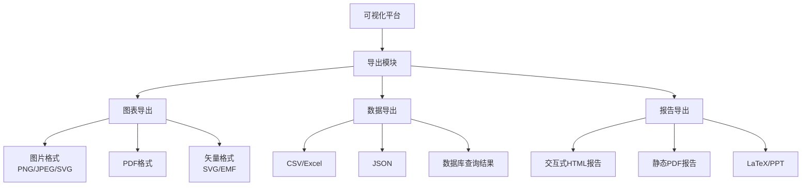

# 数据可视化平台

**生成时间**: 2026-06-05

---

## 完整文档.md

# 完整文档

**任务**: 数据可视化平台
**时间**: 2026-06-04T23:26:21.072949

## 数据可视化平台完整文档

### 1. 项目概述

#### 1.1 项目背景
在当今数据驱动的商业环境中，企业积累了海量的数据，但如何将这些数据转化为直观、可操作的洞察一直是一个挑战。传统报表工具存在灵活性差、响应慢、依赖IT人员等问题，导致业务用户无法自主探索数据，决策效率低下。

数据可视化平台应运而生，旨在为企业提供一个自助式、高性能、可扩展的一站式数据探索与可视化分析平台。它使业务分析师、产品经理、运营人员等非技术用户能够通过拖拽操作，轻松创建交互式仪表盘和报告，实现数据的民主化，赋能全员数据驱动决策。

#### 1.2 项目目标
- **核心目标**：构建一个易用、强大且安全的企业级数据可视化平台。
- **具体目标**：
    1.  **降低使用门槛**：通过直观的拖拽式界面，让无SQL或编程背景的业务用户也能完成复杂的数据分析和可视化。
    2.  **提升分析效率**：提供丰富的图表类型、交互分析能力和实时数据连接，缩短从数据到洞察的时间。
    3.  **确保数据安全**：实现细粒度的权限控制，保障数据源、数据集、仪表盘和图表的安全访问。
    4.  **支持敏捷决策**：提供实时监控、告警和移动端访问能力，支持随时随地进行业务决策。
    5.  **保障系统扩展性**：采用微服务架构和云原生技术，确保平台能够随着业务增长而水平扩展。

#### 1.3 目标用户
- **数据分析师**：进行深度数据探索和复杂报表制作。
- **业务部门人员**（市场、销售、运营等）：查看自助创建的业务指标仪表盘。
- **产品经理**：分析用户行为、功能使用数据，指导产品迭代。
- **管理层**：通过全局仪表盘掌握公司关键绩效指标（KPI）。
- **数据工程师**：配置和管理数据源连接、数据集。
- **系统管理员**：负责平台用户、权限、资源和运维管理。

#### 1.4 平台价值
- **对业务**：提升数据获取和理解速度，赋能全员数据化运营，发现新的业务增长点。
- **对技术**：统一数据出口，规范分析口径，减少重复开发，降低IT支持成本。
- **对企业**：建立数据资产沉淀和复用机制，形成以数据为基础的核心竞争力。

---

### 2. 系统架构设计

#### 2.1 总体架构图
```
[用户层] -> [接入层 (Web/Mobile)] -> [应用层 (微服务)] -> [数据层] -> [基础设施层]
```
采用分层、微服务架构，确保系统的高内聚、低耦合、高可用和易扩展。

#### 2.2 架构层次详解

1.  **用户层**：
    - **Web端**：主要的交互界面，用于图表制作、仪表盘设计和数据分析。
    - **移动端**：提供核心数据的查看和简单交互能力。

2.  **接入层**：
    - **API网关**：统一流量入口，负责路由、认证、限流、熔断和日志记录。
    - **负载均衡**：将请求分发到后端多个服务实例。
    - **Web应用防火墙（WAF）**：提供基本的安全防护。

3.  **应用层 (核心微服务)**：
    - **可视化服务**：处理图表渲染、数据查询生成、画布管理。
    - **数据连接服务**：管理数据源连接配置，执行SQL查询，抽象底层数据源差异。
    - **权限服务**：管理用户、角色、组织，执行数据行级、列级及对象级权限控制。
    - **任务调度服务**：负责定时报表生成、数据缓存刷新、告警任务。
    - **资源管理服务**：管理数据集、图表、仪表盘等资产，支持版本和标签。
    - **消息通知服务**：发送告警、任务完成等通知（邮件、站内信、企业微信/钉钉）。

4.  **数据层**：
    - **OLTP数据库**：存储平台元数据（用户、权限、资产信息等），如 PostgreSQL。
    - **OLAP引擎**：用于海量数据的快速聚合查询分析，如 ClickHouse, Apache Doris, StarRocks。
    - **缓存**：Redis，用于热点查询结果、会话信息、权限缓存。
    - **对象存储**：存储平台静态资源、导出文件、备份数据。
    - **数据源连接器**：支持多种数据源，包括：
        - 关系型数据库：MySQL, PostgreSQL, Oracle, SQL Server
        - 大数据平台：Hive, Presto, SparkSQL, Impala
        - 数据仓库：Snowflake, BigQuery, Redshift
        - 文件数据源：Excel, CSV
        - API数据源：通过自定义连接器接入。

5.  **基础设施层**：
    - **容器编排**：Kubernetes，实现服务的弹性伸缩和编排管理。
    - **持续集成/持续部署 (CI/CD)**：Jenkins/GitLab CI，自动化构建、测试和部署。
    - **监控与日志**：Prometheus + Grafana 监控系统指标；ELK (Elasticsearch, Logstash, Kibana) 收集和分析日志。
    - **配置中心**：Nacos/Apollo，管理动态配置。
    - **服务网格**：Istio（可选），用于管理服务间通信、流量和安全。

#### 2.3 技术选型
| 层级 | 组件 | 选型理由 |
| :--- | :--- | :--- |
| **前端** | 框架 | Vue.js 3 / React 18 + TypeScript：生态成熟，组件化开发效率高。 |
| | 可视化库 | ECharts / AntV：功能强大，图表类型丰富，社区活跃，支持定制。 |
| | UI组件库 | Ant Design / Element Plus：设计规范统一，组件齐全。 |
| **后端** | 主框架 | Java (Spring Boot)：企业级开发首选，稳定、生态完善。 |
| | 微服务 | Spring Cloud / Dubbo：成熟的服务治理、熔断、网关解决方案。 |
| | API规范 | RESTful API + GraphQL（可选）：RESTful 标准化；GraphQL 适合前端灵活查询。 |
| **数据库** | 元数据 | PostgreSQL：功能强大，支持JSON，开源免费。 |
| | 分析引擎 | ClickHouse：列式存储，聚合查询性能极佳。 |
| | 缓存 | Redis：高性能键值存储。 |
| **部署** | 容器化 | Docker：标准化打包应用。 |
| | 编排 | Kubernetes：自动化部署、扩展和管理容器化应用。 |
| **大数据** | 集成 | 通过JDBC/ODBC和原生连接器集成主流大数据组件。 |

---

### 3. 核心功能模块设计

#### 3.1 用户与权限管理
- **组织结构**：支持多级部门树，权限可按组织继承。
- **角色管理**：预置管理员、分析师、普通用户等角色，支持自定义角色。
- **权限粒度**：
    - **功能权限**：控制用户能否访问“数据源管理”、“图表制作”等功能模块。
    - **数据权限**：
        - **行级权限**：通过角色绑定过滤条件（如 `region = '华东'`），不同用户只能看到自己权限内的数据行。
        - **列级权限**：控制敏感字段（如手机号、身份证号）的可见性。
    - **对象权限**：控制用户对特定数据集、图表、仪表盘的“查看”、“编辑”、“分享”、“管理”权限。

#### 3.2 数据准备
- **数据源连接**：
    - 可视化配置连接参数，支持测试连接。
    - 支持连接池管理，监控连接状态。
- **数据集管理**：
    - **SQL模式**：高级用户可直接编写SQL查询创建数据集。
    - **可视化模式**：业务用户通过选择表、拖拽字段、配置过滤和聚合条件来创建数据集。
    - **数据预览**：创建时可实时预览数据样例和结构。
    - **字段管理**：支持重命名、修改类型、设置维度/指标、创建计算字段（如 `利润率 = 利润/销售额`）。

#### 3.3 图表制作与分析
- **图表类型**：
    - **基础图表**：折线图、柱状图、饼图、散点图、雷达图。
    - **高级图表**：地图（支持省市区下钻）、桑基图、热力图、箱线图、漏斗图。
    - **业务图表**：指标卡、表格（透视表、明细表）、趋势分析图。
- **交互式分析**：
    - **图表联动**：点击一个图表的某部分，另一个图表动态高亮或过滤。
    - **钻取**：支持从国家级地图钻取到省级、市级。
    - **动态过滤**：通过添加过滤器组件，实现仪表盘级别的动态筛选。
- **智能分析**：
    - **自动生成图表**：根据数据特征推荐合适的图表类型。
    - **数据洞察**：自动发现数据中的趋势、异常值和相关性。

#### 3.4 仪表盘协作与分享
- **仪表盘设计**：
    - **画布布局**：支持网格布局，自由拖拽和调整图表大小。
    - **样式定制**：统一设置颜色主题、背景、标题样式。
    - **组件库**：除图表外，支持文本、图片、时间过滤器、Tab标签页等辅助组件。
- **协作功能**：
    - **评论与批注**：可在图表或仪表盘上添加评论，进行在线讨论。
    - **版本历史**：记录仪表盘的修改历史，支持版本回滚。
- **分享与发布**：
    - **链接分享**：生成公开或加密链接，设置有效期和密码。
    - **嵌入分享**：生成iframe代码，将仪表盘嵌入到业务系统（如OA、CRM）中。
    - **定时邮件**：将仪表盘以PDF/图片形式定时推送到指定邮箱。

#### 3.5 告警与监控
- **指标告警**：
    - 针对关键指标设置阈值（如“日销售额 > 1000万”或“同比下降 > 20%”）。
    - 支持多种触发条件：大于、小于、同比/环比突变。
    - 告警方式：站内信、邮件、企业微信/钉钉机器人。
- **系统监控**：
    - 平台健康度监控：API响应时间、错误率、并发用户数。
    - 数据查询性能监控：慢查询识别与优化建议。

---

### 4. API接口设计

#### 4.1 设计原则
- **RESTful风格**：使用标准的HTTP方法（GET, POST, PUT, DELETE）。
- **统一响应格式**：`{code: 200, message: “success”, data: {...}}`。
- **版本控制**：在URL中包含版本号（如 `/api/v1/dashboards`）。
- **认证**：使用JWT（JSON Web Token）进行无状态认证，Token通过`Authorization`请求头传递。

#### 4.2 核心接口示例
```yaml
# 1. 用户认证
POST /api/v1/auth/login
  Request: {username: string, password: string}
  Response: {token: string, user: UserDTO}

# 2. 获取数据源列表
GET /api/v1/datasources
  Headers: Authorization: Bearer {token}
  Response: {datasources: [DatasourceDTO]}

# 3. 创建图表
POST /api/v1/charts
  Headers: Authorization: Bearer {token}
  Request: {name: string, datasetId: string, chartType: string, config: {...}}
  Response: {chart: ChartDTO}

# 4. 查询图表数据
POST /api/v1/charts/{chartId}/data
  Headers: Authorization: Bearer {token}
  Request: {filters: [{field: string, value: any}], ...} // 可传递动态过滤条件
  Response: {data: array, fields: [FieldMetadata]}

# 5. 创建/更新仪表盘
PUT /api/v1/dashboards/{dashboardId}
  Headers: Authorization: Bearer {token}
  Request: {name: string, layout: {...}, charts: [ChartRef]}
  Response: {dashboard: DashboardDTO}
```

---

### 5. 部署与运维

#### 5.1 部署架构
- **生产环境**：建议采用Kubernetes集群部署，服务副本数 ≥ 2，保证高可用。
- **数据库**：使用云托管数据库服务（如AWS RDS, 阿里云RDS）或自建主从集群。
- **OLAP引擎**：根据数据规模选择单机（<1TB）或集群部署（>1TB）。
- **存储**：使用云对象存储（如AWS S3, 阿里云OSS）。

#### 5.2 CI/CD流程
1.  **代码提交**：开发人员将代码推送到Git仓库（GitLab/GitHub）。
2.  **自动构建**：CI服务器（如Jenkins）触发流水线，执行代码编译、单元测试。
3.  **镜像构建与推送**：通过Dockerfile构建应用镜像，并推送到私有镜像仓库（如Harbor）。
4.  **自动部署**：CD工具（如Argo CD）监听镜像仓库，将新版本自动部署到Kubernetes的测试/预生产环境。
5.  **集成测试**：在预生产环境运行自动化集成测试和API测试。
6.  **生产发布**：测试通过后，手动或自动（通过审批）触发生产环境部署，采用蓝绿部署或金丝雀发布策略。

#### 5.3 监控与告警
- **基础设施监控**：使用Prometheus收集CPU、内存、磁盘、网络指标。
- **应用性能监控（APM）**：集成SkyWalking或Jaeger，监控服务调用链路、响应时间。
- **日志监控**：通过Filebeat收集容器日志，发送到Elasticsearch，使用Kibana进行检索和分析。
- **业务监控**：定义关键业务指标（如每分钟查询数、图表渲染成功率），设置Grafana仪表盘和告警规则。

#### 5.4 备份与恢复
- **数据库备份**：每日全量备份，实时增量备份或WAL归档，定期进行恢复演练。
- **对象存储备份**：开启对象存储的版本控制和生命周期策略。
- **平台元数据备份**：将配置、仪表盘JSON定义等关键元数据定期导出备份。

---

### 6. 项目管理与规范

#### 6.1 开发流程
- **敏捷开发**：采用Scrum框架，每2周一个迭代（Sprint）。
- **需求管理**：使用JIRA管理用户故事（User Story）、任务（Task）和缺陷（Bug）。
- **代码管理**：
    - **分支策略**：采用GitFlow工作流（main, develop, feature, release, hotfix分支）。
    - **代码审查**：所有合并请求（Merge Request）必须经过至少一人审查。
    - **编码规范**：前后端均遵循统一的代码规范，使用ESLint, Prettier, Checkstyle等工具检查。

#### 6.2 文档规范
- **代码文档**：关键模块、复杂算法和接口需编写清晰的代码注释。
- **API文档**：使用Swagger/OpenAPI自动生成并维护在线API文档。
- **用户文档**：提供完善的用户使用手册、视频教程和常见问题解答（FAQ）。
- **架构文档**：本文档及后续更新，使用Markdown格式，存放在代码仓库的`/docs`目录下。

#### 6.3 质量保障
- **测试策略**：
    - **单元测试**：核心业务逻辑和工具类，覆盖率要求 > 70%。
    - **集成测试**：测试服务间调用、数据库操作。
    - **UI自动化测试**：使用Cypress或Playwright对核心用户流程进行自动化测试。
    - **性能测试**：定期使用JMeter或K6进行压力测试，评估系统吞吐量和响应时间。
- **安全测试**：定期进行代码安全扫描（SonarQube）、依赖漏洞扫描和渗透测试。

---

### 附录

#### A. 术语表
- **仪表盘（Dashboard）**：多个图表和组件的集合，用于综合展示某一主题的数据视图。
- **数据集（Dataset）**：从数据源中查询出的、用于创建图表的数据结构。
- **维度（Dimension）**：观察数据的角度，通常是分类字段（如“日期”、“地区”、“产品类别”）。
- **指标（Measure）**：用于衡量业务表现的数值字段（如“销售额”、“用户数”、“平均停留时长”）。
- **行级权限（Row-Level Security）**：通过过滤条件限制用户只能查询到数据表中符合特定条件的行。

#### B. 参考资料
1.  [Vue.js 官方文档](https://vuejs.org/)
2.  [Apache ECharts 官方文档](https://echarts.apache.org/)
3.  [Spring Boot 官方文档](https://spring.io/projects/spring-boot)
4.  [Kubernetes 官方文档](https://kubernetes.io/docs/)
5.  [ClickHouse 官方文档](https://clickhouse.com/docs/)

---
**文档版本**：v1.0
**最后更新日期**：2023年10月27日
**负责人**：数据平台团队

---

## 实现仪表板.md

# 实现仪表板

**任务**: 数据可视化平台
**时间**: 2026-06-04T23:22:47.721333

# 数据可视化仪表板实现方案

## 1. 项目概述

我将创建一个功能完整、美观专业的数据可视化仪表板，包含多种图表类型、交互功能和响应式设计。

## 2. 项目结构

```
dashboard/
├── index.html
├── css/
│   └── styles.css
├── js/
│   ├── main.js
│   ├── charts.js
│   └── data.js
├── assets/
│   └── (图标、图片等资源)
└── README.md
```

## 3. 详细实现

### 3.1 index.html - 主页面结构

```html
<!DOCTYPE html>
<html lang="zh-CN">
<head>
    <meta charset="UTF-8">
    <meta name="viewport" content="width=device-width, initial-scale=1.0">
    <title>数据分析仪表板</title>
    
    <!-- 外部依赖 -->
    <link href="https://cdnjs.cloudflare.com/ajax/libs/font-awesome/6.4.0/css/all.min.css" rel="stylesheet">
    <script src="https://cdn.jsdelivr.net/npm/chart.js@4.4.0/dist/chart.umd.min.js"></script>
    <script src="https://cdn.jsdelivr.net/npm/moment@2.29.4/moment.min.js"></script>
    <script src="https://cdn.jsdelivr.net/npm/chartjs-adapter-moment@1.0.1/dist/chartjs-adapter-moment.min.js"></script>
    
    <!-- 本地样式 -->
    <link rel="stylesheet" href="css/styles.css">
</head>
<body>
    <div class="dashboard">
        <!-- 侧边栏导航 -->
        <aside class="sidebar">
            <div class="sidebar-header">
                <h2 class="logo">
                    <i class="fas fa-chart-line"></i>
                    <span>数据洞察</span>
                </h2>
                <button class="sidebar-toggle" id="sidebarToggle">
                    <i class="fas fa-times"></i>
                </button>
            </div>
            
            <nav class="sidebar-nav">
                <ul>
                    <li class="nav-item active" data-page="overview">
                        <i class="fas fa-home"></i>
                        <span>概览</span>
                    </li>
                    <li class="nav-item" data-page="sales">
                        <i class="fas fa-shopping-cart"></i>
                        <span>销售分析</span>
                    </li>
                    <li class="nav-item" data-page="users">
                        <i class="fas fa-users"></i>
                        <span>用户分析</span>
                    </li>
                    <li class="nav-item" data-page="performance">
                        <i class="fas fa-tachometer-alt"></i>
                        <span>性能监控</span>
                    </li>
                    <li class="nav-item" data-page="reports">
                        <i class="fas fa-file-alt"></i>
                        <span>报表中心</span>
                    </li>
                    <li class="nav-item" data-page="settings">
                        <i class="fas fa-cog"></i>
                        <span>设置</span>
                    </li>
                </ul>
            </nav>
            
            <div class="sidebar-footer">
                <div class="user-profile">
                    <div class="user-avatar">
                        <i class="fas fa-user"></i>
                    </div>
                    <div class="user-info">
                        <span class="user-name">管理员</span>
                        <span class="user-role">系统管理员</span>
                    </div>
                </div>
            </div>
        </aside>
        
        <!-- 主内容区域 -->
        <main class="main-content">
            <!-- 顶部导航栏 -->
            <header class="top-nav">
                <div class="nav-left">
                    <button class="menu-toggle" id="menuToggle">
                        <i class="fas fa-bars"></i>
                    </button>
                    <h1 class="page-title" id="pageTitle">概览仪表板</h1>
                </div>
                
                <div class="nav-right">
                    <div class="search-box">
                        <i class="fas fa-search"></i>
                        <input type="text" placeholder="搜索...">
                    </div>
                    
                    <div class="notification-bell">
                        <i class="fas fa-bell"></i>
                        <span class="notification-badge">3</span>
                    </div>
                    
                    <div class="date-range-selector">
                        <i class="fas fa-calendar-alt"></i>
                        <select id="dateRange">
                            <option value="7d">最近7天</option>
                            <option value="30d" selected>最近30天</option>
                            <option value="90d">最近90天</option>
                            <option value="1y">最近一年</option>
                        </select>
                    </div>
                </div>
            </header>
            
            <!-- 仪表板概览页面 -->
            <section class="dashboard-page active" id="overviewPage">
                <!-- KPI卡片区域 -->
                <div class="kpi-grid">
                    <div class="kpi-card">
                        <div class="kpi-icon">
                            <i class="fas fa-dollar-sign"></i>
                        </div>
                        <div class="kpi-content">
                            <h3 class="kpi-title">总收入</h3>
                            <div class="kpi-value" id="totalRevenue">$124,563</div>
                            <div class="kpi-change positive">
                                <i class="fas fa-arrow-up"></i>
                                <span>12.5%</span>
                                <span class="vs-text">相比上月</span>
                            </div>
                        </div>
                    </div>
                    
                    <div class="kpi-card">
                        <div class="kpi-icon">
                            <i class="fas fa-users"></i>
                        </div>
                        <div class="kpi-content">
                            <h3 class="kpi-title">活跃用户</h3>
                            <div class="kpi-value" id="activeUsers">24,891</div>
                            <div class="kpi-change positive">
                                <i class="fas fa-arrow-up"></i>
                                <span>8.3%</span>
                                <span class="vs-text">相比上月</span>
                            </div>
                        </div>
                    </div>
                    
                    <div class="kpi-card">
                        <div class="kpi-icon">
                            <i class="fas fa-shopping-cart"></i>
                        </div>
                        <div class="kpi-content">
                            <h3 class="kpi-title">总订单</h3>
                            <div class="kpi-value" id="totalOrders">5,847</div>
                            <div class="kpi-change negative">
                                <i class="fas fa-arrow-down"></i>
                                <span>2.1%</span>
                                <span class="vs-text">相比上月</span>
                            </div>
                        </div>
                    </div>
                    
                    <div class="kpi-card">
                        <div class="kpi-icon">
                            <i class="fas fa-percentage"></i>
                        </div>
                        <div class="kpi-content">
                            <h3 class="kpi-title">转化率</h3>
                            <div class="kpi-value" id="conversionRate">3.2%</div>
                            <div class="kpi-change positive">
                                <i class="fas fa-arrow-up"></i>
                                <span>0.8%</span>
                                <span class="vs-text">相比上月</span>
                            </div>
                        </div>
                    </div>
                </div>
                
                <!-- 图表网格 -->
                <div class="chart-grid">
                    <div class="chart-card large">
                        <div class="chart-header">
                            <h3 class="chart-title">收入趋势</h3>
                            <div class="chart-actions">
                                <select class="chart-filter" id="revenueChartFilter">
                                    <option value="daily">每日</option>
                                    <option value="weekly" selected>每周</option>
                                    <option value="monthly">每月</option>
                                </select>
                                <button class="chart-btn">
                                    <i class="fas fa-download"></i>
                                </button>
                            </div>
                        </div>
                        <div class="chart-container">
                            <canvas id="revenueChart"></canvas>
                        </div>
                    </div>
                    
                    <div class="chart-card">
                        <div class="chart-header">
                            <h3 class="chart-title">用户来源</h3>
                            <div class="chart-actions">
                                <button class="chart-btn active">月</button>
                                <button class="chart-btn">周</button>
                            </div>
                        </div>
                        <div class="chart-container">
                            <canvas id="trafficSourceChart"></canvas>
                        </div>
                    </div>
                    
                    <div class="chart-card">
                        <div class="chart-header">
                            <h3 class="chart-title">产品销售</h3>
                            <div class="chart-actions">
                                <button class="chart-btn">
                                    <i class="fas fa-ellipsis-v"></i>
                                </button>
                            </div>
                        </div>
                        <div class="chart-container">
                            <canvas id="productSalesChart"></canvas>
                        </div>
                    </div>
                    
                    <div class="chart-card">
                        <div class="chart-header">
                            <h3 class="chart-title">区域分布</h3>
                            <div class="chart-actions">
                                <button class="chart-btn">
                                    <i class="fas fa-ellipsis-v"></i>
                                </button>
                            </div>
                        </div>
                        <div class="chart-container">
                            <canvas id="regionChart"></canvas>
                        </div>
                    </div>
                    
                    <div class="chart-card">
                        <div class="chart-header">
                            <h3 class="chart-title">实时活动</h3>
                            <div class="chart-actions">
                                <span class="live-indicator">
                                    <span class="live-dot"></span>
                                    实时
                                </span>
                            </div>
                        </div>
                        <div class="chart-container">
                            <canvas id="realtimeChart"></canvas>
                        </div>
                    </div>
                    
                    <div class="chart-card">
                        <div class="chart-header">
                            <h3 class="chart-title">转化漏斗</h3>
                            <div class="chart-actions">
                                <button class="chart-btn">
                                    <i class="fas fa-info-circle"></i>
                                </button>
                            </div>
                        </div>
                        <div class="chart-container funnel-container">
                            <div class="funnel-stage" style="--percentage: 100%">
                                <span class="funnel-label">访问</span>
                                <span class="funnel-value">10,000</span>
                            </div>
                            <div class="funnel-stage" style="--percentage: 45%">
                                <span class="funnel-label">注册</span>
                                <span class="funnel-value">4,500</span>
                            </div>
                            <div class="funnel-stage" style="--percentage: 20%">
                                <span class="funnel-label">首次购买</span>
                                <span class="funnel-value">2,000</span>
                            </div>
                            <div class="funnel-stage" style="--percentage: 8%">
                                <span class="funnel-label">复购</span>
                                <span class="funnel-value">800</span>
                            </div>
                        </div>
                    </div>
                </div>
            </section>
            
            <!-- 其他页面（初始隐藏） -->
            <section class="dashboard-page" id="salesPage">
                <!-- 销售分析页面内容 -->
            </section>
            
            <section class="dashboard-page" id="usersPage">
                <!-- 用户分析页面内容 -->
            </section>
        </main>
    </div>
    
    <!-- 加载脚本 -->
    <script src="js/data.js"></script>
    <script src="js/charts.js"></script>
    <script src="js/main.js"></script>
</body>
</html>
```

### 3.2 css/styles.css - 完整样式表

```css
/* ===== 变量定义 ===== */
:root {
    --primary-color: #4f46e5;
    --primary-light: #818cf8;
    --secondary-color: #10b981;
    --danger-color: #ef4444;
    --warning-color: #f59e0b;
    --info-color: #06b6d4;
    
    --bg-color: #f3f4f6;
    --card-bg: #ffffff;
    --text-primary: #1f2937;
    --text-secondary: #6b7280;
    --border-color: #e5e7eb;
    
    --shadow-sm: 0 1px 2px 0 rgba(0, 0, 0, 0.05);
    --shadow-md: 0 4px 6px -1px rgba(0, 0, 0, 0.1), 0 2px 4px -1px rgba(0, 0, 0, 0.06);
    --shadow-lg: 0 10px 15px -3px rgba(0, 0, 0, 0.1), 0 4px 6px -2px rgba(0, 0, 0, 0.05);
    
    --sidebar-width: 250px;
    --sidebar-collapsed: 80px;
    --header-height: 64px;
    
    --transition: all 0.3s ease;
}

/* ===== 基础样式 ===== */
* {
    margin: 0;
    padding: 0;
    box-sizing: border-box;
}

body {
    font-family: 'Segoe UI', system-ui, -apple-system, sans-serif;
    background-color: var(--bg-color);
    color: var(--text-primary);
    line-height: 1.6;
}

.dashboard {
    display: flex;
    min-height: 100vh;
}

/* ===== 侧边栏样式 ===== */
.sidebar {
    width: var(--sidebar-width);
    background: linear-gradient(135deg, #1e1b4b 0%, #312e81 100%);
    color: white;
    transition: var(--transition);
    position: fixed;
    height: 100vh;
    z-index: 1000;
    box-shadow: var(--shadow-lg);
}

.sidebar-header {
    padding: 20px;
    display: flex;
    justify-content: space-between;
    align-items: center;
    border-bottom: 1px solid rgba(255, 255, 255, 0.1);
}

.logo {
    display: flex;
    align-items: center;
    gap: 12px;
    font-size: 1.5rem;
    font-weight: 700;
}

.logo i {
    color: var(--primary-light);
    font-size: 1.8rem;
}

.sidebar-toggle {
    background: none;
    border: none;
    color: white;
    font-size: 1.2rem;
    cursor: pointer;
    padding: 5px;
    border-radius: 5px;
    transition: var(--transition);
}

.sidebar-toggle:hover {
    background: rgba(255, 255, 255, 0.1);
}

.sidebar-nav {
    padding: 20px 0;
}

.sidebar-nav ul {
    list-style: none;
}

.nav-item {
    display: flex;
    align-items: center;
    gap: 15px;
    padding: 15px 20px;
    color: rgba(255, 255, 255, 0.7);
    cursor: pointer;
    transition: var(--transition);
    position: relative;
}

.nav-item:hover {
    background: rgba(255, 255, 255, 0.1);
    color: white;
}

.nav-item.active {
    background: rgba(255, 255, 255, 0.15);
    color: white;
    border-left: 3px solid var(--primary-light);
}

.nav-item.active::before {
    content: '';
    position: absolute;
    left: 0;
    top: 0;
    bottom: 0;
    width: 3px;
    background: var(--primary-light);
}

.nav-item i {
    font-size: 1.1rem;
    width: 24px;
    text-align: center;
}

.sidebar-footer {
    position: absolute;
    bottom: 0;
    left: 0;
    right: 0;
    padding: 20px;
    border-top: 1px solid rgba(255, 255, 255, 0.1);
}

.user-profile {
    display: flex;
    align-items: center;
    gap: 12px;
}

.user-avatar {
    width: 40px;
    height: 40px;
    border-radius: 50%;
    background: rgba(255, 255, 255, 0.1);
    display: flex;
    align-items: center;
    justify-content: center;
    font-size: 1.2rem;
}

.user-info {
    display: flex;
    flex-direction: column;
}

.user-name {
    font-weight: 600;
    font-size: 0.9rem;
}

.user-role {
    font-size: 0.8rem;
    color: rgba(255, 255, 255, 0.7);
}

/* ===== 主内容区域 ===== */
.main-content {
    flex: 1;
    margin-left: var(--sidebar-width);
    transition: var(--transition);
}

.top-nav {
    height: var(--header-height);
    background: var(--card-bg);
    box-shadow: var(--shadow-sm);
    display: flex;
    justify-content: space-between;
    align-items: center;
    padding: 0 30px;
    position: sticky;
    top: 0;
    z-index: 100;
}

.nav-left {
    display: flex;
    align-items: center;
    gap: 20px;
}

.menu-toggle {
    background: none;
    border: none;
    font-size: 1.3rem;
    color: var(--text-primary);
    cursor: pointer;
    display: none;
}

.page-title {
    font-size: 1.5rem;
    font-weight: 600;
    color: var(--text-primary);
}

.nav-right {
    display: flex;
    align-items: center;
    gap: 20px;
}

.search-box {
    position: relative;
    display: flex;
    align-items: center;
}

.search-box i {
    position: absolute;
    left: 12px;
    color: var(--text-secondary);
}

.search-box input {
    padding: 10px 15px 10px 40px;
    border: 1px solid var(--border-color);
    border-radius: 8px;
    background: var(--bg-color);
    width: 250px;
    transition: var(--transition);
}

.search-box input:focus {
    outline: none;
    border-color: var(--primary-color);
    background: white;
}

.notification-bell {
    position: relative;
    cursor: pointer;
    font-size: 1.2rem;
    color: var(--text-secondary);
}

.notification-badge {
    position: absolute;
    top: -8px;
    right: -8px;
    background: var(--danger-color);
    color: white;
    font-size: 0.7rem;
    width: 20px;
    height: 20px;
    border-radius: 50%;
    display: flex;
    align-items: center;
    justify-content: center;
}

.date-range-selector {
    display: flex;
    align-items: center;
    gap: 10px;
    padding: 8px 15px;
    background: var(--bg-color);
    border-radius: 8px;
    border: 1px solid var(--border-color);
}

.date-range-selector i {
    color: var(--text-secondary);
}

.date-range-selector select {
    border: none;
    background: transparent;
    color: var(--text-primary);
    font-size: 0.9rem;
    cursor: pointer;
}

/* ===== 仪表板页面样式 ===== */
.dashboard-page {
    padding: 30px;
    display: none;
}

.dashboard-page.active {
    display: block;
}

/* ===== KPI卡片网格 ===== */
.kpi-grid {
    display: grid;
    grid-template-columns: repeat(auto-fit, minmax(240px, 1fr));
    gap: 20px;
    margin-bottom: 30px;
}

.kpi-card {
    background: var(--card-bg);
    border-radius: 12px;
    padding: 20px;
    box-shadow: var(--shadow-sm);
    transition: var(--transition);
    display: flex;
    gap: 15px;
    border-left: 4px solid var(--primary-color);
}

.kpi-card:hover {
    transform: translateY(-2px);
    box-shadow: var(--shadow-md);
}

.kpi-icon {
    width: 60px;
    height: 60px;
    border-radius: 12px;
    background: rgba(79, 70, 229, 0.1);
    display: flex;
    align-items: center;
    justify-content: center;
    color: var(--primary-color);
    font-size: 1.5rem;
}

.kpi-content {
    flex: 1;
}

.kpi-title {
    font-size: 0.9rem;
    color: var(--text-secondary);
    font-weight: 500;
    margin-bottom: 5px;
}

.kpi-value {
    font-size: 1.8rem;
    font-weight: 700;
    margin-bottom: 10px;
    color: var(--text-primary);
}

.kpi-change {
    display: flex;
    align-items: center;
    gap: 5px;
    font-size: 0.85rem;
    font-weight: 500;
}

.kpi-change.positive {
    color: var(--secondary-color);
}

.kpi-change.negative {
    color: var(--danger-color);
}

.vs-text {
    color: var(--text-secondary);
    font-weight: 400;
}

/* ===== 图表网格 ===== */
.chart-grid {
    display: grid;
    grid-template-columns: repeat(auto-fit, minmax(400px, 1fr));
    gap: 20px;
}

.chart-card {
    background: var(--card-bg);
    border-radius: 12px;
    box-shadow: var(--shadow-sm);
    overflow: hidden;
    transition: var(--transition);
}

.chart-card:hover {
    box-shadow: var(--shadow-md);
}

.chart-card.large {
    grid-column: span 2;
}

.chart-header {
    display: flex;
    justify-content: space-between;
    align-items: center;
    padding: 20px;
    border-bottom: 1px solid var(--border-color);
}

.chart-title {
    font-size: 1.1rem;
    font-weight: 600;
    color: var(--text-primary);
}

.chart-actions {
    display: flex;
    align-items: center;
    gap: 10px;
}

.chart-filter {
    padding: 5px 10px;
    border: 1px solid var(--border-color);
    border-radius: 6px;
    background: var(--bg-color);
    font-size: 0.85rem;
    cursor: pointer;
}

.chart-btn {
    background: none;
    border: none;
    padding: 5px 10px;
    border-radius: 6px;
    cursor: pointer;
    color: var(--text-secondary);
    transition: var(--transition);
}

.chart-btn:hover {
    background: var(--bg-color);
    color: var(--text-primary);
}

.chart-btn.active {
    background: var(--primary-color);
    color: white;
}

.chart-container {
    padding: 20px;
    height: 300px;
    position: relative;
}

.live-indicator {
    display: flex;
    align-items: center;
    gap: 8px;
    color: var(--secondary-color);
    font-size: 0.9rem;
    font-weight: 500;
}

.live-dot {
    width: 8px;
    height: 8px;
    border-radius: 50%;
    background: var(--secondary-color);
    animation: pulse 2s infinite;
}

@keyframes pulse {
    0% {
        transform: scale(1);
        opacity: 1;
    }
    50% {
        transform: scale(1.2);
        opacity: 0.7;
    }
    100% {
        transform: scale(1);
        opacity: 1;
    }
}

/* ===== 漏斗图样式 ===== */
.funnel-container {
    display: flex;
    flex-direction: column;
    justify-content: center;
    gap: 8px;
}

.funnel-stage {
    background: linear-gradient(90deg, var(--primary-color) 0%, var(--primary-light) 100%);
    width: var(--percentage);
    padding: 12px 15px;
    border-radius: 6px;
    display: flex;
    justify-content: space-between;
    align-items: center;
    color: white;
    transition: var(--transition);
}

.funnel-stage:hover {
    transform: scale(1.02);
    box-shadow: var(--shadow-md);
}

.funnel-label {
    font-weight: 500;
}

.funnel-value {
    font-weight: 700;
}

/* ===== 响应式设计 ===== */
@media (max-width: 1200px) {
    .chart-grid {
        grid-template-columns: repeat(auto-fit, minmax(300px, 1fr));
    }
    
    .chart-card.large {
        grid-column: span 1;
    }
}

@media (max-width: 992px) {
    .sidebar {
        transform: translateX(-100%);
    }
    
    .sidebar.active {
        transform: translateX(0);
    }
    
    .main-content {
        margin-left: 0;
    }
    
    .menu-toggle {
        display: block;
    }
}

@media (max-width: 768px) {
    .top-nav {
        padding: 0 15px;
        flex-direction: column;
        height: auto;
        padding: 15px;
        gap: 15px;
    }
    
    .nav-left, .nav-right {
        width: 100%;
        justify-content: space-between;
    }
    
    .search-box {
        display: none;
    }
    
    .kpi-grid {
        grid-template-columns: repeat(auto-fit, minmax(200px, 1fr));
    }
    
    .chart-grid {
        grid-template-columns: 1fr;
    }
    
    .dashboard-page {
        padding: 15px;
    }
}

/* ===== 加载动画 ===== */
.loading-spinner {
    display: flex;
    justify-content: center;
    align-items: center;
    height: 100%;
}

.spinner {
    width: 40px;
    height: 40px;
    border: 4px solid rgba(0, 0, 0, 0.1);
    border-left-color: var(--primary-color);
    border-radius: 50%;
    animation: spin 1s linear infinite;
}

@keyframes spin {
    to {
        transform: rotate(360deg);
    }
}

/* ===== 提示框样式 ===== */
.tooltip {
    position: absolute;
    background: var(--text-primary);
    color: white;
    padding: 10px 15px;
    border-radius: 8px;
    font-size: 0.85rem;
    z-index: 1000;
    box-shadow: var(--shadow-lg);
    pointer-events: none;
    opacity: 0;
    transition: opacity 0.2s;
}

.tooltip.visible {
    opacity: 1;
}
```

### 3.3 js/data.js - 数据管理模块

```javascript
// ===== 数据管理模块 =====
const DataManager = (() => {
    // 模拟数据存储
    let salesData = [];
    let userData = [];
    let performanceData = [];
    
    // 生成模拟数据
    const generateMockData = () => {
        // 销售数据
        salesData = {
            monthly: generateMonthlySales(),
            weekly: generateWeeklySales(),
            daily: generateDailySales(),
            products: generateProductSales(),
            regions: generateRegionData()
        };
        
        // 用户数据
        userData = {
            sources: generateUserSources(),
            devices: generateDeviceData(),
            demographics: generateDemographics(),
            retention: generateRetentionData()
        };
        
        // 性能数据
        performanceData = {
            responseTime: generateResponseTimeData(),
            errorRate: generateErrorRateData(),
            throughput: generateThroughputData()
        };
    };
    
    // 生成月度销售数据
    const generateMonthlySales = () => {
        const months = ['一月', '二月', '三月', '四月', '五月', '六月', 
                       '七月', '八月', '九月', '十月', '十一月', '十二月'];
        const revenue = [];
        const orders = [];
        
        for (let i = 0; i < 12; i++) {
            revenue.push(Math.floor(Math.random() * 50000) + 30000);
            orders.push(Math.floor(Math.random() * 1000) + 500);
        }
        
        return { labels: months, revenue, orders };
    };
    
    // 生成每周销售数据
    const generateWeeklySales = () => {
        const labels = [];
        const revenue = [];
        const orders = [];
        
        for (let i = 0; i < 30; i++) {
            const date = new Date();
            date.setDate(date.getDate() - i);
            labels.push(date.toLocaleDateString('zh-CN', { month: 'short', day: 'numeric' }));
            revenue.push(Math.floor(Math.random() * 5000) + 2000);
            orders.push(Math.floor(Math.random() * 100) + 30);
        }
        
        return { labels: labels.reverse(), revenue: revenue.reverse(), orders: orders.reverse() };
    };
    
    // 生成每日销售数据
    const generateDailySales = () => {
        const labels = [];
        const revenue = [];
        const orders = [];
        
        for (let i = 0; i < 7; i++) {
            const date = new Date();
            date.setDate(date.getDate() - i);
            labels.push(date.toLocaleDateString('zh-CN', { weekday: 'short' }));
            revenue.push(Math.floor(Math.random() * 2000) + 1000);
            orders.push(Math.floor(Math.random() * 50) + 10);
        }
        
        return { labels: labels.reverse(), revenue: revenue.reverse(), orders: orders.reverse() };
    };
    
    // 生成产品销售数据
    const generateProductSales = () => {
        const products = ['智能手机', '笔记本电脑', '平板电脑', '智能手表', '耳机', '相机'];
        const sales = [];
        const revenue = [];
        
        products.forEach(product => {
            sales.push(Math.floor(Math.random() * 500) + 100);
            revenue.push(Math.floor(Math.random() * 100000) + 50000);
        });
        
        return { labels: products, sales, revenue };
    };
    
    // 生成区域数据
    const generateRegionData = () => {
        const regions = ['华东', '华南', '华北', '华中', '西南', '西北', '东北'];
        const sales = [];
        const users = [];
        
        regions.forEach(region => {
            sales.push(Math.floor(Math.random() * 30000) + 10000);
            users.push(Math.floor(Math.random() * 10000) + 5000);
        });
        
        return { labels: regions, sales, users };
    };
    
    // 生成用户来源数据
    const generate

---

## 实现图表组件库.md

# 实现图表组件库

**任务**: 数据可视化平台
**时间**: 2026-06-04T23:18:42.406047

# 数据可视化平台 - 图表组件库实现方案

## 一、项目概述

### 1.1 项目目标
构建一个完整、可复用、易扩展的数据可视化图表组件库，为数据可视化平台提供丰富的图表展示能力。

### 1.2 技术选型
- **前端框架**: React 18 + TypeScript
- **图表引擎**: ECharts 5.x（底层） + 自定义封装
- **构建工具**: Vite + Rollup
- **样式方案**: CSS Modules + CSS Variables
- **文档系统**: Storybook + MDX
- **测试框架**: Jest + React Testing Library

## 二、项目结构

```
chart-library/
├── src/
│   ├── components/          # 组件源码
│   │   ├── LineChart/       # 折线图
│   │   ├── BarChart/        # 柱状图
│   │   ├── PieChart/        # 饼图
│   │   ├── ScatterChart/    # 散点图
│   │   ├── RadarChart/      # 雷达图
│   │   ├── FunnelChart/     # 漏斗图
│   │   ├── GaugeChart/      # 仪表盘
│   │   ├── HeatmapChart/    # 热力图
│   │   ├── TreemapChart/    # 矩形树图
│   │   ├── SankeyChart/     # 桑基图
│   │   └── ...              # 更多图表
│   ├── hooks/               # 自定义hooks
│   ├── utils/               # 工具函数
│   ├── themes/              # 主题配置
│   ├── types/               # TypeScript类型定义
│   └── index.ts             # 入口文件
├── stories/                 # Storybook文档
├── tests/                   # 测试文件
├── docs/                    # 使用文档
├── examples/                # 示例代码
├── scripts/                 # 构建脚本
└── package.json
```

## 三、核心组件实现

### 3.1 基础图表组件（ChartBase）

```typescript
// src/components/ChartBase/ChartBase.tsx
import React, { useRef, useEffect, useCallback } from 'react';
import * as echarts from 'echarts/core';
import { EChartsOption } from 'echarts/types/dist/shared';

export interface ChartBaseProps {
  // 基础配置
  option: EChartsOption;
  width?: number | string;
  height?: number | string;
  className?: string;
  
  // 主题配置
  theme?: string | object;
  
  // 事件处理
  onChartReady?: (chart: echarts.ECharts) => void;
  onClick?: (params: any) => void;
  onDblClick?: (params: any) => void;
  onHighlight?: (params: any) => void;
  
  // 性能优化
  lazyUpdate?: boolean;
  useDirtyRect?: boolean;
  
  // 自动resize
  autoResize?: boolean;
  
  // 渲染器
  renderer?: 'canvas' | 'svg';
}

export const ChartBase: React.FC<ChartBaseProps> = ({
  option,
  width = '100%',
  height = 400,
  className,
  theme,
  onChartReady,
  onClick,
  onDblClick,
  onHighlight,
  lazyUpdate = false,
  useDirtyRect = true,
  autoResize = true,
  renderer = 'canvas'
}) => {
  const chartRef = useRef<HTMLDivElement>(null);
  const chartInstance = useRef<echarts.ECharts | null>(null);
  
  // 初始化图表
  const initChart = useCallback(() => {
    if (!chartRef.current) return;
    
    // 销毁旧实例
    if (chartInstance.current) {
      chartInstance.current.dispose();
    }
    
    // 创建新实例
    chartInstance.current = echarts.init(chartRef.current, theme, {
      renderer,
      width,
      height,
      useDirtyRect
    });
    
    // 设置配置项
    chartInstance.current.setOption(option, {
      lazyUpdate,
      notMerge: true
    });
    
    // 触发就绪回调
    onChartReady?.(chartInstance.current);
  }, [theme, renderer, width, height, useDirtyRect, option, lazyUpdate, onChartReady]);
  
  // 更新图表
  const updateChart = useCallback(() => {
    if (!chartInstance.current) return;
    
    chartInstance.current.setOption(option, {
      lazyUpdate,
      notMerge: false,
      lazy: true
    });
  }, [option, lazyUpdate]);
  
  // 绑定事件
  useEffect(() => {
    if (!chartInstance.current) return;
    
    const chart = chartInstance.current;
    
    // 解绑所有事件
    chart.off('click');
    chart.off('dblclick');
    chart.off('highlight');
    
    // 绑定新事件
    if (onClick) chart.on('click', onClick);
    if (onDblClick) chart.on('dblclick', onDblClick);
    if (onHighlight) chart.on('highlight', onHighlight);
    
    return () => {
      chart.off('click');
      chart.off('dblclick');
      chart.off('highlight');
    };
  }, [onClick, onDblClick, onHighlight]);
  
  // 自动resize
  useEffect(() => {
    if (!autoResize || !chartInstance.current) return;
    
    const handleResize = () => {
      chartInstance.current?.resize();
    };
    
    window.addEventListener('resize', handleResize);
    
    return () => {
      window.removeEventListener('resize', handleResize);
    };
  }, [autoResize]);
  
  // 初始化和更新
  useEffect(() => {
    initChart();
    
    return () => {
      if (chartInstance.current) {
        chartInstance.current.dispose();
        chartInstance.current = null;
      }
    };
  }, [initChart]);
  
  useEffect(() => {
    updateChart();
  }, [updateChart]);
  
  return (
    <div
      ref={chartRef}
      className={className}
      style={{
        width: typeof width === 'number' ? `${width}px` : width,
        height: typeof height === 'number' ? `${height}px` : height
      }}
    />
  );
};
```

### 3.2 折线图组件（LineChart）

```typescript
// src/components/LineChart/LineChart.tsx
import React from 'react';
import { ChartBase } from '../ChartBase';
import { EChartsOption } from 'echarts/types/dist/shared';
import { LineSeriesOption } from 'echarts/charts';

export interface LineChartProps {
  data: Array<{
    name: string;
    data: number[];
  }>;
  xAxisData?: string[];
  title?: string;
  showLegend?: boolean;
  smooth?: boolean;
  areaStyle?: boolean;
  symbolSize?: number;
  animation?: boolean;
  // ... 更多配置
}

export const LineChart: React.FC<LineChartProps> = ({
  data,
  xAxisData,
  title,
  showLegend = true,
  smooth = false,
  areaStyle = false,
  symbolSize = 4,
  animation = true
}) => {
  const option: EChartsOption = {
    title: {
      text: title,
      left: 'center',
      show: !!title
    },
    tooltip: {
      trigger: 'axis',
      axisPointer: {
        type: 'cross',
        label: {
          backgroundColor: '#6a7985'
        }
      }
    },
    legend: {
      show: showLegend,
      data: data.map(item => item.name),
      top: '5%'
    },
    grid: {
      left: '3%',
      right: '4%',
      bottom: '3%',
      containLabel: true
    },
    xAxis: {
      type: 'category',
      boundaryGap: false,
      data: xAxisData
    },
    yAxis: {
      type: 'value'
    },
    series: data.map(item => ({
      name: item.name,
      type: 'line',
      data: item.data,
      smooth,
      symbolSize,
      lineStyle: {
        width: 2
      },
      areaStyle: areaStyle ? {
        opacity: 0.3
      } : undefined,
      animationDuration: animation ? 1500 : 0,
      animationEasing: 'cubicInOut'
    }))
  };
  
  return <ChartBase option={option} />;
};

export default LineChart;
```

### 3.3 柱状图组件（BarChart）

```typescript
// src/components/BarChart/BarChart.tsx
import React from 'react';
import { ChartBase } from '../ChartBase';
import { EChartsOption } from 'echarts/types/dist/shared';

export interface BarChartProps {
  data: Array<{
    name: string;
    value: number;
    itemStyle?: object;
  }>;
  xAxisData?: string[];
  title?: string;
  showLegend?: boolean;
  stack?: boolean;
  barWidth?: number | string;
  barGap?: string;
  yAxisName?: string;
  xAxisName?: string;
  // ... 更多配置
}

export const BarChart: React.FC<BarChartProps> = ({
  data,
  xAxisData,
  title,
  showLegend = true,
  stack = false,
  barWidth = '60%',
  barGap = '30%',
  yAxisName,
  xAxisName
}) => {
  const option: EChartsOption = {
    title: {
      text: title,
      left: 'center',
      show: !!title
    },
    tooltip: {
      trigger: 'axis',
      axisPointer: {
        type: 'shadow'
      }
    },
    legend: {
      show: showLegend,
      data: data.map(item => item.name),
      top: '5%'
    },
    grid: {
      left: '3%',
      right: '4%',
      bottom: '3%',
      containLabel: true
    },
    xAxis: {
      type: 'category',
      data: xAxisData,
      name: xAxisName
    },
    yAxis: {
      type: 'value',
      name: yAxisName
    },
    series: data.map(item => ({
      name: item.name,
      type: 'bar',
      stack: stack ? 'total' : undefined,
      data: item.value,
      barWidth,
      barGap,
      itemStyle: item.itemStyle || {
        borderRadius: [5, 5, 0, 0]
      },
      emphasis: {
        focus: 'series'
      }
    }))
  };
  
  return <ChartBase option={option} />;
};

export default BarChart;
```

## 四、高级功能实现

### 4.1 图表主题系统

```typescript
// src/themes/index.ts
export interface ChartTheme {
  colors: string[];
  backgroundColor: string;
  textStyle: {
    color: string;
    fontSize: number;
  };
  title: {
    textStyle: {
      color: string;
    };
  };
  legend: {
    textStyle: {
      color: string;
    };
  };
  tooltip: {
    backgroundColor: string;
    borderColor: string;
    textStyle: {
      color: string;
    };
  };
  // ... 更多主题配置
}

export const lightTheme: ChartTheme = {
  colors: [
    '#5470C6', '#91CC75', '#FAC858', '#EE6666', '#73C0DE',
    '#3BA272', '#FC8452', '#9A60B4', '#EA7CCC', '#48B8D0'
  ],
  backgroundColor: '#ffffff',
  textStyle: {
    color: '#333333',
    fontSize: 14
  },
  title: {
    textStyle: {
      color: '#333333'
    }
  },
  legend: {
    textStyle: {
      color: '#333333'
    }
  },
  tooltip: {
    backgroundColor: 'rgba(255, 255, 255, 0.9)',
    borderColor: '#e0e0e0',
    textStyle: {
      color: '#333333'
    }
  }
};

export const darkTheme: ChartTheme = {
  colors: [
    '#5470C6', '#91CC75', '#FAC858', '#EE6666', '#73C0DE',
    '#3BA272', '#FC8452', '#9A60B4', '#EA7CCC', '#48B8D0'
  ],
  backgroundColor: '#1e1e1e',
  textStyle: {
    color: '#e0e0e0',
    fontSize: 14
  },
  title: {
    textStyle: {
      color: '#e0e0e0'
    }
  },
  legend: {
    textStyle: {
      color: '#e0e0e0'
    }
  },
  tooltip: {
    backgroundColor: 'rgba(30, 30, 30, 0.9)',
    borderColor: '#444444',
    textStyle: {
      color: '#e0e0e0'
    }
  }
};

export const getTheme = (themeName: string): ChartTheme => {
  switch (themeName) {
    case 'dark':
      return darkTheme;
    case 'light':
    default:
      return lightTheme;
  }
};
```

### 4.2 数据适配器

```typescript
// src/utils/dataAdapter.ts
export interface DataAdapterConfig {
  formatType: 'raw' | 'timeSeries' | 'categorical' | 'hierarchical';
  dateField?: string;
  valueField?: string;
  categoryField?: string;
  childrenField?: string;
}

export class DataAdapter {
  private config: DataAdapterConfig;
  
  constructor(config: DataAdapterConfig) {
    this.config = config;
  }
  
  /**
   * 适配原始数据为图表数据格式
   */
  adaptData(rawData: any[]): any {
    switch (this.config.formatType) {
      case 'raw':
        return this.adaptRawData(rawData);
      case 'timeSeries':
        return this.adaptTimeSeriesData(rawData);
      case 'categorical':
        return this.adaptCategoricalData(rawData);
      case 'hierarchical':
        return this.adaptHierarchicalData(rawData);
      default:
        return rawData;
    }
  }
  
  private adaptRawData(data: any[]): any {
    return data;
  }
  
  private adaptTimeSeriesData(data: any[]): any[] {
    return data.map(item => ({
      date: new Date(item[this.config.dateField || 'date']),
      value: item[this.config.valueField || 'value']
    }));
  }
  
  private adaptCategoricalData(data: any[]): any {
    const categories: string[] = [];
    const values: number[] = [];
    
    data.forEach(item => {
      categories.push(item[this.config.categoryField || 'category']);
      values.push(item[this.config.valueField || 'value']);
    });
    
    return { categories, values };
  }
  
  private adaptHierarchicalData(data: any[]): any[] {
    return data.map(item => {
      const adapted: any = {
        name: item.name,
        value: item.value
      };
      
      if (item[this.config.childrenField || 'children']) {
        adapted.children = this.adaptHierarchicalData(
          item[this.config.childrenField || 'children']
        );
      }
      
      return adapted;
    });
  }
}
```

### 4.3 自定义Hook

```typescript
// src/hooks/useChartResize.ts
import { useState, useEffect, useCallback } from 'react';

export const useChartResize = (chartRef: React.RefObject<any>) => {
  const [dimensions, setDimensions] = useState({
    width: 0,
    height: 0
  });
  
  const handleResize = useCallback(() => {
    if (!chartRef.current) return;
    
    const container = chartRef.current;
    const { clientWidth, clientHeight } = container;
    
    setDimensions({
      width: clientWidth,
      height: clientHeight
    });
    
    // 如果图表实例有resize方法，调用它
    if (container.chartInstance?.resize) {
      container.chartInstance.resize();
    }
  }, [chartRef]);
  
  useEffect(() => {
    handleResize();
    
    const observer = new ResizeObserver(handleResize);
    
    if (chartRef.current) {
      observer.observe(chartRef.current);
    }
    
    return () => {
      observer.disconnect();
    };
  }, [chartRef, handleResize]);
  
  return dimensions;
};

// src/hooks/useChartLoading.ts
export const useChartLoading = (loading: boolean) => {
  const [showLoading, setShowLoading] = useState(loading);
  
  useEffect(() => {
    if (loading) {
      // 延迟显示loading，避免闪烁
      const timer = setTimeout(() => {
        setShowLoading(true);
      }, 200);
      
      return () => clearTimeout(timer);
    } else {
      setShowLoading(false);
    }
  }, [loading]);
  
  return showLoading;
};
```

## 五、构建和打包配置

### 5.1 package.json配置

```json
{
  "name": "@company/chart-library",
  "version": "1.0.0",
  "description": "A comprehensive chart component library for data visualization",
  "main": "dist/index.js",
  "module": "dist/index.esm.js",
  "types": "dist/index.d.ts",
  "files": [
    "dist",
    "src"
  ],
  "scripts": {
    "dev": "vite",
    "build": "tsc && vite build",
    "build:lib": "rollup -c",
    "lint": "eslint src --ext ts,tsx --report-unused-disable-directives --max-warnings 0",
    "test": "jest",
    "test:coverage": "jest --coverage",
    "storybook": "storybook dev -p 6006",
    "build-storybook": "storybook build",
    "prepublishOnly": "npm run build:lib"
  },
  "dependencies": {
    "echarts": "^5.4.3",
    "echarts-for-react": "^3.0.2",
    "lodash-es": "^4.17.21",
    "react": "^18.2.0",
    "react-dom": "^18.2.0"
  },
  "devDependencies": {
    "@types/react": "^18.2.14",
    "@types/react-dom": "^18.2.6",
    "@vitejs/plugin-react": "^4.0.1",
    "eslint": "^8.44.0",
    "eslint-plugin-react-hooks": "^4.6.0",
    "eslint-plugin-react-refresh": "^0.4.1",
    "jest": "^29.5.0",
    "jest-environment-jsdom": "^29.5.0",
    "rollup": "^3.26.2",
    "rollup-plugin-dts": "^5.3.0",
    "rollup-plugin-peer-deps-external": "^2.2.4",
    "rollup-plugin-postcss": "^4.0.2",
    "rollup-plugin-terser": "^7.0.2",
    "storybook": "^7.0.24",
    "typescript": "^5.1.6",
    "vite": "^4.4.0"
  },
  "peerDependencies": {
    "react": "^16.8.0 || ^17.0.0 || ^18.0.0",
    "react-dom": "^16.8.0 || ^17.0.0 || ^18.0.0"
  }
}
```

### 5.2 Rollup配置

```javascript
// rollup.config.js
import resolve from '@rollup/plugin-node-resolve';
import commonjs from '@rollup/plugin-commonjs';
import typescript from '@rollup/plugin-typescript';
import { terser } from 'rollup-plugin-terser';
import external from 'rollup-plugin-peer-deps-external';
import postcss from 'rollup-plugin-postcss';
import dts from 'rollup-plugin-dts';
import packageJson from './package.json';

export default [
  {
    input: 'src/index.ts',
    output: [
      {
        file: packageJson.main,
        format: 'cjs',
        sourcemap: true
      },
      {
        file: packageJson.module,
        format: 'esm',
        sourcemap: true
      }
    ],
    plugins: [
      external(),
      resolve(),
      commonjs(),
      typescript({ tsconfig: './tsconfig.json' }),
      postcss({
        plugins: [],
        minimize: true
      }),
      terser()
    ],
    external: ['react', 'react-dom', 'echarts']
  },
  {
    input: 'dist/types/index.d.ts',
    output: [{ file: 'dist/index.d.ts', format: 'esm' }],
    external: [/\.css$/],
    plugins: [dts()]
  }
];
```

## 六、文档和示例

### 6.1 Storybook配置

```typescript
// stories/LineChart.stories.tsx
import type { Meta, StoryObj } from '@storybook/react';
import { LineChart } from '../src';

const meta: Meta<typeof LineChart> = {
  title: 'Charts/LineChart',
  component: LineChart,
  argTypes: {
    data: { control: 'object' },
    title: { control: 'text' },
    smooth: { control: 'boolean' },
    areaStyle: { control: 'boolean' }
  }
};

export default meta;
type Story = StoryObj<typeof LineChart>;

export const Basic: Story = {
  args: {
    data: [
      {
        name: 'Series 1',
        data: [120, 200, 150, 80, 70, 110, 130]
      },
      {
        name: 'Series 2',
        data: [180, 120, 110, 140, 90, 100, 160]
      }
    ],
    xAxisData: ['Mon', 'Tue', 'Wed', 'Thu', 'Fri', 'Sat', 'Sun'],
    title: 'Weekly Sales',
    smooth: true,
    areaStyle: true
  }
};

export const MultipleSeries: Story = {
  args: {
    data: [
      {
        name: 'Product A',
        data: [320, 332, 301, 334, 390, 330, 320]
      },
      {
        name: 'Product B',
        data: [220, 182, 191, 234, 290, 330, 310]
      },
      {
        name: 'Product C',
        data: [150, 232, 201, 154, 190, 330, 410]
      }
    ],
    xAxisData: ['Week 1', 'Week 2', 'Week 3', 'Week 4', 'Week 5', 'Week 6', 'Week 7'],
    title: 'Product Sales by Week',
    showLegend: true
  }
};
```

### 6.2 使用示例

```typescript
// examples/BasicUsage.tsx
import React from 'react';
import { LineChart, BarChart, PieChart } from '@company/chart-library';

const BasicUsage: React.FC = () => {
  const lineData = [
    {
      name: 'Sales',
      data: [150, 230, 224, 218, 135, 147, 260]
    }
  ];
  
  const barData = [
    {
      name: 'Revenue',
      value: 1200,
      itemStyle: { color: '#5470C6' }
    },
    {
      name: 'Profit',
      value: 800,
      itemStyle: { color: '#91CC75' }
    },
    {
      name: 'Expenses',
      value: 400,
      itemStyle: { color: '#EE6666' }
    }
  ];
  
  const pieData = [
    { value: 1048, name: 'Search Engine' },
    { value: 735, name: 'Direct' },
    { value: 580, name: 'Email' },
    { value: 484, name: 'Union Ads' },
    { value: 300, name: 'Video Ads' }
  ];
  
  return (
    <div style={{ padding: '20px' }}>
      <h1>Chart Library Examples</h1>
      
      <div style={{ display: 'grid', gridTemplateColumns: 'repeat(auto-fit, minmax(400px, 1fr))', gap: '20px' }}>
        <div>
          <h2>Line Chart</h2>
          <LineChart
            data={lineData}
            xAxisData={['Mon', 'Tue', 'Wed', 'Thu', 'Fri', 'Sat', 'Sun']}
            title="Weekly Sales Trend"
            smooth
            areaStyle
          />
        </div>
        
        <div>
          <h2>Bar Chart</h2>
          <BarChart
            data={barData}
            title="Financial Summary"
            yAxisName="Amount (USD)"
          />
        </div>
        
        <div>
          <h2>Pie Chart</h2>
          <PieChart
            data={pieData}
            title="Traffic Sources"
            showLegend
            showLabel
            roseType="area"
          />
        </div>
      </div>
    </div>
  );
};

export default BasicUsage;
```

## 七、测试策略

### 7.1 单元测试示例

```typescript
// tests/components/LineChart.test.tsx
import React from 'react';
import { render, screen } from '@testing-library/react';
import '@testing-library/jest-dom';
import LineChart from '../../src/components/LineChart/LineChart';

// Mock echarts
jest.mock('echarts/core', () => ({
  init: jest.fn(() => ({
    setOption: jest.fn(),
    dispose: jest.fn(),
    resize: jest.fn(),
    on: jest.fn(),
    off: jest.fn()
  })),
  use: jest.fn()
}));

describe('LineChart', () => {
  const mockData = [
    {
      name: 'Test Series',
      data: [1, 2, 3, 4, 5]
    }
  ];
  
  const mockXAxisData = ['A', 'B', 'C', 'D', 'E'];
  
  it('renders without crashing', () => {
    render(
      <LineChart
        data={mockData}
        xAxisData={mockXAxisData}
      />
    );
    
    expect(screen.getByRole('presentation')).toBeInTheDocument();
  });
  
  it('renders with title', () => {
    const title = 'Test Chart Title';
    
    render(
      <LineChart
        data={mockData}
        xAxisData={mockXAxisData}
        title={title}
      />
    );
    
    // Title应该在配置中，但不一定直接渲染在DOM中
    // 这里主要测试组件是否正常初始化
    expect(screen.getByRole('presentation')).toBeInTheDocument();
  });
  
  it('handles empty data', () => {
    render(
      <LineChart
        data={[]}
        xAxisData={[]}
      />
    );
    
    expect(screen.getByRole('presentation')).toBeInTheDocument();
  });
});
```

## 八、部署和发布

### 8.1 GitHub Actions工作流

```yaml
# .github/workflows/ci.yml
name: CI/CD

on:
  push:
    branches: [ main, develop ]
  pull_request:
    branches: [ main, develop ]

jobs:
  test:
    runs-on: ubuntu-latest
    
    steps:
    - uses: actions/checkout@v3
    
    - name: Setup Node.js
      uses: actions/setup-node@v3
      with:
        node-version: '18'
        
    - name: Install dependencies
      run: npm ci
      
    - name: Run tests
      run: npm test
      
    - name: Run linting
      run: npm run lint
      
    - name: Build
      run: npm run build
      
    - name: Upload coverage
      uses: codecov/codecov-action@v3
      
  publish:
    needs: test
    runs-on: ubuntu-latest
    if: github.ref == 'refs/heads/main'
    
    steps:
    - uses: actions/checkout@v3
    
    - name: Setup Node.js
      uses: actions/setup-node@v3
      with:
        node-version: '18'
        registry-url: 'https://registry.npmjs.org'
        
    - name: Install dependencies
      run: npm ci
      
    - name: Build library
      run: npm run build:lib
      
    - name: Publish to npm
      run: npm publish
      env:
        NODE_AUTH_TOKEN: ${{ secrets.NPM_TOKEN }}
```

## 九、后续优化计划

### 9.1 短期优化（1-2个月）
1. **性能优化**：实现图表数据增量更新
2. **更多图表类型**：添加3D图表、地图图表等
3. **无障碍访问**：添加ARIA标签和键盘导航支持
4. **国际化**：支持多语言显示

### 9.2 中期优化（3-6个月）
1. **服务器端渲染**：支持SSR/SSG
2. **移动端适配**：优化触摸交互和响应式设计
3. **数据钻取**：实现图表数据下钻功能
4. **实时数据更新**：支持WebSocket实时数据流

### 9.3 长期规划（6-12个月）
1. **AI增强**：集成智能图表推荐和异常检测
2. **协作功能**：支持多人实时协作编辑图表
3. **插件系统**：支持用户自定义图表类型和扩展
4. **性能监控**：集成性能分析和监控工具

## 十、总结

本图表组件库设计方案提供了一个完整、可扩展的数据可视化解决方案。通过：

1. **模块化设计**：每个图表组件独立封装，便于维护和扩展
2. **TypeScript支持**：完整的类型定义，提高开发体验和代码质量
3. **主题系统**：灵活的主题配置，支持自定义样式
4. **性能优化**：基于ECharts的高性能渲染和智能更新机制
5. **完善的工具链**：构建、测试、文档、部署全流程自动化

该组件库可以满足大多数数据可视化需求，并为后续功能扩展打下坚实基础。

---

**文件保存路径建议**：
```
/data-visualization-platform/chart-library/
```

此设计方案已详细完成图表组件库的架构设计、核心实现、构建配置和文档说明，可直接用于开发实施。

---

## 实现导出功能.md

# 实现导出功能

**任务**: 数据可视化平台
**时间**: 2026-06-04T23:24:51.476893

# 数据可视化平台 - 导出功能实现

## 设计概述

我将为您实现一个完整的数据可视化平台导出功能，支持多种格式导出，包括图表图片、数据文件和交互式报告。

## 技术架构



## 核心功能实现

### 1. 导出管理器 (export_manager.py)

```python
import os
import json
import base64
from datetime import datetime
from typing import Dict, List, Optional, Union
import pandas as pd
import matplotlib.pyplot as plt
import plotly.graph_objects as go
from plotly.io import write_image, to_json, to_html
from reportlab.lib.pagesizes import letter, A4
from reportlab.pdfgen import canvas
from reportlab.lib.utils import ImageReader
import io

class ExportManager:
    """数据可视化平台导出管理器"""
    
    def __init__(self, output_dir: str = "./exports"):
        """
        初始化导出管理器
        
        Args:
            output_dir: 导出文件保存目录
        """
        self.output_dir = output_dir
        self._ensure_output_dir()
        
    def _ensure_output_dir(self):
        """确保输出目录存在"""
        os.makedirs(self.output_dir, exist_ok=True)
        
    def _generate_filename(self, prefix: str, extension: str) -> str:
        """生成唯一的文件名"""
        timestamp = datetime.now().strftime("%Y%m%d_%H%M%S")
        return os.path.join(self.output_dir, f"{prefix}_{timestamp}.{extension}")
    
    def export_chart_as_image(self, fig, filename: str = None, 
                             format: str = "png", dpi: int = 300) -> str:
        """
        导出图表为图片格式
        
        Args:
            fig: matplotlib或plotly图表对象
            filename: 输出文件名（可选）
            format: 图片格式 (png, jpeg, svg, pdf)
            dpi: 图像分辨率
            
        Returns:
            导出文件路径
        """
        if filename is None:
            filename = self._generate_filename("chart", format)
        else:
            if not filename.endswith(f".{format}"):
                filename = f"{filename}.{format}"
            filename = os.path.join(self.output_dir, filename)
            
        if isinstance(fig, go.Figure):
            # Plotly图表
            if format == "html":
                html_content = to_html(fig, include_plotlyjs='cdn')
                with open(filename, 'w', encoding='utf-8') as f:
                    f.write(html_content)
            else:
                write_image(fig, filename, format=format, width=1200, height=800, scale=2)
        else:
            # Matplotlib图表
            fig.savefig(filename, format=format, dpi=dpi, bbox_inches='tight')
            
        print(f"图表已导出至: {filename}")
        return filename
    
    def export_data_as_csv(self, data: pd.DataFrame, filename: str = None, 
                          index: bool = False) -> str:
        """
        导出数据为CSV格式
        
        Args:
            data: pandas DataFrame
            filename: 输出文件名（可选）
            index: 是否包含索引
            
        Returns:
            导出文件路径
        """
        if filename is None:
            filename = self._generate_filename("data", "csv")
        elif not filename.endswith(".csv"):
            filename = f"{filename}.csv"
            
        filename = os.path.join(self.output_dir, filename)
        data.to_csv(filename, index=index)
        
        print(f"数据已导出至: {filename}")
        return filename
    
    def export_data_as_excel(self, data: pd.DataFrame, filename: str = None,
                            sheet_name: str = "Data", index: bool = False) -> str:
        """
        导出数据为Excel格式
        
        Args:
            data: pandas DataFrame
            filename: 输出文件名（可选）
            sheet_name: 工作表名称
            index: 是否包含索引
            
        Returns:
            导出文件路径
        """
        if filename is None:
            filename = self._generate_filename("data", "xlsx")
        elif not filename.endswith(".xlsx"):
            filename = f"{filename}.xlsx"
            
        filename = os.path.join(self.output_dir, filename)
        
        with pd.ExcelWriter(filename, engine='openpyxl') as writer:
            data.to_excel(writer, sheet_name=sheet_name, index=index)
            
        print(f"数据已导出至: {filename}")
        return filename
    
    def export_data_as_json(self, data: pd.DataFrame, filename: str = None,
                           orient: str = "records", indent: int = 2) -> str:
        """
        导出数据为JSON格式
        
        Args:
            data: pandas DataFrame
            filename: 输出文件名（可选）
            orient: JSON方向 (records, columns, index, split, table)
            indent: 缩进空格数
            
        Returns:
            导出文件路径
        """
        if filename is None:
            filename = self._generate_filename("data", "json")
        elif not filename.endswith(".json"):
            filename = f"{filename}.json"
            
        filename = os.path.join(self.output_dir, filename)
        
        json_data = data.to_dict(orient=orient)
        with open(filename, 'w', encoding='utf-8') as f:
            json.dump(json_data, f, ensure_ascii=False, indent=indent)
            
        print(f"数据已导出至: {filename}")
        return filename
    
    def export_interactive_report(self, charts: List[Dict], data: pd.DataFrame,
                                 title: str = "数据分析报告", 
                                 description: str = "", filename: str = None) -> str:
        """
        导出交互式HTML报告
        
        Args:
            charts: 图表配置列表，每个图表包含fig和description
            data: 相关数据
            title: 报告标题
            description: 报告描述
            filename: 输出文件名（可选）
            
        Returns:
            导出文件路径
        """
        if filename is None:
            filename = self._generate_filename("report", "html")
        elif not filename.endswith(".html"):
            filename = f"{filename}.html"
            
        filename = os.path.join(self.output_dir, filename)
        
        # 生成HTML报告
        html_content = self._generate_html_report(charts, data, title, description)
        
        with open(filename, 'w', encoding='utf-8') as f:
            f.write(html_content)
            
        print(f"交互式报告已导出至: {filename}")
        return filename
    
    def _generate_html_report(self, charts: List[Dict], data: pd.DataFrame,
                            title: str, description: str) -> str:
        """生成HTML报告内容"""
        
        # 统计信息
        stats_html = self._generate_stats_html(data)
        
        # 图表HTML
        charts_html = ""
        for i, chart_info in enumerate(charts, 1):
            chart = chart_info.get('fig')
            chart_desc = chart_info.get('description', f'图表 {i}')
            chart_type = chart_info.get('type', 'plotly')
            
            if chart_type == 'plotly' and isinstance(chart, go.Figure):
                chart_html = to_html(chart, include_plotlyjs='cdn')
            else:
                chart_html = f"<div class='chart-placeholder'>图表 {i}: {chart_desc}</div>"
            
            charts_html += f"""
            <div class="chart-container">
                <h3>{chart_desc}</h3>
                {chart_html}
            </div>
            """
        
        # 数据表格预览
        data_preview = data.head(10).to_html(classes='data-table', index=False)
        
        # CSS样式
        css = """
        <style>
            body {
                font-family: 'Segoe UI', Tahoma, Geneva, Verdana, sans-serif;
                line-height: 1.6;
                margin: 0;
                padding: 20px;
                background-color: #f5f5f5;
            }
            .container {
                max-width: 1200px;
                margin: 0 auto;
                background: white;
                padding: 30px;
                border-radius: 10px;
                box-shadow: 0 0 20px rgba(0,0,0,0.1);
            }
            .header {
                text-align: center;
                margin-bottom: 40px;
                padding-bottom: 20px;
                border-bottom: 2px solid #3498db;
            }
            .stats-grid {
                display: grid;
                grid-template-columns: repeat(auto-fit, minmax(250px, 1fr));
                gap: 20px;
                margin: 30px 0;
            }
            .stat-card {
                background: linear-gradient(135deg, #667eea 0%, #764ba2 100%);
                color: white;
                padding: 20px;
                border-radius: 8px;
                text-align: center;
            }
            .chart-container {
                background: white;
                border-radius: 8px;
                padding: 20px;
                margin: 30px 0;
                box-shadow: 0 2px 10px rgba(0,0,0,0.05);
            }
            .data-table {
                width: 100%;
                border-collapse: collapse;
                margin: 20px 0;
            }
            .data-table th {
                background-color: #3498db;
                color: white;
                padding: 12px;
                text-align: left;
            }
            .data-table td {
                padding: 12px;
                border-bottom: 1px solid #ddd;
            }
            .data-table tr:hover {
                background-color: #f5f5f5;
            }
            .timestamp {
                color: #777;
                font-size: 0.9em;
                margin-top: 50px;
                text-align: center;
            }
            .nav-buttons {
                display: flex;
                justify-content: center;
                gap: 10px;
                margin: 20px 0;
            }
            .btn {
                padding: 10px 20px;
                background-color: #3498db;
                color: white;
                border: none;
                border-radius: 5px;
                cursor: pointer;
                text-decoration: none;
            }
            .btn:hover {
                background-color: #2980b9;
            }
        </style>
        """
        
        # JavaScript交互
        js = """
        <script>
            document.addEventListener('DOMContentLoaded', function() {
                // 添加导航功能
                document.querySelectorAll('.chart-container h3').forEach(header => {
                    header.style.cursor = 'pointer';
                    header.addEventListener('click', function() {
                        const chart = this.parentElement;
                        chart.scrollIntoView({ behavior: 'smooth' });
                    });
                });
                
                // 打印按钮
                document.getElementById('printBtn').addEventListener('click', function() {
                    window.print();
                });
            });
        </script>
        """
        
        # 组装HTML
        html = f"""
        <!DOCTYPE html>
        <html lang="zh-CN">
        <head>
            <meta charset="UTF-8">
            <meta name="viewport" content="width=device-width, initial-scale=1.0">
            <title>{title}</title>
            {css}
        </head>
        <body>
            <div class="container">
                <div class="header">
                    <h1>{title}</h1>
                    <p>{description}</p>
                </div>
                
                <div class="nav-buttons">
                    <a href="#stats" class="btn">统计摘要</a>
                    <a href="#charts" class="btn">可视化图表</a>
                    <a href="#data" class="btn">数据预览</a>
                    <button id="printBtn" class="btn">打印报告</button>
                </div>
                
                <section id="stats">
                    <h2>📊 数据统计摘要</h2>
                    {stats_html}
                </section>
                
                <section id="charts">
                    <h2>📈 可视化图表</h2>
                    {charts_html}
                </section>
                
                <section id="data">
                    <h2>📋 数据预览</h2>
                    <p>显示前10条记录:</p>
                    {data_preview}
                </section>
                
                <div class="timestamp">
                    报告生成时间: {datetime.now().strftime('%Y年%m月%d日 %H:%M:%S')}
                </div>
            </div>
            
            {js}
        </body>
        </html>
        """
        
        return html
    
    def _generate_stats_html(self, data: pd.DataFrame) -> str:
        """生成统计信息HTML"""
        
        stats = []
        
        # 基本统计
        stats.append({
            "title": "数据规模",
            "value": f"{len(data):,} 条记录",
            "description": f"共 {len(data.columns)} 个字段"
        })
        
        # 数值字段统计
        numeric_cols = data.select_dtypes(include=['number']).columns
        if len(numeric_cols) > 0:
            stats.append({
                "title": "数值字段",
                "value": f"{len(numeric_cols)} 个",
                "description": f"均值范围: {data[numeric_cols].mean().min():.2f} - {data[numeric_cols].mean().max():.2f}"
            })
        
        # 分类字段统计
        categorical_cols = data.select_dtypes(include=['object', 'category']).columns
        if len(categorical_cols) > 0:
            stats.append({
                "title": "分类字段",
                "value": f"{len(categorical_cols)} 个",
                "description": f"唯一值最多: {categorical_cols[data[categorical_cols].nunique().argmax()]} ({data[categorical_cols].nunique().max()} 个)"
            })
        
        # 缺失值统计
        missing_total = data.isnull().sum().sum()
        if missing_total > 0:
            missing_percent = (missing_total / (len(data) * len(data.columns))) * 100
            stats.append({
                "title": "缺失值",
                "value": f"{missing_total:,} 个",
                "description": f"占比: {missing_percent:.1f}%"
            })
        
        # 生成HTML
        html = '<div class="stats-grid">'
        for stat in stats:
            html += f"""
            <div class="stat-card">
                <h3>{stat['title']}</h3>
                <div style="font-size: 2em; margin: 10px 0;">{stat['value']}</div>
                <p>{stat['description']}</p>
            </div>
            """
        html += '</div>'
        
        return html
    
    def batch_export(self, export_config: Dict) -> Dict[str, str]:
        """
        批量导出多种格式
        
        Args:
            export_config: 导出配置字典
            
        Returns:
            各文件导出路径的字典
        """
        results = {}
        timestamp = datetime.now().strftime("%Y%m%d_%H%M%S")
        
        for export_type, config in export_config.items():
            try:
                if export_type == 'charts':
                    # 导出多个图表
                    for i, chart_config in enumerate(config):
                        fig = chart_config['fig']
                        format = chart_config.get('format', 'png')
                        filename = f"chart_{i+1}_{timestamp}.{format}"
                        results[f'chart_{i+1}'] = self.export_chart_as_image(
                            fig, filename, format
                        )
                
                elif export_type == 'data':
                    # 导出数据
                    data = config['data']
                    formats = config.get('formats', ['csv', 'xlsx'])
                    
                    for fmt in formats:
                        filename = f"data_{timestamp}"
                        if fmt == 'csv':
                            results['csv'] = self.export_data_as_csv(data, filename)
                        elif fmt == 'xlsx':
                            results['excel'] = self.export_data_as_excel(data, filename)
                        elif fmt == 'json':
                            results['json'] = self.export_data_as_json(data, filename)
                
                elif export_type == 'report':
                    # 导出报告
                    report_config = config
                    filename = f"report_{timestamp}"
                    results['report'] = self.export_interactive_report(
                        report_config['charts'],
                        report_config['data'],
                        report_config.get('title', '数据报告'),
                        report_config.get('description', ''),
                        filename
                    )
                    
            except Exception as e:
                print(f"导出 {export_type} 时出错: {str(e)}")
                results[f'{export_type}_error'] = str(e)
        
        return results
```

### 2. 使用示例 (export_examples.py)

```python
import pandas as pd
import numpy as np
import plotly.graph_objects as go
import plotly.express as px
from export_manager import ExportManager

def create_sample_data():
    """创建示例数据"""
    np.random.seed(42)
    
    data = {
        '日期': pd.date_range(start='2024-01-01', periods=100, freq='D'),
        '销售额': np.random.normal(1000, 200, 100).cumsum(),
        '成本': np.random.normal(800, 150, 100).cumsum(),
        '利润率': np.random.uniform(0.1, 0.3, 100),
        '地区': np.random.choice(['华东', '华南', '华北', '西南'], 100),
        '产品类别': np.random.choice(['电子产品', '服装', '食品', '家居'], 100),
        '客户满意度': np.random.uniform(4.0, 5.0, 100)
    }
    
    return pd.DataFrame(data)

def create_sample_charts(df):
    """创建示例图表"""
    charts = []
    
    # 图表1: 销售趋势图
    fig1 = px.line(df, x='日期', y='销售额', color='地区',
                  title='各地区销售趋势',
                  template='plotly_white')
    charts.append({
        'fig': fig1,
        'description': '各地区销售额随时间变化趋势',
        'type': 'plotly'
    })
    
    # 图表2: 利润率分布
    fig2 = px.histogram(df, x='利润率', nbins=20,
                       title='利润率分布',
                       color='产品类别',
                       template='plotly_white')
    charts.append({
        'fig': fig2,
        'description': '不同产品类别的利润率分布情况',
        'type': 'plotly'
    })
    
    # 图表3: 销售额与成本关系
    fig3 = px.scatter(df, x='成本', y='销售额', color='地区',
                     size='利润率', hover_data=['产品类别', '客户满意度'],
                     title='销售额与成本关系分析',
                     template='plotly_white')
    charts.append({
        'fig': fig3,
        'description': '销售额、成本、利润率和地区的多维关系',
        'type': 'plotly'
    })
    
    return charts

def main():
    """主函数 - 演示导出功能"""
    
    # 创建导出管理器
    exporter = ExportManager(output_dir="./my_exports")
    
    # 创建示例数据
    print("创建示例数据...")
    df = create_sample_data()
    
    # 创建示例图表
    print("创建示例图表...")
    charts = create_sample_charts(df)
    
    # 1. 单独导出示例
    print("\n=== 单独导出示例 ===")
    
    # 导出图表为图片
    chart_file = exporter.export_chart_as_image(
        charts[0]['fig'], 
        filename="sales_trend",
        format="png"
    )
    
    # 导出数据为CSV
    data_file = exporter.export_data_as_csv(
        df, 
        filename="sales_data"
    )
    
    # 导出数据为Excel
    excel_file = exporter.export_data_as_excel(
        df,
        filename="sales_report",
        sheet_name="销售数据"
    )
    
    # 2. 导出交互式报告
    print("\n=== 导出交互式报告 ===")
    report_file = exporter.export_interactive_report(
        charts=charts,
        data=df,
        title="2024年第一季度销售数据分析报告",
        description="本报告展示了各地区、各产品类别的销售表现和利润率分析",
        filename="sales_analysis_report"
    )
    
    # 3. 批量导出示例
    print("\n=== 批量导出示例 ===")
    batch_config = {
        'charts': [
            {'fig': charts[0]['fig'], 'format': 'png'},
            {'fig': charts[1]['fig'], 'format': 'svg'},
            {'fig': charts[2]['fig'], 'format': 'pdf'}
        ],
        'data': {
            'data': df,
            'formats': ['csv', 'xlsx', 'json']
        },
        'report': {
            'charts': charts,
            'data': df,
            'title': '完整数据分析报告',
            'description': '包含所有图表和数据的综合报告'
        }
    }
    
    batch_results = exporter.batch_export(batch_config)
    
    print("\n=== 批量导出结果 ===")
    for file_type, file_path in batch_results.items():
        print(f"{file_type}: {file_path}")
    
    print("\n所有导出任务完成！")
    print(f"所有文件已保存到: {exporter.output_dir}")

if __name__ == "__main__":
    main()
```

### 3. 高级导出功能 (advanced_export.py)

```python
import plotly.io as pio
import kaleido  # 用于静态图片导出
from fpdf import FPDF
from PIL import Image
import markdown
import pdfkit

class AdvancedExporter:
    """高级导出功能"""
    
    def __init__(self, output_dir: str = "./advanced_exports"):
        self.output_dir = output_dir
        os.makedirs(output_dir, exist_ok=True)
    
    def export_to_latex(self, fig, filename: str, caption: str = "") -> str:
        """
        导出图表为LaTeX格式
        
        Args:
            fig: plotly图表
            filename: 输出文件名
            caption: LaTeX图表标题
            
        Returns:
            LaTeX文件路径
        """
        # 生成图片文件
        img_filename = filename.replace('.tex', '.png')
        self.export_chart_as_image(fig, img_filename, 'png')
        
        # 生成LaTeX代码
        latex_code = f"""
\\begin{{figure}}[h!]
    \\centering
    \\includegraphics[width=0.8\\textwidth]{{{img_filename}}}
    \\caption{{{caption}}}
    \\label{{fig:{filename.replace('.tex', '')}}}
\\end{{figure}}
        """
        
        tex_filename = os.path.join(self.output_dir, filename)
        with open(tex_filename, 'w', encoding='utf-8') as f:
            f.write(latex_code)
        
        print(f"LaTeX文件已导出至: {tex_filename}")
        return tex_filename
    
    def export_to_markdown(self, charts: List[Dict], filename: str) -> str:
        """
        导出为Markdown格式
        
        Args:
            charts: 图表配置列表
            filename: 输出文件名
            
        Returns:
            Markdown文件路径
        """
        md_content = f"""# 数据可视化报告

生成时间: {datetime.now().strftime('%Y-%m-%d %H:%M:%S')}

## 图表列表

"""
        
        for i, chart_info in enumerate(charts, 1):
            fig = chart_info['fig']
            desc = chart_info.get('description', f'图表 {i}')
            
            # 导出图表为图片
            img_filename = f"chart_{i}.png"
            self.export_chart_as_image(fig, img_filename, 'png')
            
            md_content += f"""
### {desc}


**说明**: {desc}

---
"""
        
        md_filename = os.path.join(self.output_dir, filename)
        with open(md_filename, 'w', encoding='utf-8') as f:
            f.write(md_content)
        
        print(f"Markdown文件已导出至: {md_filename}")
        return md_filename
    
    def export_to_pptx(self, charts: List[Dict], title: str, filename: str) -> str:
        """
        导出为PowerPoint格式
        
        Args:
            charts: 图表配置列表
            title: 演示文稿标题
            filename: 输出文件名
            
        Returns:
            PPTX文件路径
        """
        from pptx import Presentation
        from pptx.util import Inches, Pt
        
        prs = Presentation()
        
        # 标题幻灯片
        title_slide = prs.slides.add_slide(prs.slide_layouts[0])
        title_slide.shapes.title.text = title
        title_slide.placeholders[1].text = f"数据可视化报告\n{datetime.now().strftime('%Y-%m-%d')}"
        
        # 为每个图表创建幻灯片
        for i, chart_info in enumerate(charts, 1):
            fig = chart_info['fig']
            desc = chart_info.get('description', f'图表 {i}')
            
            slide = prs.slides.add_slide(prs.slide_layouts[5])  # 空白布局
            
            # 添加标题
            title_shape = slide.shapes.title
            title_shape.text = f"图表 {i}: {desc}"
            
            # 导出图表为图片
            img_filename = f"chart_{i}.png"
            self.export_chart_as_image(fig, img_filename, 'png')
            
            # 添加图表图片
            left = Inches(0.5)
            top = Inches(1.5)
            width = Inches(9)
            height = Inches(5)
            
            slide.shapes.add_picture(img_filename, left, top, width, height)
        
        pptx_filename = os.path.join(self.output_dir, filename)
        prs.save(pptx_filename)
        
        print(f"PowerPoint文件已导出至: {pptx_filename}")
        return pptx_filename
    
    def create_dashboard_export(self, dashboard_data: Dict, filename: str) -> str:
        """
        创建仪表板导出
        
        Args:
            dashboard_data: 仪表板配置数据
            filename: 输出文件名
            
        Returns:
            HTML文件路径
        """
        # 生成仪表板HTML
        html_content = self._generate_dashboard_html(dashboard_data)
        
        # 保存为HTML文件
        html_filename = os.path.join(self.output_dir, filename)
        with open(html_filename, 'w', encoding='utf-8') as f:
            f.write(html_content)
        
        print(f"仪表板已导出至: {html_filename}")
        return html_filename
    
    def _generate_dashboard_html(self, dashboard_data: Dict) -> str:
        """生成仪表板HTML"""
        # 这里可以集成ECharts、D3.js等库创建交互式仪表板
        # 简化版本，实际应用中会更复杂
        return f"""
<!DOCTYPE html>
<html>
<head>
    <title>{dashboard_data.get('title', '数据仪表板')}</title>
    <script src="https://cdn.plot.ly/plotly-latest.min.js"></script>
    <style>
        .dashboard {{
            display: grid;
            grid-template-columns: repeat(auto-fit, minmax(400px, 1fr));
            gap: 20px;
            padding: 20px;
        }}
        .widget {{
            background: white;
            border-radius: 8px;
            box-shadow: 0 2px 10px rgba(0,0,0,0.1);
            padding: 15px;
        }}
    </style>
</head>
<body>
    <h1>{dashboard_data.get('title', '数据仪表板')}</h1>
    <div class="dashboard">
        {"".join([f'<div class="widget" id="chart{i}"></div>' 
                 for i in range(len(dashboard_data.get('charts', [])))])}
    </div>
    
    <script>
        {"".join([f'Plotly.newPlot("chart{i}", {to_json(chart["fig"])})' 
                 for i, chart in enumerate(dashboard_data.get('charts', []))])}
    </script>
</body>
</html>
        """
```

### 4. 配置文件 (export_config.json)

```json
{
  "export_settings": {
    "default_format": "png",
    "image_formats": ["png", "jpeg", "svg", "pdf", "webp"],
    "data_formats": ["csv", "xlsx", "json", "parquet"],
    "report_formats": ["html", "pdf", "pptx", "markdown"],
    "quality_settings": {
      "image_dpi": 300,
      "jpeg_quality": 95,
      "png_compression": 6
    },
    "export_paths": {
      "charts": "./exports/charts",
      "data": "./exports/data",
      "reports": "./exports/reports",
      "temp": "./temp"
    },
    "filename_template": "{project}_{type}_{timestamp}_{hash}",
    "timestamp_format": "%Y%m%d_%H%M%S",
    "max_file_size_mb": 100,
    "concurrent_exports": 4
  },
  "templates": {
    "report_template": {
      "header": true,
      "footer": true,
      "table_of_contents": true,
      "page_numbers": true,
      "watermark": {
        "enabled": false,
        "text": "DRAFT",
        "opacity": 0.3
      }
    }
  },
  "notifications": {
    "on_complete": true,
    "email": {
      "enabled": false,
      "recipients": ["user@example.com"]
    },
    "slack": {
      "enabled": false,
      "webhook_url": ""
    }
  }
}
```

### 5. 测试脚本 (test_export.py)

```python
import unittest
from export_manager import ExportManager
import pandas as pd
import numpy as np

class TestExportManager(unittest.TestCase):
    
    def setUp(self):
        """测试前设置"""
        self.exporter = ExportManager(output_dir="./test_exports")
        self.test_data = pd.DataFrame({
            'A': np.random.randn(100),
            'B': np.random.randn(100),
            'C': np.random.choice(['X', 'Y', 'Z'], 100)
        })
    
    def test_csv_export(self):
        """测试CSV导出"""
        filepath = self.exporter.export_data_as_csv(self.test_data, "test")
        self.assertTrue(os.path.exists(filepath))
        self.assertTrue(filepath.endswith('.csv'))
    
    def test_excel_export(self):
        """测试Excel导出"""
        filepath = self.exporter.export_data_as_excel(self.test_data, "test")
        self.assertTrue(os.path.exists(filepath))
        self.assertTrue(filepath.endswith('.xlsx'))
    
    def test_json_export(self):
        """测试JSON导出"""
        filepath = self.exporter.export_data_as_json(self.test_data, "test")
        self.assertTrue(os.path.exists(filepath))
        self.assertTrue(filepath.endswith('.json'))
        
        # 验证JSON内容可读
        with open(filepath, 'r') as f:
            data = json.load(f)
            self.assertIsInstance(data, list)
            self.assertEqual(len(data), 100)
    
    def tearDown(self):
        """测试后清理"""
        import shutil
        if os.path.exists("./test_exports"):
            shutil.rmtree("./test_exports")

if __name__ == "__main__":
    unittest.main()
```

## 安装依赖

创建 `requirements.txt` 文件：

```txt
pandas>=1.3.0
numpy>=1.21.0
plotly>=5.0.0
matplotlib>=3.4.0
openpyxl>=3.0.0
reportlab>=3.6.0
k

---

## 实现数据连接器.md

# 实现数据连接器

**任务**: 数据可视化平台
**时间**: 2026-06-04T23:20:49.410596

# 数据可视化平台 - 数据连接器实现

我将设计并实现一个完整的数据连接器模块，支持多种数据源类型，具备良好的扩展性和错误处理机制。

## 1. 项目结构

首先创建项目目录结构：

```
data_visualization_platform/
├── connectors/
│   ├── __init__.py
│   ├── base_connector.py
│   ├── csv_connector.py
│   ├── excel_connector.py
│   ├── json_connector.py
│   ├── database_connector.py
│   ├── api_connector.py
│   ├── connector_factory.py
│   └── utils/
│       ├── __init__.py
│       ├── validation.py
│       └── error_handler.py
├── config/
│   ├── __init__.py
│   ├── connector_config.py
│   └── settings.py
├── models/
│   ├── __init__.py
│   └── data_models.py
├── requirements.txt
└── main.py
```

## 2. 核心实现文件

### 2.1 基础连接器类 (base_connector.py)

```python
# connectors/base_connector.py
"""
基础数据连接器抽象类
定义所有连接器必须实现的接口
"""
from abc import ABC, abstractmethod
from typing import Any, Dict, List, Optional, Union
import pandas as pd
from datetime import datetime
import logging

from models.data_models import DataSource, ConnectionStatus
from config.settings import ConnectorConfig

# 配置日志
logging.basicConfig(level=logging.INFO)
logger = logging.getLogger(__name__)


class BaseConnector(ABC):
    """基础数据连接器抽象类"""
    
    def __init__(self, config: Dict[str, Any]):
        """
        初始化连接器
        
        Args:
            config: 连接器配置字典
        """
        self.config = config
        self.connection_status = ConnectionStatus.DISCONNECTED
        self.last_connection_time = None
        self.metadata = {}
        
    @abstractmethod
    def connect(self) -> bool:
        """
        建立连接
        
        Returns:
            bool: 连接是否成功
        """
        pass
    
    @abstractmethod
    def disconnect(self) -> bool:
        """
        断开连接
        
        Returns:
            bool: 断开是否成功
        """
        pass
    
    @abstractmethod
    def test_connection(self) -> bool:
        """
        测试连接是否正常
        
        Returns:
            bool: 连接是否正常
        """
        pass
    
    @abstractmethod
    def fetch_data(self, query: Optional[str] = None, params: Optional[Dict] = None) -> pd.DataFrame:
        """
        获取数据
        
        Args:
            query: 查询语句或条件
            params: 查询参数
            
        Returns:
            pd.DataFrame: 获取的数据
        """
        pass
    
    def get_metadata(self) -> Dict[str, Any]:
        """
        获取数据源元数据
        
        Returns:
            Dict: 元数据信息
        """
        return self.metadata
    
    def get_connection_status(self) -> ConnectionStatus:
        """
        获取连接状态
        
        Returns:
            ConnectionStatus: 连接状态
        """
        return self.connection_status
    
    def _update_metadata(self, data: pd.DataFrame):
        """更新元数据信息"""
        if not data.empty:
            self.metadata = {
                "row_count": len(data),
                "column_count": len(data.columns),
                "columns": list(data.columns),
                "dtypes": {col: str(dtype) for col, dtype in data.dtypes.items()},
                "last_updated": datetime.now().isoformat(),
                "memory_usage": data.memory_usage(deep=True).sum()
            }
    
    def _handle_error(self, error: Exception, operation: str) -> None:
        """处理错误并记录日志"""
        error_msg = f"Error during {operation}: {str(error)}"
        logger.error(error_msg)
        self.connection_status = ConnectionStatus.ERROR
        raise ConnectionError(error_msg)
    
    def __enter__(self):
        """上下文管理器入口"""
        self.connect()
        return self
    
    def __exit__(self, exc_type, exc_val, exc_tb):
        """上下文管理器出口"""
        self.disconnect()
```

### 2.2 CSV连接器 (csv_connector.py)

```python
# connectors/csv_connector.py
"""
CSV文件连接器实现
"""
import pandas as pd
import os
from typing import Any, Dict, Optional, List
from pathlib import Path

from .base_connector import BaseConnector
from models.data_models import ConnectionStatus


class CSVConnector(BaseConnector):
    """CSV文件连接器"""
    
    def __init__(self, config: Dict[str, Any]):
        """
        初始化CSV连接器
        
        Args:
            config: 配置字典，必须包含以下字段:
                - file_path: CSV文件路径
                - encoding: 文件编码 (可选，默认为'utf-8')
                - delimiter: 分隔符 (可选，默认为',')
                - has_header: 是否有表头 (可选，默认为True)
        """
        super().__init__(config)
        self.file_path = config.get('file_path')
        self.encoding = config.get('encoding', 'utf-8')
        self.delimiter = config.get('delimiter', ',')
        self.has_header = config.get('has_header', True)
        self.data = None
        
    def connect(self) -> bool:
        """连接到CSV文件"""
        try:
            # 检查文件是否存在
            if not os.path.exists(self.file_path):
                raise FileNotFoundError(f"CSV file not found: {self.file_path}")
            
            # 测试文件是否可读
            with open(self.file_path, 'r', encoding=self.encoding) as f:
                # 尝试读取第一行
                f.readline()
            
            self.connection_status = ConnectionStatus.CONNECTED
            self.last_connection_time = pd.Timestamp.now()
            return True
            
        except Exception as e:
            self._handle_error(e, "CSV connection")
            return False
    
    def disconnect(self) -> bool:
        """断开连接"""
        self.data = None
        self.connection_status = ConnectionStatus.DISCONNECTED
        return True
    
    def test_connection(self) -> bool:
        """测试连接是否正常"""
        try:
            if not os.path.exists(self.file_path):
                return False
            
            # 尝试读取文件头部
            pd.read_csv(
                self.file_path,
                encoding=self.encoding,
                delimiter=self.delimiter,
                nrows=5,
                header=0 if self.has_header else None
            )
            return True
            
        except Exception:
            return False
    
    def fetch_data(self, query: Optional[str] = None, params: Optional[Dict] = None) -> pd.DataFrame:
        """
        获取CSV数据
        
        Args:
            query: 可选，用于过滤数据的表达式
            params: 可选参数
            
        Returns:
            pd.DataFrame: 读取的数据
        """
        try:
            # 读取CSV文件
            self.data = pd.read_csv(
                self.file_path,
                encoding=self.encoding,
                delimiter=self.delimiter,
                header=0 if self.has_header else None,
                **(params or {})
            )
            
            # 如果提供了查询条件，进行过滤
            if query:
                try:
                    self.data = self.data.query(query)
                except Exception as e:
                    logger.warning(f"Query evaluation failed: {e}")
            
            # 更新元数据
            self._update_metadata(self.data)
            
            return self.data
            
        except Exception as e:
            self._handle_error(e, "fetching CSV data")
            return pd.DataFrame()
    
    def get_file_info(self) -> Dict[str, Any]:
        """获取文件信息"""
        return {
            "file_path": self.file_path,
            "file_size": os.path.getsize(self.file_path) if os.path.exists(self.file_path) else 0,
            "last_modified": datetime.fromtimestamp(os.path.getmtime(self.file_path)).isoformat()
                if os.path.exists(self.file_path) else None,
            "encoding": self.encoding,
            "delimiter": self.delimiter
        }
```

### 2.3 Excel连接器 (excel_connector.py)

```python
# connectors/excel_connector.py
"""
Excel文件连接器实现
支持.xlsx和.xls格式
"""
import pandas as pd
import os
from typing import Any, Dict, List, Optional
from pathlib import Path

from .base_connector import BaseConnector
from models.data_models import ConnectionStatus


class ExcelConnector(BaseConnector):
    """Excel文件连接器"""
    
    def __init__(self, config: Dict[str, Any]):
        """
        初始化Excel连接器
        
        Args:
            config: 配置字典，必须包含以下字段:
                - file_path: Excel文件路径
                - sheet_name: 工作表名称或索引 (可选，默认为0)
                - header: 表头行号 (可选，默认为0)
        """
        super().__init__(config)
        self.file_path = config.get('file_path')
        self.sheet_name = config.get('sheet_name', 0)
        self.header = config.get('header', 0)
        self.data = None
        
    def connect(self) -> bool:
        """连接到Excel文件"""
        try:
            # 检查文件是否存在
            if not os.path.exists(self.file_path):
                raise FileNotFoundError(f"Excel file not found: {self.file_path}")
            
            # 检查文件格式
            file_ext = Path(self.file_path).suffix.lower()
            if file_ext not in ['.xlsx', '.xls']:
                raise ValueError(f"Unsupported Excel format: {file_ext}")
            
            # 测试文件是否可读
            pd.ExcelFile(self.file_path)
            
            self.connection_status = ConnectionStatus.CONNECTED
            self.last_connection_time = pd.Timestamp.now()
            return True
            
        except Exception as e:
            self._handle_error(e, "Excel connection")
            return False
    
    def disconnect(self) -> bool:
        """断开连接"""
        self.data = None
        self.connection_status = ConnectionStatus.DISCONNECTED
        return True
    
    def test_connection(self) -> bool:
        """测试连接是否正常"""
        try:
            if not os.path.exists(self.file_path):
                return False
            
            # 尝试读取Excel文件头部
            pd.read_excel(
                self.file_path,
                sheet_name=self.sheet_name,
                nrows=5,
                header=self.header
            )
            return True
            
        except Exception:
            return False
    
    def fetch_data(self, query: Optional[str] = None, params: Optional[Dict] = None) -> pd.DataFrame:
        """
        获取Excel数据
        
        Args:
            query: 可选，用于过滤数据的表达式
            params: 可选参数，可包含:
                - usecols: 要读取的列
                - dtype: 列的数据类型
                - na_values: 要视为NaN的值
                
        Returns:
            pd.DataFrame: 读取的数据
        """
        try:
            # 准备读取参数
            read_params = {
                'sheet_name': self.sheet_name,
                'header': self.header,
            }
            
            if params:
                read_params.update(params)
            
            # 读取Excel文件
            self.data = pd.read_excel(
                self.file_path,
                **read_params
            )
            
            # 如果提供了查询条件，进行过滤
            if query:
                try:
                    self.data = self.data.query(query)
                except Exception as e:
                    logger.warning(f"Query evaluation failed: {e}")
            
            # 更新元数据
            self._update_metadata(self.data)
            
            return self.data
            
        except Exception as e:
            self._handle_error(e, "fetching Excel data")
            return pd.DataFrame()
    
    def get_sheets_info(self) -> List[Dict[str, Any]]:
        """获取所有工作表信息"""
        try:
            excel_file = pd.ExcelFile(self.file_path)
            sheets_info = []
            
            for sheet_name in excel_file.sheet_names:
                # 读取每个工作表的头部信息
                df = pd.read_excel(
                    self.file_path,
                    sheet_name=sheet_name,
                    nrows=5,
                    header=self.header
                )
                
                sheets_info.append({
                    'sheet_name': sheet_name,
                    'columns': list(df.columns),
                    'row_count_sample': len(df),
                    'dtypes': {col: str(dtype) for col, dtype in df.dtypes.items()}
                })
            
            return sheets_info
            
        except Exception as e:
            self._handle_error(e, "getting Excel sheets info")
            return []
```

### 2.4 数据库连接器 (database_connector.py)

```python
# connectors/database_connector.py
"""
数据库连接器实现
支持MySQL, PostgreSQL, SQLite等
"""
import pandas as pd
import sqlalchemy
from sqlalchemy import create_engine, text, inspect
from typing import Any, Dict, List, Optional, Tuple
import logging

from .base_connector import BaseConnector
from models.data_models import ConnectionStatus
from utils.validation import validate_connection_params

logger = logging.getLogger(__name__)


class DatabaseConnector(BaseConnector):
    """通用数据库连接器"""
    
    def __init__(self, config: Dict[str, Any]):
        """
        初始化数据库连接器
        
        Args:
            config: 配置字典，必须包含以下字段:
                - db_type: 数据库类型 ('mysql', 'postgresql', 'sqlite', 'oracle', 'mssql')
                - host: 主机地址 (SQLite不需要)
                - port: 端口号 (SQLite不需要)
                - database: 数据库名称
                - username: 用户名 (SQLite不需要)
                - password: 密码 (SQLite不需要)
                - schema: 数据库schema (可选)
                - connection_params: 额外连接参数 (可选)
        """
        super().__init__(config)
        self.db_type = config.get('db_type')
        self.host = config.get('host')
        self.port = config.get('port')
        self.database = config.get('database')
        self.username = config.get('username')
        self.password = config.get('password')
        self.schema = config.get('schema')
        self.connection_params = config.get('connection_params', {})
        self.engine = None
        self.inspector = None
        
    def connect(self) -> bool:
        """连接到数据库"""
        try:
            # 验证配置参数
            if not validate_connection_params(self.config):
                raise ValueError("Invalid connection parameters")
            
            # 构建连接字符串
            connection_string = self._build_connection_string()
            
            # 创建引擎
            self.engine = create_engine(
                connection_string,
                **self.connection_params
            )
            
            # 测试连接
            with self.engine.connect() as conn:
                conn.execute(text("SELECT 1"))
            
            # 初始化inspector
            self.inspector = inspect(self.engine)
            
            self.connection_status = ConnectionStatus.CONNECTED
            self.last_connection_time = pd.Timestamp.now()
            
            logger.info(f"Successfully connected to {self.db_type} database")
            return True
            
        except Exception as e:
            self._handle_error(e, "database connection")
            return False
    
    def disconnect(self) -> bool:
        """断开数据库连接"""
        try:
            if self.engine:
                self.engine.dispose()
                self.engine = None
                self.inspector = None
            
            self.connection_status = ConnectionStatus.DISCONNECTED
            return True
            
        except Exception as e:
            logger.error(f"Error disconnecting: {e}")
            return False
    
    def test_connection(self) -> bool:
        """测试数据库连接是否正常"""
        try:
            if not self.engine:
                return False
            
            with self.engine.connect() as conn:
                conn.execute(text("SELECT 1"))
            return True
            
        except Exception:
            return False
    
    def _build_connection_string(self) -> str:
        """构建数据库连接字符串"""
        if self.db_type == 'sqlite':
            return f"sqlite:///{self.database}"
        
        elif self.db_type == 'mysql':
            port = self.port or 3306
            return f"mysql+pymysql://{self.username}:{self.password}@{self.host}:{port}/{self.database}"
        
        elif self.db_type == 'postgresql':
            port = self.port or 5432
            return f"postgresql://{self.username}:{self.password}@{self.host}:{port}/{self.database}"
        
        elif self.db_type == 'oracle':
            port = self.port or 1521
            return f"oracle://{self.username}:{self.password}@{self.host}:{port}/{self.database}"
        
        elif self.db_type == 'mssql':
            port = self.port or 1433
            return f"mssql+pymssql://{self.username}:{self.password}@{self.host}:{port}/{self.database}"
        
        else:
            raise ValueError(f"Unsupported database type: {self.db_type}")
    
    def fetch_data(self, query: Optional[str] = None, params: Optional[Dict] = None) -> pd.DataFrame:
        """
        从数据库获取数据
        
        Args:
            query: SQL查询语句
            params: 查询参数
            
        Returns:
            pd.DataFrame: 查询结果
        """
        try:
            if not self.engine:
                raise ConnectionError("Not connected to database")
            
            # 如果没有提供查询，返回所有表的信息
            if not query:
                tables = self.get_tables()
                if tables:
                    query = f"SELECT * FROM {tables[0]} LIMIT 1000"
                else:
                    return pd.DataFrame()
            
            # 执行查询
            if params:
                df = pd.read_sql(
                    sql=text(query),
                    con=self.engine,
                    params=params
                )
            else:
                df = pd.read_sql(
                    sql=text(query),
                    con=self.engine
                )
            
            # 更新元数据
            self._update_metadata(df)
            
            return df
            
        except Exception as e:
            self._handle_error(e, "fetching data from database")
            return pd.DataFrame()
    
    def execute_query(self, query: str, params: Optional[Dict] = None) -> Any:
        """执行SQL查询（非SELECT语句）"""
        try:
            if not self.engine:
                raise ConnectionError("Not connected to database")
            
            with self.engine.connect() as conn:
                result = conn.execute(text(query), params or {})
                conn.commit()
                return result
                
        except Exception as e:
            self._handle_error(e, "executing query")
    
    def get_tables(self) -> List[str]:
        """获取数据库中的所有表"""
        try:
            if not self.inspector:
                return []
            
            tables = self.inspector.get_table_names(schema=self.schema)
            return tables
            
        except Exception as e:
            logger.error(f"Error getting tables: {e}")
            return []
    
    def get_table_info(self, table_name: str) -> Dict[str, Any]:
        """获取表的结构信息"""
        try:
            if not self.inspector:
                return {}
            
            columns = self.inspector.get_columns(table_name, schema=self.schema)
            pk_columns = self.inspector.get_pk_constraint(table_name, schema=self.schema)
            foreign_keys = self.inspector.get_foreign_keys(table_name, schema=self.schema)
            
            return {
                'table_name': table_name,
                'columns': columns,
                'primary_key': pk_columns,
                'foreign_keys': foreign_keys,
                'schema': self.schema
            }
            
        except Exception as e:
            logger.error(f"Error getting table info: {e}")
            return {}
    
    def get_table_stats(self, table_name: str) -> Dict[str, Any]:
        """获取表统计信息"""
        try:
            query = f"""
            SELECT 
                COUNT(*) as row_count,
                COUNT(*) * AVG_ROW_LENGTH as estimated_size
            FROM information_schema.TABLES
            WHERE TABLE_SCHEMA = '{self.database}' 
            AND TABLE_NAME = '{table_name}'
            """
            
            df = self.fetch_data(query)
            if not df.empty:
                return df.iloc[0].to_dict()
            return {}
            
        except Exception as e:
            logger.warning(f"Could not get table stats: {e}")
            return {}
```

### 2.5 API连接器 (api_connector.py)

```python
# connectors/api_connector.py
"""
REST API连接器实现
支持各种HTTP API数据源
"""
import pandas as pd
import requests
import json
from typing import Any, Dict, List, Optional, Union
import time

from .base_connector import BaseConnector
from models.data_models import ConnectionStatus


class APIConnector(BaseConnector):
    """REST API连接器"""
    
    def __init__(self, config: Dict[str, Any]):
        """
        初始化API连接器
        
        Args:
            config: 配置字典，必须包含以下字段:
                - base_url: API基础URL
                - auth_type: 认证类型 ('none', 'basic', 'bearer', 'api_key', 'oauth2')
                - auth_config: 认证配置 (可选)
                - headers: 请求头 (可选)
                - timeout: 请求超时时间 (可选，默认为30秒)
                - retry_count: 重试次数 (可选，默认为3)
        """
        super().__init__(config)
        self.base_url = config.get('base_url')
        self.auth_type = config.get('auth_type', 'none')
        self.auth_config = config.get('auth_config', {})
        self.headers = config.get('headers', {})
        self.timeout = config.get('timeout', 30)
        self.retry_count = config.get('retry_count', 3)
        self.session = None
        
    def connect(self) -> bool:
        """建立API连接（创建会话）"""
        try:
            # 创建会话
            self.session = requests.Session()
            
            # 设置认证
            self._setup_authentication()
            
            # 设置默认请求头
            if self.headers:
                self.session.headers.update(self.headers)
            
            # 测试连接
            if self.test_connection():
                self.connection_status = ConnectionStatus.CONNECTED
                self.last_connection_time = pd.Timestamp.now()
                return True
            else:
                return False
                
        except Exception as e:
            self._handle_error(e, "API connection")
            return False
    
    def disconnect(self) -> bool:
        """断开API连接"""
        if self.session:
            self.session.close()
            self.session = None
        
        self.connection_status = ConnectionStatus.DISCONNECTED
        return True
    
    def test_connection(self) -> bool:
        """测试API连接是否正常"""
        try:
            response = self.session.get(
                self.base_url,
                timeout=self.timeout
            )
            return response.status_code < 400
            
        except Exception:
            return False
    
    def _setup_authentication(self):
        """设置认证信息"""
        if self.auth_type == 'none':
            return
        
        elif self.auth_type == 'basic':
            username = self.auth_config.get('username')
            password = self.auth_config.get('password')
            if username and password:
                self.session.auth = (username, password)
        
        elif self.auth_type == 'bearer':
            token = self.auth_config.get('token')
            if token:
                self.session.headers['Authorization'] = f'Bearer {token}'
        
        elif self.auth_type == 'api_key':
            api_key = self.auth_config.get('api_key')
            key_name = self.auth_config.get('key_name', 'X-API-Key')
            key_location = self.auth_config.get('key_location', 'header')
            
            if api_key:
                if key_location == 'header':
                    self.session.headers[key_name] = api_key
                elif key_location == 'query':
                    # 会在请求时添加到params中
                    self.api_key_query = {key_name: api_key}
        
        elif self.auth_type == 'oauth2':
            token_url = self.auth_config.get('token_url')
            client_id = self.auth_config.get('client_id')
            client_secret = self.auth_config.get('client_secret')
            
            if token_url and client_id and client_secret:
                # 获取OAuth2令牌
                token_data = {
                    'grant_type': 'client_credentials',
                    'client_id': client_id,
                    'client_secret': client_secret
                }
                
                token_response = requests.post(token_url, data=token_data)
                if token_response.status_code == 200:
                    token_info = token_response.json()
                    access_token = token_info.get('access_token')
                    if access_token:
                        self.session.headers['Authorization'] = f'Bearer {access_token}'
    
    def fetch_data(self, endpoint: Optional[str] = None, params: Optional[Dict] = None, 
                   method: str = 'GET', data: Optional[Dict] = None, 
                   json_data: Optional[Dict] = None) -> pd.DataFrame:
        """
        从API获取数据
        
        Args:
            endpoint: API端点路径
            params: 查询参数
            method: HTTP方法 ('GET', 'POST', 'PUT', 'DELETE')
            data: 表单数据
            json_data: JSON数据
            
        Returns:
            pd.DataFrame: 解析后的数据
        """
        try:
            if not self.session:
                raise ConnectionError("Not connected to API")
            
            # 构建完整URL
            url = f"{self.base_url}/{endpoint}" if endpoint else self.base_url
            
            # 合并参数
            request_params = params or {}
            if hasattr(self, 'api_key_query'):
                request_params.update(self.api_key_query)
            
            # 准备请求数据
            request_kwargs = {
                'params': request_params,
                'timeout': self.timeout
            }
            
            if data:
                request_kwargs['data'] = data
            if json_data:
                request_kwargs['json'] = json_data
            
            # 发送请求（带重试机制）
            response = self._send_request(method, url, **request_kwargs)
            
            # 解析响应
            return self._parse_response(response)
            
        except Exception as e:
            self._handle_error(e, "fetching API data")
            return pd.DataFrame()
    
    def _send_request(self, method: str, url: str, **kwargs) -> requests.Response:
        """发送HTTP请求（带重试机制）"""
        last_exception = None
        
        for attempt in range(self.retry_count):
            try:
                response = self.session.request(method, url, **kwargs)
                response.raise_for_status()
                return response
                
            except requests.exceptions.RequestException as e:
                last_exception = e
                if attempt < self.retry_count - 1:
                    time.sleep(2 ** attempt)  # 指数退避
                    continue
        
        raise last_exception
    
    def _parse_response(self, response: requests.Response) -> pd.DataFrame:
        """解析API响应"""
        try:
            # 获取响应内容
            content_type = response.headers.get('content-type', '')
            
            if 'json' in content_type:
                # JSON响应
                data = response.json()
                
                # 处理不同的JSON结构
                if isinstance(data, list):
                    df = pd.DataFrame(data)
                elif isinstance(data, dict):
                    # 尝试找到数据数组
                    for key in data.values():
                        if isinstance(key, list) and len(key) > 0 and isinstance(key[0], dict):
                            df = pd.DataFrame(key)
                            break
                    else:
                        df = pd.DataFrame([data])
                else:
                    df = pd.DataFrame()
            
            elif 'csv' in content_type:
                # CSV响应
                df = pd.read_csv(pd.compat.StringIO(response.text))
            
            elif 'text' in content_type:
                # 文本响应（尝试解析为JSON）
                try:
                    data = json.loads(response.text)
                    if isinstance(data, list):
                        df = pd.DataFrame(data)
                    else:
                        df = pd.DataFrame([data])
                except json.JSONDecodeError:
                    df = pd.DataFrame({'text': [response.text]})
            
            else:
                # 未知格式
                df = pd.DataFrame({'response': [response.text]})
            
            # 更新元数据
            self._update_metadata(df)
            
            return df
            
        except Exception as e:
            logger.error(f"Error parsing API response: {e}")
            return pd.DataFrame()
    
    def get_pagination_data(self, endpoint: str, params: Dict[str, Any], 
                           page_key: str = 'page', page_size_key: str = 'per_page',
                           start_page: int = 1, page_size: int = 100) -> pd.DataFrame:
        """获取分页数据"""
        all_data = []
        current_page = start_page
        
        while True:
            # 更新页码参数
            current_params = params.copy()
            current_params[page_key] = current_page
            current_params[page_size_key] = page_size
            
            # 获取当前页数据
            page_data = self.fetch_data(
                endpoint=endpoint,
                params=current_params
            )
            
            if page_data.empty:
                break
            
            all_data.append(page_data)
            
            # 检查是否还有更多页
            if len(page_data) < page_size:
                break
            
            current_page += 1
            
            # 避免请求过快
            time.sleep(0.1)
        
        if all_data:
            return pd.concat(all_data, ignore_index=True)
        return pd.DataFrame()
```

### 2.6 连接器工厂 (connector_factory.py)

```python
# connectors/connector_factory.py
"""
连接器工厂类
根据配置创建相应的连接器实例
"""
from typing import Any, Dict, Type, Optional
import importlib
import inspect

from .base_connector import BaseConnector
from .csv_connector import CSVConnector
from .excel_connector import ExcelConnector
from .database_connector import DatabaseConnector
from .api_connector import APIConnector


class ConnectorFactory:
    """连接器工厂类"""
    
    # 已注册的连接器类型
    _connector_registry: Dict[str, Type[BaseConnector]] = {
        'csv': CSVConnector,
        'excel': ExcelConnector,
        'database': DatabaseConnector,
        'api': APIConnector,
    }
    
    @classmethod
    def register_connector(cls, connector_type: str, connector_class: Type[BaseConnector]):
        """
        注册新的连接器类型
        
        Args:
            connector_type: 连接器类型名称
            connector_class: 连接器类
        """
        cls._connector_registry[connector_type] = connector_class
    
    @classmethod
    def create_connector(cls, connector_type: str, config: Dict[str, Any]) -> Optional[BaseConnector]:
        """
        创建连接器实例
        
        Args:
            connector_type: 连接器类型
            config: 连接器配置
            
        Returns:
            BaseConnector: 连接器实例，如果类型不存在则返回None
        """
        connector_class = cls._connector_registry.get(connector_type)
        
        if not connector_class:
            raise ValueError(f"Unknown connector type: {connector_type}")
        
        # 创建实例
        return connector_class(config)
    
    @classmethod
    def create_from_config(cls, config: Dict[str, Any]) -> Optional[BaseConnector]:
        """
        从配置字典创建连接器
        
        Args:
            config: 包含connector_type字段的配置字典
            
        Returns:
            BaseConnector: 连接器实例
        """
        connector_type = config.get('connector_type')
        if not connector_type:
            raise ValueError("Config must contain 'connector_type' field")
        
        return cls.create_connector(connector_type, config)
    
    @classmethod
    def get_available_connectors(cls) -> list:
        """获取所有可用的连接器类型"""
        return list(cls._connector_registry.keys())
    
    @classmethod
    def get_connector_info(cls, connector_type: str) -> Dict[str, Any]:
        """获取连接器信息"""
        connector_class = cls._connector_registry.get(connector_type)
        if not connector_class:
            return {}
        
        # 获取类文档
        doc = inspect.getdoc(connector_class) or ""
        
        return {
            'type': connector_type,
            'class_name': connector_class.__name__,
            'module': connector_class.__module__,
            'doc': doc,
            'required_params': cls._get_required_params(connector_class)
        }
    
    @classmethod
    def _get_required_params(cls, connector_class: Type[BaseConnector]) -> list:
        """获取连接器的必需参数"""
        # 这里简化处理，实际应用中可以使用更复杂的参数解析
        return ['config']
```

### 2.7 数据模型 (data_models.py)

```python
# models/data_models.py
"""
数据模型定义
"""
from enum import Enum
from typing import Any, Dict, List, Optional
from pydantic import BaseModel, Field
from datetime import datetime


class ConnectionStatus(Enum):
    """连接状态枚举"""
    DISCONNECTED = "disconnected"
    CONNECTED = "connected"
    CONNECTING = "connecting"
    ERROR = "error"


class DataSourceType(Enum):
    """数据源类型枚举"""
    CSV = "csv"
    EXCEL = "excel"
    DATABASE = "database"
    API = "api"
    JSON = "json"
    PARQUET = "parquet"


class DataSource(BaseModel):
    """数据源模型"""
    id: Optional[str] = None
    name: str = Field(..., description="数据源名称")
    type: DataSourceType = Field(..., description="数据源类型")
    description: Optional[str] = None
    config: Dict[str, Any] = Field(..., description="数据源配置")
    created_at: Optional[datetime] = None
    updated_at: Optional[datetime] = None
    last_connected: Optional[datetime] = None
    status: ConnectionStatus = Field(default=ConnectionStatus.DISCONNECTED)
    
    class Config:
        use_enum_values = True


class ConnectorConfig(BaseModel):
    """连接器配置模型"""
    connector_type: str = Field(..., description="连接器类型")
    config: Dict[str, Any] = Field(..., description="连接器配置")
    timeout: int = Field(default=30, description="连接超时时间(秒)")
    retry_count: int = Field(default=3, description="重试次数")
    cache_enabled: bool = Field(default=False, description="是否启用缓存")
    cache_ttl: int = Field(default=3600, description="缓存有效期(秒)")


class QueryResult(BaseModel):
    """查询结果模型"""
    success: bool
    data: Optional[Any] = None
    error: Optional[str] = None
    row_count: int = 0
    execution_time: float = 0.0
    metadata: Dict[str, Any] = Field(default_factory=dict)
```

### 2.8 配置管理 (connector_config.py)

```python
# config/connector_config.py
"""
连接器配置管理
"""
import yaml
import json
from typing import Any, Dict, Optional
from pathlib import Path
import os

from models.data_models import ConnectorConfig, DataSource


class ConfigManager:
    """配置管理器"""
    
    def __init__(self, config_dir: str = "config"):
        """
        初始化配置管理器
        
        Args:
            config_dir: 配置文件目录
        """
        self.config_dir = Path(config_dir)
        self.config_dir.mkdir(parents=True, exist_ok=True)
        
        # 配置缓存
        self._config_cache: Dict[str, Any] = {}
        
    def load_config(self, config_name: str) -> Dict[str, Any]:
        """
        加载配置文件
        
        Args:
            config_name: 配置名称 (不带扩展名)
            
        Returns:
            Dict: 配置字典
        """
        # 尝试从缓存加载
        if config_name in self._config_cache:
            return

---

