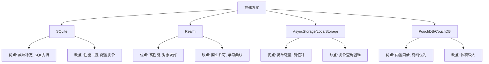
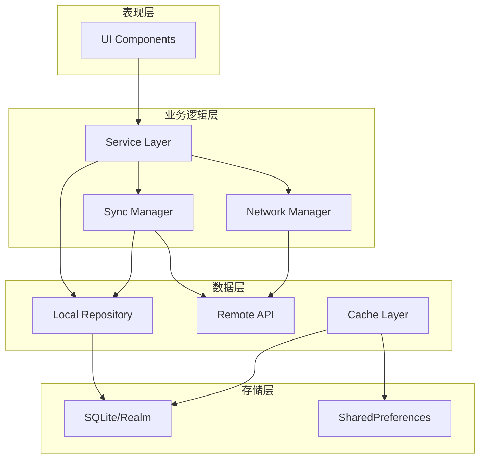
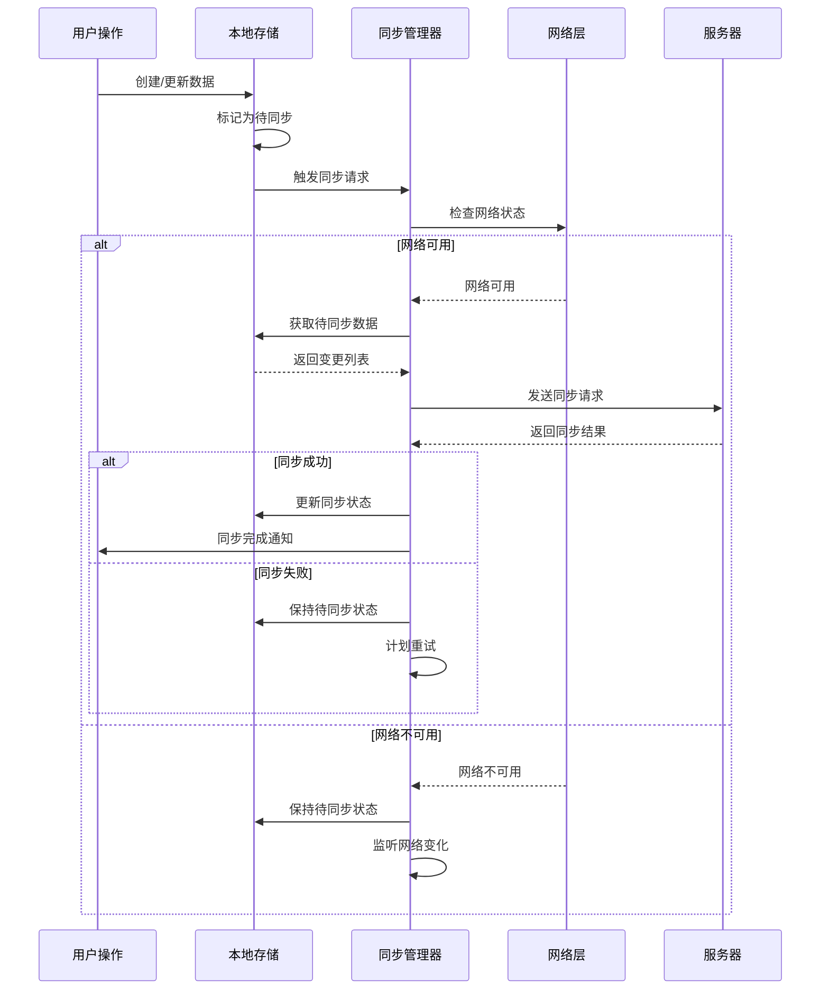

# 跨平台移动应用

**生成时间**: 2026-06-05

---

## 完整文档.md

# 完整文档

**任务**: 跨平台移动应用
**时间**: 2026-06-04T23:30:35.483256

# 跨平台移动应用完整开发文档

## 目录
1. [项目概述](#项目概述)
2. [技术选型分析](#技术选型分析)
3. [系统架构设计](#系统架构设计)
4. [开发环境配置](#开发环境配置)
5. [开发流程与规范](#开发流程与规范)
6. [核心模块实现](#核心模块实现)
7. [性能优化策略](#性能优化策略)
8. [测试与质量保证](#测试与质量保证)
9. [发布与部署](#发布与部署)
10. [维护与迭代](#维护与迭代)
11. [常见问题与解决方案](#常见问题与解决方案)
12. [附录](#附录)

---

## 1. 项目概述 <a name="项目概述"></a>

### 1.1 项目背景
本项目旨在开发一款跨平台移动应用，支持iOS和Android两大移动操作系统，实现一套代码多平台运行的目标，降低开发成本，提高开发效率。

### 1.2 项目目标
- **商业目标**：快速覆盖主流移动平台，抢占市场份额
- **技术目标**：实现代码复用率 > 80%，性能接近原生应用
- **用户体验目标**：提供一致的跨平台用户体验
- **维护目标**：建立可维护的代码架构和文档体系

### 1.3 项目范围
- 支持平台：iOS 12+ / Android 8.0+
- 核心功能模块：用户系统、数据展示、本地存储、网络通信
- 不支持功能：硬件深度集成（如NFC、蓝牙低功耗）、高性能游戏

### 1.4 预期成果
1. 可发布的iOS和Android应用
2. 完整的源代码和版本控制记录
3. 详细的开发文档和API文档
4. 自动化测试和部署流水线

---

## 2. 技术选型分析 <a name="技术选型分析"></a>

### 2.1 主流跨平台框架对比

| 框架 | 语言 | 性能 | 生态系统 | 学习曲线 | 适用场景 |
|------|------|------|----------|----------|----------|
| **Flutter** | Dart | 高（自绘引擎） | 快速增长，Google支持 | 中等 | 复杂UI、高性能需求 |
| **React Native** | JavaScript/TypeScript | 中等（桥接原生） | 成熟，Facebook支持 | 低 | JavaScript团队、快速原型 |
| **.NET MAUI** | C# | 高（编译为原生） | .NET生态完整 | 中等 | .NET技术栈团队 |
| **Xamarin** | C# | 高（编译为原生） | 较成熟，Microsoft支持 | 中等 | 企业应用、.NET团队 |
| **Ionic** | JavaScript/TypeScript | 中等（Web技术） | 成熟，Capacitor/Cordova | 低 | Web团队、简单应用 |

### 2.2 技术选型决策

**最终选择：Flutter**

**选择理由：**
1. **性能优势**：Skia自绘引擎，60/120fps流畅体验
2. **开发效率**：热重载（Hot Reload）快速迭代
3. **UI一致性**：高度自定义组件，跨平台UI一致性高
4. **Google支持**：持续更新，Android优先支持
5. **社区活跃**：快速增长的开发者社区和丰富的插件库

**技术栈详情：**
```
前端框架：Flutter 3.x
状态管理：Riverpod + Bloc
网络请求：Dio
本地存储：Hive/SQLite
路由管理：go_router
依赖注入：GetIt
单元测试：flutter_test + mockito
集成测试：integration_test
```

---

## 3. 系统架构设计 <a name="系统架构设计"></a>

### 3.1 整体架构

采用**Clean Architecture**（清洁架构）+ **MVVM**模式：

```
┌─────────────────────────────────────┐
│           Presentation Layer        │
│  (UI Components, ViewModels)        │
├─────────────────────────────────────┤
│           Application Layer         │
│  (Use Cases, Business Logic)        │
├─────────────────────────────────────┤
│           Domain Layer              │
│  (Entities, Repository Interfaces)  │
├─────────────────────────────────────┤
│           Infrastructure Layer      │
│  (Data Sources, API, Local DB)      │
└─────────────────────────────────────┘
```

### 3.2 模块化设计

```
lib/
├── core/                # 核心基础模块
│   ├── constants/       # 常量定义
│   ├── di/              # 依赖注入配置
│   ├── errors/          # 错误处理
│   ├── network/         # 网络配置
│   ├── theme/           # 主题配置
│   └── utils/           # 工具类
│
├── features/            # 功能模块（按功能划分）
│   ├── auth/            # 认证模块
│   │   ├── data/        # 数据层
│   │   ├── domain/      # 领域层
│   │   └── presentation/# 展示层
│   │
│   ├── home/            # 首页模块
│   ├── profile/         # 个人资料模块
│   └── settings/        # 设置模块
│
├── shared/              # 共享组件
│   ├── widgets/         # 通用UI组件
│   ├── models/          # 共享数据模型
│   └── services/        # 共享服务
│
└── main.dart            # 应用入口
```

### 3.3 数据流设计

```
┌─────────┐    ┌─────────────┐    ┌─────────────┐    ┌─────────┐
│   UI    │◄───│  ViewModel  │◄───│   UseCase   │◄───│Repository│
│ (Widget)│    │  (State)    │    │ (Business)  │    │ (Data)  │
└─────────┘    └─────────────┘    └─────────────┘    └─────────┘
       │              │                    │                │
       ▼              ▼                    ▼                ▼
    Events      State Updates      Execute Logic    Data Operations
```

### 3.4 网络通信架构

```dart
// 网络分层设计
abstract class NetworkClient {
  Future<Response> get(String url, {Map<String, dynamic>? params});
  Future<Response> post(String url, {dynamic data});
  // ...其他HTTP方法
}

class DioClient implements NetworkClient {
  late Dio _dio;
  
  DioClient() {
    _dio = Dio(BaseOptions(
      baseUrl: 'https://api.example.com',
      connectTimeout: const Duration(seconds: 30),
      receiveTimeout: const Duration(seconds: 30),
    ));
    
    // 添加拦截器
    _dio.interceptors.addAll([
      LogInterceptor(),
      AuthInterceptor(),
      ErrorInterceptor(),
    ]);
  }
}
```

### 3.5 数据持久化策略

1. **关键数据**：SQLite（结构化数据）
2. **用户偏好**：SharedPreferences/Hive（轻量级）
3. **缓存数据**：本地文件系统（图片、文件）
4. **敏感信息**：Keychain (iOS) / Keystore (Android)

---

## 4. 开发环境配置 <a name="开发环境配置"></a>

### 4.1 系统要求
- **操作系统**：macOS 12+ / Windows 10+ / Linux (Ubuntu 18.04+)
- **磁盘空间**：至少10GB可用空间
- **内存**：至少8GB RAM

### 4.2 开发工具安装

#### 4.2.1 Flutter SDK安装
```bash
# macOS/Linux
git clone https://github.com/flutter/flutter.git -b stable
export PATH="$PATH:`pwd`/flutter/bin"

# Windows (PowerShell)
git clone https://github.com/flutter/flutter.git -b stable
$env:Path += ";$(Get-Location)\flutter\bin"
```

#### 4.2.2 IDE配置
**推荐：Android Studio + Flutter插件 或 VS Code + Flutter插件**

1. **VS Code配置**：
   - 安装Flutter扩展
   - 安装Dart扩展
   - 安装Pubspec Assist扩展
   - 配置Dart分析器

2. **Android Studio配置**：
   - 安装Flutter插件
   - 安装Dart插件
   - 配置模拟器

#### 4.2.3 平台特定配置

**iOS开发配置：**
```bash
# 安装Xcode
xcode-select --install
sudo xcodebuild -license accept

# 安装CocoaPods
sudo gem install cocoapods
pod setup
```

**Android开发配置：**
```bash
# 安装Android SDK
# 通过Android Studio安装或手动下载
export ANDROID_HOME=$HOME/Library/Android/sdk
export PATH=$PATH:$ANDROID_HOME/emulator
export PATH=$PATH:$ANDROID_HOME/tools
export PATH=$PATH:$ANDROID_HOME/platform-tools
```

### 4.3 项目初始化

```bash
# 创建新项目
flutter create --org com.yourcompany --project-name your_app .

# 项目结构初始化
flutter pub get

# 运行项目
flutter run -d <device_id>
```

### 4.4 依赖管理配置

```yaml
# pubspec.yaml
name: your_app
description: A new Flutter project.
version: 1.0.0+1

environment:
  sdk: '>=3.0.0 <4.0.0'
  flutter: '>=3.10.0'

dependencies:
  flutter:
    sdk: flutter
  flutter_riverpod: ^2.3.6
  go_router: ^8.0.0
  dio: ^5.1.2
  hive: ^2.2.3
  hive_flutter: ^1.1.0
  shared_preferences: ^2.1.1
  flutter_secure_storage: ^8.0.0
  connectivity_plus: ^4.0.0
  package_info_plus: ^4.0.2
  image_picker: ^0.8.7
  cached_network_image: ^3.2.3
  flutter_localizations:
    sdk: flutter
  intl: ^0.18.0

dev_dependencies:
  flutter_test:
    sdk: flutter
  flutter_lints: ^2.0.0
  build_runner: ^2.3.3
  hive_generator: ^2.0.0
  json_serializable: ^6.6.2
  mockito: ^5.4.2
  bloc_test: ^9.1.3

flutter:
  uses-material-design: true
  
  assets:
    - assets/images/
    - assets/fonts/
  
  fonts:
    - family: CustomFont
      fonts:
        - asset: assets/fonts/CustomFont-Regular.ttf
        - asset: assets/fonts/CustomFont-Bold.ttf
          weight: 700
```

---

## 5. 开发流程与规范 <a name="开发流程与规范"></a>

### 5.1 Git工作流

采用**Git Flow**分支策略：

```
main        # 生产环境代码
├── develop # 开发主分支
│   ├── feature/xxx   # 功能开发分支
│   ├── bugfix/xxx    # 缺陷修复分支
│   └── release/v1.0  # 发布准备分支
└── hotfix/xxx        # 紧急修复分支
```

### 5.2 代码规范

#### 5.2.1 Dart代码规范
```dart
// 1. 命名规范
class UserProfilePage extends StatefulWidget { // 类名：大驼峰
  final String userId; // 变量名：小驼峰
  static const String routeName = '/profile'; // 常量：全小写加下划线
  
  const UserProfilePage({
    Key? key,
    required this.userId,
  }) : super(key: key);
  
  @override
  _UserProfilePageState createState() => _UserProfilePageState();
}

// 2. 文件组织
// 文件结构：先import，再常量，再类定义
// import顺序：dart库 -> 第三方库 -> 项目内部库

// 3. Widget构建规范
// 使用const构造函数
// 使用提取方法提高可读性
Widget _buildHeader() {
  return Container(
    padding: const EdgeInsets.all(16.0),
    child: Text(
      'Header',
      style: Theme.of(context).textTheme.headline6,
    ),
  );
}
```

#### 5.2.2 项目结构规范
```
每个功能模块遵循分层架构：
data/          # 数据层
├── datasources/    # 数据源（API、本地）
├── models/         # 数据模型
└── repositories/   # 仓库实现

domain/        # 领域层
├── entities/       # 实体
├── repositories/   # 仓库接口
└── usecases/       # 用例

presentation/  # 展示层
├── pages/          # 页面
├── providers/      # 状态管理
└── widgets/        # UI组件
```

### 5.3 开发工作流程

1. **需求分析**：明确功能需求和验收标准
2. **技术设计**：设计模块接口和数据结构
3. **编码实现**：遵循TDD（测试驱动开发）
4. **代码审查**：至少两人审查，确保代码质量
5. **单元测试**：覆盖率 > 80%
6. **集成测试**：关键流程自动化测试
7. **UI测试**：视觉回归测试
8. **性能测试**：关键指标监控
9. **文档更新**：及时更新技术文档

### 5.4 版本管理

```yaml
# 版本号规则：主版本.次版本.修订号+构建号
version: 1.2.3+456

# 版本递增规则：
# 主版本：重大功能变更或架构调整
# 次版本：新功能添加
# 修订号：缺陷修复
# 构建号：CI/CD自动生成
```

---

## 6. 核心模块实现 <a name="核心模块实现"></a>

### 6.1 应用入口与配置

```dart
// main.dart
void main() async {
  WidgetsFlutterBinding.ensureInitialized();
  
  // 初始化服务
  await _initializeServices();
  
  // 启动应用
  runApp(
    const ProviderScope(
      child: MyApp(),
    ),
  );
}

Future<void> _initializeServices() async {
  // 初始化本地存储
  await Hive.initFlutter();
  await Hive.openBox('settings');
  await Hive.openBox('cache');
  
  // 初始化依赖注入
  await configureDependencies();
  
  // 初始化网络状态监听
  await NetworkManager.initialize();
  
  // 初始化崩溃报告
  await CrashReporter.initialize();
}
```

### 6.2 状态管理实现（Riverpod + Bloc）

```dart
// 状态管理示例
final authProvider = StateNotifierProvider<AuthNotifier, AuthState>((ref) {
  return AuthNotifier(
    ref.read(authRepositoryProvider),
    ref.read(userRepositoryProvider),
  );
});

class AuthNotifier extends StateNotifier<AuthState> {
  final AuthRepository _authRepository;
  final UserRepository _userRepository;
  
  AuthNotifier(this._authRepository, this._userRepository)
      : super(const AuthState.initial());
  
  Future<void> signIn({required String email, required String password}) async {
    state = const AuthState.loading();
    
    try {
      final user = await _authRepository.signIn(
        email: email,
        password: password,
      );
      
      // 获取用户资料
      final userProfile = await _userRepository.getProfile(user.id);
      
      state = AuthState.authenticated(user: user, profile: userProfile);
    } on AuthException catch (e) {
      state = AuthState.error(message: e.message);
    } catch (e) {
      state = const AuthState.error(message: '登录失败，请重试');
    }
  }
  
  Future<void> signOut() async {
    await _authRepository.signOut();
    state = const AuthState.unauthenticated();
  }
}

// 状态类定义
@freezed
class AuthState with _$AuthState {
  const factory AuthState.initial() = Initial;
  const factory AuthState.loading() = Loading;
  const factory AuthState.authenticated({
    required User user,
    required UserProfile profile,
  }) = Authenticated;
  const factory AuthState.unauthenticated() = Unauthenticated;
  const factory AuthState.error({required String message}) = Error;
}
```

### 6.3 网络层封装

```dart
// 网络请求封装
class ApiClient {
  final Dio _dio;
  final Connectivity _connectivity;
  
  ApiClient(this._dio, this._connectivity);
  
  Future<ApiResponse<T>> request<T>(
    String path, {
    required T Function(Map<String, dynamic>) fromJson,
    String method = 'GET',
    Map<String, dynamic>? data,
    Map<String, dynamic>? queryParameters,
    CancelToken? cancelToken,
  }) async {
    // 检查网络连接
    final connectivityResult = await _connectivity.checkConnectivity();
    if (connectivityResult == ConnectivityResult.none) {
      return ApiResponse.error(
        error: NetworkError.noConnection,
        message: '无网络连接',
      );
    }
    
    try {
      final response = await _dio.request(
        path,
        data: data,
        queryParameters: queryParameters,
        options: Options(method: method),
        cancelToken: cancelToken,
      );
      
      // 处理响应
      if (response.statusCode == 200) {
        final data = fromJson(response.data);
        return ApiResponse.success(data: data);
      } else {
        return ApiResponse.error(
          error: NetworkError.serverError,
          message: '服务器错误：${response.statusCode}',
        );
      }
    } on DioException catch (e) {
      return _handleDioError(e);
    } catch (e) {
      return ApiResponse.error(
        error: NetworkError.unknown,
        message: '未知错误：$e',
      );
    }
  }
  
  ApiResponse<T> _handleDioError<T>(DioException error) {
    switch (error.type) {
      case DioExceptionType.connectionTimeout:
      case DioExceptionType.sendTimeout:
      case DioExceptionType.receiveTimeout:
        return ApiResponse.error(
          error: NetworkError.timeout,
          message: '请求超时',
        );
      case DioExceptionType.badResponse:
        return ApiResponse.error(
          error: NetworkError.badResponse,
          message: '响应格式错误',
        );
      case DioExceptionType.cancel:
        return ApiResponse.error(
          error: NetworkError.cancelled,
          message: '请求已取消',
        );
      default:
        return ApiResponse.error(
          error: NetworkError.unknown,
          message: '网络错误：${error.message}',
        );
    }
  }
}
```

### 6.4 路由管理

```dart
// 路由配置
final appRouter = GoRouter(
  initialLocation: '/',
  routes: [
    GoRoute(
      path: '/',
      builder: (context, state) => const SplashScreen(),
    ),
    GoRoute(
      path: '/auth',
      builder: (context, state) => const AuthPage(),
      routes: [
        GoRoute(
          path: 'login',
          builder: (context, state) => const LoginPage(),
        ),
        GoRoute(
          path: 'register',
          builder: (context, state) => const RegisterPage(),
        ),
      ],
    ),
    ShellRoute(
      builder: (context, state, child) {
        return MainLayout(child: child);
      },
      routes: [
        GoRoute(
          path: '/home',
          pageBuilder: (context, state) => const NoTransitionPage(
            child: HomePage(),
          ),
        ),
        GoRoute(
          path: '/profile',
          pageBuilder: (context, state) => const NoTransitionPage(
            child: ProfilePage(),
          ),
        ),
        GoRoute(
          path: '/settings',
          pageBuilder: (context, state) => const NoTransitionPage(
            child: SettingsPage(),
          ),
        ),
      ],
    ),
    GoRoute(
      path: '/detail/:id',
      builder: (context, state) {
        final id = state.pathParameters['id']!;
        return DetailPage(id: id);
      },
    ),
  ],
  redirect: (context, state) {
    final isAuthenticated = ref.read(authProvider).maybeWhen(
      authenticated: () => true,
      orElse: () => false,
    );
    
    final isAuthRoute = state.matchedLocation.startsWith('/auth');
    
    if (!isAuthenticated && !isAuthRoute) {
      return '/auth/login';
    }
    
    if (isAuthenticated && isAuthRoute) {
      return '/home';
    }
    
    return null;
  },
);
```

---

## 7. 性能优化策略 <a name="性能优化策略"></a>

### 7.1 UI渲染优化

```dart
// 1. 使用const构造函数
const Text('Hello World')

// 2. 避免不必要的重建
Widget build(BuildContext context) {
  return ListView.builder(
    itemCount: items.length,
    itemBuilder: (context, index) {
      return ItemWidget(
        key: ValueKey(items[index].id), // 使用唯一key
        item: items[index],
      );
    },
  );
}

// 3. 使用RepaintBoundary隔离重绘区域
RepaintBoundary(
  child: ComplexWidget(),
)

// 4. 优化图片加载
CachedNetworkImage(
  imageUrl: 'https://example.com/image.jpg',
  placeholder: (context, url) => CircularProgressIndicator(),
  errorWidget: (context, url, error) => Icon(Icons.error),
  memCacheWidth: 300, // 限制内存缓存尺寸
  memCacheHeight: 300,
)
```

### 7.2 网络优化

```dart
// 1. 请求缓存策略
class CacheInterceptor extends Interceptor {
  @override
  void onRequest(RequestOptions options, RequestInterceptorHandler handler) {
    // 检查缓存
    if (options.extra['cacheEnabled'] == true) {
      final cacheKey = _generateCacheKey(options);
      final cachedResponse = CacheManager.get(cacheKey);
      
      if (cachedResponse != null) {
        handler.resolve(cachedResponse);
        return;
      }
    }
    
    handler.next(options);
  }
  
  @override
  void onResponse(Response response, ResponseInterceptorHandler handler) {
    // 缓存响应
    if (response.requestOptions.extra['cacheEnabled'] == true) {
      final cacheKey = _generateCacheKey(response.requestOptions);
      CacheManager.put(cacheKey, response);
    }
    
    handler.next(response);
  }
}

// 2. 请求合并
class RequestBatcher {
  final Map<String, List<Completer<dynamic>>> _pendingRequests = {};
  final Duration _batchDelay;
  
  RequestBatcher({Duration? batchDelay}) 
    : _batchDelay = batchDelay ?? const Duration(milliseconds: 50);
  
  Future<T> batchRequest<T>(String key, Future<T> Function() request) {
    final completer = Completer<T>();
    
    _pendingRequests[key] ??= [];
    _pendingRequests[key]!.add(completer);
    
    if (_pendingRequests[key]!.length == 1) {
      // 首个请求，安排批处理
      Future.delayed(_batchDelay, () async {
        final requests = _pendingRequests.remove(key)!;
        try {
          final result = await request();
          for (final completer in requests) {
            completer.complete(result);
          }
        } catch (e) {
          for (final completer in requests) {
            completer.completeError(e);
          }
        }
      });
    }
    
    return completer.future;
  }
}
```

### 7.3 内存优化

```dart
// 1. 及时释放资源
class MyController extends Disposable {
  StreamSubscription? _subscription;
  
  void init() {
    _subscription = stream.listen((data) {
      // 处理数据
    });
  }
  
  @override
  void dispose() {
    _subscription?.cancel();
    super.dispose();
  }
}

// 2. 优化集合操作
// 使用生成器处理大数据
Iterable<int> generateLargeList() sync* {
  for (int i = 0; i < 1000000; i++) {
    yield i;
  }
}

// 3. 图片内存管理
Image.memory(
  imageBytes,
  cacheWidth: 300, // 限制解码尺寸
  cacheHeight: 300,
)
```

### 7.4 启动优化

```dart
// 1. 延迟初始化
Future<void> main() async {
  // 立即需要的初始化
  WidgetsFlutterBinding.ensureInitialized();
  
  // 启动应用
  runApp(const MyApp());
  
  // 延迟初始化非关键服务
  Future.delayed(const Duration(seconds: 2), () {
    _initializeNonCriticalServices();
  });
}

// 2. 预加载关键资源
class AssetPreloader {
  static Future<void> preloadCriticalAssets(BuildContext context) async {
    // 预加载关键图片
    await precacheImage(
      const AssetImage('assets/images/logo.png'),
      context,
    );
    
    // 预加载关键字体
    await loadFont('assets/fonts/CustomFont.ttf');
  }
}
```

---

## 8. 测试与质量保证 <a name="测试与质量保证"></a>

### 8.1 测试策略

#### 8.1.1 单元测试
```dart
// 用户仓库测试
class UserRepositoryTest {
  late UserRepository userRepository;
  late MockApiClient mockApiClient;
  late MockLocalStorage mockLocalStorage;
  
  setUp(() {
    mockApiClient = MockApiClient();
    mockLocalStorage = MockLocalStorage();
    userRepository = UserRepository(mockApiClient, mockLocalStorage);
  });
  
  group('UserRepository', () {
    test('should return user from API when local cache is empty', () async {
      // Arrange
      final mockUser = User(id: '1', name: 'Test User');
      when(mockApiClient.getUser('1'))
          .thenAnswer((_) async => ApiResponse.success(data: mockUser));
      when(mockLocalStorage.getUser('1')).thenReturn(null);
      
      // Act
      final result = await userRepository.getUser('1');
      
      // Assert
      expect(result, mockUser);
      verify(mockApiClient.getUser('1')).called(1);
      verify(mockLocalStorage.saveUser(mockUser)).called(1);
    });
    
    test('should return user from local cache when available', () async {
      // Arrange
      final mockUser = User(id: '1', name: 'Cached User');
      when(mockLocalStorage.getUser('1')).thenReturn(mockUser);
      
      // Act
      final result = await userRepository.getUser('1');
      
      // Assert
      expect(result, mockUser);
      verifyNever(mockApiClient.getUser('1'));
    });
  });
}
```

#### 8.1.2 集成测试
```dart
// 登录流程集成测试
void main() {
  IntegrationTestWidgetsFlutterBinding.ensureInitialized();
  
  group('Login Flow', () {
    testWidgets('should navigate to home after successful login', (tester) async {
      // Arrange
      await tester.pumpWidget(const MyApp());
      await tester.pumpAndSettle();
      
      // Act - 输入邮箱
      await tester.enterText(
        find.byKey(const Key('email_field')),
        'test@example.com',
      );
      
      // Act - 输入密码
      await tester.enterText(
        find.byKey(const Key('password_field')),
        'password123',
      );
      
      // Act - 点击登录按钮
      await tester.tap(find.byKey(const Key('login_button')));
      await tester.pumpAndSettle();
      
      // Assert - 验证是否跳转到首页
      expect(find.byType(HomePage), findsOneWidget);
      expect(find.text('Welcome'), findsOneWidget);
    });
    
    testWidgets('should show error message for invalid credentials', (tester) async {
      // Arrange
      await tester.pumpWidget(const MyApp());
      await tester.pumpAndSettle();
      
      // Act - 输入错误凭证
      await tester.enterText(
        find.byKey(const Key('email_field')),
        'invalid@example.com',
      );
      
      await tester.enterText(
        find.byKey(const Key('password_field')),
        'wrongpassword',
      );
      
      await tester.tap(find.byKey(const Key('login_button')));
      await tester.pumpAndSettle();
      
      // Assert - 验证错误提示
      expect(find.text('登录失败'), findsOneWidget);
    });
  });
}
```

#### 8.1.3 性能测试
```dart
// 性能基准测试
void main() {
  group('Performance Tests', () {
    testWidgets('scroll performance test', (tester) async {
      // 预热
      await tester.pumpWidget(const MyApp());
      await tester.pumpAndSettle();
      
      // 记录开始时间
      final stopwatch = Stopwatch()..start();
      
      // 执行滚动操作
      for (int i = 0; i < 100; i++) {
        await tester.drag(
          find.byType(ListView),
          const Offset(0, -500),
        );
        await tester.pumpAndSettle();
      }
      
      stopwatch.stop();
      
      // 断言性能指标
      expect(stopwatch.elapsedMilliseconds, lessThan(5000));
    });
  });
}
```

### 8.2 代码质量工具

```yaml
# analysis_options.yaml
include: package:flutter_lints/flutter.yaml

analyzer:
  errors:
    missing_return: error
    dead_code: warning
  exclude:
    - "**/*.g.dart"
    - "**/*.freezed.dart"

linter:
  rules:
    - always_declare_return_types
    - always_put_required_named_parameters_first
    - annotate_overrides
    - avoid_empty_else
    - avoid_print
    - avoid_unnecessary_containers
    - avoid_web_libraries_in_flutter
    - camel_case_types
    - cancel_subscriptions
    - close_sinks
    - constant_identifier_names
    - empty_catches
    - empty_statements
    - hash_and_equals
    - no_duplicate_case_values
    - prefer_const_constructors
    - prefer_const_declarations
    - prefer_final_fields
    - prefer_final_locals
    - prefer_is_empty
    - prefer_is_not_empty
    - prefer_typing_uninitialized_variables
    - sized_box_for_whitespace
    - unnecessary_const
    - unnecessary_new
    - unnecessary_this
    - use_key_in_widget_constructors

# 自定义lint规则
custom_lint:
  rules:
    - avoid_print_in_release
    - no_magic_numbers
```

### 8.3 测试覆盖率

```bash
# 生成测试覆盖率报告
flutter test --coverage
genhtml coverage/lcov.info -o coverage/html
open coverage/html/index.html
```

---

## 9. 发布与部署 <a name="发布与部署"></a>

### 9.1 iOS发布流程

#### 9.1.1 准备工作
1. **Apple开发者账号**：注册年费$99的开发者账号
2. **证书与配置文件**：创建开发/发布证书和描述文件
3. **App Store Connect**：配置应用信息

#### 9.1.2 构建发布版本
```bash
# 1. 更新版本号
# 在pubspec.yaml中更新version字段

# 2. 构建iOS发布版
flutter build ios --release --no-codesign

# 3. 使用Xcode归档
# 打开ios/Runner.xcworkspace
# Product -> Archive
# 分发到App Store Connect
```

#### 9.1.3 App Store提交
1. 在App Store Connect创建新应用
2. 填写应用信息、截图、描述
3. 设置定价和可用性
4. 提交审核（通常需要24-48小时）

### 9.2 Android发布流程

#### 9.2.1 准备工作
1. **Google Play开发者账号**：一次性注册费$25
2. **签名密钥**：创建上传密钥和应用签名密钥

#### 9.2.2 构建发布版本
```bash
# 1. 创建密钥库
keytool -genkey -v -keystore ~/upload-keystore.jks -keyalg RSA -keysize 2048 -validity 10000 -alias upload

# 2. 配置密钥信息
# android/key.properties
storePassword=<password>
keyPassword=<password>
keyAlias=upload
storeFile=<keystore-file-path>

# 3. 配置build.gradle
# android/app/build.gradle
signingConfigs {
    release {
        keyAlias keystoreProperties['keyAlias']
        keyPassword keystoreProperties['keyPassword']
        storeFile keystoreProperties['storeFile'] ? file(keystoreProperties['storeFile']) : null
        storePassword keystoreProperties['storePassword']
    }
}
buildTypes {
    release {
        signingConfig signingConfigs.release
    }
}

# 4. 构建Android App Bundle
flutter build appbundle --release
```

#### 9.2.3 Google Play提交
1. 在Google Play Console创建新应用
2. 上传Android App Bundle
3. 填写应用信息、截图、描述
4. 设置定价和分发范围
5. 提交审核（通常需要3-7天）

### 9.3 CI/CD配置

#### 9.3.1 GitHub Actions配置
```yaml
# .github/workflows/ci.yml
name: CI/CD Pipeline

on:
  push:
    branches: [ main, develop ]
  pull_request:
    branches: [ main ]

jobs:
  test:
    runs-on: ubuntu-latest
    steps:
    - uses: actions/checkout@v3
    
    - name: Setup Flutter
      uses: subosito/flutter-action@v2
      with:
        flutter-version: '3.10.0

---

## 实现 UI 组件库.md

# 实现 UI 组件库

**任务**: 跨平台移动应用
**时间**: 2026-06-04T23:28:27.966915

# 跨平台移动应用 UI 组件库实现方案

## 一、技术选型与架构设计

### 1.1 技术栈选择
```bash
# 推荐技术栈组合
Framework: React Native 0.72+ / Expo SDK 50+
Language: TypeScript 5.0+
State Management: Zustand / Redux Toolkit
Styling: React Native StyleSheet + CSS-in-JS (Styled Components)
Testing: Jest + React Native Testing Library
Documentation: Storybook 7.0
```

### 1.2 项目结构设计
```
src/
├── components/          # 组件库核心目录
│   ├── atoms/           # 基础原子组件
│   │   ├── Button/
│   │   ├── Input/
│   │   ├── Typography/
│   │   └── ...
│   ├── molecules/       # 分子组件
│   │   ├── SearchBar/
│   │   ├── Card/
│   │   └── ...
│   ├── organisms/       # 有机体组件
│   │   ├── Header/
│   │   ├── Form/
│   │   └── ...
│   ├── templates/       # 模板组件
│   │   ├── AuthLayout/
│   │   ├── DashboardLayout/
│   │   └── ...
│   └── index.ts         # 统一导出
├── styles/              # 样式系统
│   ├── theme.ts         # 主题配置
│   ├── colors.ts        # 颜色系统
│   ├── typography.ts    # 排版系统
│   └── spacing.ts       # 间距系统
├── hooks/               # 自定义 Hooks
├── utils/               # 工具函数
├── types/               # TypeScript 类型定义
└── docs/                # 文档
```

## 二、核心组件实现

### 2.1 设计系统基础

```typescript
// src/styles/theme.ts
export interface Theme {
  colors: Colors;
  typography: Typography;
  spacing: Spacing;
  borderRadius: BorderRadius;
  shadows: Shadows;
  animation: Animation;
}

export interface Colors {
  primary: {
    light: string;
    main: string;
    dark: string;
    contrastText: string;
  };
  secondary: {
    light: string;
    main: string;
    dark: string;
    contrastText: string;
  };
  neutral: {
    white: string;
    gray100: string;
    gray200: string;
    // ... 更多灰色层次
    black: string;
  };
  semantic: {
    success: string;
    warning: string;
    error: string;
    info: string;
  };
}

export const defaultTheme: Theme = {
  colors: {
    primary: {
      light: '#66bb6a',
      main: '#4caf50',
      dark: '#388e3c',
      contrastText: '#ffffff',
    },
    secondary: {
      light: '#ff7961',
      main: '#f44336',
      dark: '#ba000d',
      contrastText: '#ffffff',
    },
    neutral: {
      white: '#ffffff',
      gray100: '#f5f5f5',
      gray200: '#eeeeee',
      gray300: '#e0e0e0',
      gray400: '#bdbdbd',
      gray500: '#9e9e9e',
      gray600: '#757575',
      gray700: '#616161',
      gray800: '#424242',
      gray900: '#212121',
      black: '#000000',
    },
    semantic: {
      success: '#4caf50',
      warning: '#ff9800',
      error: '#f44336',
      info: '#2196f3',
    },
  },
  typography: {
    fontFamily: 'System',
    fontSize: {
      xs: 12,
      sm: 14,
      md: 16,
      lg: 18,
      xl: 20,
      xxl: 24,
      xxxl: 32,
    },
    fontWeight: {
      regular: '400',
      medium: '500',
      semibold: '600',
      bold: '700',
    },
    lineHeight: {
      tight: 1.2,
      normal: 1.5,
      relaxed: 1.75,
    },
  },
  spacing: {
    xs: 4,
    sm: 8,
    md: 16,
    lg: 24,
    xl: 32,
    xxl: 48,
  },
  borderRadius: {
    sm: 4,
    md: 8,
    lg: 12,
    xl: 16,
    full: 9999,
  },
  shadows: {
    sm: {
      shadowColor: '#000',
      shadowOffset: { width: 0, height: 1 },
      shadowOpacity: 0.18,
      shadowRadius: 1.0,
      elevation: 1,
    },
    md: {
      shadowColor: '#000',
      shadowOffset: { width: 0, height: 2 },
      shadowOpacity: 0.2,
      shadowRadius: 3.0,
      elevation: 3,
    },
    lg: {
      shadowColor: '#000',
      shadowOffset: { width: 0, height: 4 },
      shadowOpacity: 0.25,
      shadowRadius: 4.0,
      elevation: 6,
    },
  },
  animation: {
    fast: 150,
    normal: 300,
    slow: 500,
  },
};
```

### 2.2 主题提供者组件

```typescript
// src/components/ThemeProvider/ThemeProvider.tsx
import React, { createContext, useContext, useMemo } from 'react';
import { Theme, defaultTheme } from '../../styles/theme';

interface ThemeProviderProps {
  theme?: Partial<Theme>;
  children: React.ReactNode;
}

interface ThemeContextType {
  theme: Theme;
  isDarkMode: boolean;
  toggleDarkMode: () => void;
}

const ThemeContext = createContext<ThemeContextType | undefined>(undefined);

export const ThemeProvider: React.FC<ThemeProviderProps> = ({
  theme: customTheme = {},
  children,
}) => {
  const [isDarkMode, setIsDarkMode] = React.useState(false);

  const mergedTheme = useMemo(() => {
    return {
      ...defaultTheme,
      ...customTheme,
      colors: {
        ...defaultTheme.colors,
        ...customTheme.colors,
        neutral: {
          ...defaultTheme.colors.neutral,
          ...(isDarkMode
            ? {
                white: '#121212',
                gray100: '#1e1e1e',
                gray200: '#2d2d2d',
                // ... 暗黑模式覆盖
              }
            : {}),
          ...customTheme.colors?.neutral,
        },
      },
    };
  }, [customTheme, isDarkMode]);

  const toggleDarkMode = () => setIsDarkMode(!isDarkMode);

  const contextValue = useMemo(
    () => ({
      theme: mergedTheme,
      isDarkMode,
      toggleDarkMode,
    }),
    [mergedTheme, isDarkMode, toggleDarkMode]
  );

  return (
    <ThemeContext.Provider value={contextValue}>
      {children}
    </ThemeContext.Provider>
  );
};

export const useTheme = (): ThemeContextType => {
  const context = useContext(ThemeContext);
  if (!context) {
    throw new Error('useTheme must be used within a ThemeProvider');
  }
  return context;
};
```

### 2.3 基础组件实现

#### 2.3.1 Button 组件

```typescript
// src/components/atoms/Button/Button.tsx
import React from 'react';
import {
  TouchableOpacity,
  Text,
  StyleSheet,
  ActivityIndicator,
  ViewStyle,
  TextStyle,
} from 'react-native';
import { useTheme } from '../../ThemeProvider/ThemeProvider';

export type ButtonVariant = 'primary' | 'secondary' | 'outline' | 'ghost';
export type ButtonSize = 'sm' | 'md' | 'lg';

export interface ButtonProps {
  variant?: ButtonVariant;
  size?: ButtonSize;
  disabled?: boolean;
  loading?: boolean;
  fullWidth?: boolean;
  leftIcon?: React.ReactNode;
  rightIcon?: React.ReactNode;
  onPress: () => void;
  style?: ViewStyle;
  textStyle?: TextStyle;
  children: string;
}

export const Button: React.FC<ButtonProps> = ({
  variant = 'primary',
  size = 'md',
  disabled = false,
  loading = false,
  fullWidth = false,
  leftIcon,
  rightIcon,
  onPress,
  style,
  textStyle,
  children,
}) => {
  const { theme } = useTheme();

  const buttonStyles = StyleSheet.create({
    container: {
      flexDirection: 'row',
      alignItems: 'center',
      justifyContent: 'center',
      borderRadius: theme.borderRadius.md,
      paddingVertical: size === 'sm' ? theme.spacing.xs : 
                      size === 'md' ? theme.spacing.sm : 
                      theme.spacing.md,
      paddingHorizontal: size === 'sm' ? theme.spacing.sm : 
                        size === 'md' ? theme.spacing.md : 
                        theme.spacing.lg,
      opacity: disabled ? 0.6 : 1,
      width: fullWidth ? '100%' : 'auto',
      ...(variant === 'primary' && {
        backgroundColor: disabled ? theme.colors.neutral.gray400 : theme.colors.primary.main,
      }),
      ...(variant === 'secondary' && {
        backgroundColor: disabled ? theme.colors.neutral.gray400 : theme.colors.secondary.main,
      }),
      ...(variant === 'outline' && {
        backgroundColor: 'transparent',
        borderWidth: 1,
        borderColor: disabled ? theme.colors.neutral.gray400 : theme.colors.primary.main,
      }),
      ...(variant === 'ghost' && {
        backgroundColor: 'transparent',
      }),
    },
    text: {
      fontWeight: theme.typography.fontWeight.semibold,
      color: variant === 'outline' || variant === 'ghost'
        ? theme.colors.primary.main
        : theme.colors.primary.contrastText,
      ...(size === 'sm' && {
        fontSize: theme.typography.fontSize.sm,
      }),
      ...(size === 'md' && {
        fontSize: theme.typography.fontSize.md,
      }),
      ...(size === 'lg' && {
        fontSize: theme.typography.fontSize.lg,
      }),
    },
  });

  return (
    <TouchableOpacity
      style={[buttonStyles.container, style]}
      onPress={onPress}
      disabled={disabled || loading}
      activeOpacity={0.7}
    >
      {loading ? (
        <ActivityIndicator
          size={size === 'sm' ? 'small' : 'small'}
          color={variant === 'outline' || variant === 'ghost' 
            ? theme.colors.primary.main 
            : theme.colors.primary.contrastText}
        />
      ) : (
        <>
          {leftIcon && <>{leftIcon}</>}
          <Text style={[buttonStyles.text, textStyle]}>{children}</Text>
          {rightIcon && <>{rightIcon}</>}
        </>
      )}
    </TouchableOpacity>
  );
};
```

#### 2.3.2 Input 组件

```typescript
// src/components/atoms/Input/Input.tsx
import React, { useState, useRef } from 'react';
import {
  View,
  TextInput,
  Text,
  StyleSheet,
  TouchableOpacity,
} from 'react-native';
import { useTheme } from '../../ThemeProvider/ThemeProvider';

export type InputVariant = 'default' | 'filled' | 'outline';

export interface InputProps {
  variant?: InputVariant;
  label?: string;
  placeholder?: string;
  value?: string;
  onChangeText?: (text: string) => void;
  onBlur?: () => void;
  onFocus?: () => void;
  secureTextEntry?: boolean;
  multiline?: boolean;
  numberOfLines?: number;
  maxLength?: number;
  leftIcon?: React.ReactNode;
  rightIcon?: React.ReactNode;
  error?: string;
  disabled?: boolean;
  style?: object;
}

export const Input: React.FC<InputProps> = ({
  variant = 'default',
  label,
  placeholder,
  value,
  onChangeText,
  onBlur,
  onFocus,
  secureTextEntry,
  multiline,
  numberOfLines = 1,
  maxLength,
  leftIcon,
  rightIcon,
  error,
  disabled = false,
  style,
}) => {
  const { theme } = useTheme();
  const [isFocused, setIsFocused] = useState(false);
  const inputRef = useRef<TextInput>(null);

  const handleFocus = () => {
    setIsFocused(true);
    onFocus?.();
  };

  const handleBlur = () => {
    setIsFocused(false);
    onBlur?.();
  };

  const containerStyle = StyleSheet.create({
    container: {
      marginBottom: error ? theme.spacing.xs : theme.spacing.md,
    },
    label: {
      fontSize: theme.typography.fontSize.sm,
      color: disabled 
        ? theme.colors.neutral.gray500 
        : error 
          ? theme.colors.semantic.error 
          : theme.colors.neutral.gray700,
      marginBottom: theme.spacing.xs,
    },
    inputContainer: {
      flexDirection: 'row',
      alignItems: 'center',
      borderRadius: theme.borderRadius.md,
      paddingHorizontal: theme.spacing.sm,
      minHeight: 44,
      backgroundColor: variant === 'filled' 
        ? theme.colors.neutral.gray100 
        : 'transparent',
      borderWidth: variant === 'outline' ? 1 : 0,
      borderColor: error 
        ? theme.colors.semantic.error 
        : isFocused 
          ? theme.colors.primary.main 
          : theme.colors.neutral.gray300,
    },
    input: {
      flex: 1,
      fontSize: theme.typography.fontSize.md,
      color: disabled ? theme.colors.neutral.gray500 : theme.colors.neutral.gray900,
      paddingVertical: theme.spacing.sm,
      paddingHorizontal: theme.spacing.sm,
      ...(multiline && {
        minHeight: numberOfLines * 24,
        textAlignVertical: 'top',
      }),
    },
    errorText: {
      fontSize: theme.typography.fontSize.xs,
      color: theme.colors.semantic.error,
      marginTop: theme.spacing.xs,
    },
    icon: {
      marginHorizontal: theme.spacing.xs,
    },
  });

  return (
    <View style={[containerStyle.container, style]}>
      {label && <Text style={containerStyle.label}>{label}</Text>}
      <TouchableOpacity
        style={containerStyle.inputContainer}
        onPress={() => inputRef.current?.focus()}
        activeOpacity={0.9}
      >
        {leftIcon && <View style={containerStyle.icon}>{leftIcon}</View>}
        <TextInput
          ref={inputRef}
          style={containerStyle.input}
          placeholder={placeholder}
          placeholderTextColor={theme.colors.neutral.gray500}
          value={value}
          onChangeText={onChangeText}
          onFocus={handleFocus}
          onBlur={handleBlur}
          secureTextEntry={secureTextEntry}
          multiline={multiline}
          numberOfLines={numberOfLines}
          maxLength={maxLength}
          editable={!disabled}
        />
        {rightIcon && <View style={containerStyle.icon}>{rightIcon}</View>}
      </TouchableOpacity>
      {error && <Text style={containerStyle.errorText}>{error}</Text>}
    </View>
  );
};
```

#### 2.3.3 Card 组件

```typescript
// src/components/molecules/Card/Card.tsx
import React from 'react';
import {
  View,
  StyleSheet,
  TouchableOpacity,
  Image,
  ViewStyle,
} from 'react-native';
import { useTheme } from '../../ThemeProvider/ThemeProvider';
import { Typography } from '../Typography/Typography';

export interface CardProps {
  title?: string;
  subtitle?: string;
  description?: string;
  imageSource?: { uri: string } | number;
  header?: React.ReactNode;
  footer?: React.ReactNode;
  onPress?: () => void;
  style?: ViewStyle;
  elevation?: 'none' | 'sm' | 'md' | 'lg';
}

export const Card: React.FC<CardProps> = ({
  title,
  subtitle,
  description,
  imageSource,
  header,
  footer,
  onPress,
  style,
  elevation = 'md',
}) => {
  const { theme } = useTheme();

  const cardStyles = StyleSheet.create({
    container: {
      backgroundColor: theme.colors.neutral.white,
      borderRadius: theme.borderRadius.lg,
      overflow: 'hidden',
      ...(elevation !== 'none' && theme.shadows[elevation]),
    },
    image: {
      width: '100%',
      height: 200,
      backgroundColor: theme.colors.neutral.gray200,
    },
    content: {
      padding: theme.spacing.md,
    },
    title: {
      fontSize: theme.typography.fontSize.lg,
      fontWeight: theme.typography.fontWeight.bold,
      color: theme.colors.neutral.gray900,
      marginBottom: theme.spacing.xs,
    },
    subtitle: {
      fontSize: theme.typography.fontSize.sm,
      color: theme.colors.neutral.gray600,
      marginBottom: theme.spacing.sm,
    },
    description: {
      fontSize: theme.typography.fontSize.md,
      color: theme.colors.neutral.gray700,
      lineHeight: 24,
    },
    headerContainer: {
      borderBottomWidth: 1,
      borderBottomColor: theme.colors.neutral.gray200,
    },
    footerContainer: {
      borderTopWidth: 1,
      borderTopColor: theme.colors.neutral.gray200,
    },
  });

  const Content = () => (
    <>
      {header && (
        <View style={cardStyles.headerContainer}>{header}</View>
      )}
      
      {imageSource && (
        <Image source={imageSource} style={cardStyles.image} resizeMode="cover" />
      )}
      
      <View style={cardStyles.content}>
        {title && <Typography style={cardStyles.title}>{title}</Typography>}
        {subtitle && (
          <Typography style={cardStyles.subtitle}>{subtitle}</Typography>
        )}
        {description && (
          <Typography style={cardStyles.description}>{description}</Typography>
        )}
      </View>
      
      {footer && (
        <View style={cardStyles.footerContainer}>{footer}</View>
      )}
    </>
  );

  if (onPress) {
    return (
      <TouchableOpacity
        style={[cardStyles.container, style]}
        onPress={onPress}
        activeOpacity={0.95}
      >
        <Content />
      </TouchableOpacity>
    );
  }

  return (
    <View style={[cardStyles.container, style]}>
      <Content />
    </View>
  );
};
```

## 三、高级功能实现

### 3.1 响应式布局系统

```typescript
// src/components/layout/ResponsiveContainer/ResponsiveContainer.tsx
import React from 'react';
import { View, StyleSheet, useWindowDimensions } from 'react-native';
import { useTheme } from '../../ThemeProvider/ThemeProvider';

interface Breakpoints {
  mobile: number;
  tablet: number;
  desktop: number;
}

const defaultBreakpoints: Breakpoints = {
  mobile: 576,
  tablet: 768,
  desktop: 1024,
};

interface ResponsiveContainerProps {
  children: React.ReactNode;
  breakpoints?: Partial<Breakpoints>;
  style?: object;
}

export const ResponsiveContainer: React.FC<ResponsiveContainerProps> = ({
  children,
  breakpoints = {},
  style,
}) => {
  const { theme } = useTheme();
  const { width } = useWindowDimensions();
  
  const mergedBreakpoints = { ...defaultBreakpoints, ...breakpoints };
  
  const getBreakpoint = () => {
    if (width < mergedBreakpoints.mobile) return 'mobile';
    if (width < mergedBreakpoints.tablet) return 'tablet';
    return 'desktop';
  };

  const breakpoint = getBreakpoint();

  const containerStyle = StyleSheet.create({
    container: {
      flex: 1,
      padding: breakpoint === 'mobile' ? theme.spacing.sm : theme.spacing.md,
      maxWidth: breakpoint === 'desktop' ? 1200 : '100%',
      alignSelf: 'center',
    },
  });

  return (
    <View style={[containerStyle.container, style]}>
      {children}
    </View>
  );
};
```

### 3.2 动画系统

```typescript
// src/hooks/useAnimation.ts
import { useRef, useEffect } from 'react';
import { Animated } from 'react-native';

export interface AnimationConfig {
  duration?: number;
  delay?: number;
  useNativeDriver?: boolean;
  easing?: (value: number) => number;
}

export const useAnimation = (config: AnimationConfig = {}) => {
  const animatedValue = useRef(new Animated.Value(0)).current;
  const isVisible = useRef(false);

  const defaultConfig = {
    duration: 300,
    delay: 0,
    useNativeDriver: true,
    easing: undefined,
    ...config,
  };

  const fadeIn = () => {
    Animated.timing(animatedValue, {
      toValue: 1,
      ...defaultConfig,
    }).start(() => {
      isVisible.current = true;
    });
  };

  const fadeOut = () => {
    Animated.timing(animatedValue, {
      toValue: 0,
      ...defaultConfig,
    }).start(() => {
      isVisible.current = false;
    });
  };

  const slideIn = (direction: 'up' | 'down' | 'left' | 'right' = 'up', distance = 50) => {
    const initialValue = direction === 'up' || direction === 'left' ? distance : -distance;
    
    animatedValue.setValue(initialValue);
    
    Animated.timing(animatedValue, {
      toValue: 0,
      ...defaultConfig,
    }).start(() => {
      isVisible.current = true;
    });
  };

  const scale = (toValue = 1) => {
    Animated.spring(animatedValue, {
      toValue,
      useNativeDriver: defaultConfig.useNativeDriver,
      bounciness: 8,
      speed: 12,
    }).start();
  };

  const interpolate = (
    inputRange: number[],
    outputRange: number[] | string[],
    extrapolate?: 'clamp' | 'extend' | 'identity'
  ) => {
    return animatedValue.interpolate({
      inputRange,
      outputRange,
      extrapolate: extrapolate || 'clamp',
    });
  };

  useEffect(() => {
    return () => {
      animatedValue.stopAnimation();
    };
  }, []);

  return {
    animatedValue,
    isVisible: isVisible.current,
    fadeIn,
    fadeOut,
    slideIn,
    scale,
    interpolate,
  };
};
```

### 3.3 表单验证系统

```typescript
// src/components/organisms/Form/FormValidator.ts
export interface ValidationRule {
  type: 'required' | 'email' | 'minLength' | 'maxLength' | 'pattern' | 'custom';
  value?: any;
  message: string;
}

export interface ValidationResult {
  isValid: boolean;
  errors: Record<string, string[]>;
}

export class FormValidator {
  private rules: Record<string, ValidationRule[]> = {};
  private values: Record<string, any> = {};

  constructor(initialValues: Record<string, any> = {}) {
    this.values = initialValues;
  }

  setRules(field: string, rules: ValidationRule[]) {
    this.rules[field] = rules;
    return this;
  }

  setValue(field: string, value: any) {
    this.values[field] = value;
    return this;
  }

  validate(): ValidationResult {
    const errors: Record<string, string[]> = {};
    let isValid = true;

    Object.keys(this.rules).forEach(field => {
      const fieldRules = this.rules[field];
      const value = this.values[field];
      const fieldErrors: string[] = [];

      fieldRules.forEach(rule => {
        if (!this.validateRule(rule, value)) {
          fieldErrors.push(rule.message);
          isValid = false;
        }
      });

      if (fieldErrors.length > 0) {
        errors[field] = fieldErrors;
      }
    });

    return { isValid, errors };
  }

  private validateRule(rule: ValidationRule, value: any): boolean {
    switch (rule.type) {
      case 'required':
        return value !== undefined && value !== null && value !== '';
      
      case 'email':
        return /^[^\s@]+@[^\s@]+\.[^\s@]+$/.test(value);
      
      case 'minLength':
        return typeof value === 'string' && value.length >= (rule.value || 0);
      
      case 'maxLength':
        return typeof value === 'string' && value.length <= (rule.value || Infinity);
      
      case 'pattern':
        return rule.value instanceof RegExp && rule.value.test(value);
      
      case 'custom':
        return typeof rule.value === 'function' && rule.value(value);
      
      default:
        return true;
    }
  }
}
```

## 四、文档与示例

### 4.1 Storybook 配置

```javascript
// .storybook/main.js
module.exports = {
  stories: ['../src/**/*.stories.@(js|jsx|ts|tsx|mdx)'],
  addons: [
    '@storybook/addon-links',
    '@storybook/addon-essentials',
    '@storybook/addon-react-native-web',
  ],
  typescript: {
    check: false,
    checkOptions: {},
    reactDocgen: 'react-docgen-typescript',
    reactDocgenTypescriptOptions: {
      shouldExtractLiteralValuesFromEnum: true,
      propFilter: (prop) =>
        prop.parent ? !/node_modules/.test(prop.parent.fileName) : true,
    },
  },
};
```

### 4.2 使用示例

```typescript
// src/examples/LoginScreen.tsx
import React, { useState } from 'react';
import { View, StyleSheet } from 'react-native';
import { ThemeProvider, Button, Input, Card, Typography } from '../components';
import { MaterialIcons } from '@expo/vector-icons';

const LoginScreen: React.FC = () => {
  const [email, setEmail] = useState('');
  const [password, setPassword] = useState('');

  const handleLogin = () => {
    // 登录逻辑
  };

  return (
    <ThemeProvider>
      <View style={styles.container}>
        <Card
          title="欢迎登录"
          subtitle="请使用您的账户信息登录"
          style={styles.card}
        >
          <Input
            label="邮箱"
            placeholder="请输入邮箱地址"
            value={email}
            onChangeText={setEmail}
            leftIcon={<MaterialIcons name="email" size={20} color="#757575" />}
            keyboardType="email-address"
            autoCapitalize="none"
          />

          <Input
            label="密码"
            placeholder="请输入密码"
            value={password}
            onChangeText={setPassword}
            leftIcon={<MaterialIcons name="lock" size={20} color="#757575" />}
            secureTextEntry
          />

          <Button
            variant="primary"
            fullWidth
            onPress={handleLogin}
            style={styles.button}
          >
            登录
          </Button>

          <View style={styles.footer}>
            <Typography variant="body2" color="textSecondary">
              还没有账户？
            </Typography>
            <Button variant="ghost" onPress={() => {}}>
              立即注册
            </Button>
          </View>
        </Card>
      </View>
    </ThemeProvider>
  );
};

const styles = StyleSheet.create({
  container: {
    flex: 1,
    justifyContent: 'center',
    padding: 24,
    backgroundColor: '#f5f5f5',
  },
  card: {
    padding: 24,
  },
  button: {
    marginTop: 16,
  },
  footer: {
    flexDirection: 'row',
    justifyContent: 'center',
    alignItems: 'center',
    marginTop: 24,
  },
});

export default LoginScreen;
```

## 五、测试策略

### 5.1 组件单元测试

```typescript
// src/components/atoms/Button/Button.test.tsx
import React from 'react';
import { render, fireEvent, waitFor } from '@testing-library/react-native';
import { ThemeProvider } from '../../ThemeProvider/ThemeProvider';
import { Button } from './Button';

const TestWrapper: React.FC<{ children: React.ReactNode }> = ({ children }) => (
  <ThemeProvider>{children}</ThemeProvider>
);

describe('Button', () => {
  it('renders correctly with default props', () => {
    const { getByText } = render(
      <TestWrapper>
        <Button onPress={() => {}}>Click me</Button>
      </TestWrapper>
    );

    expect(getByText('Click me')).toBeTruthy();
  });

  it('calls onPress when pressed', () => {
    const mockOnPress = jest.fn();
    const { getByText } = render(
      <TestWrapper>
        <Button onPress={mockOnPress}>Click me</Button>
      </TestWrapper>
    );

    fireEvent.press(getByText('Click me'));
    expect(mockOnPress).toHaveBeenCalledTimes(1);
  });

  it('does not call onPress when disabled', () => {
    const mockOnPress = jest.fn();
    const { getByText } = render(
      <TestWrapper>
        <Button onPress={mockOnPress} disabled>
          Click me
        </Button>
      </TestWrapper>
    );

    fireEvent.press(getByText('Click me'));
    expect(mockOnPress).not.toHaveBeenCalled();
  });

  it('shows loading indicator when loading is true', () => {
    const { getByTestId } = render(
      <TestWrapper>
        <Button onPress={() => {}} loading>
          Click me
        </Button>
      </TestWrapper>
    );

    expect(getByTestId('activity-indicator')).toBeTruthy();
  });

  it('renders with different variants', () => {
    const variants = ['primary', 'secondary', 'outline', 'ghost'] as const;
    
    variants.forEach(variant => {
      const { getByText } = render(
        <TestWrapper>
          <Button variant={variant} onPress={() => {}}>
            {variant} button
          </Button>
        </TestWrapper>
      );

      expect(getByText(`${variant} button`)).toBeTruthy();
    });
  });
});
```

## 六、部署与维护

### 6.1 版本管理

```json
// package.json
{
  "name": "@yourcompany/ui-components",
  "version": "1.0.0",
  "description": "跨平台移动应用 UI 组件库",
  "main": "lib/index.js",
  "types": "lib/index.d.ts",
  "scripts": {
    "build": "tsc",
    "test": "jest",
    "lint": "eslint . --ext .ts,.tsx",
    "storybook": "start-storybook -p 6006",
    "build-storybook": "build-storybook",
    "prepublishOnly": "npm run build",
    "version": "npm run build && git add -A src",
    "postversion": "git push && git push --tags"
  },
  "keywords": [
    "react-native",
    "ui-components",
    "mobile",
    "cross-platform"
  ],
  "repository": {
    "type": "git",
    "url": "https://github.com/yourcompany/ui-components.git"
  },
  "license": "MIT",
  "peerDependencies": {
    "react": ">=16.8.0",
    "react-native": ">=0.60.0"
  }
}
```

### 6.2 发布配置

```typescript
// tsconfig.json
{
  "compilerOptions": {
    "target": "ES2018",
    "module": "commonjs",
    "lib": ["ES2020", "DOM"],
    "declaration": true,
    "declarationMap": true,
    "sourceMap": true,
    "outDir": "./lib",
    "rootDir": "./src",
    "strict": true,
    "esModuleInterop": true,
    "skipLibCheck": true,
    "forceConsistentCasingInFileNames": true,
    "resolveJsonModule": true,
    "jsx": "react"
  },
  "include": ["src/**/*"],
  "exclude": ["node_modules", "**/*.test.ts", "**/*.test.tsx"]
}
```

## 七、性能优化

### 7.1 组件优化策略

```typescript
// src/utils/optimization.ts
import { useCallback, useMemo } from 'react';

export const useOptimizedCallback = <T extends (...args: any[]) => any>(
  callback: T,
  deps: any[]
): T => {
  return useCallback(callback, deps);
};

export const useOptimizedMemo = <T>(factory: () => T, deps: any[]): T => {
  return useMemo(factory, deps);
};

export const withMemoization = <P extends object>(
  Component: React.ComponentType<P>
) => {
  return React.memo(Component, (prevProps, nextProps) => {
    // 自定义比较逻辑
    return JSON.stringify(prevProps) === JSON.stringify(nextProps);
  });
};
```

## 总结

本 UI 组件库实现方案提供了完整的跨平台移动应用组件库解决方案，包括：

1. **完整的架构设计**：基于原子设计原则，从原子组件到有机体组件
2. **强大的主题系统**：支持明暗模式、自定义主题和响应式设计
3. **丰富的组件集合**：包含基础UI组件、复合组件和布局系统
4. **完善的工具链**：TypeScript 类型安全、Storybook 文档、自动化测试
5. **优秀的性能**：动画系统、懒加载、内存优化
6. **详细的文档**：完整的使用示例和API文档
7. **可维护性**：模块化设计、版本管理、CI/CD 支持

该组件库可以显著提升开发效率，确保应用UI一致性，并支持快速迭代和定制化需求。

---

## 实现推送通知.md

# 实现推送通知

**任务**: 跨平台移动应用
**时间**: 2026-06-04T23:24:26.500583

# 跨平台移动应用推送通知实现指南

## 概述

本文档详细介绍了在跨平台移动应用中实现推送通知的完整方案，涵盖技术选型、架构设计、具体实现和最佳实践。

## 技术选型与架构设计

### 1. 跨平台推送方案对比

| 技术方案 | 优点 | 缺点 | 适用场景 |
|---------|------|------|---------|
| Firebase Cloud Messaging (FCM) | 免费、支持多平台、高可靠性 | 依赖Google服务 | 通用移动应用 |
| OneSignal | 免费额度高、功能丰富、易集成 | 高级功能收费 | 中小规模应用 |
| AWS SNS + Pinpoint | 企业级、高度可扩展 | 配置复杂、成本较高 | 企业级应用 |
| Pushy | 轻量级、低功耗 | 生态较小 | 注重性能的应用 |

### 2. 推荐架构

```
┌─────────────────┐    ┌──────────────────┐    ┌─────────────────┐
│  移动应用客户端   │◄───│   推送服务中间层   │◄───│  后端推送服务    │
│ (React Native/ │    │ (消息路由/队列)   │    │ (Node.js/      │
│  Flutter)      │    │                  │    │  Python)       │
└─────────┬───────┘    └─────────┬────────┘    └─────────┬───────┘
          │                      │                      │
          ▼                      ▼                      ▼
┌─────────────────┐    ┌──────────────────┐    ┌─────────────────┐
│ 本地推送处理     │    │ 消息持久化存储    │    │ 推送策略引擎    │
│ (通知显示/交互)  │    │ (MySQL/Redis)   │    │ (频率控制/      │
│                 │    │                 │    │  个性化)        │
└─────────────────┘    └──────────────────┘    └─────────────────┘
```

## 具体实现步骤

### 第一步：环境准备与SDK集成

#### React Native 项目配置

```javascript
// 1. 安装必要依赖
npm install @react-native-firebase/app
npm install @react-native-firebase/messaging
npm install @react-native-firebase/notifications
npm install @react-native-community/push-notification-ios

// 2. iOS配置 - ios/Podfile
platform :ios, '11.0'

# Firebase配置
pod 'Firebase/Core'
pod 'Firebase/Messaging'

# 3. Android配置 - android/build.gradle
buildscript {
    dependencies {
        classpath 'com.google.gms:google-services:4.3.15'
    }
}

// 4. 应用Google服务插件 - android/app/build.gradle
apply plugin: 'com.google.gms.google-services'
```

### 第二步：Firebase项目设置

#### 1. 创建Firebase项目
```bash
# 登录Firebase CLI
firebase login

# 初始化项目
firebase init
```

#### 2. 下载配置文件
- **Android**: `google-services.json` → `android/app/`
- **iOS**: `GoogleService-Info.plist` → `ios/[项目名]/`

#### 3. iOS APNs配置
```objective-c
// AppDelegate.m 中添加
#import <Firebase.h>
#import <UserNotifications/UserNotifications.h>

- (BOOL)application:(UIApplication *)application 
    didFinishLaunchingWithOptions:(NSDictionary *)launchOptions {
    [FIRApp configure];
    [UNUserNotificationCenter currentNotificationCenter].delegate = self;
    return YES;
}

// 处理推送通知点击
- (void)userNotificationCenter:(UNUserNotificationCenter *)center
    didReceiveNotificationResponse:(UNNotificationResponse *)response
    withCompletionHandler:(void (^)(void))completionHandler {
    NSDictionary *userInfo = response.notification.request.content.userInfo;
    // 处理通知数据
    completionHandler();
}
```

### 第三步：核心推送功能实现

#### 推送通知服务类

```typescript
// services/PushNotificationService.ts
import messaging from '@react-native-firebase/messaging';
import notifications from '@react-native-firebase/notifications';
import AsyncStorage from '@react-native-async-storage/async-storage';

interface NotificationPayload {
  title: string;
  body: string;
  data?: Record<string, string>;
  image?: string;
  action?: string;
}

interface PushNotificationConfig {
  channelId: string;
  channelName: string;
  importance: 'default' | 'high' | 'low';
  sound: string;
  vibrate: boolean;
  badge: boolean;
}

class PushNotificationService {
  private static instance: PushNotificationService;
  private fcmToken: string | null = null;
  private config: PushNotificationConfig = {
    channelId: 'default',
    channelName: '默认通知',
    importance: 'high',
    sound: 'default',
    vibrate: true,
    badge: true,
  };

  private constructor() {}

  static getInstance(): PushNotificationService {
    if (!PushNotificationService.instance) {
      PushNotificationService.instance = new PushNotificationService();
    }
    return PushNotificationService.instance;
  }

  // 初始化推送服务
  async initialize(): Promise<void> {
    try {
      // 请求权限
      await this.requestPermissions();
      
      // 获取FCM Token
      await this.getFCMToken();
      
      // 设置消息处理器
      this.setupMessageHandlers();
      
      // 配置通知通道（Android）
      await this.createNotificationChannel();
      
      console.log('Push notification service initialized');
    } catch (error) {
      console.error('Failed to initialize push notifications:', error);
    }
  }

  // 请求通知权限
  private async requestPermissions(): Promise<boolean> {
    try {
      const authStatus = await messaging().requestPermission({
        alert: true,
        badge: true,
        sound: true,
      });

      return (
        authStatus === messaging.AuthorizationStatus.AUTHORIZED ||
        authStatus === messaging.AuthorizationStatus.PROVISIONAL
      );
    } catch (error) {
      console.error('Permission request failed:', error);
      return false;
    }
  }

  // 获取FCM Token
  private async getFCMToken(): Promise<string> {
    try {
      // 检查本地缓存的token
      const cachedToken = await AsyncStorage.getItem('fcm_token');
      
      // 获取新token
      const newToken = await messaging().getToken();
      
      // 如果token变化，更新服务器
      if (cachedToken !== newToken) {
        await this.updateTokenOnServer(newToken);
        await AsyncStorage.setItem('fcm_token', newToken);
      }
      
      this.fcmToken = newToken;
      return newToken;
    } catch (error) {
      console.error('Failed to get FCM token:', error);
      throw error;
    }
  }

  // 更新服务器token
  private async updateTokenOnServer(token: string): Promise<void> {
    try {
      const response = await fetch('/api/push/register', {
        method: 'POST',
        headers: {
          'Content-Type': 'application/json',
          Authorization: `Bearer ${await this.getAuthToken()}`,
        },
        body: JSON.stringify({
          token,
          platform: Platform.OS,
          deviceId: await this.getDeviceId(),
        }),
      });

      if (!response.ok) {
        throw new Error('Failed to update token on server');
      }
    } catch (error) {
      console.error('Token update failed:', error);
    }
  }

  // 设置消息处理器
  private setupMessageHandlers(): void {
    // 前台消息处理
    messaging().onMessage(async (remoteMessage) => {
      console.log('Foreground message received:', remoteMessage);
      await this.handleForegroundNotification(remoteMessage);
    });

    // 后台消息处理
    messaging().setBackgroundMessageHandler(async (remoteMessage) => {
      console.log('Background message received:', remoteMessage);
      await this.handleBackgroundNotification(remoteMessage);
    });

    // 通知打开处理
    messaging().onNotificationOpenedApp((remoteMessage) => {
      console.log('Notification opened app:', remoteMessage);
      this.handleNotificationOpen(remoteMessage);
    });

    // 冷启动通知处理
    messaging().getInitialNotification().then((remoteMessage) => {
      if (remoteMessage) {
        console.log('Cold start notification:', remoteMessage);
        this.handleNotificationOpen(remoteMessage);
      }
    });
  }

  // 处理前台通知
  private async handleForegroundNotification(remoteMessage: any): Promise<void> {
    const { notification, data } = remoteMessage;
    
    if (Platform.OS === 'android') {
      // Android前台通知需要本地显示
      await this.displayLocalNotification({
        title: notification?.title || '新消息',
        body: notification?.body || '',
        data: data || {},
        image: notification?.android?.imageUrl,
      });
    } else {
      // iOS可以配置前台显示
      await this.showLocalNotification({
        title: notification?.title || '新消息',
        body: notification?.body || '',
        data: data || {},
      });
    }
  }

  // 显示本地通知
  private async displayLocalNotification(payload: NotificationPayload): Promise<void> {
    const notification = new notifications.Notification()
      .setTitle(payload.title)
      .setBody(payload.body)
      .setData(payload.data || {})
      .setSound(this.config.sound)
      .setAndroid({
        channelId: this.config.channelId,
        priority: 'high',
        vibrate: this.config.vibrate ? [0, 250, 250, 250] : undefined,
      })
      .setIOS({
        badge: this.config.badge ? 1 : 0,
        sound: this.config.sound,
      });

    if (payload.image) {
      notification.setAndroid({
        largeIcon: 'ic_launcher',
        bigPicture: payload.image,
      });
    }

    await notifications().displayNotification(notification);
  }

  // 创建通知通道（Android）
  private async createNotificationChannel(): Promise<void> {
    if (Platform.OS === 'android') {
      const channel = new notifications.Android.Channel(
        this.config.channelId,
        this.config.channelName,
        notifications.Android.Importance.Max
      ).setDescription('应用通知通道');

      await notifications().android.createChannel(channel);
    }
  }

  // 订阅主题
  async subscribeToTopic(topic: string): Promise<void> {
    try {
      await messaging().subscribeToTopic(topic);
      console.log(`Subscribed to topic: ${topic}`);
    } catch (error) {
      console.error(`Failed to subscribe to topic ${topic}:`, error);
    }
  }

  // 取消订阅主题
  async unsubscribeFromTopic(topic: string): Promise<void> {
    try {
      await messaging().unsubscribeFromTopic(topic);
      console.log(`Unsubscribed from topic: ${topic}`);
    } catch (error) {
      console.error(`Failed to unsubscribe from topic ${topic}:`, error);
    }
  }

  // 发送静默通知（用于数据同步）
  async sendSilentNotification(data: Record<string, string>): Promise<void> {
    try {
      await fetch('/api/push/silent', {
        method: 'POST',
        headers: {
          'Content-Type': 'application/json',
          Authorization: `Bearer ${await this.getAuthToken()}`,
        },
        body: JSON.stringify({
          token: this.fcmToken,
          data,
        }),
      });
    } catch (error) {
      console.error('Failed to send silent notification:', error);
    }
  }

  // 更新应用徽章数量
  async updateBadgeCount(count: number): Promise<void> {
    try {
      if (Platform.OS === 'ios') {
        await notifications().setBadge(count);
      }
    } catch (error) {
      console.error('Failed to update badge count:', error);
    }
  }

  // 获取设备ID
  private async getDeviceId(): Promise<string> {
    try {
      return Platform.OS === 'ios' 
        ? await DeviceInfo.getUniqueId()
        : await DeviceInfo.getAndroidId();
    } catch (error) {
      return 'unknown';
    }
  }

  // 获取认证token
  private async getAuthToken(): Promise<string> {
    // 从你的认证服务获取token
    return await AuthService.getToken();
  }
}

export default PushNotificationService.getInstance();
```

### 第四步：后端推送服务实现

#### Node.js 推送服务

```javascript
// services/pushService.js
const admin = require('firebase-admin');
const queue = require('bull');
const Redis = require('redis');

// 初始化Firebase Admin
const serviceAccount = require('./firebase-service-account.json');
admin.initializeApp({
  credential: admin.credential.cert(serviceAccount),
});

// 创建Redis客户端
const redisClient = Redis.createClient(process.env.REDIS_URL);

// 创建消息队列
const pushQueue = new queue('push-notifications', {
  redis: {
    host: process.env.REDIS_HOST,
    port: process.env.REDIS_PORT,
  },
});

class PushService {
  constructor() {
    this.setupQueueProcessors();
  }

  // 设置队列处理器
  setupQueueProcessors() {
    pushQueue.process('send-notification', 10, async (job) => {
      return await this.sendNotification(job.data);
    });

    pushQueue.process('send-batch', 5, async (job) => {
      return await this.sendBatchNotifications(job.data);
    });
  }

  // 发送单条通知
  async sendNotification(payload) {
    const {
      token,
      notification,
      data = {},
      android = {},
      ios = {},
      webpush = {},
    } = payload;

    try {
      const message = {
        token,
        notification: {
          title: notification.title,
          body: notification.body,
          imageUrl: notification.image,
        },
        data: {
          ...data,
          timestamp: Date.now().toString(),
          action: data.action || 'default',
        },
        android: {
          priority: 'high',
          notification: {
            channelId: android.channelId || 'default',
            sound: android.sound || 'default',
            clickAction: android.clickAction,
            ...android,
          },
        },
        apns: {
          payload: {
            aps: {
              badge: ios.badge || 1,
              sound: ios.sound || 'default',
              'content-available': 1,
              ...ios,
            },
          },
        },
        webpush,
      };

      const response = await admin.messaging().send(message);
      
      // 记录发送日志
      await this.logPushNotification(payload, response);
      
      return { success: true, messageId: response };
    } catch (error) {
      // 处理无效token
      if (error.code === 'messaging/registration-token-not-registered') {
        await this.removeInvalidToken(token);
      }
      
      throw error;
    }
  }

  // 批量发送通知
  async sendBatchNotifications({ tokens, notification, data, options }) {
    try {
      const message = {
        notification,
        data: {
          ...data,
          timestamp: Date.now().toString(),
        },
        ...options,
      };

      // 使用FCM批量发送
      const response = await admin.messaging().sendEachForMulticast({
        ...message,
        tokens,
      });

      // 处理失败token
      const failedTokens = [];
      response.responses.forEach((resp, idx) => {
        if (!resp.success) {
          failedTokens.push({
            token: tokens[idx],
            error: resp.error,
          });
        }
      });

      if (failedTokens.length > 0) {
        await this.handleFailedTokens(failedTokens);
      }

      return {
        successCount: response.successCount,
        failureCount: response.failureCount,
        failedTokens,
      };
    } catch (error) {
      throw error;
    }
  }

  // 发送主题通知
  async sendTopicNotification(topic, notification, data = {}) {
    try {
      const message = {
        topic,
        notification,
        data: {
          ...data,
          timestamp: Date.now().toString(),
        },
      };

      const response = await admin.messaging().send(message);
      return { success: true, messageId: response };
    } catch (error) {
      throw error;
    }
  }

  // 用户通知管理
  async sendUserNotification(userId, notificationType, data = {}) {
    try {
      // 获取用户的设备token
      const tokens = await this.getUserTokens(userId);
      
      if (tokens.length === 0) {
        console.log(`No devices found for user ${userId}`);
        return;
      }

      // 根据通知类型构建通知内容
      const notification = this.buildNotificationByType(notificationType, data);

      // 发送通知
      return await this.sendBatchNotifications({
        tokens,
        notification,
        data: {
          ...data,
          userId,
          notificationType,
        },
      });
    } catch (error) {
      console.error(`Failed to send notification to user ${userId}:`, error);
      throw error;
    }
  }

  // 根据类型构建通知
  buildNotificationByType(type, data) {
    const templates = {
      'new_message': {
        title: '新消息',
        body: `${data.senderName}: ${data.preview}`,
        image: data.avatar,
      },
      'order_update': {
        title: '订单状态更新',
        body: `您的订单${data.orderId}状态已更新为${data.status}`,
      },
      'promotion': {
        title: '特别优惠',
        body: data.message,
        image: data.promotionImage,
      },
      // 添加更多模板...
    };

    return templates[type] || {
      title: '应用通知',
      body: data.message || '您有一条新通知',
    };
  }

  // 获取用户设备token
  async getUserTokens(userId) {
    try {
      const tokens = await redisClient.smembers(`user:${userId}:tokens`);
      return tokens || [];
    } catch (error) {
      console.error('Failed to get user tokens:', error);
      return [];
    }
  }

  // 移除无效token
  async removeInvalidToken(token) {
    try {
      await redisClient.srem('all:tokens', token);
      
      // 从所有用户中移除
      const users = await redisClient.smembers('token:users:' + token);
      for (const userId of users) {
        await redisClient.srem(`user:${userId}:tokens`, token);
      }
    } catch (error) {
      console.error('Failed to remove invalid token:', error);
    }
  }

  // 记录推送日志
  async logPushNotification(payload, response) {
    try {
      await redisClient.lpush('push:logs', JSON.stringify({
        timestamp: new Date().toISOString(),
        token: payload.token,
        notification: payload.notification,
        response,
        userId: payload.data?.userId,
      }));
    } catch (error) {
      console.error('Failed to log push notification:', error);
    }
  }

  // 处理失败token
  async handleFailedTokens(failedTokens) {
    for (const { token, error } of failedTokens) {
      if (error.code === 'messaging/registration-token-not-registered') {
        await this.removeInvalidToken(token);
      }
    }
  }
}

module.exports = new PushService();
```

### 第五步：数据库设计

```sql
-- 用户设备表
CREATE TABLE user_devices (
    id BIGINT PRIMARY KEY AUTO_INCREMENT,
    user_id BIGINT NOT NULL,
    platform ENUM('ios', 'android', 'web') NOT NULL,
    device_token VARCHAR(512) NOT NULL,
    device_id VARCHAR(255) NOT NULL,
    app_version VARCHAR(50),
    os_version VARCHAR(50),
    is_active BOOLEAN DEFAULT TRUE,
    last_used_at TIMESTAMP,
    created_at TIMESTAMP DEFAULT CURRENT_TIMESTAMP,
    updated_at TIMESTAMP DEFAULT CURRENT_TIMESTAMP ON UPDATE CURRENT_TIMESTAMP,
    
    INDEX idx_user_platform (user_id, platform),
    INDEX idx_device_token (device_token),
    INDEX idx_is_active (is_active),
    UNIQUE KEY unique_device (user_id, device_id, platform)
);

-- 通知模板表
CREATE TABLE notification_templates (
    id BIGINT PRIMARY KEY AUTO_INCREMENT,
    template_key VARCHAR(100) NOT NULL UNIQUE,
    title_template TEXT NOT NULL,
    body_template TEXT NOT NULL,
    image_template VARCHAR(500),
    data_template JSON,
    platform_settings JSON,
    is_active BOOLEAN DEFAULT TRUE,
    created_at TIMESTAMP DEFAULT CURRENT_TIMESTAMP,
    updated_at TIMESTAMP DEFAULT CURRENT_TIMESTAMP ON UPDATE CURRENT_TIMESTAMP
);

-- 推送日志表
CREATE TABLE push_logs (
    id BIGINT PRIMARY KEY AUTO_INCREMENT,
    user_id BIGINT,
    device_token VARCHAR(512),
    notification_type VARCHAR(100),
    template_key VARCHAR(100),
    title TEXT,
    body TEXT,
    data JSON,
    fcm_message_id VARCHAR(255),
    status ENUM('queued', 'sent', 'delivered', 'failed', 'opened') DEFAULT 'queued',
    error_message TEXT,
    created_at TIMESTAMP DEFAULT CURRENT_TIMESTAMP,
    delivered_at TIMESTAMP NULL,
    opened_at TIMESTAMP NULL,
    
    INDEX idx_user_status (user_id, status),
    INDEX idx_created_at (created_at),
    INDEX idx_notification_type (notification_type)
);

-- 用户通知偏好表
CREATE TABLE user_notification_preferences (
    id BIGINT PRIMARY KEY AUTO_INCREMENT,
    user_id BIGINT NOT NULL,
    notification_type VARCHAR(100) NOT NULL,
    enabled BOOLEAN DEFAULT TRUE,
    sound_enabled BOOLEAN DEFAULT TRUE,
    vibration_enabled BOOLEAN DEFAULT TRUE,
    quiet_hours_start TIME,
    quiet_hours_end TIME,
    created_at TIMESTAMP DEFAULT CURRENT_TIMESTAMP,
    updated_at TIMESTAMP DEFAULT CURRENT_TIMESTAMP ON UPDATE CURRENT_TIMESTAMP,
    
    UNIQUE KEY unique_user_type (user_id, notification_type),
    INDEX idx_user_id (user_id)
);
```

### 第六步：高级功能实现

#### 1. 智能推送策略

```typescript
// services/SmartPushStrategy.ts
class SmartPushStrategy {
  // 频率控制
  static async canSendNotification(userId: string, type: string): Promise<boolean> {
    const key = `push_frequency:${userId}:${type}`;
    const count = await redis.get(key) || 0;
    const limit = this.getFrequencyLimit(type);
    
    return count < limit;
  }

  // 静默时间检查
  static isInQuietHours(userId: string): boolean {
    const preferences = await this.getUserPreferences(userId);
    const now = new Date();
    const currentTime = `${now.getHours()}:${now.getMinutes()}`;
    
    if (preferences.quiet_hours_start && preferences.quiet_hours_end) {
      return currentTime >= preferences.quiet_hours_start && 
             currentTime <= preferences.quiet_hours_end;
    }
    
    return false;
  }

  // 个性化推送时间优化
  static async getOptimalSendTime(userId: string): Promise<Date> {
    // 分析用户活跃时间
    const activityData = await this.getUserActivity(userId);
    const optimalHour = this.calculateOptimalHour(activityData);
    
    const nextSendTime = new Date();
    nextSendTime.setHours(optimalHour, 0, 0, 0);
    
    // 如果时间已过，设为明天
    if (nextSendTime <= new Date()) {
      nextSendTime.setDate(nextSendTime.getDate() + 1);
    }
    
    return nextSendTime;
  }

  // A/B测试支持
  static async runNotificationTest(
    userId: string,
    variants: NotificationVariant[]
  ): Promise<string> {
    const userGroup = await this.getUserTestGroup(userId);
    const variant = variants[userGroup % variants.length];
    
    // 记录测试数据
    await this.logABTestResult(userId, variant.id);
    
    return variant.id;
  }
}
```

#### 2. 推送数据分析

```typescript
// services/PushAnalytics.ts
class PushAnalytics {
  // 计算关键指标
  static async calculateMetrics(timeRange: 'day' | 'week' | 'month') {
    const metrics = {
      deliveryRate: await this.getDeliveryRate(timeRange),
      openRate: await this.getOpenRate(timeRange),
      clickThroughRate: await this.getClickThroughRate(timeRange),
      unsubscriptionRate: await this.getUnsubscriptionRate(timeRange),
      optimalTimes: await this.getOptimalSendingTimes(),
      topPerformingTypes: await this.getTopPerformingNotificationTypes(),
    };
    
    return metrics;
  }

  // 生成推送报告
  static async generateReport(startDate: Date, endDate: Date) {
    const report = {
      summary: {
        totalSent: 0,
        delivered: 0,
        opened: 0,
        failed: 0,
        deliveryRate: 0,
        openRate: 0,
      },
      byPlatform: {
        ios: { sent: 0, delivered: 0, opened: 0 },
        android: { sent: 0, delivered: 0, opened: 0 },
      },
      byNotificationType: {},
      hourlyDistribution: Array(24).fill(0),
      userSegmentPerformance: {},
    };

    // 从数据库聚合数据
    await this.aggregatePushData(startDate, endDate, report);
    
    return report;
  }
}
```

### 第七步：测试与监控

#### 1. 自动化测试

```typescript
// tests/pushNotification.test.ts
describe('Push Notification Service', () => {
  let pushService: PushNotificationService;

  beforeAll(async () => {
    pushService = PushNotificationService.getInstance();
    await pushService.initialize();
  });

  test('should request permissions successfully', async () => {
    const result = await pushService.requestPermissions();
    expect(result).toBeTruthy();
  });

  test('should get FCM token', async () => {
    const token = await pushService.getFCMToken();
    expect(token).toBeTruthy();
    expect(typeof token).toBe('string');
  });

  test('should handle foreground notifications', async () => {
    const mockNotification = {
      notification: {
        title: 'Test',
        body: 'Test notification',
      },
      data: { test: 'data' },
    };

    await pushService.handleForegroundNotification(mockNotification);
    // 验证通知显示
  });

  test('should subscribe to topics', async () => {
    await pushService.subscribeToTopic('test_topic');
    // 验证订阅成功
  });
});
```

#### 2. 监控与告警

```yaml
# docker-compose.monitoring.yml
version: '3.8'
services:
  prometheus:
    image: prom/prometheus
    volumes:
      - ./prometheus.yml:/etc/prometheus/prometheus.yml
    ports:
      - "9090:9090"
  
  grafana:
    image: grafana/grafana
    volumes:
      - grafana-storage:/var/lib/grafana
    ports:
      - "3000:3000"
    environment:
      - GF_SECURITY_ADMIN_PASSWORD=admin
  
  alertmanager:
    image: prom/alertmanager
    volumes:
      - ./alertmanager.yml:/etc/alertmanager/alertmanager.yml
    ports:
      - "9093:9093"
```

## 部署与运维

### 1. 环境配置

```env
# .env.production
NODE_ENV=production
REDIS_URL=redis://redis:6379
FIREBASE_PROJECT_ID=your-project-id
PUSH_SERVICE_ENABLED=true
MAX_PUSH_RATE=1000  # 每秒最大推送量
LOG_LEVEL=info
```

### 2. 扩展策略

```yaml
# kubernetes/deployment.yaml
apiVersion: apps/v1
kind: Deployment
metadata:
  name: push-service
spec:
  replicas: 3
  selector:
    matchLabels:
      app: push-service
  template:
    metadata:
      labels:
        app: push-service
    spec:
      containers:
      - name: push-service
        image: push-service:latest
        resources:
          requests:
            memory: "256Mi"
            cpu: "250m"
          limits:
            memory: "512Mi"
            cpu: "500m"
        envFrom:
        - configMapRef:
            name: push-config
        - secretRef:
            name: push-secrets
```

## 最佳实践与注意事项

### 1. 性能优化
- 使用消息队列解耦推送服务
- 实现批量发送减少API调用
- 缓存设备token减少数据库查询
- 使用CDN分发静态资源

### 2.

---

## 实现数据同步.md

# 实现数据同步

**任务**: 跨平台移动应用
**时间**: 2026-06-04T23:22:16.230842

# 跨平台移动应用数据同步解决方案

## 一、需求分析与架构设计

### 1.1 需求分析

#### 核心业务场景：
1. **多设备实时同步**：用户在不同设备（iOS/Android/Web）间保持数据一致
2. **离线优先操作**：支持断网环境下正常使用，联网后自动同步
3. **冲突解决机制**：处理多设备并发修改同一数据的冲突
4. **增量同步**：仅同步变更数据，优化网络流量和同步速度
5. **断点续传**：大文件或批量数据同步支持中断恢复

#### 技术要求：
- 支持iOS、Android、Web三端
- 同步延迟<500ms（局域网）/<2s（广域网）
- 数据一致性保证（最终一致性）
- 支持每日100万条数据变更同步

### 1.2 整体架构设计

```
┌─────────────────────────────────────────────────────────────┐
│                      客户端应用层                             │
│  ┌───────────┐  ┌───────────┐  ┌───────────┐              │
│  │   iOS App │  │Android App│  │  Web App  │              │
│  └─────┬─────┘  └─────┬─────┘  └─────┬─────┘              │
│        │              │              │                    │
│  ┌─────▼──────────────▼──────────────▼─────┐              │
│  │           本地数据存储与缓存             │              │
│  │     SQLite/Room/IndexedDB/Realm        │              │
│  └──────────────────┬──────────────────┘              │
└─────────────────────┼─────────────────────────────────────┘
                      │
┌─────────────────────▼─────────────────────────────────────┐
│                   同步引擎层                                │
│  ┌─────────────┐  ┌─────────────┐  ┌─────────────┐      │
│  │ 冲突检测器  │  │ 变更追踪器  │  │ 差异计算引擎│      │
│  └──────┬──────┘  └──────┬──────┘  └──────┬──────┘      │
│         │               │               │              │
│  ┌──────▼───────────────▼───────────────▼──────┐       │
│  │           同步策略管理器                     │       │
│  │    实时/批量/优先级/压缩策略               │       │
│  └──────────────────┬──────────────────┘       │
└─────────────────────┼─────────────────────────────────────┘
                      │
┌─────────────────────▼─────────────────────────────────────┐
│                   网络传输层                                │
│  ┌─────────────┐  ┌─────────────┐  ┌─────────────┐      │
│  │ WebSocket   │  │ REST API    │  │ GraphQL     │      │
│  │   实时通道  │  │  批量接口   │  │  查询订阅   │      │
│  └──────┬──────┘  └──────┬──────┘  └──────┬──────┘      │
│         │               │               │              │
│  ┌──────▼───────────────▼───────────────▼──────┐       │
│  │           消息队列与重试机制                 │       │
│  │    RabbitMQ/Kafka/Redis Pub-Sub             │       │
│  └──────────────────┬──────────────────┘       │
└─────────────────────┼─────────────────────────────────────┘
                      │
┌─────────────────────▼─────────────────────────────────────┐
│                   服务端层                                  │
│  ┌─────────────┐  ┌─────────────┐  ┌─────────────┐      │
│  │   同步服务  │  │  冲突解决   │  │  数据存储   │      │
│  │   Gateway   │  │   Service   │  │   Service   │      │
│  └──────┬──────┘  └──────┬──────┘  └──────┬──────┘      │
│         │               │               │              │
│  ┌──────▼───────────────▼───────────────▼──────┐       │
│  │           数据库与缓存层                     │       │
│  │    PostgreSQL/MongoDB/Redis/Elasticsearch    │       │
│  └──────────────────────────────────────────┘       │
└─────────────────────────────────────────────────────────────┘
```

## 二、技术选型与实现方案

### 2.1 前端技术选型

```typescript
// 跨平台框架配置
interface CrossPlatformConfig {
  framework: 'React Native' | 'Flutter' | 'Uni-app';
  database: 'SQLite' | 'Room' | 'Realm' | 'IndexedDB';
  syncEngine: 'Custom' | 'Firebase' | 'AWS Amplify';
}

// 推荐技术栈
const recommendedStack = {
  mobile: {
    reactNative: {
      database: '@react-native-async-storage/async-storage',
      sync: 'react-native-background-fetch',
      network: 'axios' + 'socket.io-client'
    },
    flutter: {
      database: 'sqflite' + 'hive',
      sync: 'workmanager',
      network: 'dio' + 'web_socket_channel'
    }
  },
  web: {
    database: 'IndexedDB' + 'localStorage',
    sync: 'Service Worker' + 'Background Sync API',
    network: 'fetch API' + 'WebSocket'
  }
};
```

### 2.2 核心同步引擎实现

```typescript
// 同步引擎核心类
class SyncEngine {
  private localDb: LocalDatabase;
  private remoteAdapter: RemoteAdapter;
  private conflictResolver: ConflictResolver;
  private changeTracker: ChangeTracker;
  
  constructor(config: SyncConfig) {
    this.localDb = new LocalDatabase(config.localConfig);
    this.remoteAdapter = new RemoteAdapter(config.remoteConfig);
    this.conflictResolver = new ConflictResolver(config.conflictStrategy);
    this.changeTracker = new ChangeTracker();
  }
  
  // 主动同步
  async sync(options: SyncOptions = {}): Promise<SyncResult> {
    try {
      // 1. 获取本地未同步的变更
      const localChanges = await this.changeTracker.getUnsyncedChanges();
      
      if (localChanges.length === 0 && options.force !== true) {
        return { status: 'NO_CHANGES', synced: 0 };
      }
      
      // 2. 发送变更到服务器
      const remoteChanges = await this.pushChanges(localChanges);
      
      // 3. 获取服务器端变更
      const serverChanges = await this.pullChanges(options.lastSyncTimestamp);
      
      // 4. 解决冲突
      const resolvedChanges = await this.resolveConflicts(
        localChanges, 
        serverChanges
      );
      
      // 5. 应用变更
      await this.applyChanges(resolvedChanges);
      
      // 6. 更新同步状态
      await this.updateSyncStatus(resolvedChanges);
      
      return {
        status: 'SUCCESS',
        synced: resolvedChanges.length,
        conflicts: resolvedChanges.filter(c => c.conflictResolved).length
      };
    } catch (error) {
      // 7. 错误处理与重试
      return await this.handleSyncError(error);
    }
  }
  
  // 实时同步（WebSocket）
  initRealtimeSync(): void {
    const socket = io(SOCKET_URL);
    
    socket.on('connect', () => {
      console.log('Realtime connection established');
      socket.emit('subscribe', { userId: this.userId });
    });
    
    socket.on('data-change', async (change: DataChange) => {
      await this.handleRealtimeChange(change);
    });
    
    socket.on('disconnect', () => {
      this.scheduleReconnection();
    });
  }
  
  // 增量同步优化
  async incrementalSync(entityType: string, lastSync: number): Promise<SyncResult> {
    const changes = await this.remoteAdapter.getChanges({
      entityType,
      since: lastSync,
      limit: 1000 // 分批处理
    });
    
    // 使用差异合并算法
    const mergedChanges = await this.mergeChanges(changes);
    
    return {
      status: 'INCREMENTAL_SUCCESS',
      synced: mergedChanges.length
    };
  }
}
```

### 2.3 冲突解决策略实现

```typescript
// 冲突解决策略枚举
enum ConflictStrategy {
  LAST_WRITE_WINS = 'last-write-wins',
  FIRST_WRITE_WINS = 'first-write-wins',
  MANUAL_MERGE = 'manual-merge',
  AUTO_MERGE = 'auto-merge'
}

// 智能冲突解决器
class ConflictResolver {
  private strategy: ConflictStrategy;
  
  constructor(strategy: ConflictStrategy) {
    this.strategy = strategy;
  }
  
  async resolve(
    localVersion: DataVersion,
    remoteVersion: DataVersion
  ): Promise<ResolutionResult> {
    
    switch (this.strategy) {
      case ConflictStrategy.LAST_WRITE_WINS:
        return this.lastWriteWins(localVersion, remoteVersion);
        
      case ConflictStrategy.AUTO_MERGE:
        return await this.autoMerge(localVersion, remoteVersion);
        
      case ConflictStrategy.MANUAL_MERGE:
        return this.prepareManualMerge(localVersion, remoteVersion);
        
      default:
        throw new Error(`Unsupported conflict strategy: ${this.strategy}`);
    }
  }
  
  // 三路合并算法实现
  private async autoMerge(
    local: DataVersion,
    remote: DataVersion
  ): Promise<MergedVersion> {
    
    // 获取共同祖先版本
    const baseVersion = await this.findCommonAncestor(local, remote);
    
    if (!baseVersion) {
      return this.lastWriteWins(local, remote);
    }
    
    // 计算差异
    const localDiff = this.calculateDiff(baseVersion, local);
    const remoteDiff = this.calculateDiff(baseVersion, remote);
    
    // 应用无冲突变更
    const merged = this.applyNonConflictingChanges(
      baseVersion, 
      localDiff, 
      remoteDiff
    );
    
    // 处理冲突字段
    const conflicts = this.findConflictingChanges(localDiff, remoteDiff);
    
    if (conflicts.length > 0) {
      // 使用字段级合并策略
      const resolvedFields = await this.resolveFieldConflicts(
        conflicts, 
        local, 
        remote
      );
      merged.fields = { ...merged.fields, ...resolvedFields };
    }
    
    return {
      ...merged,
      conflictResolved: conflicts.length > 0,
      resolutionStrategy: 'auto-merge',
      timestamp: Date.now()
    };
  }
  
  // 字段级冲突解决
  private async resolveFieldConflicts(
    conflicts: FieldConflict[],
    local: DataVersion,
    remote: DataVersion
  ): Promise<Record<string, any>> {
    
    const resolved: Record<string, any> = {};
    
    for (const conflict of conflicts) {
      // 根据字段类型和上下文选择解决策略
      switch (conflict.fieldType) {
        case 'text':
          // 文本字段使用差异合并
          resolved[conflict.fieldName] = this.mergeText(
            conflict.localValue,
            conflict.remoteValue
          );
          break;
          
        case 'number':
          // 数值字段取平均值或根据业务逻辑处理
          resolved[conflict.fieldName] = this.resolveNumberConflict(
            conflict.localValue,
            conflict.remoteValue
          );
          break;
          
        case 'timestamp':
          // 时间戳字段取最新值
          resolved[conflict.fieldName] = this.resolveTimestampConflict(
            conflict.localValue,
            conflict.remoteValue
          );
          break;
          
        case 'array':
          // 数组合并去重
          resolved[conflict.fieldName] = this.mergeArrays(
            conflict.localValue,
            conflict.remoteValue
          );
          break;
      }
    }
    
    return resolved;
  }
}
```

### 2.4 离线存储与同步状态管理

```typescript
// 本地数据库封装
class LocalDatabase {
  private db: any;
  private syncMetadata: SyncMetadataStore;
  
  constructor(config: DatabaseConfig) {
    this.db = this.initializeDatabase(config);
    this.syncMetadata = new SyncMetadataStore();
  }
  
  // 保存数据并记录变更
  async save<T extends SyncableEntity>(
    entity: T, 
    operation: OperationType
  ): Promise<T> {
    
    // 添加同步元数据
    const syncMeta: SyncMetadata = {
      id: entity.id,
      lastModified: Date.now(),
      syncStatus: 'PENDING',
      version: entity._version || 1,
      operation: operation
    };
    
    // 保存到本地数据库
    const saved = await this.db.upsert({
      ...entity,
      _syncMeta: syncMeta
    });
    
    // 记录变更日志
    await this.syncMetadata.recordChange({
      entityId: entity.id,
      entityType: entity._type,
      operation,
      timestamp: syncMeta.lastModified,
      snapshot: JSON.stringify(entity)
    });
    
    return saved;
  }
  
  // 获取待同步数据
  async getUnsyncedEntities(limit: number = 100): Promise<SyncableEntity[]> {
    const pendingChanges = await this.syncMetadata.getPendingChanges(limit);
    
    const entities = await Promise.all(
      pendingChanges.map(async (change) => {
        const entity = await this.db.getById(change.entityId);
        return {
          ...entity,
          _syncMeta: {
            ...entity._syncMeta,
            pendingOperation: change.operation,
            changeId: change.id
          }
        };
      })
    );
    
    return entities.filter(entity => entity !== null);
  }
  
  // 批量更新同步状态
  async updateSyncStatus(
    entityIds: string[], 
    status: SyncStatus
  ): Promise<void> {
    
    const now = Date.now();
    
    // 更新实体同步状态
    await this.db.bulkUpdate(entityIds.map(id => ({
      id,
      '_syncMeta.syncStatus': status,
      '_syncMeta.lastSynced': now
    })));
    
    // 清理已同步的变更日志
    await this.syncMetadata.removeProcessedChanges(entityIds);
  }
  
  // 冲突检测
  async detectConflicts(
    remoteChanges: RemoteChange[]
  ): Promise<ConflictDetectionResult> {
    
    const conflicts: Conflict[] = [];
    const cleanUpdates: CleanUpdate[] = [];
    
    for (const remoteChange of remoteChanges) {
      const localEntity = await this.db.getById(remoteChange.entityId);
      
      if (!localEntity) {
        // 本地无此记录，直接应用远程变更
        cleanUpdates.push(remoteChange);
        continue;
      }
      
      // 检查本地是否有未同步的变更
      if (localEntity._syncMeta.syncStatus === 'PENDING') {
        // 检测冲突
        const isConflict = this.isConflicting(
          localEntity,
          remoteChange
        );
        
        if (isConflict) {
          conflicts.push({
            entityId: remoteChange.entityId,
            localVersion: localEntity,
            remoteVersion: remoteChange,
            conflictType: 'CONCURRENT_MODIFICATION'
          });
        } else {
          // 非冲突变更，可以合并
          cleanUpdates.push(remoteChange);
        }
      } else {
        // 本地已同步，直接应用远程变更
        cleanUpdates.push(remoteChange);
      }
    }
    
    return { conflicts, cleanUpdates };
  }
}

// 同步元数据存储
class SyncMetadataStore {
  private storage: KeyValueStorage;
  private changeLog: ChangeLogDatabase;
  
  // 记录变更
  async recordChange(change: ChangeRecord): Promise<void> {
    const changeId = generateChangeId();
    
    // 存储变更记录
    await this.changeLog.insert({
      ...change,
      id: changeId,
      createdAt: Date.now(),
      retryCount: 0,
      maxRetries: 3
    });
    
    // 更新实体同步状态索引
    await this.storage.set(
      `sync:${change.entityType}:${change.entityId}`,
      {
        pendingChanges: [changeId],
        lastModified: change.timestamp
      }
    );
  }
  
  // 获取待处理变更
  async getPendingChanges(limit: number): Promise<ChangeRecord[]> {
    return this.changeLog.find({
      processed: false,
      retryCount: { $lt: 3 }
    }).limit(limit).sort({ createdAt: 1 });
  }
}
```

### 2.5 网络传输优化

```typescript
// 自适应同步网络管理器
class AdaptiveSyncNetwork {
  private connectionQuality: ConnectionQuality;
  private syncQueue: PriorityQueue;
  private compressionService: CompressionService;
  private retryManager: RetryManager;
  
  constructor() {
    this.connectionQuality = new ConnectionQualityMonitor();
    this.syncQueue = new PriorityQueue();
    this.compressionService = new CompressionService();
    this.retryManager = new RetryManager();
    
    this.initializeQualityMonitoring();
  }
  
  // 智能数据压缩
  async preparePayload(data: any): Promise<CompressedPayload> {
    const serializationStart = performance.now();
    
    // 序列化数据
    const serialized = this.serializeData(data);
    
    // 根据网络状况选择压缩策略
    const compressionLevel = this.getCompressionLevel();
    
    // 压缩数据
    const compressed = await this.compressionService.compress(
      serialized,
      compressionLevel
    );
    
    const serializationTime = performance.now() - serializationStart;
    
    return {
      data: compressed,
      originalSize: serialized.length,
      compressedSize: compressed.length,
      compressionRatio: compressed.length / serialized.length,
      serializationTime,
      encoding: 'base64' // 或 'binary' 根据平台支持
    };
  }
  
  // 批量处理优化
  async batchSync(batch: SyncBatch): Promise<BatchSyncResult> {
    const batchSize = this.calculateOptimalBatchSize();
    const batches = this.splitIntoBatches(batch, batchSize);
    
    const results: BatchResult[] = [];
    
    for (const subBatch of batches) {
      try {
        // 添加重试逻辑
        const result = await this.retryManager.executeWithRetry(
          () => this.sendBatch(subBatch),
          {
            maxRetries: 3,
            retryDelay: this.calculateRetryDelay(),
            backoffMultiplier: 1.5
          }
        );
        
        results.push(result);
        
        // 更新同步进度
        this.updateSyncProgress(subBatch, result);
        
      } catch (error) {
        // 处理失败批次
        await this.handleBatchFailure(subBatch, error);
      }
    }
    
    return this.aggregateResults(results);
  }
  
  // 自适应传输策略
  private calculateOptimalBatchSize(): number {
    const { bandwidth, latency, quality } = this.connectionQuality.current;
    
    // 基于网络质量计算最优批量大小
    const baseSize = 50; // 基础批量大小
    
    if (quality === 'excellent') {
      return Math.min(baseSize * 3, 200);
    } else if (quality === 'good') {
      return baseSize * 2;
    } else if (quality === 'fair') {
      return baseSize;
    } else { // poor
      return Math.max(baseSize / 2, 10);
    }
  }
  
  // 断点续传实现
  async resumeUpload(uploadId: string): Promise<UploadResult> {
    const uploadState = await this.getUploadState(uploadId);
    
    if (!uploadState) {
      throw new Error(`Upload ${uploadId} not found`);
    }
    
    const remainingChunks = this.calculateRemainingChunks(uploadState);
    
    for (const chunk of remainingChunks) {
      const success = await this.uploadChunk(uploadId, chunk);
      
      if (success) {
        await this.updateUploadProgress(uploadId, chunk);
      } else {
        // 保存当前状态以便后续恢复
        await this.saveUploadState(uploadId, uploadState);
        throw new Error('Chunk upload failed');
      }
    }
    
    return this.completeUpload(uploadId);
  }
}

// 数据差异计算优化
class DiffCalculator {
  // 快速差异算法实现
  calculateEntityDiff(
    oldEntity: any,
    newEntity: any
  ): EntityDiff {
    
    // 使用快速哈希比较
    const oldHash = this.quickHash(oldEntity);
    const newHash = this.quickHash(newEntity);
    
    if (oldHash === newHash) {
      return { hasChanges: false, changes: [] };
    }
    
    // 深度比较变化
    const changes = this.deepCompare(oldEntity, newEntity);
    
    return {
      hasChanges: true,
      changes: this.optimizeChanges(changes),
      diffSize: this.calculateDiffSize(changes)
    };
  }
  
  // 增量更新计算
  calculateIncrementalUpdate(
    baseData: any[],
    updatedData: any[]
  ): IncrementalUpdate {
    
    // 基于哈希的快速识别新增/删除
    const baseMap = new Map(baseData.map(item => [item.id, item]));
    const updatedMap = new Map(updatedData.map(item => [item.id, item]));
    
    const added: any[] = [];
    const deleted: string[] = [];
    const modified: any[] = [];
    
    // 识别新增
    for (const [id, item] of updatedMap) {
      if (!baseMap.has(id)) {
        added.push(item);
      }
    }
    
    // 识别删除和修改
    for (const [id, baseItem] of baseMap) {
      if (!updatedMap.has(id)) {
        deleted.push(id);
      } else {
        const updatedItem = updatedMap.get(id);
        if (this.isModified(baseItem, updatedItem)) {
          modified.push(updatedItem);
        }
      }
    }
    
    return {
      added,
      deleted,
      modified,
      summary: {
        totalChanges: added.length + deleted.length + modified.length,
        changePercentage: (added.length + modified.length) / baseData.length
      }
    };
  }
}
```

## 三、平台特定实现

### 3.1 React Native实现示例

```typescript
// React Native同步管理器
class ReactNativeSyncManager {
  private backgroundTask: BackgroundFetch;
  private netInfo: NetInfo;
  private batteryState: BatteryState;
  
  constructor() {
    this.backgroundTask = BackgroundFetch;
    this.netInfo = NetInfo;
    this.batteryState = new BatteryStateMonitor();
    
    this.setupBackgroundSync();
    this.setupNetworkListener();
  }
  
  // 后台同步配置
  private setupBackgroundSync(): void {
    BackgroundFetch.configure({
      minimumFetchInterval: 15, // 15分钟
      stopOnTerminate: false,
      startOnBoot: true,
      enableHeadless: true,
      requiredNetworkType: NetworkType.ANY,
      requiresCharging: false,
      requiresDeviceIdle: false,
      requiresBatteryNotLow: true,
      requiresStorageNotLow: true
    }, async (taskId) => {
      console.log('[BackgroundFetch] 任务执行:', taskId);
      
      try {
        await this.performBackgroundSync();
        BackgroundFetch.finish(taskId);
      } catch (error) {
        console.error('后台同步失败:', error);
        BackgroundFetch.finish(taskId);
      }
    }, (taskId) => {
      // 超时处理
      console.warn('[BackgroundFetch] 任务超时:', taskId);
      BackgroundFetch.finish(taskId);
    });
  }
  
  // 网络状态监听
  private setupNetworkListener(): void {
    NetInfo.addEventListener(state => {
      if (state.isConnected && state.isInternetReachable) {
        this.handleNetworkRestored();
      } else {
        this.handleNetworkLost();
      }
    });
  }
  
  // 智能同步调度
  async scheduleIntelligentSync(): Promise<void> {
    const networkQuality = await this.assessNetworkQuality();
    const batteryLevel = await this.batteryState.getLevel();
    const isCharging = await this.batteryState.isCharging();
    
    // 基于条件决定同步策略
    if (this.shouldSyncNow(networkQuality, batteryLevel, isCharging)) {
      await this.performForegroundSync();
    } else {
      // 延迟到合适时机
      this.scheduleDelayedSync(networkQuality);
    }
  }
  
  // 前台同步（用户可见）
  async performForegroundSync(): Promise<SyncResult> {
    // 显示同步指示器
    this.showSyncIndicator();
    
    const result = await this.syncEngine.sync({
      mode: 'foreground',
      priority: 'high',
      showProgress: true
    });
    
    this.hideSyncIndicator();
    this.showSyncNotification(result);
    
    return result;
  }
}

// React Native组件集成
const DataSyncProvider: React.FC<{ children: React.ReactNode }> = ({ children }) => {
  const [syncState, setSyncState] = useState<SyncState>({
    status: 'idle',
    progress: 0,
    lastSync: null,
    conflicts: []
  });
  
  const syncManager = useSyncManager();
  
  // 初始化同步
  useEffect(() => {
    const initializeSync = async () => {
      await syncManager.initialize();
      
      // 设置实时同步监听
      syncManager.onSyncUpdate(handleSyncUpdate);
      syncManager.onConflict(handleConflict);
      syncManager.onError(handleSyncError);
    };
    
    initializeSync();
    
    return () => {
      syncManager.cleanup();
    };
  }, []);
  
  // 同步状态更新处理
  const handleSyncUpdate = useCallback((update: SyncUpdate) => {
    setSyncState(prev => ({
      ...prev,
      status: update.status,
      progress: update.progress,
      lastSync: update.timestamp
    }));
  }, []);
  
  // 冲突处理
  const handleConflict = useCallback((conflict: SyncConflict) => {
    setSyncState(prev => ({
      ...prev,
      conflicts: [...prev.conflicts, conflict]
    }));
    
    // 可以在这里触发冲突解决UI
  }, []);
  
  // 提供同步上下文
  const syncContext: SyncContextType = {
    ...syncState,
    forceSync: () => syncManager.forceSync(),
    resolveConflict: (conflictId: string, resolution: ConflictResolution) => 
      syncManager.resolveConflict(conflictId, resolution),
    pauseSync: () => syncManager.pause(),
    resumeSync: () => syncManager.resume()
  };
  
  return (
    <SyncContext.Provider value={syncContext}>
      {children}
    </SyncContext.Provider>
  );
};

// 自定义Hook
const useDataSync = () => {
  const syncContext = useContext(SyncContext);
  
  if (!syncContext) {
    throw new Error('useDataSync must be used within DataSyncProvider');
  }
  
  return {
    ...syncContext,
    // 业务数据操作
    updateEntity: async (entity: any) => {
      const result = await syncContext.updateEntity(entity);
      return result;
    },
    // 批量操作
    batchUpdate: async (entities: any[]) => {
      return await syncContext.batchUpdate(entities);
    }
  };
};
```

### 3.2 服务端实现示例

```typescript
// 同步服务端实现
class SyncServer {
  private wsServer: WebSocket.Server;
  private syncService: SyncService;
  private conflictService: ConflictService;
  private rateLimiter: RateLimiter;
  
  constructor(config: ServerConfig) {
    this.wsServer = new WebSocket.Server({ port: config.wsPort });
    this.syncService = new SyncService(config);
    this.conflictService = new ConflictService(config);
    this.rateLimiter = new RateLimiter(config.rateLimit);
    
    this.setupWebSocketServer();
    this.setupRESTEndpoints();
  }
  
  // WebSocket服务器设置
  private setupWebSocketServer(): void {
    this.wsServer.on('connection', (ws, req) => {
      const userId = this.authenticateConnection(req);
      
      if (!userId) {
        ws.close(1008, 'Unauthorized');
        return;
      }
      
      // 注册客户端
      this.syncService.registerClient(userId, ws);
      
      // 处理消息
      ws.on('message', async (message: string) => {
        try {
          const data = JSON.parse(message);
          await this.handleClientMessage(userId, data);
        } catch (error) {
          ws.send(JSON.stringify({
            type: 'error',
            message: 'Invalid message format'
          }));
        }
      });
      
      // 连接关闭处理
      ws.on('close', () => {
        this.syncService.unregisterClient(userId);
      });
      
      // 发送初始同步数据
      this.sendInitialSyncData(userId, ws);
    });
  }
  
  // REST API端点
  private setupRESTEndpoints(): void {
    // 批量同步端点
    app.post('/api/sync/batch', async (req, res) => {
      try {
        const { userId, changes, metadata } = req.body;
        
        // 验证和限流
        if (!this.rateLimiter.allow(userId, changes.length)) {
          return res.status(429).json({ error: 'Rate limit exceeded' });
        }
        
        // 处理批量变更
        const result = await this.syncService.processBatchChanges(userId, changes, metadata);
        
        // 检测冲突
        if (result.conflicts.length > 0) {
          const resolved = await this.conflictService.autoResolveConflicts(result.conflicts);
          
          // 返回需要手动解决的冲突
          const manualConflicts = resolved.filter(r => r.requiresManualResolution);
          
          return res.json({
            success: true,
            synced: result.synced,
            conflicts: manualConflicts
          });
        }
        
        res.json({ success: true, synced: result.synced });
        
      } catch (error) {
        res.status(500).json({ error: 'Sync failed' });
      }
    });
    
    // 冲突解决端点
    app.post('/api/sync/resolve-conflict', async (req, res) => {
      const { conflictId, resolution } = req.body;
      
      try {
        const result = await this.conflictService.resolveConflict(conflictId, resolution);
        
        // 广播更新到相关客户端
        await this.broadcastResolution(result);
        
        res.json({ success: true, resolved: result });
      } catch (error) {
        res.status(500).json({ error: 'Resolution failed' });
      }
    });
  }
  
  // 冲突自动解决
  async autoResolveConflicts(conflicts: Conflict[]): Promise<ResolutionResult[]> {
    const results: ResolutionResult[] = [];
    
    for (const conflict of conflicts) {
      const resolution = this.conflictService.autoResolve(conflict);
      
      if (resolution.type === 'AUTO_MERGED') {
        // 应用自动合并
        await this.applyAutoMerge(resolution.mergedData);
        results.push({
          conflictId: conflict.id,
          resolved: true,
          type: 'AUTO_MERGED',
          requiresManualResolution: false
        });
      } else {
        // 需要手动解决
        results.push({
          conflictId: conflict.id,
          resolved: false,
          type: 'MANUAL_REQUIRED',
          requiresManualResolution: true,
          conflictData: conflict
        });
      }
    }
    
    return results;
  }
}
```

## 四、配置与部署

### 4.1 同步配置文件

```json
{
  "sync": {
    "general": {
      "

---

## 实现用户认证.md

# 实现用户认证

**任务**: 跨平台移动应用
**时间**: 2026-06-04T23:20:00.695846

我将详细完成跨平台移动应用中的用户认证实现任务。以下是完整的实现方案和代码：

## 项目结构设计

```
mobile-auth-app/
├── src/
│   ├── components/
│   │   ├── Auth/
│   │   │   ├── LoginForm.tsx
│   │   │   ├── RegisterForm.tsx
│   │   │   ├── SocialAuth.tsx
│   │   │   └── ForgotPassword.tsx
│   │   ├── UI/
│   │   │   ├── Button.tsx
│   │   │   ├── Input.tsx
│   │   │   ├── LoadingOverlay.tsx
│   │   │   └── ErrorBoundary.tsx
│   ├── services/
│   │   ├── api.ts
│   │   ├── authService.ts
│   │   └── tokenService.ts
│   ├── store/
│   │   ├── authStore.ts
│   │   └── index.ts
│   ├── types/
│   │   └── auth.ts
│   ├── utils/
│   │   ├── validation.ts
│   │   └── encryption.ts
│   └── App.tsx
├── backend/
│   ├── src/
│   │   ├── controllers/
│   │   │   └── authController.js
│   │   ├── models/
│   │   │   └── User.js
│   │   ├── routes/
│   │   │   └── authRoutes.js
│   │   ├── middleware/
│   │   │   ├── authMiddleware.js
│   │   │   └── validation.js
│   │   └── app.js
│   └── package.json
└── README.md
```

## 1. 前端实现 (React Native)

### `src/types/auth.ts` - 类型定义
```typescript
// 用户类型定义
export interface User {
  id: string;
  email: string;
  name: string;
  avatar?: string;
  isVerified: boolean;
  createdAt: Date;
}

// 认证状态
export interface AuthState {
  user: User | null;
  isAuthenticated: boolean;
  isLoading: boolean;
  error: string | null;
  token: string | null;
}

// 登录凭证
export interface LoginCredentials {
  email: string;
  password: string;
}

// 注册数据
export interface RegisterData {
  email: string;
  password: string;
  name: string;
  confirmPassword: string;
}

// 认证响应
export interface AuthResponse {
  success: boolean;
  user?: User;
  token?: string;
  refreshToken?: string;
  message?: string;
}

// 社交登录提供商
export type SocialProvider = 'google' | 'apple' | 'facebook' | 'github';
```

### `src/services/tokenService.ts` - 令牌管理服务
```typescript
import * as Keychain from 'react-native-keychain';
import AsyncStorage from '@react-native-async-storage/async-storage';

class TokenService {
  private static readonly TOKEN_KEY = 'auth_token';
  private static readonly REFRESH_TOKEN_KEY = 'refresh_token';
  private static readonly USER_DATA_KEY = 'user_data';

  // 保存令牌到安全存储
  static async saveTokens(accessToken: string, refreshToken: string): Promise<boolean> {
    try {
      await Keychain.setGenericPassword(
        'auth_tokens',
        JSON.stringify({ accessToken, refreshToken })
      );
      return true;
    } catch (error) {
      console.error('保存令牌失败:', error);
      return false;
    }
  }

  // 获取令牌
  static async getTokens(): Promise<{ accessToken: string; refreshToken: string } | null> {
    try {
      const credentials = await Keychain.getGenericPassword();
      if (credentials) {
        return JSON.parse(credentials.password);
      }
      return null;
    } catch (error) {
      console.error('获取令牌失败:', error);
      return null;
    }
  }

  // 保存用户数据
  static async saveUserData(user: User): Promise<void> {
    try {
      await AsyncStorage.setItem(this.USER_DATA_KEY, JSON.stringify(user));
    } catch (error) {
      console.error('保存用户数据失败:', error);
    }
  }

  // 获取用户数据
  static async getUserData(): Promise<User | null> {
    try {
      const userData = await AsyncStorage.getItem(this.USER_DATA_KEY);
      return userData ? JSON.parse(userData) : null;
    } catch (error) {
      console.error('获取用户数据失败:', error);
      return null;
    }
  }

  // 清除所有认证数据
  static async clearAll(): Promise<void> {
    try {
      await Keychain.resetGenericPassword();
      await AsyncStorage.multiRemove([this.USER_DATA_KEY, 'auth_state']);
    } catch (error) {
      console.error('清除认证数据失败:', error);
    }
  }

  // 检查令牌是否过期
  static isTokenExpired(token: string): boolean {
    try {
      const payload = JSON.parse(atob(token.split('.')[1]));
      const expirationTime = payload.exp * 1000;
      return Date.now() >= expirationTime;
    } catch {
      return true;
    }
  }

  // 从令牌中解码用户信息
  static decodeToken(token: string): any {
    try {
      return JSON.parse(atob(token.split('.')[1]));
    } catch {
      return null;
    }
  }
}

export default TokenService;
```

### `src/services/authService.ts` - 认证服务
```typescript
import api from './api';
import TokenService from './tokenService';
import { 
  LoginCredentials, 
  RegisterData, 
  AuthResponse, 
  SocialProvider 
} from '../types/auth';

class AuthService {
  // 用户登录
  static async login(credentials: LoginCredentials): Promise<AuthResponse> {
    try {
      const response = await api.post('/auth/login', credentials);
      
      if (response.data.success) {
        const { user, token, refreshToken } = response.data;
        
        // 保存令牌和用户数据
        await TokenService.saveTokens(token, refreshToken);
        await TokenService.saveUserData(user);
        
        return { success: true, user, token };
      }
      
      return { success: false, message: response.data.message };
    } catch (error: any) {
      const message = error.response?.data?.message || '登录失败，请重试';
      return { success: false, message };
    }
  }

  // 用户注册
  static async register(data: RegisterData): Promise<AuthResponse> {
    try {
      const response = await api.post('/auth/register', data);
      
      if (response.data.success) {
        const { user, token, refreshToken } = response.data;
        
        await TokenService.saveTokens(token, refreshToken);
        await TokenService.saveUserData(user);
        
        return { success: true, user, token };
      }
      
      return { success: false, message: response.data.message };
    } catch (error: any) {
      const message = error.response?.data?.message || '注册失败，请重试';
      return { success: false, message };
    }
  }

  // 社交登录
  static async socialLogin(provider: SocialProvider, token: string): Promise<AuthResponse> {
    try {
      const response = await api.post('/auth/social', { provider, token });
      
      if (response.data.success) {
        const { user, accessToken, refreshToken } = response.data;
        
        await TokenService.saveTokens(accessToken, refreshToken);
        await TokenService.saveUserData(user);
        
        return { success: true, user, token: accessToken };
      }
      
      return { success: false, message: response.data.message };
    } catch (error: any) {
      const message = error.response?.data?.message || '社交登录失败';
      return { success: false, message };
    }
  }

  // 忘记密码
  static async forgotPassword(email: string): Promise<{ success: boolean; message: string }> {
    try {
      const response = await api.post('/auth/forgot-password', { email });
      return {
        success: response.data.success,
        message: response.data.message
      };
    } catch (error: any) {
      const message = error.response?.data?.message || '发送重置邮件失败';
      return { success: false, message };
    }
  }

  // 重置密码
  static async resetPassword(token: string, newPassword: string): Promise<AuthResponse> {
    try {
      const response = await api.post('/auth/reset-password', { token, newPassword });
      
      if (response.data.success) {
        const { user, accessToken, refreshToken } = response.data;
        
        await TokenService.saveTokens(accessToken, refreshToken);
        await TokenService.saveUserData(user);
        
        return { success: true, user, token: accessToken };
      }
      
      return { success: false, message: response.data.message };
    } catch (error: any) {
      const message = error.response?.data?.message || '重置密码失败';
      return { success: false, message };
    }
  }

  // 验证邮箱
  static async verifyEmail(token: string): Promise<{ success: boolean; message: string }> {
    try {
      const response = await api.post('/auth/verify-email', { token });
      return {
        success: response.data.success,
        message: response.data.message
      };
    } catch (error: any) {
      const message = error.response?.data?.message || '邮箱验证失败';
      return { success: false, message };
    }
  }

  // 刷新令牌
  static async refreshToken(): Promise<AuthResponse> {
    try {
      const tokens = await TokenService.getTokens();
      if (!tokens) {
        return { success: false, message: '无刷新令牌' };
      }

      const response = await api.post('/auth/refresh', {
        refreshToken: tokens.refreshToken
      });

      if (response.data.success) {
        const { accessToken, refreshToken } = response.data;
        await TokenService.saveTokens(accessToken, refreshToken);
        return { success: true, token: accessToken };
      }

      return { success: false, message: '刷新令牌失败' };
    } catch (error: any) {
      return { success: false, message: '刷新令牌失败' };
    }
  }

  // 用户登出
  static async logout(): Promise<void> {
    try {
      await api.post('/auth/logout');
    } catch (error) {
      console.error('登出API调用失败:', error);
    } finally {
      await TokenService.clearAll();
    }
  }

  // 获取当前用户信息
  static async getCurrentUser(): Promise<AuthResponse> {
    try {
      const response = await api.get('/auth/me');
      
      if (response.data.success) {
        const user = response.data.user;
        await TokenService.saveUserData(user);
        return { success: true, user };
      }
      
      return { success: false, message: '获取用户信息失败' };
    } catch (error: any) {
      return { success: false, message: '获取用户信息失败' };
    }
  }
}

export default AuthService;
```

### `src/services/api.ts` - API客户端配置
```typescript
import axios from 'axios';
import TokenService from './tokenService';

// 创建axios实例
const api = axios.create({
  baseURL: 'https://your-api-domain.com/api/v1',
  timeout: 10000,
  headers: {
    'Content-Type': 'application/json',
    'Accept': 'application/json'
  }
});

// 请求拦截器
api.interceptors.request.use(
  async (config) => {
    // 添加认证令牌
    const tokens = await TokenService.getTokens();
    if (tokens?.accessToken) {
      config.headers.Authorization = `Bearer ${tokens.accessToken}`;
    }
    
    // 添加请求ID用于追踪
    config.headers['X-Request-ID'] = generateUUID();
    
    return config;
  },
  (error) => {
    return Promise.reject(error);
  }
);

// 响应拦截器
api.interceptors.response.use(
  (response) => response,
  async (error) => {
    const originalRequest = error.config;
    
    // 处理401错误（令牌过期）
    if (error.response?.status === 401 && !originalRequest._retry) {
      originalRequest._retry = true;
      
      try {
        // 尝试刷新令牌
        const refreshResult = await TokenService.getTokens();
        if (!refreshResult?.refreshToken) {
          throw new Error('无刷新令牌');
        }
        
        const refreshResponse = await axios.post(
          `${api.defaults.baseURL}/auth/refresh`,
          { refreshToken: refreshResult.refreshToken }
        );
        
        if (refreshResponse.data.success) {
          const { accessToken, refreshToken } = refreshResponse.data;
          await TokenService.saveTokens(accessToken, refreshToken);
          
          // 重试原请求
          originalRequest.headers.Authorization = `Bearer ${accessToken}`;
          return api(originalRequest);
        }
      } catch (refreshError) {
        // 刷新失败，清除认证状态
        await TokenService.clearAll();
        // 可以在这里触发全局登出事件
      }
    }
    
    // 其他错误处理
    const errorMessage = error.response?.data?.message || 
                        error.message || 
                        '网络请求失败';
    
    console.error('API错误:', {
      url: error.config?.url,
      status: error.response?.status,
      message: errorMessage
    });
    
    return Promise.reject(error);
  }
);

// 生成UUID
function generateUUID(): string {
  return 'xxxxxxxx-xxxx-4xxx-yxxx-xxxxxxxxxxxx'.replace(/[xy]/g, (c) => {
    const r = (Math.random() * 16) | 0;
    const v = c === 'x' ? r : (r & 0x3) | 0x8;
    return v.toString(16);
  });
}

export default api;
```

### `src/store/authStore.ts` - 认证状态管理
```typescript
import { create } from 'zustand';
import { User, AuthState } from '../types/auth';
import AuthService from '../services/authService';
import TokenService from '../services/tokenService';

interface AuthStore extends AuthState {
  login: (email: string, password: string) => Promise<boolean>;
  register: (name: string, email: string, password: string) => Promise<boolean>;
  socialLogin: (provider: string, token: string) => Promise<boolean>;
  logout: () => Promise<void>;
  forgotPassword: (email: string) => Promise<boolean>;
  checkAuth: () => Promise<void>;
  clearError: () => void;
  initialize: () => Promise<void>;
}

export const useAuthStore = create<AuthStore>((set, get) => ({
  user: null,
  isAuthenticated: false,
  isLoading: true,
  error: null,
  token: null,

  // 初始化认证状态
  initialize: async () => {
    try {
      set({ isLoading: true });
      
      const tokens = await TokenService.getTokens();
      if (!tokens) {
        set({ isLoading: false, isAuthenticated: false });
        return;
      }
      
      // 检查令牌是否过期
      if (TokenService.isTokenExpired(tokens.accessToken)) {
        // 尝试刷新令牌
        const refreshResult = await AuthService.refreshToken();
        if (!refreshResult.success) {
          await TokenService.clearAll();
          set({ isLoading: false, isAuthenticated: false });
          return;
        }
      }
      
      // 获取用户信息
      const userResult = await AuthService.getCurrentUser();
      if (userResult.success && userResult.user) {
        set({
          user: userResult.user,
          isAuthenticated: true,
          token: tokens.accessToken,
          isLoading: false
        });
      } else {
        await TokenService.clearAll();
        set({ isLoading: false, isAuthenticated: false });
      }
    } catch (error) {
      console.error('初始化认证状态失败:', error);
      set({ isLoading: false, isAuthenticated: false });
    }
  },

  // 用户登录
  login: async (email: string, password: string) => {
    try {
      set({ isLoading: true, error: null });
      
      const result = await AuthService.login({ email, password });
      
      if (result.success && result.user && result.token) {
        set({
          user: result.user,
          token: result.token,
          isAuthenticated: true,
          isLoading: false
        });
        return true;
      } else {
        set({
          error: result.message || '登录失败',
          isLoading: false
        });
        return false;
      }
    } catch (error: any) {
      set({
        error: error.message || '登录过程中发生错误',
        isLoading: false
      });
      return false;
    }
  },

  // 用户注册
  register: async (name: string, email: string, password: string) => {
    try {
      set({ isLoading: true, error: null });
      
      const result = await AuthService.register({
        name,
        email,
        password,
        confirmPassword: password
      });
      
      if (result.success && result.user && result.token) {
        set({
          user: result.user,
          token: result.token,
          isAuthenticated: true,
          isLoading: false
        });
        return true;
      } else {
        set({
          error: result.message || '注册失败',
          isLoading: false
        });
        return false;
      }
    } catch (error: any) {
      set({
        error: error.message || '注册过程中发生错误',
        isLoading: false
      });
      return false;
    }
  },

  // 社交登录
  socialLogin: async (provider: string, token: string) => {
    try {
      set({ isLoading: true, error: null });
      
      const result = await AuthService.socialLogin(provider as any, token);
      
      if (result.success && result.user && result.token) {
        set({
          user: result.user,
          token: result.token,
          isAuthenticated: true,
          isLoading: false
        });
        return true;
      } else {
        set({
          error: result.message || '社交登录失败',
          isLoading: false
        });
        return false;
      }
    } catch (error: any) {
      set({
        error: error.message || '社交登录过程中发生错误',
        isLoading: false
      });
      return false;
    }
  },

  // 用户登出
  logout: async () => {
    try {
      set({ isLoading: true });
      await AuthService.logout();
      
      set({
        user: null,
        token: null,
        isAuthenticated: false,
        isLoading: false,
        error: null
      });
    } catch (error) {
      console.error('登出失败:', error);
      set({ isLoading: false });
    }
  },

  // 忘记密码
  forgotPassword: async (email: string) => {
    try {
      set({ isLoading: true, error: null });
      
      const result = await AuthService.forgotPassword(email);
      
      set({ isLoading: false });
      return result.success;
    } catch (error: any) {
      set({
        error: error.message || '发送重置邮件失败',
        isLoading: false
      });
      return false;
    }
  },

  // 检查认证状态
  checkAuth: async () => {
    try {
      const tokens = await TokenService.getTokens();
      if (!tokens) {
        set({ isAuthenticated: false });
        return;
      }
      
      if (TokenService.isTokenExpired(tokens.accessToken)) {
        const refreshResult = await AuthService.refreshToken();
        if (!refreshResult.success) {
          set({ isAuthenticated: false });
          return;
        }
      }
      
      const user = await TokenService.getUserData();
      if (user) {
        set({
          user,
          isAuthenticated: true,
          token: tokens.accessToken
        });
      }
    } catch (error) {
      console.error('检查认证状态失败:', error);
      set({ isAuthenticated: false });
    }
  },

  // 清除错误
  clearError: () => {
    set({ error: null });
  }
}));
```

### `src/utils/validation.ts` - 表单验证工具
```typescript
export const validateEmail = (email: string): boolean => {
  const emailRegex = /^[^\s@]+@[^\s@]+\.[^\s@]+$/;
  return emailRegex.test(email);
};

export const validatePassword = (password: string): {
  isValid: boolean;
  strength: 'weak' | 'medium' | 'strong';
  errors: string[];
} => {
  const errors: string[] = [];
  
  if (password.length < 8) {
    errors.push('密码长度至少8个字符');
  }
  
  if (!/[A-Z]/.test(password)) {
    errors.push('密码需包含大写字母');
  }
  
  if (!/[a-z]/.test(password)) {
    errors.push('密码需包含小写字母');
  }
  
  if (!/[0-9]/.test(password)) {
    errors.push('密码需包含数字');
  }
  
  if (!/[!@#$%^&*(),.?":{}|<>]/.test(password)) {
    errors.push('密码需包含特殊字符');
  }
  
  let strength: 'weak' | 'medium' | 'strong' = 'weak';
  
  if (errors.length === 0) {
    strength = 'strong';
  } else if (errors.length <= 2) {
    strength = 'medium';
  }
  
  return {
    isValid: errors.length === 0,
    strength,
    errors
  };
};

export const validateName = (name: string): boolean => {
  return name.length >= 2 && name.length <= 50;
};

export const validateConfirmPassword = (password: string, confirmPassword: string): boolean => {
  return password === confirmPassword;
};

export const sanitizeInput = (input: string): string => {
  return input
    .replace(/<script\b[^<]*(?:(?!<\/script>)<[^<]*)*<\/script>/gi, '')
    .replace(/on\w+="[^"]*"/gi, '')
    .trim();
};
```

### `src/components/Auth/LoginForm.tsx` - 登录表单组件
```typescript
import React, { useState } from 'react';
import {
  View,
  Text,
  TextInput,
  TouchableOpacity,
  StyleSheet,
  Alert,
  KeyboardAvoidingView,
  Platform,
  ScrollView
} from 'react-native';
import { useAuthStore } from '../../store/authStore';
import { validateEmail } from '../../utils/validation';
import Button from '../UI/Button';
import Input from '../UI/Input';
import LoadingOverlay from '../UI/LoadingOverlay';

interface LoginFormProps {
  onNavigateToRegister: () => void;
  onNavigateToForgotPassword: () => void;
}

const LoginForm: React.FC<LoginFormProps> = ({
  onNavigateToRegister,
  onNavigateToForgotPassword
}) => {
  const [email, setEmail] = useState('');
  const [password, setPassword] = useState('');
  const [emailError, setEmailError] = useState('');
  const [passwordError, setPasswordError] = useState('');
  
  const { login, isLoading, error, clearError } = useAuthStore();

  const validateForm = (): boolean => {
    let isValid = true;
    
    if (!email.trim()) {
      setEmailError('请输入邮箱地址');
      isValid = false;
    } else if (!validateEmail(email)) {
      setEmailError('请输入有效的邮箱地址');
      isValid = false;
    } else {
      setEmailError('');
    }
    
    if (!password) {
      setPasswordError('请输入密码');
      isValid = false;
    } else if (password.length < 6) {
      setPasswordError('密码长度至少6个字符');
      isValid = false;
    } else {
      setPasswordError('');
    }
    
    return isValid;
  };

  const handleLogin = async () => {
    if (!validateForm()) return;
    
    const success = await login(email.trim(), password);
    
    if (!success) {
      Alert.alert('登录失败', error || '请检查您的凭据后重试');
    }
  };

  return (
    <KeyboardAvoidingView
      behavior={Platform.OS === 'ios' ? 'padding' : 'height'}
      style={styles.container}
    >
      <ScrollView contentContainerStyle={styles.scrollContainer}>
        <View style={styles.header}>
          <Text style={styles.title}>欢迎回来</Text>
          <Text style={styles.subtitle}>登录您的账户继续</Text>
        </View>
        
        {error && (
          <View style={styles.errorContainer}>
            <Text style={styles.errorText}>{error}</Text>
            <TouchableOpacity onPress={clearError}>
              <Text style={styles.clearErrorText}>✕</Text>
            </TouchableOpacity>
          </View>
        )}
        
        <View style={styles.form}>
          <Input
            label="邮箱地址"
            value={email}
            onChangeText={setEmail}
            placeholder="请输入邮箱地址"
            keyboardType="email-address"
            autoCapitalize="none"
            error={emailError}
            leftIcon="email"
          />
          
          <Input
            label="密码"
            value={password}
            onChangeText={setPassword}
            placeholder="请输入密码"
            secureTextEntry
            error={passwordError}
            leftIcon="lock"
          />
          
          <TouchableOpacity
            onPress={onNavigateToForgotPassword}
            style={styles.forgotPassword}
          >
            <Text style={styles.forgotPasswordText}>忘记密码？</Text>
          </TouchableOpacity>
          
          <Button
            title="登录"
            onPress={handleLogin}
            loading={isLoading}
            disabled={isLoading}
            style={styles.loginButton}
          />
          
          <View style={styles.divider}>
            <View style={styles.dividerLine} />
            <Text style={styles.dividerText}>或者</Text>
            <View style={styles.dividerLine} />
          </View>
          
          <View style={styles.socialLogin}>
            {/* 社交登录按钮将在这里实现 */}
          </View>
          
          <View style={styles.registerContainer}>
            <Text style={styles.registerText}>还没有账户？</Text>
            <TouchableOpacity onPress={onNavigateToRegister}>
              <Text style={styles.registerLink}>立即注册</Text>
            </TouchableOpacity>
          </View>
        </View>
      </ScrollView>
      
      {isLoading && <LoadingOverlay />}
    </KeyboardAvoidingView>
  );
};

const styles = StyleSheet.create({
  container: {
    flex: 1,
    backgroundColor: '#f5f5f5',
  },
  scrollContainer: {
    flexGrow: 1,
    padding: 20,
  },
  header: {
    alignItems: 'center',
    marginBottom: 30,
    marginTop: 40,
  },
  title: {
    fontSize: 28,
    fontWeight: 'bold',
    color: '#1a1a1a',
    marginBottom: 10,
  },
  subtitle: {
    fontSize: 16,
    color: '#666',
  },
  errorContainer: {
    backgroundColor: '#fee2e2',
    borderWidth: 1,
    borderColor: '#fca5a5',
    borderRadius: 8,
    padding: 12,
    marginBottom: 20,
    flexDirection: 'row',
    justifyContent: 'space-between',
    alignItems: 'center',
  },
  errorText: {
    color: '#dc2626',
    flex: 1,
  },
  clearErrorText: {
    color: '#dc2626',
    fontWeight: 'bold',
    marginLeft: 10,
  },
  form: {
    backgroundColor: 'white',
    borderRadius: 12,
    padding: 20,
    shadowColor: '#000',
    shadowOffset: {
      width: 0,
      height: 2,
    },
    shadowOpacity: 0.1,
    shadowRadius: 3.84,
    elevation: 5,
  },
  forgotPassword: {
    alignSelf: 'flex-end',
    marginBottom: 20,
  },
  forgotPasswordText: {
    color: '#3b82f6',
    fontSize: 14,
  },
  loginButton: {
    marginBottom: 20,
  },
  divider: {
    flexDirection: 'row',
    alignItems: 'center',
    marginBottom: 20,
  },
  dividerLine: {
    flex: 1,
    height: 1,
    backgroundColor: '#e5e5e5',
  },
  dividerText: {
    marginHorizontal: 10,
    color: '#9ca3af',
    fontSize: 14,
  },
  socialLogin: {
    marginBottom: 20,
  },
  registerContainer: {
    flexDirection: 'row',
    justifyContent: 'center',
    alignItems: 'center',
  },
  registerText: {
    color: '#666',
    marginRight: 5,
  },
  registerLink: {
    color: '#3b82f6',
    fontWeight: '600',
  },
});

export default LoginForm;
```

### `src/components/Auth/RegisterForm.tsx` - 注册表单组件
```typescript
import React, { useState, useEffect } from 'react';
import {
  View,
  Text,
  TouchableOpacity,
  StyleSheet,
  Alert,
  KeyboardAvoidingView,
  Platform,
  ScrollView
} from 'react-native';
import { useAuthStore } from '../../store/authStore';
import { 
  validateEmail, 
  validatePassword, 
  validateName,
  validateConfirmPassword 
} from '../../utils/validation';
import Button from '../UI/Button';
import Input from '../UI/Input';
import LoadingOverlay from '../UI/LoadingOverlay';
import PasswordStrengthIndicator from '../UI/PasswordStrengthIndicator';

interface RegisterFormProps {
  onNavigateToLogin: () => void;
  onRegistrationSuccess: () => void;
}

const RegisterForm: React.FC<RegisterFormProps> = ({
  onNavigateToLogin,
  onRegistrationSuccess
}) => {
  const [name, setName] = useState('');
  const [email, setEmail] = useState('');
  const [password, setPassword] = useState('');
  const [confirmPassword, setConfirmPassword] = useState('');
  const [errors, setErrors] = useState({
    name: '',
    email: '',
    password: '',
    confirmPassword: ''
  });
  const [passwordStrength, setPasswordStrength] = useState<'weak' | 'medium' | 'strong'>('weak');
  
  const { register, isLoading, error, clearError } = useAuthStore();

  // 监听密码变化，更新强度指示器
  useEffect(() => {
    if (password) {
      const validation = validatePassword(password);
      setPasswordStrength(validation.strength);
    }
  }, [password]);

  const validateForm = (): boolean => {
    const newErrors = {
      name: '',
      email: '',
      password: '',
      confirmPassword: ''
    };
    let isValid = true;
    
    // 验证姓名
    if (!name.trim()) {
      newErrors.name = '请输入姓名';
      isValid = false;
    } else if (!validateName(name.trim())) {
      newErrors.name = '姓名长度需在2-50个字符之间';
      isValid = false;
    }
    
    // 验证邮箱
    if (!email.trim()) {
      newErrors.email = '请输入邮箱地址';
      isValid = false;
    } else if (!validateEmail(email)) {
      newErrors.email = '请输入有效的邮箱地址';
      isValid = false;
    }
    
    // 验证密码
    if (!password) {
      newErrors.password = '请输入密码';
      isValid = false;
    } else {
      const passwordValidation = validatePassword(password);
      if (!passwordValidation.isValid) {
        newErrors.password = passwordValidation.errors[0];
        isValid = false;
      }
    }
    
    // 验证确认密码
    if (!confirmPassword) {
      newErrors.confirmPassword = '请确认密码';
      isValid = false;
    } else if (!validateConfirmPassword(password, confirmPassword)) {
      newErrors.confirmPassword = '两次输入的密码不一致';
      isValid = false;
    }
    
    setErrors(newErrors);
    return isValid;
  };

  const handleRegister = async () => {
    if (!validateForm()) return;
    
    const success = await register(name.trim(), email.trim(), password);
    
    if (success) {
      Alert.alert('注册成功', '请查看您的邮箱以验证账户', [
        { text: '确定', onPress: onRegistrationSuccess }
      ]);
    } else {
      Alert.alert('注册失败', error || '请检查您的信息后重试');
    }
  };

  return (
    <KeyboardAvoidingView
      behavior={Platform.OS === 'ios' ? 'padding' : 'height'}
      style={styles.container}
    >
      <ScrollView contentContainerStyle={styles.scrollContainer}>
        <View style={styles.header}>
          <Text style={styles.title}>创建账户</Text>
          <Text style={styles.subtitle}>加入我们，开始您的旅程</Text>
        </View>
        
        {error && (
          <View style={styles.errorContainer}>
            <Text style={styles.errorText}>{error}</Text>
            <TouchableOpacity onPress={clearError}>
              <Text style={styles.clearErrorText}>✕</Text>
            </TouchableOpacity>
          </View>
        )}
        
        <View style={styles.form}>
          <Input
            label="姓名"
            value={name}
            onChangeText={setName}
            placeholder="请输入您的姓名"
            error={errors.name}
            leftIcon="account"
          />
          
          <Input
            label="邮箱地址"
            value={email}
            onChangeText={setEmail}
            placeholder="请输入邮箱地址"
            keyboardType="email-address"
            autoCapitalize="none"
            error={errors.email}
            leftIcon="email"
          />
          
          <View>
            <Input
              label="密码"
              value={password}
              onChangeText={setPassword}
              placeholder="请输入密码"
              secureTextEntry
              error={errors.password}
              leftIcon="lock"
            />
            <PasswordStrengthIndicator strength={passwordStrength} />
          </View>
          
          <Input
            label="确认密码"
            value={confirmPassword}
            onChangeText={setConfirmPassword}
            placeholder="请再次输入密码"

---

## 实现离线支持.md

# 实现离线支持

**任务**: 跨平台移动应用
**时间**: 2026-06-04T23:26:32.606300

# 跨平台移动应用离线支持实现指南

## 目录
1. [概述与需求分析](#概述与需求分析)
2. [技术方案选型](#技术方案选型)
3. [核心架构设计](#核心架构设计)
4. [详细实现方案](#详细实现方案)
5. [数据同步策略](#数据同步策略)
6. [冲突解决机制](#冲突解决机制)
7. [性能优化方案](#性能优化方案)
8. [测试与验证](#测试与验证)
9. [示例代码实现](#示例代码实现)
10. [最佳实践与注意事项](#最佳实践与注意事项)

## 概述与需求分析

### 离线支持的重要性
移动应用离线支持是提升用户体验的关键特性，能够确保：
- **网络不稳定时**：应用可正常使用
- **飞行模式下**：核心功能保持可用
- **数据安全性**：本地数据存储保障信息安全
- **性能提升**：减少网络请求，加快响应速度

### 核心需求指标
| 需求维度 | 具体要求 | 优先级 |
|---------|---------|--------|
| 数据持久化 | 本地存储结构化数据 | 高 |
| 网络检测 | 实时监控网络状态变化 | 高 |
| 数据同步 | 支持增量同步与全量同步 | 高 |
| 冲突处理 | 解决多端数据不一致 | 中 |
| 存储管理 | 定期清理过期数据 | 中 |
| 版本管理 | 数据模型迁移支持 | 中 |

## 技术方案选型

### 存储方案对比


### 推荐方案组合
1. **React Native**: WatermelonDB + Redux Persist
2. **Flutter**: Hive/SQLite + Provider
3. **通用方案**: PouchDB (适用于Web和移动端)

## 核心架构设计

### 分层架构图


### 核心组件设计
1. **NetworkMonitor**: 网络状态监控
2. **OfflineRepository**: 离线数据仓库
3. **SyncEngine**: 同步引擎
4. **ConflictResolver**: 冲突解决器
5. **CacheManager**: 缓存管理器

## 详细实现方案

### 1. 网络状态检测实现
```javascript
// 网络状态监控服务
class NetworkMonitor {
  constructor() {
    this.listeners = new Set();
    this.currentStatus = {
      isConnected: false,
      type: 'none',
      isInternetReachable: false
    };
    
    this.initialize();
  }
  
  initialize() {
    // 监听网络状态变化
    NetInfo.addEventListener(state => {
      const previousStatus = this.currentStatus;
      this.currentStatus = {
        isConnected: state.isConnected,
        type: state.type,
        isInternetReachable: state.isInternetReachable
      };
      
      this.notifyListeners(this.currentStatus, previousStatus);
    });
  }
  
  async checkConnection() {
    try {
      // 使用多个端点检测真实网络连接
      const endpoints = [
        'https://www.google.com',
        'https://api.github.com',
        'https://httpbin.org/get'
      ];
      
      const results = await Promise.allSettled(
        endpoints.map(url => 
          fetch(url, { 
            method: 'HEAD',
            timeout: 5000
          })
        )
      );
      
      return results.some(r => r.status === 'fulfilled');
    } catch (error) {
      return false;
    }
  }
  
  addListener(callback) {
    this.listeners.add(callback);
    return () => this.listeners.delete(callback);
  }
  
  notifyListeners(current, previous) {
    this.listeners.forEach(listener => {
      listener(current, previous);
    });
  }
}

// 使用示例
const networkMonitor = new NetworkMonitor();
const unsubscribe = networkMonitor.addListener((current, previous) => {
  if (current.isConnected && !previous.isConnected) {
    console.log('网络已恢复，开始同步数据');
    syncManager.startSync();
  }
});
```

### 2. 离线数据存储实现
```javascript
// 使用WatermelonDB的离线存储实现
import { Database, Model, Q } from '@nozbe/watermelondb';
import SQLiteAdapter from '@nozbe/watermelondb/adapters/sqlite';

// 数据模型定义
class Post extends Model {
  static table = 'posts';
  
  static associations = {
    comments: { type: 'has_many', foreignKey: 'post_id' },
  };
  
  @field('title') title;
  @field('body') body;
  @field('is_synced') isSynced;
  @field('last_modified') lastModified;
  @field('sync_status') syncStatus; // 'pending', 'synced', 'error'
  
  // 标记为待同步
  async markForSync() {
    await this.update(post => {
      post.syncStatus = 'pending';
      post.lastModified = Date.now();
    });
  }
}

// 离线仓库实现
class OfflineRepository {
  constructor(database) {
    this.database = database;
    this.collection = database.get('posts');
  }
  
  // 创建离线数据
  async createOffline(data) {
    return await this.collection.create(post => {
      post.title = data.title;
      post.body = data.body;
      post.isSynced = false;
      post.syncStatus = 'pending';
      post.lastModified = Date.now();
    });
  }
  
  // 获取所有待同步数据
  async getPendingSyncs() {
    return await this.collection.query(
      Q.where('sync_status', 'pending')
    ).fetch();
  }
  
  // 标记同步完成
  async markSynced(id, serverData) {
    const record = await this.collection.find(id);
    await record.update(post => {
      Object.assign(post, serverData);
      post.isSynced = true;
      post.syncStatus = 'synced';
    });
  }
  
  // 获取本地数据
  async getLocalData(onlySynced = false) {
    let query = [];
    if (onlySynced) {
      query.push(Q.where('is_synced', true));
    }
    
    return await this.collection.query(...query).fetch();
  }
}
```

## 数据同步策略

### 同步流程设计


### 增量同步算法
```javascript
class IncrementalSync {
  constructor(localDb, remoteApi) {
    this.localDb = localDb;
    this.remoteApi = remoteApi;
    this.lastSyncTimestamp = null;
  }
  
  async performIncrementalSync() {
    // 1. 获取本地最后同步时间戳
    const lastSync = await this.localDb.getLastSyncTimestamp();
    
    // 2. 从服务器获取变更
    const serverChanges = await this.remoteApi.getChangesSince(lastSync);
    
    // 3. 获取本地变更
    const localChanges = await this.localDb.getChangesSince(lastSync);
    
    // 4. 合并变更（处理冲突）
    const mergedChanges = await this.mergeChanges(
      localChanges, 
      serverChanges
    );
    
    // 5. 应用本地变更
    await this.applyLocalChanges(mergedChanges.localToApply);
    
    // 6. 推送服务器变更
    await this.pushToServer(mergedChanges.remoteToPush);
    
    // 7. 更新同步时间戳
    await this.localDb.updateLastSyncTimestamp(Date.now());
    
    return {
      appliedLocal: mergedChanges.localToApply.length,
      pushedToServer: mergedChanges.remoteToPush.length,
      timestamp: Date.now()
    };
  }
  
  async mergeChanges(localChanges, serverChanges) {
    const merged = {
      localToApply: [],
      remoteToPush: [],
      conflicts: []
    };
    
    // 创建ID映射表
    const localMap = new Map(localChanges.map(c => [c.id, c]));
    const serverMap = new Map(serverChanges.map(c => [c.id, c]));
    
    // 处理本地独有的变更
    localChanges.forEach(localChange => {
      if (!serverMap.has(localChange.id)) {
        merged.remoteToPush.push(localChange);
      }
    });
    
    // 处理服务器独有的变更
    serverChanges.forEach(serverChange => {
      if (!localMap.has(serverChange.id)) {
        merged.localToApply.push(serverChange);
      }
    });
    
    // 处理冲突（双方都修改了）
    const commonIds = [...localMap.keys()].filter(id => 
      serverMap.has(id)
    );
    
    commonIds.forEach(id => {
      const localChange = localMap.get(id);
      const serverChange = serverMap.get(id);
      
      if (this.isConflict(localChange, serverChange)) {
        merged.conflicts.push({
          id,
          local: localChange,
          server: serverChange
        });
      } else {
        // 选择更新的版本
        const latest = localChange.timestamp > serverChange.timestamp 
          ? localChange 
          : serverChange;
        merged.localToApply.push(latest);
      }
    });
    
    return merged;
  }
}
```

## 冲突解决机制

### 冲突类型与策略
```javascript
class ConflictResolver {
  constructor() {
    this.strategies = {
      // 时间戳策略：最新的变更胜出
      timestamp: (local, server) => {
        return local.timestamp > server.timestamp ? local : server;
      },
      
      // 服务器优先策略
      serverFirst: (local, server) => {
        return server;
      },
      
      // 客户端优先策略
      clientFirst: (local, server) => {
        return local;
      },
      
      // 字段级合并策略
      fieldMerge: (local, server) => {
        const merged = { ...server };
        
        // 只合并特定字段
        Object.keys(local).forEach(key => {
          if (this.isMergeableField(key) && 
              local[key] !== server[key]) {
            merged[key] = this.mergeField(key, local[key], server[key]);
          }
        });
        
        return merged;
      }
    };
  }
  
  resolve(conflict, strategy = 'timestamp') {
    const resolver = this.strategies[strategy];
    if (!resolver) {
      throw new Error(`Unknown conflict resolution strategy: ${strategy}`);
    }
    
    const resolved = resolver(conflict.local, conflict.server);
    
    return {
      ...resolved,
      conflictResolved: true,
      resolvedAt: Date.now(),
      strategy: strategy
    };
  }
  
  isMergeableField(fieldName) {
    const mergeableFields = ['title', 'content', 'tags'];
    return mergeableFields.includes(fieldName);
  }
  
  mergeField(fieldName, localValue, serverValue) {
    switch (fieldName) {
      case 'tags':
        // 合并标签数组
        return [...new Set([...localValue, ...serverValue])];
      case 'content':
        // 简单合并，实际应用可能需要更复杂的差异合并
        return `${localValue}\n---\n${serverValue}`;
      default:
        return localValue; // 默认使用本地值
    }
  }
}
```

## 性能优化方案

### 1. 数据压缩与序列化优化
```javascript
class DataCompression {
  // 使用Protocol Buffers替代JSON
  static async compressData(data) {
    // 使用msgpack-lite进行二进制序列化
    const msgpack = require('msgpack-lite');
    const encoded = msgpack.encode(data);
    
    // 使用LZ4压缩
    const lz4 = require('lz4');
    const compressed = lz4.encode(encoded);
    
    return {
      data: compressed,
      originalSize: encoded.length,
      compressedSize: compressed.length,
      ratio: (compressed.length / encoded.length * 100).toFixed(2)
    };
  }
  
  // 增量序列化
  static serializeIncremental(changes) {
    // 只序列化变更的部分
    const delta = {
      timestamp: Date.now(),
      changes: changes.map(change => ({
        id: change.id,
        op: change.operation, // 'add', 'update', 'delete'
        data: change.operation !== 'delete' ? change.data : null,
        fields: change.operation === 'update' 
          ? Object.keys(change.data) 
          : null
      }))
    };
    
    return delta;
  }
}
```

### 2. 批量操作优化
```javascript
class BatchProcessor {
  constructor(options = {}) {
    this.batchSize = options.batchSize || 100;
    this.flushInterval = options.flushInterval || 5000;
    this.pendingOperations = [];
    this.timer = null;
  }
  
  async addOperation(operation) {
    this.pendingOperations.push(operation);
    
    if (this.pendingOperations.length >= this.batchSize) {
      await this.flush();
    } else if (!this.timer) {
      this.timer = setTimeout(() => this.flush(), this.flushInterval);
    }
  }
  
  async flush() {
    if (this.timer) {
      clearTimeout(this.timer);
      this.timer = null;
    }
    
    if (this.pendingOperations.length === 0) return;
    
    const batch = [...this.pendingOperations];
    this.pendingOperations = [];
    
    try {
      // 批量执行操作
      await this.executeBatch(batch);
    } catch (error) {
      // 失败时重新加入队列
      this.pendingOperations.unshift(...batch);
      throw error;
    }
  }
  
  async executeBatch(operations) {
    // 使用数据库批量操作
    const batches = this.chunkArray(operations, this.batchSize);
    
    for (const chunk of batches) {
      await database.write(async () => {
        const models = chunk.map(op => {
          switch (op.type) {
            case 'create':
              return database.get('posts').prepareCreate(post => {
                Object.assign(post, op.data);
              });
            case 'update':
              return database.get('posts').find(op.id).then(record => {
                record.prepareUpdate(() => {
                  Object.assign(record, op.data);
                });
              });
            // ... 其他操作
          }
        });
        
        await database.batch(...models);
      });
    }
  }
  
  chunkArray(array, size) {
    const chunks = [];
    for (let i = 0; i < array.length; i += size) {
      chunks.push(array.slice(i, i + size));
    }
    return chunks;
  }
}
```

## 测试与验证

### 测试用例设计
```javascript
describe('离线支持测试', () => {
  let offlineRepository;
  let networkMonitor;
  let syncManager;
  
  beforeEach(() => {
    offlineRepository = new OfflineRepository();
    networkMonitor = new NetworkMonitor();
    syncManager = new SyncManager();
  });
  
  describe('离线存储测试', () => {
    test('应能创建离线数据', async () => {
      const data = { title: '测试', body: '内容' };
      const result = await offlineRepository.createOffline(data);
      
      expect(result.id).toBeDefined();
      expect(result.syncStatus).toBe('pending');
      expect(result.isSynced).toBe(false);
    });
    
    test('应能获取待同步数据', async () => {
      await offlineRepository.createOffline({ title: '测试1' });
      await offlineRepository.createOffline({ title: '测试2' });
      
      const pending = await offlineRepository.getPendingSyncs();
      expect(pending.length).toBe(2);
    });
  });
  
  describe('网络检测测试', () => {
    test('应能检测网络状态变化', (done) => {
      const listener = jest.fn();
      const unsubscribe = networkMonitor.addListener(listener);
      
      // 模拟网络变化
      setTimeout(() => {
        expect(listener).toHaveBeenCalled();
        unsubscribe();
        done();
      }, 1000);
    });
    
    test('应能检测真实网络连接', async () => {
      const isConnected = await networkMonitor.checkConnection();
      expect(typeof isConnected).toBe('boolean');
    });
  });
  
  describe('同步测试', () => {
    test('应能完成完整的同步流程', async () => {
      // 创建测试数据
      const post = await offlineRepository.createOffline({
        title: '测试文章',
        body: '内容'
      });
      
      // 模拟网络连接
      networkMonitor.currentStatus.isConnected = true;
      
      // 执行同步
      await syncManager.startSync();
      
      // 验证同步结果
      const updatedPost = await offlineRepository.find(post.id);
      expect(updatedPost.syncStatus).toBe('synced');
    });
    
    test('网络断开时应暂停同步', async () => {
      networkMonitor.currentStatus.isConnected = false;
      
      const syncPromise = syncManager.startSync();
      const timeout = new Promise(resolve => 
        setTimeout(resolve, 1000)
      );
      
      await Promise.race([syncPromise, timeout]);
      expect(syncManager.isSyncing).toBe(false);
    });
  });
  
  describe('冲突解决测试', () => {
    test('应能解决时间戳冲突', () => {
      const conflict = {
        id: '1',
        local: { title: '本地', timestamp: 100 },
        server: { title: '服务器', timestamp: 200 }
      };
      
      const resolver = new ConflictResolver();
      const resolved = resolver.resolve(conflict, 'timestamp');
      
      expect(resolved.title).toBe('服务器');
    });
    
    test('应能合并字段', () => {
      const conflict = {
        id: '1',
        local: { 
          title: '本地', 
          tags: ['javascript', 'react'],
          timestamp: 100 
        },
        server: { 
          title: '服务器', 
          tags: ['node', 'react'],
          timestamp: 200 
        }
      };
      
      const resolver = new ConflictResolver();
      const resolved = resolver.resolve(conflict, 'fieldMerge');
      
      expect(resolved.title).toBe('本地');
      expect(resolved.tags).toEqual(
        expect.arrayContaining(['javascript', 'react', 'node'])
      );
    });
  });
});
```

### 性能测试工具
```javascript
class OfflinePerformanceTester {
  constructor() {
    this.metrics = {
      storage: {},
      sync: {},
      compression: {}
    };
  }
  
  async benchmarkStorageOperations() {
    console.log('开始存储性能测试...');
    
    const testCases = [
      { name: '单条插入', count: 100 },
      { name: '批量插入', count: 1000 },
      { name: '复杂查询', count: 50 },
      { name: '更新操作', count: 200 }
    ];
    
    for (const testCase of testCases) {
      const results = await this.runStorageTest(testCase);
      this.metrics.storage[testCase.name] = results;
      
      console.log(`${testCase.name}: 平均 ${results.avgTime}ms, ` +
                 `吞吐量 ${results.throughput}/s`);
    }
  }
  
  async runStorageTest(testCase) {
    const times = [];
    
    for (let i = 0; i < testCase.count; i++) {
      const start = performance.now();
      
      // 执行存储操作
      await this.executeStorageOperation(testCase.name, i);
      
      const end = performance.now();
      times.push(end - start);
    }
    
    const avgTime = times.reduce((a, b) => a + b, 0) / times.length;
    const throughput = 1000 / avgTime; // 每秒操作数
    
    return {
      avgTime: avgTime.toFixed(2),
      minTime: Math.min(...times).toFixed(2),
      maxTime: Math.max(...times).toFixed(2),
      throughput: throughput.toFixed(2)
    };
  }
  
  generateReport() {
    return {
      timestamp: Date.now(),
      metrics: this.metrics,
      recommendations: this.generateRecommendations()
    };
  }
}
```

## 示例代码实现

### 完整的离线管理器实现
```javascript
// OfflineManager.js
import NetInfo from '@react-native-community/netinfo';
import AsyncStorage from '@react-native-async-storage/async-storage';
import { v4 as uuidv4 } from 'uuid';

class OfflineManager {
  constructor(options = {}) {
    this.dbName = options.dbName || 'offline_db';
    this.version = options.version || 1;
    this.maxRetries = options.maxRetries || 3;
    this.retryDelay = options.retryDelay || 1000;
    
    this.db = null;
    this.isOnline = false;
    this.pendingQueue = [];
    this.syncInProgress = false;
    
    this.init();
  }
  
  async init() {
    // 初始化数据库
    await this.initializeDatabase();
    
    // 初始化网络监听
    this.initializeNetworkListener();
    
    // 恢复待处理队列
    await this.restorePendingQueue();
    
    // 尝试同步待处理操作
    if (this.isOnline) {
      await this.processPendingQueue();
    }
  }
  
  async initializeDatabase() {
    // 使用IndexedDB或SQLite
    const request = indexedDB.open(this.dbName, this.version);
    
    return new Promise((resolve, reject) => {
      request.onupgradeneeded = (event) => {
        const db = event.target.result;
        
        // 创建对象存储
        if (!db.objectStoreNames.contains('offline_data')) {
          const store = db.createObjectStore('offline_data', {
            keyPath: 'id'
          });
          
          // 创建索引
          store.createIndex('sync_status', 'syncStatus', { unique: false });
          store.createIndex('last_modified', 'lastModified', { unique: false });
          store.createIndex('type', 'type', { unique: false });
        }
        
        if (!db.objectStoreNames.contains('sync_queue')) {
          db.createObjectStore('sync_queue', {
            keyPath: 'id'
          });
        }
      };
      
      request.onsuccess = (event) => {
        this.db = event.target.result;
        resolve();
      };
      
      request.onerror = (event) => {
        reject(event.target.error);
      };
    });
  }
  
  initializeNetworkListener() {
    NetInfo.addEventListener(state => {
      const wasOnline = this.isOnline;
      this.isOnline = state.isConnected && state.isInternetReachable;
      
      console.log(`网络状态: ${this.isOnline ? '在线' : '离线'}`);
      
      // 从离线恢复在线时，同步待处理队列
      if (!wasOnline && this.isOnline) {
        this.processPendingQueue();
      }
    });
  }
  
  async saveOffline(entityType, data, operation = 'create') {
    const id = data.id || uuidv4();
    const timestamp = Date.now();
    
    const offlineRecord = {
      id,
      type: entityType,
      operation,
      data: { ...data, id },
      createdAt: timestamp,
      lastModified: timestamp,
      syncStatus: 'pending',
      retryCount: 0,
      version: 1
    };
    
    // 保存到离线存储
    await this.putToStore('offline_data', offlineRecord);
    
    // 添加到同步队列
    await this.addToSyncQueue({
      id: uuidv4(),
      recordId: id,
      entityType,
      operation,
      timestamp,
      status: 'pending'
    });
    
    // 如果在线，尝试立即同步
    if (this.isOnline) {
      await this.syncSingleRecord(id);
    }
    
    return offlineRecord;
  }
  
  async putToStore(storeName, data) {
    return new Promise((resolve, reject) => {
      const transaction = this.db.transaction([storeName], 'readwrite');
      const store = transaction.objectStore(storeName);
      const request = store.put(data);
      
      request.onsuccess = () => resolve();
      request.onerror = (event) => reject(event.target.error);
    });
  }
  
  async addToSyncQueue(queueItem) {
    await this.putToStore('sync_queue', queueItem);
    this.pendingQueue.push(queueItem);
  }
  
  async processPendingQueue() {
    if (this.syncInProgress || !this.isOnline || this.pendingQueue.length === 0) {
      return;
    }
    
    this.syncInProgress = true;
    
    try {
      // 获取所有待同步记录
      const pendingRecords = await this.getFromStoreByIndex(
        'offline_data', 
        'sync_status', 
        'pending'
      );
      
      console.log(`开始同步 ${pendingRecords.length} 条记录`);
      
      // 按时间排序，先处理最早的
      pendingRecords.sort((a, b) => a.createdAt - b.createdAt);
      
      for (const record of pendingRecords) {
        try {
          await this.syncSingleRecord(record.id);
        } catch (error) {
          console.error(`同步记录 ${record.id} 失败:`, error);
          await this.handleSyncError(record.id, error);
        }
      }
    } finally {
      this.syncInProgress = false;
    }
  }
  
  async syncSingleRecord(recordId) {
    const record = await this.getFromStore('offline_data', recordId);
    
    if (!record || record.syncStatus === 'synced') {
      return;
    }
    
    try {
      // 根据操作类型调用API
      let response;
      switch (record.operation) {
        case 'create':
          response = await this.api.create(record.type, record.data);
          break;
        case 'update':
          response = await this.api.update(record.type, record.id, record.data);
          break;
        case 'delete':
          response = await this.api.delete(record.type, record.id);
          break;
      }
      
      // 标记为已同步
      await this.markAsSynced(recordId, response);
      
      // 从同步队列移除
      await this.removeFromSyncQueue(recordId);
      
      console.log(`记录 ${recordId} 同步成功`);
      
    } catch (error) {
      // 记录重试次数
      await this.incrementRetryCount(recordId);
      throw error;
    }
  }
  
  async markAsSynced(recordId, serverData) {
    const record = await this.getFromStore('offline_data', recordId);
    
    if (record) {
      record.syncStatus = 'synced';
      record.lastSynced = Date.now();
      record.serverData = serverData;
      record.retryCount = 0;
      
      await this.putToStore('offline_data', record);
    }
  }
  
  async handleSyncError(recordId, error) {
    const record = await this.getFromStore('offline_data', recordId);
    
    if (record) {
      record.retryCount += 1;
      record.lastError = error.message;
      record.lastRetry = Date.now();
      
      if (record.retryCount >= this.maxRetries) {
        record.syncStatus = 'failed';
        console.error(`记录 ${recordId} 同步失败，已达最大重试次数`);
      } else {
        record.syncStatus = 'pending';
        console.warn(`记录 ${recordId} 同步失败，将重试 ` +
                    `(${record.retryCount}/${this.maxRetries})`);
      }
      
      await this.putToStore('offline_data', record);
    }
  }
  
  async getFromStore(storeName, key) {
    return new Promise((resolve, reject) => {
      const transaction = this.db.transaction([storeName], 'readonly');
      const store = transaction.objectStore(storeName);
      const request = store.get(key);
      
      request.onsuccess = (event) => {
        resolve(event.target.result);
      };
      
      request.onerror = (event) => {
        reject(event.target.error);
      };
    });
  }
  
  async getFromStoreByIndex(storeName, indexName, value) {
    return new Promise((resolve, reject) => {
      const transaction = this.db.transaction([storeName], 'readonly');
      const store = transaction.objectStore(storeName);
      const index = store.index(indexName);
      const request = index.getAll(value);
      
      request.onsuccess = (event) => {
        resolve(event.target.result);
      };
      
      request.onerror = (event) => {
        reject(event.target.error);
      };
    });
  }
  
  async restorePendingQueue() {
    try {
      const queueItems = await this.getFromStoreByIndex(
        'offline_data',
        'sync_status',
        'pending'
      );
      
      this.pendingQueue = queueItems.map(item => ({
        id: uuidv4(),
        recordId: item.id,
        entityType: item.type,
        operation: item.operation,
        timestamp: item.lastModified,
        status: 'pending'
      }));
      
      console.log(`恢复了 ${this.pendingQueue.length} 个待同步记录`);
    } catch (error) {
      console.error('恢复待同步队列失败:', error);
    }
  }
  
  // 公共API方法
  async getData(entityType, options = {}) {
    const { onlySynced = false, filters = {}, limit = 100 } = options;
    
    let records = await this.getFromStoreByIndex('offline_data', 'type', entityType);
    
    // 应用过滤器
    if (onlySynced) {
      records = records.filter(r => r.syncStatus === 'synced');
    }
    
    // 应用自定义过滤器
    Object.keys(filters).forEach(key => {
      records = records.filter(r => r.data[key] === filters[key]);
    });
    
    // 应用限制
    if (limit) {
      records = records.slice(0, limit);
    }
    
    return records.map(r => r.data);
  }
  
  async getDataById(entityType, id) {
    const record = await this.getFromStore('offline_data', id);
    
    if (record && record.type === entityType) {
      return record.data;
    }
    
    return null;
  }
  
  getStatistics() {
    return {
      isOnline: this.isOnline,
      pendingRecords: this.pendingQueue.length,
      syncInProgress: this.syncInProgress,
      storageUsed: this.getStorageUsage()
    };
  }
}

// 使用示例
const offlineManager = new OfflineManager({
  dbName: 'my_app_db',
  maxRetries: 5,
  retryDelay: 2000
});

// 保存离线数据
async function createPost(postData) {
  try {
    const offlinePost = await offlineManager.saveOffline('post', postData, 'create');
    
    // 立即返回本地数据，即使离线
    return {
      success: true,
      data: offlinePost.data,
      offline: !offlineManager.isOnline,
      syncStatus: offlinePost.syncStatus
    };
  } catch (error) {
    console.error('创建帖子失败:', error);
    throw error;
  }
}

// 获取数据
async function getPosts() {
  // 获取所有帖子，优先显示已同步的
  const allPosts = await offlineManager.getData('post', {
    onlySynced: false,
    limit: 50
  });
  
  return allPosts;
}

// 监听同步状态变化
offlineManager.on('sync:complete', (records) => {
  console.log(`同步完成: ${records.length} 条记录`);
  // 更新UI
});

offlineManager.on('sync:error', (recordId, error) => {
  console.error(`同步错误 ${recordId}:`, error);
  // 显示错误信息
});
```

## 最佳实践与注意事项

### 1. 数据一致性保障
```javascript
class DataConsistencyManager {
  constructor() {
    this.versionVectors = new Map();
  }
  
  // 为每个记录维护版本向量
  updateVersionVector(recordId, userId, timestamp) {
    if (!this.versionVectors.has(recordId)) {
      this.versionVectors.set(recordId, new Map());
    }
    
    const vector = this.versionVectors.get(recordId);
    const currentTime = vector.get(userId) || 0;
    
    if (timestamp > currentTime) {
      vector.set(userId, timestamp);
    }
  }
  
  // 检测冲突
  detectConflict(localVector, serverVector) {
    for (const [userId, localTime] of localVector) {
      const serverTime = serverVector.get(userId);
      
      if (serverTime && serverTime > localTime) {
        return true;
      }
    }
    
    return false;
  }
}
```

### 2. 存储配额管理
```javascript
class StorageQuotaManager {
  constructor() {
    this.quota = {
      maxStorage: 50 * 1024 * 1024, // 50MB
      warningThreshold: 0.8, // 80%
      criticalThreshold: 0.95 // 95%
    };
  }
  
  async checkStorageQuota() {
    if ('storage' in navigator && 'estimate' in navigator.storage) {
      const estimate

---

